#  SpringBoot Hands-on
 
SpringBoot 활용 방법에 대해서 실습한다.  

1. 뷰 템플릿 과 MVC 패턴

2. 데이터 생성 with JPA

3. 롬복과 리팩토링

4. 데이터 수정 및 삭제  

5. CRUD 와 SQL Query

6. Rest API 와 JSON 

7. HTTP 와 Rest Controller

8. 테스트 작성하기

9. 댓글 서비스 만들기

10. IoC 와 DI

11. AOP

12. Object Mapper

<br/>

##  뷰 템플릿 과 MVC 패턴


<br/>

### web service 의 동작원리  

<br/>

- 웹서비스는 클라이언트와 서버의 요청과 응답으로 동작
- 클라이언트 : 서비스를 사용하는 프로그램, 컴퓨터 → 브라우저
- 서버 : 서비스를 제공하는 프로그램, 컴퓨터 → 스프링부트

  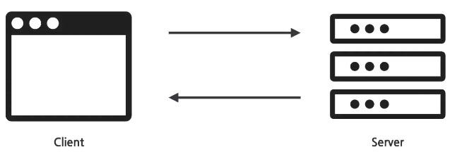  

<br/>

hello world 출력 과정  

<br/>

- 스프링 부트 실행
- src - main - java - 기본패키지 - 메인 메소드를 가진 클래스 실행 (Run)
- Tomcat started on port(s) 8080 (http) → 웹 서버 실행 (동작)
- localhost:8080 → 내 컴퓨터의 서버 주소:포트번호, 포트번호 8080에서
  스프링 부트가 동작
- localhost:8080/hello.html → 'hello world' 출력 → 내 컴퓨터의 8080 
  번호에서 수행되고 있는 서버에게 hello.html 파일 요청  
  localhost:8080/hello.html  : 내 컴퓨터의 8080 번호에서 수행되고 있는 서버에게 hello.html 파일 요청
- src - main  - resources - static - hello.html → static
  폴더에서 파일을 찾아서 그 안의 HTML 코드를 응답으로 전송  

<br/>

### 뷰 템플릿의 필요성과 머스테치  

<br/>

- 웹페이지의 변수를 활용하는 뷰 템플릿과 분야별 담당자를 나누는 MVC 패턴
- 사용자 수마다 생성되는 페이지 ? → 화면을 담당하는 기술인 뷰 템플릿을 통해 극복
- 뷰 템플릿 : 웹 페이지를 하나의 틀로 만들고 변수를 삽입해 틀이 되는 페이지가 
- 변수의 값에 따라서 수많은 페이지로 변화 
- 스프링 부트의 머스테치 (Mustache) : 뷰 템플릿을 만드는 도구 ( Thymeleaf , JSP )
- 뷰 템플릿에는 처리 과정을 담당하는 Controller와 데이터를 관리하는 Model가 존재
- MVC 패턴 : 화면, 처리, 데이터를 각 담당자 별로 나누는 기법

  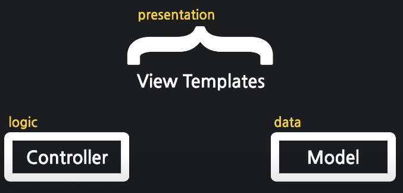  

  앞에 글자를 따서 MVC 라 부름.   
  
  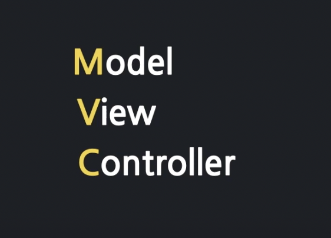

<br/>

이제 지난번 생성했던 firstproject 를 intelliJ를 사용하여 오픈한다.  

<br/>

뷰 템플릿의 위치는  

프로젝트명 -> src -> main -> resources -> templates 에  생성한다.  

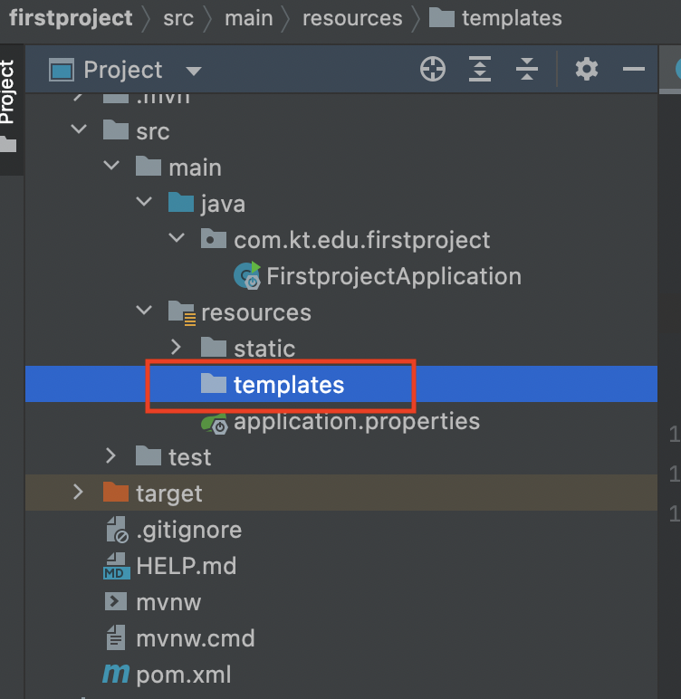  

<br/>

마우스 오른쪽 버튼 클릭하고 New File 선택하고 greetings.mustache 생성한다.  

제일 처음 생성하면 mustache 화일을 인식하지 못한다. plugin 설치 필요.  

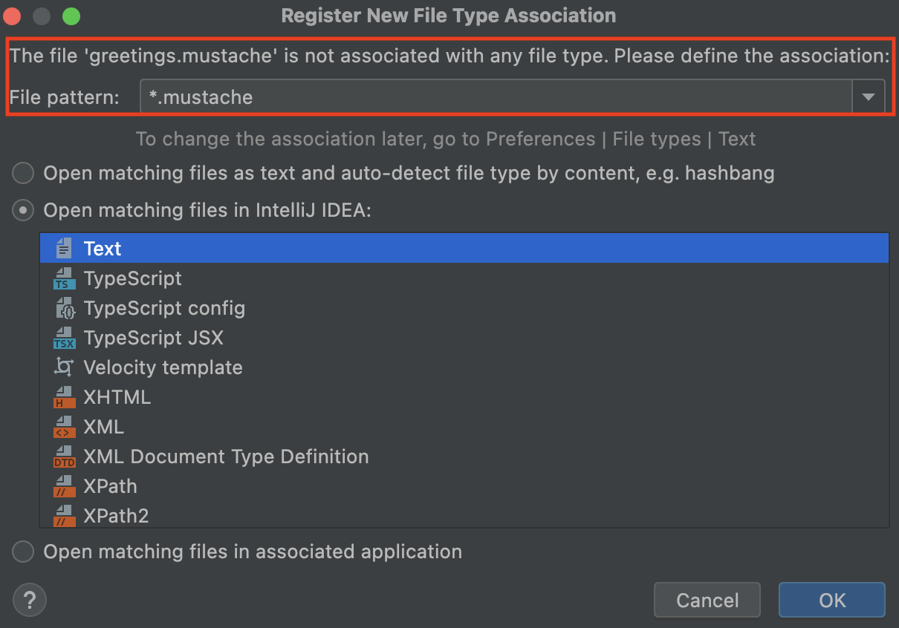  

<br/>

IntelliJ 에서 Help -> Find Action 으로 이동한다.  

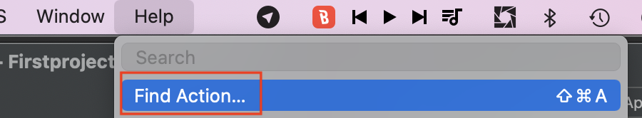  

<br/>

plugins입력하고 엔터를 친다.  

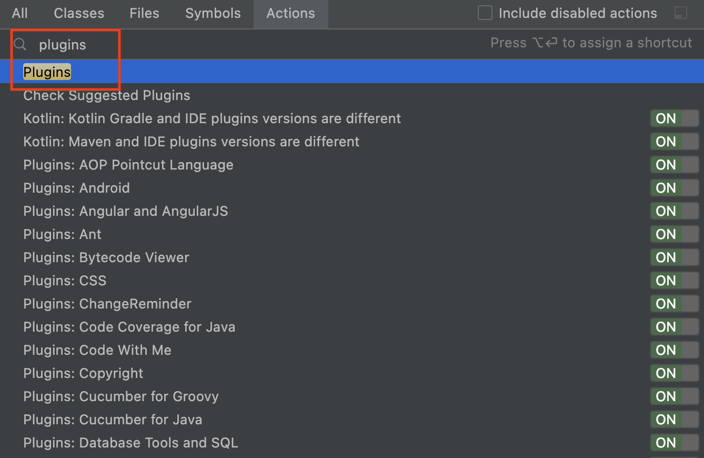  

<br/>

market place를 선택 한후 mustache를 입력하면 아래와 같이 나오고 첫번째 항목 선택후 Install 한다.  

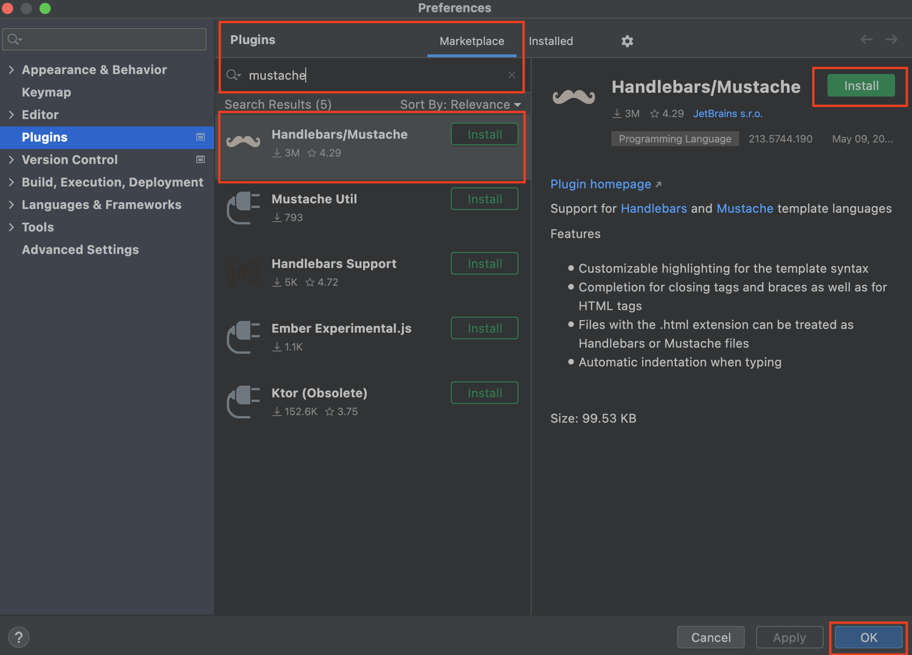  

<br/>

다시 한번 greetings.mustache 생성을 해보면 에러 없이 생성이 된다.    

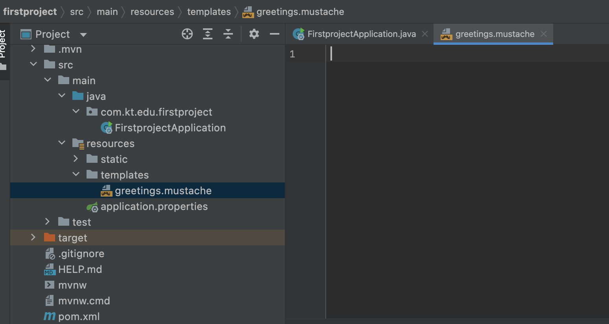

doc를 입력하고 tab을 누르면 자동으로 코드가 생성이 된다.  

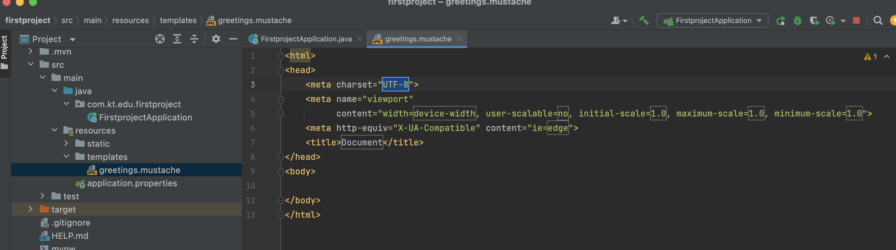

<br/>

body tag안에 값을 입력한다.

```html
<body>
    <h1>안녕하세요 반갑습니다.</h1> 
</body>
```  

<br/>

view template 이제 완성이 되었고 이것을 보기 위해서는 controller 가 필요하다.  

<br/>

### 컨트롤러 만들기   

<br/>  

컨트롤러는 아래와 같은 순서로 만든다.  

프로젝트명 -> src -> main -> java -> 기본 패키지 -> 'controller' package 생성   

기본 패키지명 위에서 마우으 오른쪽 키 클릭하고 New -> Package 선택  

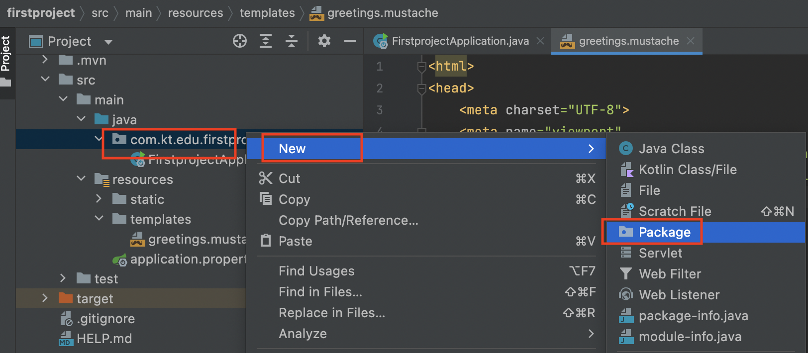  

아래와 같이 창이 뜨면 끝에 controller 이름을 붙여 넣는다.  

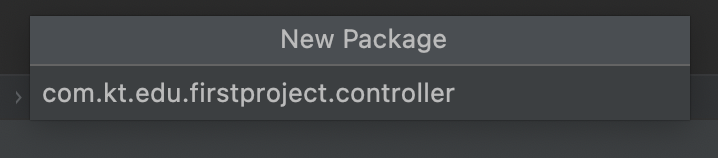  

<br/>

controller 안에 java class를 생성합니다.  
New -> Java Class 선택 하고 FirstController라는 이름으로 생성.  

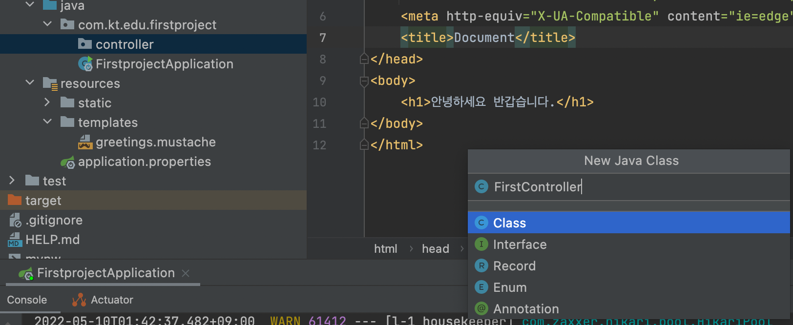  

생성한 view template과 controller를 연결해 주기 위한 코드를 작성합니다.  


class 위에 @Controller 라는 Annotation을 입력하면 자동으로 import 가 삽입됩니다.  

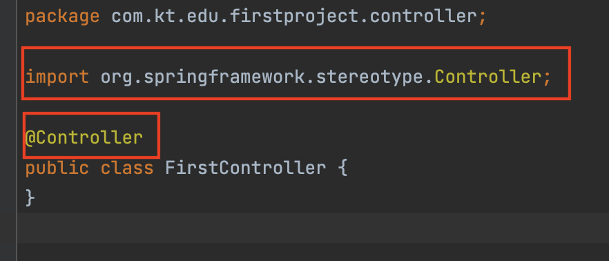  

Auto import가 안되면 Prefrences -> Editor -> General -> Auto import 에서 배제된 항목이 있는지 확인합니다.  

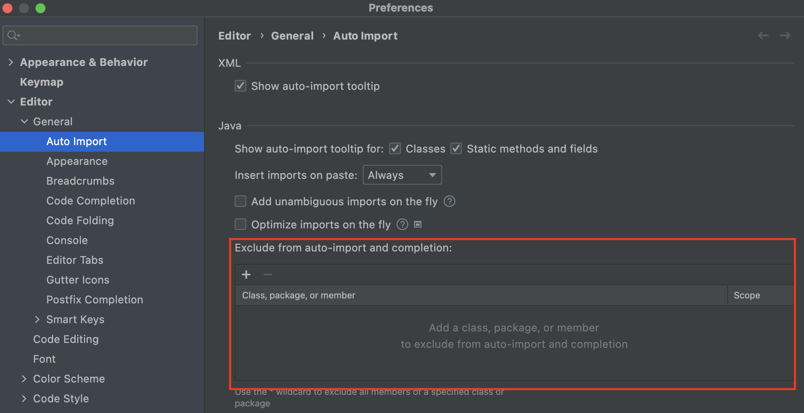  

<br/>

Method 를 추가합니다.  

url 연결 요청을 하기 위해 @GetMapping를 사용합니다.  ( Rest API )  

응답 페이지 설정 을 위해 return "페이지명" 을 입력합니다.  

이 페이지 명은 mustache의 화일명인 greetings 입니다.  
( 페이지명의 파일을 찾아서 브라우저로 전송  )

```java
package com.example.firstproject.controller;

import org.springframework.stereotype.Controller;
import org.springframework.web.bind.annotation.GetMapping;

@Controller
public class FirstController {
    @GetMapping("/hi")
    public String niceToMeetYou() {
        return "greetings";
    }
}
```  

자동으로 import 코드가 생성되지 않으면 import Class를 클릭한다.  

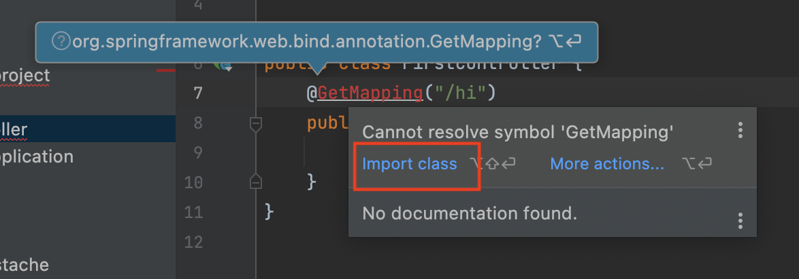 

서버실행은 메인 method인 FirstprojectApplication 에서 실행하는데 이미 서비스가 기동되어 있으면 rerun (재시작) 아이콘을 한다.  

<br/>

web browser에서 http://localhost:8080/hi 를 입력하면 에러 메시지를 볼 수 있다.  

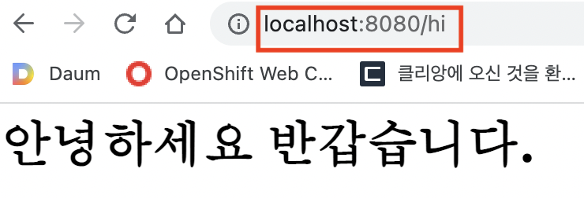   

GetMapping의 옆에 지구본 모양을 클릭하면 API를 테스트 할수 있는 기능이 있다.   

Generate request in HTTP Client를 클릭한다.  

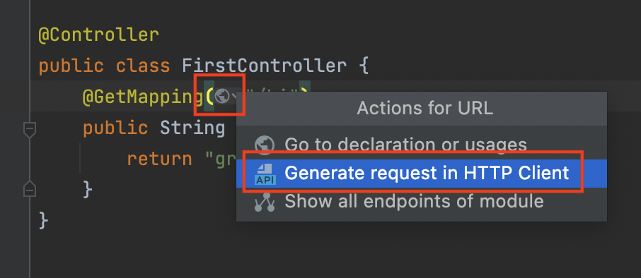

<br/>

Rest API를 테스트 할수 있는 화면이 나오고 왼쪽 녹색 화살표를 클릭하면 테스트가 진행이되고 아래 콘솔 화면에 결과 값이 나온다.  

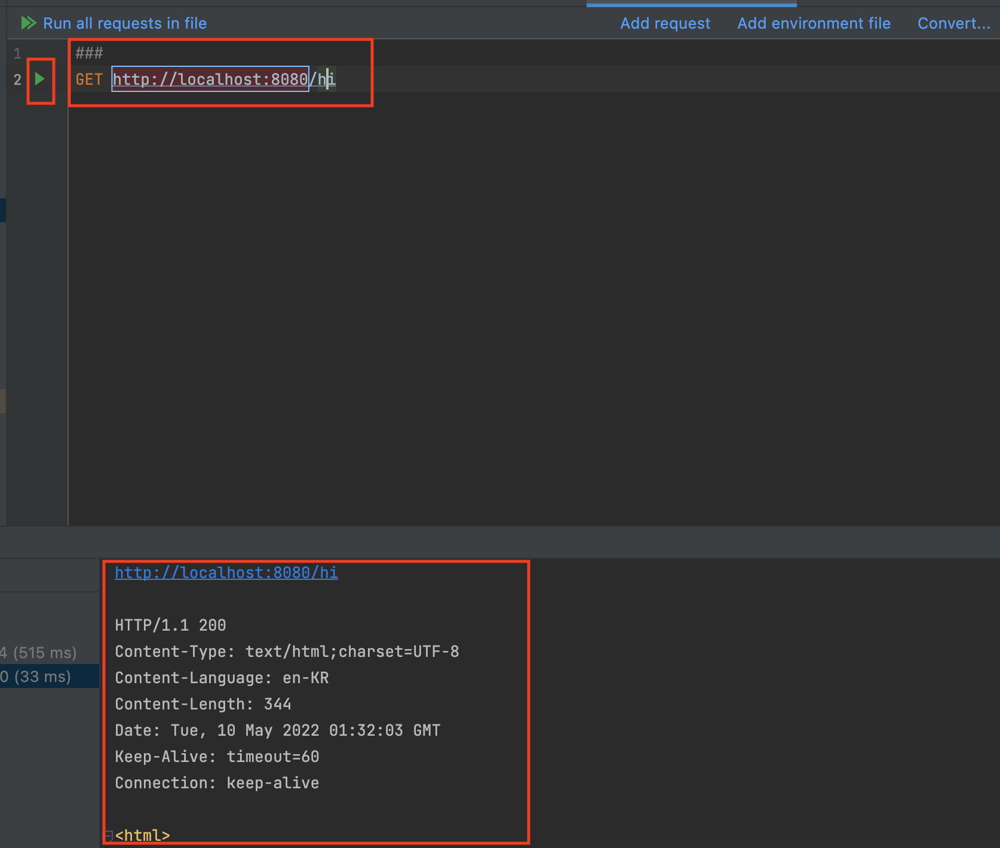   

<br/>

데이터  흐름은 다음과 같다.  
 
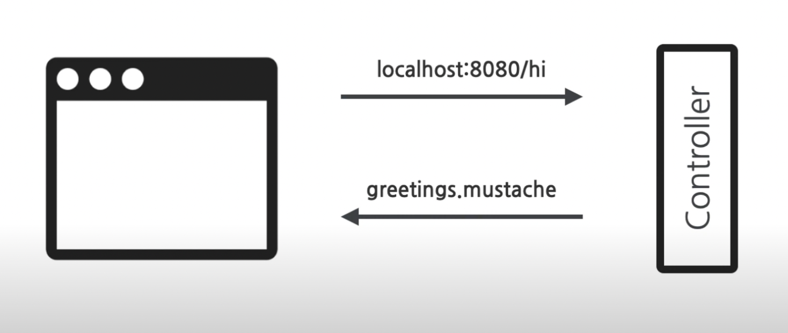

이제 뷰페이지에 변수를 삽입을 해 봅니다.  

mustache 화일에서 아래와 같이 {{변수이름}} 을 사용하여 수정합니다.  

```html
<body>
    <h1>{{username}} 반갑습니다.</h1>
</body>
```  

위와 같이 설정하고 재시작 버튼 클릭 한 후 브라우저에서 실행을 하면 아래와 같이 에러가 발생합니다.  

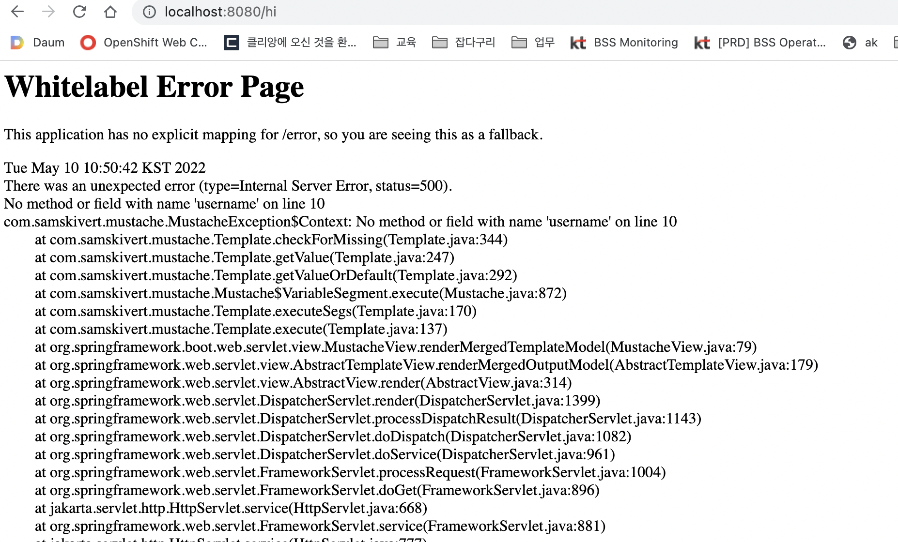  

username 이라는 변수를 못 찾아서 에러가 발생했고 모델을 만들어서 에러를 제거 해야 합니다.  

<br/>

### 모델 만들기   

<br/>  

페이지에 변수 삽입 + 템플릿 변수를 활용하기 위해 모델을 사용합니다.  

Controller에 Model 받아오기 위해 파라미터에 추가 합니다.  

```java
package com.example.firstproject.controller;

import org.springframework.stereotype.Controller;
import org.springframework.ui.Model;
import org.springframework.web.bind.annotation.GetMapping;

@Controller
public class FirstController {
    @GetMapping("/hi")
    public String niceToMeetYou(Model model) {
        model.addAttribute("username", "jake lee"); //변수 등록
        return "greetings";
    }
}
```  
<br/>

Model class를 인식하지 못하여 붉은색으로 표시되며 import class를 클릭하면 import 가 삽입됩니다.  

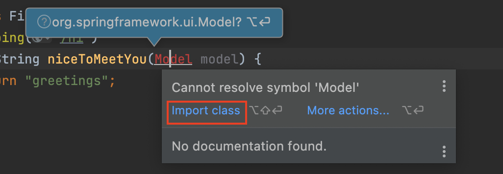  

재시작 아이콘을 클릭하여 재기동 하고 웹 브라우저에서 확인 합니다.  

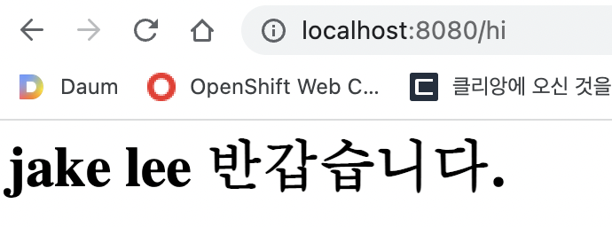 

<br/>

전체 흐름은 다음과 같다.  

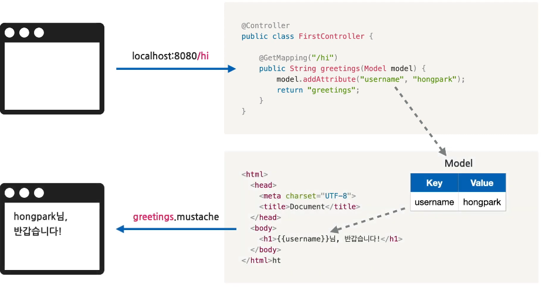 


<br/>

## 데이터 생성 with JPA

<br/>

### JPA 

<br/>

JPA란 자바 ORM(Object Relational Mapping) 기술에 대한 API 표준 명세를 의미합니다.  

JPA는 특정 기능을 하는 라이브러리가 아니고, ORM을 사용하기 위한 인터페이스를 모아둔 것입니다.  

JPA는 자바 어플리케이션에서 관계형 데이터베이스를 어떻게 사용해야 하는지를 정의하는 방법중 한 가지 입니다.  

JPA는 단순히 명세이기 때문에 구현이 없습니다.  

JPA를 정의한 javax.persistence 패키지의 대부분은 interface , enum , Exception, 그리고  Annotation 들로 이루어져 있습니다.  

JPA의 핵심이 되는 EntityManager 는 아래와 같이 javax.persistence 패키지 안에 interface 로 정의되어 있습니다.  

JPA를 사용하기 위해서는 JPA를 구현한 Hibernate, EclipseLink, DataNucleus 같은 ORM 프레임워크를 사용해야 합니다.

우리가 Hibernate를 많이 사용하는 이유는 가장 범용적으로 다양한 기능을 제공하기 때문입니다.

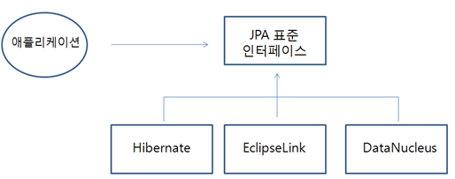 

<br/>

### Hibernate 

<br/>

Hibernate는 JPA의 구현체 중 하나입니다.  

Hibernate는 SQL을 사용하지 않고 직관적인 코드(메소드)를 사용해 데이터를 조작할 수 있습니다.

Hibernate가 SQL을 직접 사용하지 않는다고 해서 JDBC API를 사용하지 않는 것은 아닙니다.

Hibernate가 지원하는 메소드 내부에서는 JDBC API가 동작하고 있으며, 단지 개발자가 직접 SQL을 작성하지 않을 뿐 입니다.

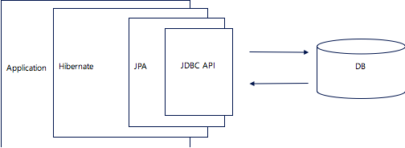   

JPA와 Hibernate는 마치 자바의 interface와 해당 interface를 구현한 class와 같은 관계입니다.   

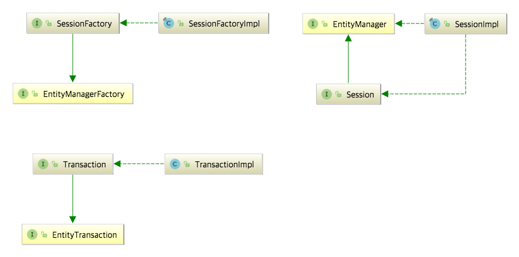   

위 사진은 JPA와 Hibernate의 상속 및 구현 관계를 나타낸 것입니다.  

JPA의 핵심인 EntityManagerFactory , EntityManager , EntityTransaction 을 Hibernate에서는 각각 SessionFactory , Session , Transaction 으로 상속받고 각각 Impl로 구현하고 있음을 확인할 수 있습니다.  

<br/>

### Spring Data JPA 

<br/>

Spring Data JPA는 Spring에서 제공하는 모듈 중 하나로 JPA를 쉽고 편하게 사용할 수 있도록 도와줍니다.  

기존에 JPA를 사용하려면 EntityManager를 주입받아 사용해야 하지만,  
Spring Data JPA는 JPA를 한단계 더 추상화 시킨 Repository 인터페이스를 제공합니다.  

Spring Data JPA가 JPA를 추상화 했다는 말은, Spring Data JPA의 Repository의 구현에서 JPA를 사용하고 있다는 것입니다.  

사용자가 Repository 인터페이스에 정해진 규칙대로 메소드를 입력하면,  
Spring이 알아서 해당 메소드 이름에 적합한 쿼리를 날리는 구현체를 만들어서 Bean으로 등록해줍니다.  

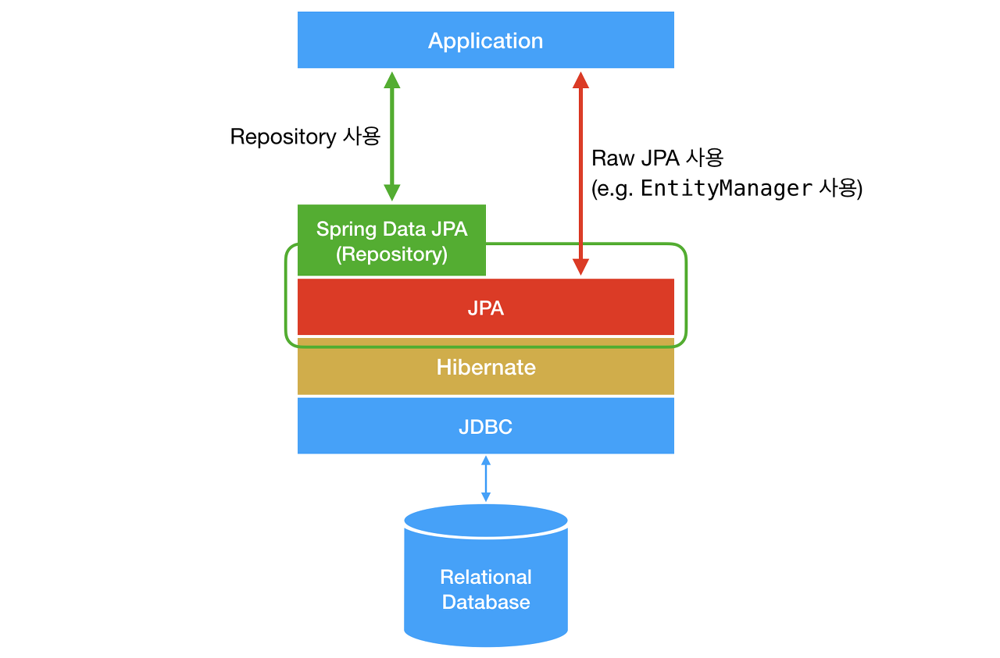

<br/>

### Hibernate와 Spring Data JPA의 차이점
 
<br/>

하이버네이트는 JPA 구현체이고, 스프링 데이터 JPA는 JPA에 대한 데이터 접근의 추상화라고 말할 수 있습니다.  

스프링 데이터 JPA는 GenericDao라는 커스텀 구현체를 제공합니다. 이것의 메소드의 명칭으로 JPA 쿼리들을 생성할 수 있습니다.   

Spring Data를 사용하면 Hibernate, Eclipse Link 등의 JPA 구현체를 사용할 수 있습니다.  

또 한가지는 @Transaction 어노테이션을 통해 트랜잭션 영역을 선언하여 관리할 수 있습니다.  

Hibernate는 낮은 결합도의 이점을 살린 ORM 프레임워크로써 API 레퍼런스를 제공합니다.  

여기서 반드시 기억해야할 점은 Spring Data JPA는 항상 Hibernate와 같은 JPA 구현체가 필요합니다.  

<br/>

### Spring Data JPA로 데이터 생성하기  
 
<br/>

이번 예제는 H2 라고하는 SpringBoot에서 제공하는 메모리 DB를 사용합니다.  

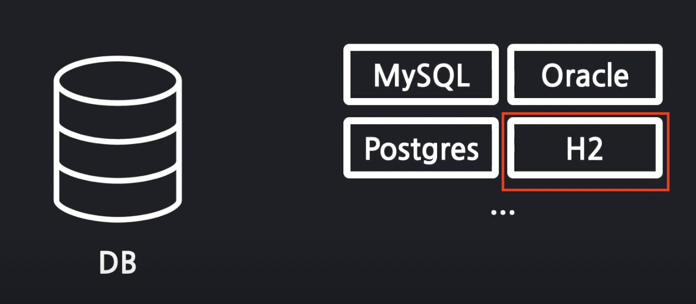  


Database는 SQL만 이해를 하고 Java 라는 언어를 이해를 하지 못한다.  

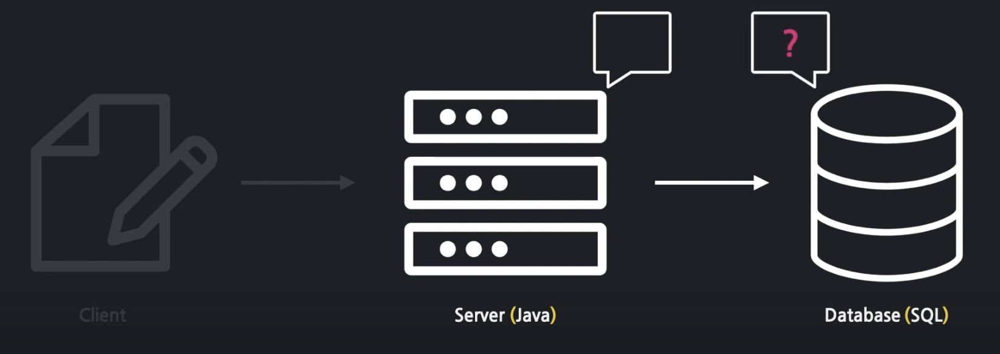  

Java에서 DB에서 명령하기 위해 JPA를 사용한다.  

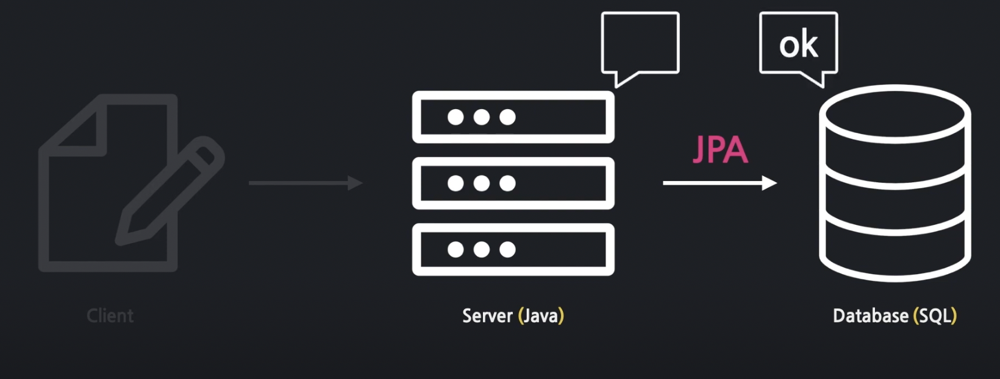  

<br/>

JPA 와 H2 DB 를 사용하기 위해서는 project 구성시 Dependency에 추가 해야한다.  

  

JPA 핵심 도구는 Entity 와 Repository로 구성.  

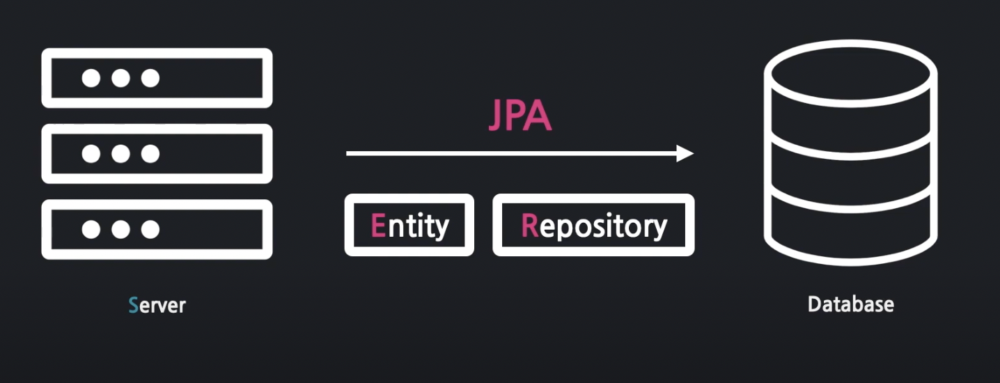  

Entity는 Java 객체를 DB가 이해 할수 있도록 규격화 한다.  

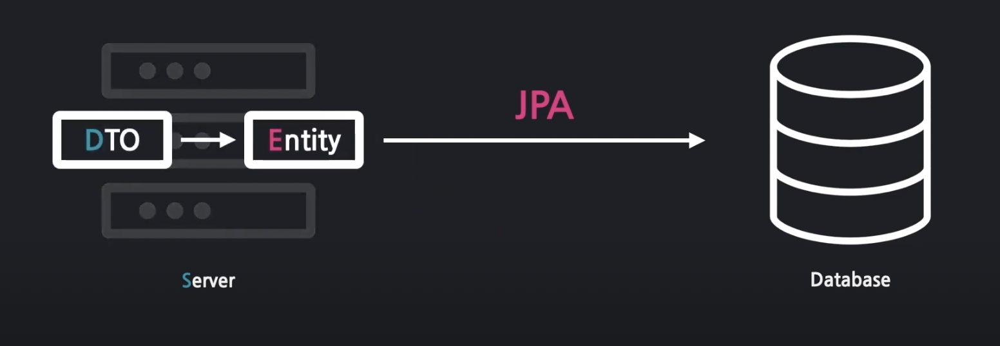  

Repository는 DB에 전달하고 실행하는 기능을 담당한다.  

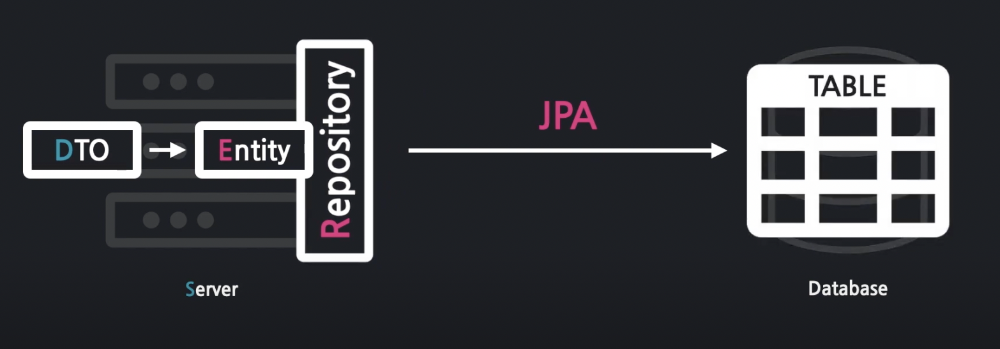

이제 DTO를 Entity로 변환하고 Repository를 통해 DB에 저장하는 시나리오를 개발해 본다.  

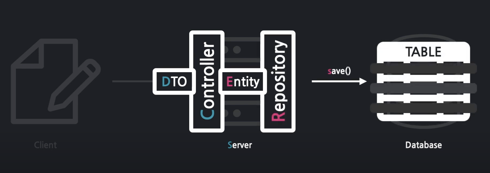  

- DTO : DTO(Data Transfer Object) 는 계층 간 데이터 교환을 하기 위해 사용하는 객체로, DTO는 로직을 가지지 않는 순수한 데이터 객체(getter & setter 만 가진 클래스)입니다.  

- VO : VO(Value Object) 값 오브젝트로써 값을 위해 쓰입니다.   

  read-Only 특징(사용하는 도중에 변경 불가능하며 오직 읽기만 가능)을 가집니다.  

  DTO와 유사하지만 DTO는 setter를 가지고 있어 값이 변할 수 있습니다.

<br/>

1단계 : Form에서 데이터를 DTO를 통해 Controller로 가져온다.  

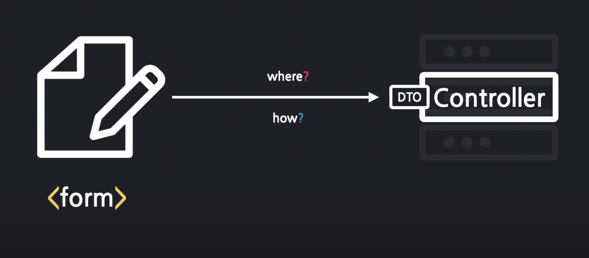  

<br/>

입력 폼을 만듭니다.  

../templates/articles/new.mustache
```html
<form class="container" action="/articles/create" method="post">
    <div class="mb-3">
        <label class="form-label">제목</label>
        <!-- 입력값: title -->
        <input type="text" class="form-control" name="title">
    </div>
    <div class="mb-3">
        <label class="form-label">내용</label>
        <!-- 입력값: content -->
        <textarea class="form-control" rows="3" name="content"></textarea>
    </div>
    <button type="submit" class="btn btn-primary">Submit</button>
</form>
```

<br/>

ArticleController를 생성한다.  

../controller/ArticleController
```java
package com.example.firstproject.controller;
import org.springframework.stereotype.Controller;
import org.springframework.web.bind.annotation.GetMapping;
@Controller
public class ArticleController {
    @GetMapping("/articles/new")
    public String newArticleForm() {
        return "articles/new";
    }
}
```  

<br/>

폼 데이터를 전송한다.    

../templates/articles/new.mustache
```html
<form class="container" action="/articles/create" method="post">
    <div class="mb-3">
        <label class="form-label">제목</label>
        <!-- 입력값: title -->
        <input type="text" class="form-control" name="title">
    </div>
    <div class="mb-3">
        <label class="form-label">내용</label>
        <!-- 입력값: content -->
        <textarea class="form-control" rows="3" name="content"></textarea>
    </div>
    <button type="submit" class="btn btn-primary">Submit</button>
</form>
```  

<br/>

폼 데이터를 받는다.    


../controller/ArticleController
```java
package com.kt.edu.firstproject.controller;

import com.kt.edu.firstproject.dto.ArticleForm;
import org.springframework.stereotype.Controller;
import org.springframework.web.bind.annotation.GetMapping;
import org.springframework.web.bind.annotation.PostMapping;

@Controller
public class ArticleController {
    @GetMapping("/articles/new")
    public String newArticleForm() {
        return "articles/new";
    }
    @PostMapping("/articles/create")
    public String createArticle(ArticleForm form) {
        System.out.println(form.toString());
        return "";
    }
}
```  

<br/>

DTO를 생성한다.  

../dto/ArticleForm
```java
package com.kt.edu.firstproject.dto;

public class ArticleForm {
    private String title;
    private String content;

    public ArticleForm(String title, String content) {
        this.title = title;
        this.content = content;
    }
    @Override
    public String toString() {
        return "ArticleForm{" +
                "title='" + title + '\'' +
                ", content='" + content + '\'' +
                '}';
    }
}
```  

<br/>

2단계 : DTO를 Entity 로 변환한다.    

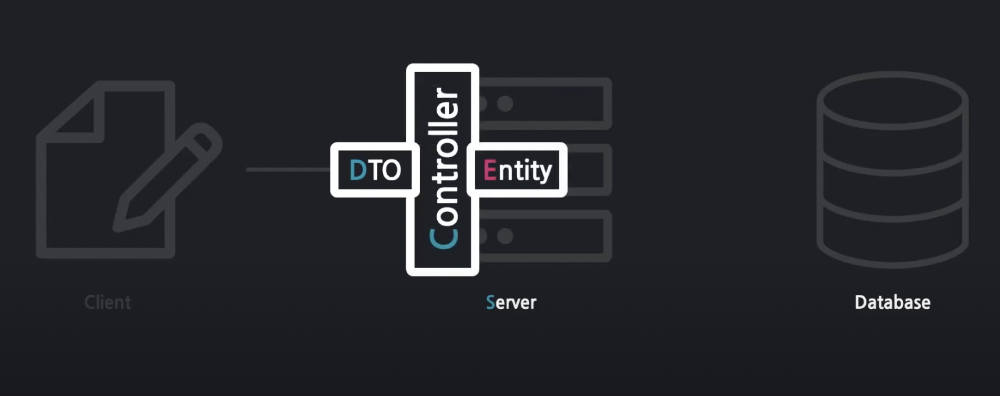  

<br/>

Entity를 생성한다.  

../controller/ArticleController
```java
...
@Controller
public class ArticleController {
    ...
    @PostMapping("/articles/create")
    public String createArticle(ArticleForm form) {
        System.out.println(form.toString());
        // 1. Dto를 Entity 변환
        Article article = form.toEntity();
        // 2. Repository에게 Entity를 DB로 저장하게 함
        return "";
    }
}
```   

Article 라인에 붉은 전구가 들어오고 클릭하여 create class를 클릭한다.  

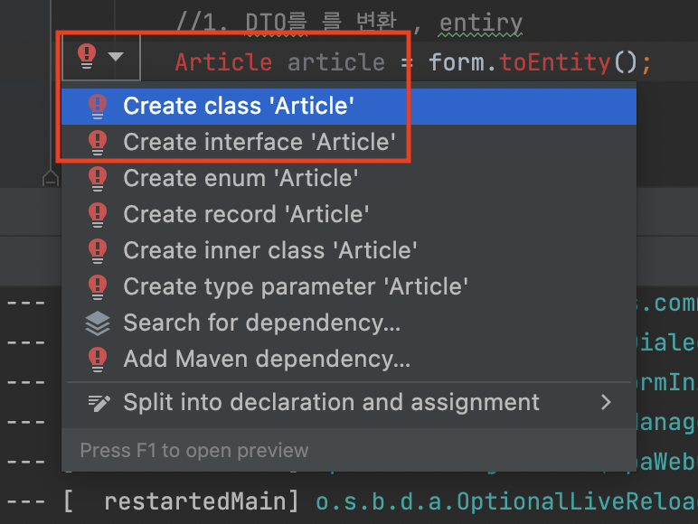  


Destination Package에는 entity 를 입력한다.  

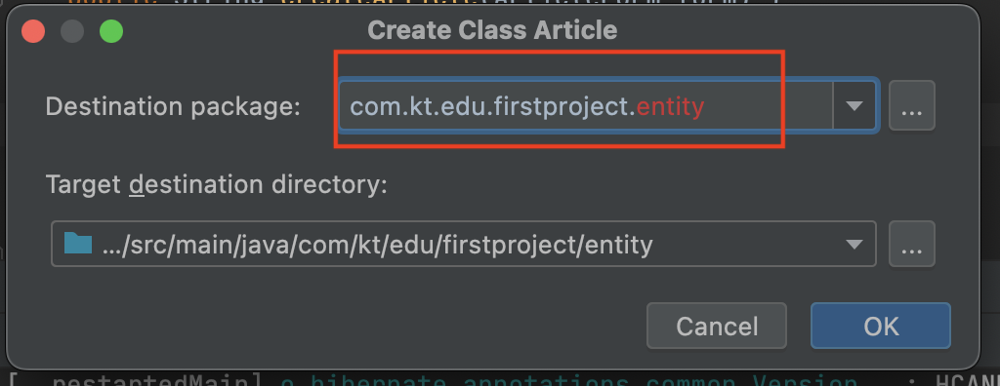  

entity 폴더가 생성이 되고 Article이 생성된 것을 확인 할 수 있다.  

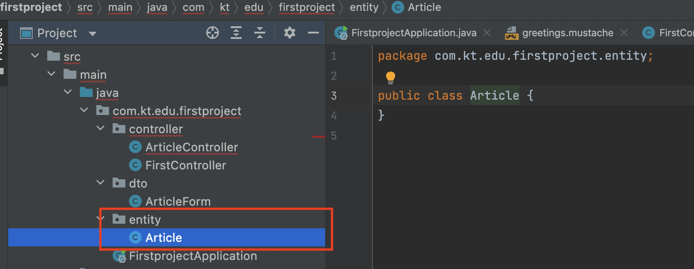  

<br/>

Article class에 entity를 작성한다.  DTO와 유사하다.  

../entity/Article
```java
package com.kt.edu.firstproject.entity;

import jakarta.persistence.Column;
import jakarta.persistence.Entity;
import jakarta.persistence.GeneratedValue;
import jakarta.persistence.Id;

@Entity //DB가 해당 객체를 인식 가능
public class Article {

    @Id   // 대표 값
    @GeneratedValue // 자동생성

    private Long id;

    @Column
    private String title;

    @Column
    private String content;
    public Article(Long id, String title, String content) {
        this.id = id;
        this.title = title;
        this.content = content;
    }


    @Override
    public String toString() {
        return "Article{" +
                "id=" + id +
                ", title='" + title + '\'' +
                ", content='" + content + '\'' +
                '}';
    }
}
```

<br/>

Form 에  Entity로 변환하기 위해 toEntity Method를 생성한다.  

toEntity에 마우스를 가지고 가면 create method 가 나오고 클릭하면 ArticleForm으로 이동하여 method를 만들수 있다.  

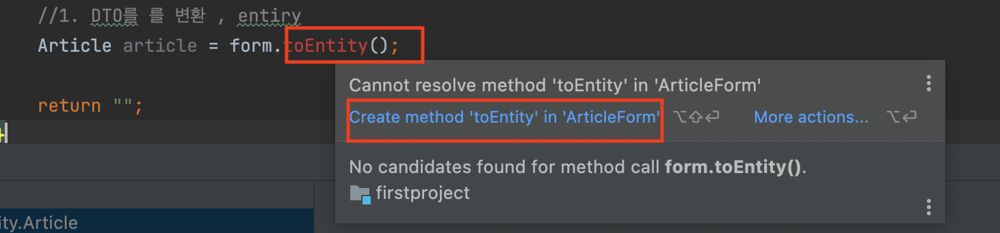  

<br/>

../dto/ArticleForm
```java
package com.example.firstproject.dto;
import com.example.firstproject.entity.Article;
public class ArticleForm {
    ...
    public Article toEntity() {
        return new Article(null, title, content);
    }
}
```  

<br/>

3단계 : 데이터를 저장한다.      

<br/>

ArticleRepository 에  Repository를 추가한다.  

<br/>

../controller/ArticleRepository
```java
...
@Controller
public class ArticleController {
    ...
    private ArticleRepository articleRepository; //추가

    @PostMapping("/articles/create")
    public String createArticle(ArticleForm form) {
        System.out.println(form.toString());
        // 1. Dto를 Entity 변환
        Article article = form.toEntity();
        // 2. Repository에게 Entity를 DB로 저장하게 함
        Article saved = articleRepository.save(article); //추가
        return "";
    }
}
```   

<br/>

Repository를 작성한다.  
먼저 repository 패키지를 생성한다.  
- 이름 : com.kt.edu.firstproject.repository


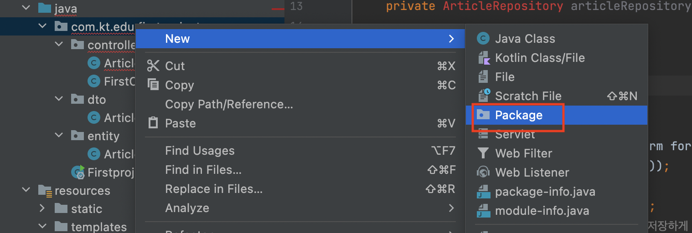  

<br/>

repository 패키지 위에서 마우스 오른쪽 버튼을 눌러 ArticleRepository 라는 `Interface` 를 생성한다.  

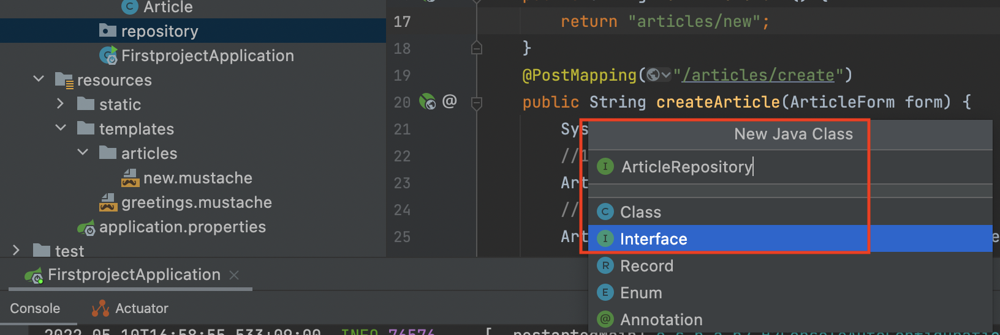  

extends 라는 구문은 상속을 받는 다는 의미이며 여기서는 CRUD를 새로 구현할 필요가 없다.  

../repository/ArticleRepository  
```java
ppackage com.kt.edu.firstproject.repository;

import com.kt.edu.firstproject.entity.Article;
import org.springframework.data.repository.CrudRepository;

public interface ArticleRepository extends CrudRepository<Article, Long> {
}
```  

ArticleRepository 가 작성이 되면 ArticleController 로 이동하여 에러난 부분을 수정한다.   ( import class 등 )    

```java
@Controller
public class ArticleController {
// 이전
    private ArticleRepository articleRepository;
```  
<br/>

추가적으로 repository 객체를 생성하지 않고 AutoWired를 추가하면
springboot가 알아서 처리한다.  

```java
@Controller
public class ArticleController {
    // 이후
    @Autowired // 스프링 부트가 미리 생성해놓은 리파지터리 객체를 가져옴(DI)
    private ArticleRepository articleRepository;
```  

<br/>

테스트를 하기 위해 System.out 로직을 삽입한다.  

../controller/ArticleController
```java
package com.kt.edu.firstproject.controller;

import com.kt.edu.firstproject.dto.ArticleForm;
import com.kt.edu.firstproject.entity.Article;
import com.kt.edu.firstproject.repository.ArticleRepository;
import org.springframework.beans.factory.annotation.Autowired;
import org.springframework.stereotype.Controller;
import org.springframework.web.bind.annotation.GetMapping;
import org.springframework.web.bind.annotation.PostMapping;

@Controller
public class ArticleController {

    @Autowired // 스프링 부트가 미리 생성해놓은 리파지터리 객체를 가져옴(DI)
    private ArticleRepository articleRepository;

    @GetMapping("/articles/new")
    public String newArticleForm() {
        return "articles/new";
    }
    @PostMapping("/articles/create")
    public String createArticle(ArticleForm form) {
        System.out.println(form.toString());
        //1. DTO를 를 변환 , entity
        Article article = form.toEntity();
        System.out.println(article.toString());
        
        // 2. Repository에게 Entity를 DB로 저장하게 함
        Article saved = articleRepository.save(article);
        System.out.println(saved.toString());

        return "";
    }
}
```  

<br/>

4단계 : 데이터를 저장 확인.      

<br/>  

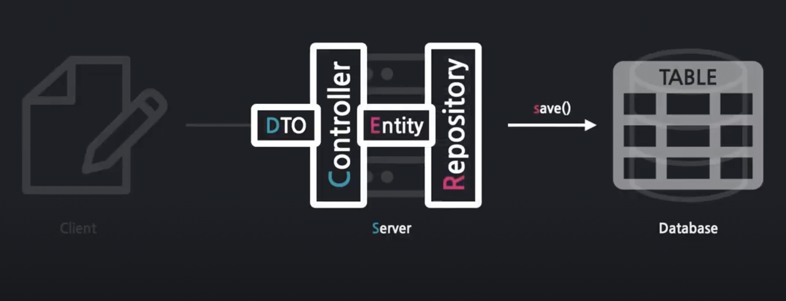  

프로젝트를 재시작하고 웹 브라우저에서 값을 입력하고 submit을 한다.  

  

IntelliJ의 console에 id 값이 1로 되어 있는것을 확인 할 수 있다.  

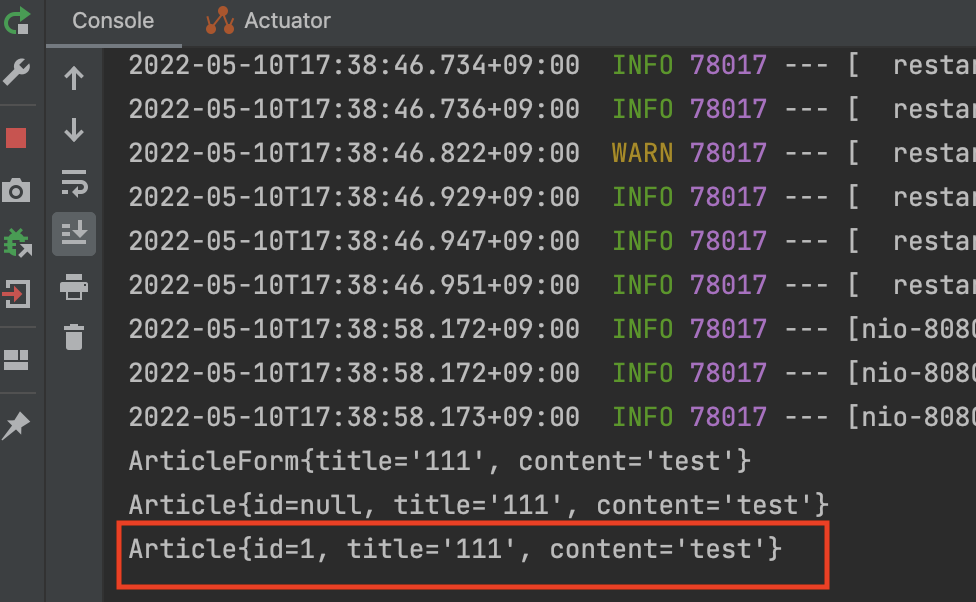  

한번더 submit을 하면 id 가 2로 증가가 된다.  

<br/>

5단계 : H2 DB 접속 및 설정      

<br/> 

SpringBoot는 내부적으로 H2 Database 를 사용하며 H2 DB 접근을 위해서는 아래 설정값을 추가한다.  

../resources/application.properties  
```bash
# h2 DB, 웹 콘솔 접근 허용
spring.h2.console.enabled=true
```  

프로젝트 재기동을 하고 웹 브라우저에서 http://localhost:8080/h2-console 를 입력한다.   

처음부터 접속하면 바로 에러가 발생을 한다.  

IntelliJ 화면에서 찾기 ( 맥 기준 : cmd + F) 사용하여 jdbc로 검색하면 아래 내용을 확인 할 수 있다.  

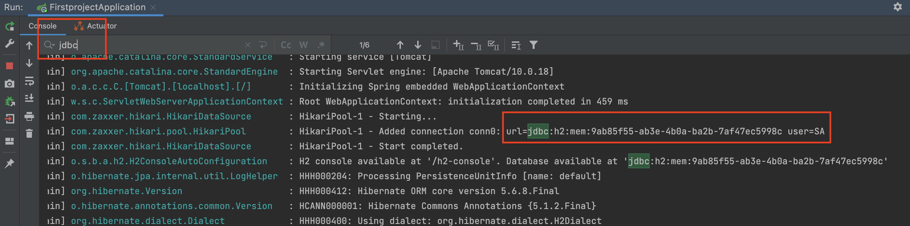 

url 을 복사해사 웹 브라우저의 h2 web admin의 JDBC URL 에 붙여 넣기하고 connect 한다.  ( url은 재기동시 계속 변경된다. 향후에 고정 하는 방법 설명 예정 )  

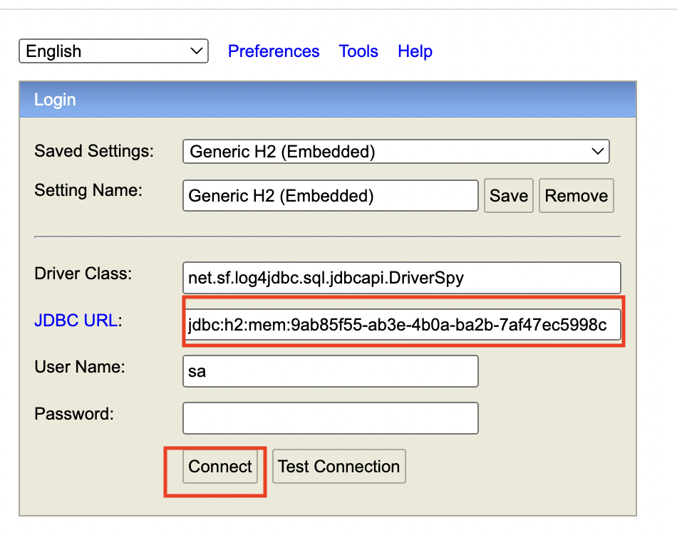  

접속이 성공하면 아래와 같이 나온다.  
ARTICLE 테이블을 선택 하고 RUN 버튼을 클릭하여 데이터를 조회한다.  

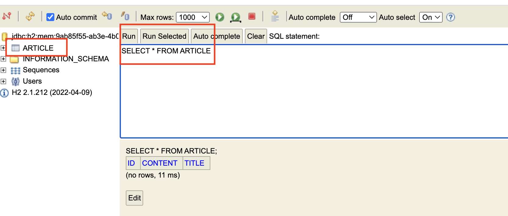  

데이터가 아무것도 조회 되지 않는다. H2 DB는 메모리 DB이기 때문에 재기동하면
데이터가 삭제가 된다.  

이제 웹에서 http://localhost:8080/articles/new 입력하고 다시 데이터를 보내본다.    

데이터 1건이 입력 된 것을 확인 할 수 있다.  

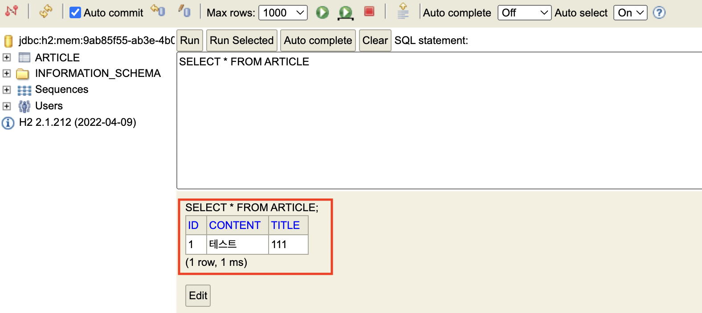  
