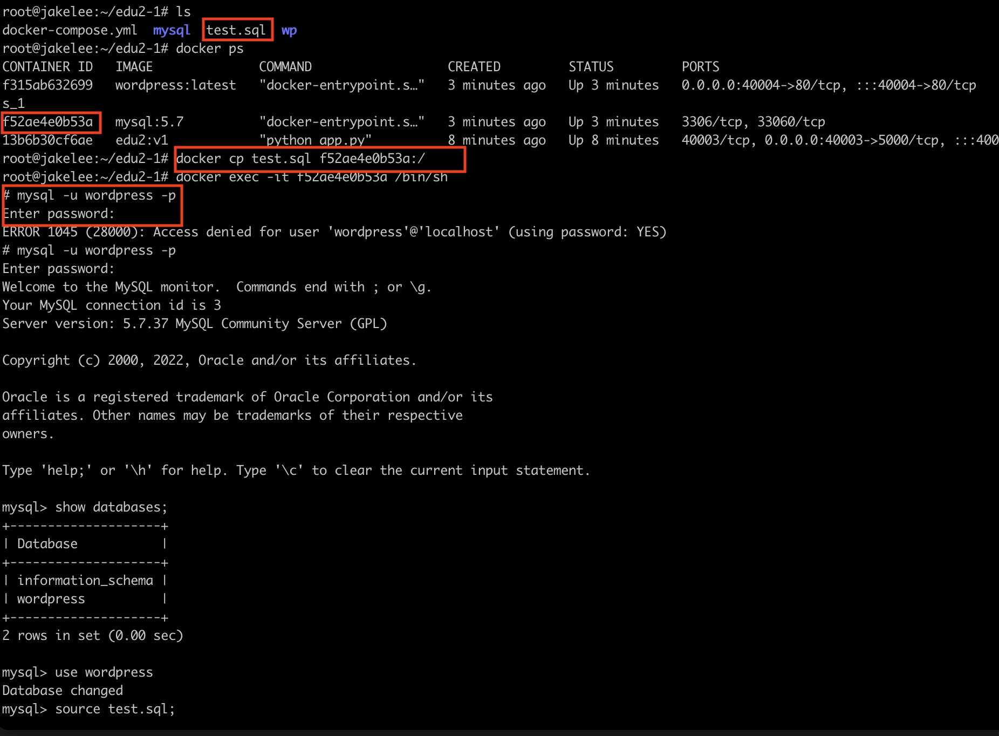
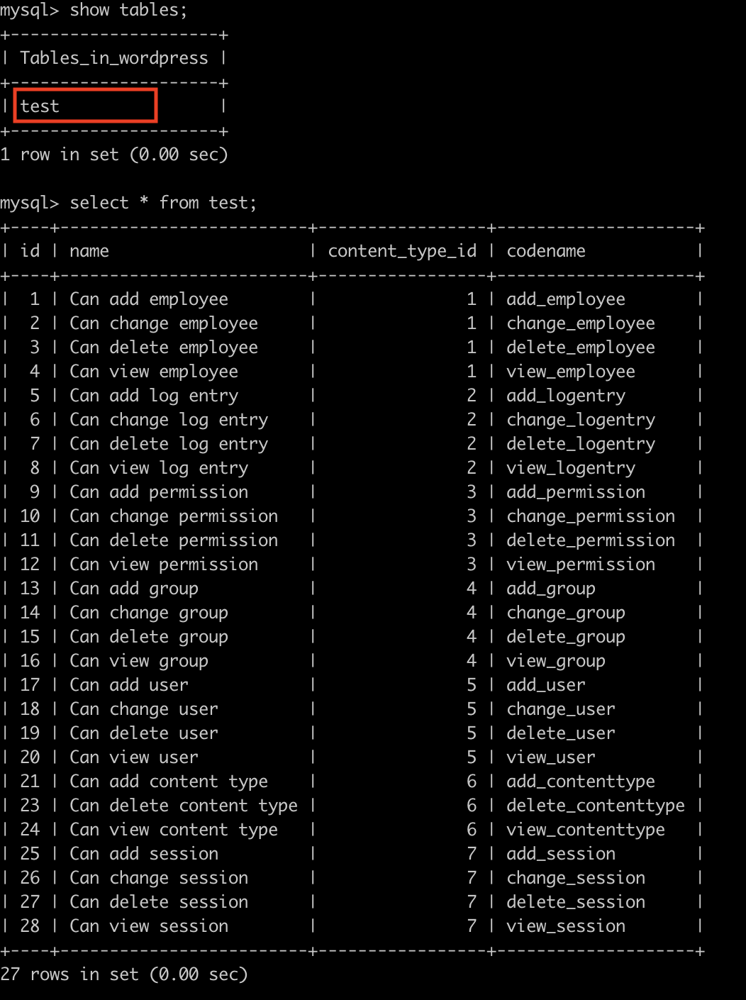
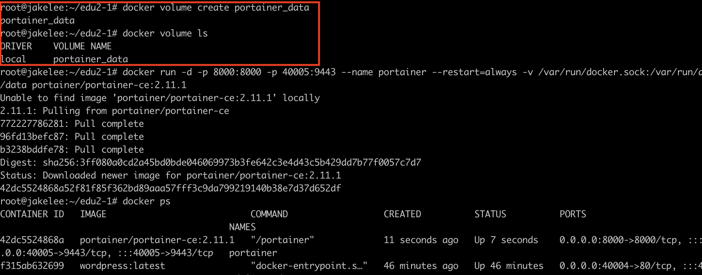
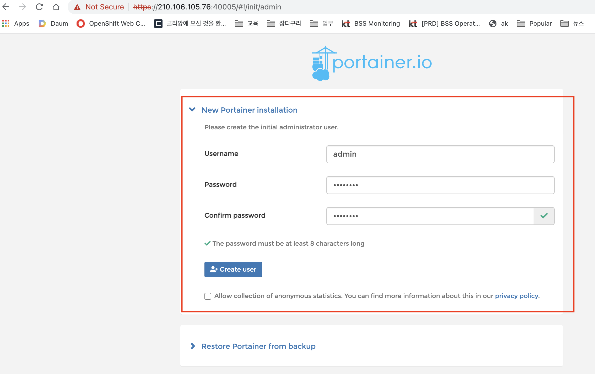
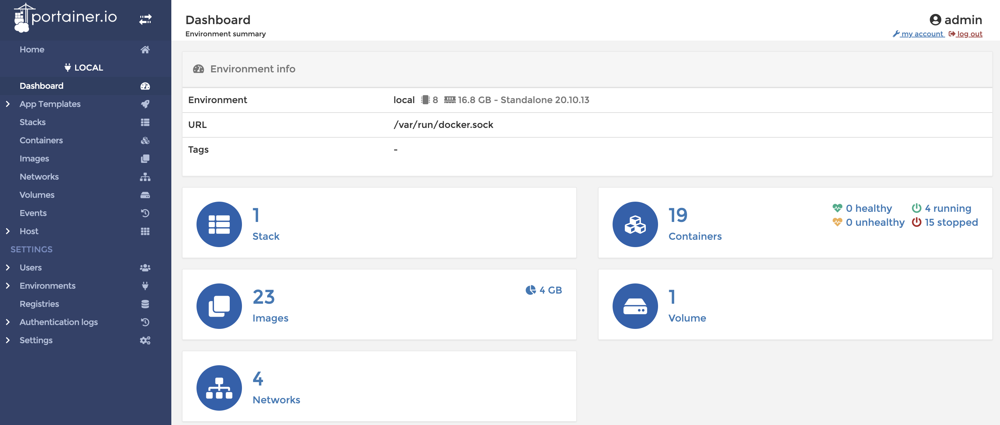
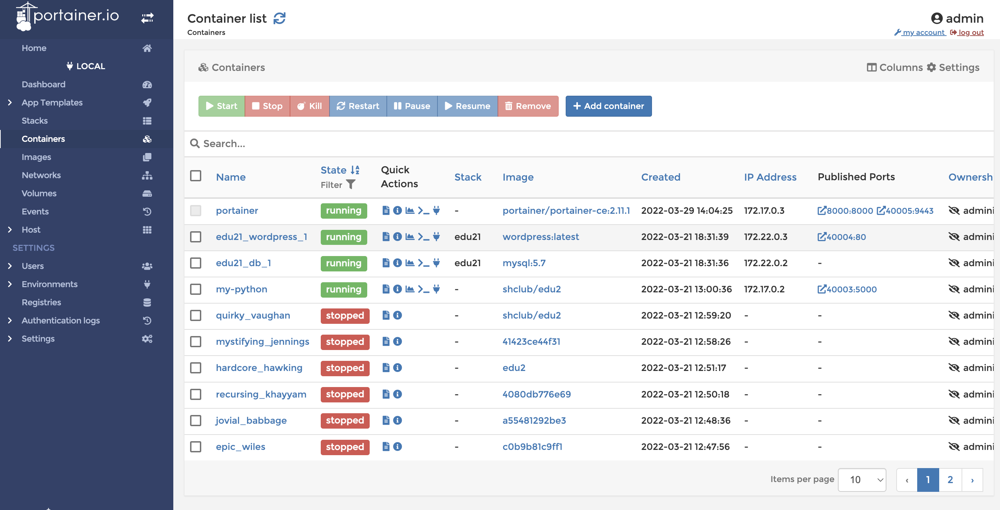

# Chapter 2 답안

<br/>

## 과제 1. 
docker compose로 구성한 mysql container  접속하여 로그인 한 후 wordpress db에 customer 테이블을 생성해 본다.

<br/>

## 과제2
mysql container  접속하여 로그인 한 후 wordpress db에 
아래 테이블 script를  로컬에 저장된 화일을 사용하여 test 테이블을 생성해 본다.    

https://github.com/shclub/edu1/blob/master/test.sql 화일을 다운 받는다.  


TIP : 화일 이동 방법은 cp 명령어 사용.  

호스트 -> 컨테이너
```bash
docker cp [host 파일경로] [container name]:[container 내부 경로]
```
컨테이너 -> 호스트  

```bash
docker cp [container name]:[container 내부 경로] [host 파일경로]
```
<br/>

###  < 답안 >

<br/>

해당 폴더에 test.sql 화일이 있는지 확인 하고 컨테이너 중에 mysql를 찾는다.  

```bash
ls
docker ps
```

docker cp 명령어를 사용하여 test.sql 화일을 컨테이너의 / 폴더에 복사한다.  
해당 컨테이너 안으로 들어간다.  
    
```bash
docker cp test.sql f52ae4e0b53a:/
docker exec -it f52ae4e0b53a /bin/sh
```  

컨테이너안에서 명령어로 mysql에 접속한다.  
id/패스워드는 docker-compose.yml에서 확인 가능  

```bash
mysql -u wordpress -p
Enter password:
```  

databases 목록을 확인하고 원하는 db를 선택하고   
source 명령어를 사용하여 sql문을 실행한다.   

```bash
show databases;
use wordpress;
source test.sql;
```   
테이블 목록을 확인하면 test 테이블이 생성된 걸 확인 할수있고 데이터를 조회해본다.  
    
```bash
show tables;
select * from test;
```  

  




## 과제4

<br/>

docker 컨테이너 GUI 관리 툴인 portainer를 설치하고 웹에서 접속하여
          모니터링한다.
   - url  참고 :  https://docs.portainer.io/v/ce-2.11/start/install/server/docker/linux
   - 웹 포트는 40005로 expose 한다 ( https 9443 포트 변경 필요 ).
   - 웹브라우저 접속은 https://(본인VM Public IP):40005  
     admin 비밀번호 신규로 생성 (8자리 이상) 한다.
<br/>

###  < 답안 >

<br/>

데이터를 저장하기 위해 도커 볼륨을 생성한다. 향후에 컨테이너의 폴더와 연결한다.  

```bash
docker volume create portainer_data
```  

로컬에 도커 볼륨이 생성되어 있는지 확인한다.  

```bash
docker volume ls
```  

https 포트인 9443만 40005로 변경한다.  

```bash
docker run -d -p 8000:8000 -p 40005:9443 --name portainer --restart=always -v /var/run/docker.sock:/var/run/docker.sock -v portainer_data:/data portainer/portainer-ce:2.11.1
```  

  

  

Getting Start를 선택하고 로컬 도커를 클릭한다.  
     


도커에서 관리하는 리소스 대쉬보드를 볼수 있다.   
     
  

컨테이너 항목을 선택하면 자세한 컨테이너 현황을 볼수 있다.   
     
  

도커 볼륨은 아래 명령어로 삭제 할 수 있다.   
 
```bash
docker volume prune
```

