#  ArgoCD Hands-on
 
ArgoCD 활용 방법에 대해서 실습한다.  

1. kubectl plugin 설치

2. Blue/Green 배포

3. Canary 배포

4. ArgoCD 계정 추가 및 권한 관리

5. kustomize 사용법   

6. ArgoCD remote Cluster 에서 배포 하기  

7. 참고 사이트 
    - https://potato-yong.tistory.com/138
    - https://teichae.tistory.com/entry/Argo-CD%EB%A5%BC-%EC%9D%B4%EC%9A%A9%ED%95%9C-BlueGreen-%EB%B0%B0%ED%8F%AC-3
    - canary : https://teichae.tistory.com/entry/Argo-CD%EB%A5%BC-%EC%9D%B4%EC%9A%A9%ED%95%9C-Canary-%EB%B0%B0%ED%8F%AC-4

<br/>

##  실습 전체 개요 


<br/>

### kubectl plugin 설치  

<br/>

Argo Rollout 기능을 사용하기 위해서 kubectl plugins을 설치한다.   

- Mac  
  ```bash 
  brew install argoproj/tap/kubectl-argo-rollouts
  ```  

- linux ( ubuntu )
  ```bash
  root@jakelee:~# curl -LO https://github.com/argoproj/argo-rollouts/releases/latest/download/kubectl-argo-rollouts-linux-amd64
    % Total    % Received % Xferd  Average Speed   Time    Time     Time  Current
                                  Dload  Upload   Total   Spent    Left  Speed
  100   166  100   166    0     0   5187      0 --:--:-- --:--:-- --:--:--  5187
  100   672  100   672    0     0  17684      0 --:--:-- --:--:-- --:--:-- 17684
  100 76.7M  100 76.7M    0     0   156M      0 --:--:-- --:--:-- --:--:--  399M
  ```  
  
  chmod로 권한을 부여하고 /usr/local/bin 폴더로 이동한다.

  ```bash
  root@jakelee:~# chmod +x ./kubectl-argo-rollouts-linux-amd64
  root@jakelee:~# sudo mv ./kubectl-argo-rollouts-linux-amd64 /usr/local/bin/kubectl-argo-rollouts
  ```  

설치가 완료되고 나서 버전을 확인 한다.  

```bash
root@jakelee:~# kubectl argo rollouts version
kubectl-argo-rollouts: v1.2.0+08cf10e
  BuildDate: 2022-03-22T00:25:11Z
  GitCommit: 08cf10e554fe99c24c8a37ad07fadd9318e4c8a1
  GitTreeState: clean
  GoVersion: go1.17.6
  Compiler: gc
  Platform: linux/amd64
```

<br/>

### Blue/Green 배포

<br/>

Blue/Green 배포란?  

참고 : https://youtu.be/qLlo7MAJvT0

<br/>

Blue-Green 배포는 애플리케이션 또는 마이크로서비스의 이전 버전에 있던 사용자 트래픽을 이전 버전과 거의 동일한 새 버전으로 점진적으로 이전하는 애플리케이션 릴리스 모델입니다.   이때 두 버전 모두 프로덕션 환경에서 실행 상태를 유지합니다.  

이전 버전을 blue 환경으로, 새 버전은 green 환경으로 부를 수 있습니다. 프로덕션 트래픽이 blue에서 green으로 완전히 이전되면, blue는 롤백에 대비하여 대기 상태로 두거나 프로덕션에서 가져온 후 업데이트하여 다음 업데이트의 템플릿으로 삼을 수 있습니다.  

이와 같은 지속적 배포 모델에는 단점이 있습니다.  환경에 따라서는 업타임 요구 사항이 다르거나 blue-green과 같은 CI/CD 프로세스를 제대로 수행할 리소스가 없을 수도 있습니다.  
그러나 애플리케이션을 지원하는 기업의 디지털 트랜스포메이션이 본격화되면서 많은 애플리케이션이 이러한 지속적 제공을 지원하도록 진화하고 있습니다.  

<br/> 

기존의 Kubernetes에서도 Deployment 2개를 생성하고 Service의 Selector를 변경해주는 방법으로 Blue/Green 방식의 배포를 할 수 있다.   
하지만 이러한 방법은 Deployment 2개를 운영해야 하기 때문에 번거롭기도 하고 ArgoCD를 사용하면 더 편리하게 Blue/Green 방식으로 배포할 수 있다.  

 

기존 Kubernetes에서는 1개의 Pod가 각각 Rolling Update 방식으로 배포된다.  

1. Blue (2) - Green (0)  
2. Blue (1) - Green (1) <- 이 단계에서 이전 버전과 새로운 버전이 공존하는 현상이 나타남  
3. Blue (0) - Green (2)  

이러한 방식을 Blue/Green 방식으로 배포하게 되면,  
1. Blue (2) - Green (0)  
2. Blue (2) - Green (2) <- 이 단계에서 총 4개의 파드가 생성되면서 Green 으로 옮겨간다  
3. Blue (0) - Green (2)  


아래 예제를 사용하여 Blue/Green 배포할 Rollout과 Service를 생성합니다.  

https://github.com/shclub/edu5/blob/master/rollout/blue_green_test.yaml  

예제로 보는 Rollout의 yaml파일을 보면 Deployment와 거의 흡사하다.  
여기서 살펴봐야 할 부분은 strategy 옵션과 새로 생성한 2개의 서비스들이다.  

Rollout은 2개의 서비스를 이용해 preview와 active로 나누어서 Blue와 Green을 구분하며,  
active 에서는 blue가 보이고, preview에서는 green이 보이게 지정한다.  

autoPromotionEnabled 옵션은 자동으로 배포할 것인지, 관리자가 수동으로 승인할 것인지에 대한 여부를 묻는 옵션이다.    

본 가이드에서는 kubectl plugin을 설치했으니, 승인 과정까지 보여드리기 위해 autoPromotionEnabled: false로 진행했습니다.

Blue/Green을 배포할 예제 yaml 파일이 준비가 되었다면, 이제 Argo CD에서 배포를 해보자.

blue_green_test 라는 이름으로 yaml 파일이 저장된 레포지토리를 지정해서 새로운 애플리케이션을 배포해주자.   


```bash
# ArgoCD Blue/Green 배포 예제

apiVersion: argoproj.io/v1alpha1     # apps/v1 대신 argoproj.io/v1alpha1을 사용한다
kind: Rollout  # Deployment 대신 Rollout을 사용한다
metadata:
  name: rollout-bluegreen
spec:
  replicas: 2
  revisionHistoryLimit: 2
  selector:
    matchLabels:
      app: rollout-bluegreen
  template:
    metadata:
      labels:
        app: rollout-bluegreen
    spec:
      containers:
      - name: rollouts-demo
        image: argoproj/rollouts-demo:blue
       #image: argoproj/rollouts-demo:green
        imagePullPolicy: Always
        ports:
        - containerPort: 8080
  strategy:
    blueGreen: 
      #activeService는 이전의 배포된 Blue 서비스
      activeService: rollout-bluegreen-active
      
      #previewService는 새롭게 배포될 Green 서비스
      previewService: rollout-bluegreen-preview
      
      #autoPromotioEnabled 옵션은 Blue/Green 배포를 자동으로 진행할 것인지 여부. false 옵션을 사용해 수동으로 지정
      autoPromotionEnabled: false
```  

ArgoCD에서 New App를 클릭하고 아래와 같이 설정하고 Create 한다.  
namespace 는 rollout-demo로 자동 생성되게 설정한다.  

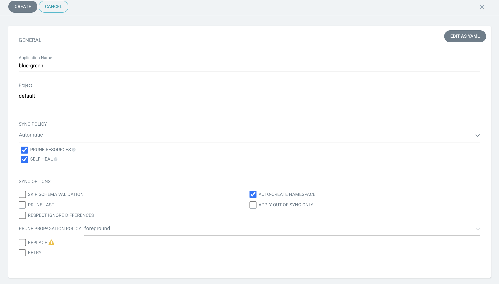
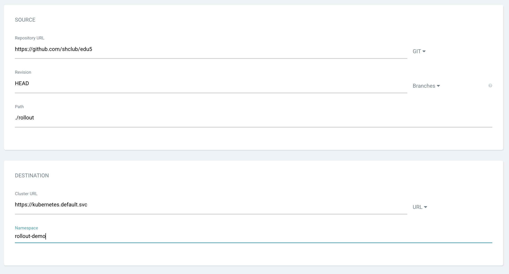    

배포가 정상적으로 되었는지 확인한다.  

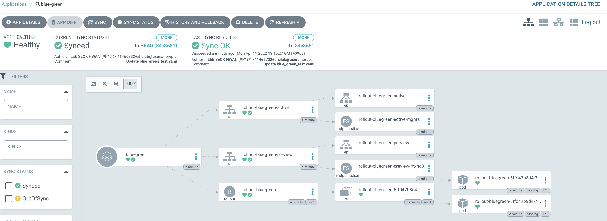

아래 명령어를 사용하여 서비스의 NodePort를 확인한다.  

```bash
root@jakelee:~# kubectl get all -n rollout-demo
NAME                                     READY   STATUS    RESTARTS   AGE
pod/rollout-bluegreen-5ffd47b8d4-zlkfl   1/1     Running   0          16s
pod/rollout-bluegreen-5ffd47b8d4-rttxs   1/1     Running   0          16s

NAME                                TYPE       CLUSTER-IP      EXTERNAL-IP   PORT(S)        AGE
service/rollout-bluegreen-preview   NodePort   10.43.4.240     <none>        80:30082/TCP   16s
service/rollout-bluegreen-active    NodePort   10.43.213.203   <none>        80:30081/TCP   16s

NAME                                           DESIRED   CURRENT   READY   AGE
replicaset.apps/rollout-bluegreen-5ffd47b8d4   2         2         2       16s
```  

Blue Green이 배포되었으니 확인하기 위해서 active와 preview 서비스의 노드 포트를 통해서 접속해보자.  

- active 접속 : ( 서버 IP ) :30081
- preview 접속 : ( 서버 IP ) :30082  

배포를 진행하고 active 서비스로 접속을 해보면 Blue 페이지가 표시되는 것을 확인할 수 있다.  

현재는 blue만 배포되어 있기 때문에 active와 preview 둘다 blue만 보일것이다.  

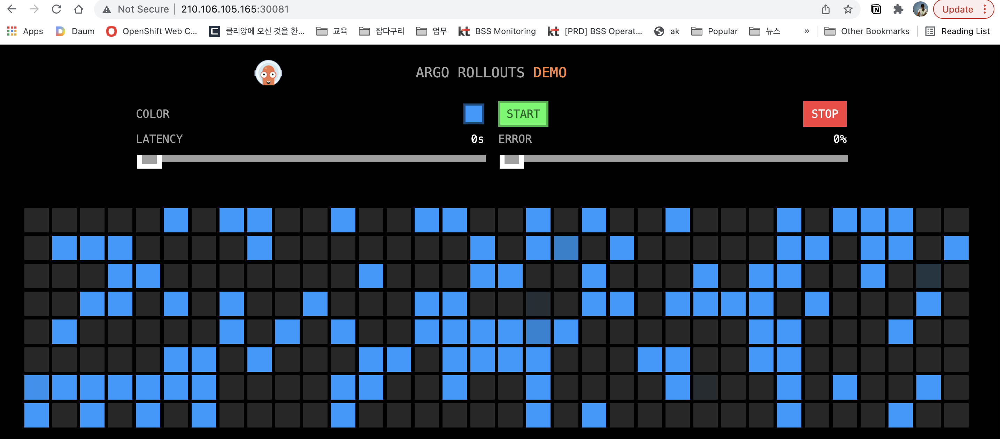  

다음으로 이전에 배포했던 yaml파일에서 주석처리 되어있던 Green 이미지를 사용하여 다시 재배포해주자.    

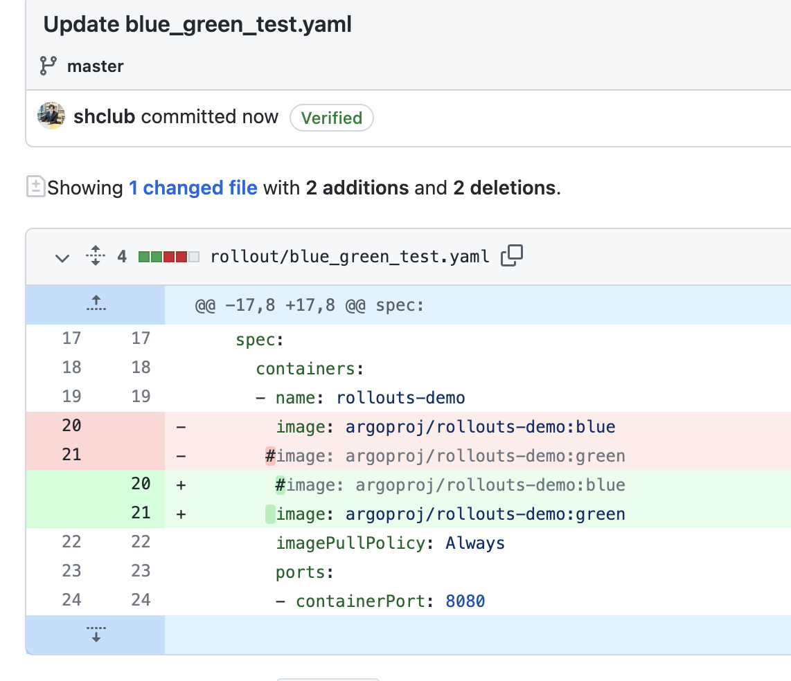  

그리고 실행되고 있는 pod를 확인해보면 총 4개의 pod가 생성되어 있고, 먼저 생성된 것이 blue, 나중에 새로 생겨난것이 green이다.  

여기까지 진행하면 active에는 blue가 배포 되어있고, preview에 green이 배포되어 있는것을 직접 확인할 수 있다.  

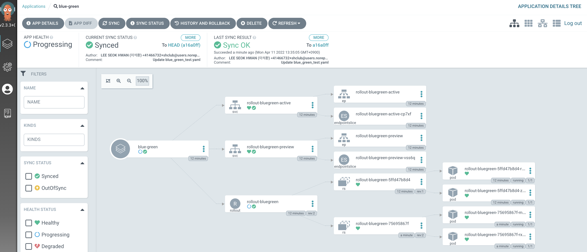  

```bash
root@jakelee:~# kubectl get po -n rollout-demo
NAME                                 READY   STATUS    RESTARTS   AGE
rollout-bluegreen-5ffd47b8d4-zlkfl   1/1     Running   0          11m
rollout-bluegreen-5ffd47b8d4-rttxs   1/1     Running   0          11m
rollout-bluegreen-75695867f-mnblz    1/1     Running   0          50s
rollout-bluegreen-75695867f-rxw9k    1/1     Running   0          50s
```  

preview에 접속해보면 green 변경 된것을 확인 할수 있다.  active는 현재 blue 이다.  

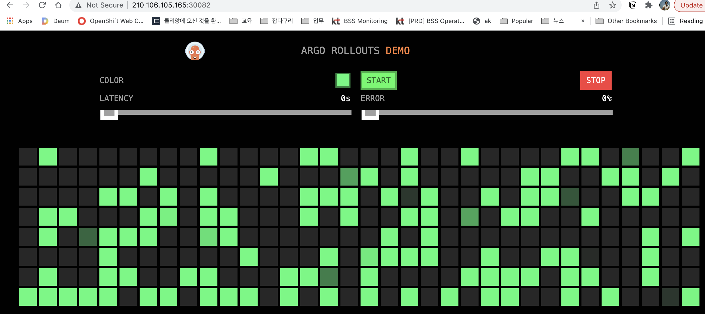  

<br/>

Blue/Green 교체 승인   

Blue/Green yaml 파일에서 autoPromotionEnabled 옵션을 false로 주었기 때문에 Blue에서 Green으로 자동으로 배포되지 않고 정지되어 있는 상태를 확인할 수 있다.  

이후, 정상적으로 Blue/Green이 배포된것을 확인했다면 Green으로 교체해주는 과정을 진행해주어야 한다.  

- argocd ui에서 진행하는 방법  

  rollout 화면에서 파란색 아이콘으로 paused 된 상태를 볼수 있고 오른쪽 점 표시를 클릭하면 여러가지 메뉴를 볼수 있는데 승인을 하기 위해서는 resume을 클릭한다.  

  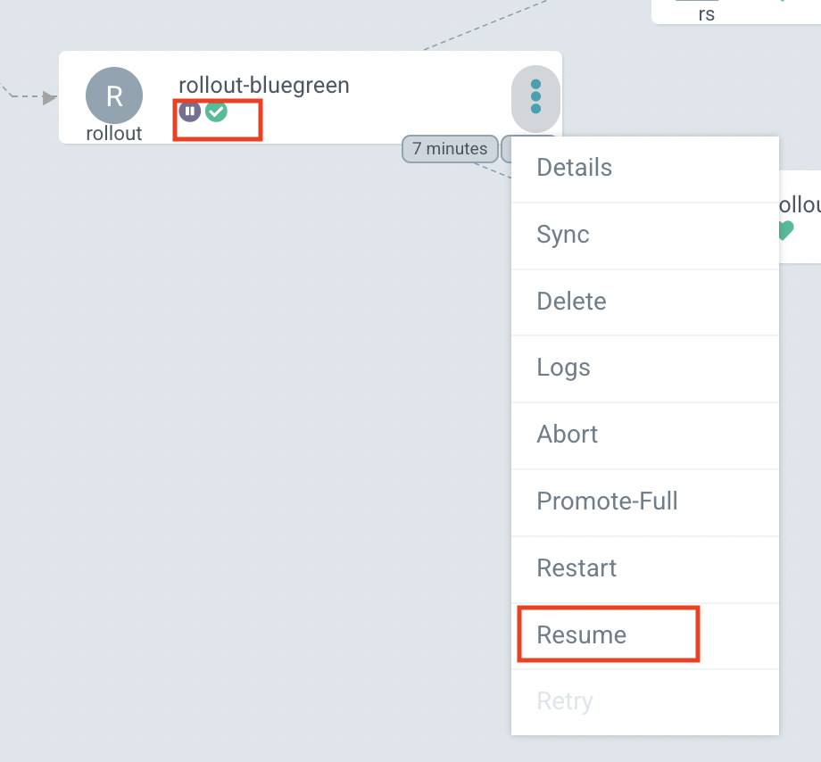  

  실행을 하기 위해서 OK를 클릭한다.  

  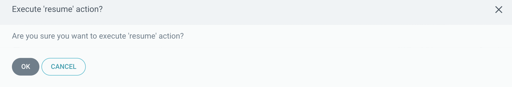

- 명령 모드 에서 진행하는 방법
  ```bash
  #rollout 상태 확인 : STATUS는 Paused
  root@jakelee:~# kubectl argo rollouts list rollout -n rollout-demo
  NAME               STRATEGY   STATUS        STEP  SET-WEIGHT  READY  DESIRED  UP-TO-DATE  AVAILABLE
  rollout-bluegreen  BlueGreen  Paused        -     -           2/4    2        2           2
  ```  

  rollout 상태 확인 후 승인  

  ```bash
  #rollout 상태 확인 후 승인
  root@jakelee:~# kubectl argo rollouts promote rollout-bluegreen -n rollout-demo
  rollout 'rollout-bluegreen' promoted
  ```  

rollout 상태 확인   

```bash
#rollout 상태 확인 (healthy)
root@jakelee:~# kubectl argo rollouts list rollout -n rollout-demo
NAME               STRATEGY   STATUS        STEP  SET-WEIGHT  READY  DESIRED  UP-TO-DATE  AVAILABLE
rollout-bluegreen  BlueGreen  Healthy       -     -           2/4    2        2           2
```  

promote 과정을 진행하면 rollouts의 상태가 healthy로 변하고 blue 배포되었던 pod가 종료된다.

```bash
#pod 상태 확인 (healthy)
root@jakelee:~# kubectl get po  -n rollout-demo
NAME                                 READY   STATUS        RESTARTS   AGE
rollout-bluegreen-75695867f-mnblz    1/1     Running       0          10m
rollout-bluegreen-75695867f-rxw9k    1/1     Running       0          10m
rollout-bluegreen-5ffd47b8d4-zlkfl   1/1     Terminating   0          20m
rollout-bluegreen-5ffd47b8d4-rttxs   1/1     Terminating   0          20m
root@jakelee:~# kubectl get po  -n rollout-demo
NAME                                READY   STATUS    RESTARTS   AGE
rollout-bluegreen-75695867f-mnblz   1/1     Running   0          13m
rollout-bluegreen-75695867f-rxw9k   1/1     Running   0          13m
```  

이때 다시 active와 preview 로 접속해보면 모두 Green으로 표시되고 무사히 Blue에서 Green으로 교체되는 모습을 볼 수 있다.  

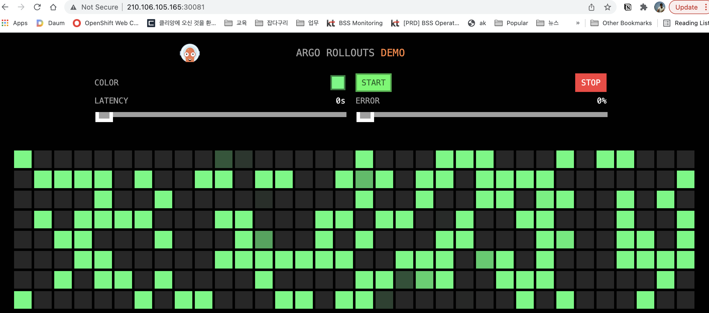  

<br/>

### Canary 배포

<br/>

Canary 배포란?  

Canary 배포는 기존에 배포된 서비스에 신규 서비스를 한꺼번에 배포/교체를 진행하지 않고 소량의 Pod만 일시적으로 배포하는 방식입니다.  

Canary 방식의 어원을 살펴보자면, `카나리아`라는 새에서 나오게 되었다.   


`카나리아는 메탄, 일산화탄소에 매우 민감한 새라 가스에 노출되면 죽어버리게 된다. 그래서 옛날에 광부들이 안전하게 일 할 수 있도록 카나리아를 이용하였다. 카나리아가 노래를 계속하고 있는 동안 광부들은 안전함을 느낀 채 일 할 수 있었으며, 만약 카나리아가 죽게 되면 곧바로 탄광을 탈출함으로써 광부들의 생명을 보존할 수 있었다.`  

Canary 방식은 카나리아 새처럼 위험을 빠르게 감지할 수 있는 방식이다.

특정 서버나 소수의 유저들만 먼저 새로운 버전을 배포하고 사용하고 나서 안전하다고 판단이 되면 그 후에 모든 서버들에 새로운 버전을 배포하는 방식이다. 

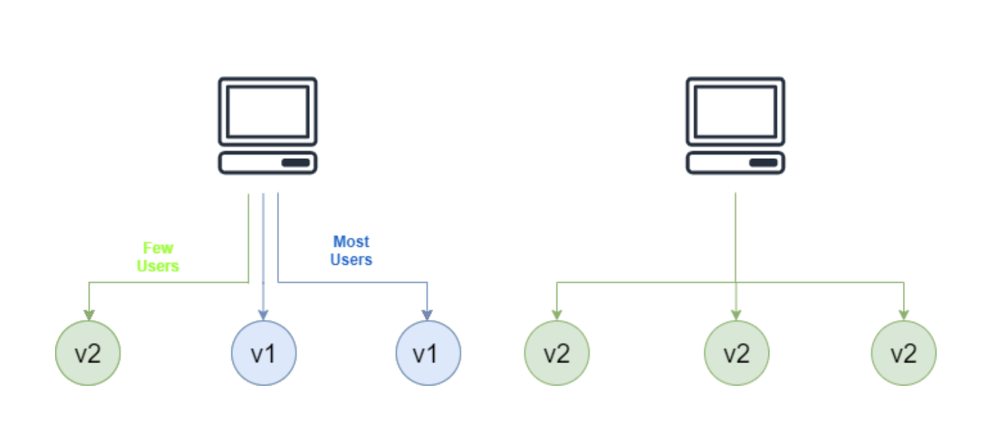

배포를 위한 소스는 아래 와 같습니다.  nodeport는 blue/green 예제와 충돌 나지 않도록 30083을 사용합니다.  

- 소스 : https://github.com/shclub/edu5/blob/master/canary/canary.yaml

```bash
apiVersion: argoproj.io/v1alpha1
kind: Rollout
metadata:
  name: canary-rollout
spec:
  replicas: 8
  revisionHistoryLimit: 2
  selector:
    matchLabels:
      app: canary
  template:
    metadata:
      labels:
        app: canary
    spec:
      containers:
      - name: canary-rollouts-demo
        image: particule/simplecolorapi:1.0
        imagePullPolicy: Always
        ports:
        - containerPort: 5000
  strategy:
    canary:
      maxSurge: "25%"
      maxUnavailable: 0
      steps:
      - setWeight: 25
      - pause: {}
---
kind: Service
apiVersion: v1
metadata:
  name: canary-service
spec:
  selector:
    app: canary
  ports:
  - protocol: TCP
    port: 80
    targetPort: 5000
    nodePort: 30083
  type: NodePort
```  

아래는 옵션 설명입니다.  
 
```bash  
 strategy:
    canary:
      maxSurge: "25%"
      maxUnavailable: 0
      steps:
      - setWeight: 25
      - pause: {}
```  

maxSurge는 배포되는 Pod의 비율을 뜻하고, maxUnavailable는 배포될 때 Unavailable되도 되는 Pod의 수를 뜻합니다.   

steps에서 setWeight는 Weight 값을 주어 트래픽을 어느 정도 인가하는지에 대한 옵션입니다.  

pause는 Blue/Green 처럼 AutoPromotion Time을 뜻합니다.  

아래와 같이 시간을 지정할 수 있습니다.  

```bash
        - pause: { duration: 10 }  # 10초
        - pause: { duration: 10s } # 10초
        - pause: { duration: 10m } # 10분
        - pause: { duration: 10h } # 10시간
        - pause: { duration: -10 } # 잘못된 옵션
        - pause: {}                # Auto Promotion 옵션 비활성화
```  

New App으로 새로운 배포 구성을 합니다. 설정은 Blue/Green을 참고하고 path는 ./canary로 설정한다.  


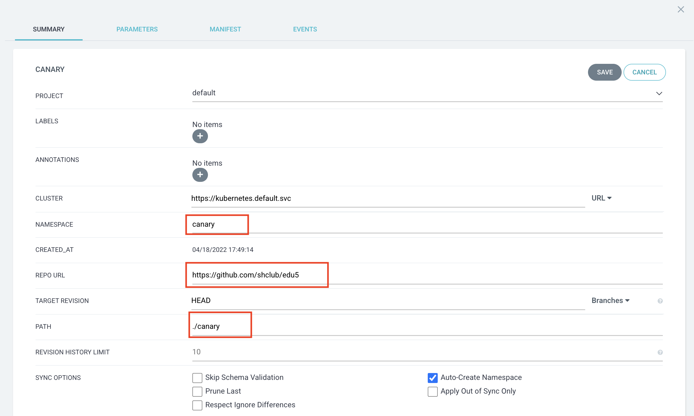  

실행을 하면 pod가 8개가 생성된것을 확인 할 수 있다.    

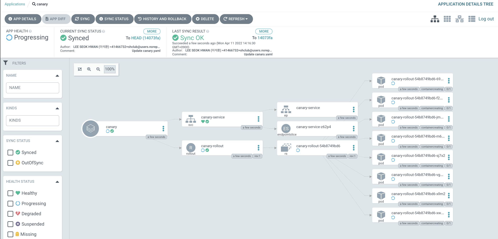

배포가 완료되었습니다. Canary page에 접속해보겠습니다.  
Red라는 응답값이 나오게 됩니다.   

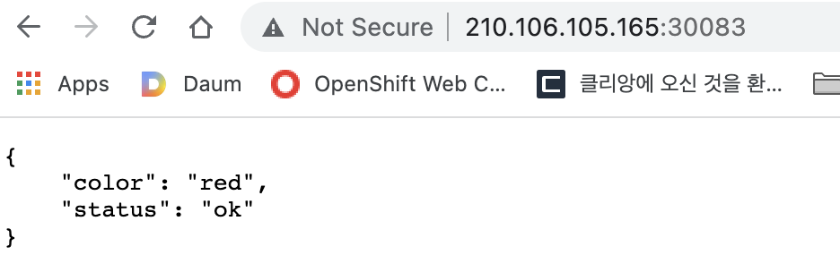

이제 2.0 버전의 이미지를 배포하여, 25%의 배포 및 트래픽 인가를 해보겠습니다.  

코드는 아래처럼 배포할 이미지 태그를 수정하면 됩니다.  

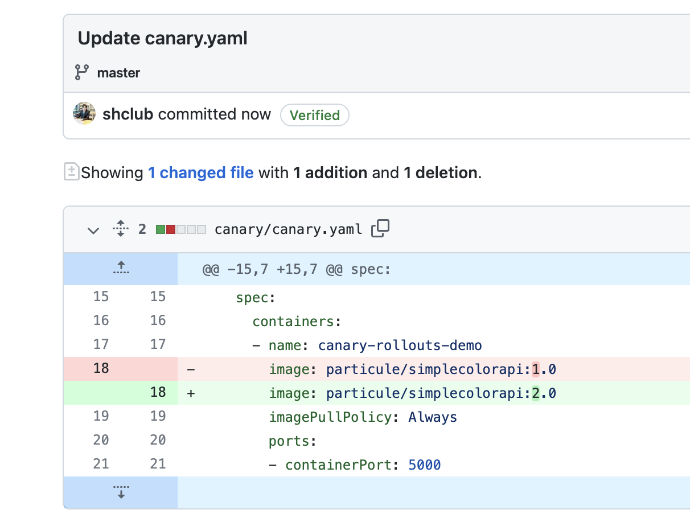  

배포 후 신규 Replicaset이 생성되며 8개의 Pod의 25%니까 2개가 새로 배포된 것을 확인할 수 있습니다.  

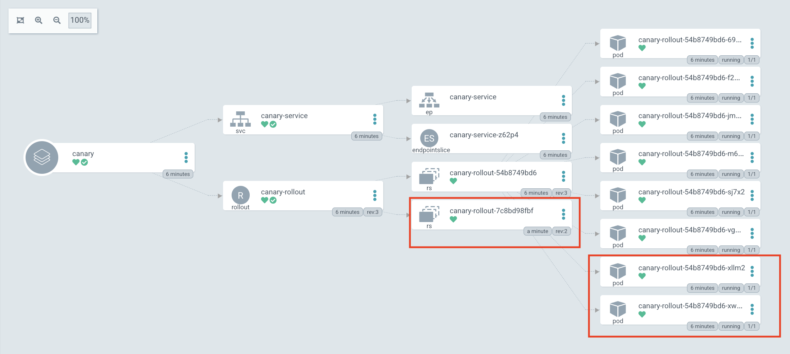  

원활한 테스트를 진행하기 위해 커맨드라인 JSON 파서인 jq 라이브러리를 설치합니다.  

```bash
root@jakelee:~# apt install jq
Reading package lists... Done
Building dependency tree
Reading state information... Done
The following additional packages will be installed:
  libjq1 libonig4
The following NEW packages will be installed:
  jq libjq1 libonig4
0 upgraded, 3 newly installed, 0 to remove and 4 not upgraded.
Need to get 276 kB of archives.
After this operation, 930 kB of additional disk space will be used.
Do you want to continue? [Y/n] Y
Get:1 http://kr.archive.ubuntu.com/ubuntu bionic/universe amd64 libonig4 amd64 6.7.0-1 [119 kB]
Get:2 http://kr.archive.ubuntu.com/ubuntu bionic/universe amd64 libjq1 amd64 1.5+dfsg-2 [111 kB]
Get:3 http://kr.archive.ubuntu.com/ubuntu bionic/universe amd64 jq amd64 1.5+dfsg-2 [45.6 kB]
Fetched 276 kB in 2s (117 kB/s)
Selecting previously unselected package libonig4:amd64.
(Reading database ... 147313 files and directories currently installed.)
Preparing to unpack .../libonig4_6.7.0-1_amd64.deb ...
Unpacking libonig4:amd64 (6.7.0-1) ...
Selecting previously unselected package libjq1:amd64.
Preparing to unpack .../libjq1_1.5+dfsg-2_amd64.deb ...
Unpacking libjq1:amd64 (1.5+dfsg-2) ...
Selecting previously unselected package jq.
Preparing to unpack .../jq_1.5+dfsg-2_amd64.deb ...
Unpacking jq (1.5+dfsg-2) ...
Setting up libonig4:amd64 (6.7.0-1) ...
Setting up libjq1:amd64 (1.5+dfsg-2) ...
Setting up jq (1.5+dfsg-2) ...
Processing triggers for man-db (2.8.3-2ubuntu0.1) ...
Processing triggers for libc-bin (2.27-3ubuntu1.5) ...
```  

0.5초마다 curl을 실행하여 테스트할 때, 정상적으로 Canary 배포가 되어 있는 점을 확인할 수 있습니다.  

아래 구문에서 ip는 본인 VM Public IP를 사용합니다.  

```bash
root@jakelee:~# while true; do curl http://210.106.105.165:30083 | jq .color; sleep 0.5; done
```  

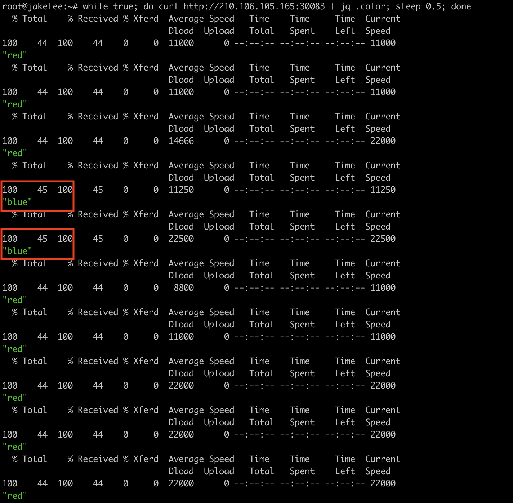  


배포가 정상적으로 이루어졌고, canary 버전이 문제가 없기 때문에 기존에 배포된 내용을 걷어내고, canary 버전을 완전히 배포해보겠습니다.  

```bash  
root@jakelee:~# kubectl argo rollouts list rollout -n canary
NAME            STRATEGY   STATUS        STEP  SET-WEIGHT  READY  DESIRED  UP-TO-DATE  AVAILABLE
canary-rollout  Canary     Paused        1/2   25          8/8    8        2           8
```  

Blue/Green 때처럼 Status가 Pause 상태인 것을 확인할 수 있습니다.  

Promote명령어를 이용하여 배포를 진행합니다.  

```bash
root@jakelee:~# kubectl argo rollouts promote canary-rollout -n canary
rollout 'canary-rollout' promoted
root@jakelee:~# kubectl argo rollouts list rollout -n canary
NAME            STRATEGY   STATUS        STEP  SET-WEIGHT  READY  DESIRED  UP-TO-DATE  AVAILABLE
canary-rollout  Canary     Progressing   2/2   100         8/10   8        4           8
root@jakelee:~# kubectl argo rollouts list rollout -n canary
NAME            STRATEGY   STATUS        STEP  SET-WEIGHT  READY  DESIRED  UP-TO-DATE  AVAILABLE
canary-rollout  Canary     Progressing   2/2   100         8/10   8        6           8
root@jakelee:~# kubectl argo rollouts list rollout -n canary
NAME            STRATEGY   STATUS        STEP  SET-WEIGHT  READY  DESIRED  UP-TO-DATE  AVAILABLE
canary-rollout  Canary     Progressing   2/2   100         8/10   8        8           8
root@jakelee:~# kubectl argo rollouts list rollout -n canary
NAME            STRATEGY   STATUS        STEP  SET-WEIGHT  READY  DESIRED  UP-TO-DATE  AVAILABLE
canary-rollout  Canary     Healthy       2/2   100         8/8    8        8           8
```  

배포가 완료되고 Status가 Healthy로 변경된 것을 확인할 수 있습니다.  

  

다시 한번 0.5초마다 curl을 실행하여 하여 보면 모두 blue로 변경된걸 확인 할 수 있다.  

```bash
root@jakelee:~# while true; do curl http://210.106.105.165:30083 | jq .color; sleep 0.5; done
```  


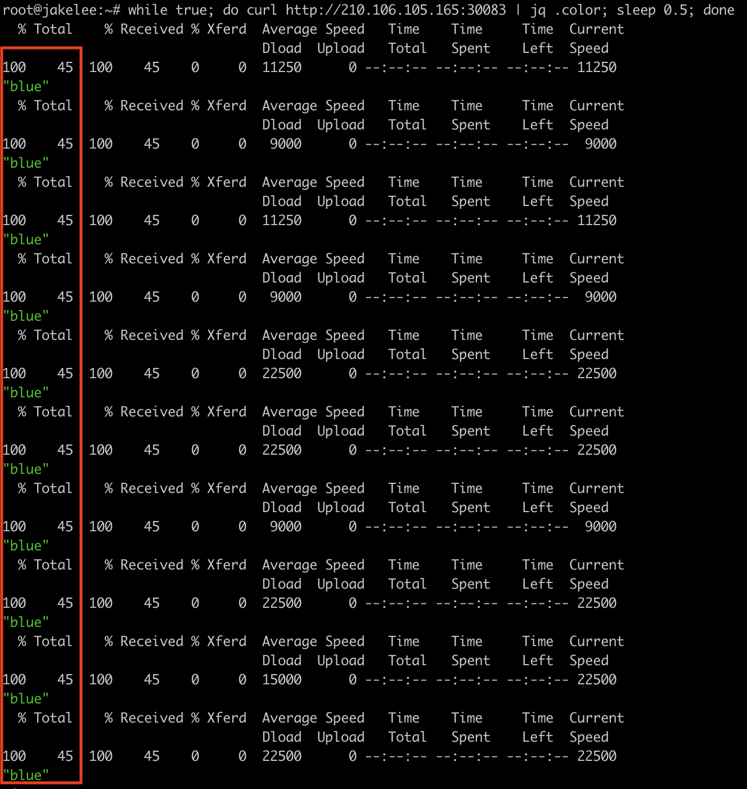  


<br/>

### ArgoCD 계정 추가    

<br/>

ArgoCD 신규 계정을 생성한다. GUI에서는 불가능하고 argocd cli를 사용한다.   

argocd-server의 서비스 IP를 확인한다.  

```bash 
oot@jakelee:~# kubectl get svc -n argocd
NAME                                      TYPE        CLUSTER-IP      EXTERNAL-IP   PORT(S)                      AGE
argocd-applicationset-controller          ClusterIP   10.43.26.65     <none>        7000/TCP                     12d
argocd-dex-server                         ClusterIP   10.43.239.221   <none>        5556/TCP,5557/TCP,5558/TCP   12d
argocd-metrics                            ClusterIP   10.43.251.44    <none>        8082/TCP                     12d
argocd-notifications-controller-metrics   ClusterIP   10.43.214.197   <none>        9001/TCP                     12d
argocd-redis                              ClusterIP   10.43.12.131    <none>        6379/TCP                     12d
argocd-repo-server                        ClusterIP   10.43.132.197   <none>        8081/TCP,8084/TCP            12d
argocd-server-metrics                     ClusterIP   10.43.200.82    <none>        8083/TCP                     12d
argocd-server                             NodePort    10.43.247.167   <none>        80:30000/TCP,443:30001/TCP   12d
inspekt                                   ClusterIP   10.43.156.159   <none>        80/TCP                       3d17h
```   

cluster ip로 로그인 한다.  

```bash 
root@jakelee:~# argocd login 10.43.247.167
WARNING: server is not configured with TLS. Proceed (y/n)? y
Username: admin
Password:
'admin:login' logged in successfully
Context '10.43.247.167' updated
```  

새로운 account 는 shclub 입니다.  

ArgoCD 의 account 추가는 ArgoCD의 Configmap을 통해서 가능합니다.  

아래 명령을 실행 합니다.    


```bash 
root@jakelee:~# kubectl -n argocd edit configmap argocd-cm -o yaml
apiVersion: v1
data:
  accounts.shclub: apiKey,login
kind: ConfigMap
metadata:
  annotations:
    kubectl.kubernetes.io/last-applied-configuration: |
      {"apiVersion":"v1","kind":"ConfigMap","metadata":{"annotations":{},"labels":{"app.kubernetes.io/name":"argocd-cm","app.kubernetes.io/part-of":"argocd"},"name":"argocd-cm","namespace":"argocd"}}
  creationTimestamp: "2022-04-01T08:31:45Z"
  labels:
    app.kubernetes.io/name: argocd-cm
    app.kubernetes.io/part-of: argocd
  name: argocd-cm
  namespace: argocd
  resourceVersion: "903340"
  uid: 1ea9382d-052b-43e9-b1b4-6d212efee1ec
```  
계정을 생성하기 위해 2개 라인을 추가합니다.  
아래에서 shclub는 추가할 계정이름이다. 본인의 계정으로 설정.  

```bash
data:
  accounts.shclub: apiKey,login
```  

계정 리스트를 통해 신규 계정 생성을 확인합니다.  

```bash   
root@jakelee:~# argocd account list
NAME    ENABLED  CAPABILITIES
admin   true     login
shclub  true     apiKey, login
root@jakelee:~# argocd account get --account shclub
Name:               shclub
Enabled:            true
Capabilities:       apiKey, login

Tokens:
NONE
```  

비밀번호를 변경합니다. 8자리 이상으로 설정.  

```bash   
root@jakelee:~# argocd account update-password --account shclub
*** Enter password of currently logged in user (admin):
*** Enter new password for user shclub:
*** Confirm new password for user shclub:
Password updated
```  

해당 계정으로 로그인 하면 admin 계정으로 생성한 배포 pipeline을 볼 수 없습니다.  

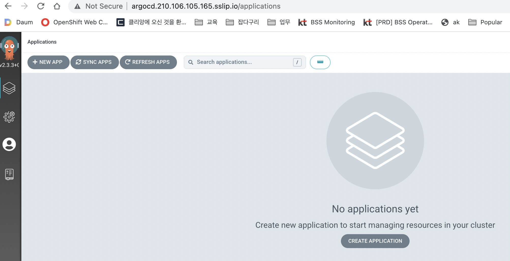  


ArgoCD가 사용하는 RBAC 규칙에 맞게 새롭게 permission 을 할당해주어야 합니다.  

ArgoCD RBAC 을 추가하려면 ArgoCD Confimap 인 argocd-rbac-cm 을 수정해야 합니다. 다음 명령을 실행 하여 수정을 시작 합니다.  

shclub는 신규 생성한 계정이고 여러분의 계정으로 변경하여 저장하시면 됩니다.  

```bash
root@jakelee:~# kubectl -n argocd edit configmap argocd-rbac-cm -o yaml
apiVersion: v1
data:
  policy.csv: |
    p, role:manager, applications, *, */*, allow
    p, role:manager, clusters, get, *, allow
    p, role:manager, repositories, *, *, allow
    p, role:manager, projects, *, *, allow
    g, shclub, role:manager
  policy.default: role:readonly
kind: ConfigMap
metadata:
  annotations:
    kubectl.kubernetes.io/last-applied-configuration: |
      {"apiVersion":"v1","kind":"ConfigMap","metadata":{"annotations":{},"labels":{"app.kubernetes.io/name":"argocd-rbac-cm","app.kubernetes.io/part-of":"argocd"},"name":"argocd-rbac-cm","namespace":"argocd"}}
  creationTimestamp: "2022-04-01T08:31:45Z"
  labels:
    app.kubernetes.io/name: argocd-rbac-cm
    app.kubernetes.io/part-of: argocd
  name: argocd-rbac-cm
  namespace: argocd
  resourceVersion: "904712"
  uid: 5493d81d-74a4-4f55-830b-919a924d7440
```  

<br/>

role은 manager 라는 이름으로 생성하였고 거의 full 권한을 가지고 있습니다.  

향후에 좀더 detail 하게 설정 할 수 있습니다.  

```bash
data:
  policy.csv: |
    p, role:manager, applications, *, */*, allow
    p, role:manager, clusters, get, *, allow
    p, role:manager, repositories, *, *, allow
    p, role:manager, projects, *, *, allow
    g, shclub, role:manager
  policy.default: role:readonly
```  

ArgoCD 화면에 admin 계정으로 생성한 pipeline 을 볼수 있습니다.  

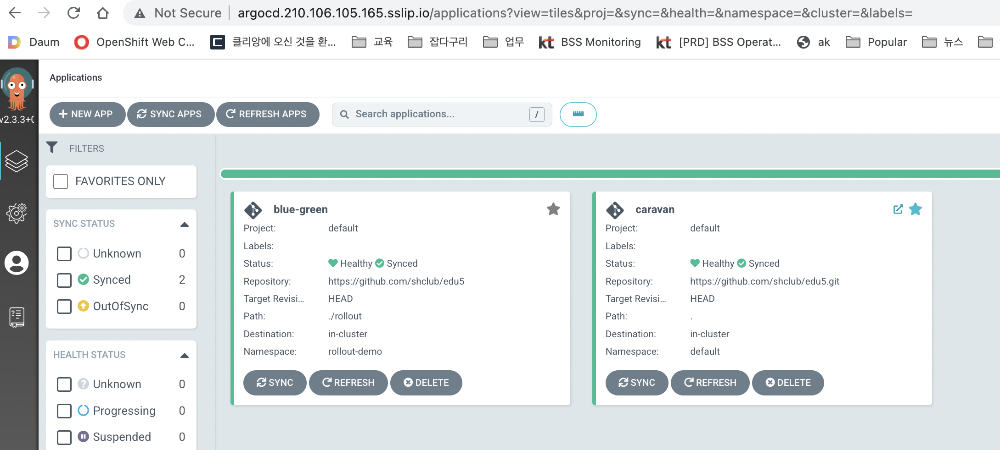  

<br/>

운영 환경에서는 권한을 최소화 하여야 합니다.  

먼저 default 라고 하는 project 와는 별도로 신규 project를 생성합니다.  

아래 내용을 복사하고 vi 에디터로 argocd_proj.yaml 화일을 만들고 붙여 넣기 한 후 저장한다.  

<br/>

```yaml
apiVersion: argoproj.io/v1alpha1
kind: AppProject
metadata:
  name: edu-project
  namespace: argocd
spec:
  clusterResourceWhitelist:
  - group: '*'
    kind: '*'
  destinations:
  - namespace: '*'
    server: '*'
  orphanedResources:
    warn: false
  sourceRepos:
  - '*'
```   

<br/>

아래 명령어를 사용하여 project를 생성한다. 

```bash
root@jakelee:~# kubectl apply -f argocd_proj.yaml
```

에러가 없이 발생하면 edu-project 라는 이름으로 project 가 생성된 것을 확인 할 수 있다.  

```bash
root@jakelee:~# kubectl get appproject -n argocd
NAME           AGE
default        53d
edu-project    88m
```  

<br/>

아래 처럼 default role을 readonly에서 모든 기능을 disable 하도록 한다.  

기존
```bash
  policy.default: role:readonly
```  

변경  
```bash
  policy.default: role:''
```  

<br/>

권한을 세부 적으로 컨트롤 한다.  

edu1 이라는 신규 생성은 edu-project라고 하는 project에 한하여만 전체 권한을 갖는다.  

edu-project 이외의 applications 들은 볼수 없습니다.  

```bash
    p, role:edu1, clusters, get, *, allow
    p, role:edu1, repositories, get, *, allow
    p, role:edu1, projects, get, *, allow
    p, role:edu1, applications, *, edu-project/*, allow
```  

<br/> 

아래 처럼 프로젝트 명을 적어 주면 해당 프로젝트만 보입니다.  


```bash
    p, role:edu1, projects, get, edu-project, allow
```

<br/>

전체 내용은 아래와 같다.  


```bash
data:
  policy.csv: |
    p, role:manager, applications, *, */*, allow
    p, role:manager, clusters, get, *, allow
    p, role:manager, repositories, *, *, allow
    p, role:manager, projects, *, *, allow
    p, role:edu1, clusters, get, *, allow
    p, role:edu1, repositories, get, *, allow
    p, role:edu1, projects, get, *, allow
    p, role:edu1, applications, *, edu-project/*, allow
    g, edu1, role:edu1
    g, shclub, role:manager
  policy.default: role:''
```

<br/>

### kustomize    

<br/>

kustomize란? 
- https://kubernetes.io/ko/docs/tasks/manage-kubernetes-objects/kustomization/

<br/>

kubernetes의 배포 도구 중 하나로, kubectl v1.14에 통합되었음  

기존에 helm chart를 통해 application 배포를 수행하였으나, helm value를 추가 하기 위해서는 helm template chart의 수정이 필요했음.  

kustomize는 기본적으로 사용되던 yaml을 그대로 사용하며, kustomization.yaml과 base, overay 및 production, development등 디렉토리를 환경에 맞게 구성하여 별도의 데이터 기반으로 배포 관리를 할수 있음.  

overlay는 패치가 필요한 쿠버네티스 리소스에는 변경하고자 하는 부분만 YAML로 만들어서 패치 형태로 쓸 수 있다.  


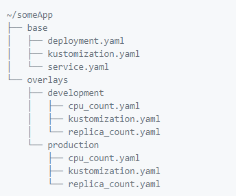    

<br/>
base  

- 기본 yaml file들이 저장되는 경로
  - 해당폴더에 kustomization.yaml 파일이 필히 존재해야 함
- https://github.com/kubernetes-sigs/kustomize#1-make-a-kustomization-file
- 기존에 사용되던 yaml파일들을 여기에 복사해두고 kustomization.yaml에 사용할 yaml을 선언해두면 된다.  


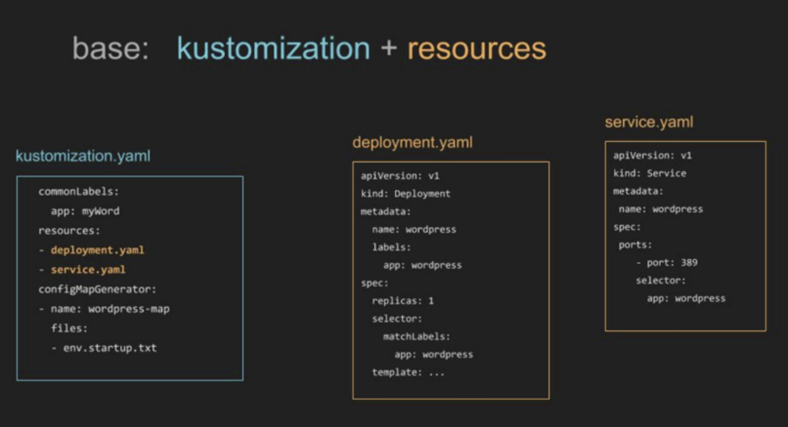      

<br/>  

overlays  

- 일반적으로 base에 사용되는 yaml을 기반으로 patch하여 업데이트 하는 방식으로 사용
- 하위 디렉토리에서 느낄수 있듯이 stage 별로 나누거나 공용으로 사용되는 base에 특정한 value를 추가해야 하는 경우 사용된다.
- https://github.com/kubernetes-sigs/kustomize#2-create-variants-using-overlays
- overlays 하위에 디렉토리로 staging, dev, production 등 다양한 stage별 식별이 가능한 옵션을 두고 관리할수 있다.  


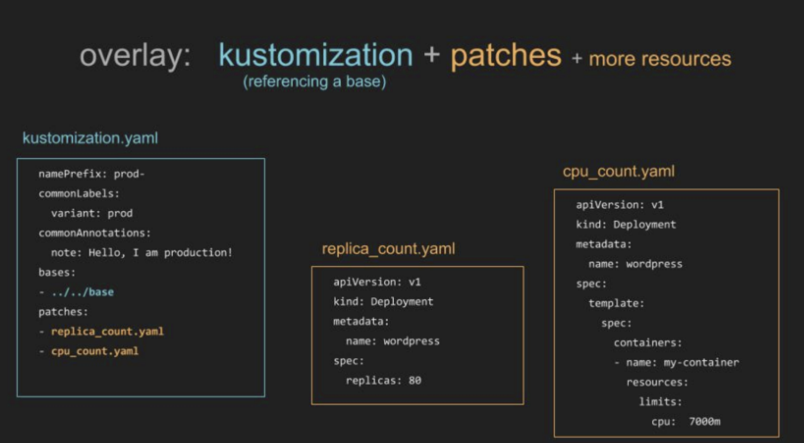  

<br/>
테스트를 위한 config는 https://github.com/shclub/edu6 를 참고한다.  

현재 화일 구조는 아래와 같다.  

```
├── base
│   ├── service.yaml
│   ├── deployment.yaml
│   ├── kustomization.yaml
└── overlays
    └── development
       ├── kustomization.yaml
        └── cpu_count.yaml
        └── replica_count.yaml
    └── production
        ├── kustomization.yaml
        └── cpu_count.yaml
        └── replica_count.yaml

```

base 폴더의 kustomzation.yaml 화일  

```
apiVersion: kustomize.config.k8s.io/v1beta1
kind: Kustomization
resources:
- deployment.yaml
- service.yaml
```  

overlays/development 폴더의 kustomization.yaml 화일  
- namePrefix : pod의 이름 앞에 붙는다.  

```
apiVersion: kustomize.config.k8s.io/v1beta1
kind: Kustomization
images:
- name: shclub/edu4
  newTag: v1 
namePrefix: dev-
bases:
- ../../base
patchesStrategicMerge:
- replica_count.yaml
- cpu_count.yaml
```  

cpu_count.yaml 화일   
- cpu max 값 설정  

```
apiVersion: apps/v1
kind: Deployment
metadata:
  name: edu6
spec:
  template:
    spec:
      containers:
      - name: edu6
        resources:
          limits: 
            cpu: 300m
```  

replica_count.yaml 화일   
- replica 설정    

```
apiVersion: apps/v1
kind: Deployment
metadata:
  name: edu6
spec:
  replicas: 2
```

<br/>

먼저 kustomize를 설치한다. 

아래 명령어 하나로 설치가 된다.

```bash 
root@jakelee:~# curl -s "https://raw.githubusercontent.com/kubernetes-sigs/kustomize/master/hack/install_kustomize.sh"  | bash

{Version:kustomize/v4.5.4 GitCommit:cf3a452ddd6f83945d39d582243b8592ec627ae3 BuildDate:2022-03-28T23:12:45Z GoOs:linux GoArch:amd64}
kustomize installed to //root/kustomize
```

-bash: kustomize: command not found 에러가 발생하면  
아래 명령어를 실행한다.  

```bash 
mv kustomize /usr/local/bin/
```  

우리는 ArgoCD를 통해서 kustomize를 연동하도록 한다.  
ArgoCD에서 New App을 아래와 같이 만든다.  


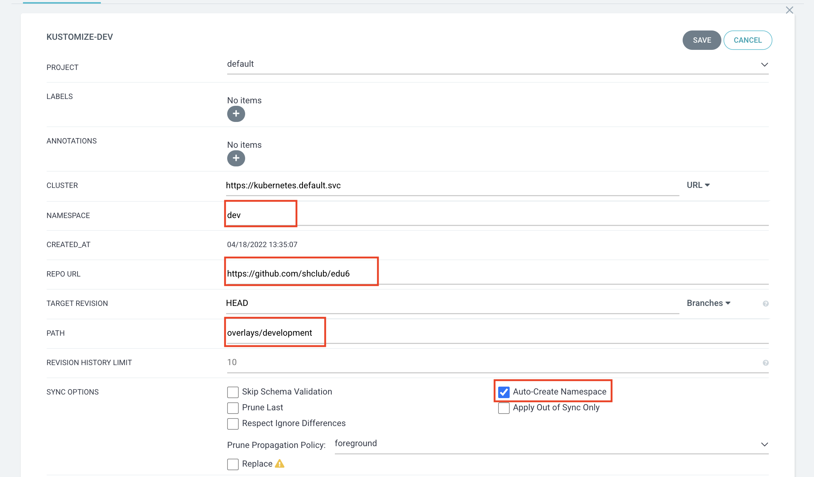  

sync를 해보면 replica 2개로 설정되어 pod가 2개가 생성 된걸 볼수 있다.  

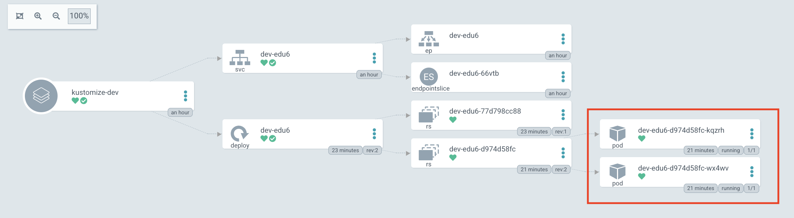  

POD의 resource는 300m으로 최대값이 설정되어 있다.  

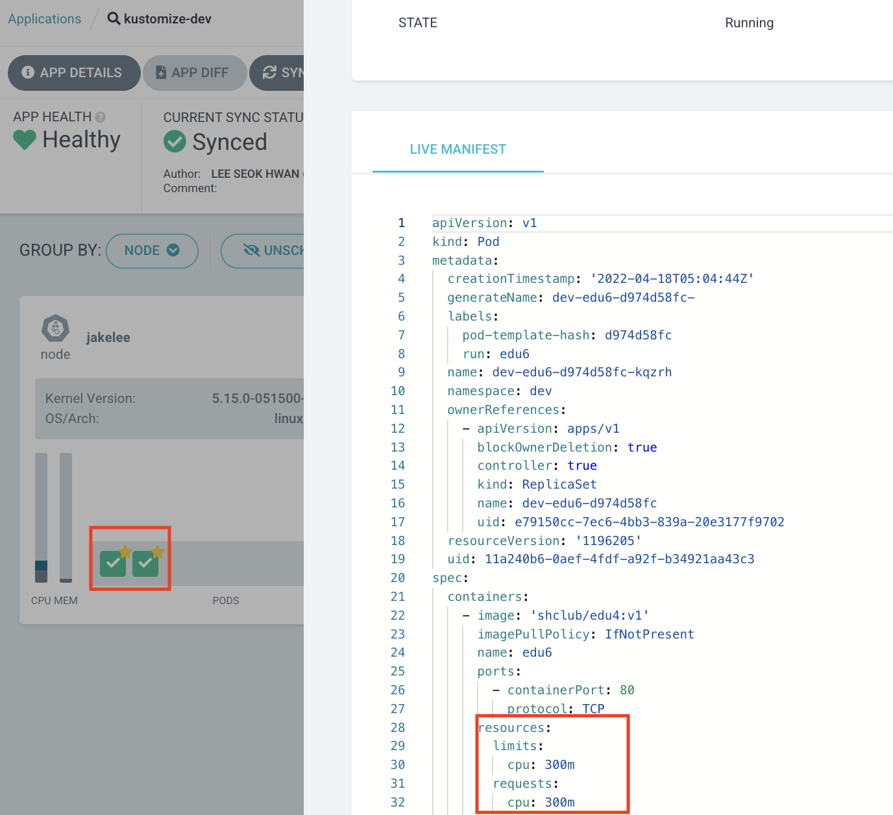  

<br/>  

참고 : 명령어로 작업하기   

<br/>  
kustomize 설정 확인.
github의 shclub/edu6에 설정 되어 있는 화일로 테스트 한다.
- git clone은 하고 다운받은 화일로 하면 됨.  

```bash
root@jakelee:~# kustomize build https://github.com/shclub/edu6/overlays/development/
apiVersion: v1
kind: Service
metadata:
  name: dev-edu6
spec:
  ports:
  - port: 80
    protocol: TCP
    targetPort: 80
  selector:
    run: edu6
---
apiVersion: apps/v1
kind: Deployment
metadata:
  name: dev-edu6
spec:
  replicas: 2
  selector:
    matchLabels:
      run: edu6
  template:
    metadata:
      labels:
        run: edu6
    spec:
      containers:
      - image: shclub/edu4:v1
        name: edu6
        ports:
        - containerPort: 80
        resources:
          limits:
            cpu: 300m
```  

kustomize 적용  

```bash
kubectl apply -k https://github.com/shclub/edu6/overlays/development/
```  

<br/> 


### argocd remote 에서 배포 하기    

<br/>

argocd 를 다른 cluster를 통해서 배포해 본다.  

접속하고자 하는 k8s cluster의 config 정보를 복사한다.  

.kube 폴더 밑에 config 화일을 하나 추가한다. 

vi 에디터로 사용한다.  

```
root@jake-Wyse-mint2:~/.kube# vi config-epc-jakelee
```  

복사한 config 화일 내용을 붙여넣기 한다.  
아래는 샘플 내용이다.  

```bash
apiVersion: v1
clusters:
- cluster:
    certificate-authority-data: LS0tLS1CRUdJTiBDRVJUSUZJQ0FURS0tLS0tCk1J-----SUJkekNDQVIyZ0F3SUJBZ0l
    server: https://210.106.105.165:6443
  name: k3s-test
contexts:
- context:
    cluster: k3s-test
    user: k3s-test
  name: k3s-test
current-context: k3s-test
kind: Config
preferences: {}
users:
- name: k3s-test
  user:
    client-certificate-data: LS0tLS1CRUdJTiBDRVJUSUZJQ0FUZ0F3SUJBZ0lJTzJxVnRk-----0tLQo=
```  

새로운 config을 /etc/profile 에 추가한다.  

```bash
root@jake-Wyse-mint2:~/.kube# vi /etc/profile
```  

추가할 내용은 아래와 같다.  

```bash
export KUBECONFIG=/etc/rancher/k3s/k3s.yaml:/root/.kube/config-epc-jakelee:$KUBECONFIG
```  

source 명령어를 사용하여 적용한다.  

```bash
root@jake-Wyse-mint2:~/.kube# source /etc/profile
```  

정상적으로 추가가 된지 확인한다.  

```bash
root@jake-Wyse-mint2:~/.kube# kubectl config get-contexts
CURRENT   NAME       CLUSTER    AUTHINFO   NAMESPACE
*         default    default    default
          k3s-test   k3s-test   k3s-test
```  

k3s-test 클러스터에 접속하기 위해서 context를 switch 해본다.  

```bash
root@jake-Wyse-mint2:~/.kube# kubectl config use-context k3s-test
Switched to context "k3s-test".
```  

리모트 k8s 접속이 확인 되었으면 다시 로컬 클러스터로 switch 한다.  

```bash
root@jake-Wyse-mint2:~/.kube# kubectl config use-context default
Switched to context "default".
```  

argo cd 에 cli 로 로그인 하기 위해서 서비스의 ip를 확인한다. ( 로컬 k8s 임 )  

```bash
root@jake-Wyse-mint2:~/.kube# kubectl get svc -n argocd
NAME                    TYPE        CLUSTER-IP      EXTERNAL-IP   PORT(S)                      AGE
argocd-dex-server       ClusterIP   10.43.159.136   <none>        5556/TCP,5557/TCP,5558/TCP   69d
argocd-metrics          ClusterIP   10.43.4.89      <none>        8082/TCP                     69d
argocd-redis            ClusterIP   10.43.124.226   <none>        6379/TCP                     69d
argocd-repo-server      ClusterIP   10.43.221.146   <none>        8081/TCP,8084/TCP            69d
argocd-server-metrics   ClusterIP   10.43.148.232   <none>        8083/TCP                     69d
argocd-server           NodePort    10.43.188.106   <none>        80:32000/TCP,443:30904/TCP   69d
```  

argocd server로 로그인한다.  
insecurely 접속을 물어보면 y를 입력한다.  

```bash
root@jake-Wyse-mint2:~/.kube# argocd login 10.43.188.106
WARNING: server certificate had error: x509: cannot validate certificate for 10.43.188.106 because it doesn't contain any IP SANs. Proceed insecurely (y/n)? y
Username: admin
Password:
```  

cluster 추가 명령어는 아래와 같다.  

```bash
argocd cluster add <클러스터 이름 >
```  

argocd에 외부 k8s cluster를 추가해 본다.  

```bash
root@jake-Wyse-mint2:~/.kube# argocd cluster add k3s-test
WARNING: This will create a service account `argocd-manager` on the cluster referenced by context `k3s-test` with full cluster level admin privileges. Do you want to continue [y/N]? y
INFO[0004] ServiceAccount "argocd-manager" created in namespace "kube-system"
INFO[0004] ClusterRole "argocd-manager-role" created
INFO[0004] ClusterRoleBinding "argocd-manager-role-binding" created
Cluster 'https://210.106.105.165:6443' added
```

<br/>

web browser로 argocd ui 를 접속하여 setting-> Cluster 메뉴로 이동하면  cluster가 추가 된 것을 확인한다.  

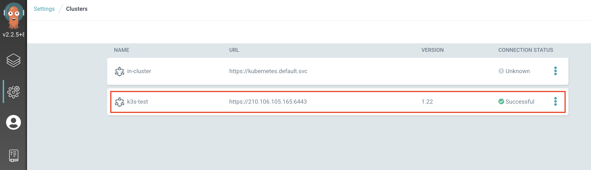    

배포 구성을 할때  remote 클러스터 선택 할 수 있다.  

<br/>

### 참고

<br/>

참고사이트
-  https://tech.kakao.com/2021/07/16/devops-for-msa/
- https://velog.io/@wlgns5376/GitOps-ArgoCD와-Kustomize를-이용해-kubernetes에-배포하기
- https://github.com/wlgns5376/example-app-kustomize/
- https://asuraiv.tistory.com/22?category=877062
- argocd 권한 : https://intrepidgeeks.com/tutorial/argocd-users-access-and-rbac
- k8s 전체 개념 :https://www.slideshare.net/gamzabaw/kubernetes-walkthrough


<br/>

### Helm -> Kustomize 전환

<br/>

Replicated의 쉽(Ship)  사용  

이제, Helm을 Kustomize 형태로 변환하는 작업이 필요합니다. 이를 도와주는 도구가 쉽(Ship)입니다.  

https://www.replicated.com/ship/oss/  
https://github.com/replicatedhq/ship  


- 먼저 Ship을 사용해 Helm을 템플릿화된 쿠버네티스 리소스 형태로 변경합니다.  
- 이후 쿠버네티스 리소스에서 필요한 부분만 Kustomize 패치를 사용해 변경하고   변경한 부분은 GitOps 리포지토리에 넣어서 관리합니다.

- GitOps 리포지토리에 `git push origin HEAD:install/ ${cluster}/${namespace}/${app_name}` 과 같은 Git CLI 명령을 통해 install 브랜치가 생성이 되면 해당 브랜치의 `${app_name}` 인프라를 배포하는 CI/CD 파이프라인이 실행됩니다. 
- 배포의 형상은 마찬가지로 Argo CD를 통해 GitOps로 관리합니다.

### 과제

<br/>

과제 1 :  kustomize를 production 에서 argocd로 배포 한다.  
         ( shclub/edu6/overlays/production 참고)