# Chapter 11 

 AWS의 기본 기능에 대한 설명과 함께 관리형 kubernetes 서비스인
 EKS를 설치하고 서비스를 배포 한다.  


<br/>

1. AWS 기본 기능 설명 ( VPC / Subnet / RoutingTable / NLCM / Security Group / ENI ) 및 실습 

2. EKS 설명 및 생성 ( By 포탈 / CloudFormation / eskctl ) 실습  

3. EKS 설정 ( Security Group / ALB Ingress )  

4. 기본 서비스 배포 실습 (/w Fargate )

<br/>

## 1. AWS 기본 기능 설명 및 실습  

<br>


<br/>


<br/><br/>


<br/><br/>

### VPC 란?


<br/>


<br/>

<br/><br/>

### bastion host에 인증서 없이 접속 방법  

<br/>

AWS web console 에서 bastion에서 접속하기 위해서는 pem 인증서 없이 접속이 가능해야한다.  
아래는 인증서 대신 아이디/비밀번호로 접속하기 위한 방법을 설명한다.  

<br/>

먼저 ssh 로 AWS에서 생성된 pem 화일을 다운받아 host에 접속을 한다.  

```bash  
ubuntu@ip-192-168-3-121:~$ chmod 400 BSS.pem
ubuntu@ip-192-168-3-121:~$ ssh -i BSS.pem ec2-user@192.168.1.115
Last login: Wed Nov 23 06:08:14 2022 from ip-192-168-3-121.ap-northeast-2.compute.internal

       __|  __|_  )
       _|  (     /   Amazon Linux 2 AMI
      ___|\___|___|

https://aws.amazon.com/amazon-linux-2/
```  

<br/>


`sudo -i` 명령어를 사용하여 root로 사용자 변경    

```bash  
[ec2-user@ip-192-168-1-115 ~]$ sudo -i
``` 
<br/>

`/etc/ssh/sshd_config` 파일에서  61번 라인의 주석을 풀고 저장한다.

```bash  
[ec2-user@ip-192-168-1-115 ~]$ sudo -i
[root@ip-192-168-1-115 ~]# vi /etc/ssh/sshd_config
``` 

<br/>

/etc/ssh/sshd_config 파일  
```bash  
     60 # To disable tunneled clear text passwords, change to no here!
     61 PasswordAuthentication yes
     62 #PermitEmptyPasswords no
``` 

<br/>

sshd 데몬을 재기동한다. 아마존 linux는  centos 계열이기 때문에 아래 명령어 사용 

```bash  
[root@ip-192-168-1-115 ~]# systemctl restart sshd
``` 

<br/>

접속할 비밀번호를 설정한다. ( root 계정과 ec2-user 둘다 설정 )    

```bash  
[root@ip-192-168-1-115 ~]# passwd
Changing password for user root.
New password:
Retype new password:
passwd: all authentication tokens updated successfully.
[root@ip-192-168-1-115 ~]# passwd ec2-user
Changing password for user ec2-user.
New password:
Retype new password:
passwd: all authentication tokens updated successfully.
```

<br/>

exit를 2번 하고 bastion host에서 나온다.  

```bash
[root@ip-192-168-1-115 ~]# exit
logout
[ec2-user@ip-192-168-1-115 ~]$ exit
logout
Connection to 192.168.1.115 closed.
``` 
<br/>

인증서 없이 접속을 시도한다.  

```bash
ubuntu@ip-192-168-3-121:~$ ssh  ec2-user@192.168.1.115
ec2-user@192.168.1.115's password:
Last login: Wed Nov 23 06:25:57 2022 from ip-192-168-3-121.ap-northeast-2.compute.internal

       __|  __|_  )
       _|  (     /   Amazon Linux 2 AMI
      ___|\___|___|

https://aws.amazon.com/amazon-linux-2/
```

<br/>

접속이 되는 것을 확인을 하고 AWS Console 에서도 접속해 본다.  

EC2 에서 위에서 설정한 bastion host를 선택하고 오른쪽 상단의 connect 버튼을 클릭한다.  

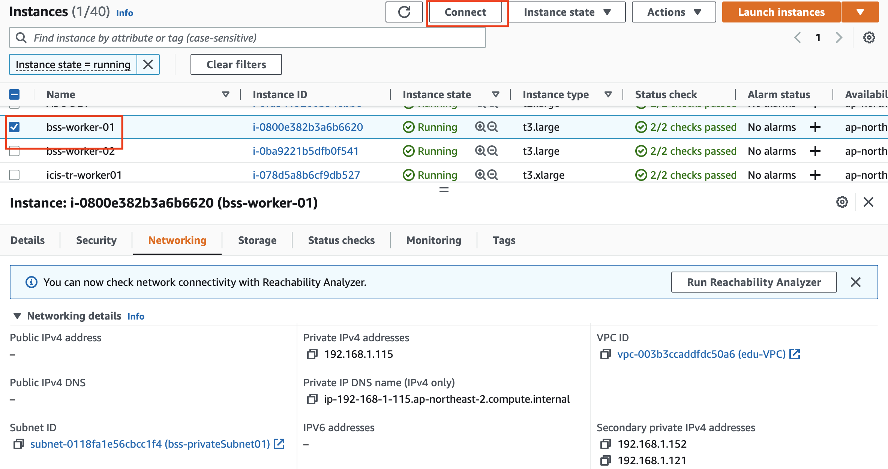  

<br/>

원하는 연결 타입을 선택을 하고 connct 버튼을 누른다.  connect 버튼이 활성화 되는 항목을 찾으면 되며 폐쇄망에서도 접속이 가능 하다.  

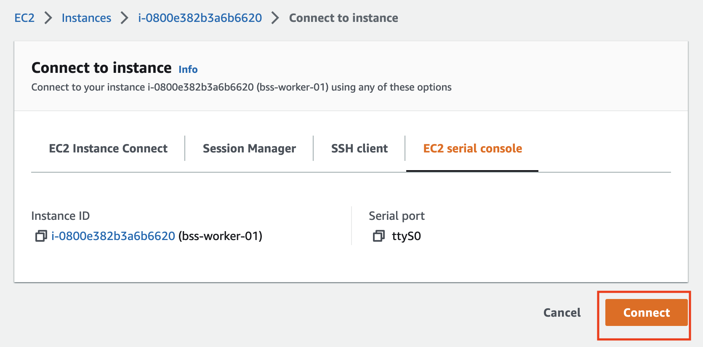  

<br/>

connect 이후에 검은 화면이 나오면 엔터를 치고 계정과 비밀번호를 입력하면 접속 가능하다.  

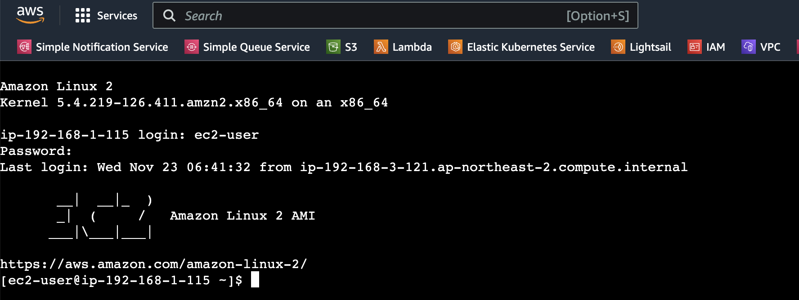  


<br/><br/>

### AWS Client 설치  

<br/>

bastion host에 AWS Client ,  kubectl , helm , eksctl을 순서대로 설치한다.  

<br/>

AWS에 접속하기 위한 client 를 설치한다. ( ubuntu 기준 )

```bash
root@ip-192-168-3-121:~# curl "https://awscli.amazonaws.com/AWSCLIV2.pkg" -o "AWSCLIV2.pkg"
  % Total    % Received % Xferd  Average Speed   Time    Time     Time  Current
                                 Dload  Upload   Total   Spent    Left  Speed
100 28.6M  100 28.6M    0     0  68.4M      0 --:--:-- --:--:-- --:--:-- 68.6M
root@ip-192-168-3-121:~# installer -pkg ./AWSCLIV2.pkg -target
root@ip-192-168-3-121:~# which aws
/usr/local/bin/aws
root@ip-192-168-3-121:~# which --version
Illegal option --
Usage: /usr/bin/which [-a] args
root@ip-192-168-3-121:~# aws --version
aws-cli/2.9.0 Python/3.9.11 Linux/5.15.0-1019-aws exe/x86_64.ubuntu.22 prompt/off
``` 

<br/>

kubectl 을 설치 한다. ( ubuntu 기준 )

```bash
root@ip-192-168-3-121:~# curl -LO "https://dl.k8s.io/release/$(curl -L -s https://dl.k8s.io/release/stable.txt)/bin/linux/amd64/kubectl"
  % Total    % Received % Xferd  Average Speed   Time    Time     Time  Current
                                 Dload  Upload   Total   Spent    Left  Speed
100   138  100   138    0     0    519      0 --:--:-- --:--:-- --:--:--   518
100 42.9M  100 42.9M    0     0  23.3M      0  0:00:01  0:00:01 --:--:-- 42.0M
root@ip-192-168-3-121:~# install -o root -g root -m 0755 kubectl /usr/local/bin/kubectl
root@ip-192-168-3-121:~# kubectl version --client
WARNING: This version information is deprecated and will be replaced with the output from kubectl version --short.  Use --output=yaml|json to get the full version.
Client Version: version.Info{Major:"1", Minor:"25", GitVersion:"v1.25.4", GitCommit:"872a965c6c6526caa949f0c6ac028ef7aff3fb78", GitTreeState:"clean", BuildDate:"2022-11-09T13:36:36Z", GoVersion:"go1.19.3", Compiler:"gc", Platform:"linux/amd64"}
Kustomize Version: v4.5.7
```

<br/>


helm을 설치한다. ( ubuntu 기준 )

```bash  
root@ip-192-168-3-121:~# curl -fsSL -o get_helm.sh https://raw.githubusercontent.com/helm/helm/main/scripts/get-helm-3
root@ip-192-168-3-121:~# chmod 700 get_helm.sh
root@ip-192-168-3-121:~# ./get_helm.sh
Downloading https://get.helm.sh/helm-v3.10.2-linux-amd64.tar.gz
Verifying checksum... Done.
Preparing to install helm into /usr/local/bin
helm installed into /usr/local/bin/helm  

root@ip-192-168-3-121:~# helm version
version.BuildInfo{Version:"v3.10.2", GitCommit:"50f003e5ee8704ec937a756c646870227d7c8b58", GitTreeState:"clean", GoVersion:"go1.18.8"}
```  

<br/>

eksctl 를 설치 한다. ( ubuntu 기준 )  

```bash  
root@ip-192-168-3-121:~# curl --silent --location "https://github.com/weaveworks/eksctl/releases/latest/download/eksctl_$(uname -s)_amd64.tar.gz" | tar xz -C /tmp
root@ip-192-168-3-121:~# sudo mv /tmp/eksctl /usr/local/bin
root@ip-192-168-3-121:~# eksctl version
0.120.0
```

<br/><br/>


## 2. EKS 설명 및 설정

<br>

EKS ( Elastic Kubernetes Service ) 는 AWS 의 kubernetes 매니지드 서비스  입니다.  

<br/>

EKS Architecture  

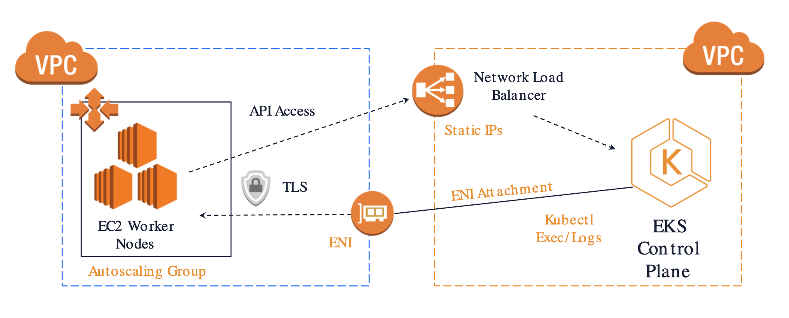   

참고 : https://www.eksworkshop.com/010_introduction/eks/eks_high_architecture/ 


<br/><br/>


## 3. EKS 설정  

<br>

EKS 구성 후에 서비스를 배포하기 위해 아래 과정이 필요하다.

<br/><br/>


### Security Group 설정

<br/>

AWS 공식 Document를 보면 3가지의 보안 그룹에 대해 설명이 되어있습니다.  

https://docs.aws.amazon.com/ko_kr/eks/latest/userguide/sec-group-reqs.html  

1. Cluster security group  

2. Control Plane security group  

3. Node security group  


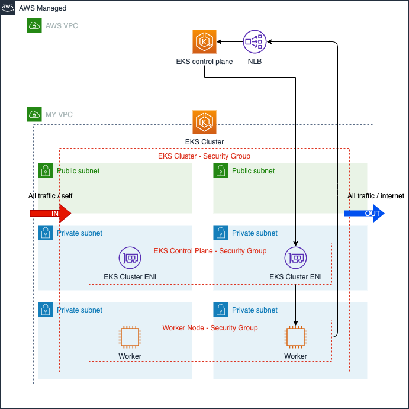      

참고 : https://kim-dragon.tistory.com/71

<br/>

bastion host에서는 control plane 과 worker node에 접속 하기 위해서는 해당 security group에 Inbount Rule을 추가 설정 해야 한다.    
- bastion host 에서 kubectl get nodes를 하면 응답이 없음  

<br/>

control plane security group을 찾고 Edit Inbound Rule 을 클릭한다.  

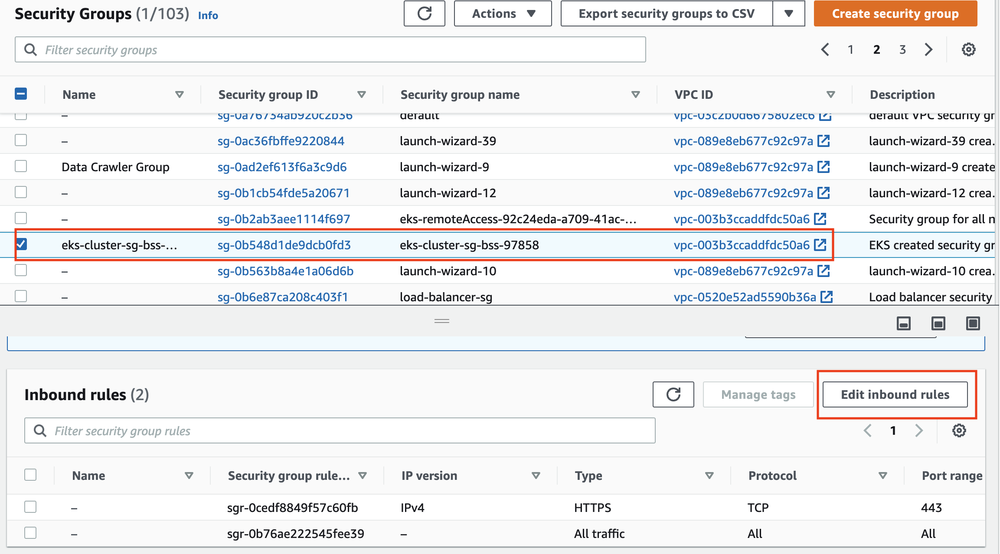  

<br/>

Type은 https로 선택을 하고 source에는 bastion host 의 private ip를 ( `<ip>/32` )  입력하고 save rules 버튼을 눌러 저장한다.  


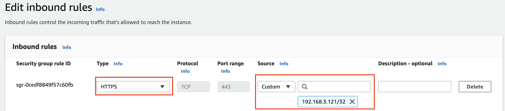    

이제 bastion host에서 kubectl get nodes 명령어를 입력하면 아래와 같이 kubernetes control plane에 접속이 가능핟.  

```bash
root@ip-192-168-3-121:~# kubectl get nodes
NAME                                               STATUS   ROLES    AGE   VERSION
ip-192-168-1-115.ap-northeast-2.compute.internal   Ready    <none>   24h   v1.23.13-eks-fb459a0
ip-192-168-1-69.ap-northeast-2.compute.internal    Ready    <none>   24h   v1.23.13-eks-fb459a0
ip-192-168-6-151.ap-northeast-2.compute.internal   Ready    <none>   24h   v1.23.13-eks-fb459a0
ip-192-168-6-203.ap-northeast-2.compute.internal   Ready    <none>   24h   v1.23.13-eks-fb459a0
``` 

<br/>

worker node에 접속하는 방법도 위와 동일하다.  

eks를 구성하면  worker node의 EC2에는 2개의 security group이 생성이 된다. 
- security group 1 : Control Plane 에서 접속
- security group 2 : remote 시스템에서 접속 

<br/>

bastion host에서 접속을 하기 위해 worker node용 EC2를 찾고 remoteAccess가 들어 있는 security group의 inbound를 변경한다.  

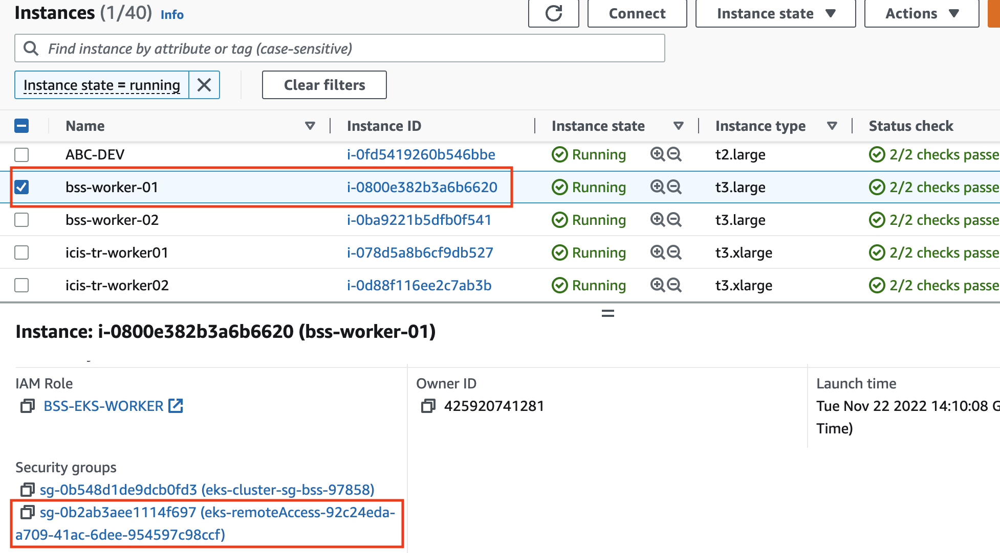

<br/>

현재 eks cluster 를 구성할때는 제한이 없는 모드로 구성을 했기 때문에 모든 트래픽이 접속 가능하다.  


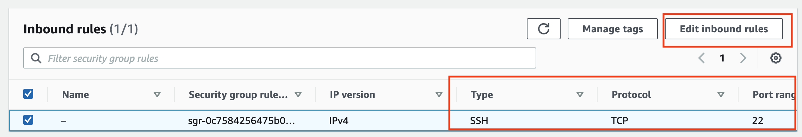

<br/>

Edit Inbound rule를 클릭하면 source가 0.0.0.0로 설정 되어 있고 이 경우 모든 서버에서 접속이 가능 하다.   

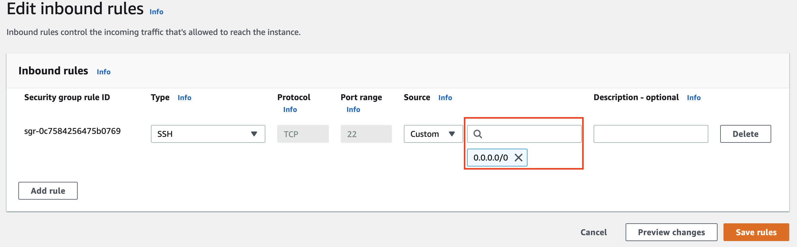

이 값을 bastion host의 값으로 변경하고 저장한다.  

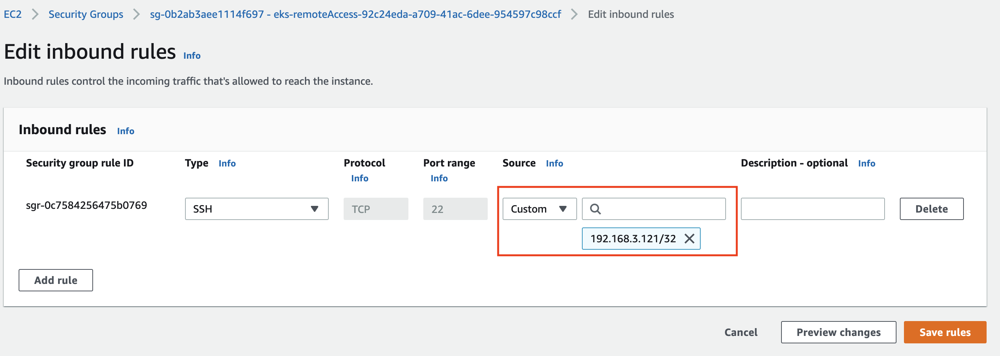

<br/>

어떤 서버에서도 SSH 로 접속을 못하게 하려면 security group를 삭제 하면 되고 worker node가 많은 경우는 EKS Cluster 구성 시 secrity group를 신규로 생성하여 node group 생성시 설정하면 된다.  

<br/>

bastion host에서 접속해 본다.    

```bash    
ubuntu@ip-192-168-3-121:~$ ssh -i BSS.pem ec2-user@192.168.1.115
The authenticity of host '192.168.1.115 (192.168.1.115)' can't be established.
ED25519 key fingerprint is SHA256:nxoqS6UB17wXXpWrUKAVZE1tUvPSe5Ra/ltYmcq3nlc.
This key is not known by any other names
Are you sure you want to continue connecting (yes/no/[fingerprint])? yes
Warning: Permanently added '192.168.1.115' (ED25519) to the list of known hosts.
Last login: Sat Nov 12 04:15:40 2022 from 205.251.233.105

       __|  __|_  )
       _|  (     /   Amazon Linux 2 AMI
      ___|\___|___|

https://aws.amazon.com/amazon-linux-2/
```

<br/><br/>


### NLB/ALB Ingress 설정


<br/>

#### NLB/ALB Ingress 설정


<br/>

```bash  
root@ip-192-168-3-121:~# kubectl apply -f service.yaml
service/mynginx created
root@ip-192-168-3-121:~# kubectl get svc
NAME         TYPE        CLUSTER-IP       EXTERNAL-IP   PORT(S)   AGE
kubernetes   ClusterIP   10.100.0.1       <none>        443/TCP   5h15m
mynginx      ClusterIP   10.100.155.243   <none>        80/TCP    4s
``` 

<br/>

NLB ( Network Load Balancer) 의 yaml 화일은 아래와 같고  subnet 은 public subnet으로 설정한다.  

<br/>

```bash  
apiVersion: v1
kind: Service
metadata:
  name: mynginx
  annotations:
    service.beta.kubernetes.io/aws-load-balancer-type: "nlb"
    service.beta.kubernetes.io/aws-load-balancer-subnets: subnet-058cc8ebcc16ad2e1,subnet-0bdff99c4a3196ad0
spec:
  type: LoadBalancer
  ports:
  - port: 80
    protocol: TCP
    targetPort: 80
  selector:
    run: mynginx
``` 

<br/>

yaml 화일을 적용합니다.  

<br/>

```bash  
root@ip-192-168-3-121:~# kubectl apply -f service_nlb.yaml
service/mynginx created
root@ip-192-168-3-121:~# kubectl get svc
NAME         TYPE           CLUSTER-IP      EXTERNAL-IP                                                                          PORT(S)        AGE
kubernetes   ClusterIP      10.100.0.1      <none>                                                                               443/TCP        7h42m
mynginx      LoadBalancer   10.100.23.169   a1797862a53ec41f2b1dcea021bbe795-64ecba3487e1cb92.elb.ap-northeast-2.amazonaws.com   80:32494/TCP   141m
```

<br/>

Load Balancer 가 Active 가 될때 까지 기다린다.  

<br/>

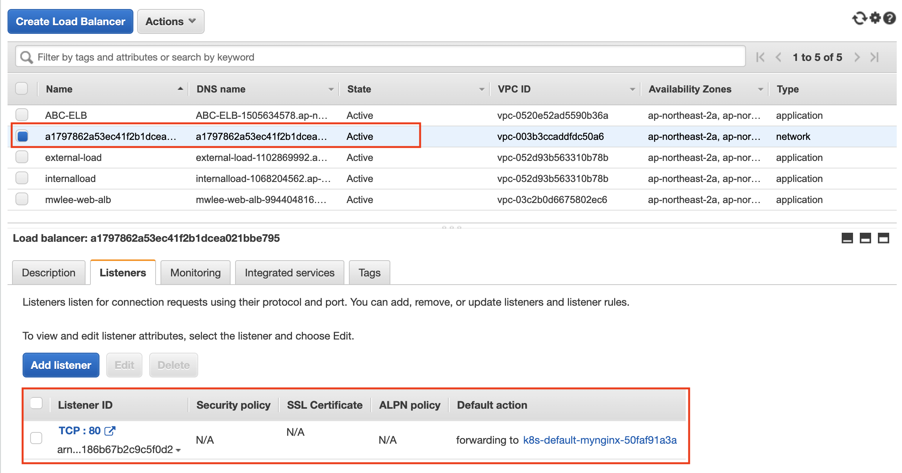  

<br/>

웹브라우저에서    
https://a1797862a53ec41f2b1dcea021bbe795-64ecba3487e1cb92.elb.ap-northeast-2.amazonaws.com 를 호출 하면 아래와 같이 nginx 화면이 나온다.  

<br/>

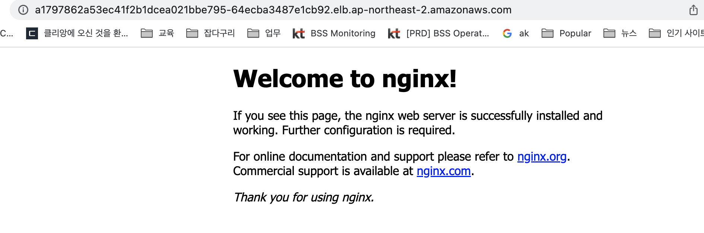  

<br/>


```bash  
root@ip-192-168-3-121:~# eksctl utils associate-iam-oidc-provider --cluster bss --approve
2022-11-22 07:47:05 [ℹ]  will create IAM Open ID Connect provider for cluster "bss" in "ap-northeast-2"
2022-11-22 07:47:06 [✔]  created IAM Open ID Connect provider for cluster "bss" in "ap-northeast-2"
root@ip-192-168-3-121:~# curl -o iam_policy.json https://raw.githubusercontent.com/kubernetes-sigs/aws-load-balancer-controller/v2.3.1/docs/install/iam_policy.json
  % Total    % Received % Xferd  Average Speed   Time    Time     Time  Current
                                 Dload  Upload   Total   Spent    Left  Speed
100  7585  100  7585    0     0  23455      0 --:--:-- --:--:-- --:--:-- 23410
root@ip-192-168-3-121:~# aws iam create-policy --policy-name AWSLoadBalancerControllerIAMPolicy --policy-document file://iam_policy.json

An error occurred (EntityAlreadyExists) when calling the CreatePolicy operation: A policy called AWSLoadBalancerControllerIAMPolicy already exists. Duplicate names are not allowed.
```


https://jenakim47.tistory.com/60