# Chapter 2 
 
Jenkins CI 구성 요소인 Git , Docker에 대해서 자세한 설명과 함께 Docker Compose 에 대해서도 실습을 한다.   


1. GitHub를 통한 Git 사용법

2. Dockerfile 구성 및 빌드 , Tag , Push 그리고 Swagger 실습 

3. Docker compose 설치 및 WordPress, SQL 구성 예제 실습

 
<br/>

##  Git  ( https://backlog.com/git-tutorial/ )

### Git 개요 

Git이란 소스코드를 효과적으로 관리하기 위해 개발된 '분산형 버전 관리 시스템'입니다. ( 이전 에는 SVN 많이 사용 )  

가장 대중적인 SaaS 형태는 Microsoft에서 제공하는 GitHub 이고
Private 형태로는 Gitlab을 많이 사용 함.


### GitHub에서 새로운 Repository를 생성한다.
   

(본인계정)/edu2라는 Repository를 생성. ( branch는 master )

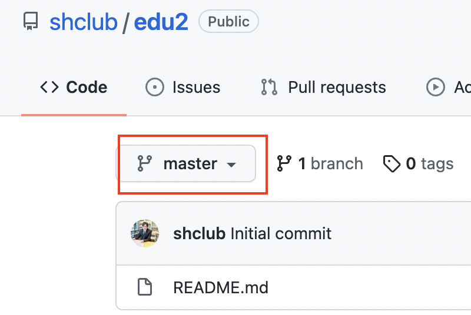  

### Git 설치.

터미널로 VM에 로그인 하여 Git이 설치되어 있는지 확인하고 없으면 Git을 설치 한다. 

```bash
ssh root@(본인 private ip) -p 22222
``` 

버전을 확인한다.  

```bash
git --version
``` 

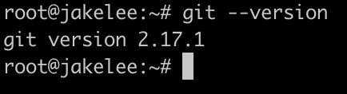

git이 없으면 설치 한다.  

```bash
apt-update && apt-get intsall git
```

### Git Clone 하여 github 소스 가져오기.  

github에서  shclub/edu2 를 선택하고 code를 클릭한다.  
https의 url를 복사한다. 오른쪽 복사 아이콘 클릭  

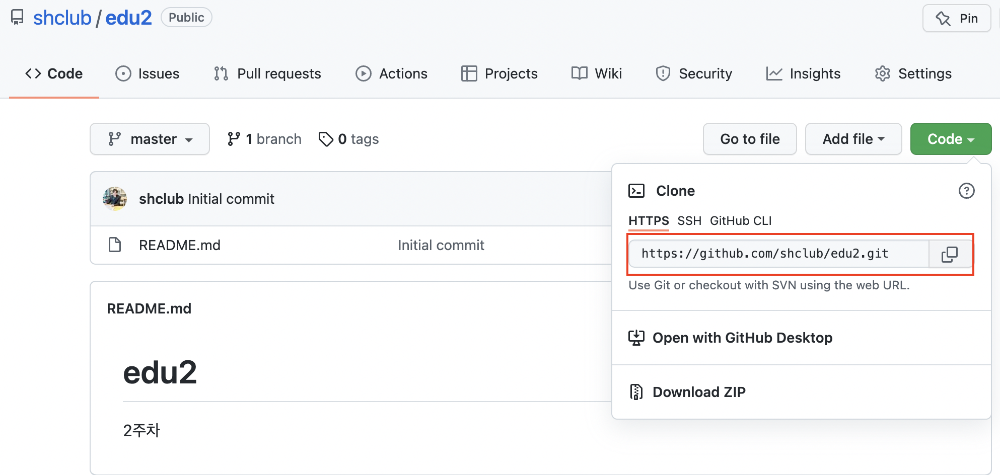  

터미털에서 git clone 명령어를 사용하여 로컬에 소스를 가져온다.  
정상적으로 가져오면 edu2 폴더로 이동하여 파일 받아진것 확인한다.

```bash
git clone https://github.com/shclub/edu2.git
```

  


### 로컬에서 본인 github에 소스 push.  

다운로드 받은 화일을 본인이 생성한 repository에 push를 한다.  
먼저 repository url을 변경한다.

원격 저장소를 확인한다.

```bash
git remote -v
```

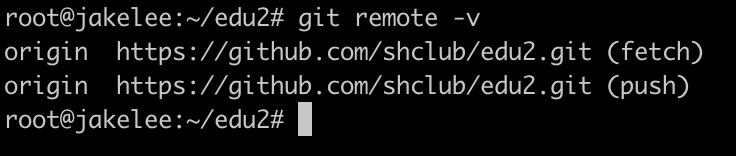  

새로운 원격 리포지토리를 추가한다.  

저장소를 처음만들고, 원격 저장소에 지정할 때의 명령어는 아래와 같다. 아직 지정해둔 원격 저장소가 없을 때엔 remote와 origin 사이에 add를, 지정해둔 원격 저장소 주소를 바꾸고 싶을 땐 set-url을 붙이는 차이가 있다.

```bash
git remote add origin https://github.com/(본인계정)/edu2.git
```

원격저장소를 본인의 github repository로 변경하고 다시 저장소를 확인한다.

```bash
git remote set-url origin https://github.com/(본인계정)/edu2.git
git remote -v
```

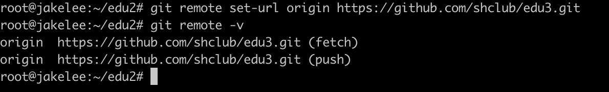  

소스를 commit 하고 push 한다.
- add . : .은 변경된 모든 소스를 대상으로 한다.
- commit :  로컬 저장소에 저장한다.
- push : 원격저장소에 저장한다.

```bash
git add .
git commit -m "first commit"
git push -u origin master
```  

git push시에 로그인이 필요하며 username은 본인 github id를 넣어주고 
비밀번호는 token 값을 넣어주어야 한다. ( 비밀번호는 불가 )  

토큰값은 별도로 저장하지 않았으면 Chapter1을 참고하여 새로 생성한다.

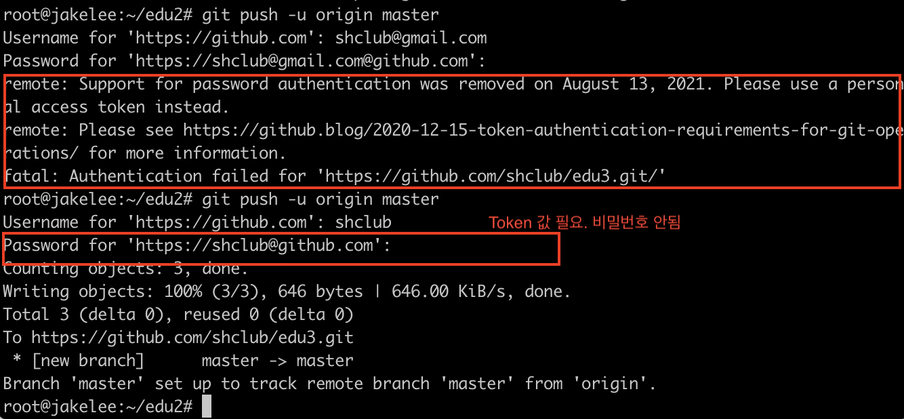  

github 화면으로 가서 README.md 화일이 생성되거나 변경 된것을 확인할 수있다.  

rejected 에러가 발생하면 아래 와 같이 force 옵션을 준다.

```bash
git push -u origin master --force
```  

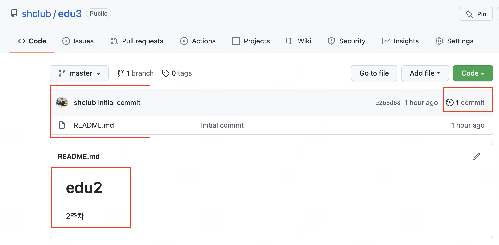  

<br/><br/>


## Docker 사용법

### Docker 란 ?

소개 및 배경
- 도커는 컨테이너 기반의 오픈소스 가상화 플랫폼이다.
- 다양한 이유로 계속 바뀌는 서버 환경과 개발 환경 문제를 해결하기 위해 등장했다.
   (툴 업데이트, 회사의 툴 사용 변경, 회사의 언어 정책 변경 등 )  
- 기존에 서버와 개발 환경이 변경되면 컴퓨터 셋팅(개발 환경) 등을 다시하거나 
  그 과정에서 발생하는 문제들과 같이, 여러모로 불편한 점이 많았다.
- 도커가 등장하고 서버관리/개발 방식이(컨테이너) 완전히 편리하게 바뀌게 된다.

사용하는 이유
- 도커 허브에 올라온 이미지와 docker-compose.yml의 설정으로 원하는
  프로그램을 편안하게 설치가 가능하다.
- 컨테이너를 생성하여 분리된 환경에 설치하므로 제거도 쉽다.
- 하나의 서버(로컬 호스트)에 포트만 변경하여 동일한 프로그램을 실행하기도 쉽다.
- 도커를 사용하지 않으면 환경변수나 경로 등의 충돌로 피곤하기 그지 없다.

서버관리 방식의 변화
- 전통적인 서버관리 방식은 아래와 같이 각 단계별로 흐름이 있었고, 각 단계가
  업데이트 되거나 어떤 문제가 발생하면 전체 흐름이 중단되는 문제가 있었다.
- 도커 등장 이후 어떠한 프로그램도 컨테이너로 만들 수 있다.
- 서로 다른 프로그램이더라도 컨테이너로 규격화되었음
- AWS, Azure, Google cloud 등 어떤 환경에서도 돌아간다.
      
- 가상머신과 비슷하게 생각할 수 있지만 비슷한점과 다른점이 있다.
- 가상머신처럼 독립적으로 실행되지만, 가상머신보다 빠르고 쉽고 효율적이다.
- 도커는 컴퓨터 자원을 그대로 사용한다. 

도커의 특징
- 도커는 가상머신이 아니고 격리만 해주기 떄문에 성능상 하락이 없다. (성능 하락이 큰 VM과 다르다.)
- 확장성과 이식성
    1) 도커가 설치되어 있다면 어디서든 컨테이너를 실행할 수 있다.
    2) 오픈 소스이기에 특정 회사나 서비스에 종속적이지 않다.
    3) 쉽게 개발서버를 만들 수 있고 테스트 서버 생성도 가능하다.
- 표준성
    1) 도커를 사용하지 않는 경우, 각각의 언어로 만든 서비스들의 배포 방식은 모두 다르다.
    2) 도커는 컨테이너라는 표준으로 서버를 배포하므로 모든 서비스들의 배포 과정이 동일해진다.
- 이미지
    1) 컨테이너를 실행하기 위한 압축파일과 같은 개념이다.
    2) 이미지에서 컨테이너를 생성하기 떄문에 반드시 이미지를 만드는 과정이 필요하다.
    3) Dockerfile을 이용하여 이미지를 만들고 처음부터 재현 가능하다.
    4) 빌드 서버에서 이미지를 만들면 해당 이미지를 이미지 저장소(허브)에 저장하고 운영서버에서 이미지를 불러와 사용한다.
- 설정관리
    1) 도커에서 설정은 보통 아래와 같이 환경변수로 제어한다.
    2) MYSQL_PASS=password와 같이 컨테이너를 띄울 때 환경변수를 같이 지정한다.
    3) 하나의 이미지가 환경변수에 따라 동적으로 설정파일을 생성하도록 만들어져야한다.
- 자원관리
    1) 컨테이너는 삭제 후 새로 만들면 모든 데이터가 초기화된다. (제거가 쉽다.)
    2) 그러므로 저장이 필요하다면, 업로드 파일을 외부 스토리지와 링크하여 사용하거나 S3같은 별도의 저장소가 필요하다.
    3) 세션이나 캐시를 memcached나 redis와 같은 외부로 분리한다.

### Dockerfile

도커 이미지를 만들기 위해서는 Dockerfile 을 생성 해야 한다.

Dockerfile 예제

```yaml

# 베이스 이미지 이며 이미지 이름 앞에 아무것도 없으면 docker hub에서 가져온다.
FROM python:3.8-slim

# 컨테이너 안에 작업 폴더를 설정한다.
WORKDIR /app

# 로컬 현대 폴더의 모든 값을 컨테이너 /app 폴더에 복사한다.
ADD . /app

# pyhon의 경우 library를 requirements.txt에 기술을 하였고 RUN 명령어를 # 사용하여 아래 구문을 실행한다.

# RUN pip install -r requirements.txt

# 직접 라이브러리를 추가 할수 있다. 단 라이브러리가 많아지면 불편하다.
RUN pip3 install flask==1.1.2
RUN pip3 install flask-cors
RUN pip3 install flask-restplus
RUN pip3 install itsdangerous==2.0.1
RUN pip3 install Werkzeug==2.0.3

# 기본 이미지는 대부분 GMT+0 기준으로 생성되어 한국 시간으로 변경 해준다
RUN ln -snf /usr/share/zoneinfo/Asia/Seoul /etc/localtime && echo Asia/Seoul > /etc/timezone

# 컨테이너 외부에서 접속할 포트를 적어준다.
EXPOSE 40003

# 컨테이너 로딩시에 사용하는 명령어를 기입한다. 
# EntryPoint와 비슷 하나 CMD를 사용하면 docker run시에 파라미터 설정 가능하다.
CMD ["python", "app.py"]
```

터미널에서 edu2 폴더로 이동하여 vi 에디터로 Dockerfile를 생성한다.  

```bash
vi Dockerfile
``` 

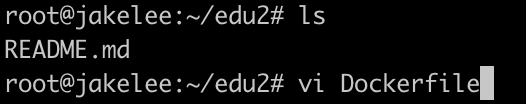  

<br/>
i (소문자) 를 누른 후 위의 Dockerfile 내용을 복사하여 붙여넣기 한다. 
esc 키를 누른 후 :wq를 입력하여 저장하고 나온다.


app.py를 생성하고 아래 소스를 추가하여 Dockerfile과 같이 저장하고 나온다.

```python
# -*- coding:utf-8 -*-
# REST API로 구현한 계산기 예제

import werkzeug
werkzeug.cached_property = werkzeug.utils.cached_property

from flask import Flask
from flask_restplus import Resource, Api, reqparse


# -----------------------------------------------------
# api
# -----------------------------------------------------
app = Flask(__name__)
api = Api(app, version='1.0', title='Calc API',
          description='계산기 REST API 문서',)

ns = api.namespace('calc', description='계산기 API 목록')
app.config.SWAGGER_UI_DOC_EXPANSION = 'list'  # None, list, full


# -----------------------------------------------------
# 덧셈을 위한 API 정의
# -----------------------------------------------------
sum_parser = ns.parser()
sum_parser.add_argument('value1', required=True, help='연산자1')
sum_parser.add_argument('value2', required=True, help='연산자2')


@ns.route('/sum')
@ns.expect(sum_parser)
class FileReport(Resource):
    def get(self):
        """
                Calculate addition
        """
        args = sum_parser.parse_args()

        try:
            val1 = args['value1']
            val2 = args['value2']
        except KeyError:
            return {'result': 'ERROR_PARAMETER'}, 500

        result = {'result': 'ERROR_SUCCESS','value': int(val1) + int(val2)}        
        return result, 200


if __name__ == '__main__':
    app.run(host='0.0.0.0', port=5000)  # , debug=True)
```

<br/>
아래 명령어를 사용하여 도커 파일을 생성한다. 
Dockerfile 위치와 같은 폴더에서 실행하여야 하며 생성할 이미지 이름 뒤에 . 을 반드시 사용한다.

```bash
docker build -t edu2 .
```   

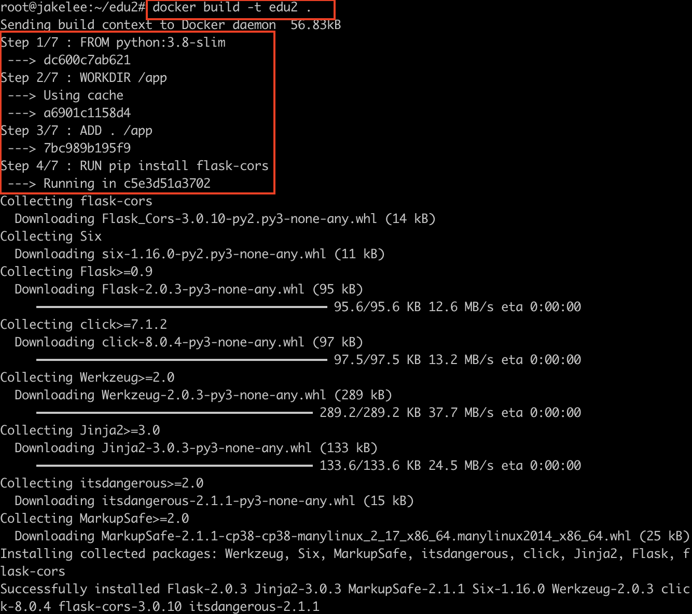

Dockerfile의 line by line 으로 단계가 구성되어 도커 레이어를 생성을 한다.
내부 적으로는 docker commit 명령어가 실행이 되면 도커를 재 생성시에는 
Cache를 사용 하기 때문에 훨씬 빨리 빌드가 된다.

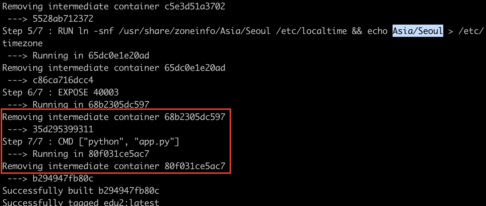  

중간에 임시에 생성된 intermediate 컨테이너가 삭제가 되고 빌드 이미지가 만들어진다.  

아래 명령어를 사용하여 생성된 도커 이미지를 확인 할 수 있다.

```bash
docker images
```  

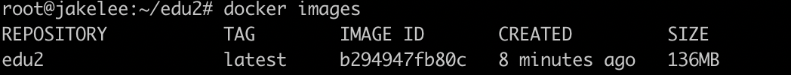

Docker Hub에 전송하기 위해서는 tagging을 하고 push를 한다.
tag 명령어 뒤에는 로컬 이미지 이름 , 다음에는 도커허브 이미지 이름을 입력.

```bash
docker tag edu2 (본인 도커 허브 ID)/edu2
docker push (본인 도커 허브 ID)/edu2
```  

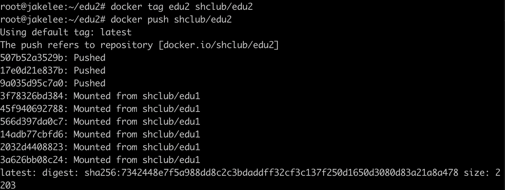

Docker Hub에 페이지에서 push된 이미지를 확인한다.

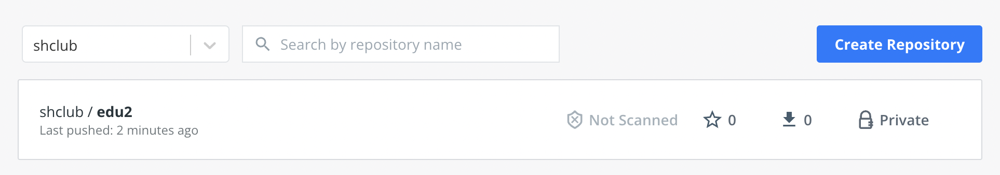

실행 중인 컨테이너를 확인하고 40003  포트를 사용하는 컨테이너를 stop 한다.
```bash
docker ps
docker stop (컨테이너id)
```  

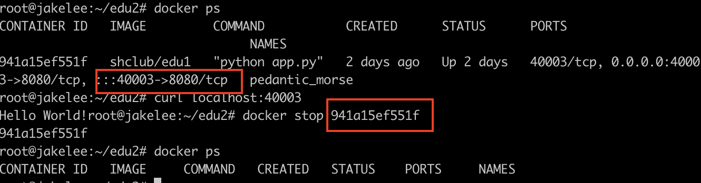

도커 이미지를 실행한다.
- -d : 데몬모드(백그라운드)
- --name : 컨테이너에 이름을 부여한다.
- -p : 포트 ( 외부접속포트 : 컨테이너 포트)
- 맨 마지막에 도커 이미지 이름  

```bash
docker run -d --name my-python -p 40003:5000 (본인 도커 허브 ID)/edu2
```  

docker ps 명령어로 정상적인지 확인한다.

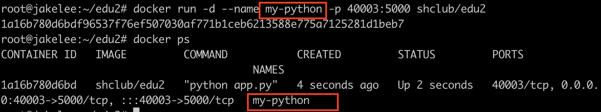

docker ps 로 아무 것도 없으면 docker ps -a 명령어도 kill 된 컨테이너를 확인하고
docker logs 명령어로 로그를 확인한다.


```bash
docker logs (컨테이너id)
```  
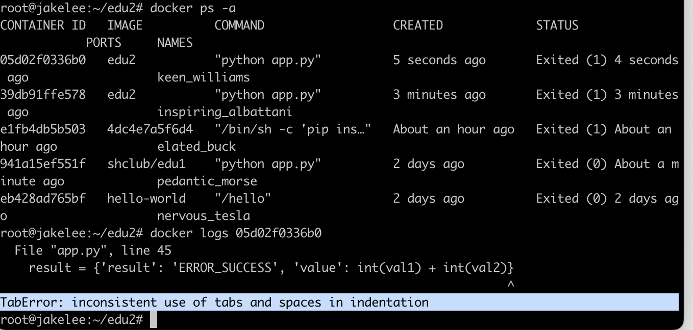  

docker 컨테이너 안으로 들어가 본다.

```bash
docker exec -it (컨테이너id) /bin/sh
```  

컨테이너 내부에서 ls 명령어를 쳐보면 도커 빌드시 복사되었던 소스를 확인 할 수 있다.

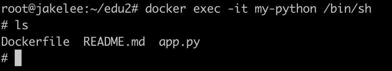  

exit 명령어를 사용하여 컨테이너 내부에서 나올수 있다.  

현재 컨테이너의 내용을 도커 이미지로 저장하고 싶을때는 commit 명령어를 사용한다.
- -m : 뒤에 comment를 적어준다
- 컨테이너 이름 : 현재 실행되는 컨테이너 이름 또는 컨테이너 아이디를 적여준다
- 신규 도커 이미지 : 신규로 생성하고 싶은 로컬 도커이미지 이름을 적어준다  

```bash
docker commit -m "new edu2" (컨테이너 이름) (생성하고싶은 이미지 이름):(버전)
```  

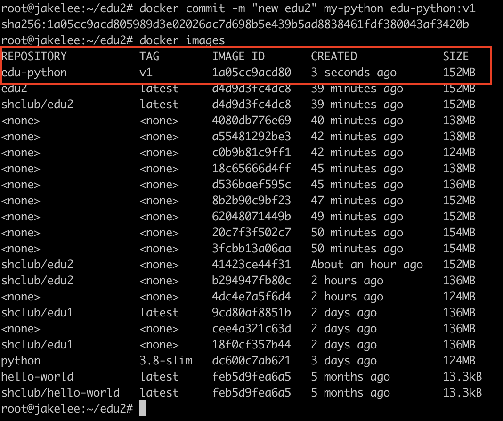

<br/>

도커 추가 명령어
- 정지 중인 컨테이너 삭제 : docker container prune
- 이미지 , 정지되어 있는 컨테이너 , 네트웍크 삭제 : docker system prune
- 도커 이미지 삭제 : docker rmi (도커 로컬 이미지 이름)
- 컨테이너 삭제 : docker rm [CONTAINER_ID] 
- 컨테이너 일시정지 :  docker stop [CONTAINER_ID]
- 컨테이너 일시정지 :  docker commit [CONTAINER_ID]


### Swagger

Swagger 란
- Open Api Specification(OAS)를 위한 프레임워크이다.
- API들이 가지고 있는 스펙(spec)을 명세, 관리할 수 있는 프로젝트/문서
- API 사용 방법을 사용자에게 알려주는 문서
- Springboot에서 Swagger를 사용하면, 컨트롤러에 명시된 어노테이션을 해석하여 API문서를 자동으로 만들어준다.
- 참고로 Swagger는 Java에 종속된 라이브러리가 아니다.

    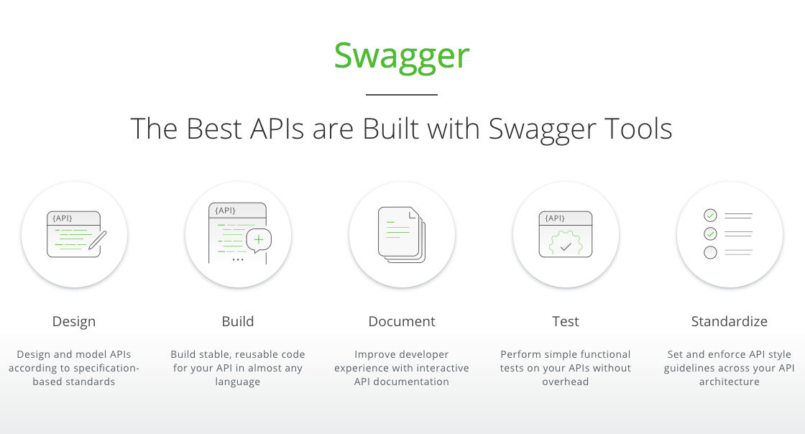

Swagger의 기능    

- API Design (API 설계)
    - Swagger-editor를 통해 api를 문서화하고 빠르게 명세 가능
- API Development
    - Swagger-codepen을 통해 작성된 문서를 통해 SDK를 생성하여 빌드 프로세스를 간소화할 수 있도록 도와준다.
- API Documentation
    - Swagger-UI를 통해 작성된 API를 시각화시켜준다.
- API Testing
    - Swagger-Inspector를 통해 API를 시각화하고 빠른 테스팅을 진행할 수 있다.
- Standardize
    - Swagger-hub를 통해 개인, 팀원들이 API 정보를 공유하는 Hub


생성된 이미지는 간단한 계산을 하는 기능으로  swagger 를 내장하고 있다.

브라우저에서 (본인 VM IP ):40003를 호출하면 아래 화면을 볼 수 있다.
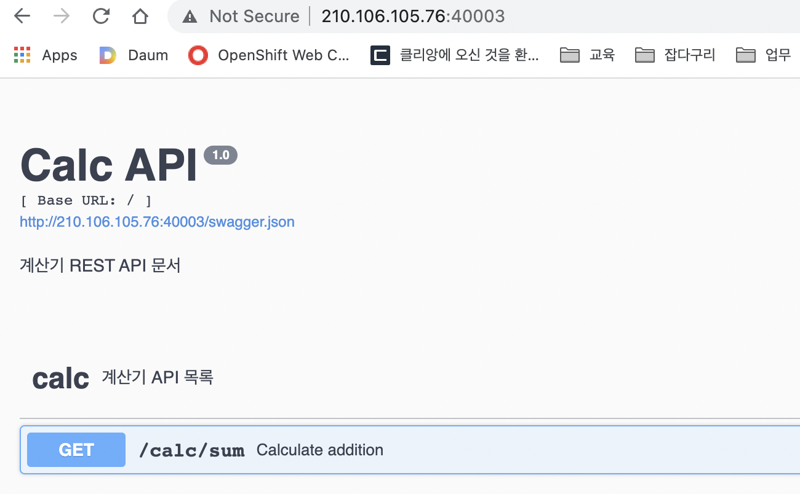   

GET을 클릭하고 오른쪽에 try it out를 클릭하면 API를 테스트 할 수 있다.
  

연산자 1, 2에 값을 넣고 execute를 하면 API 가 수행이된다.
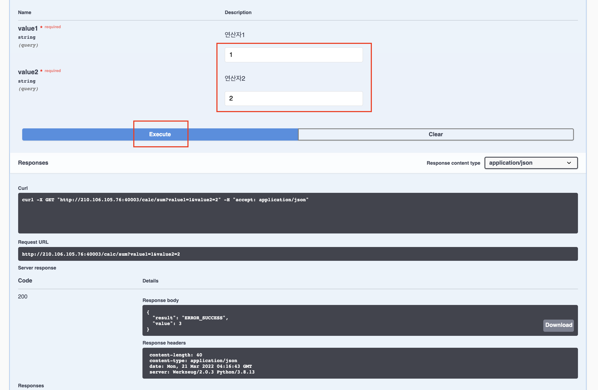  

<br/>

## Docker Compose 

<br/>

### Docker Compose 개요

Docker compose란, 여러 개의 컨테이너로부터 이루어진 서비스를 구축, 실행하는 순서를 자동으로 하여, 관리를 간단히하는 기능이다.

 Docker compose에서는 compose 파일을 준비하여 커맨드를 1회 실행하는 것으로, 그 파일로부터 설정을 읽어들여 모든 컨테이너 서비스를 실행시키는 것이 가능하다.

### Docker Compose를 사용하기까지의 주요한 단계

Docker compose를 사용하기 위해서는, 크게 나눠 아래의 세 가지 순서로 이루어진다.

1) 각각의 컨테이너의 Dockerfile를 작성한다(기존에 있는 이미지를 사용하는 경우는 불필요).

2) docker-compose.yml를 작성하고, 각각 독립된 컨테이너의 실행 정의를 실시한다(경우에 따라는 구축 정의도 포함).

3) "docker-compose up" 커맨드를 실행하여 docker-compose.yml으로 정의한 컨테이너를 개시한다.

 Docker compose는 start, stop, status, 실행 중의 컨테이너의 로그 출력, 약간의 커맨드의 실행이과 같은 기능도 가지고 있다.

<br/>

### Docker Compose 설치

본인 VM에 터미널로 접속하여 아래 명령어를 입력한다.

```bash
apt-get update && apt install docker-compose
```  
중간에 추가 설치 내용이 나오면 Y를 입력하고 엔터를 친다.

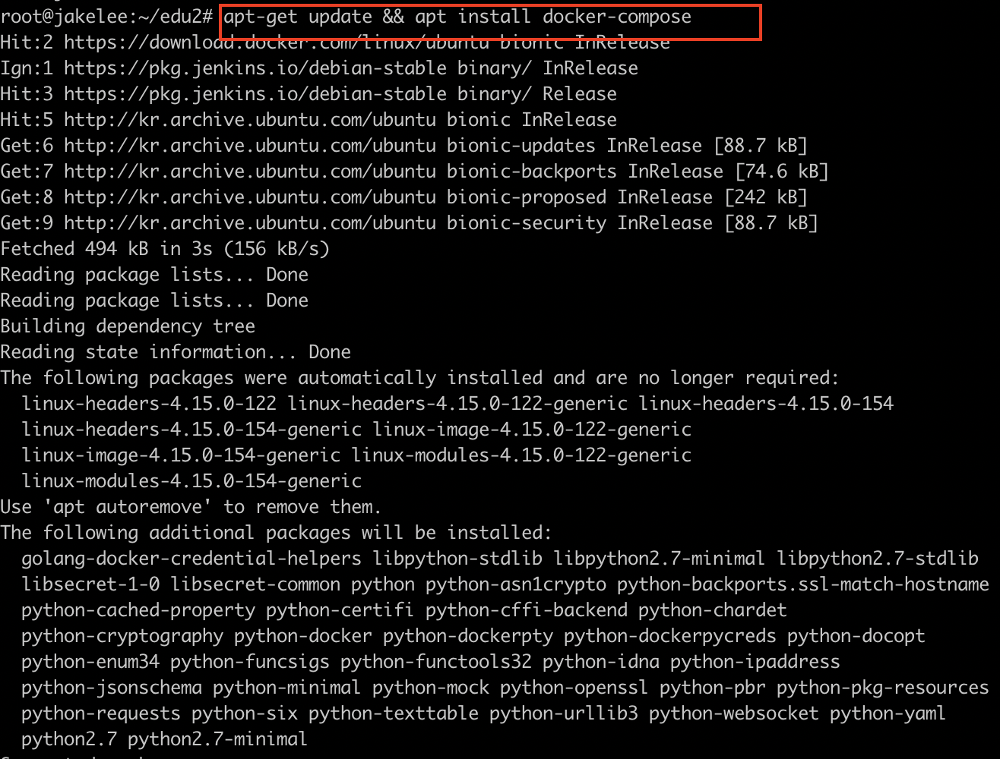

도커 컴포즈 버전을 확인하고 아래와 같이 나오면 정상적으로 설치가 된 것이다.

```bash
docker-compose --version
```  
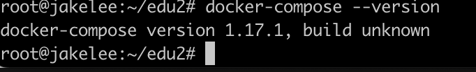  

### Docker Compose yaml  

도커 실행 명령어를 yml 파일로 스크립트 문서화 하여 관리한다.  

이번 예제는 워드프레스(WordPress)라는 오픈 소스 블로그 소프트웨어 이고
워드 프레스를 통해서 PHP기반의 웹페이지를 만들수 있다.
기본적으로 Mysql DB를 내장하고 있다.


터미널로 접속하여 새로운 폴더를 하나 생성하고 생성된 폴더로 이동한다.
vi 에디터로  docker-compose.yml 를 생성한다.

```bash
mkdir edu2-1
cd edu2-1
vi docker-compose.yml
```  

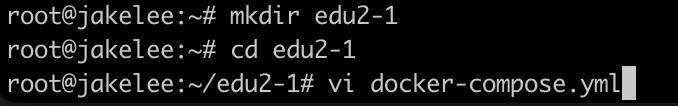 

아래의 내용을 복사하여 docker-compose.yml에 붙여 넣기한다.
esc 눌러주고 :wq를 입력하여 저장하고 나온다.


```yaml
version: '3.3'

services:
   db:
     image: mysql:5.7
     volumes:
       - ./mysql:/var/lib/mysql
     restart: always
     environment:
       MYSQL_ROOT_PASSWORD: wordpress
       MYSQL_DATABASE: wordpress
       MYSQL_USER: wordpress
       MYSQL_PASSWORD: wordpress
   wordpress:
     depends_on:
       - db
     image: wordpress:latest
     ports:
       - "40004:80"
     restart: always
     environment:
       WORDPRESS_DB_HOST: db:3306 // mysql 기본 설정
       WORDPRESS_DB_USER: wordpress
       WORDPRESS_DB_PASSWORD: wordpress
       WORDPRESS_DB_NAME: wordpress
     volumes:
       - ./wp:/var/www/html
```  

Docker compose 명령어를 사용하여 컨테이너를 실행한다.

```bash
docker-compose up -d
```  

- 현재 디렉토리에 있는 docker-compose 파일을 실행하여, docker-compose 파일에 정의된 컨테이너를 실행한다.
- -d 옵션을 주면 daemon(백그라운드)으로 실행한다.
- –force-recreate 옵션으로 컨테이너를 새로 만들 수 있다.
- –build 옵션으로 도커 이미지를 다시 빌드한다. (build로 선언했을 때만)  


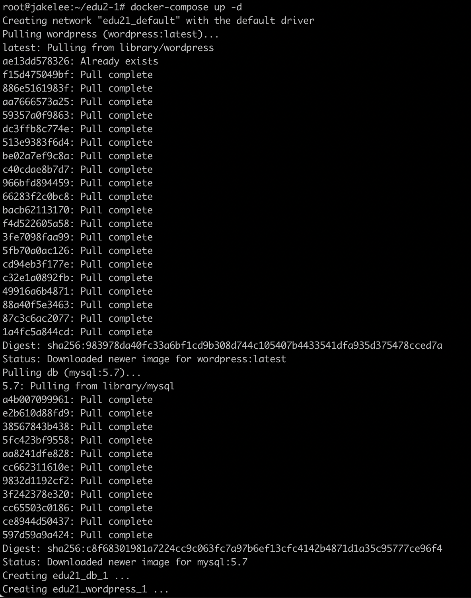 

Docker ps를 해보면 2개의 컨테이너가 떠 있는 것을 확인 할 수 있다.

```bash
docker ps 또는 docker-compose ps
```  

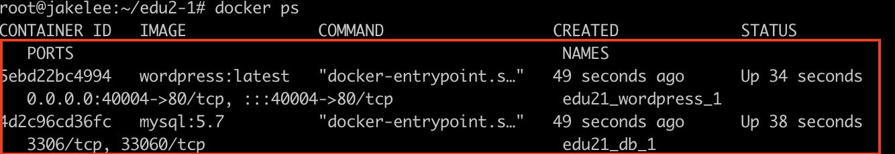 


해당 폴더를 보면 .wp 와  .mysql 폴더가 생성 된 것을 확인 할수 있다.

```bash
ls
```  
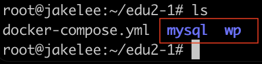

docker compose 기동시에 volumes 설정이 로컬 폴더와 컨테이너 폴더를 연결 한것 을 볼수 있다. 

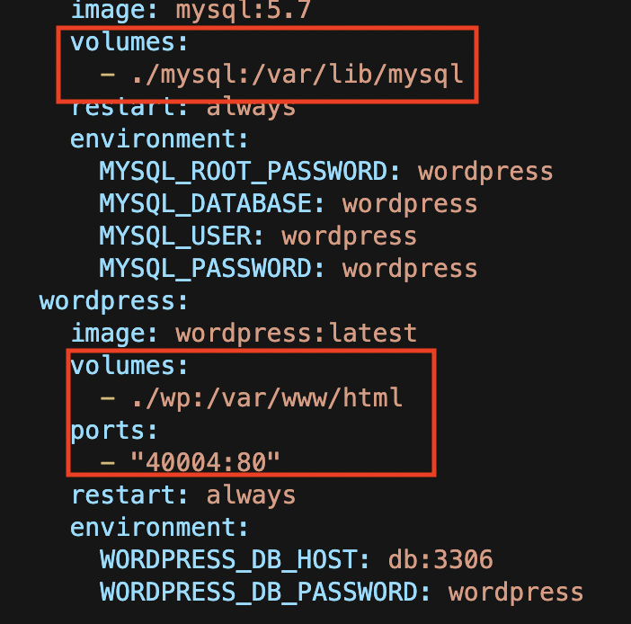

브라우저를 통해서 http://(본인IP):40004로 접속하여 정상적으로 로드 된걸 확인 할 수 있다.

도커 컴포즈 명령어
- 컨테이너 종료 : docker-compose down
- 컨테이너 정지 : docker-compose stop  
- 컨테이너 로그 보기 : docker-compose logs
- 컨테이저 재시작 : docker-compose restart
- stop으로 정지 된 컨테이너 시작 : docker-compose start
- 도커 네트웍 지우기 : docker network prune

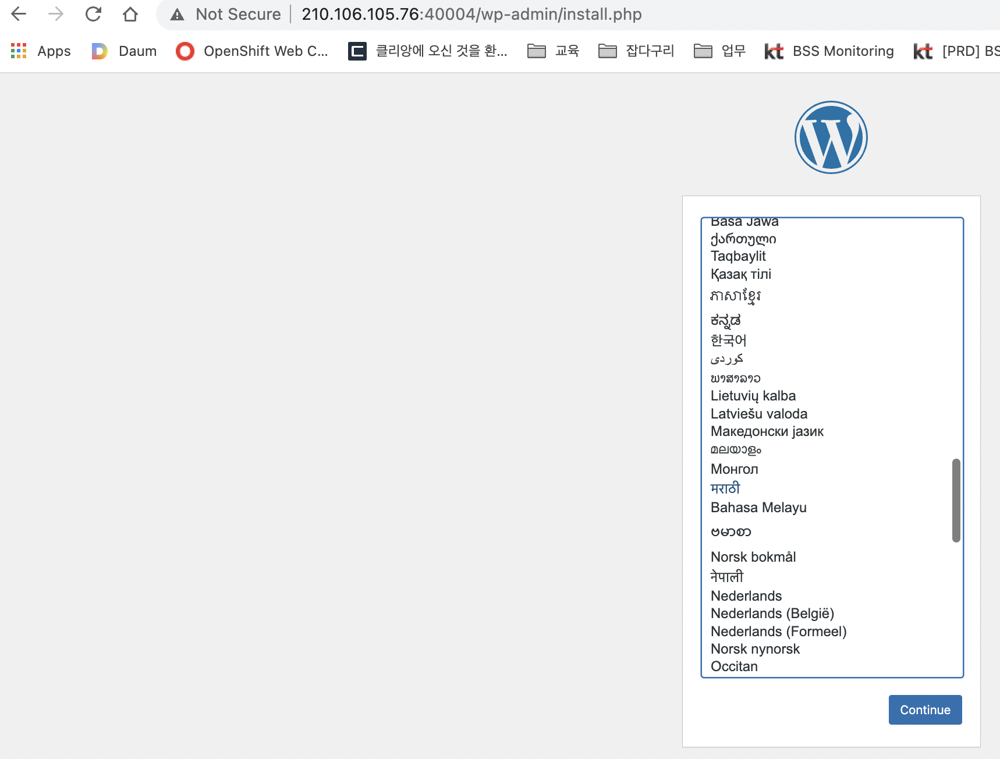


* 과제 1 : docker compose로 구성한 mysql container  접속하여 로그인 한 후 wordpress db에 customer 테이블을 생성해 본다.  

* 과제 2 : 금일 실습한 Dockerfile과 docker-compose.yml 화일을 git 명령어를 사용하여 edu2에 push 한다.
