# Chapter 3 
   

kubernetes 는 light하고 빠른 설치가 가능한 Rancher에서 제공하는 k3s로 진행을 하고 kubernetes 배포 관리자인 helm 에 대한 사용법을 습득한다.

1. k3s 설치 및 기능 설명

2. helm 설치 및 helm 으로 prometheus 설치 실습

3. kubernetes IDE Lens 설치 및 사용법 실습

 
<br/>

##  kubernetes

### kubernetes 개요  (https://kubernetes.io/ko/docs/concepts/overview/what-is-kubernetes/)

쿠버네티스는 컨테이너화된 워크로드와 서비스를 관리하기 위한 이식성이 있고, 확장가능한 오픈소스 플랫폼이다. 쿠버네티스는 선언적 구성과 자동화를 모두 용이하게 해준다. 쿠버네티스는 크고, 빠르게 성장하는 생태계를 가지고 있다.   

쿠버네티스 서비스, 기술 지원 및 도구는 어디서나 쉽게 이용할 수 있다.

쿠버네티스란 명칭은 키잡이(helmsman)나 파일럿을 뜻하는 그리스어에서 유래했다. K8s라는 표기는 "K"와 "s"와 그 사이에 있는 8글자를 나타내는 약식 표기이다. 구글이 2014년에 쿠버네티스 프로젝트를 오픈소스화했다. 쿠버네티스는 프로덕션 워크로드를 대규모로 운영하는 15년 이상의 구글 경험과 커뮤니티의 최고의 아이디어와 적용 사례가 결합되어 있다.  


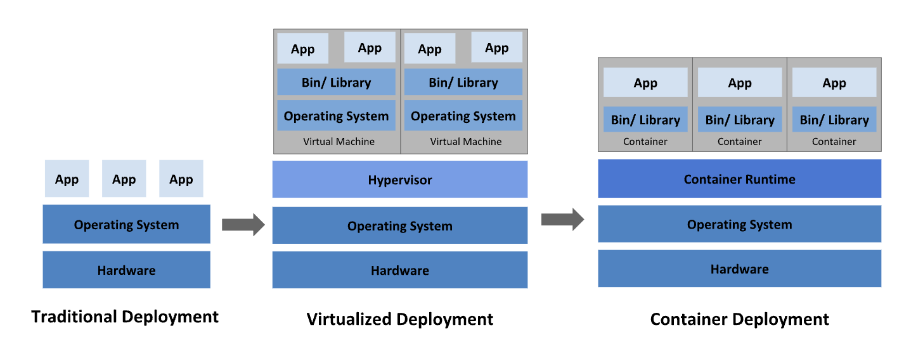   

<br/>


쿠버네티스는 다음을 제공한다.

- 서비스 디스커버리와 로드 밸런싱 : 쿠버네티스는 DNS 이름을 사용하거나 자체 IP 주소를 사용하여 컨테이너를 노출할 수 있다. 컨테이너에 대한 트래픽이 많으면, 쿠버네티스는 네트워크 트래픽을 로드밸런싱하고 배포하여 배포가 안정적으로 이루어질 수 있다.
- 스토리지 오케스트레이션 : 쿠버네티스를 사용하면 로컬 저장소, 공용 클라우드 공급자 등과 같이 원하는 저장소 시스템을 자동으로 탑재 할 수 있다.
- 자동화된 롤아웃과 롤백 : 쿠버네티스를 사용하여 배포된 컨테이너의 원하는 상태를 서술할 수 있으며 현재 상태를 원하는 상태로 설정한 속도에 따라 변경할 수 있다. 예를 들어 쿠버네티스를 자동화해서 배포용 새 컨테이너를 만들고, 기존 컨테이너를 제거하고, 모든 리소스를 새 컨테이너에 적용할 수 있다.
- 자동화된 빈 패킹(bin packing) : 컨테이너화된 작업을 실행하는데 사용할 수 있는 쿠버네티스 클러스터 노드를 제공한다. 각 컨테이너가 필요로 하는 CPU와 메모리(RAM)를 쿠버네티스에게 지시한다. 쿠버네티스는 컨테이너를 노드에 맞추어서 리소스를 가장 잘 사용할 수 있도록 해준다.
- 자동화된 복구(self-healing) : 쿠버네티스는 실패한 컨테이너를 다시 시작하고, 컨테이너를 교체하며, '사용자 정의 상태 검사'에 응답하지 않는 컨테이너를 죽이고, 서비스 준비가 끝날 때까지 그러한 과정을 클라이언트에 보여주지 않는다.
- 시크릿과 구성 관리 : 쿠버네티스를 사용하면 암호, OAuth 토큰 및 SSH 키와 같은 중요한 정보를 저장하고 관리 할 수 있다. 컨테이너 이미지를 재구성하지 않고 스택 구성에 시크릿을 노출하지 않고도 시크릿 및 애플리케이션 구성을 배포 및 업데이트 할 수 있다

<br/>

### kubernetes 컴포넌트  (https://kubernetes.io/ko/docs/concepts/overview/components/)

<br/>  


쿠버네티스 클러스터는 컨테이너화된 애플리케이션을 실행하는 노드라고 하는 워커 머신의 집합. 모든 클러스터는 최소 한 개의 워커 노드를 가진다.  

워커 노드는 애플리케이션의 구성요소인 파드를 호스트한다. 컨트롤 플레인은 워커 노드와 클러스터 내 파드를 관리한다. 프로덕션 환경에서는 일반적으로 컨트롤 플레인이 여러 컴퓨터에 걸쳐 실행되고, 클러스터는 일반적으로 여러 노드를 실행하므로 내결함성과 고가용성이 제공된다.

쿠버네티스 클러스터 구성 요소  
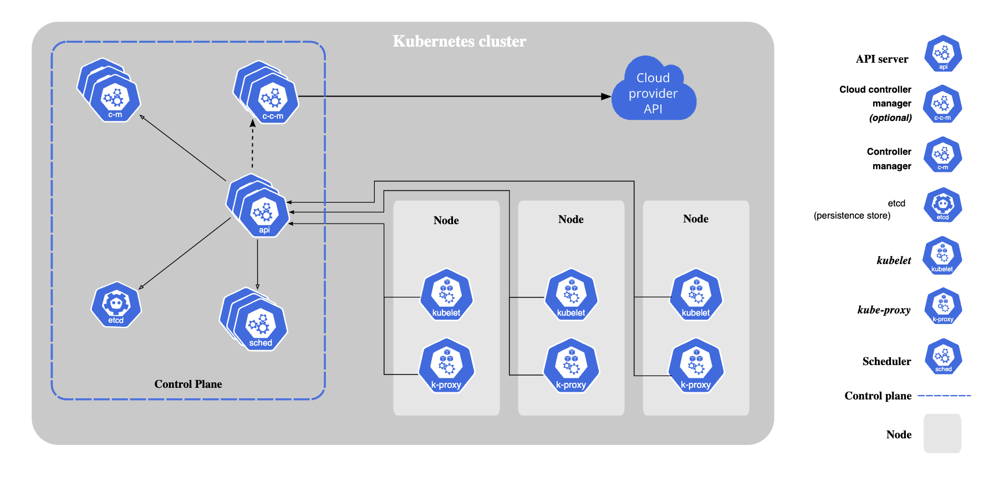  


<br/>

컨트롤 플레인 컴포넌트  

컨트롤 플레인 컴포넌트는 클러스터에 관한 전반적인 결정(예를 들어, 스케줄링)을 수행하고 클러스터 이벤트(예를 들어, 디플로이먼트의 replicas 필드에 대한 요구 조건이 충족되지 않을 경우 새로운 파드를 구동시키는 것)를 감지하고 반응한다.  

- kube-apiserver  
API 서버는 쿠버네티스 API를 노출하는 쿠버네티스 컨트롤 플레인 컴포넌트이다. API 서버는 쿠버네티스 컨트롤 플레인의 프론트 엔드이다.  
쿠버네티스 API 서버의 주요 구현은 kube-apiserver 이다. kube-apiserver는 수평으로 확장되도록 디자인되었다. 즉, 더 많은 인스턴스를 배포해서 확장할 수 있다. 여러 kube-apiserver 인스턴스를 실행하고, 인스턴스간의 트래픽을 균형있게 조절할 수 있다.

- etcd  
모든 클러스터 데이터를 담는 쿠버네티스 뒷단의 저장소로 사용되는 일관성·고가용성 키-값 저장소.    
쿠버네티스 클러스터에서 etcd를 뒷단의 저장소로 사용한다면, 이 데이터를 백업하는 계획은 필수이다.  

- kube-scheduler  
노드가 배정되지 않은 새로 생성된 파드 를 감지하고, 실행할 노드를 선택하는 컨트롤 플레인 컴포넌트.  
스케줄링 결정을 위해서 고려되는 요소는 리소스에 대한 개별 및 총체적 요구 사항, 하드웨어/소프트웨어/정책적 제약, 어피니티(affinity) 및 안티-어피니티(anti-affinity) 명세, 데이터 지역성, 워크로드-간 간섭, 데드라인을 포함한다.

- kube-controller-manager  
컨트롤러 프로세스를 실행하는 컨트롤 플레인 컴포넌트.  
논리적으로, 각 컨트롤러는 분리된 프로세스이지만, 복잡성을 낮추기 위해 모두 단일 바이너리로 컴파일되고 단일 프로세스 내에서 실행된다.

<br/>

노드 컴포넌트  

노드 컴포넌트는 동작 중인 파드를 유지시키고 쿠버네티스 런타임 환경을 제공하며, 모든 노드 상에서 동작한다.  

- kubelet  
클러스터의 각 노드에서 실행되는 에이전트. Kubelet은 파드에서 컨테이너가 확실하게 동작하도록 관리한다.  
Kubelet은 다양한 메커니즘을 통해 제공된 파드 스펙(PodSpec)의 집합을 받아서 컨테이너가 해당 파드 스펙에 따라 건강하게 동작하는 것을 확실히 한다. Kubelet은 쿠버네티스를 통해 생성되지 않는 컨테이너는 관리하지 않는다.

- kube-proxy  
kube-proxy는 클러스터의 각 노드에서 실행되는 네트워크 프록시로, 쿠버네티스의 서비스 개념의 구현부이다.  
kube-proxy는 노드의 네트워크 규칙을 유지 관리한다. 이 네트워크 규칙이 내부 네트워크 세션이나 클러스터 바깥에서 파드로 네트워크 통신을 할 수 있도록 해준다.  
kube-proxy는 운영 체제에 가용한 패킷 필터링 계층이 있는 경우, 이를 사용한다. 그렇지 않으면, kube-proxy는 트래픽 자체를 포워드(forward)한다.

- 컨테이너 런타임  
컨테이너 런타임은 컨테이너 실행을 담당하는 소프트웨어이다.  
쿠버네티스는 여러 컨테이너 런타임을 지원한다. 도커(Docker), containerd, CRI-O 그리고 Kubernetes CRI (컨테이너 런타임 인터페이스)를 구현한 모든 소프트웨어.

<br/>

애드온  
애드온은 쿠버네티스 리소스(데몬셋, 디플로이먼트 등)를 이용하여 클러스터 기능을 구현한다. 이들은 클러스터 단위의 기능을 제공하기 때문에 애드온에 대한 네임스페이스 리소스는 kube-system 네임스페이스에 속한다.

선택된 일부 애드온은 아래에 설명하였고, 사용 가능한 전체 확장 애드온 리스트는 애드온을 참조한다.

- DNS  
여타 애드온들이 절대적으로 요구되지 않지만, 많은 예시에서 필요로 하기 때문에 모든 쿠버네티스 클러스터는 클러스터 DNS를 갖추어야만 한다.  

클러스터 DNS는 구성환경 내 다른 DNS 서버와 더불어, 쿠버네티스 서비스를 위해 DNS 레코드를 제공해주는 DNS 서버다.  

쿠버네티스에 의해 구동되는 컨테이너는 DNS 검색에서 이 DNS 서버를 자동으로 포함한다.


### k3s를 설치 한다.

k3s는 가벼운 Kubernetes로 Rancher에서 개발되었으며 쉬운 설치로 적은 메모리/binary 파일을 사용하여 Edge/IoT 환경 혹은 CI/Dev 환경에서 k8s를 쉽게 사용할 수 있도록 도와주는 도구이다.   

심지어 라즈베리파이 에서도 잘 작동한다.

   
터미널로 VM에 로그인 한다.


```bash
ssh root@(본인 VM 공인 ip) -p 22222
``` 

root 계정으로 진행시 아래와 같이 입력하고 패키지를 업그레이드 한다.    
멈추어 있는 듯 하면 Enter를 입력한다.  
일반 계정인 경우는 앞에 sudo를 붙인다. 

```bash
apt update & apt upgrade
``` 

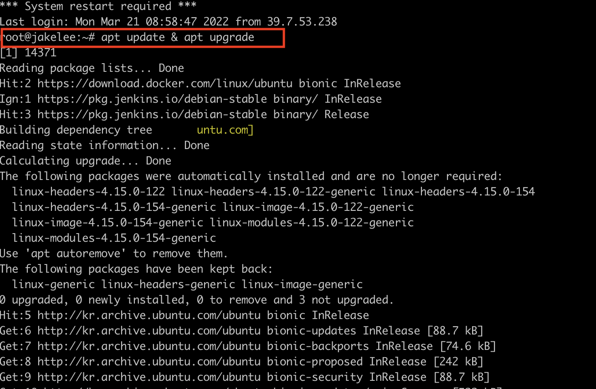  

k3s를 설치한다. 몇 초 안에 설치가 된다.  
- kubernetes full version 은 1시간 정도, Openshift는 2시간 정도 설치 시간 소요

<br/>
--tls-san 다음의 IP는 본인의 VM Public IP를 입력한다.

```bash
curl -sfL https://get.k3s.io | INSTALL_K3S_EXEC="--tls-san 210.106.105.68" sh -s -
```


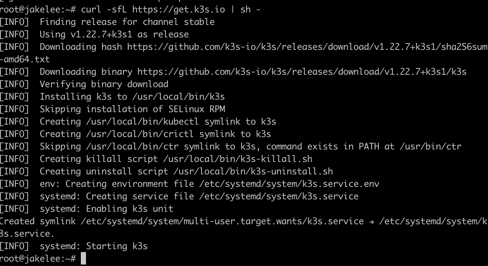  

k3s 가 설치가 잘되어 있는지 확인한다. Active ( running ) 이며 정상. 

```bash
systemctl status k3s
```  

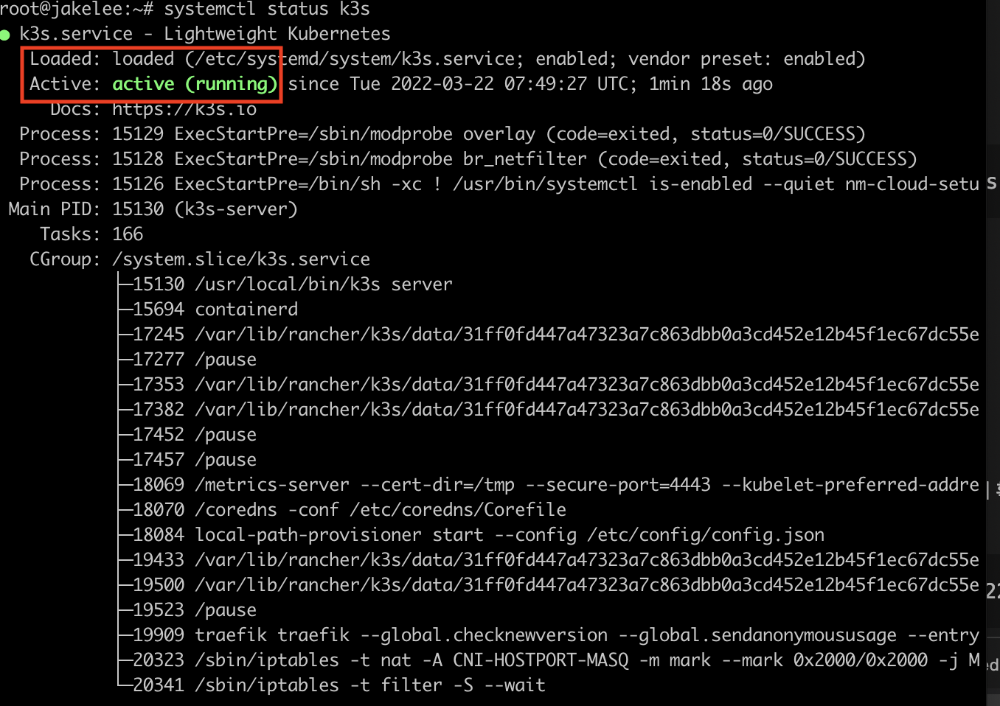  

ctrl + c 키를 입력하고 화면을 나온다.

<br/>

Kubernetes를 제어할 수 있는 CLI인 kubectl을 이용해, 클러스터가 정상적으로 생성된 것도 확인할 수 있다.   
현재 k3는 master와 worker node가 하나의 vm에 설치 되어 있다.  
kubernetes 버전은 현재 기준 최신인 1.22 이다.

```bash
# Node 상태 확인
kubectl get nodes
```  

```bash  

# Kubernetes 시스템 Pod 상태 확인
kubectl get pod -n kube-system
```  

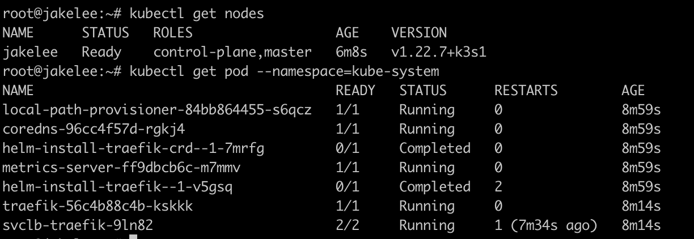  

k3s는 metric-server가 설치 되어 있어 노드의 리소스를 확인 할 수 있다.

```bash
kubectl top nodes
```  
 
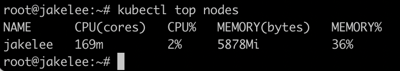     


<br/>


### 로컬 컴퓨터에서 원격지 Kubernetes 클러스터 접속 위한 설정 

<br/>

k3s를 설치하면, 클러스터의 인증서와 사용자 비밀번호 등 인증하는데 필요한 정보가 /etc/rancher/k3s/k3s.yaml에 저장됩니다.    

외부에서 Kubernetes API server 에 접속하기 위해서 token을 사용한다고 이해 하면 된다.  


```bash
cat /etc/rancher/k3s/k3s.yaml
```  

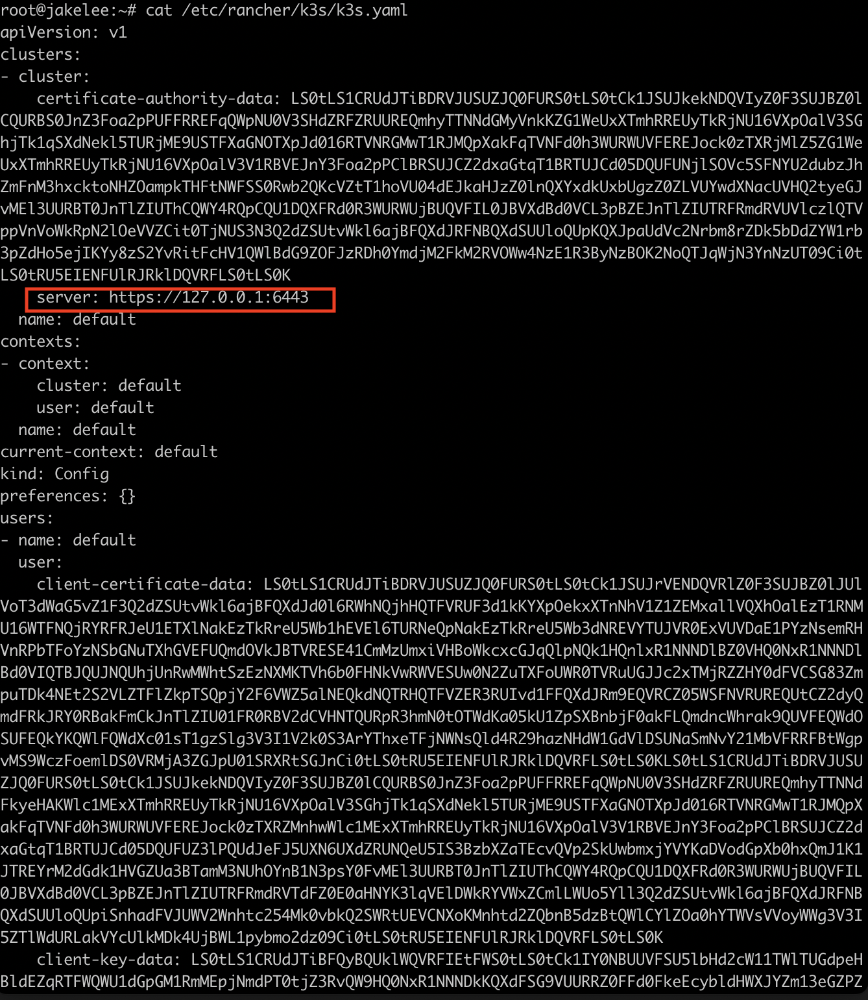  

이 파일을  복사 하여 로컬 컴퓨터에 복사해오면 됩니다.    

서버 주소가 127.0.0.1로 되어있거나, 이름의 대부분이 default로 되어 있습니다. 하나의 Kubernetes 클러스터만 관리한다면 이름은 문제가 되지 않겠지만, 여러 개의 클러스터에 하나의 컴퓨터에서 접속한다면 이름을 반드시 바꿔주어야 합니다.

2개의 값을 일괄 변경 한다.  

- default ->  k3s-test ( 총 6개 ) 
- ip는  127.0.0.1 ->  본인 VM서버 공인 ip

<br/>
vi 에디터에서 esc 키를 클릭한 후 아래 와 같이 사용하면 일괄 변경 가능하다.  

```bash
:%s/127.0.0.1/(본인 VM Public IP)/g
:%s/default/(본인 생성하고 싶은 k3s 이름)/g
```  

```bash
:%s/127.0.0.1/210.106.105.76/g
:%s/default/k3s-test/g
```

<br/>

```bash
apiVersion: v1
clusters:
- cluster:
    certificate-authority-data: LS0tLS1CRUdJTiBDRVJUSUZJQ0FURS0tLS0tCk1JSUJkekNDQVIyZ0F3SUJBZ0lCQURBS0Jn
    --- 보안상 삭제
    server: https://210.106.105.76:6443
  name: k3s-test
contexts:
- context:
    cluster: k3s-test
    user: k3s-test
  name: k3s-test
current-context: k3s-test
kind: Config
preferences: {}
users:
- name: k3s-test
  user:
    client-certificate-data: LS0tLS1CRUdJTiBDRVJUSUZJQ0FURS0tLS0tCk1JSUJrVENDQVRlZ0F3SUJBZ0lJUlVoT3dWa
    --- 보안상 삭제
    client-key-data: LS0tLS1CRUdJTiBFQyBQUklWQVRFIEtFWS0tLS0tCk1IY0NBUUVFSU5lbHd2cW11TWlTUGdpe
    --- 보안상 삭제
```

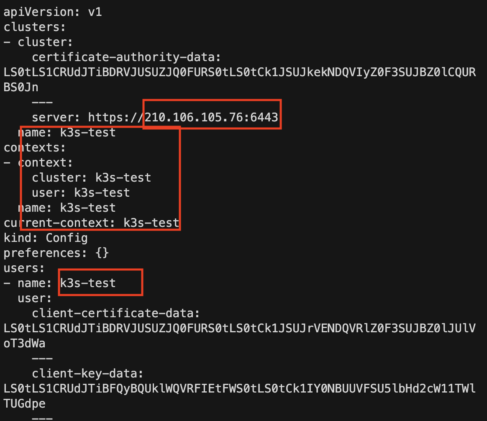 

변경된 값을 로컬 특정 폴더에  config-k3stest 이름으로 저장한다.  
.kube 폴더가 없으면 생성한다. ( config 화일은 확장자가 없이 만든다 )  

- Windows : c:\Users\본인계정\.kube\config-k3stest
- Mac : ~/.kube/config-k3stest


설치시에 INSTALL_K3S_EXEC="--tls-san 구문을 추가했다면 아래 과정은 skip.  

Kubernetes API 서버의 인증서가 내부 IP만 접속하도록 설정이되어 있어
외부에서 접속 가능하도록  k3s를 설치한 서버의 systemd 설정을 바꿔줍시다.  

/etc/systemd/system/k3s.service를 열고, ExecStart 부분에 --tls-san 설정을 추가해줍니다.  

만약 공인 IP에 도메인을 연결하여 접속하고 싶다면, 공인 IP 대신에 도메인을 입력하면 됩니다.  

vi 에디터로 /etc/systemd/system/k3s.service 수정합니다.


```bash
vi /etc/systemd/system/k3s.service
```  

 

```bash
# 원본
ExecStart=/usr/local/bin/k3s \
    server \

# 이렇게 변경해 줍시다
ExecStart=/usr/local/bin/k3s \
    server --tls-san YOUR-K3S-IP-ADDRESS-OR-DOMAIN \
```  

아래와 같이 본인 맨 밑의 라인에 i 입력하여 입력모드로 변경 후 
--tls-san (본인 VM의 공인 IP) 를 입력하고 esc키를 누르고 :wq를 입력하여 저장하고 나온다.

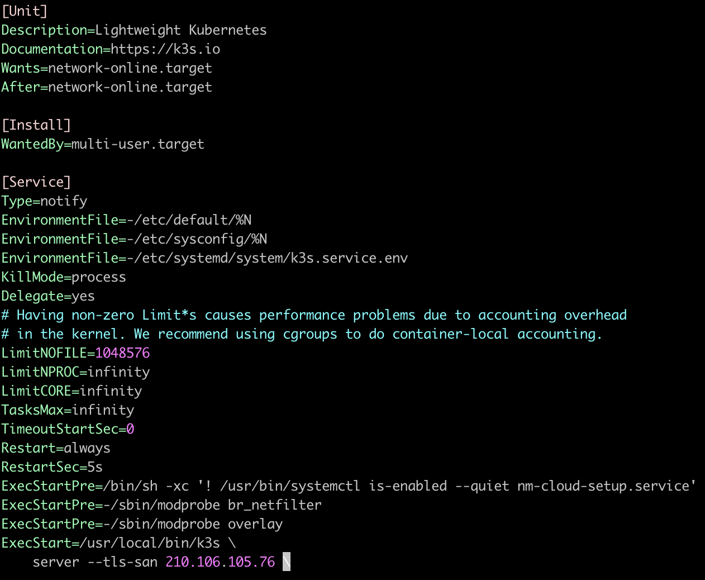   

변경이 완료되었다면 systemd 서비스를 다시 시작해 줍니다.

```bash
# 원격 서버에서 실행
systemctl daemon-reload
systemctl restart k3s
kubectl get nodes
```  

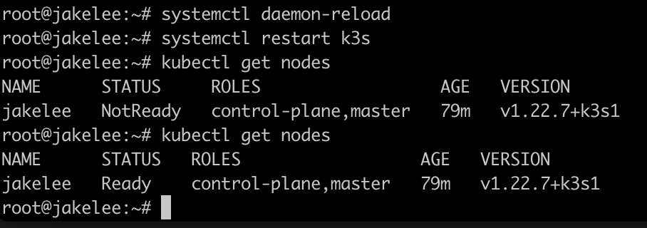  

재기동시 시간이 걸릴 수가 있으며 STATUS가 Ready 이면 재기동 성공.  

<br/>

k3s 삭제방법  
 
```bash
/usr/local/bin/k3s-uninstall.sh
```

<br/>
### kubernetes IDE lens 설치

<br/>

Lens는 쿠버네티스를 모니터링 및 관리 개발할 수 있은 IDE이다.  
기존의 쿠버네티스 대시보드가 localhost만 가능한 반면 LENS는 연결만 하면 원격의 K8S 클러스터도 같이 모니터링 할 수 있다.

특징

- pod 목록 조회 (이제 더이상 terminal에서 kubectl get pods --watch를 입력할 필요없다)
- pod describe 결과를 편하게 볼 수 있음
- pod의 terminal에 쉽게 접근
- pod의 log도 쉽게 볼 수 있고 편하게 검색할 수 있다  

<br/>

웹 브라우저에서 https://k8slens.dev/index.html 에 접속한다.

본인 로컬 PC의 os를 선택하고 파일을 다운로드 받고 설치를 한다.   

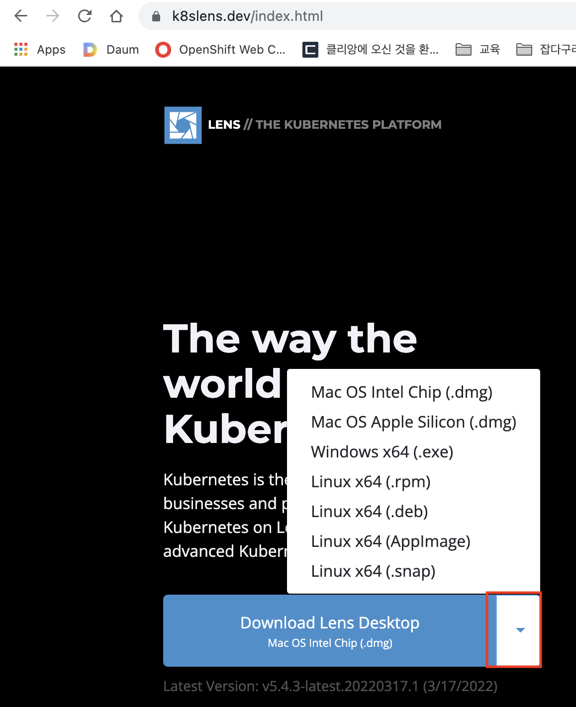  


설치된 lens 프로그램을 실행하면 welcome 화면이 나오고 하단에 skip 버튼을 눌러 이동한다.

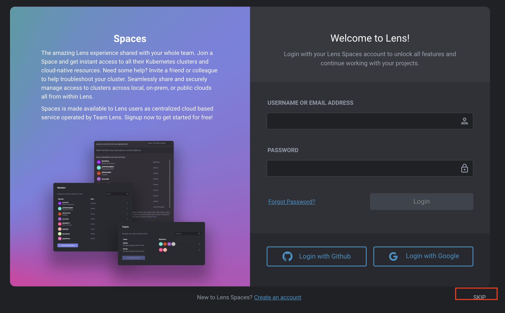  


welcome 화면 다음에  Browse Clusters in catalog를 클릭한다. 

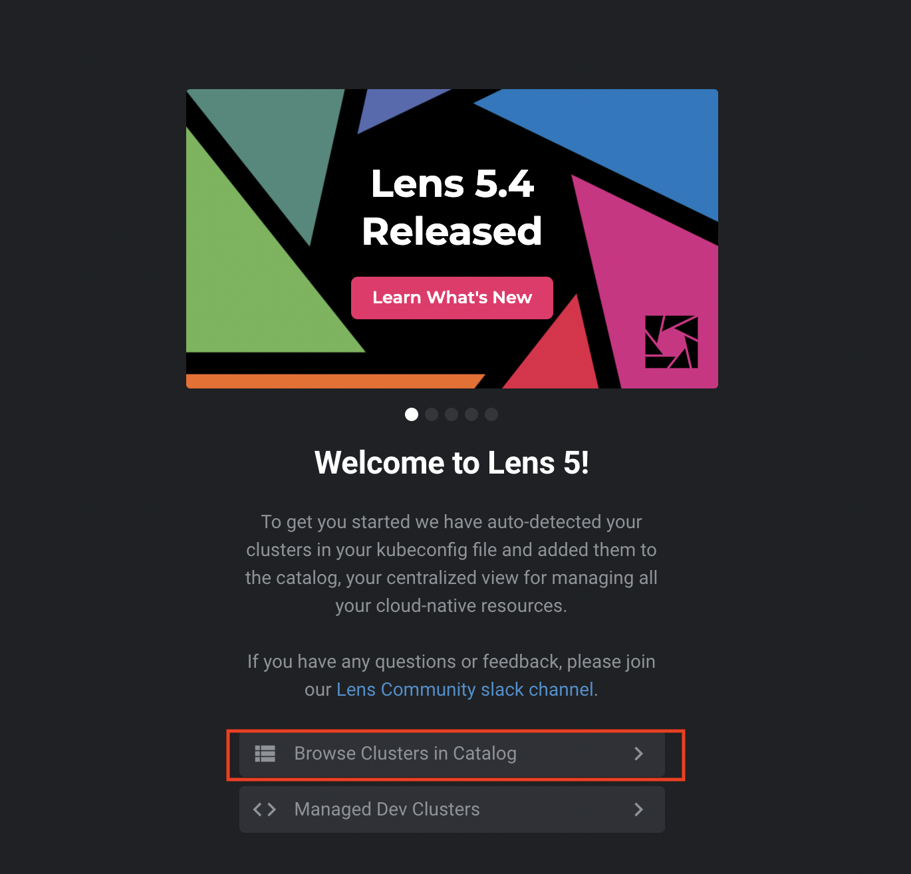  

Lens가 .kube 폴더 밑의 config 화일들을 자동으로 읽어 온다.  
k3s-test 라는 이름으로 클러스터 이름이 생성 된것 확인 할 수 있다.

  


k3s-test 를 클릭하고 왼쪽 메뉴 Cluster 클릭하면 메트릭 정보를 볼 수 있다.
- helm으로 prometheus 설치 하여 가능 

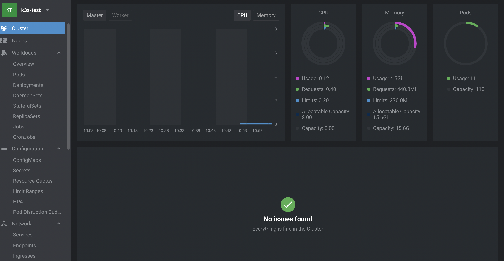  

<br/>
lens 화면 구성 

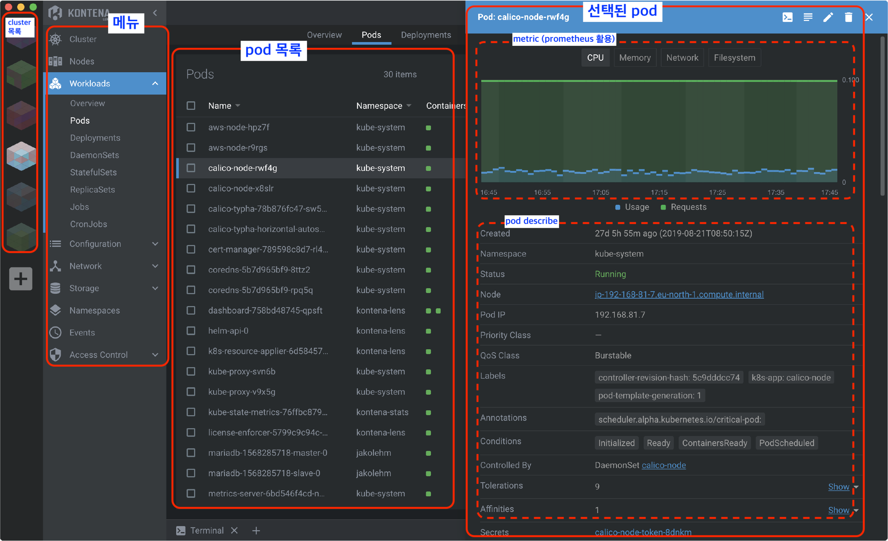

<br/>

현재 Disk 상태를 보면 사용률이 높을것을 확인 할 수 있다.    

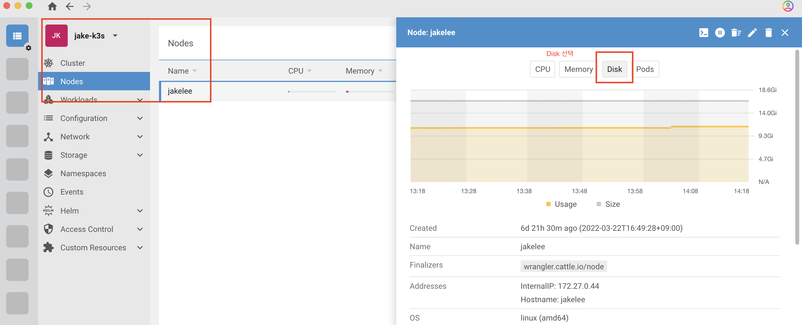  

<br/>

도커 루트 디렉토리를 확인하면 /var/lib/docker 폴더를 확인 할 수 있다.  

```bash
docker info | grep "Docker Root Dir"
```  

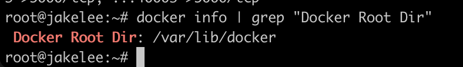  

<br/>

루트 폴더에서 디스크 사용량을 조회해 보면 사용량이 적은것 을 볼수 있다.  

```bash
du -h --max-depth=1
```  

  

<br/>

도커 루트 디렉토리인 /var/lib/docker 폴더로 이동하여 디스크 사용량을 조회해 본다.   
overlay2 폴더가 3.2기가로 대부분의 용량을 사용하는 것을 확인 할 수 있다.  


```bash
cd /var/lib/docker
du -h --max-depth=1
```  

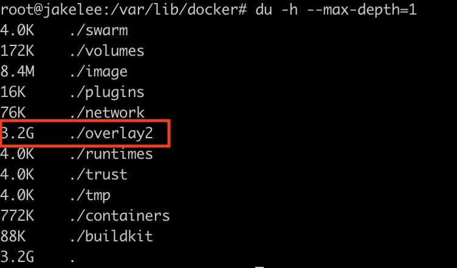    

<br/>

아래 명령어를 사용하면 도커 이미지와 컨테이너에서 사용하는 디스크 사이즈를 볼 수 있다.  
도커 이미지가 상당히 많은 용량을 차지하고 있음을 확인 할 수 있다.  

```bash
docker system df -v
```  

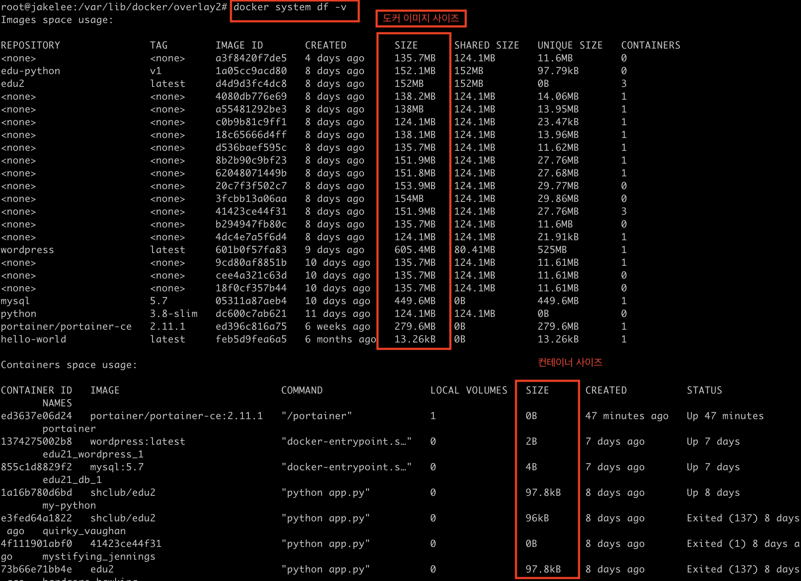 

<br/>

Docker image와 container 용량이 큰 경우 아래 명령어를 사용하여 사용하지 않는 컨테이너와 이미지 정보를 정리할 수 있다.  

```bash
docker image prune -all
```    

<br/>
하나씩 확인하고 삭제하려고 하면 아래 명령어를 사용한다.

```bash
docker rmi 이미지이름 또는 image id
```   

<br/>

### Helm 설치 ( https://helm.sh/ko/docs/intro/install/ )

<br/>

Helm 는 kubernetes (k8s)  package managing tool ( 배포 관리자 ) 로서 k8s에 쉽게 Application을 배포 할수 있도록 해준다.  

3가지 컨셉으로 구성되어 있다.

- Chart : Helm package입니다. app을 실행시키기위한 모든 리소스가 정의됨
  - Homebrew formula, Apt dpkg, Yum RPM 파일과 비슷.
- Repository : chart들이 공유되는 공간 
  - docker hub와 유사.
- Release : 쿠버네티스 클러스터에서 돌아가는 app들은(chart instance)  
            모두 고유의 release 버전을 가지고 있다.   


helm은 chart를 쿠버네티스에 설치하고, 설치할때마다 release버전이 생성되며, 새로운 chart를 찾을때에는 Helm chart repository에서 찾을 수 있습니다.


VM 서버에 터미널에서 아래 명령어를 실행한다.   
- helm 3.x 이상 버전을 설치한다.

```bash
curl -fsSL -o get_helm.sh https://raw.githubusercontent.com/helm/helm/main/scripts/get-helm-3
```

```bash
chmod 700 get_helm.sh
```

```bash
./get_helm.sh
```  

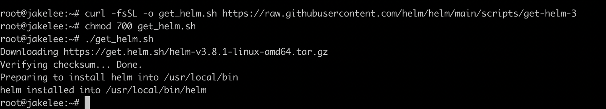  

버전을 확인한다.

```bash
helm version
```

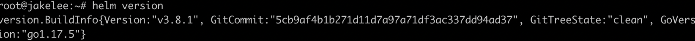  

helm repository 목록을 조회합니다. 처음 설치 했을때는 아무것도 없습니다.

```bash
helm repo list
```

k3는 경량 kubernetes로 많은 기능이 기본적으로 설치가 되지 않습니다.  
Lens에서 Metric ( 서버의  리소스 정보 ) 을 보기 위해서 Prometheus 가 설치가 되어야 합니다.

<br/>

prometheus 설치를 하기 위해 helm repository를 추가 합니다.
- 리포지토리 이름 : prometheus-community

```bash
helm repo add prometheus-community https://prometheus-community.github.io/helm-charts
```  

최신 chart 리스트를 업데이트 하기 위해 다음 명령어를 실행한다.

```bash
helm repo update
```  

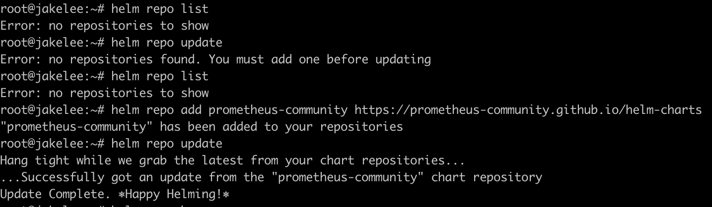    

repository 를 확인합니다.

```bash
helm repo list
```

설치 가능한 chart 목록을 보려면 helm search 명령어를 실행한다.    

```bash
helm search repo prometheus
```

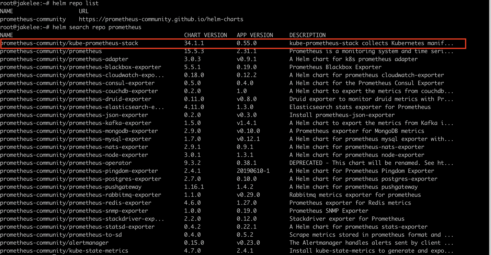   

Prometheus가 설치될 namespace를 monitoring 이라는 이름으로 생성합니다.

```bash
kubectl create namespace monitoring
```

helm 으로 prometheus를 설치합니다.  

```bash
helm install prometheus -n monitoring prometheus-community/kube-prometheus-stack
```  

설치시 아래와 같은  에러가 발생 하면 

```bash
Error: INSTALLATION FAILED: Kubernetes cluster unreachable: Get "http://localhost:8080/version": dial tcp [::1]:8080: connect: connection refused
```

다음 명렁어를 실행하고 다시 prometheus를 설치 한다. 위 명령어 실행.

```bash
export KUBECONFIG=/etc/rancher/k3s/k3s.yaml
```

정상적으로 실행이 되면 3개의 pod 가 생성된 것을 확인 할 수 있다.

```bash
kubectl get deployments -n monitoring
```  
 
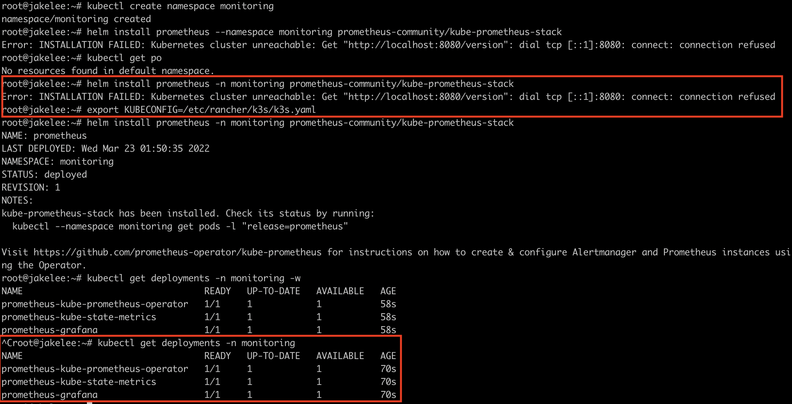     

<br/>

k8s IDE인 lens 를 확인하면 메트릭 정보를 볼수 있고 
명령어를 통해서도 확인할 수 있다.

<br/>


##  kubernetes 기능

###  k8s Object 개요 () https://awskrug.github.io/eks-workshop/introduction/basics/concepts_objects/ )

<br/>

쿠버네티스의 오브젝트(objects)는 클러스터의 상태를 나타내는 단위(entities)입니다.  

오브젝트는 “의도를 담은 레코드”입니다. 생성된 클러스터는 그 의도대로 존재할 수 있도록 최선을 다합니다. 이는 클러스터의 “의도한 상태(desired state)“라고 알려져 있습니다.  

쿠버네티스는 항상 오브젝트의 “현재 상태”를 “의도한 상태”와 동일하게 만들게끔 작동합니다. 이때 의도한 상태란 다음과 같습니다.  

- 어떤 파드(컨테이너)들이 어느 노드에서 동작(running) 중인지
- 컨테이너들의 논리 그룹과 매핑된 IP 엔드포인트
- 동작 중인 컨테이너 레플리카(replicas)의 개수
- 기타 다수 상태들…


<br/>

### 네임스페이스

<br/>

하나의 k8s cluster는 여러 개의 namespace로 나눠서 각 namespace 별로 독립적인 서비스 환경을 갖출 수 있습니다.   
전형적인 예로 dev, qa, stage, prod 같은 환경을 하나의 k8s cluster에 각각의 namespace로 구분하여 만들 수 있습니다.  

k8s를 사용하다 보면 RBAC 같은 리소스에서 cluster scope 인가 namespace scope 인가를 구분해야 하는 경우가 있습니다.  
cluster scope 경우에는 전체 cluster에 영향을 미치는 scope이고 namespace scope 경우는 해당 namespace 안에서만 영향을 주는 scope라 보면 됩니다.
  
<br/>


### 워크로드

<br/>

- POD  

POD는 k8s에서 다루는 가장 기본이 되는 단위 리소스 object입니다.  

<br/>

간단한 샘플 pod template yaml를 작성하면 다음과 같습니다. (출처: https://kubernetes.io/docs/concepts/workloads/pods/pod-overview/)

전통적인 명령적인(imperative) 방법에서는 terminal 열어 ‘A 만들고, B 만들고, A와 B 연결하고’ 하는 식의 작업을 한 줄 한 줄 명령을 입력해서 서비스를 구성하였습니다. 그러나, k8s에서는 선언적인(declarative) 방법으로 하는 것을 Recommand 한다.  

본 예제에서는 두가지 방식을 같이 사용한다.    

기본 적인 yaml 사용법.  

```yaml
apiVersion: v1
kind: Pod
metadata:
 name: myapp-pod
 labels:
   app: myapp
spec:
 containers:
 - name: myapp-container
   image: busybox
   command: ['sh', '-c', 'echo Hello Kubernetes! && sleep 3600']
```

yaml 에서는 indentation(들어쓰기)이 중요하니 작성 시 유의해야 합니다. 가끔 *.yaml 이라는 확장자를 사용하지 않고 *.yml 확장자를 사용하기도 하는데 가급적이면 공식사이트는 *.yaml의 사용을 권장하고 있습니다.  

위와 같이 모든 k8s resource들은 template yaml 파일로 정의할 수 있습니다. 즉, 여러분이 목적으로 하는 서비스를 여러 개의 k8s resource template yaml 파일로 나눠서 표현할 수 있는 것이죠. 심지어 하나의 전체 yaml 파일 안에 여러 개의 resource template을 정의해 넣어도 됩니다.  

그럼, 다시 위의 yaml 파일 내용을 좀 더 자세히 살펴보도록 하겠습니다.

```yaml
apiVersion: v1
```

이것은 사용할 k8s API의 버전 명세입니다. 단순히 v1 이런 것도 있지만 apps/v1 이런 식으로 API 그룹명(여기서는 apps)을 명세해야 하는 경우도 있습니다. k8s에서는 k8s 리소스를 생성할 때 연관된 k8s API를 기본적으로 호출해 사용하게 됩니다.

```yaml
kind: Pod
```

생성할 k8s 리소스 타입을 지정합니다. 우리는 지금 Pod를 정의하고 있습니다.  

```yaml
metadata:
 name: myapp-pod
 labels:
   app: myapp
```

Pod의 metadata로 name과 label을 정의합니다. 생성할 pod의 이름은 myapp-pod이며, label은 app: myapp으로 세팅했습니다. 모든 k8s object나 controller들은 기본적으로 name을 갖고 일반적으로 label도 갖게 됩니다.  

name은 동일한 namespace 상에서는 유일한 값을 이름으로 가져야 합니다. label은 특정 k8s object만을 나열한다거나 검색할 때 유용하게 쓰일 수 있는 key-value 쌍입니다.

```yaml
spec:
 containers:
 - name: myapp-container
   image: busybox
   command: ['sh', '-c', 'echo Hello Kubernetes! && sleep 3600']
```

생성할 pod의 구체적 내용을 정의하는 spec 부분을 확인할 수 있습니다.  
spec 하위로 여러 가지 항목들을 나열할 수 있는데 여기서는 containers라는 container 리스트 한가지 항목만 보입니다.  

<br/>

하나의 pod에는 1개 이상의 container를 포함할 수 있습니다. 바로 이 containers에 원하는 만큼의 container를 정의해 넣으면 됩니다. 여기서는 하나의 container만 정의했습니다.  

<br/>

container name은 myapp-container이고, 동일한 pod 내에서 유일한 이름을 가져야 합니다.
docker image는 busybox로 지정되어 있습니다. docker image는 docker registry에서 pull을 받아 오게 되는데, docker registry가 명시되어 있지 않다면 docker 공식 public registry인 docker hub(https://hub.docker.com)에서 해당 image를 가져오게 됩니다.   

<br/>

만약 private docker registry를 사용한다면 docker image 이름 앞에 해당 url을 명시해 줘야 하며 k8s에서는 remote docker registry와 통신은 http가 아닌 https로만 하게 되어 있어서 private docker registry에 반드시 TLS 인증서를 설치해둬야 합니다.  

<br/>

command 항목은 container가 생성된 초기에 실행되는 명령이나 스크립트를 수록하게 됩니다. dockerfile에서 ENTRYPOINT, CMD의 역할을 한다고 보면 됩니다. 관련된 비교 설명은 이 문서에 자세히 나와 있습니다.  

<br/>  

여기서 container 생성 초기에 실행하는 내용은 단순히 ‘Hello Kubernetes!’ 문자열을 화면(stdout)에 출력하고 1시간 동안 sleep 하라는 명령입니다. 실행 이후를 예상해보면 화면에 문자열 출력한 뒤 1시간 동안 container 실행 상태를 유지하다가 container를 종료하게 됩니다. 만약 이 container가 실행 종료되면 해당 pod도 실행이 종료되어 아마도 상태(status)가 Completed로 변경될 것입니다.

위 내용을 다 작성했다면 sample-pod.yaml이라는 파일명으로 저장한 뒤, 해당 pod를 다음 명령으로 미리 준비된 k8s cluster에 배포할 수 있습니다.

```bash
kubectl apply -f sample-pod.yaml
```  

POD 생성 배포 결과 확인
이제 kubectl get pods 명령으로 현재 namespace에 배포된 pod 목록을 살펴보겠습니다.  

```bash
kubectl get pods
```

위의 결과 화면처럼 myapp-pod가 15초 전에 잘 생성되어 Running 하는 것을 확인할 수 있습니다.
해당 pod의 stdout 내용도 kubectl logs pod/{pod name} 명령으로 살펴볼 수 있습니다.  

```bash
$ kubectl logs pod/myapp-pod
Hello Kubernetes!  
```

의도한대로 Hello Kubernetes! 가 보입니다.
pod의 해당 container 안으로 ssh 접속해 들어가 보고 싶으면 docker exec 명령과 유사한 kubectl exec -it 명령을 사용하면 됩니다.  

```bash
kubectl exec -it myapp-pod  /bin/sh
/ # echo $HOSTNAME
myapp-pod
```

위 kubectl exec 명령을 내릴 때 주의해야 할 점은 만약 해당 pod 안에 여러 개의 container가 존재한다면 pod 명 뒤에 -c 옵션으로 container 명도 지정해 줘야 합니다.   
본 예제에서는 다행히 pod에 하나의 container만 존재하기 때문에 굳이 -c 옵션을 줄 필요가 없습니다.   
여기서 한가지 발견한 것은 환경변수 $HOSTNAME이 기본적으로 pod 이름으로 설정된다는 점입니다.  


- Replicaset  
  Replication Controller의 새로운 버전으로 Label Selector를 통해 노드 상의 여러 Pod의 생성/복제/삭제 등의 라이프 싸이클을 관리합니다.

  - 지정한 Replica의 숫자만큼 Pod 수 생성/유지  
  - Label Selector를 통한 Pod 타겟팅  

- Deployment (https://blog.wonizz.tk/2019/09/17/kubernetes-deployment/)

  Kubernetes에서 어플리케이션 단위를 관리하는 Controller 이며 Kubernetes의 최소 유닛인 Pod에 대한 기준스펙을 정의한 Object이다.  

  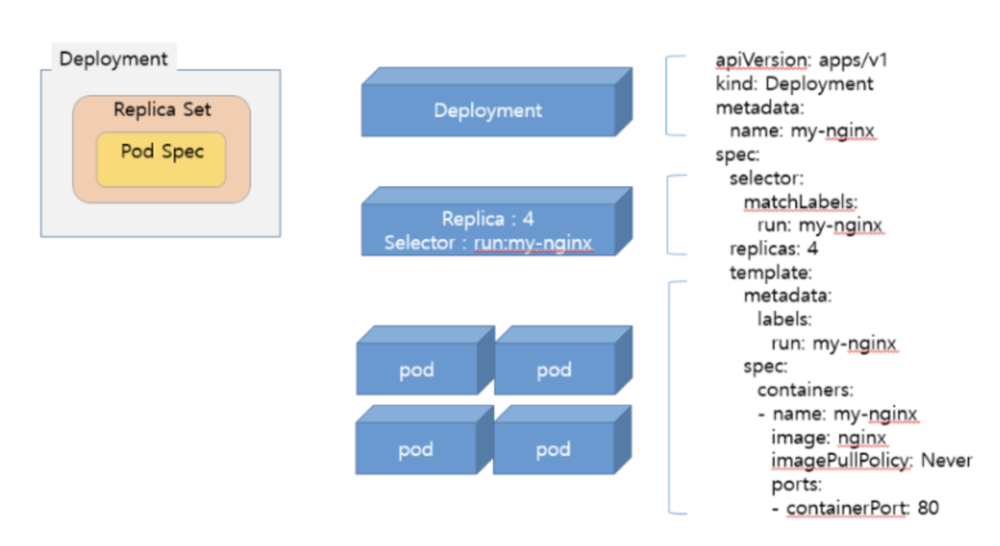  

  Kubernetes에서는 각 Object를 독립적으로 생성하기 보다는 Deployment를 통해서 생성하는 것을 권장하고 있으며, Pod와 ReplicaSet의 기준정보를 지정할 수 있다.

  이러한 Deployment는  

  - Pod의 scale in / out 되는 기준을 정의한다.
  - Pod의 배포되고 update 되는 모든 버전을 추적할 수 있다.
  - 배포된 Pod에 대한 rollback을 수행할 수 있다.  

  즉, 개념적으로 Deployment = ReplicaSet +Pod+history이며 ReplicaSet 을 만드는 것보다 더 윗 단계의 선언(추상표현)이다.


<br/>

### 네트워크

<br/>

Pod를 외부에서 접속하기 위해서는 서비스가 필요합니다.

- Service 의 특징
  - POD 집합에 대한 접근을 추상화 
    - Selector 를 통한 대상 Pod 집합 정의  
    - 단일 고정 End Point 제공 ( IP + Port )  
  - 클러스터 외부에 존재하는 백엔드에 대한 추상화 제공
  - 로드 밸런싱 지원
  - 서비스 타입 종류
    - Cluster IP
    - NodePort
    - LoadBalancer
  - Service yaml 파일에 기술된 name로 쿠버네티스 클러스터상에 DNS를 생성

<br/>
서비스 타입  

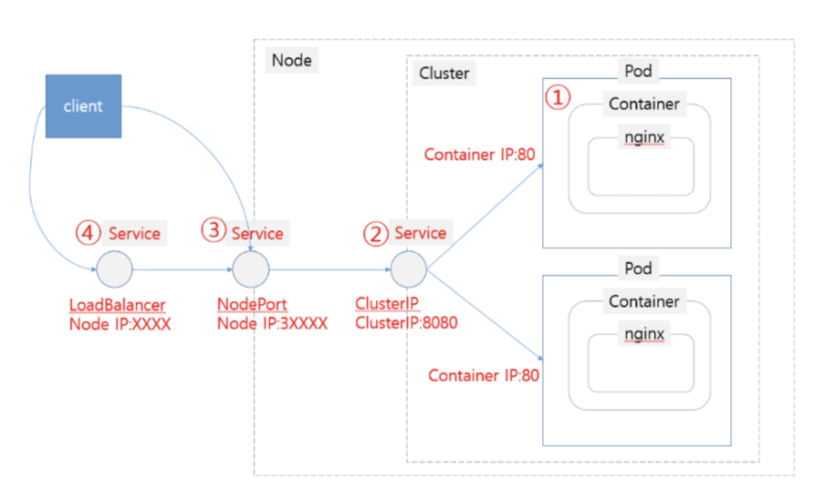   

  - ClusterIP : 쿠버네티스의 디폴트 설정으로 외부에서 접근가능한 IP를 할당받지 않기 때문에            Cluster내에서만 해당 서비스를 노출할 때 사용되는 Type
  - NodePort : 해당 서비스를 외부로 노출시키고자 할 때 사용되는 Service Type으로 외부에 Node IP와 Port를 노출시키는 것으로 아래 그림과 같이 쿠버네티스 클러스터 상에 있는 모든 노드(VM)에 대해서 노출 시킵니다.


<br/>

네트워크에 대한 자세한 설명은 중급 과정에서 진행.

<br/>

### Storage ( https://arisu1000.tistory.com/27849 )

<br/>

컨테이너는 기본적으로 상태가 없는(stateless) 앱을 사용합니다.   
상태가 없다는건 어떤 이유로건 컨테이너가 죽었을때 현재까지의 데이터가 사라진다는 것입니다. 상태가 없기 때문에 컨테이너에 문제가 있거나 노드에 장애가 발생해서 컨테이너를 새로 띄우거나 다른곳으로 옮기는게 자유롭습니다. 이것이 컨테이너의 장점입니다.    
하지만 앱의 특성에 따라서 컨테이너가 죽더라도 데이터가 사라지면 안되고 보존되어야 하는 경우가 있습니다.  
대표적으로 정보를 파일로 기록해두는 젠킨스가 있습니다. mysql같은 데이터베이스도 컨테이너가 내려가거나 재시작했다고해서 데이터가 사라지면 안됩니다. 그 때 사용할 수 있는게 볼륨입니다.   
볼륨을 사용하게 되면 컨테이너가 재시작을 하더라도 데이터가 사라지지 않고 유지됩니다. 더 나아가서 퍼시스턴스 볼륨을 사용하게 된다면 컨테이너가 재시작할때 데이터를 쌓아뒀던 노드가 아니라 다른 노드에서 실행된다고 하더라도 자동으로 데이터가 있는 볼륨이 컨테이너가 새로 시작한 노드에 옮겨 붙어서 쌓아뒀던 데이터를 그대로 활용해서 사용할 수 있습니다.   
이런 식의 구성하게 되면 단순히 하나의 서버에서만 데이터를 기록해두고 사용하는것 보다 더 안정적으로 서비스를 운영할 수 있게 됩니다.

- PV ( PersistentVolume )  
  PV는 볼륨 자체를 의미합니다. 클러스터내에서 리소스로 다뤄집니다. 포드하고는 별개로 관리되고 별도의 생명주기를 가지고 있습니다. ( 인프라에서 구성 )

- PVC ( PersistentVolumeClaim )  
  사용자가 PV에 하는 요청입니다. 사용하고 싶은 용량은 얼마인지 읽기/쓰기는 어떤 모드로 설정하고 싶은지등을 정해서 요청합니다. 쿠버네티스는 볼륨을 포드에 직접할당하는 방식이 아니라 이렇게 중간에 PVC를 둠으로써 포드와 포드가 사용할 스토리지를 분리했습니다. ( 개발팀에서 구성 )


<br/>

### 명령어  ( kubectl )

<br/>  

kubectl 명령어는 자신이 접근할 수 있는 클러스터 환경 정보를 $HOME/.kube/config 파일이나 KUBECONFIG환경 변수에 지정된 설정 파일을 참조한다.  

이 쿠버네티스 설정(이하 kubeconfig)은 크게 3가지 부분으로 구성되어 있다.  

- clusters : 쿠버네티스 API 서버 정보(IP 또는 도메인). 이름 그대로 여러 클러스터를 명시할 수 있다.  
- users : 쿠버네티스 API에 접속하기 위한 사용자 목록. 아래에서 살펴볼 예정이지만 인증 방식에 따라 형태가 다를 수 있다.  
- context : clusters 항목과 users 항목 중에 하나씩 조합해서 만들어진다. 즉, 여러 개의 컨텍스트가 나올 수 있다. 결국 컨텍스트를 기반으로 “어떤 Cluster에 어떤 User가 인증을 통해 쿠버네티스를 사용한다.” 의미로 해석하면 된다.
 

<br/>

### Access Control

<br/>

kubectl은 kubeconfig에 정의된 Context 중 하나를 이용해서 쿠버네티스 클러스터에 접근한다. 당연히 이 Context에 명시된 사용자(User)는 인증을 거쳐야 접근이 허용된다.  
인증 절차를 위해 쿠버네티스는 여러 가지 인증 모듈을 플러그인처럼 함께 사용할 수 있도록 유연하게 설계되어 있다.
활용할 수 있는 인증 방법은 ‘X.509 인증서’, ‘파일 기반 토큰 목록’, ‘파일 기반 비밀번호 목록’, ‘OpenID 연결 토큰’, ‘웹 훅 토큰’, ‘프록시’, ‘ServiceAccount 토큰’ 방식이 있다.  

전부 다 사용할 필요는 없겠지만 ‘X.509 인증서‘와 ‘ServiceAccount 토큰’ 방식이 가장 기본이 되는 인증 방식이라고 생각한다.  

특히 ‘X.509 인증서’ 방식은 쿠버네티스를 설치할 때 자동으로 생성되는데, 마스터 노드 서버에서 직접 kubectl을 실행할 때 kubectl이 참조하는 kubeconfig 파일에는 인증서 내용이 직접 들어가 있다. (인증서 내용은 BASE64로 인코딩되어 있다)  

이 인증서는 마스터 노드의 /etc/kubernetes/pki디렉터리에 있는 ca.crt를 루트 인증서로 하여 만들어진 하위 인증서 중 하나이다. 이 하위 인증서가 생성될 때 사용자(User)와 그룹(Group)이 지정되는데 이 때 그룹명으로 지정된 system:masters라는 값이 실제 쿠버네티스에 존재하는 cluster-admin이라는 ClusterRole에 연결되어 관리자 권한을 갖게 된 것이다.  

여기서 그룹을 표현한 system:masters라는 문자열과 권한을 정의한 ClusterRole 오브젝트와 Role을 연결하는 ClusterRoleBinding 오브젝트는 다음 단락에서 알아본다.  

결론은 쿠버네티스를 이용하는 사용자는 쿠버네티스 클러스터가 사용하기로 한 인증 방식에 따라 인증을 거쳐야 하며, 인증을 마친 사용자는 적절한 권한이 있는지 확인을 거치게 된다.  

따라서 외부에서 kubectl로 쿠버네티스 클리스터에 접근하려면 먼저 kubeconfig 파일에 Cluster 정보와 인증을 받을 User 정보를 추가하고, 그 조합된 Context 정보를 기반으로 쿠버네티스 클러스터와 통신한다.  

- Service Account  
서비스 어카운트(Service Account)는 쿠버네티스 상에 존재하는 오브젝트이며, 네임스페이스에 마다 각각 정의할 수 있다.  
각 네임스페이스에는 기본적으로 default 서비스 어카운트가 자동으로 생성된다.


```bash
kubectl describe sa -n default
```  

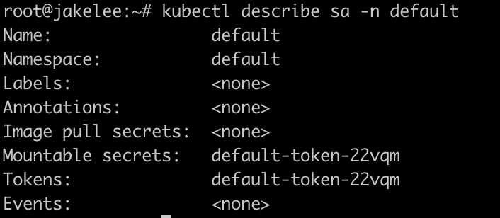  

서비스 어카운트를 만들면 JWT 토큰이 자동으로 함께 생성되어 쿠버네티스 Secret 오브젝트에 저장된다.

```bash
kubectl describe secret -n default default-token-22vqm
```  

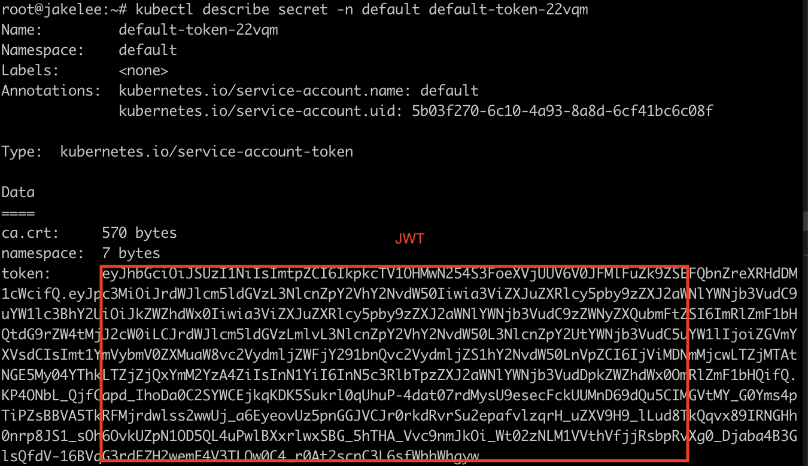  

이 토큰은 쿠버네티스 API에 인증하는 과정에서 사용될 수 있다.  
위 명령어 실행 결과에 출력된 JWT 토큰을 복사해서 쿠버네티스 API 서버로 HTTP 요청을 보낼 때 Authorization: “Bearer {토큰값}” 헤더로 실어 보내게 된다.  

하지만 default 서비스 어카운트는 쿠버네티스 API와 통신은 성공했지만, 권한이 없다는 응답을 받게 된다. 그 이유는 적절한 역할(Role)이 부여되지 않았기 때문이며 자세한 설명은 아래 RBAC에서 알아볼 수 있다

- 쿠버네티스의 사용자(User)  
쿠버네티스에는 사용자(User) 개념은 존재하지만 단지 추상적인 의미로 사용되며, 내부에 따로 저장되는 데이터가 아니라 단순히 문자열로 식별할 수 있는 값으로써 사용된다.  
서비스 어카운트(Service Account) 도 User 개념에 포함된다. 따라서 서비스 어카운트도 위 예시처럼 system:serviceaccount:<네임스페이스 이름>:<서비스 어카운트 이름>라고 User로써 지칭할 수 있다.

- 쿠버네티스의 그룹(Group)  
그룹(Group) 역시 사용자(User)와 마찬가지로 추상적인 개념으로 존재한다.  
따라서 쿠버네티스 오브젝트에서 그룹을 지칭하기 위해서는 사용자(User)처럼 문자열 형태로 표현된다.  
그룹 중에는 쿠버네티스에서 미리 정의해 둔 system: 접두사로 시작하는 그룹이 존재한다.  

  - system:unauthenticated : 인증을 거치지 않은 사용자
  - system:authenticated : 성공적으로 인증된 사용자
  - system:serviceaccounts : 클러스터 전체에 있는 모든 서비스 어카운트
  - system:serviceaccounts:<네임스페이스 이름> : 특정 네임스페이스에 있는 모든 서비스 어카운트  


- RBAC: Role Based Access Control ( 역할을 기반으로 접근을 제어한다 )  
쿠버네티스 내부에서 사용자로서 식별할 수 있는 3가지 개념에 대해 알아봤다.  
이 사용자가 쿠버네티스 API와 통신하기 위한 인증(Authentication)은 통과했다고 하더라도 실제로 쿠버네티스 오보젝트에 접근하기 위해서는 적절한 권한(Athorization)이 필요하다.  
사용자에게 권한을 부여하기 위해서는 먼저 Role을 정의하고, 그 역할을 사용자에게 연결(Binding)하는 방식으로 진행된다.  
이 Role은 2가지로 구분되는데 차이점은 네임스페이스에 속하는 Role인가 아니면 클러스터 전체에 속하는 Role인지로 구분된다.  

  - Role : 특정 네임스페이스에 속하는 오브젝트에 대한 권한을 정의
  - ClusterRole : 클러스터 전체에 모든 네임스페이스에 대한 권한을 정의  

아래 Role 매니페스트를 보면 rules항목에 정의된 apiGroups, resources, verbs를 통해 어떤 리소스에 어떤 동작을 허용할 지 지정한다.

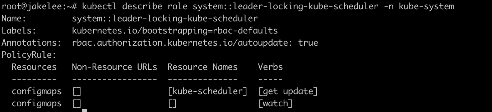  

  - apiGroups : 쿠버네티스의 오브젝트가 가지는 목적에 따라 분류되는 카테고리
  - resources : 권한을 정의할 쿠버네티스 오브젝트명
  - verbs : 어떤 동작을 수행할 수 있는지 정의

ClusterRole의 경우 위에서 정의한 Role 매니페스트에서 kind 값만 ClusterRole로 바꾸면 된다.
ClusterRole은 네임스페이스와 연관 없는 리소스나 네임스페이스마다 공통된 역할로 사용할 수 있기 때문에 동일한 역할을 다시 정의하지 않아도 되는 장점이 있다.

마지막으로 Role과 ClusterRole을 사용자에게 부여하기 위해 사용하는 오브젝트는 RoleBinding과 ClusterRoleBinding이 있다.  

여기서 지정하는 사용자는 위에서 먼저 다뤘던 3가지 개념의 사용자가 될 수 있다.  
아래 ClusterRoleBinding 매니페스트에는 사용자로 SerivceAccount가 지정되는 경우를 나타낸다.  

<br/>


##  kubernetes 실습

###  scale 조정  

<br/>


scale Up...

* 과제 1 : 미정
