# Chapter 4 
   

ArgoCD는 GitOps를 구현하기 위한 컨테이너에 최적화된 CD 툴로서 

1. GitOps 설치 및 기능 설명

2. Github에 배포 설정

3. 배포 실습 ( Blue/Green , Canary , Rollback )

 
<br/>

##  GitOps

### GitOps 개요 

쿠버네티스는 컨테이너화된 워크로드와 서비스를 관리하기 위한 이식성이 있고, 확장가능한 오픈소스 플랫폼이다. 쿠버네티스는 선언적 구성과 자동화를 모두 용이하게 해준다. 쿠버네티스는 크고, 빠르게 성장하는 생태계를 가지고 있다.   

쿠버네티스 서비스, 기술 지원 및 도구는 어디서나 쉽게 이용할 수 있다.

쿠버네티스란 명칭은 키잡이(helmsman)나 파일럿을 뜻하는 그리스어에서 유래했다. K8s라는 표기는 "K"와 "s"와 그 사이에 있는 8글자를 나타내는 약식 표기이다. 구글이 2014년에 쿠버네티스 프로젝트를 오픈소스화했다. 쿠버네티스는 프로덕션 워크로드를 대규모로 운영하는 15년 이상의 구글 경험과 커뮤니티의 최고의 아이디어와 적용 사례가 결합되어 있다.  


   

<br/>


### ArgoCD 를 설치 한다. ( https://cwal.tistory.com/19 )

ArgoCD 란....   

   
터미널로 VM에 로그인 한다.


```bash
ssh root@(본인 VM 공인 ip) -p 22222
``` 

가장 먼저 argocd 설치를 위한 namespace를 생성한다.

```bash
kubectl create namespace argocd
``` 

  

ArgoCD Manifest 화일을 다운 받는다. argo-cd.yaml 화일이 다운로드 된 것을 확인 할 수 있다.

```bash
curl https://raw.githubusercontent.com/argoproj/argo-cd/stable/manifests/install.yaml -o argo-cd.yaml
``` 

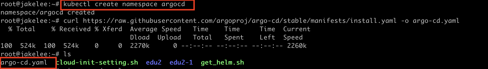   

이번엔 Argo CD CLI 툴을 다운로드하고, PATH 경로에 추가한다.  

```bash
VERSION=$(curl --silent "https://api.github.com/repos/argoproj/argo-cd/releases/latest" | grep '"tag_name"' | sed -E 's/.*"([^"]+)".*/\1/')
```   
```bash 
curl -sSL -o /usr/local/bin/argocd https://github.com/argoproj/argo-cd/releases/download/$VERSION/argocd-linux-amd64
```   

```bash
chmod +x /usr/local/bin/argocd
``` 

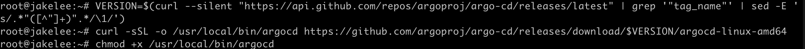  

k8s에 ArgoCD를 설치 합니다.

```bash
kubectl apply -n argocd -f argo-cd.yaml
```   

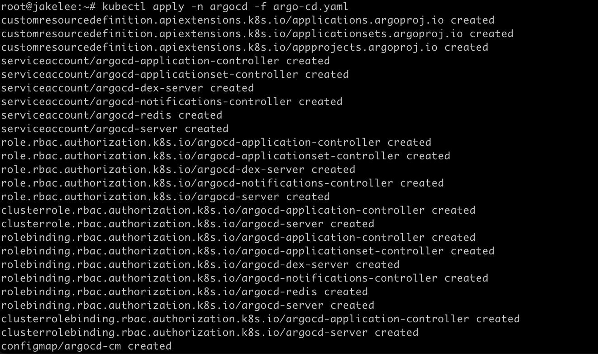  

정상적으로 설치가 되면 아래 명령어를 사용하여 생성된 서비스를 확인한다.

```bash
kubectl get svc -n argocd
kubectl get po -n argocd
```

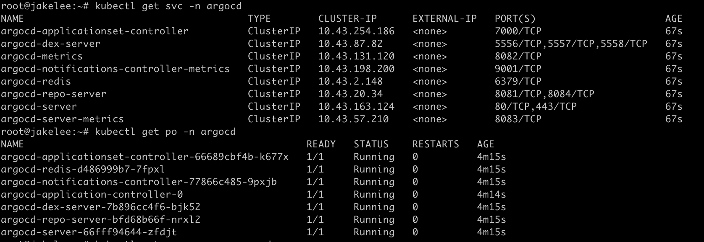  

<br/>

k8s에 argo-rollouts을 설치 합니다.  
argo-rollouts 은 blue/green 과 canary 배포 방식을 지원합니다.  

먼저 argo-rollouts namespace 를 생성 합니다.

```bash
kubectl create namespace argo-rollouts
```  

argo-rollouts 을 설치합니다.

```bash
kubectl apply -f https://github.com/argoproj/argo-rollouts/releases/latest/download/install.yaml -n argo-rollouts
```

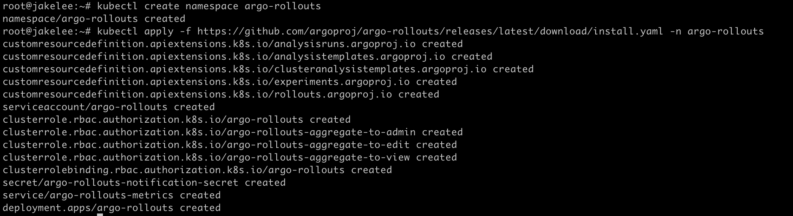  

```bash
kubectl get all -n argo-rollouts
```  

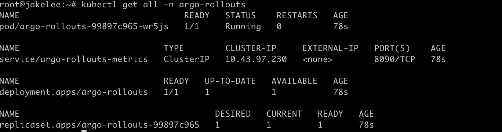  

<br/>

k8s는 kt cloud의 VM 위에 구축되었기 때문에, 외부에서 접속하기 위해서 NodePort를 사용하여 서비스를 오픈한다.   

향후 L4를 연결 한다면 Load Balancer Type을 사용 할 수 있다.  

<br/>

서비스중에 argocd-server 라는 서비스를 보면 Type이  ClusterIP로 되어 있는것을 확인 할수 있다.  
해당서비스는 VM 내부에서만 호출이 가능하여 해당 서비스를 수정하여 NodePort로 변경한다.   

argocd-server 서비스를 수정 할수 있는 모드로 변경한다.   

아래 명령어는 vi 에디터로 오픈이 되고 필요한 값을 수정 하면 된다.   

```bash
kubectl edit svc argocd-server  -n argocd
```

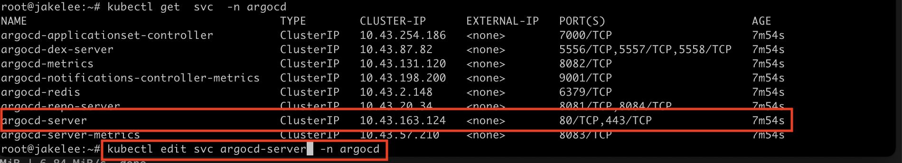  

<br/>

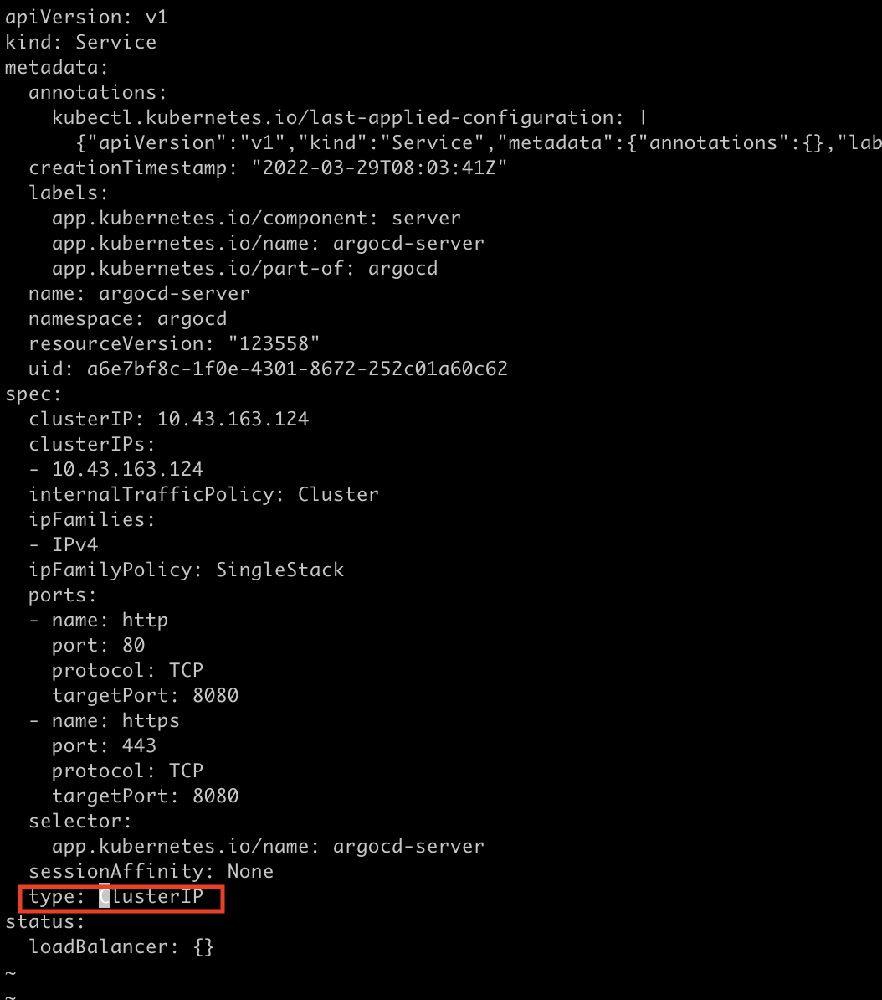    

NodePort의 범위는 30000 ~ 32768 이고 포트를 직접 입력하지 않으면 자동으로 할당이 된다.  
우리는 교육을 위해서  포트를 명시한다.  

2개는 입력 1개 수정을 한다.
- nodePort 추가 : http와 https에 라인을 추가하여 입력한다.
- type 변경 : ClusterIP에서 NodePort로 변경  

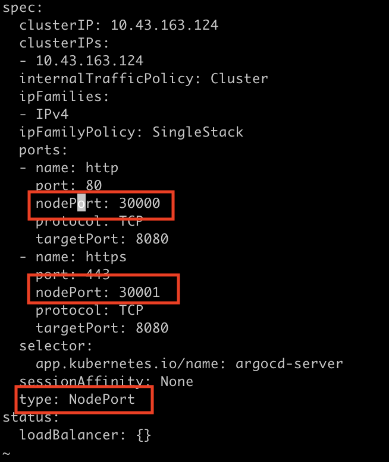    

<br/>
수정 완료후 서비스를 다시 조회해 보면 type이 아래와 같이 변경되고 포트가 추가된 것을 확인 할 수 있다.  

```bash
kubectl get svc argocd-server  -n argocd
```      

    

<br/>
NodePort Traffic 설명  
- Node ( VM ) 으로 직접 트래픽이 들어온다.  

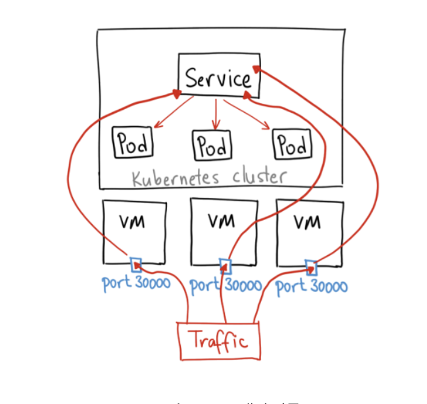  

<br/> 
이제 브라우저에서 argocd를 접속해 봅니다. http://(본인 VM Public IP):30000 로 접속하면 https로 Redirect됩니다.  

아래와 같은 화면이 나오면 정상이고 admin과 비밀번호로 로그인 한다.  


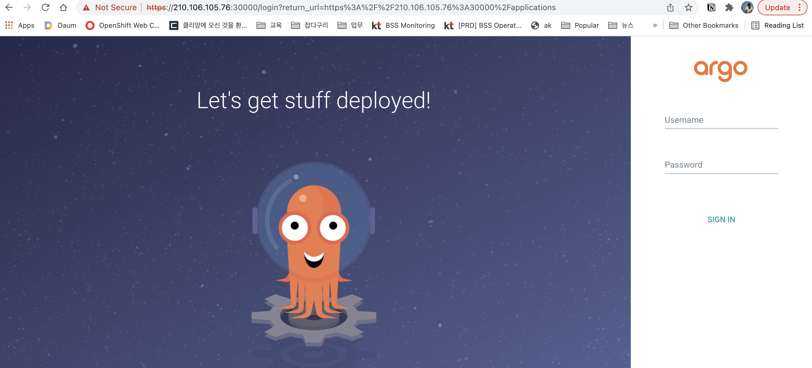  

<br/>
비밀번호는 아래 명령어를 사용하여 구할수 있고 나오는 값을 복사하여 패스워드를 입력하면 된다.  
로그인 후에 비밀번호는 변경한다.  

```bash
kubectl get secret argocd-initial-admin-secret -o jsonpath="{.data.password}" -n argocd | base64 -d && echo
```

<br/>

왼쪽 프레임의 유저 인포를 선택한 후 변경하고 다시 로그인한다.  

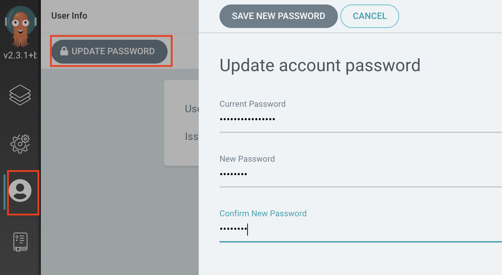  

<br/>

###  GitHub 배포 설정. 

GitHub에

* 과제 1 : 미정
