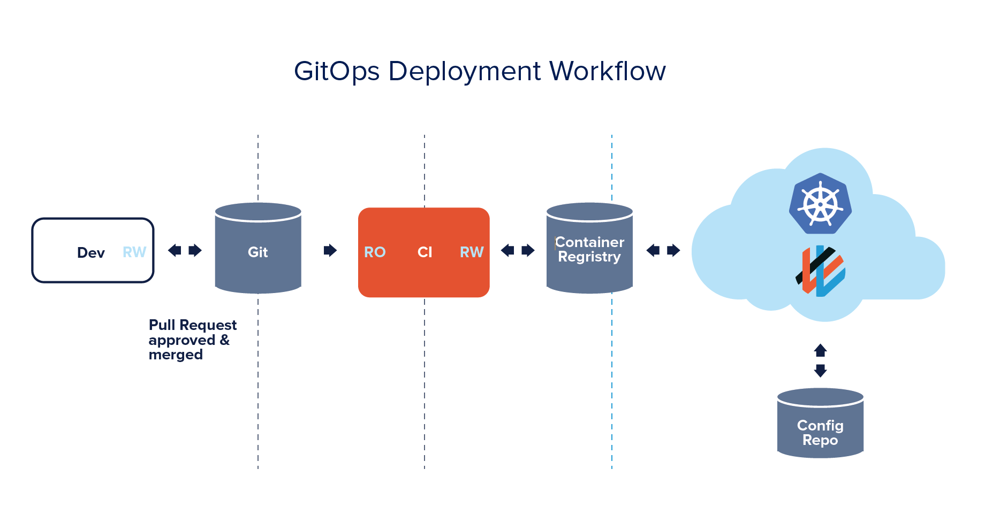
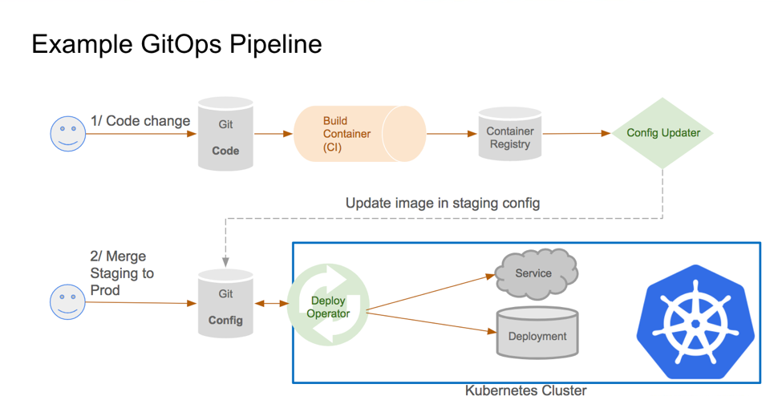
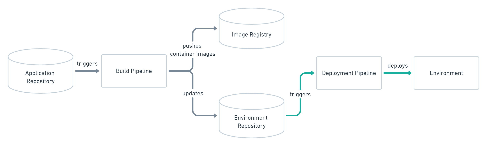
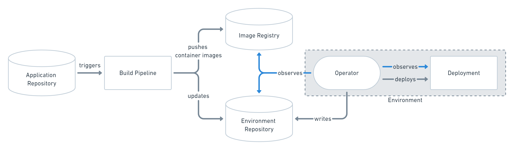

Table of  Contents

<!-- vscode-markdown-toc -->
* [ GitOps](#GitOps)
	* [GitOps 개요](#GitOps-1)
	* [ArgoCD 를 설치 한다. ( https://cwal.tistory.com/19 )](#ArgoCD.https:cwal.tistory.com19)
	* [ GitHub 배포 설정.](#GitHub.)

<!-- vscode-markdown-toc-config
	numbering=false
	autoSave=true
	/vscode-markdown-toc-config -->
<!-- /vscode-markdown-toc -->

<br/>

# Chapter 4 
   

ArgoCD는 GitOps를 구현하기 위한 컨테이너에 최적화된 CD 툴로서 

1. GitOps 설치 및 기능 설명

2. Github에 배포 설정

3. 배포 실습 ( Blue/Green , Canary , Rollback )

 
<br/>

## <a name='GitOps'></a> GitOps

### <a name='GitOps-1'></a>GitOps 개요 

개발자와 운영자의 소통, 협업, 통합을 강조하는 DevOps는 많이들 들어보셨을 겁니다.  

GitOps는 DevOps의 실천 방법 중 하나로 애플리케이션의 배포와 운영에 관련된 모든 요소들을 Git에서 관리(Operation) 한다는 뜻입니다.  

     

아주 간단하게 말해서 GitOps는 Kubernetes Manifest파일을 Git에서 관리하고, 배포할때에도 Git에 저장된 Manifest로 클러스터에 배포하는 일련의 과정들을 의미합니다.   

<br/>

GitOps 원칙  

- 모든 시스템은 선언적으로 선언되어야 함  
“선언적(declarative)”이라 함은 명령들의 집합이 아니라 사실(fact)들의 집합으로 구성이 되었음을 보장한다는 의미입니다.
쿠버네티스의 manifest들은 모두 선언적으로 작성되었고 이를 Git으로 관리한다면 versioning과 같은 Git의 장점과 더불어, SSOT(single source of truth)를 소유하게 됩니다.  
- 시스템의 상태는 Git의 버전을 따라감  
Git에 저장된 쿠버네티스 manifest를 기준으로 시스템에 배포되기 때문에 이전 버전의 시스템을 배포하고싶으면 git revert와 같은 명령어를 사용하면 됩니다.
- 승인된 변화는 자동으로 시스템에 적용됨  
한 번 선언된 manifest가 Git에 등록되고 관리되기 시작하면 변화(코드수정 등)가 발생할때마다 자동으로 시스템에 적용되어야 하며, 클러스터에 배포할때마다 자격증명은 필요하지 않아야 합니다.  
- 배포에 실패하면 이를 사용자에게 경고해야 함  
시스템 상태가 선언되고 버전 제어 하에 유지되었을 때 배포가 실패하게되면 사용자에게 경고할 수 있는 시스템을 마련해야합니다.

<br/>

GitOps Repository  

GitOps Pipeline을 설계할때에는 Git Repository를 최소 두개이상 사용하는 것을 권장합니다.  


  

- App Repo : App 소스코드와, 배포를 위한 Manifest 파일  
- 배포 환경 구성용 Repo : 배포 환경에 대한 모든 Manifest (모니터링, 서비스, MQ 등)들이 어떤 버전으로 어떻게 구성되어있는지 포함  


<br/>

GitOps 배포 전략  

두가지 방법이 있습니다.

- Push Type  
Git Repo가 변경되었을 때 파이프라인을 실행시키는 구조입니다.

	

	배포 환경의 개수에 영향을 받지 않으며 접속 정보를 추가하거나 수정하는 것만으로도 간단하게 배포 환경을 추가하거나 변경할 수 있습니다.  
	아키텍처가 쉬워 많은 곳에서 사용하고 있으나, 보안정보가 외부로 노출될 수 있다는 단점이 있습니다.

- Pull Type  
배포하려는 클러스터에 위치한 별도의 오퍼레이터가 배포역할을 대신합니다.  

	

	해당 오퍼레이터는 Git Repo의 Manifest와 배포환경을 지속적으로 비교하다가 차이가 발생할 경우, Git Repo의 Manifest를 기준으로 클러스터를 유지시켜 줍니다.  
	
	또한 Push Type과 달리 오퍼레이터가 App과 동일한 환경에서 동작중이므로 보안 정보가 외부에 노출되지 않고 실행할 수 있습니다.

<br/>


### <a name='ArgoCD.https:cwal.tistory.com19'></a>ArgoCD 를 설치 한다. ( https://cwal.tistory.com/19 )

한마디로 쿠버네티스를 위한 CD(Continuous Delivery)툴입니다.  

GitOps방식으로 관리되는 Manifest 파일의 변경사항을 감시하며, 현재 배포된 환경의 상태와 Git에 정의된 Manifest 상태를 동일하게 유지하는 역할을 수행 합니다.  

push타입과 pull타입 모두를 지원하며 pull타입 배포를 권장하고 있습니다.  

  

 ArgoCD는 GitOps를 실현시키며 쿠버네티스에 배포까지 해주는 툴  

<br/>
   
이제 ArgoCD를 설치하기 위해 터미널로 VM에 로그인 한다.


```bash
ssh root@(본인 VM 공인 ip) -p 22222
``` 

가장 먼저 argocd 설치를 위한 namespace를 생성한다.

```bash
kubectl create namespace argocd
``` 

  

ArgoCD Manifest 화일을 다운 받는다. argo-cd.yaml 화일이 다운로드 된 것을 확인 할 수 있다.

```bash
curl https://raw.githubusercontent.com/argoproj/argo-cd/stable/manifests/install.yaml -o argo-cd.yaml
``` 

   

이번엔 Argo CD CLI 툴을 다운로드하고, PATH 경로에 추가한다.  

```bash
VERSION=$(curl --silent "https://api.github.com/repos/argoproj/argo-cd/releases/latest" | grep '"tag_name"' | sed -E 's/.*"([^"]+)".*/\1/')
```   
```bash 
curl -sSL -o /usr/local/bin/argocd https://github.com/argoproj/argo-cd/releases/download/$VERSION/argocd-linux-amd64
```   

```bash
chmod +x /usr/local/bin/argocd
``` 

  

k8s에 ArgoCD를 설치 합니다.

```bash
kubectl apply -n argocd -f argo-cd.yaml
```   

  

정상적으로 설치가 되면 아래 명령어를 사용하여 생성된 서비스를 확인한다.

```bash
kubectl get svc -n argocd
kubectl get po -n argocd
```

  

<br/>

k8s에 argo-rollouts을 설치 합니다.  
argo-rollouts 은 blue/green 과 canary 배포 방식을 지원합니다.  

먼저 argo-rollouts namespace 를 생성 합니다.

```bash
kubectl create namespace argo-rollouts
```  

argo-rollouts 을 설치합니다.

```bash
kubectl apply -f https://github.com/argoproj/argo-rollouts/releases/latest/download/install.yaml -n argo-rollouts
```

  

```bash
kubectl get all -n argo-rollouts
```  

  

<br/>

k8s는 kt cloud의 VM 위에 구축되었기 때문에, 외부에서 접속하기 위해서 NodePort를 사용하여 서비스를 오픈한다.   

향후 L4를 연결 한다면 Load Balancer Type을 사용 할 수 있다.  

<br/>

서비스중에 argocd-server 라는 서비스를 보면 Type이  ClusterIP로 되어 있는것을 확인 할수 있다.  
해당서비스는 VM 내부에서만 호출이 가능하여 해당 서비스를 수정하여 NodePort로 변경한다.   

argocd-server 서비스를 수정 할수 있는 모드로 변경한다.   

아래 명령어는 vi 에디터로 오픈이 되고 필요한 값을 수정 하면 된다.   

```bash
kubectl edit svc argocd-server  -n argocd
```

  

<br/>

    

NodePort의 범위는 30000 ~ 32768 이고 포트를 직접 입력하지 않으면 자동으로 할당이 된다.  
우리는 교육을 위해서  포트를 명시한다.  

2개는 입력 1개 수정을 한다.
- nodePort 추가 : http와 https에 라인을 추가하여 입력한다.
- type 변경 : ClusterIP에서 NodePort로 변경  

    

<br/>
수정 완료후 서비스를 다시 조회해 보면 type이 아래와 같이 변경되고 포트가 추가된 것을 확인 할 수 있다.  

```bash
kubectl get svc argocd-server  -n argocd
```      

    

<br/>
NodePort Traffic 설명  
- Node ( VM ) 으로 직접 트래픽이 들어온다.  

  

<br/> 
이제 브라우저에서 argocd를 접속해 봅니다. http://(본인 VM Public IP):30000 로 접속하면 https로 Redirect됩니다.  

아래와 같은 화면이 나오면 정상이고 admin과 비밀번호로 로그인 한다.  


  

<br/>
비밀번호는 아래 명령어를 사용하여 구할수 있고 나오는 값을 복사하여 패스워드를 입력하면 된다.  
로그인 후에 비밀번호는 변경한다.  

```bash
kubectl get secret argocd-initial-admin-secret -o jsonpath="{.data.password}" -n argocd | base64 -d && echo
```

<br/>

왼쪽 프레임의 유저 인포를 선택한 후 변경하고 다시 로그인한다.  

  

<br/>

### <a name='GitHub.'></a> GitHub 배포 설정. 

GitHub에

* 과제 1 : 미정
