# Chapter 5 
   
컨테이너 모니티링을 위한 SaaS 솔루션인 Datadog과 연동해 본다.  

1. kt cloud 하드 디스크 추가

2. k3s 위치 변경

3. Github action 과 workflow 사용하여 도커 이미지 생성 ( GoodBye Jenkins )

4. DataDog 연동


 
<br/>

##  kt cloud 하드 디스크 추가

<br/>

### 서버 용량 확인 

<br/>

kt cloud는 기본 20G이 하드 디스크를 제공을 하여 container 운영시 evicted 
에러가 많이 발생함.  

먼저 터미널로 로그인 한다.  

```bash
ssh root@(본인 VM 공인 ip) -p 22222
``` 

아래 명령어를 실행한다.  

```bash
root@jakelee:/# df -h | grep dev
udev            7.8G     0  7.8G   0% /dev
/dev/xvda4       17G  9.1G  6.7G  58% /
tmpfs           7.9G     0  7.9G   0% /dev/shm
/dev/loop0      112M  112M     0 100% /snap/core/12941
/dev/loop1      111M  111M     0 100% /snap/core/12834
/dev/xvda3      976M  240M  670M  27% /boot
```

/dev/xvda4가 기본제공되는 파티션이고 70% 이상 점유가 되어 있으면 컨테이너 POD 기동이 안될 수 있음.  

<br/>

### 디스크 추가  

<br/>

kt cloud 에 로그인 한다.    

server -> disk를 클릭합니다.  


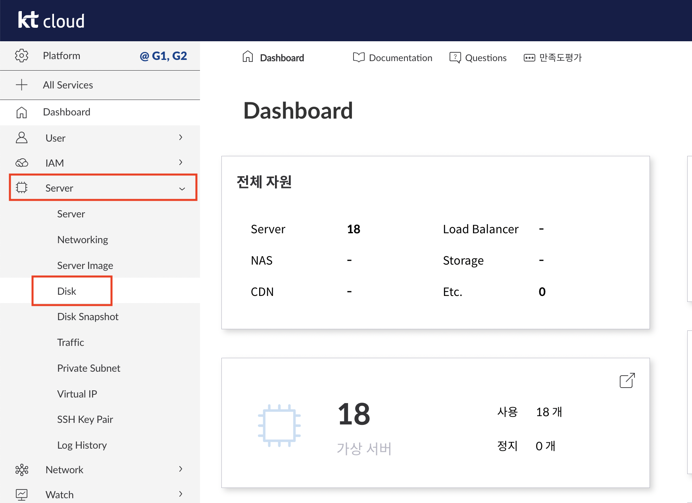   

create disk 를 클릭합니다.

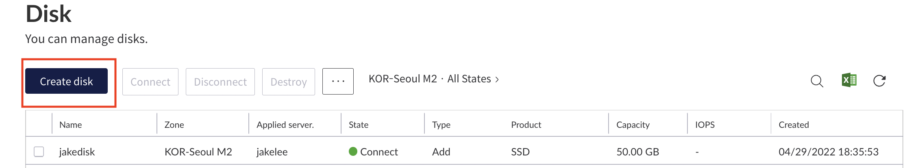   

아래와 같이 값을 선택합니다.  

- zone : KOR-Seoul M2 ( 현재 교육 환경은  M2 zone에 설치 )
- name : host 이름과 같이 설정 ( 식별을 편하게 하기 위함 )
- product : SSD ( 빠른 성능 )
- size : 50G 

launch 버튼을 클릭하여 디스크를 생성하며 약간의 시간 소요.

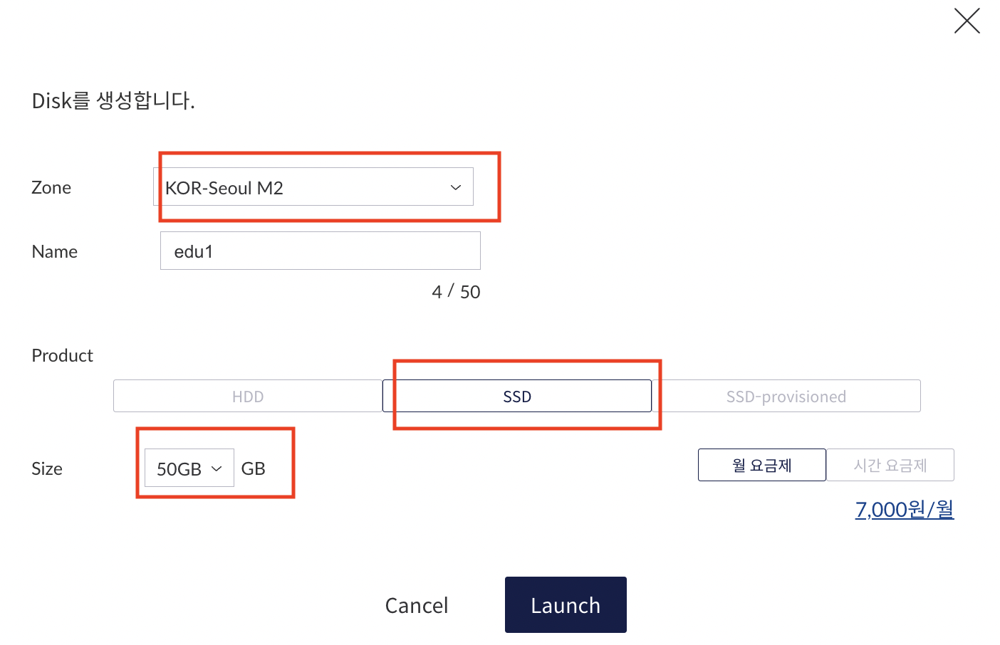   

state 상태가 Release라고 나오며 붉은색으로 표시됨. 이것은 아직 서버에 디스크가 연결 되지 않았다는 의미.  

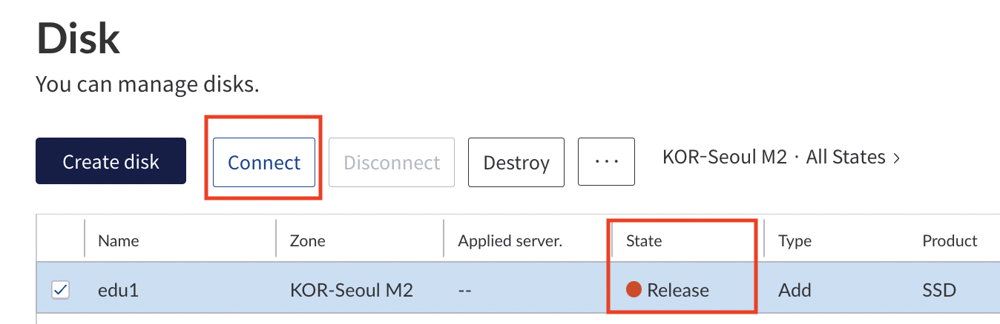   

connect 버튼을 클릭을 하면 연결할 서버가 나오고 원하는 대상 서버를 선택합니다.  

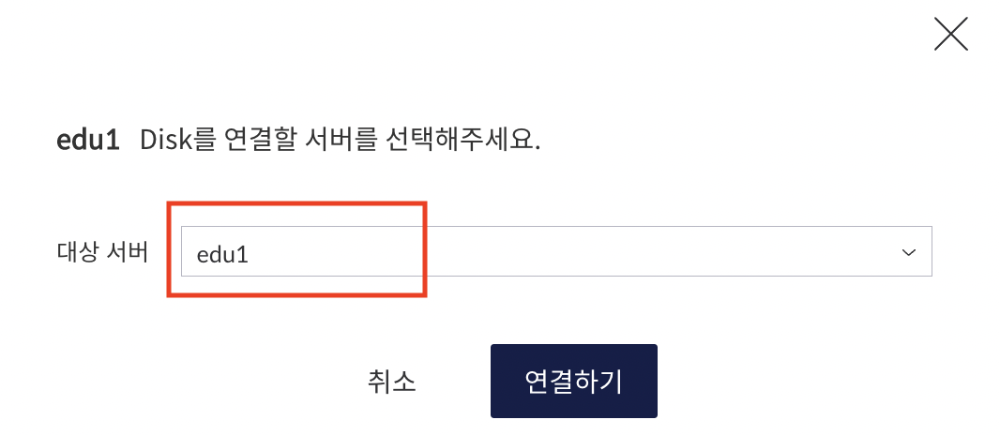   

아래 메시지가 나오면 ok를 클릭합니다. 

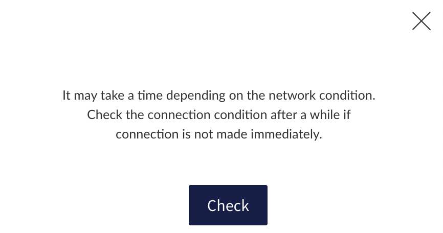   

완료가 되면 status가 connect 로 나오고 kt cloud 에서는 해야 할 일은 완료 되었습니다.   

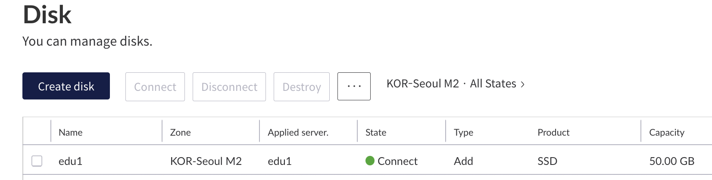   

<br/>

### 디스크 붙이기 

<br/>

터미널로 로그인 한다.  

```bash
ssh root@(본인 VM 공인 ip) -p 22222
```  
아래 명령어를 실행한다.  

```bash
root@jakelee:/# fdisk -l
```

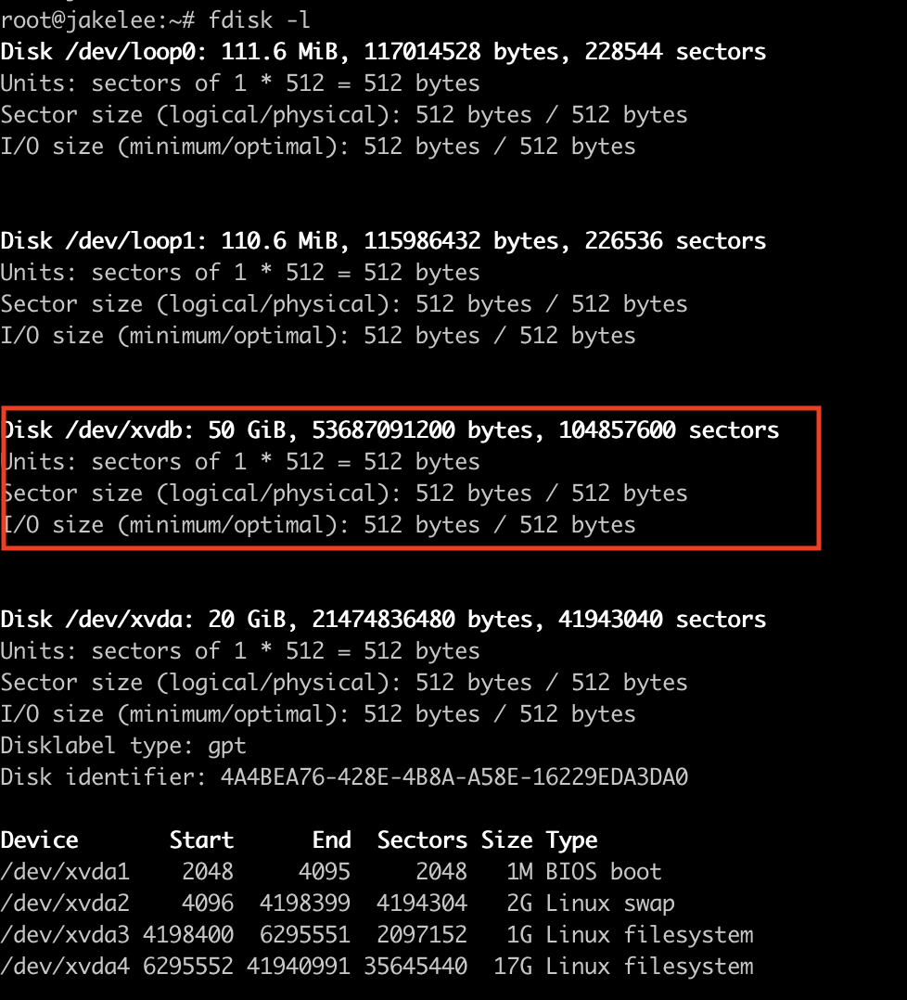   

/dev/xvdb 라는 디스크가 추가 된걸 확인 할수 있습니다.  

위에서 확인한 디바이스 파티션의 포맷을 진행합니다. ( 리눅스 파티션 ext4 )

```bash
root@jakelee:/# mkfs.ext4 /dev/xvdb
```  

포맷이 완료되면 UUID를 확인할 수 있습니다.   위에서도 보이지만 아래의 명령어를 통해서도 UUID를 확인할 수 있습니다.  

```bash
root@jakelee:/# blkid
/dev/xvdb: UUID="f7f5fb33-80f0-4eda-b103-4be9b6aa070e" TYPE="ext4"
/dev/xvda2: UUID="2feb6a8f-952a-4b49-9e39-03b712dc75d3" TYPE="swap" PARTUUID="94574b76-926a-4d85-b78c-f370c646afd9"
/dev/xvda3: UUID="2cab3d8f-b495-43a2-9ea4-db1a02bce959" TYPE="ext4" PARTUUID="375daaec-397a-4545-a75a-6ab586eed954"
/dev/xvda4: UUID="89a01c64-beb2-4de2-bd8b-7aa7146e41ee" TYPE="ext4" PARTUUID="25f58f5f-6d2a-4c4b-96e9-f8345dcf4d16"
/dev/loop0: TYPE="squashfs"
/dev/loop1: TYPE="squashfs"
/dev/xvda1: PARTUUID="6eb8e524-4b89-4dfc-9d73-d259d395f4ac"
```  

이제 디스크를 사용하기 위해 마운트 할 차례입니다. 먼저 마운트 할 대상 폴더를 만들어줍니다.  

```bash
root@jakelee:/# mkdir -p /data
```  

자동 마운트를 위해 마운트 정보를 /etc/fstab 파일에 추가합니다.  

```bash
root@jakelee:/# vi /etc/fstab
```  

이제 마운트를 적용합니다.  

```bash
root@jakelee:/# mount -a
```  

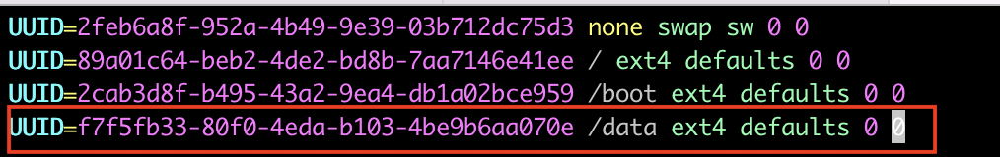   

아래 명령어를 실행하여 /data 마운트 포인트가 생성된걸 확인합니다.  

```bash
root@jakelee:/# df -h | grep dev
udev            7.8G     0  7.8G   0% /dev
/dev/xvda4       17G  9.1G  6.7G  58% /
tmpfs           7.9G     0  7.9G   0% /dev/shm
/dev/loop0      112M  112M     0 100% /snap/core/12941
/dev/loop1      111M  111M     0 100% /snap/core/12834
/dev/xvdb        49G     0   49G   0% /data
/dev/xvda3      976M  240M  670M  27% /boot
```  

<br/>

##  k3s 위치 변경

<br/>

### k3s 신규 폴더 생성 

<br/>

먼저 /var/lib/rancher를 /data 폴더에 복사합니다.  

```
cp -rp /var/lib/rancher /data
```  

rancher폴더가 생성된 것을 확인 할 수 있습니다.  
```
root@jakelee:/# ls /data
rancher
```  

<br/>

### k3s 위치 변경

<br/>

k3s 서비스의 시작 위치를 확인하기 위해 아래 명령어를 실행합니다.    

```bash
root@jakelee:/# systemctl status k3s
● k3s.service - Lightweight Kubernetes
   Loaded: loaded (/etc/systemd/system/k3s.service; enabled; vendor preset: enabled)
   Active: active (running) since Sat 2022-04-30 12:04:31 KST; 22h ago
     Docs: https://k3s.io
  Process: 989 ExecStartPre=/sbin/modprobe overlay (code=exited, status=0/SUCCESS)
  Process: 978 ExecStartPre=/sbin/modprobe br_netfilter (code=exited, status=0/SUCCESS)
  Process: 956 ExecStartPre=/bin/sh -xc ! /usr/bin/systemctl is-enabled --quiet nm-cloud-setup.serv
 Main PID: 990 (k3s-server)
    Tasks: 506
```  

서비스 위치는 /etc/systemd/system/k3s.service 이란 것을 확인 할 수 있고  
vi 에디터로 /etc/systemd/system/k3s.service 를 수정합니다.  

ExecStart 구문에서 --data-dir=/data/rancher/k3s 를 추가합니다.


```bash
# before
ExecStart=/usr/local/bin/k3s \
    server  \
        '--tls-san' \
        '210.106.105.165' \

# after
ExecStart=/usr/local/bin/k3s \
    server \
        '--data-dir=/data/rancher/k3s' \
        '--tls-san' \
        '210.106.105.165' \

```  

시스템 데몬과 k3s를 재기동 합니다.  

```bash
systemctl daemon-reload 
systemctl restart k3s
```  

정상기동을 확인합니다.   

```bash
systemctl status k3s
```  

신규 파티션 ( /dev/xvdb )에 disk가 사용되는지 확인 합니다.

```bash
root@jakelee:/# df -h | grep dev
udev            7.8G     0  7.8G   0% /dev
/dev/xvda4       17G  9.0G  6.8G  58% /
tmpfs           7.9G     0  7.9G   0% /dev/shm
/dev/loop0      112M  112M     0 100% /snap/core/12941
/dev/loop1      111M  111M     0 100% /snap/core/12834
/dev/xvdb        49G  6.5G   41G  14% /data
/dev/xvda3      976M  240M  670M  27% /boot
```  

k3s 에서 evicted 된 pod를 정리한다.   
아래 명령어를 실행하면 Pod가 재기동 된다.    

```bash
kubectl drain --delete-emptydir-data --ignore-daemonsets --force < node 이름 > && kubectl uncordon < node 이름 >
```

```bash
root@jakelee:~# kubectl drain --delete-emptydir-data --ignore-daemonsets --force jakelee && kubectl uncordon jakelee
node/jakelee cordoned
WARNING: ignoring DaemonSet-managed Pods: monitoring/prometheus-prometheus-node-exporter-2dgkh, kube-system/svclb-traefik-ppwjm, default/my-datadog-5vtk6
evicting pod kube-system/local-path-provisioner-84bb864455-gsm9c
argocd-applicationset-controller-66689cbf4b-czwx7
evicting pod monitoring/prometheus-grafana-75898f6f7b-bwgd6
I0501 20:52:09.033684   24024 request.go:665] Waited for 1.000050949s due to client-side throttling, not priority and fairness, request: POST:https://127.0.0.1:6443/api/v1/namespaces/monitoring/pods/alertmanager-prometheus-kube-prometheus-alertmanager-0/eviction
pod/argocd-notifications-controller-5f8c5d6fc5-7sr85 evicted
pod/argocd-server-5bbd4cfc66-rhwpj evicted
pod/coredns-96cc4f57d-jwlxm evicted
kube-prometheus-operator-85bcb96fcb-jfql6 evicted
pod/prometheus-prometheus-kube-prometheus-prometheus-0 evicted
pod/alertmanager-prometheus-kube-prometheus-alertmanager-0 evicted
I0501 20:52:19.187060   24024 request.go:665] Waited for 3.595956327s due to client-side throttling, not priority and fairness, request: GET:https://127.0.0.1:6443/api/v1/namespaces/dev/pods/dev-edu6-cc658fb7b-dr7mw
pod/mynginx-69d586ff67-m284g evicted
pod/prometheus-kube-state-metrics-77698656df-c6jl2 evicted
pod/dev-edu6-cc658fb7b-zm4dh evicted
node/jakelee evicted
node/jakelee uncordoned
```  

disk full 이 발생한 경우는 아래 명령어를 사용하여 disk-pressure- 관련 메시지를 확인한다.  

```bash
kubectl describe node < node 명 >
```  

taint 명령어를 사용하여 해당 node를 untaint 하여  pod 가 schedule 되게 한다.   

```bash  
kubectl taint nodes jakelee node.kubernetes.io/disk-pressure- 
```  

<br/>

##  Github action 과 worlflow 사용하여 도커 이미지 생성 ( Goodbye Jenkins )

<br/>

### GitHub Package

<br/>

github 에서도 Packages 라는 이름으로 도커 레지스트리를 기능을 지원한다.  
현재 private은 500 메가 까지는 제공을 하고 있다.  

docker 이미지 이름은 앞에 ghcr.io가 붙는다.  
github의 본인 계정으로 이동하면 packages tab을 볼수 있다.  

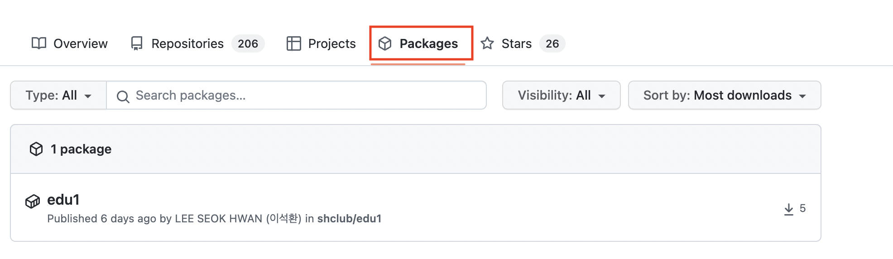  

<br/>

### GitHub Docker 이미지 빌드 후 github package 에 push 

<br/>

우리가 그동안 Jenkins 를 통하여 Docker Build 를 수행 했지만 이제는
Github의 Action , workflow 기능을 이용하여 빌드를 수행해본다.   

<br/>

https://github.com/shclub/edu7 를 본인의 github에 fork 한다.  

Actions tab 을 클릭한다.  

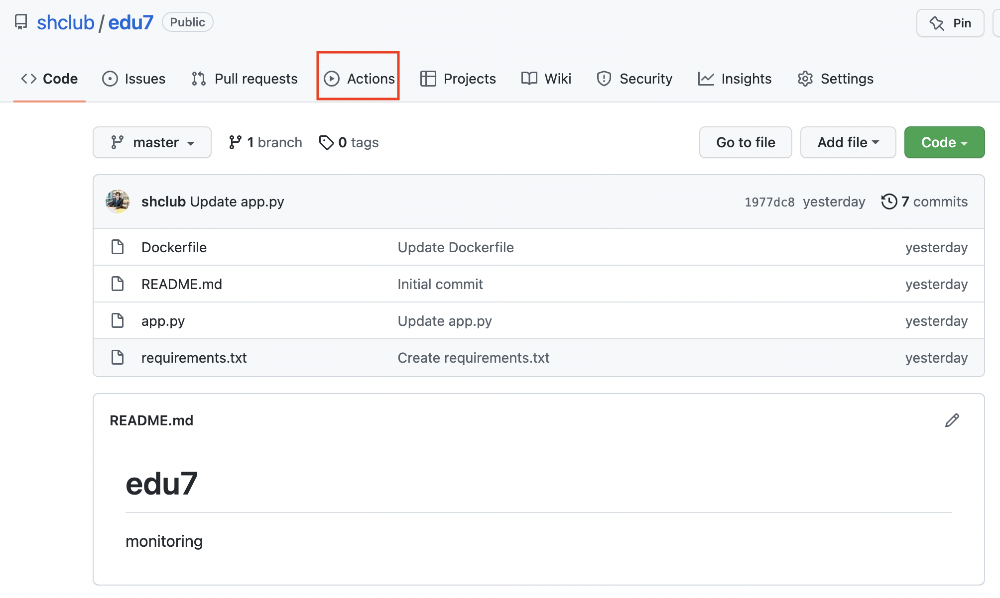  

템플릿 목록이 나오고 먼저 Github package 에  push 하기 위해서 Publish Docker Container Template을 선택한다.  
configure 를 클릭한다.  

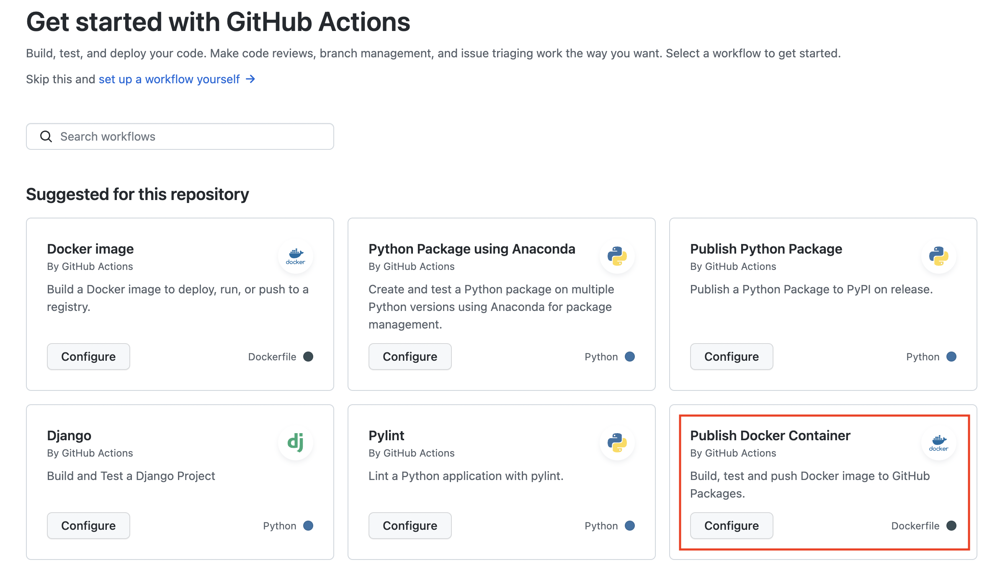  

docker-publish.yml 화일이 아래 처럼 생기고 schedule 부분의 2개 라인만
주석 처리하고 Start commit을 클릭한다.  

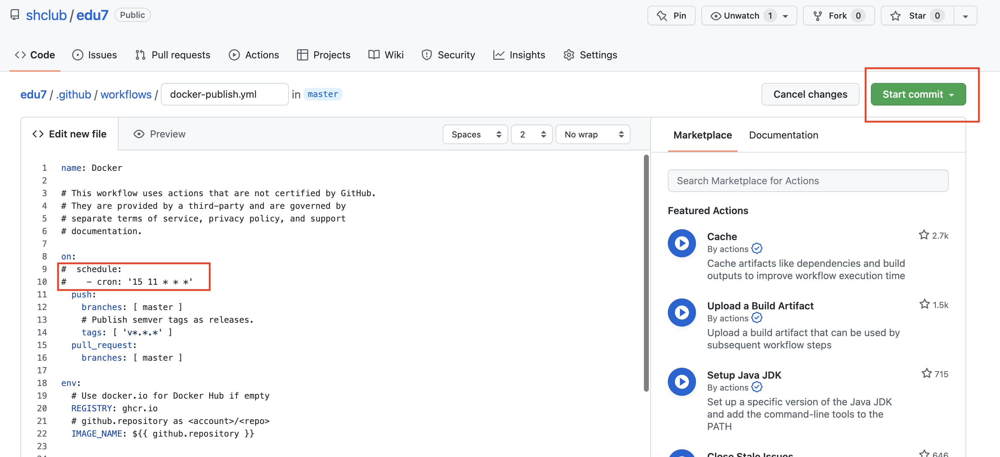  

./github/workflows 폴더가 생성이 되고 docker-publish.yml 화일이 생성 된것을 확인 할수 있다.  

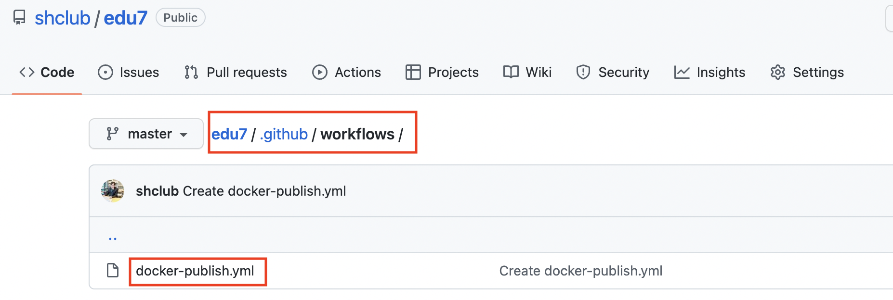  

다시 Actions Tab을 클릭한다.  
Docker 라는 workflow 가 생성이되고 오른편에 pipeline 이 실행 되고 있는것을  확인할 수있다.  

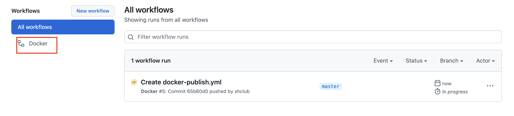  

정상적으로 수행이되면 파란색으로 아이콘이 변경이되고 에러가 발생하면 붉은색으로 나온다.  

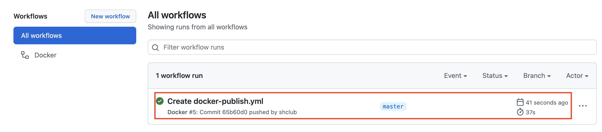  

해당 파이프라인 클릭 ( create  Docker-publish.yml ) 하면 빌드 화면으로 넘어가고 Build를 클릭하면 오른편에 파이프라인 세부 로그를 볼 수있다.  

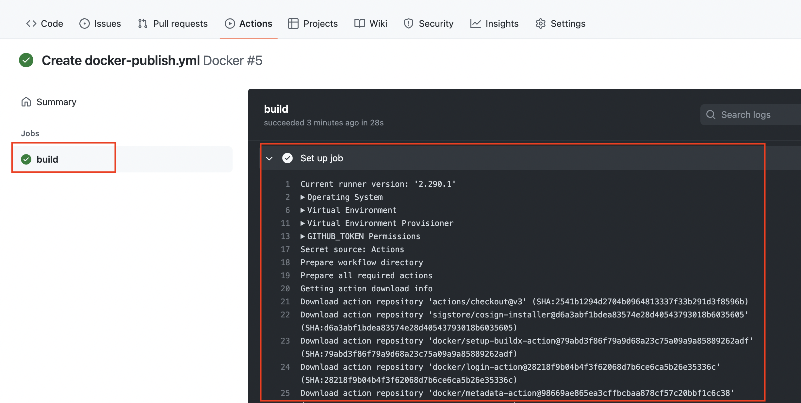  

생성된 빌드 이미지를 보기 위해서는 본인 계정을 클릭한다.  

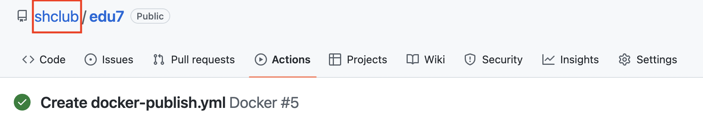  

repository에서도 오른편에서 package 를 통해 확인 할 수도 있다.  

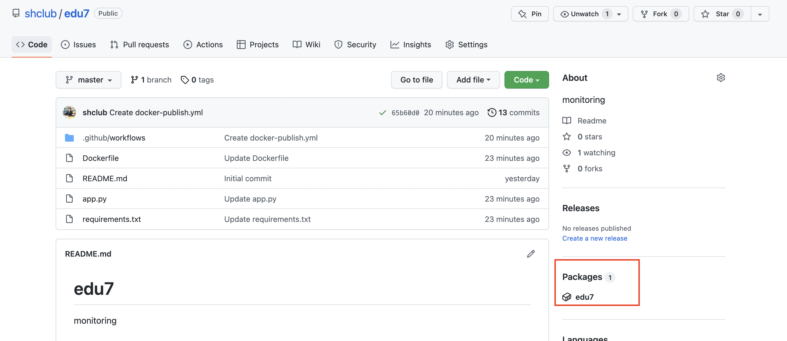  

Packages를 클릭하면 신규로 생성된 도커 이미지를 확인 할 수 있다.  

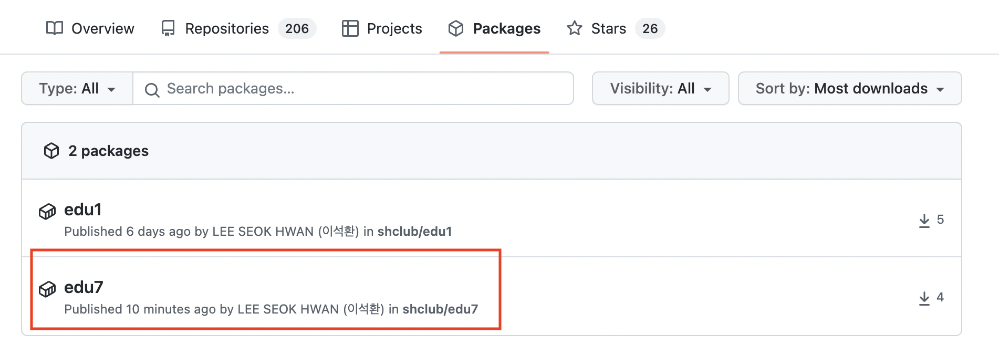  

해당 도커 이미지를 클릭하면 docker pull을 위한 도커 이미지를 명령어를 확인 할 수 있고 오른편에는
package를 설정할수 있다.  

기본 설정은 public 이다.  

  

생성된 도커를  터미널 창에서 아래와 같이 실행한다.  
기본 tag는 master 이다.  


```bash
root@jakelee:~# docker run ghcr.io/shclub/edu7:master
 * Serving Flask app 'app' (lazy loading)
 * Environment: production
   WARNING: This is a development server. Do not use it in a production deployment.
   Use a production WSGI server instead.
 * Debug mode: off
 * Running on all addresses (0.0.0.0)
   WARNING: This is a development server. Do not use it in a production deployment.
 * Running on http://127.0.0.1:5000
 * Running on http://172.17.0.2:5000 (Press CTRL+C to quit)
 ```  

  
<br/>

### GitHub Docker 이미지 빌드 후 docker hub  에 push 

<br/>

GitHub package 가 아닌 Docker hub 에 push 해본다.  

Actions Tab으로 이동하여 New workflow를 클릭한다.  

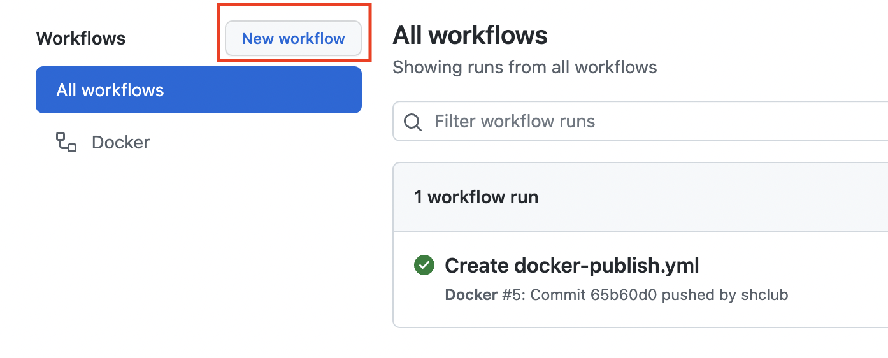  

root 폴더의 docker-hub-publish.yml 화일을 내용을 복사한다.  
아래와 같이 생성이 되면 화일명을 docker-hub-publish.yml로 변경을 하고 image 이름을 원하는 이름으로 변경한다.  

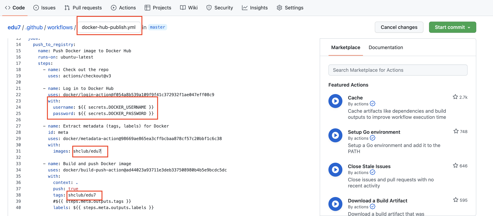  

start commit 버튼을 클릭하면 화일이 신규로 생긴것을 확인할 수가 있고  빌드가 수행이 된다.  

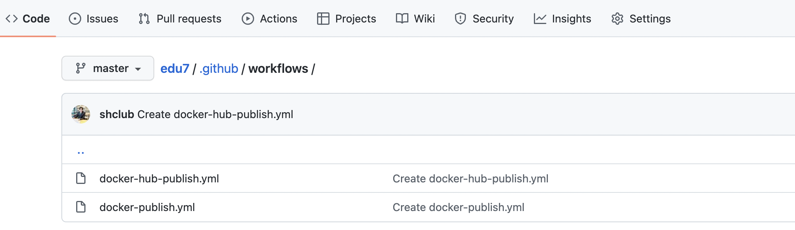  

Actions Tab 으로 이동하면 Publish Docker image 가 생성이 되고 빌드 파이프 라인이 성공 1개 에러 1개가 발생 한 것을 확인 할 수 있다.  

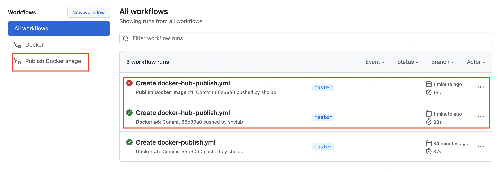  

에러를 클릭하면 세부 파이프라인 창으로 이동을 하고 오른편 화면에 에러가 난 곳을 확장 하여 에러메시지를
 확인한다.  

에러 메시지는  Github Repository (edu7)에 도커 허브 credential을 만들지 않아서 발생한 에러이다.

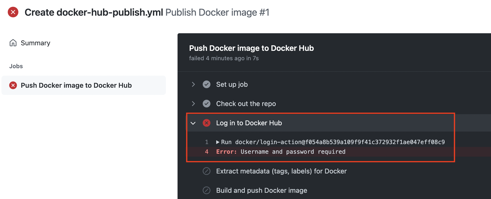  

도커 허브 Credential을 만들기 위해서 setting -> secret 으로 이동하여 Action을 클릭한다.  

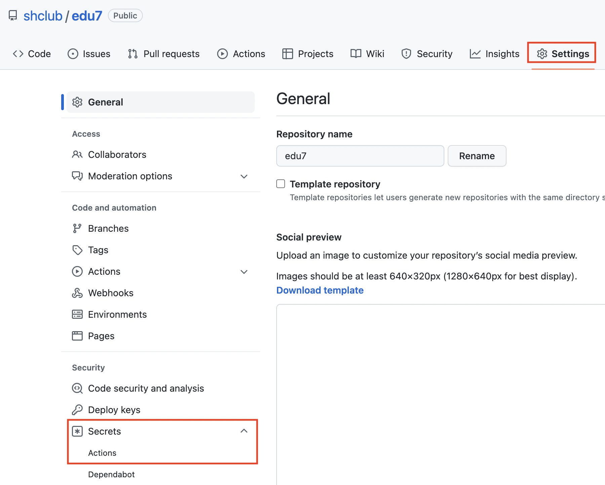  

New Repository Secret를 클릭한다.  

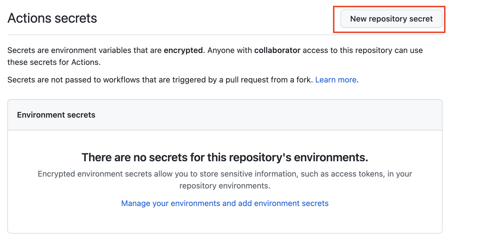  

docker-hub-publish.yml 에 생성한 것처럼 설정을 한다.   

```bash
with:
          username: ${{ secrets.DOCKER_USERNAME }}
          password: ${{ secrets.DOCKER_PASSWORD }}
```

아래와 같이 secret을 생성한다.  

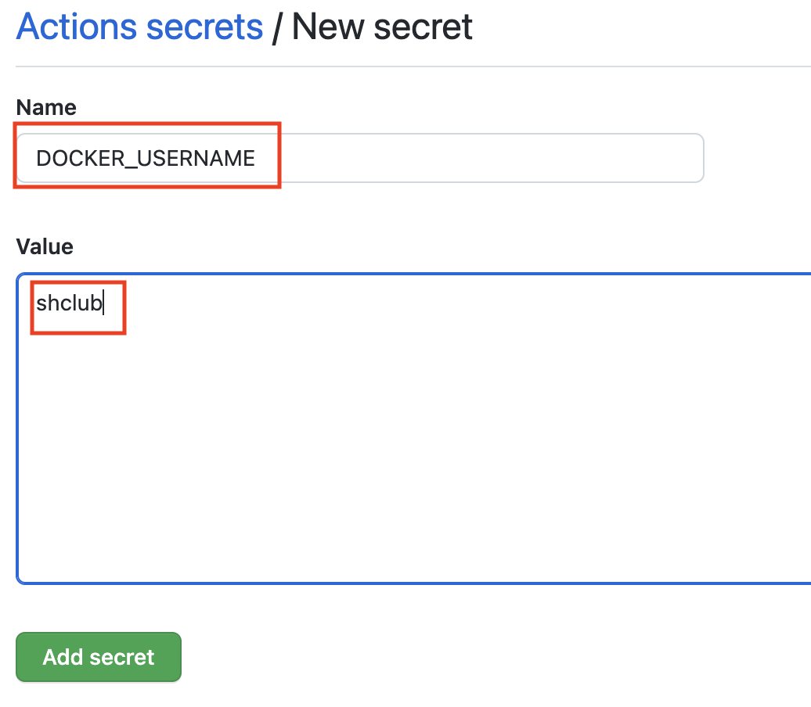   

2개의 secret이 생성된 것을 확인 할수 있다.  

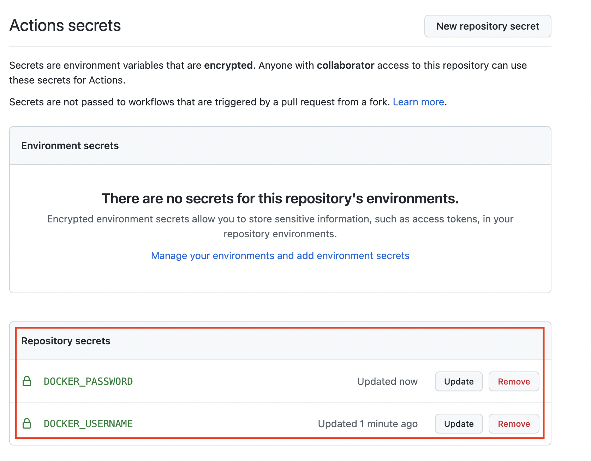   

Actions Tab 으로 이동하여 Publish Docker image 를 선택하고 에러난 화면을 클릭하여 세부 파이프라인 창으로 이동한다.  

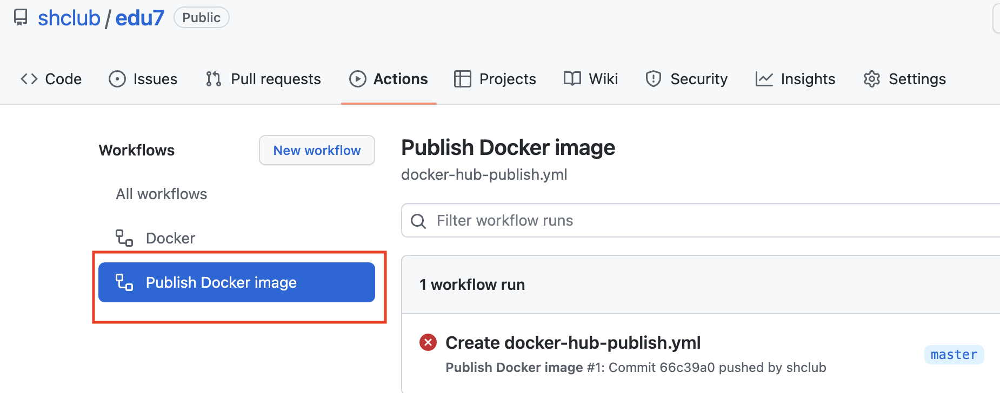  

오른쪽 상단에 Re-run failed job을 선택한다.  

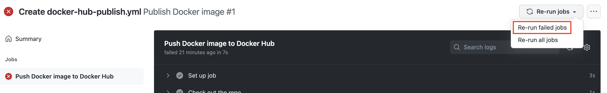  

Re-run jobs를 클릭한다.  

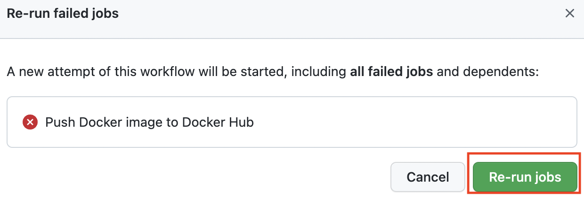  

다시 파이프라인을 재실행을 한다.  

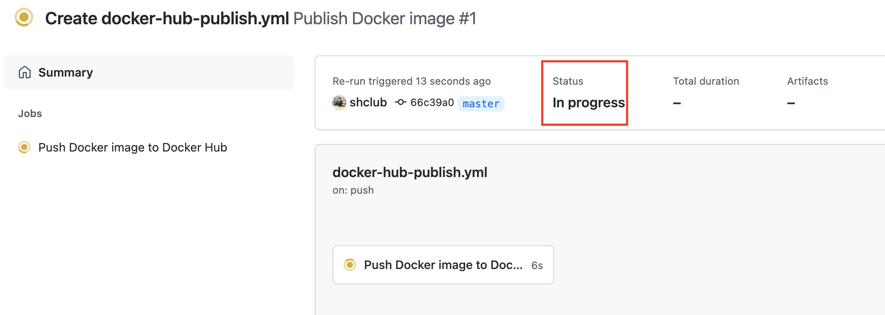  

성공으로 빌드 된것을 확인 할 수 있다.  

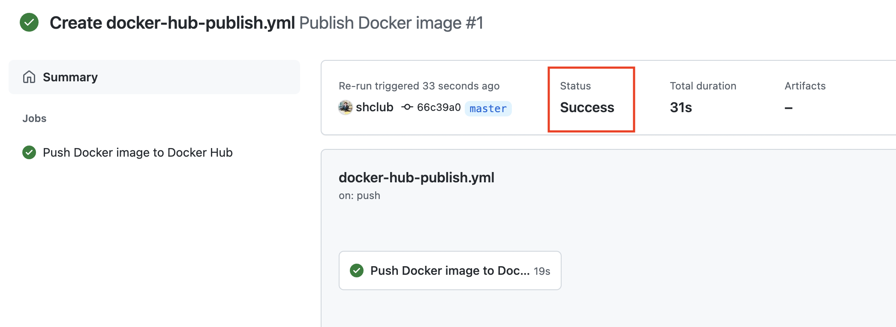  

도커 허브로 이동하여 생성된 이미지를 확인한다.  

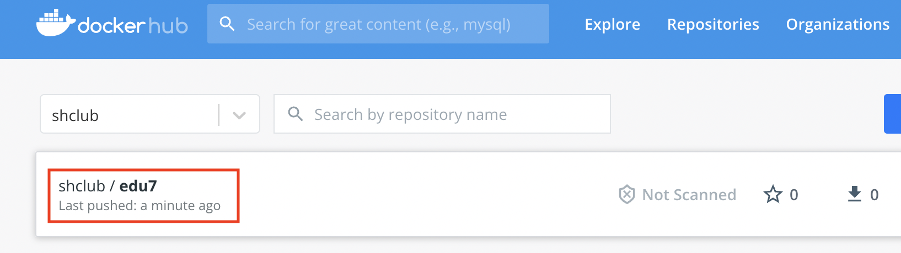  


<br/>

### 수동으로 Actions workflow 실행 

<br/>

workflow는 schedule 또는 event trigger를 통해서 동작을 하지만 수동으로 원할때만 빌드 할수 있도록 구성을 할 수 있다. 

<br/>

docker-hub-publish.yml 화엘에서 on 아래에 아래와 같이 추가해 준다.  
기존의 값은 주석 처리한다.  

```bash
on:      
  workflow_dispatch:
    inputs:
      name:
        description: "TAG"
        required: true
        default: "master"
#  schedule:
#    - cron: '25 2 * * *'
#  push:
#    branches: [ master ]
#    # Publish semver tags as releases.
#    tags: [ 'v*.*.*' ]
#  pull_request:
#    branches: [ master ]
```  

Commit을 하고 Actions Tab으로 이동하면 아래와 같이 Run workflow 버튼이 생성된 것을 확인 할 수 있다.  

버튼을 클릭하면 설정한 Input 값이 나오고 Run을 하면 실행이 된다.  

  


##  DataDog 연동

<br/>

SaaS 형 All-In-One 모니터링 솔루션인 DataDog과 연동합니다.
### 가입하기

<br/>

브라우저에서 https://www.datadoghq.com/ 로 이동한후 Free Trial을 클릭합니다. 

무료 계정은 14일간 사용이 가능하다.  

처음에 나오는 항목은 datadog 서버의 위치를 선택하게 되며 이번 예제는 US5를 기준으로 설명합니다.  

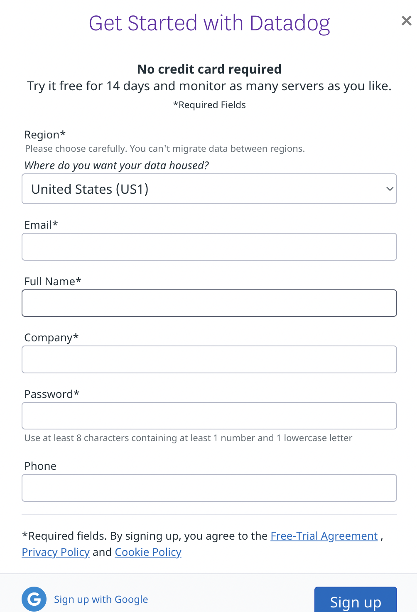  

가입 완료 후 로그인을 할때 서버위치를 선택하고 로그인 합니다. ( US5 선택 )  

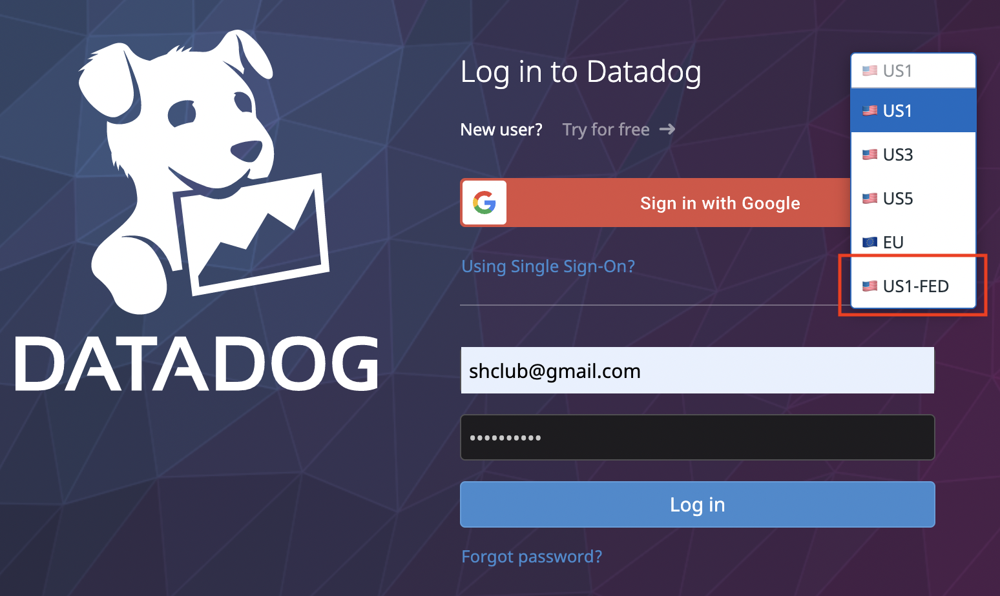  

Agent Setup 화면이 나오면 왼쪽 상단의 Dog 아이콘을 클릭합니다.  

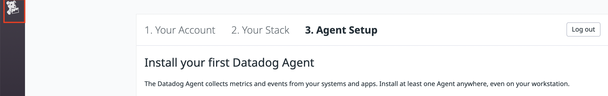 

DataDog과 연동하기 위해서는 API / APP Key가 필요합니다.  

먼저 기 생성된 API key 와 APP Key를 생성 하기 위해서  왼쪽 하단의 계정을 클릭하고 Organization Setting을 클릭합니다.  

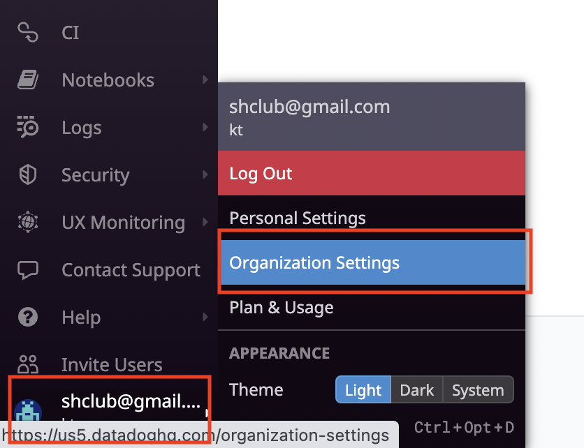 

API Keys를 클릭합니다.  
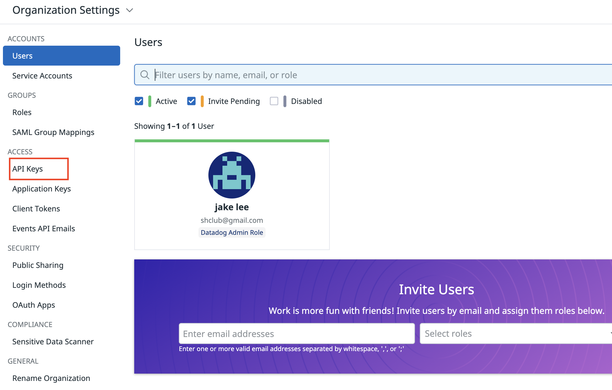 

APK Key를 클릭하면 오른쪽 화면에 Key라는 값을 확인 할 수 있습니다.  

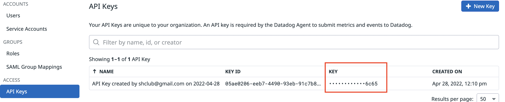 

Key 가 있는 라인을 클릭하면 화면이 Pop-up이 되고 Copy 버튼을 클릭하여 key를 복사합니다.  

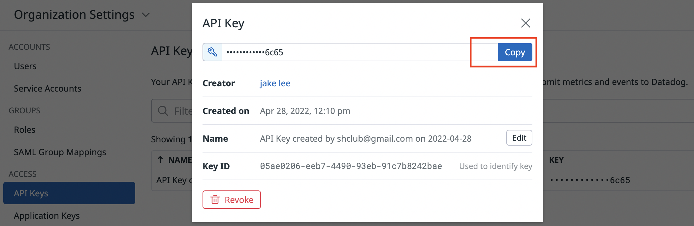   

API Key는 하나가 기본적으로 생성이 되지만 APP Key는 직접 생성해야 합니다.  

Application Keys를 선택하고 New Key를 클릭합니다.  

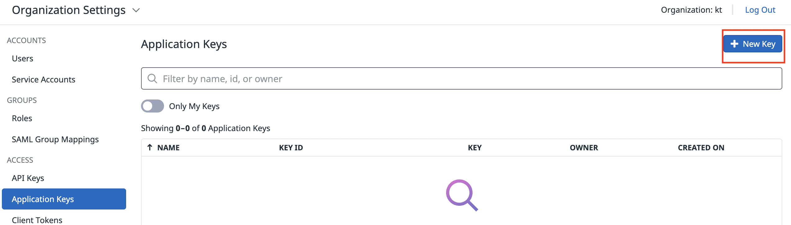   

Name는 원하는 값을 입력하고 Create key 버튼을 클릭합니다.  

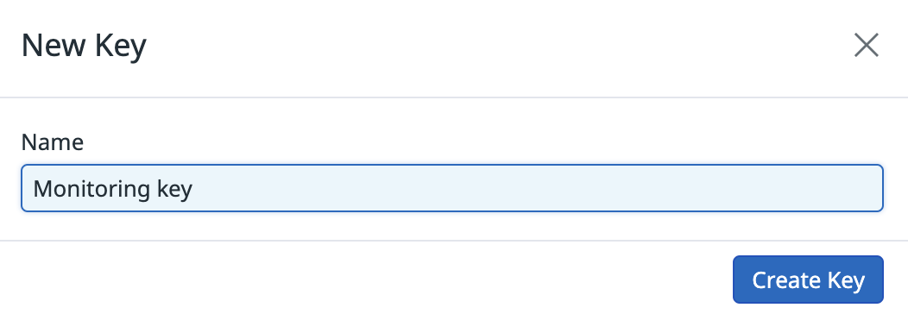 

APP key가 생성되고  Copy key 버튼을 클릭하여 APP Key를 저장합니다.  
 
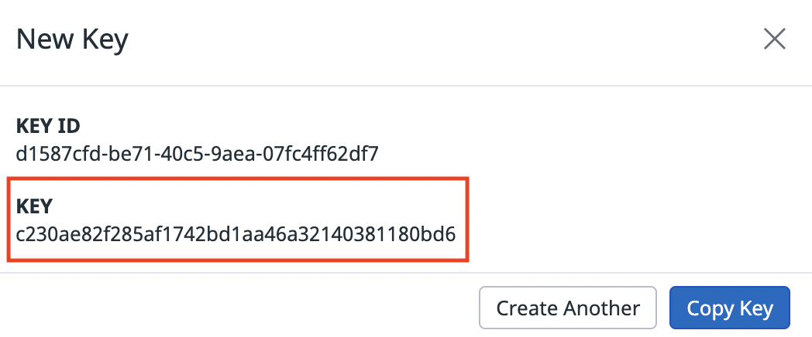 

<br/>

###  Agent 설정

<br/>

이제 kubernetes 모니터링을 위해서 DataDog Agent 를 설치합니다.  

먼저 터미널로 로그인 한다.  

```bash
ssh root@(본인 VM 공인 ip) -p 22222
``` 

github이 본인 계정의 edu7 repository에서 datadog-values.yaml 을 복사하여 서버에 같은 이름으로 화일을 생성합니다.  

```bash 
root@jakelee:~# ls datadog-values.yaml
datadog-values.yaml
```  

vi에디터로 화일을 열고 API Key와  APP Key를 본인의 것으로 수정합니다.  
site 정보는 us5로 되어 있고 clusterName은 원하는 것으로 변경하면 됩니다.  

```bash 
datadog:
  site: us5.datadoghq.com
  apiKey: f007473b3e34cc378d7c3fc83bce6c65
  appKey: c230ae82f285af1742bd1aa46a32140381180bd6
  # If not using secrets, then use apiKey and appKey instead
  #apiKeyExistingSecret: datadog-secret
  #appKeyExistingSecret: datadog-secret
  clusterName: default
```  

kt cloud는 kernel 버전이 낮아 아래 옵션을 true로 설정하면 에러가 발생하여 false로 설정한다.  

```
systemProbe:
    enableTCPQueueLength: false
```  

datadog namespace를 생성합니다.   

```bash
root@jakelee:~# kubectl create namespace datadog
namespace/datadog created
```  

secret 형식으로 api key 와 app key를 사용하기 위해서는 secret 를 생성합니다.  


```bash
kubectl create secret generic datadog-secrets --from-literal api-key=<본인 api key> --from-literal app-key=<본인 app key>  
```
실제 예  

```bash
kubectl create secret generic datadog-secrets --from-literal api-key=f007473b3e34cc378d7c3fc83bce6c65 --from-literal app-key=c230ae82f285af1742bd1aa46a32140381180bd6 -n data dog
```

helm repository를 추가 합니다.  

```bash
helm repo add datadog https://helm.datadoghq.com
```  

helm 차트의 최신 버전을 가져 옵니다.    

```bash
helm repo update
```  

진행하기 전에 아래 명령어를 먼저 수행한다.  

```bash
export KUBECONFIG=/etc/rancher/k3s/k3s.yaml
```  

반복 작업을 하지 않기 위해 아래와 같이 실행한다.

```bash
# /etc/profile을 vi 에디터로 오픈한다.
vi /etc/profile
# 아래 구문을 추가하고 저장한다.
export KUBECONFIG=/etc/rancher/k3s/k3s.yaml
#  수정된 값을 적용한다.
source /etc/profile
```  

helm (버전 3.x) 을 사용하여 Datadog Agent 를 deploy 합니다.  

```bash
helm install -f datadog-values.yaml my-datadog datadog/datadog -n datadog
```  

정상적으로 배포가 되었는지 pod를 조회해 본다.  

```bash
root@jakelee:~# kubectl get po -n datadog
NAME                                            READY   STATUS    RESTARTS   AGE
my-datadog-5vtk6                                3/3     Running   0          34h
my-datadog-kube-state-metrics-f9c786668-gmkfg   1/1     Running   0          168m
my-datadog-cluster-agent-77fb7d877c-n4d8v       1/1     Running   0          168m
```  

web browser의 data dog에서 Infrastructure -> Infrastructure List로 이동한다.  

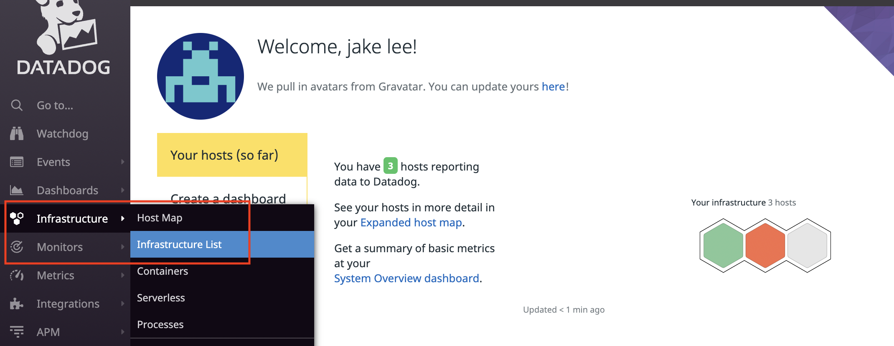  

Agent가 잘 작동하면 우리가 설정한 서버이름과 정보가 보인다.  

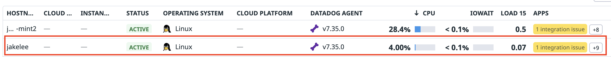   

<br/>

서버 Metric 정보도 확인 할수 있다.  

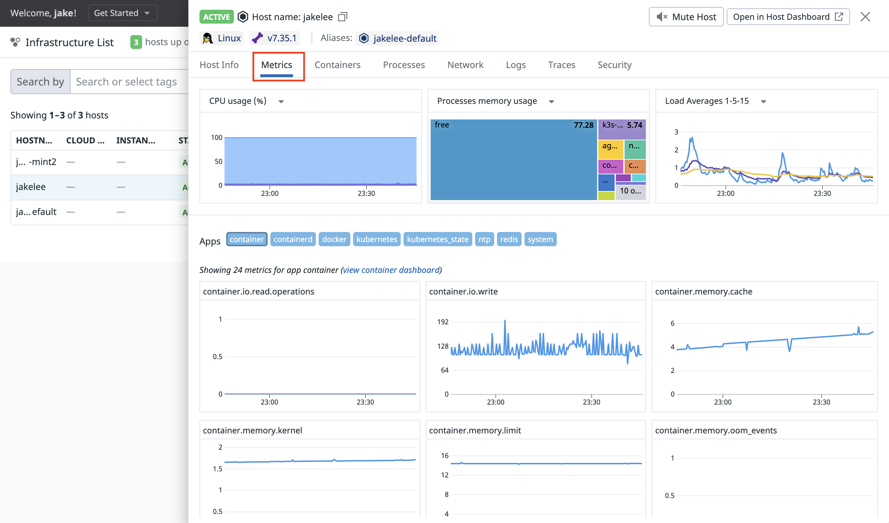   

Cluster Agent를 설정하였기 때문에 kubernetes의 container 정보를 확인 할 수도 있다.  

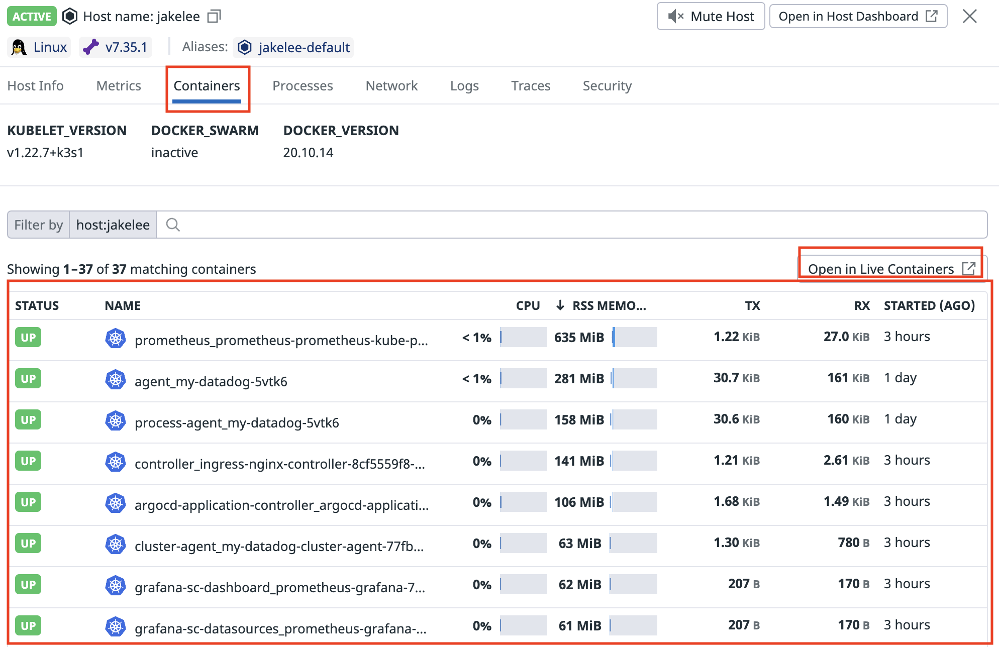

live container 를 클릭하면 좀더 자세한 k8s 컨테이너 정보를 실시간으로 확인 할 수 있다.  

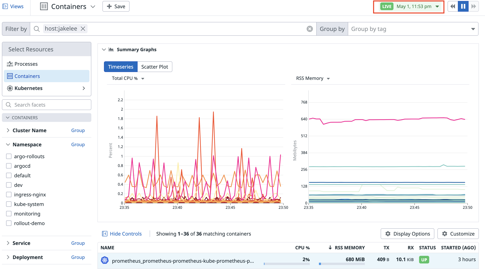  

실시간 정보 이외에도 위 상단의 prev 버튼으로 과거의 metric 정보도 확인 할 수 있다.  

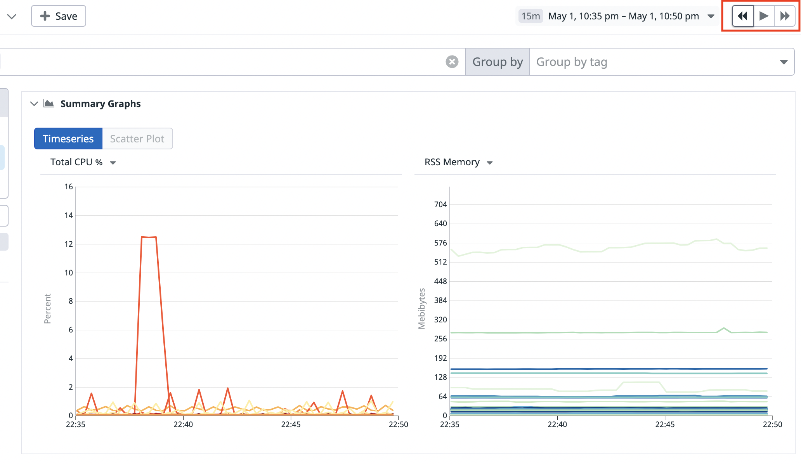

<br/>

###  Log / Trace 설정

<br/>

인프라 Metric은 위에서 처럼 Agent를 설치하면 되지만 Application의 Log 와 Trace를 위해서는 별도 설정이 필요하다.  

APM -> Docs 메뉴로 이동한다.  

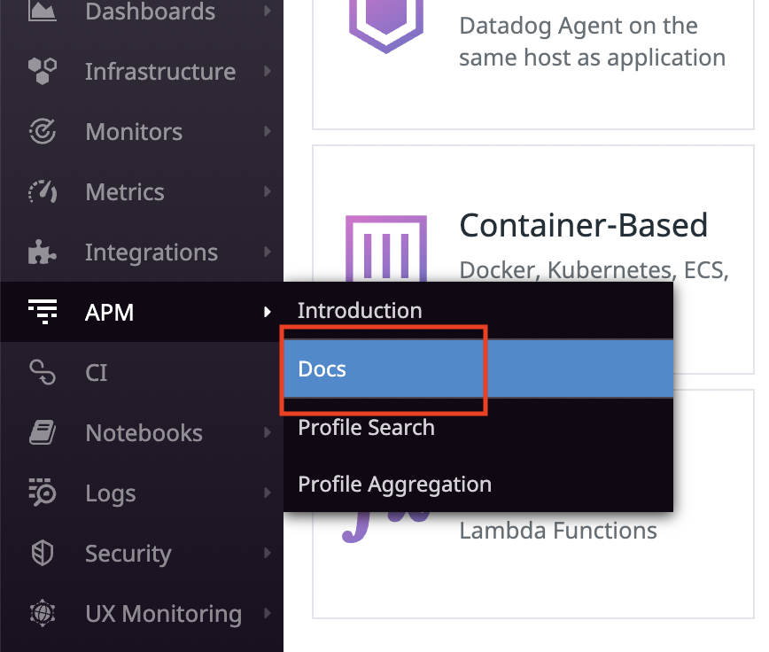  

Container Based -> Kubernetes -> Helm Chart -> Python을 선택한다.  

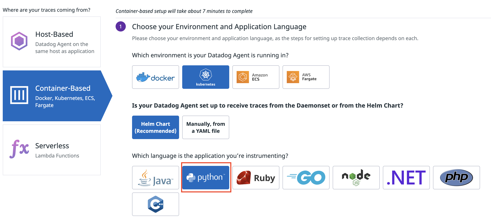  

Agenst Setup은 이미 완료 했기 때문에 Configure your application container for APM 으로 이동한다.  

오른쪽 메뉴를 다 체크를 하면 왼쪽 yaml 파일에 내용이 추가 된것을 확인할수 있다.  

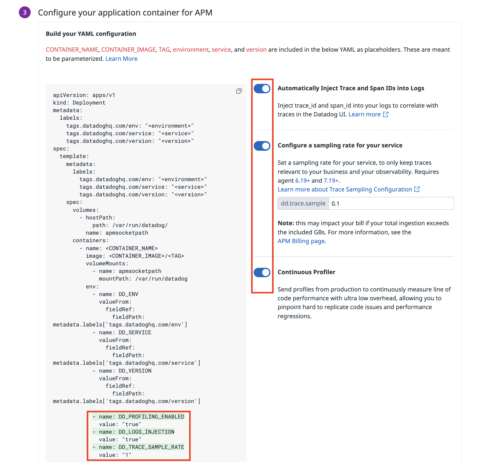  


```bash 
root@jakelee:~# ls datadog-values.yaml
datadog-values.yaml
```  


## 과제

<br/>

### 과제 1

현재 Docker Root 디렉토리를 /data로 변경한다.  

도커도 위와 같이 폴더를 변경 할 수 있습니다.    

- TIP 
    - 현재 Docker Root 디렉토리 확인
        - docker info | grep "Docker Root Dir"
    - 도커 status 정보
        - systemctl status docker
    - ExecStart로 시작하는 라인 끝에 --data-root=/data/docker 추가

