# Chapter 6 
   
SpringBoot 에 대한 기본 개념과 IDE 환경 설정 및 기본 실습을 한다.

1. SpringBoot 기본 개념

2. IDE 환경 설정 ( IntelliJ , STS )

3. 기본 실습


<br/>

##  SpringBoot 기본 개념

<br/>

###  SpringBoot 란 ?   

<br/>

SpringBoot는 Java 개발을 쉽게 해주는 Framework 이다.   

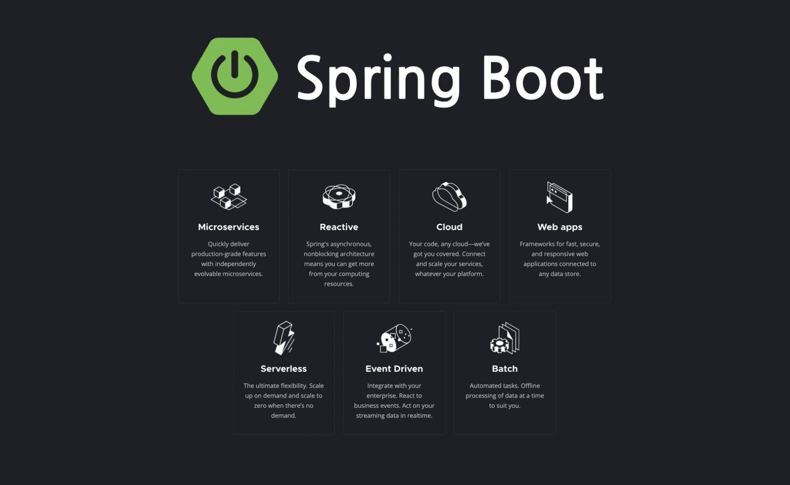


<br/>


##  IDE 환경 설정 ( IntelliJ , STS )

<br/>

개발 환경은 Java 와 SpringBoot 그리고 IntelliJ 가 설치가 되어야 한다.  


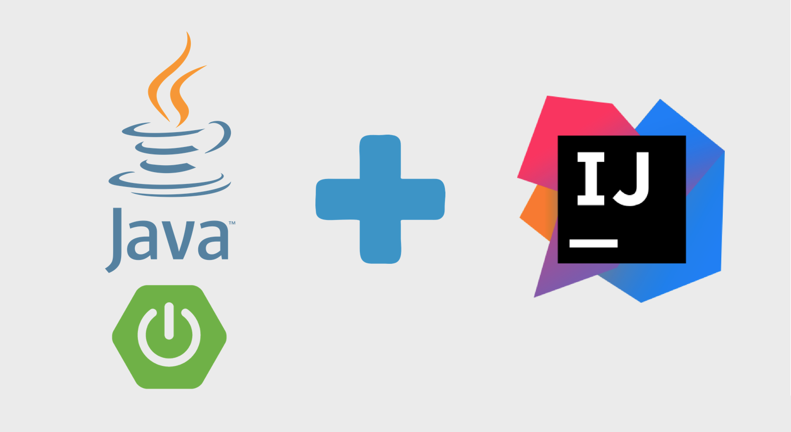  

<br/>

- JDK: 자바 코드의 번역과 실행을 담당
- IDE: 개발 생산성을 높히는 프로그램(이클립스, 인텔리제이, STS, NetBeans, …)
- SpringBoot : 개발 프레임웍  

<br/>

### Java 설치

<br/>

이번 교육에서는 JDK 최신 버전인 JDK 17 버전을 사용한다.  
먼저 java가 설치 되어 있는지 확인한다.  

```bash
java -version
```  

아래와 같이 설치가 되어 있으면 SKIP을 하고 없으면 신규로 설치한다. 

우리는 Oracle JDK가 아닌 무료 버전인 OpenJDK를 사용한다.  

```bash
jakelee@jake-MacBookAir ~ % java -version
openjdk version "17.0.2" 2022-01-18 LTS
OpenJDK Runtime Environment Zulu17.32+13-CA (build 17.0.2+8-LTS)
OpenJDK 64-Bit Server VM Zulu17.32+13-CA (build 17.0.2+8-LTS, mixed mode, sharing)
```  

<br/>

- Mac 사용자  (M1 기준)  
  Web browser에서 https://www.azul.com/downloads/?os=macos&architecture=arm-64-bit&package=jdk#download-openjdk 로 접속하여 필터조건을 아래와 같이하여 17 버전(zulu) 을 찾고 dmg 포맷을 다운 받는다.  

  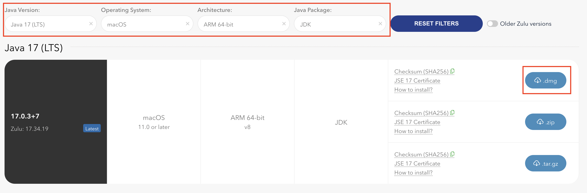   

  설치를 완료 하고  java -version 명령어를 사용하여 잘 설치 되었는지 확인한다.   
  

<br/>

- 윈도우 사용자  ( x86 기준)  
  Web browser에서 https://www.azul.com/downloads/?os=macos&architecture=arm-64-bit&package=jdk#download-openjdk 로 접속하여 필터조건을 아래와 같이하여 17 버전(zulu) 을 찾고 원하는 포맷을 다운 받는다.  

  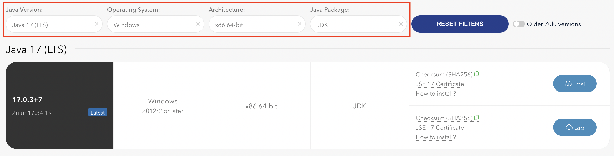   

  설치를 완료 하고  java -version 명령어를 사용하여 잘 설치 되었는지 확인한다.   
  

<br/>

### IntellJ 설치 및 설정

<br/>

`인텔리제이`를 설치하기 위해 다운로드 페이지(https://www.jetbrains.com/ko-kr/idea/download)로 이동한다.  

원하는 OS를 선택을 하고 무료 버전인 Community 버전을 선택하여 받은 받는다.  

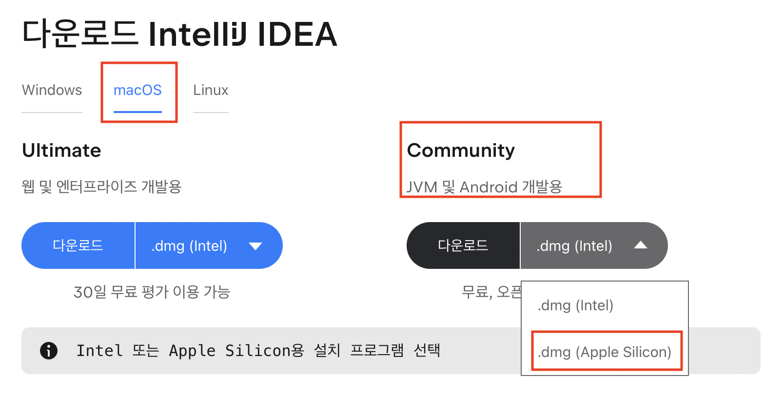  

<br/>  

파일 다운로드 후, 설치를 진행한다. 되도록 기본 설정으로 진행한다.  
설치 완료 후, “IntelliJ IDEA”를 실행하면 다음 창이 뜬다.  

<br/>

### 프로젝트 만들기

<br/>  

스프링 부트 프로젝트는 https://start.spring.io 에서 생성한다.   
왼쪽 영역에서 프로젝트 기본 설정을, 오른쪽 영역에서 필요한 라이브러리를 추가할 수 있다. ( 사내 환경에서는 접속 불가로 외부에서 먼저 하나 생성 후 복사 )

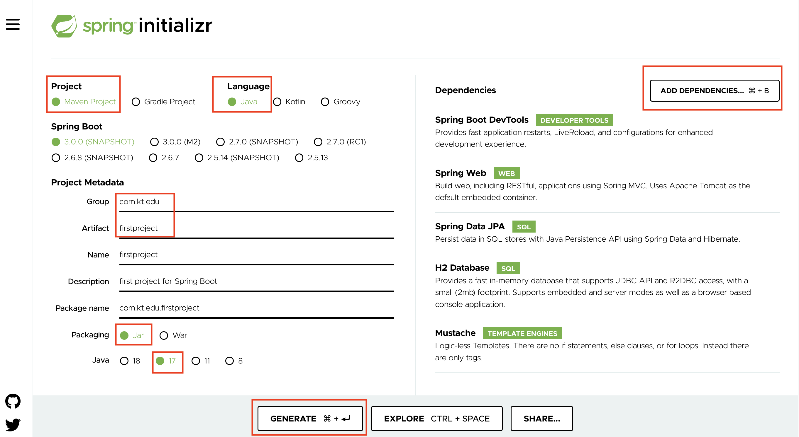  

- project : maven 선택 ( gradle 보다 직관적이고 익숙 )
- Language : Java
- Group : com.kt.edu ( 원하는 이름으로 만들면 되고 package 이름 자동 생성 )
- Artifcat : firstproject ( 원하는 이름으로 만들면 되고 package 이름 자동 생성 )
- packaging : Jar
- java : 17 ( JDK 버전 선택)
- Add dependencies : 클릭해서 원하는 library 검색하여 추가  

Generate를 클릭하여 소스를 생성한다.  

아래와 같이 zip 화일이 생성이 된다.  

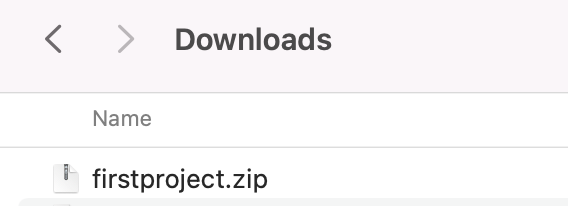   

압축을 푼다.  

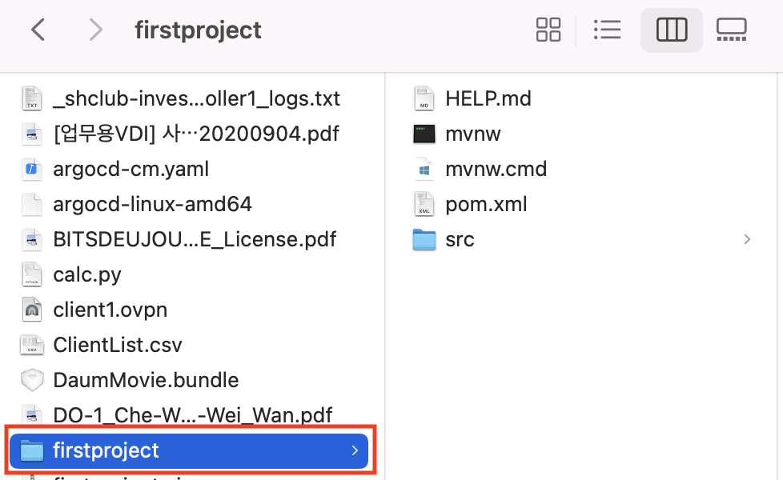   

IntelliJ 창에서 Open을 클릭하고 Downloads 폴더 밑의 firstproject 폴더는 선택한다.  

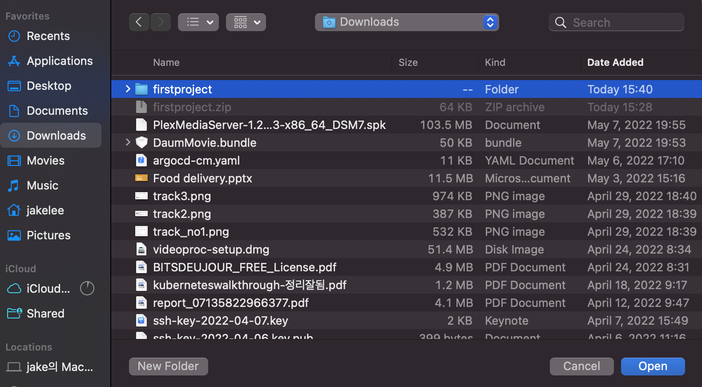

Trust check가 나오면 체크를 해주고 Trust Project를 클릭한다.  

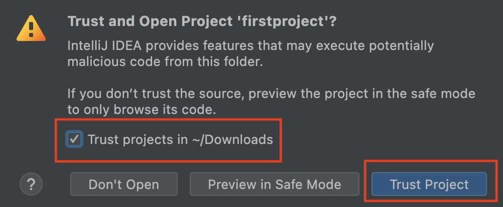

처음 프로젝트 생성시에는 해당 라이브러리를 가져오는 과정을 거치고 Indexing을 하기 때문에 약간의 시간이 소요가 되고 오른쪽 하단의 창이 완료 될때 까지 기다린다.  

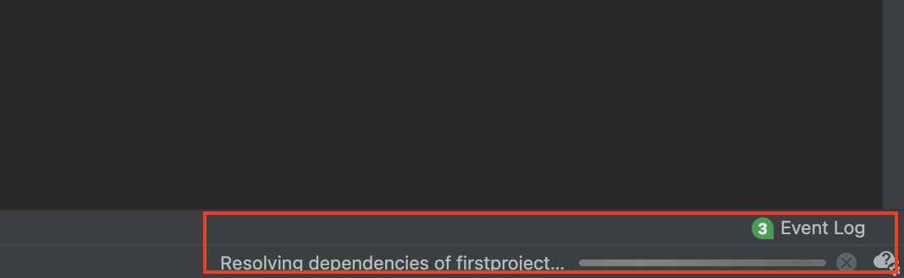  

하단의 Build Tab을 클릭하면 Status를 볼수 있고 Sync 가 체크되어 있으면 완료.  

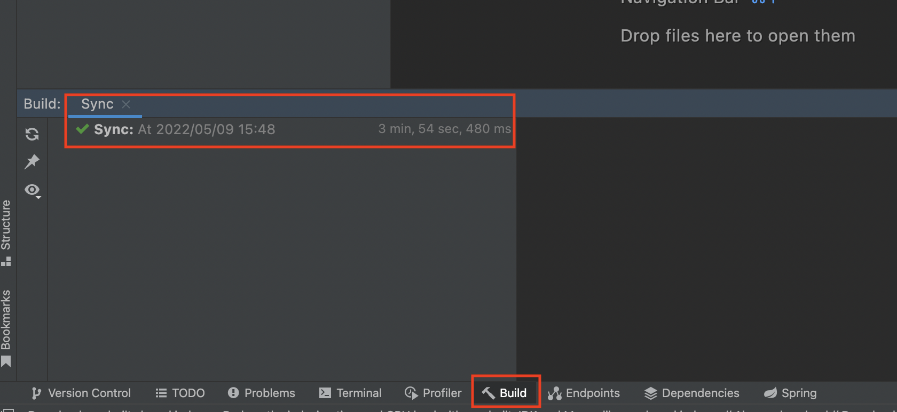  

Preferences ->  Build, Execution , Deploy 메뉴로 이동하여 Maven -> Runner 에 JDK 17 ( zulu )  로 설정 되어 있는지 확인하고 안되어 있으면 변경한다.  

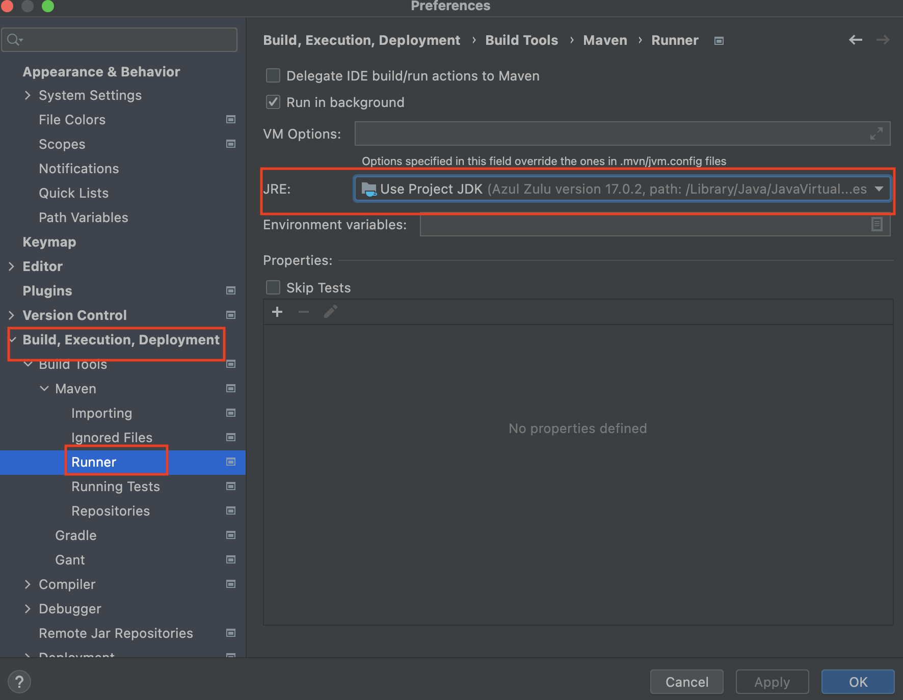

- sts의 경우는 Preferences -> Java -> Installed JRE 선택  

  


<br/>

폐쇄망에서 개발 할 경우에는 Preferences ->  Build, Execution , Deployment > Build Tools > Maven  에서 user setting에 해당하는
xml을 찾아서 사내 nexus 연결 정보를 넣어준다.  

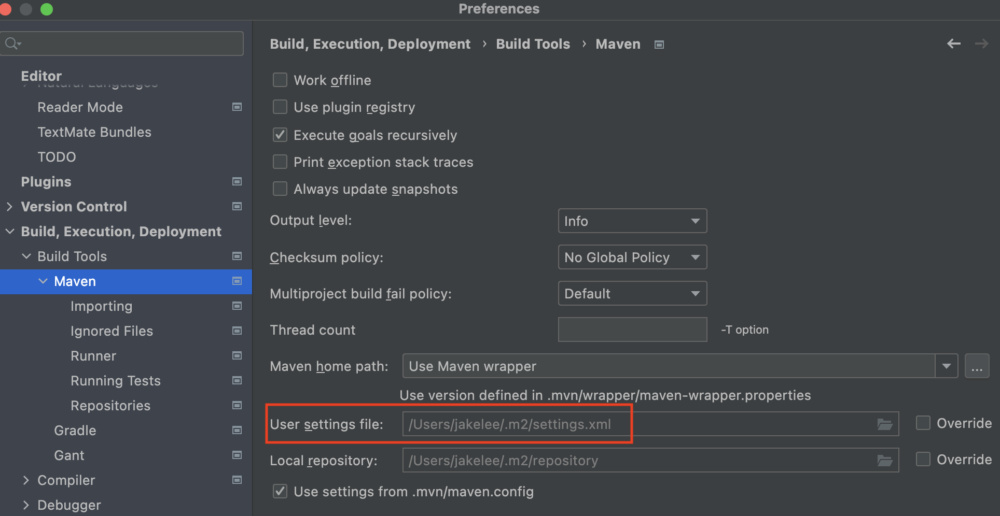

<br/>

### 프로젝트 실행하기

<br/>  

IntelliJ 의 왼쪽 프레임에서 Firstproject -> src -> main -> java ->  패키지 이름으로 이동한다.  

FirstprojectApplication 을 선택하고 마우스 오른쪽 버튼을 클릭하여 Run을 한다.  

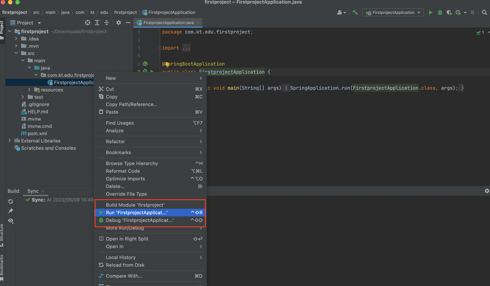  

console 창에 아래와 같은 메시지가 나오면서 실행이 된다.  

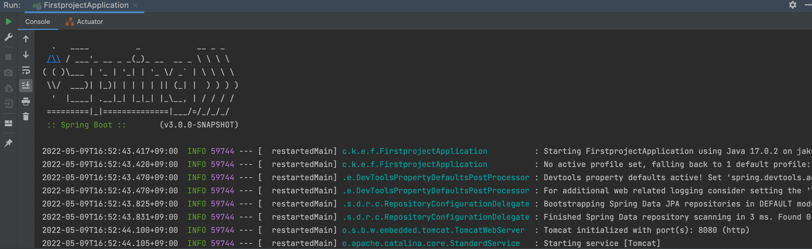  

아래 메시지가 나오면서 종료가 되면 8080포트를 사용하는 서비스가 존재한다는 의미이다.  
 ( springboot는 기본적으로 8080 포트를 사용 )

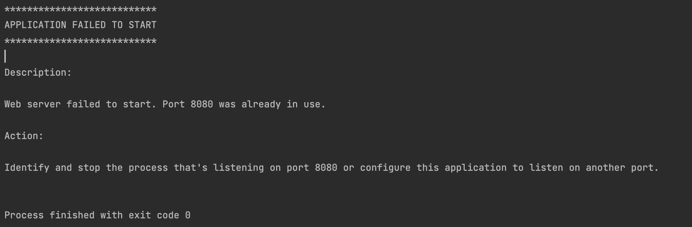  

아래 명령어를 사용하여 프로세스를 kill 한다.  

```bash
jakelee@jake-MacBookAir ~ % lsof -i :8080
COMMAND    PID    USER   FD   TYPE             DEVICE SIZE/OFF NODE NAME
com.docke 1028 jakelee  126u  IPv6 0x427d9e95c9e6668b      0t0  TCP *:http-alt (LISTEN)
jakelee@jake-MacBookAir ~ % kill -9 1028
```  

다시 빌드를 수행하고 started 메시지를 확인을 한다.  

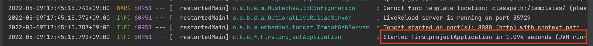  

Web browser를 사용하여 localhost:8080 으로 접속을 한다.  

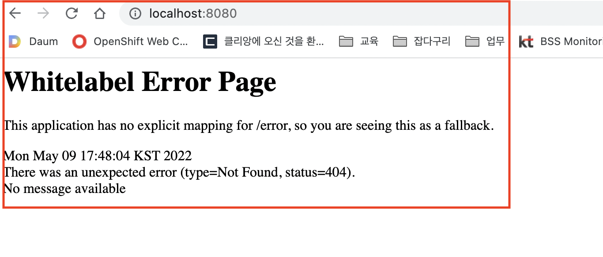  

위의 에러 메시지가 발생한 이유는 html web 페이지를 만들지 않았기 때문이다.    
main -> resources -> static 폴더를 선택을 하고  마우스 오른쪽 버튼 클릭 한 후 New -> HTML File을 선택한다.   

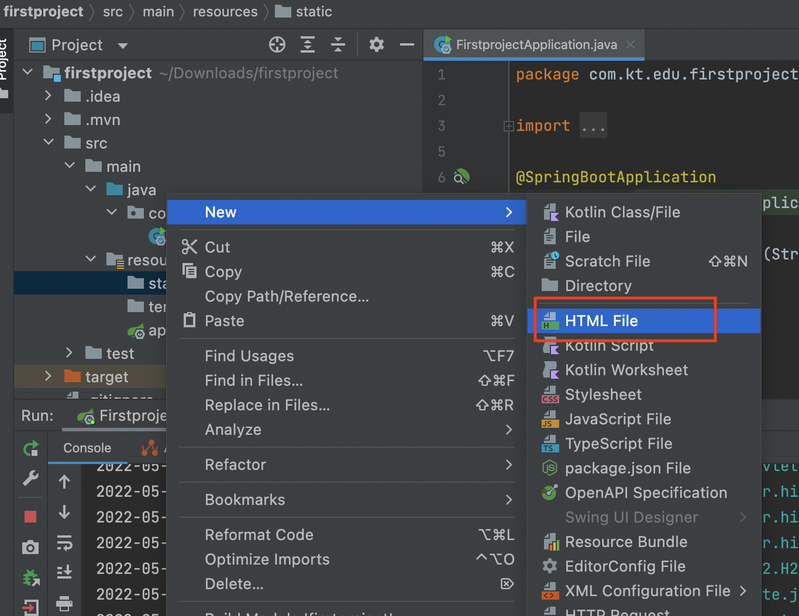  

화일 이름을  hello.html로 생성한다.  

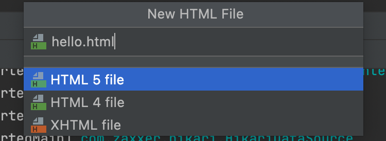  

<br/> 

템플릿이 하나가 생성이 되고 body tag 안에 문구를 아래와 같이 추가한다.  

```bash
 <h1>hello world</h1>
```  

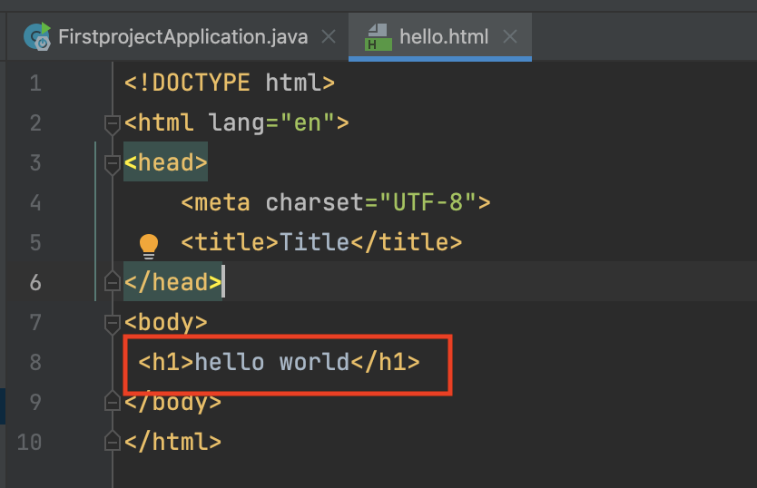  

<br/>

저장을 하고 다시 한번 run 한다. 왼쪽 하단의 refresh 아이콘을 클릭한다.   

  

<br/>

에러가 발생하지 않으면 web browser 에서 http://localhost:8080/hello.html 을 실행한다.     

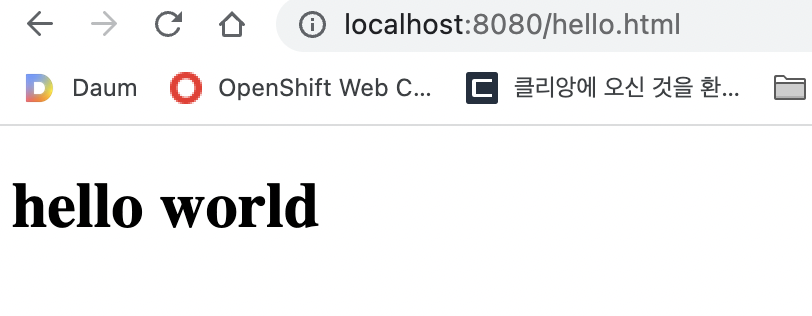  

<br/>
<br/>

추가 SpringBoot 관련  Hands-on은 아래 문서를 참고 한다.

- 문서를 참고한다. [SpringBoot Hands-On ](./springboot_hands_on.md)  

<br/>

## 과제

<br/>

### 과제 1

Spring vs SpringBoot 차이를 비교하시오.

