# k8s Basic Hands-on
 
kubernetes에서 kubectl를 사용하여 cli 실습을 한다.   

1. kubectl 설치 ( 윈도우 / Mac )

2. kubectl Context 설정

3. k8s 리소스 보기

4. Pod , Replicaset , Deployment 생성 및 삭제

5. Service Expose

6. 참고 사이트 
    - podman 사용 : https://github.com/chhanz/kubernetes-hands-on-lab
    - https://github.com/subicura/workshop-k8s-basic/tree/master/guide


<br/>

##  실습 전체 개요 


### Deployment, Service, Ingress 흐름 설명


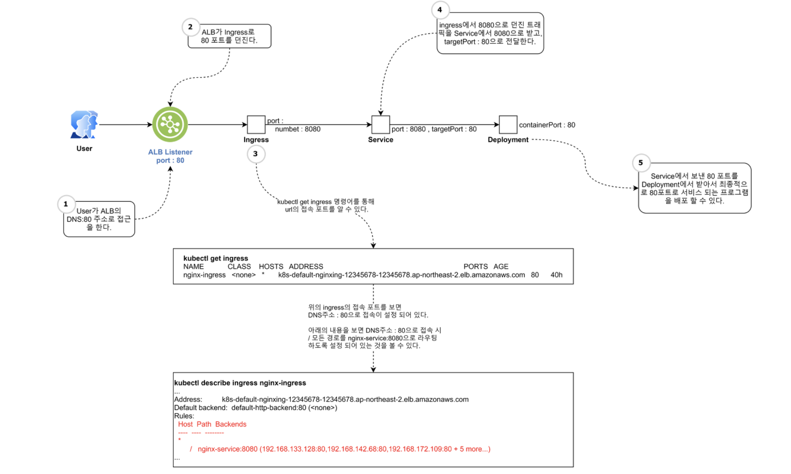

<br/>

Ingress : HTTP 나 HTTPS 통신을 클러스터 내부의 서비스에 연결해 주는 도구.  
쉽게 말해 가정집의 공유기와 비슷한 역할을 한다.  
Deployment(pod) 는 Service 와 연결된다고 선술한 바 있다. 
  
Ingress 는 아래 이미지와 같이 Service 와 연결해주면 된다.   


- Deployment 정의 : Deployment는 메타데이터 및 pod 리플리카 개수, 컨테이너 이미지, 이미지 포트 등을 정의한다.


- Service 정의 : Service는 아래와 같이 어노테이션 및 서비스 포트 및 타깃 포트 등을 정의한다.


- ingress 정의 : 어노테이션 및 ingress의 서비스 name과 port를 정의한다.

<br/>

Deployment 와 Service 그리고 Ingress의 관계가 간단하게 정리된 그림

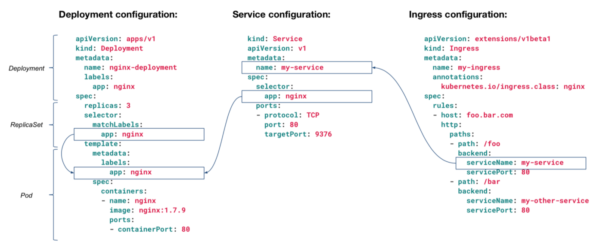

<br/>

위의 예시를 토대로 Deployment와 Service 그리고 Ingress의 관계를 Flow로 표현한 그림

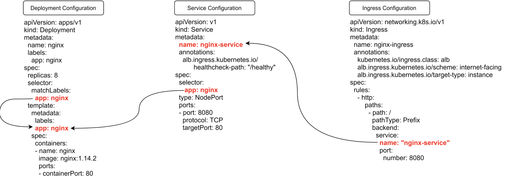

<br/>

##  Kubeconfig 설정 

### kubectl 설치 ( https://kubernetes.io/ko/docs/tasks/tools/ )

<br/>

GUI IDE인 lens 대신 kubectl cli를 통해 실습을 하기 위해  로컬 PC에
kubectl 을 설치 한다.


- Windows  
    아래사이트에서 최신 버전을 다운로드 받는다.  
https://kubernetes.io/ko/docs/tasks/tools/install-kubectl-windows/   

    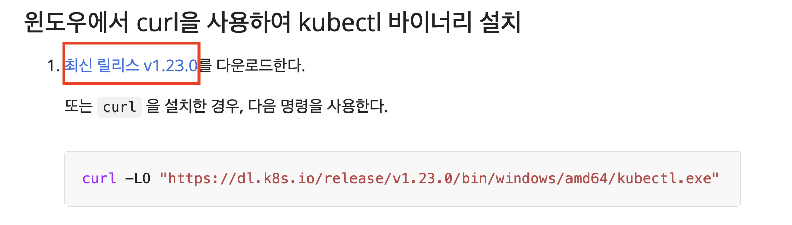  

    윈도우에서  kubectl.exe 패스를 추가한다. 
    환경 변수 창을 띄운다. 
    ```bash
    Windows 설정 - 시스템 - 정보 - 시스템 정보 - 고급 시스템 설정 - 환경 변수
    ```  
    시스템 변수에 path를 선택하고 추가한다.  

<br/>

- Mac
```bash
brew install kubectl
kubectl version --client
``` 

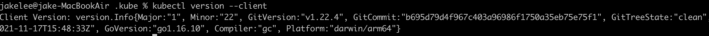 

<br/>

Kubernetes는 kubeconfig라는 YAML 파일을 사용하여 kubectl에 대한 클러스터 인증 정보를 저장합니다. kubeconfig에는 명령을 실행할 때 kubectl이 참조하는 컨텍스트 목록이 포함되어 있습니다. 기본적으로 파일은 $HOME/.kube/config에 저장됩니다.  

클러스터를 만들면 항목이 환경의 kubeconfig에 자동으로 추가되고 현재 컨텍스트가 해당 클러스터로 변경됩니다.  

현재 테스트 과정중에 config 이름이 본인이 설정한 이름으로 구성이 되어 있으니 기존 이름을 config로 변경 합니다.   

- config 화일이 여러개인 경우 아래와 같이 병합 하면 됩니다.  
    ```bash
    export KUBECONFIG=~/.kube/config:~/.kube/config-jakelee
    ```
    config가 병합되어 있는지 확인합니다.
    
    ```bash
    kubectl config view
    ```  
    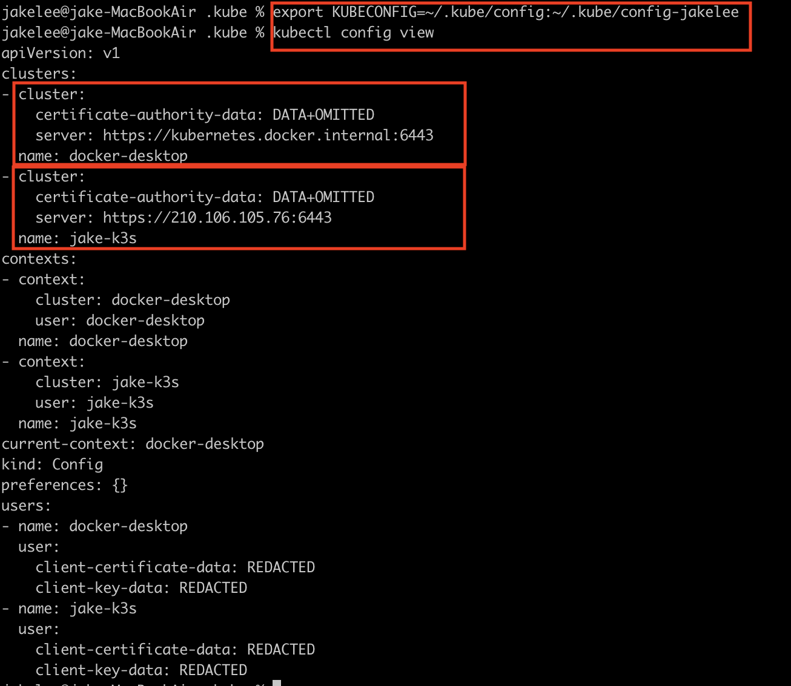   

<br/>

원하는 k8s를 선택하기 위해 전체 context를 조회 해보고 현재 context를 확인합니다.  
 
```bash
kubectl config get-contexts
kubectl config current-context
```  

작업하기 원하는 context ( k8s cluster ) 로 변경 합니다.   
설정을 하면 기본 context로 설정이 됩니다.

```bash
kubectl config use-context my-cluster-name
```

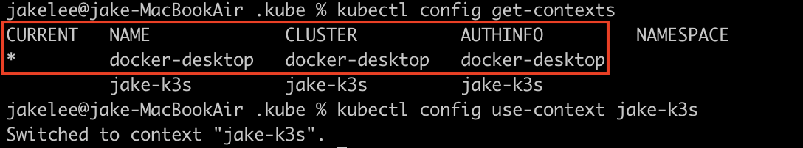  

Cluster 정보를 확인 합니다.  

```bash
kubectl  cluster-info
```  

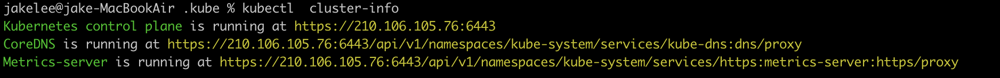  

<br/>

##  Kubectl 활용 

### kubectl 명령어

<br/>

자주 사용하는 kubectl 명령어를 알아봅니다.  


```bash
# 화일 이름의 리소스를 적용한다. 없으면 insert 있으면 update
# 아래 create/update 명령어를 대체 할 수 있다. 
kubectl apply -f [화일이름]
# 화일 이름의 리소스를  생성한다.  
kubectl create -f [화일이름]
# 화일 이름의 리소스를  update  한다.
kubectl update -f [화일이름]
# 화일 이름의 리소스를  delete  한다.
kubectl delete -f [화일이름]

# 해당 리소스 정보를 보여준다
kubectl  get [리소스 타입] [리소스 이름]

# 해당 리소스 세부 정보를 보여준다
kubectl  describe [리소스 타입] [리소스 이름]

# 해당 리소스 로그 정보를 보여준다
kubectl  log  [리소스 이름]
# 해당 리소스를 삭제 한다
kubectl  delete  [리소스 타입] [리소스 이름]

# Pod ( Container ) 안에서 command를  할 수 있다.
kubectl exec -it  [PO 이름] /bin/sh
```  

전체 레이블을 조회한다.
```bash
root@jakelee:~# kubectl get pods --show-labels
NAME                              READY   STATUS    RESTARTS   AGE   LABELS
flask-edu4-app-74788b6479-qgs2j   1/1     Running   0          24m   app=flask-edu4-app,pod-template-hash=74788b6479
flask-edu4-app-74788b6479-l7gkx   1/1     Running   0          24m   app=flask-edu4-app,pod-template-hash=74788b6479
flask-edu4-app-74788b6479-nmcvv   1/1     Running   0          24m   app=flask-edu4-app,pod-template-hash=74788b6479
flask-edu4-app-74788b6479-f2kcp   1/1     Running   0          24m   app=flask-edu4-app,pod-template-hash=74788b6479
flask-edu4-app-74788b6479-rlght   1/1     Running   0          24m   app=flask-edu4-app,pod-template-hash=74788b6479
```  

<br/>

### 명령 vs 선언

<br/>

명령보다는 선언하여 사용하는 것을 권장.  

- 명령 

    ```bash
    kubectl scale --replicas=3 rs/nginx
    ```

- 선언 

    ```yaml  
    apiVersion: apps/v1
    kind: ReplicaSet
    metadata:
      name: frontend
      labels:
        app: guestbook
        tier: frontend
    spec:
    # modify replicas according to your case
      replicas: 3
      selector:
        matchLabels:
        tier: frontend
      template:
        metadata:
        labels:
          tier: frontend
        spec:
          containers:
          - name: php-redis
            image: gcr.io/google_samples/gb-frontend:v3
    ```    
    
    위의 화일은 에러가 나기 때문에 아래 사이트에서 복사해서 사용한다.  

    참고 : https://kubernetes.io/docs/concepts/workloads/controllers/replicaset/ 

    ```bash
    kubectl apply -f [화일명]
    ```  

    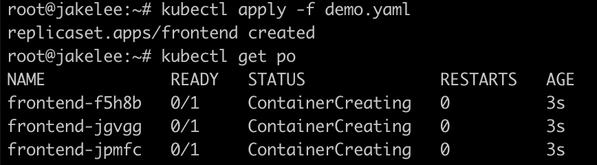  

    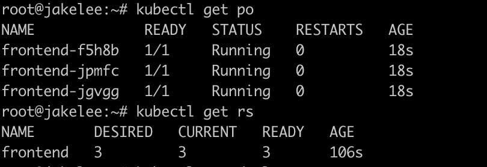  

<br/>


### Node

<br/>

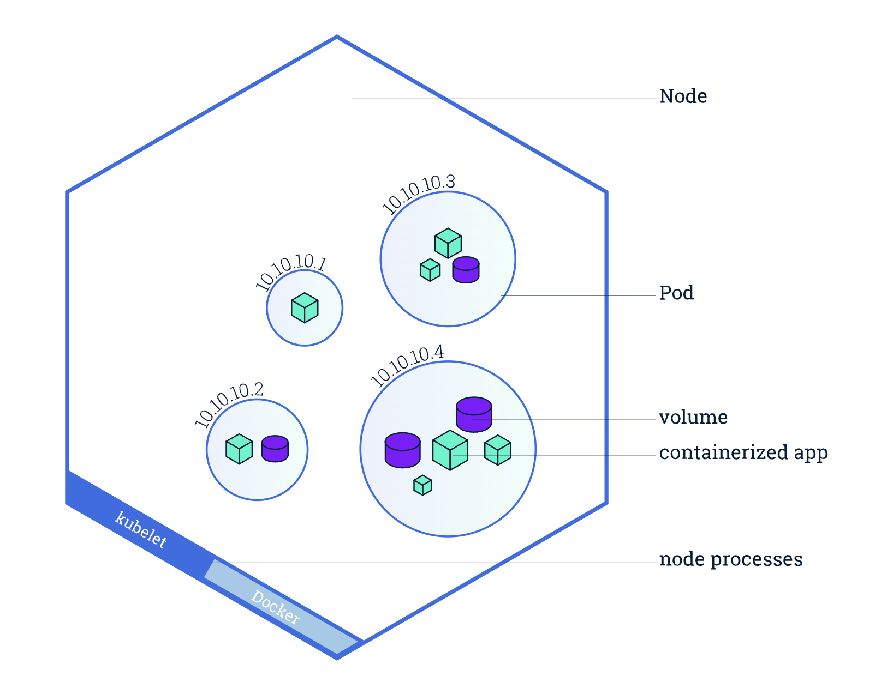  

`Kubernetes Node` 는 최소한 다음과 같이 동작합니다.

- Kubelet은, 쿠버네티스 마스터와 노드 간 통신을 책임지는 프로세스이며, 하나의 머신 상에서 동작하는 파드와 컨테이너를 관리합니다.  
- (도커, rkt)와 같은 컨테이너 런타임은 레지스트리에서 컨테이너 이미지를 가져와 묶여 있는 것을 풀고 애플리케이션을 동작시키는 책임을 맡습니다.

Node 정보 확인
```bash 
root@jakelee:~# kubectl get node
NAME      STATUS   ROLES                  AGE     VERSION
jakelee   Ready    control-plane,master   2d20h   v1.22.7+k3s1
```

Node 상세 정보 확인
```bash
root@jakelee:~# kubectl get node -o wide
NAME      STATUS   ROLES                  AGE     VERSION        INTERNAL-IP    EXTERNAL-IP   OS-IMAGE             KERNEL-VERSION          CONTAINER-RUNTIME
jakelee   Ready    control-plane,master   2d20h   v1.22.7+k3s1   172.27.0.134   <none>        Ubuntu 18.04.6 LTS   5.15.0-051500-generic   containerd://1.5.9-k3s1
```

Node 성능 사용량 확인
```bash
root@jakelee:~# kubectl top nodes
NAME      CPU(cores)   CPU%   MEMORY(bytes)   MEMORY%
jakelee   151m         1%     7849Mi          49%
```

추가 명령어
```bash
# 해당노드에 pod 를 스케쥴링 하지 않는다.
kubectl cordon <node>

# 해당노드에 pod 를 스케쥴링 한다.
kubectl uncordon <node>

# https://arisu1000.tistory.com/27845
# 노드 관리를 위해서 지정된 노드에 있는 포드들을 다른곳으로 이동시키는 명령입니다. 
kubectl drain <node>
```

<br/>

### Deployment

<br/>

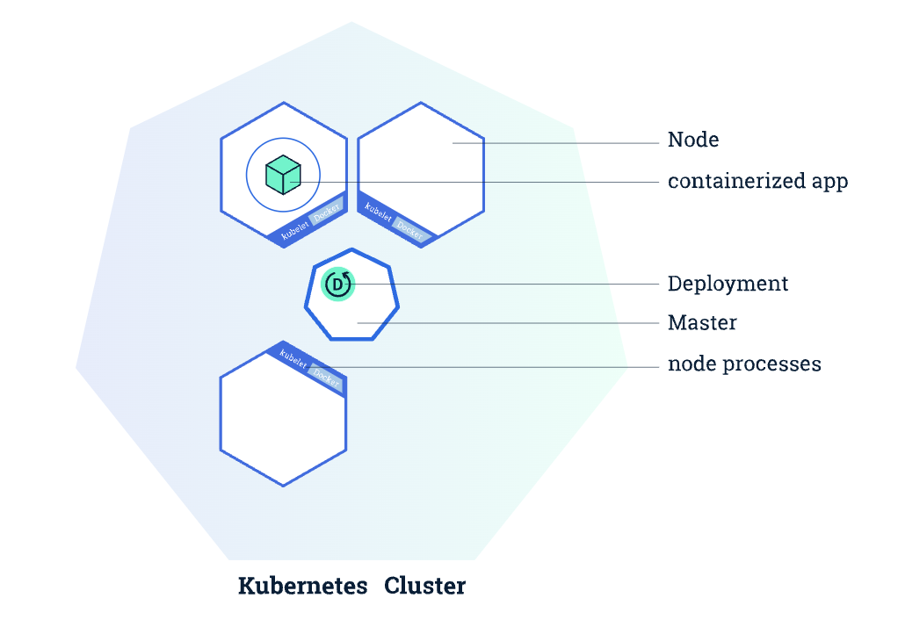  

`Deployment`는 Kubernetes 가 애플리케이션의 인스턴스를 어떻게 생성하고 업데이트해야 하는지를 지시합니다.   
`Deployment`가 만들어지면, Kubernetes Master 가 해당 `Deployment` 에 포함된 애플리케이션 인스턴스가 클러스터의 개별 노드에서 실행되도록 스케줄합니다.   

<br/>

아래 명령어와 같이 수행합니다.

```bash  
kubectl create deployment --image=shclub/edu4:v1 flask-edu4-app
```    

Deployment 가 생성되고 Pod 가 정상적으로 실행중인지 확인합니다.

```bash  
root@jakelee:~# kubectl get all
NAME                                  READY   STATUS    RESTARTS   AGE
pod/flask-edu4-app-74788b6479-t6rvt   1/1     Running   0          48s

NAME                 TYPE        CLUSTER-IP   EXTERNAL-IP   PORT(S)   AGE
service/kubernetes   ClusterIP   10.43.0.1    <none>        443/TCP   2d17h

NAME                             READY   UP-TO-DATE   AVAILABLE   AGE
deployment.apps/flask-edu4-app   1/1     1            1           48s

NAME                                        DESIRED   CURRENT   READY   AGE
replicaset.apps/flask-edu4-app-74788b6479   1         1         1       48s
```  


실행중인 Deployment 를 자세히 확인 해보겠습니다.  

```bash  
root@jakelee:~# kubectl describe deployment flask-edu4-app
Name:                   flask-edu4-app
Namespace:              default
CreationTimestamp:      Mon, 04 Apr 2022 11:01:34 +0900
Labels:                 app=flask-edu4-app
Annotations:            deployment.kubernetes.io/revision: 1
Selector:               app=flask-edu4-app
Replicas:               1 desired | 1 updated | 1 total | 1 available | 0 unavailable
StrategyType:           RollingUpdate
MinReadySeconds:        0
RollingUpdateStrategy:  25% max unavailable, 25% max surge
Pod Template:
  Labels:  app=flask-edu4-app
  Containers:
   edu4:
    Image:        shclub/edu4:v1
    Port:         <none>
    Host Port:    <none>
    Environment:  <none>
    Mounts:       <none>
  Volumes:        <none>
Conditions:
  Type           Status  Reason
  ----           ------  ------
  Available      True    MinimumReplicasAvailable
  Progressing    True    NewReplicaSetAvailable
OldReplicaSets:  <none>
NewReplicaSet:   flask-edu4-app-74788b6479 (1/1 replicas created)
Events:
  Type    Reason             Age    From                   Message
  ----    ------             ----   ----                   -------
  Normal  ScalingReplicaSet  2m11s  deployment-controller  Scaled up replica set flask-edu4-app-74788b6479 to 1
```

<br/>

### Pod

<br/>

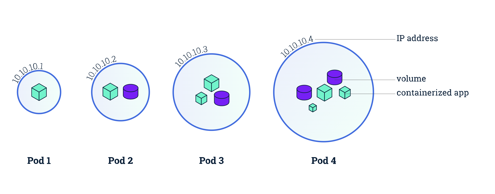  

<br/>

Deployment 가 생성이 되고 나면 Kubernetes 는 여러분의 애플리케이션 인스턴스에 Pod 를 생성했습니다.  

Pod 는 하나 또는 그 이상의 애플리케이션 컨테이너 (도커 또는 rkt와 같은)들의 그룹을 나타내는 쿠버네티스의 추상적 개념으로 일부는 컨테이너에 대한 자원을 공유합니다.  
 
<br/>

#### Pod 확인

<br/>

- pod 정보 확인  

    ```bash  
    root@jakelee:~# kubectl get pod
    NAME                              READY   STATUS    RESTARTS   AGE
    flask-edu4-app-74788b6479-t6rvt   1/1     Running   0          6m49s
    ```    
- pod 성능 사용량 확인  

    ```bash  
    root@jakelee:~# kubectl top pod
    NAME                              CPU(cores)   MEMORY(bytes)
    flask-edu4-app-74788b6479-t6rvt   1m           17Mi
    ```    
    컨테이너 이름까지 같이 보기.  

    ```bash  
    root@jakelee:~# kubectl top pod --containers
    POD                                   NAME          CPU(cores)   MEMORY(bytes)
    flask-edu4-app-74788b6479-f2kcp       edu4          1m           18Mi
    ```    


- Pod 내 Container 의 log 확인  

    ```bash  
    root@jakelee:~# kubectl logs flask-edu4-app-74788b6479-t6rvt
    * Serving Flask app 'app' (lazy loading)
    * Environment: production
    WARNING: This is a development server. Do not use it in a production deployment.
    Use a production WSGI server instead.
    * Debug mode: off
    * Running on all addresses (0.0.0.0)
    WARNING: This is a development server. Do not use it in a production deployment.
    * Running on http://127.0.0.1:5000
    * Running on http://10.42.0.24:5000 (Press CTRL+C to quit)   
    ```    
    - 실시간 로그 확인  

    ```bash  
    root@jakelee:~# kubectl logs -f flask-edu4-app-74788b6479-t6rvt
    ``` 

- Pod 내 Container 에 명령어 수행  

    ```bash  
    root@jakelee:~# kubectl exec -it flask-edu4-app-74788b6479-t6rvt /bin/sh
    ```    
    하나의 pod에 여러 container가 있는 경우.

    ```bash 
    root@jakelee:~# kubectl top po --containers -n monitoring
    POD                                                      NAME                     CPU(cores)   MEMORY(bytes)
    alertmanager-prometheus-kube-prometheus-alertmanager-0   alertmanager             1m           21Mi
    alertmanager-prometheus-kube-prometheus-alertmanager-0   config-reloader          0m           4Mi
    prometheus-grafana-75898f6f7b-mm6zx                      grafana                  4m           44Mi
    prometheus-grafana-75898f6f7b-mm6zx                      grafana-sc-dashboard     3m           61Mi
    prometheus-grafana-75898f6f7b-mm6zx                      grafana-sc-datasources   1m           60Mi
    prometheus-kube-prometheus-operator-85bcb96fcb-ct7pj     kube-prometheus-stack    1m           35Mi
    prometheus-kube-state-metrics-77698656df-82g44           kube-state-metrics       1m           15Mi
    prometheus-prometheus-kube-prometheus-prometheus-0       config-reloader          0m           7Mi
    prometheus-prometheus-kube-prometheus-prometheus-0       prometheus               112m         548Mi
    prometheus-prometheus-node-exporter-5t2jt                node-exporter            1m           12Mi
    ```  
    
    -c 옵션과 컨테이너 이름을 입력하면 해당 컨테이너로 진입한다.  

    ```
    root@jakelee:~# kubectl exec -it prometheus-prometheus-kube-prometheus-prometheus-0 -c prometheus /bin/sh -n monitoring
    kubectl exec [POD] [COMMAND] is DEPRECATED and will be removed in a future version. Use kubectl exec [POD] -- [COMMAND] instead.
    /prometheus $
    ```
- Pod 상세 정보 확인 - 1  

    ```bash  
    root@jakelee:~# kubectl get pod -o wide
    NAME                              READY   STATUS    RESTARTS   AGE   IP           NODE      NOMINATED NODE   READINESS GATES
    flask-edu4-app-74788b6479-t6rvt   1/1     Running   0          17m   10.42.0.24   jakelee   <none>           <none>  
    ```

- Pod 상세 정보 확인 - 2

    ```bash  
    root@jakelee:~# kubectl describe pod flask-edu4-app-74788b6479-t6rvt
    Name:         flask-edu4-app-74788b6479-t6rvt
    Namespace:    default
    Priority:     0
    Node:         jakelee/172.27.0.134
    Start Time:   Mon, 04 Apr 2022 11:01:34 +0900
    Labels:       app=flask-edu4-app
                pod-template-hash=74788b6479
    Annotations:  <none>
    Status:       Running
    IP:           10.42.0.24
    IPs:
    IP:           10.42.0.24
    Controlled By:  ReplicaSet/flask-edu4-app-74788b6479
    Containers:
    edu4:
        Container ID:   containerd://f8d6ebf74ec2b52d2b87141e6e6eeed786b1ce6357ce1c84ab9e1bc76327bc69
        Image:          shclub/edu4:v1
        Image ID:       docker.io/shclub/edu4@sha256:4c89b421e18699420632a98d15659083034e47dc175b5141a5084080b46c9e47
        Port:           <none>
        Host Port:      <none>
        State:          Running
        Started:      Mon, 04 Apr 2022 11:01:41 +0900
        Ready:          True
        Restart Count:  0
        Environment:    <none>
        Mounts:
        /var/run/secrets/kubernetes.io/serviceaccount from kube-api-access-jrmkz (ro)
    Conditions:
    Type              Status
    Initialized       True
    Ready             True
    ContainersReady   True
    PodScheduled      True
    Volumes:
    kube-api-access-jrmkz:
        Type:                    Projected (a volume that contains injected data from multiple sources)
        TokenExpirationSeconds:  3607
        ConfigMapName:           kube-root-ca.crt
        ConfigMapOptional:       <nil>
        DownwardAPI:             true
    QoS Class:                   BestEffort
    Node-Selectors:              <none>
    Tolerations:                 node.kubernetes.io/not-ready:NoExecute op=Exists for 300s
                                node.kubernetes.io/unreachable:NoExecute op=Exists for 300s
    Events:
    Type    Reason     Age   From               Message
    ----    ------     ----  ----               -------
    Normal  Scheduled  19m   default-scheduler  Successfully assigned default/flask-edu4-app-74788b6479-t6rvt to jakelee
    Normal  Pulling    19m   kubelet            Pulling image "shclub/edu4:v1"
    Normal  Pulled     19m   kubelet            Successfully pulled image "shclub/edu4:v1" in 5.989302707s
    Normal  Created    19m   kubelet            Created container edu4
    Normal  Started    19m   kubelet            Started container edu4 
    ```  

- 현재 실행중인 Pod 의 정보를 yaml 형식으로 출력 

    ```bash  
    root@jakelee:~# kubectl get pod flask-edu4-app-74788b6479-t6rvt -o yaml
    ```

    아래와 같이 저장 가능하다.  

    ```bash  
    root@jakelee:~# kubectl get pod flask-edu4-app-74788b6479-t6rvt -o yaml > flask-edu4-app.yml
    ```


<br/>

#### Pod 생성

<br/>

아래 명령어를 통해 Pod 을 생성 할 수 있습니다.

```bash  
root@jakelee:~# kubectl run pod-test-app --image=nginx
pod/pod-test-app created
root@jakelee:~# kubectl get po
NAME                              READY   STATUS    RESTARTS   AGE
flask-edu4-app-74788b6479-t6rvt   1/1     Running   0          24m
pod-test-app                      1/1     Running   0          11s
```

아래와 같이 yaml 을 이용해서 Pod 을 생성 할 수 있습니다.

```bash  
$ cat << EOF | kubectl create -f -
apiVersion: v1
kind: Pod
metadata:
  labels:
    run: pod-test-app-2
  name: pod-test-app-2
  namespace: default
spec:
  containers:
  - image: nginx
    name: pod-test-app-2
EOF
```

또는   

```bash  
kubectl create -f pod-test-app-2.yml
```

로컬에 화일이 없는 경우 아래와 같이도 가능하다.   

https://github.com/shclub/edu4/blob/master/pod-test-app-2.yml 를 로컬에 다운 받은 후 실행  

```bash  
kubectl create -f pod-test-app-2.yml
```  

<br/>

#### Pod 삭제

<br/>

아래 명령어를 통해 Pod 를 삭제  할 수 있습니다.

```bash  
root@jakelee:~# kubectl delete pod pod-test-app
pod "pod-test-app" deleted
```

<br/>

### Service

<br/>

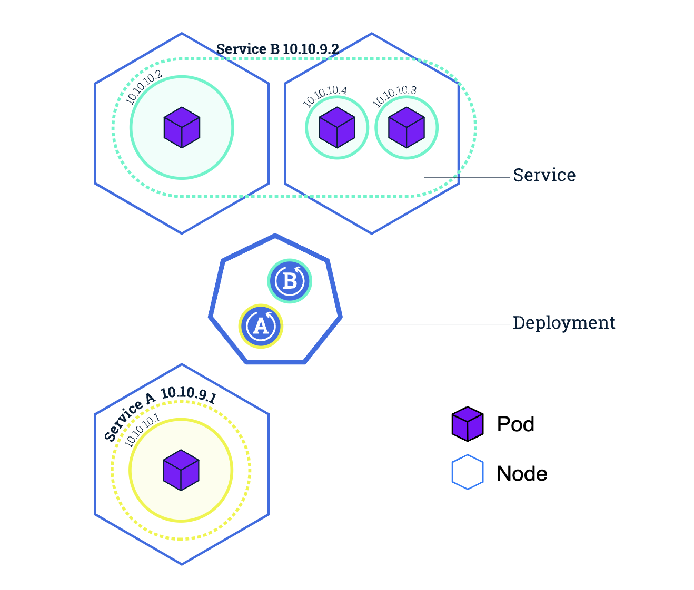  

<br/>

kubernetes Pod 들은 언젠가는 죽게됩니다. 실제 Pod 들은 생명주기를 갖습니다.  

워커 노드가 죽으면, 노드 상에서 동작하는 Pod 들 또한 종료됩니다.  

Kubernetes 에서 service 는 Pod 들에 접근 할 수 있는 정책을 정의하는 추상적 개념입니다.  

- ClusterIP (기본값)  
    - 클러스터 내에서 내부 IP 에 대해 서비스를 노출합니다. 이 방식은 클러스터 내에서만 서비스가 접근될 수 있도록 합니다.
- NodePort  
    - NAT가 이용되는 클러스터 내에서 각각 선택된 노드들의 동일한 포트에 서비스를 노출 시켜줍니다.  
        `<NodeIP>:<NodePort>`를 이용하여 클러스터 외부로부터 서비스가 접근할 수 있도록 해줍니다. ClusterIP 의 상위 집합입니다.
- LoadBalancer  
    - (지원 가능한 경우) 기존 클라우드에서 외부용 로드밸런서를 생성하고 고정된 공인 IP를 할당합니다.  
    NodePort 의 상위 집합입니다.
- ExternalName
    - 이름으로 CNAME 레코드를 반환함으로써 임의의 이름(Spec 에서 externalName 으로 명시)을 이용하여 서비스를 노출시켜줍니다.
    프록시는 사용되지 않습니다. 이 방식은 kube-dns 버전 1.7 이상에서 지원 가능합니다.
    - 외부 서비스를 쿠버네티스 내부에서 호출 하고자 할때 사용할 수 있습니다.

<br/>

앱을 외부에 노출하기.  

아래 명령어를 통해 APP 을 외부에 노출 할 수 있습니다.
현재 Hands on 환경은 LoadBalancer or Ingress 가 사용이 불가능하므로 Nodeport 를 이용하여 TEST 해보도록 하겠습니다.  

expose 옵션 과 create 옵션으로 으로 생성 가능  

deployment가 있는지 확인합니다.
```bash  
root@jakelee:~# kubectl get deployment
NAME             READY   UP-TO-DATE   AVAILABLE   AGE
flask-edu4-app   1/1     1            1           80m
```

서비스가 있는지 확인합니다.
```bash
root@jakelee:~# kubectl get svc
NAME         TYPE        CLUSTER-IP   EXTERNAL-IP   PORT(S)   AGE
kubernetes   ClusterIP   10.43.0.1    <none>        443/TCP   2d19h
```
APP를 노출합니다. 포트는 컨테이너 포트이고 flask 소스에  5000 번으로 설정.  
- 참고 : https://github.com/shclub/edu4/blob/master/app.py

```bash
root@jakelee:~# kubectl expose deployment flask-edu4-app --port 5000
service/flask-edu4-app exposed
```
또는   

Create 옵션으로 생성 방법 
```bash
root@jakelee:~# kubectl create service clusterip flask-edu4-app --tcp=5000
service/flask-edu4-app exposed
```

서비스를 조회해 보면  80번 포트로 접속할 수 있는 서비스가 생성되었습니다.
```bash
root@jakelee:~# kubectl get svc
NAME             TYPE        CLUSTER-IP    EXTERNAL-IP   PORT(S)   AGE
kubernetes       ClusterIP   10.43.0.1     <none>        443/TCP   2d19h
flask-edu4-app   ClusterIP   10.43.119.5   <none>        5000/TCP    3s
```    

위와 명령으로 생성하는 경우, 기본적으로 ClusterIP 로 생성이 됩니다.  

아래 명령을 통해 ClusterIP 를 NodePort 로 변경하도록 하겠습니다.  

```bash
root@jakelee:~# kubectl edit service flask-edu4-app
...
spec:
  clusterIP: 10.43.119.5
  clusterIPs:
  - 10.43.119.5
  internalTrafficPolicy: Cluster
  ipFamilies:
  - IPv4
  ipFamilyPolicy: SingleStack
  ports:
  - port: 80
    protocol: TCP
    targetPort: 80
  selector:
    app: flask-edu4-app
  sessionAffinity: None
  type: ClusterIP  <<<
  ...
  ```    

위와 같이 ClusterIP 부분은 NodePort 로 변경하고 저장을 합니다.
(저장 및 종료,  VI 과 동일함.)  

NodePort 로 변경이 되었는지 확인합니다.  

포트를 명시하지 않으면 아래와 같이 30000 ~ 32767 범위내에서 자동 할당한다.  

```bash
root@jakelee:~# kubectl edit svc flask-edu4-app
service/flask-edu4-app edited
root@jakelee:~# kubectl get svc
NAME             TYPE        CLUSTER-IP    EXTERNAL-IP   PORT(S)        AGE
kubernetes       ClusterIP   10.43.0.1     <none>        443/TCP        2d19h
flask-edu4-app   NodePort    10.43.119.5   <none>        5000:30685/TCP   9m7s
```  

위와 같이 30685 로 Port 할당된 것을 확인 할 수 있습니다.
(해당 Port 할당은 따로 yaml 에서 지정을 안하면 랜덤 Mapping 입니다.)  

수동할당시에는 포트를 명시한다. (chapter4 참고 ) 

<br/>

서비스를 테스트 해봅니다. 아래와 같이 설정.

```bash
curl <본인 VM Public IP>:<할당된 노드 포트 >
```

```bash
root@jakelee:~# curl 210.106.105.165:30685
 Container EDU | POD Working : flask-edu4-app-74788b6479-t6rvt | v=1
```  

컨테이너 IP로도 테스트 할 수 있다. 포트는 컨테이너 포트 사용.
```bash
root@jakelee:~# curl 10.43.30.79:5000
 Container EDU | POD Working : flask-edu4-app-74788b6479-t6rvt | v=1
```  

웹브라우저에서도 테스트 할 수 있다.  

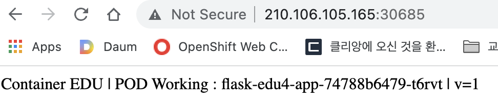  


<br/>

### Scale Out

<br/>

Pod 을 Scale-out 하는 방법을 실습한다.  

- Before  
    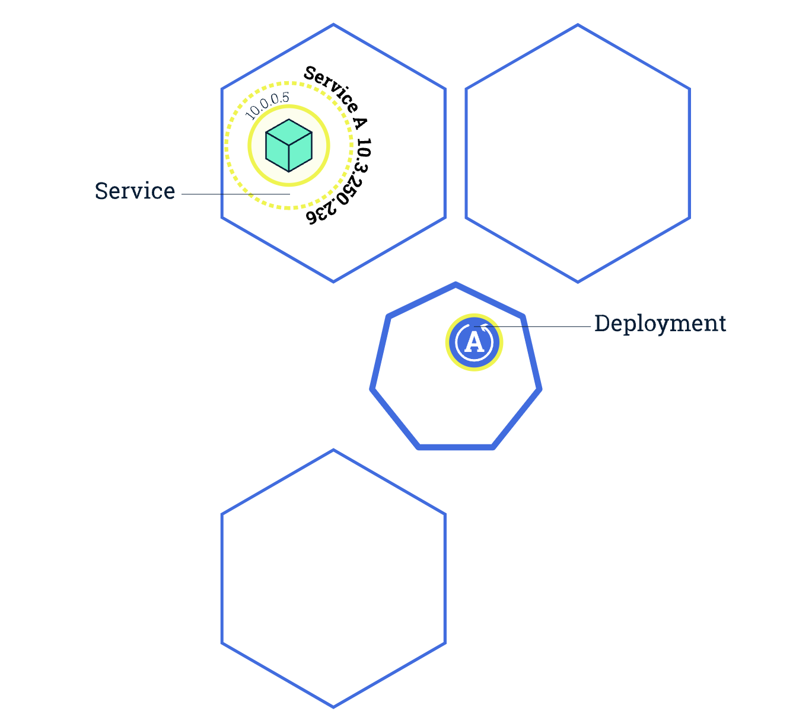  
- After  
    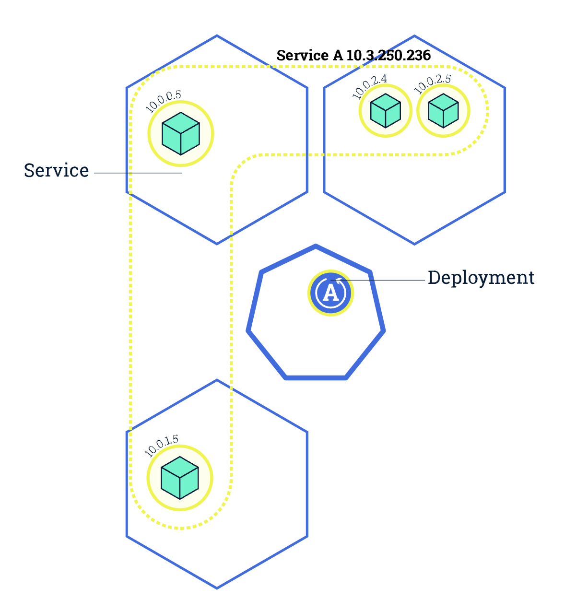 
<br/>

Command 를 이용하여 Scale-out 를 한다.  
기존에 1개의 Pod 으로 실행중이던 APP 을 5개의 Pod 으로 Scale-out 하도록 한다.  

현재 deployment 확인
```bash
root@jakelee:~# kubectl get deployment
NAME             READY   UP-TO-DATE   AVAILABLE   AGE
flask-edu4-app   1/1     1            1           123m
```  
Scale-out 를 한다.
```bash
root@jakelee:~# kubectl scale deployment --replicas=5 flask-edu4-app
deployment.apps/flask-edu4-app scaled
```

Scale-out 된 deployment를 확인한다.
```bash
root@jakelee:~# kubectl get deployment
NAME             READY   UP-TO-DATE   AVAILABLE   AGE
flask-edu4-app   5/5     5            5           123m
```

POD가 5개로 늘어난것을  확인할 수 있고 신규로 4개가 생성되었다.  
```bash
root@jakelee:~# kubectl get po
NAME                              READY   STATUS    RESTARTS   AGE
flask-edu4-app-74788b6479-t6rvt   1/1     Running   0          126m
flask-edu4-app-74788b6479-l59sp   1/1     Running   0          2m30s
flask-edu4-app-74788b6479-4krcs   1/1     Running   0          2m30s
flask-edu4-app-74788b6479-gmvtk   1/1     Running   0          2m30s
flask-edu4-app-74788b6479-g9j8x   1/1     Running   0          2m30s
```

서비스 확인(Round-Robin)이 되는지 아래 명령어를 사용하여 확인한다.  
TEST 환경에 맞게 수정합니다.

```bash
while true; do curl <본인 VM Public IP>:<할당된 노드포트>; done 
```     

아래와 같이 Scale-out 되어 서비스 중인 것을 볼 수 있습니다.

```bash
root@jakelee:~# while true; do curl 210.106.105.165:30685; done
 Container EDU | POD Working : flask-edu4-app-74788b6479-l59sp | v=1
 Container EDU | POD Working : flask-edu4-app-74788b6479-gmvtk | v=1
 Container EDU | POD Working : flask-edu4-app-74788b6479-4krcs | v=1
 Container EDU | POD Working : flask-edu4-app-74788b6479-gmvtk | v=1
 Container EDU | POD Working : flask-edu4-app-74788b6479-gmvtk | v=1
 Container EDU | POD Working : flask-edu4-app-74788b6479-gmvtk | v=1
 Container EDU | POD Working : flask-edu4-app-74788b6479-l59sp | v=1
 Container EDU | POD Working : flask-edu4-app-74788b6479-g9j8x | v=1
 Container EDU | POD Working : flask-edu4-app-74788b6479-4krcs | v=1
 Container EDU | POD Working : flask-edu4-app-74788b6479-t6rvt | v=1
 Container EDU | POD Working : flask-edu4-app-74788b6479-gmvtk | v=1
 Container EDU | POD Working : flask-edu4-app-74788b6479-g9j8x | v=1
```


<br/>

### Update APP

<br/>

Rolling Update / Rollback APP 에 대한 방법을 실습한다. 

https://github.com/shclub/edu4 의 저장소의 file을 update 한다.  

- python app.py의 소스를 Update 합니다.    
    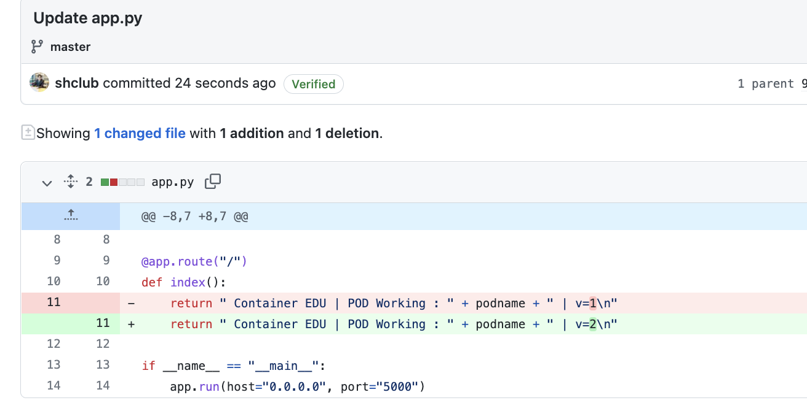  
- Jenkins 의 소스를 Update 합니다. 리포지토리는 edu4로 이미 변경
    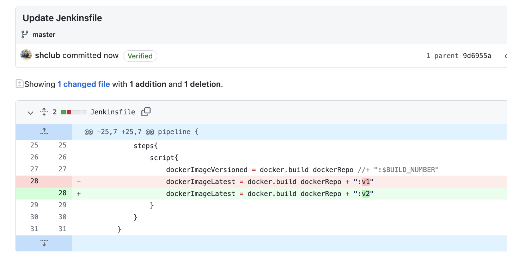 
<br/>

Jenkins 로 빌드 하여 새로운 버전의 도커이미지를 생성합니다.  
v2버전이 생성된것을 확인 할 수 있다.  

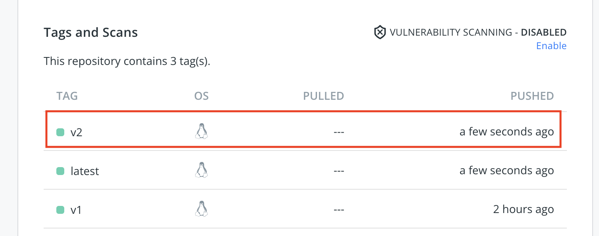

시간 관계상 Push 된 이미지를 사용할 것입니다.

Container Image Tag : shclub/edu4:v2


<br/>

#### Rolling Update

<br/>

아래 명령을 통해 기존에 v1 에서 v2 로 image 를 변경하여 Rolling Update 해보겠습니다.

- 기존정보  

```bash  
root@jakelee:~# kubectl describe deployments flask-edu4-app
Name:                   flask-edu4-app
Namespace:              default
CreationTimestamp:      Mon, 04 Apr 2022 11:01:34 +0900
Labels:                 app=flask-edu4-app
Annotations:            deployment.kubernetes.io/revision: 1
Selector:               app=flask-edu4-app
Replicas:               5 desired | 5 updated | 5 total | 5 available | 0 unavailable
StrategyType:           RollingUpdate
MinReadySeconds:        0
RollingUpdateStrategy:  25% max unavailable, 25% max surge
Pod Template:
  Labels:  app=flask-edu4-app
  Containers:
   edu4:
    Image:        shclub/edu4:v1
    Port:         <none>
    Host Port:    <none>
    Environment:  <none>
    Mounts:       <none>
  Volumes:        <none>
Conditions:
  Type           Status  Reason
  ----           ------  ------
  Progressing    True    NewReplicaSetAvailable
  Available      True    MinimumReplicasAvailable
OldReplicaSets:  <none>
NewReplicaSet:   flask-edu4-app-74788b6479 (5/5 replicas created)
Events:
  Type    Reason             Age                From                   Message
  ----    ------             ----               ----                   -------
  Normal  ScalingReplicaSet  23m (x2 over 80m)  deployment-controller  Scaled up replica set flask-edu4-app-74788b6479 to 5
```

-  이미지를 변경합니다. 켠테이너 이름은 describe 에서 containers 밑에 있는 이름  이고 여기에서는 edu4 이다.   

```bash  
kubectl set image deployments <deployment 이름> <컨테이너이름>=<변경할 이미지>
```

```bash  
root@jakelee:~# kubectl set image deployments flask-edu4-app edu4=shclub/edu4:v2
deployment.apps/flask-edu4-app image updated
```

- Rolling Update 상태 확인
    - 상태 확인
        ```bash  
        root@jakelee:~# kubectl rollout status deployments flask-edu4-app
        Waiting for deployment "flask-edu4-app" rollout to finish: 1 old replicas are pending termination...
        Waiting for deployment "flask-edu4-app" rollout to finish: 1 old replicas are pending termination...
        Waiting for deployment "flask-edu4-app" rollout to finish: 1 old replicas are pending termination...
        deployment "flask-edu4-app" successfully rolled out
        ```
    - 실제 서비스 확인 : v2로 바뀐것을 확인 할 수 있다.
        ```bash  
        root@jakelee:~#  while true; do curl 210.106.105.165:30685; done
        Container EDU | POD Working : flask-edu4-app-757bcc87db-ft9k9 | v=2
        Container EDU | POD Working : flask-edu4-app-757bcc87db-sns6z | v=2
        Container EDU | POD Working : flask-edu4-app-757bcc87db-l69b8 | v=2
        Container EDU | POD Working : flask-edu4-app-757bcc87db-x9fvn | v=2
        Container EDU | POD Working : flask-edu4-app-757bcc87db-l69b8 | v=2
        Container EDU | POD Working : flask-edu4-app-757bcc87db-ft9k9 | v=2
        Container EDU | POD Working : flask-edu4-app-757bcc87db-sns6z | v=2
        ```

- 변경 확인

```bash  
root@jakelee:~# kubectl describe deployments flask-edu4-app
Name:                   flask-edu4-app
Namespace:              default
CreationTimestamp:      Mon, 04 Apr 2022 11:01:34 +0900
Labels:                 app=flask-edu4-app
Annotations:            deployment.kubernetes.io/revision: 2
Selector:               app=flask-edu4-app
Replicas:               5 desired | 5 updated | 5 total | 5 available | 0 unavailable
StrategyType:           RollingUpdate
MinReadySeconds:        0
RollingUpdateStrategy:  25% max unavailable, 25% max surge
Pod Template:
  Labels:  app=flask-edu4-app
  Containers:
   edu4:
    Image:        shclub/edu4:v2
    Port:         <none>
    Host Port:    <none>
    Environment:  <none>
    Mounts:       <none>
  Volumes:        <none>
Conditions:
  Type           Status  Reason
  ----           ------  ------
  Available      True    MinimumReplicasAvailable
  Progressing    True    NewReplicaSetAvailable
OldReplicaSets:  <none>
NewReplicaSet:   flask-edu4-app-757bcc87db (5/5 replicas created)
Events:
  Type    Reason             Age                 From                   Message
  ----    ------             ----                ----                   -------
  Normal  ScalingReplicaSet  34m (x2 over 91m)   deployment-controller  Scaled up replica set flask-edu4-app-74788b6479 to 5
  Normal  ScalingReplicaSet  7m12s               deployment-controller  Scaled up replica set flask-edu4-app-757bcc87db to 2
  Normal  ScalingReplicaSet  7m12s               deployment-controller  Scaled down replica set flask-edu4-app-74788b6479 to 4
  Normal  ScalingReplicaSet  7m11s               deployment-controller  Scaled up replica set flask-edu4-app-757bcc87db to 3
  Normal  ScalingReplicaSet  7m2s                deployment-controller  Scaled down replica set flask-edu4-app-74788b6479 to 3
  Normal  ScalingReplicaSet  7m2s                deployment-controller  Scaled up replica set flask-edu4-app-757bcc87db to 4
  Normal  ScalingReplicaSet  7m2s (x2 over 78m)  deployment-controller  Scaled down replica set flask-edu4-app-74788b6479 to 1
  Normal  ScalingReplicaSet  7m2s                deployment-controller  Scaled up replica set flask-edu4-app-757bcc87db to 5
  Normal  ScalingReplicaSet  7m1s                deployment-controller  Scaled down replica set flask-edu4-app-74788b6479 to 0
  ```


<br/>

#### Rollback

<br/>

Rollback 은 배포된 APP 에 문제가 있을 때, 다시 이전 이미지로 배포 해야 되는 경우 사용하는 방법입니다.   
(꼭 문제가 있어야 사용이 가능한 것은 아님, 주 목적은 이전 버전으로 Rollback 하기 위함입니다.)


- Rollback 진행
    - 현재 상태 확인 : 2개의 Revision 이  있고 2번이 현재 버전이다.
        ```bash  
        root@jakelee:~# kubectl rollout history deployment flask-edu4-app
        deployment.apps/flask-edu4-app
        REVISION  CHANGE-CAUSE
        1         <none>
        2         <none>
        ```
    - Rollback 진행 : 바로 이전 버전으로 진행이 된다.
        ```bash  
        root@jakelee:~# kubectl rollout undo deployment flask-edu4-app
        deployment.apps/flask-edu4-app rolled back
        ```
    - Rollback 확인 : 이미지는 shclub/edu4:v1 으로 변경이 되면 Revision은 3으로 올라간다.
        ```bash  
        root@jakelee:~# kubectl describe deployments.apps flask-edu4-app
        Name:                   flask-edu4-app
        Namespace:              default
        CreationTimestamp:      Mon, 04 Apr 2022 11:01:34 +0900
        Labels:                 app=flask-edu4-app
        Annotations:            deployment.kubernetes.io/revision: 3
        Selector:               app=flask-edu4-app
        Replicas:               5 desired | 5 updated | 5 total | 5 available | 0 unavailable
        StrategyType:           RollingUpdate
        MinReadySeconds:        0
        RollingUpdateStrategy:  25% max unavailable, 25% max surge
        Pod Template:
        Labels:  app=flask-edu4-app
        Containers:
        edu4:
            Image:        shclub/edu4:v1
            Port:         <none>
            Host Port:    <none>
            Environment:  <none>
            Mounts:       <none>
        Volumes:        <none>
        Conditions:
        Type           Status  Reason
        ----           ------  ------
        Available      True    MinimumReplicasAvailable
        Progressing    True    NewReplicaSetAvailable
        OldReplicaSets:  <none>
        NewReplicaSet:   flask-edu4-app-74788b6479 (5/5 replicas created)
        Events:
        Type    Reason             Age                From                   Message
        ----    ------             ----               ----                   -------
        Normal  ScalingReplicaSet  14m                deployment-controller  Scaled down replica set flask-edu4-app-74788b6479 to 4
        Normal  ScalingReplicaSet  14m                deployment-controller  Scaled up replica set flask-edu4-app-757bcc87db to 2
        Normal  ScalingReplicaSet  14m                deployment-controller  Scaled up replica set flask-edu4-app-757bcc87db to 3
        Normal  ScalingReplicaSet  13m                deployment-controller  Scaled up replica set flask-edu4-app-757bcc87db to 5
        Normal  ScalingReplicaSet  13m                deployment-controller  Scaled down replica set flask-edu4-app-74788b6479 to 3
        Normal  ScalingReplicaSet  13m                deployment-controller  Scaled up replica set flask-edu4-app-757bcc87db to 4
        Normal  ScalingReplicaSet  13m (x2 over 85m)  deployment-controller  Scaled down replica set flask-edu4-app-74788b6479 to 1
        Normal  ScalingReplicaSet  13m                deployment-controller  Scaled down replica set flask-edu4-app-74788b6479 to 0
        Normal  ScalingReplicaSet  14s                deployment-controller  Scaled up replica set flask-edu4-app-74788b6479 to 3
        Normal  ScalingReplicaSet  14s                deployment-controller  Scaled down replica set flask-edu4-app-757bcc87db to 4
        Normal  ScalingReplicaSet  14s                deployment-controller  Scaled up replica set flask-edu4-app-74788b6479 to 2
        Normal  ScalingReplicaSet  13s                deployment-controller  Scaled down replica set flask-edu4-app-757bcc87db to 3
        Normal  ScalingReplicaSet  13s                deployment-controller  Scaled up replica set flask-edu4-app-74788b6479 to 4
        Normal  ScalingReplicaSet  13s                deployment-controller  Scaled down replica set flask-edu4-app-757bcc87db to 2
        Normal  ScalingReplicaSet  13s (x3 over 98m)  deployment-controller  Scaled up replica set flask-edu4-app-74788b6479 to 5
        Normal  ScalingReplicaSet  12s                deployment-controller  Scaled down replica set flask-edu4-app-757bcc87db to 1
        Normal  ScalingReplicaSet  10s                deployment-controller  Scaled down replica set flask-edu4-app-757bcc87db to 0
        ```

    - Rollback 완료 : v1으로 서비스가 변경이 되었다.
        ```bash  
        root@jakelee:~# while true; do curl 210.106.105.165:30685; done
        Container EDU | POD Working : flask-edu4-app-74788b6479-qgs2j | v=1
        Container EDU | POD Working : flask-edu4-app-74788b6479-qgs2j | v=1
        Container EDU | POD Working : flask-edu4-app-74788b6479-qgs2j | v=1
        Container EDU | POD Working : flask-edu4-app-74788b6479-qgs2j | v=1
        Container EDU | POD Working : flask-edu4-app-74788b6479-f2kcp | v=1
        Container EDU | POD Working : flask-edu4-app-74788b6479-f2kcp | v=1
        Container EDU | POD Working : flask-edu4-app-74788b6479-l7gkx | v=1
        Container EDU | POD Working : flask-edu4-app-74788b6479-l7gkx | v=1
        ```

    - 특정 revision 으로 변경하는 방법
        ```bash      
        kubectl rollout undo deployment flask-edu4-app --to-revision=1
        ```
        
<br/>

### Ingress

<br/>


Ingress는 도메인으로 서비스를 접속하기위해 필요한 오브젝트입니다.

하나의 클러스터에서 여러 가지 서비스를 운영한다면 외부 연결을 어떻게 할까요? NodePort를 이용하면 서비스 개수만큼 포트를 오픈하고 사용자에게 어떤 포트인지 알려줘야 합니다. 그럴순 없죠!

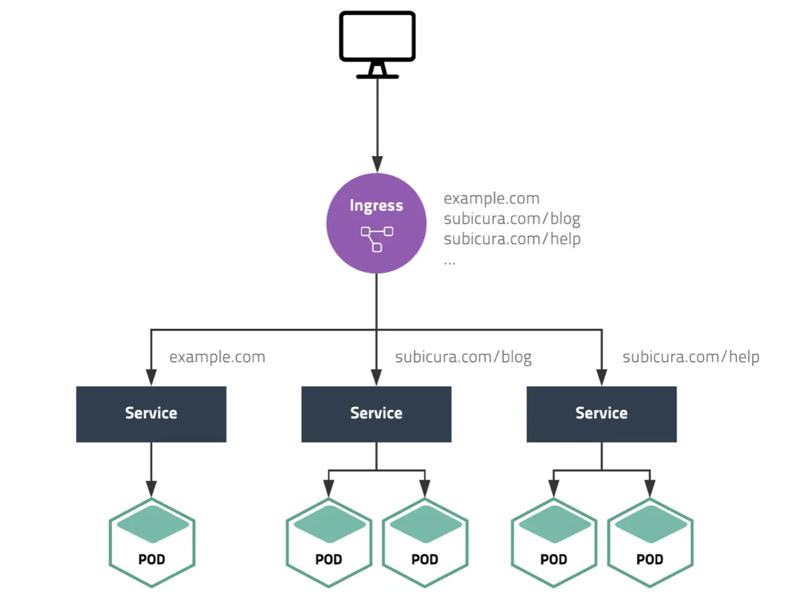  

<br/>

위 샘플은 example.com, subicura.com/blog, subicura.com/help 주소로 서로 다른 서비스에 접근하는 모습입니다.   

80(http) 또는 443(https) 포트로 여러 개의 서비스를 연결해야 하는데 이럴 때 Ingress를 사용합니다.

- wildcard DNS
ip를 기반으로 도메인을 쉽게 사용할 수 있습니다. 실습에서 사용합니다.

    - sslip.io
    - xip.io
    - nip.io

    ```bash
    10.0.0.1.nip.io maps to 10.0.0.1
    192-168-1-250.nip.io maps to 192.168.1.250
    app.10.8.0.1.nip.io maps to 10.8.0.1
    app-37-247-48-68.nip.io maps to 37.247.48.68
    customer1.app.10.0.0.1.nip.io maps to 10.0.0.1
    customer2-app-127-0-0-1.nip.io maps to 127.0.0.1
    ```

Ingress Nginx 를 설치한다.  

```bash      
root@jakelee:~# kubectl apply -f https://raw.githubusercontent.com/kubernetes/ingress-nginx/controller-v1.0.0/deploy/static/provider/baremetal/deploy.yaml
```

설치가 완료되면 ingress-nginx namespace가 생기고 서비스는 NodePort로 아래와 같이 자동으로 설정이 되어 있다.  

- http : 31996 , https : 31023

```bash      
root@jakelee:~# kubectl get all -n ingress-nginx
NAME                                           READY   STATUS      RESTARTS   AGE
pod/ingress-nginx-admission-create--1-w9z7x    0/1     Completed   0          11m
pod/ingress-nginx-admission-patch--1-v9v66     0/1     Completed   1          11m
pod/ingress-nginx-controller-8cf5559f8-nc96z   1/1     Running     0          11m

NAME                                         TYPE        CLUSTER-IP     EXTERNAL-IP   PORT(S)                      AGE
service/ingress-nginx-controller-admission   ClusterIP   10.43.52.204   <none>        443/TCP                      11m
service/ingress-nginx-controller             NodePort    10.43.27.14    <none>        80:31996/TCP,443:31023/TCP   11m

NAME                                       READY   UP-TO-DATE   AVAILABLE   AGE
deployment.apps/ingress-nginx-controller   1/1     1            1           11m

NAME                                                 DESIRED   CURRENT   READY   AGE
replicaset.apps/ingress-nginx-controller-8cf5559f8   1         1         1       11m

NAME                                       COMPLETIONS   DURATION   AGE
job.batch/ingress-nginx-admission-create   1/1           6s         11m
job.batch/ingress-nginx-admission-patch    1/1           7s         11m
```

서비스와 포트를 확인하고 정상 작동하는지 확인한다.
```bash      
root@jakelee:~# kubectl get svc -n ingress-nginx
NAME                                 TYPE        CLUSTER-IP     EXTERNAL-IP   PORT(S)                      AGE
ingress-nginx-controller-admission   ClusterIP   10.43.52.204   <none>        443/TCP                      147m
ingress-nginx-controller             NodePort    10.43.27.14    <none>        80:31996/TCP,443:31023/TCP   147m

root@jakelee:~# curl -I http://127.0.0.1:31996/healthz
HTTP/1.1 200 OK
Date: Mon, 04 Apr 2022 09:07:43 GMT
Content-Type: text/html
Content-Length: 0
Connection: keep-alive

# 본인 VM Public IP 로도 확인 가능하다.
root@jakelee:~# curl -I http://210.106.105.165:31996/healthz
HTTP/1.1 200 OK
Date: Mon, 04 Apr 2022 09:14:52 GMT
Content-Type: text/html
Content-Length: 0
Connection: keep-alive     

# 본인 VM 도메인 으로도  확인 가능하다.
root@jakelee:~# curl -I http://210.106.105.165.nip.io:31996/healthz
HTTP/1.1 200 OK
Date: Mon, 04 Apr 2022 09:46:17 GMT
Content-Type: text/html
Content-Length: 0
Connection: keep-alive
``` 

서비스를 도메인으로 접속하기 위해서 ingress를 설정한다.     
해당 화일은 https://github.com/shclub/edu4/blob/master/ingress_sample1.yaml 에서 다운 받는다.  

backend.service.port.number는 해당 서비스의 컨테이너 포트를 명시한다.  


```yaml
apiVersion: networking.k8s.io/v1
kind: Ingress
metadata:
  name: nginx-ingress
  annotations:
    kubernetes.io/ingress.class: "nginx"
    ingress.kubernetes.io/rewrite-target: /
    ingressclass.kubernetes.io/is-default-class: "true"
spec:
  rules:
  - host: 210.106.105.165.nip.io
    http:
      paths:
      - path: /
        pathType: Prefix
        backend:
          service:
            name: flask-edu4-app
            port:
              number: 5000
```

```bash
root@jakelee:~# kubectl apply -f ingress-sample1.yaml
ingress.networking.k8s.io/nginx-ingress created
root@jakelee:~# kubectl get ing
NAME            CLASS   HOSTS                    ADDRESS        PORTS   AGE
nginx-ingress   nginx   210.106.105.165.nip.io   172.27.0.134   80      12m
```

ingress를 통하여 서비스를 접속하여 봅니다.

```bash
root@jakelee:~# curl http://210.106.105.165.nip.io:31996/
 Container EDU | POD Working : flask-edu4-app-74788b6479-rlght | v=1
```

웹으로도 서비스를 접속하여 봅니다.  

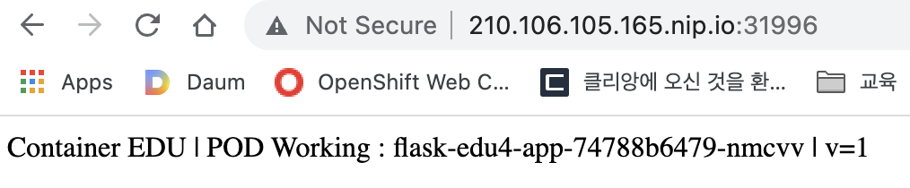  

<br/>

ingressclass를 ingress 마다 넣어주는 불편은  아래와 같이 변경하면 ingress yaml 생성시 annotation 에서 삭제 가능하다.

```bash
root@jakelee:~# kubectl get ingressclasses --namespace=ingress-nginx
NAME    CONTROLLER             PARAMETERS   AGE
nginx   k8s.io/ingress-nginx   <none>       3h35m
root@jakelee:~# kubectl edit ingressclasses nginx --namespace=ingress-nginx
```

아래와 같이 ingressclass를 추가한다.  

```bash
metadata:
  annotations:
    ingressclass.kubernetes.io/is-default-class: "true"  <<추가
```

<br/>

<br/>

### Ingress - Traefik

<br/>


k3s 에는 default 로 Traefik 이라는 Ingress Controller가 설치가 되어 있다.  

Traefik을 사용하여 80/443 포트로 접속하는 방법에 대해서 실습을 한다.   

traefik pod를 확인한다.  

```bash
root@jakelee:~# kubectl get po -n kube-system
NAME                                      READY   STATUS      RESTARTS     AGE
local-path-provisioner-84bb864455-pkktg   1/1     Running     0            9d
helm-install-traefik-crd--1-2l5b9         0/1     Completed   0            9d
svclb-traefik-xst65                       2/2     Running     1 (9d ago)   9d
coredns-96cc4f57d-f87gg                   1/1     Running     0            9d
metrics-server-ff9dbcb6c-h9tv2            1/1     Running     0            9d
helm-install-traefik--1-5g9lq             0/1     Completed   0            36m
traefik-747c4ffbd6-q6hpd                  1/1     Running     0            36m
```  

traefik service를 확인한다.  

```bash
root@jakelee:~# kubectl get svc traefik -n kube-system
NAME      TYPE           CLUSTER-IP      EXTERNAL-IP    PORT(S)                      AGE
traefik   LoadBalancer   10.43.167.187   172.27.0.134   80:30622/TCP,443:31534/TCP   9d
```  

Ingress를 생성하기 전에 inspekt라는 pod를 inspect하는 서비스를 생성한다.  

```bash
root@jakelee:~# kubectl apply -k github.com/shclub/inspekt
```  

Pod와 서비스가 생성된 것을 확인한다.  

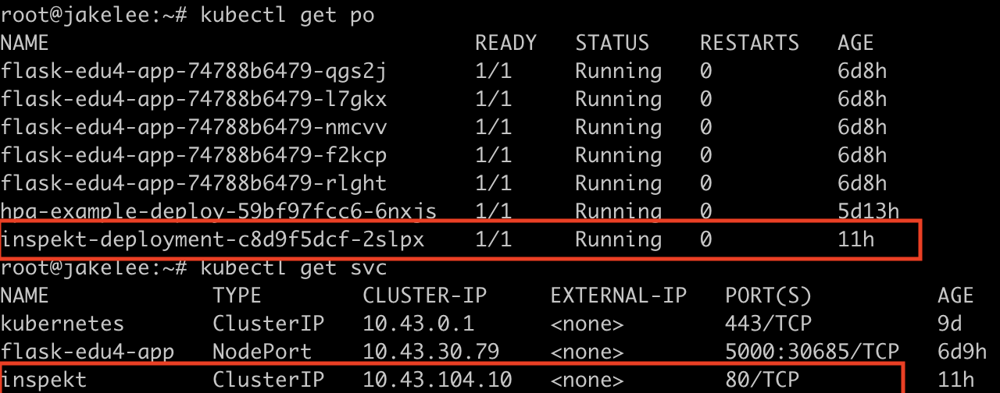  

ingress를 생성하기 위해 vi 에디터로 inspekt_ingress.yaml 화일을 생성한다.    
- 여기에서도 다운 가능 : https://github.com/shclub/edu4/blob/master/inspekt_ingress.yaml

아래에 kubernetes.io/ingress.class: traefik 의미는 traefik의 ingress controller를 사용하겠다는 의미이다.  

서비스 포트는 컨테이너 포트이다.  

```bash
apiVersion: networking.k8s.io/v1
kind: Ingress
metadata:
  name: inspekt-traefik-ingress
  annotations:
    ingress.kubernetes.io/rewrite-target: "/"
    kubernetes.io/ingress.class: traefik
spec:
  rules:
  - host: inspekt.210.106.105.165.sslip.io
    http:
      paths:
      - path: /
        pathType: Prefix
        backend:
          service:
            name: inspekt
            port:
              number: 80

```  

해당 화일을 적용하고 ingress가 신규로 생성된 것을 확인 할 수 있다.  

```bash
root@jakelee:~# kubectl apply -f inspekt_ingress.yaml
ingress.networking.k8s.io/inspekt-traefik-ingress created
root@jakelee:~# kubectl get ing
NAME                      CLASS    HOSTS                              ADDRESS        PORTS   AGE
flask-edu4-app-v1         nginx    210.106.105.165.nip.io             172.27.0.134   80      3d12h
inspekt-traefik-ingress   <none>   inspekt.210.106.105.165.sslip.io   172.27.0.134   80      5s
```  

hosts 의 값을 복사하여 web browser 에서 실행한다.  
80번 포트로 접속이 된것을 확인 할 수 있다.  

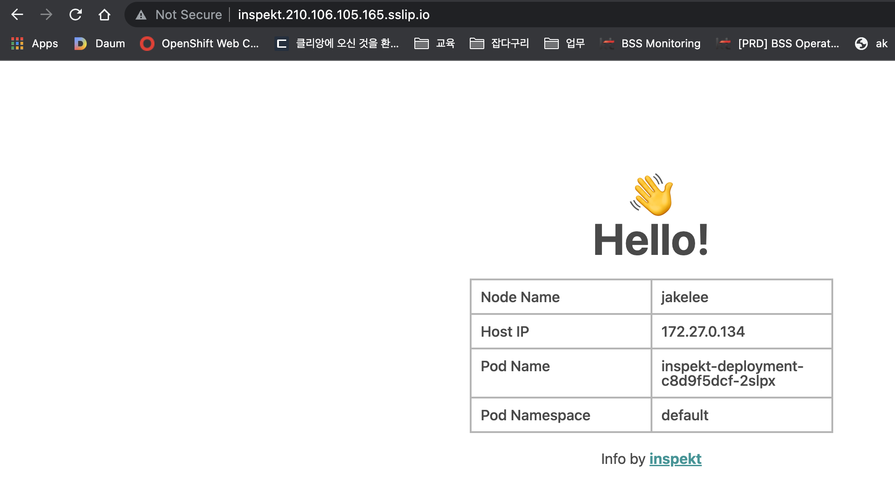  

<br/>

http (80) 포트인 경우는 위와 같이 가능하지만 https (443) 인 경우는 서비스 마다 인증서를 만들어 추가 해야한다.  

우리는 교육용이기 때문에 ssl을 적용하지 않고 테스트를 진행힌다.  

/var/lib/rancher/k3s/server/manifests/traefik.yaml 화일을 수정한다.   

```bash
root@jakelee:~# vi /var/lib/rancher/k3s/server/manifests/traefik.yaml
```    

valuesContent 밑에 2개의 라인을 추가한다. ssl verify를 skip 한다는 의미이다.  

```bash
valuesContent: |-
  globalArguments:                               << 추가
  - "--serversTransport.insecureSkipVerify=true" << 추가
```  

이제 https(443) 포트 케이스는 ingress로 생성할 준비가 되어 있다.    

ingress를 생성하기 위해 vi 에디터로 argocd_ingress.yaml 화일을 생성한다.    
- 여기에서도 다운 가능 : https://github.com/shclub/edu4/blob/master/argocd_ingress.yaml

argocd는 4주차에 설치 실습이 있어 4주차 설치 이후 아래 내용을 따라 하면 된다.    

argocd 서비스를 확인힌다.  

```bash
root@jakelee:~# kubectl get svc -n argocd
NAME                                      TYPE        CLUSTER-IP      EXTERNAL-IP   PORT(S)                      AGE
argocd-applicationset-controller          ClusterIP   10.43.26.65     <none>        7000/TCP                     9d
argocd-dex-server                         ClusterIP   10.43.239.221   <none>        5556/TCP,5557/TCP,5558/TCP   9d
argocd-metrics                            ClusterIP   10.43.251.44    <none>        8082/TCP                     9d
argocd-notifications-controller-metrics   ClusterIP   10.43.214.197   <none>        9001/TCP                     9d
argocd-redis                              ClusterIP   10.43.12.131    <none>        6379/TCP                     9d
argocd-repo-server                        ClusterIP   10.43.132.197   <none>        8081/TCP,8084/TCP            9d
argocd-server-metrics                     ClusterIP   10.43.200.82    <none>        8083/TCP                     9d
argocd-server                             NodePort    10.43.247.167   <none>        80:30000/TCP,443:30001/TCP   9d
```

우리가 ingress 설정을 할 서비스는 argocd-server 이다.


```bash
apiVersion: networking.k8s.io/v1
kind: Ingress
metadata:
  name: argocd-ingress
  annotations:
    kubernetes.io/ingress.class: traefik
    ingress.kubernetes.io/ssl-redirect: "true"
    ingress.kubernetes.io/force-ssl-redirect: "true"
    ingress.kubernetes.io/ssl-passthrough: "true"
spec:
  rules:
  - host: argocd.210.106.105.165.sslip.io
    http:
      paths:
      - path: /
        pathType: Prefix
        backend:
          service:
            name: argocd-server 
            port:
              number: 80 
```  

argocd namespace에 ingress를 적용하고 ingress를 확인한다.  

```bash
oot@jakelee:~# kubectl apply -f argocd_ingress.yaml -n argocd
ingress.networking.k8s.io/argocd-ingress unchanged
root@jakelee:~# kubectl get ing -n argocd
NAME             CLASS    HOSTS                             ADDRESS        PORTS   AGE
argocd-ingress   <none>   argocd.210.106.105.165.sslip.io   172.27.0.134   80      65m
```  

hosts 의 값을 복사하여 web browser 에서 실행한다.  
https (443) 로 접속이 된것을 확인 할 수 있다.  

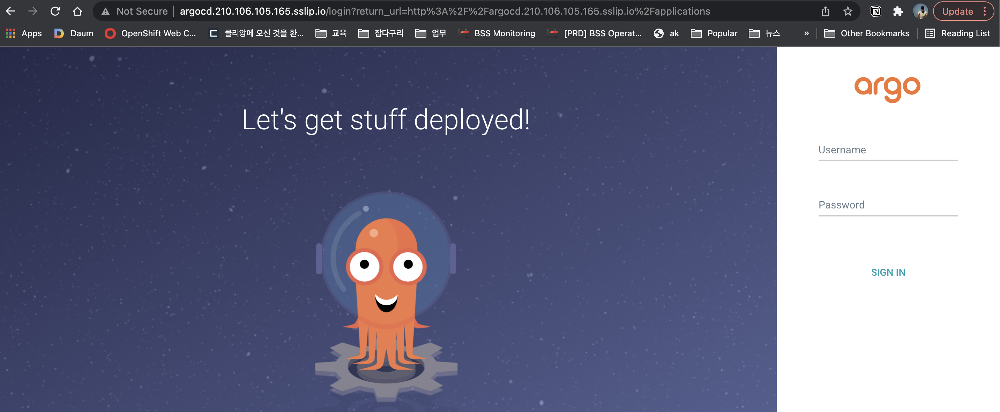  

<br/>

Too many redirect 오류가 발생하거나 로그인이 안되는 경우는 argocd에서 직접
인증서를 처리하려고 하기 때문에 에러가 발생한다.   
deployment에 insecure 옵션을 추가 하면 에러가 발생하지 않는다.  

```bash
root@jakelee:~# kubectl get deploy -n argocd
NAME                               READY   UP-TO-DATE   AVAILABLE   AGE
argocd-redis                       1/1     1            1           9d
argocd-applicationset-controller   1/1     1            1           9d
argocd-notifications-controller    1/1     1            1           9d
argocd-dex-server                  1/1     1            1           9d
argocd-repo-server                 1/1     1            1           9d
inspekt-deployment                 1/1     1            1           13h
argocd-server                      1/1     1            1           9d
root@jakelee:~# kubectl edit deploy argocd-server  -n argocd
```  

command 의 argocd-server 밑에 -- insecure를 추가하고 저장하고 나온다.  

argocd-server pod가 자동으로 재 실행 된다.  

```bash
      containers:
      - command:
        - argocd-server
        - --insecure  << 추가
        env:
```  

이제 웹에서 다시 로그인을 수행한다.  

<br/>

### Horizontal Pod Autoscaler (hpa)

<br/>


이 실습을 진행하기 위해서는 terminal이 2개 이상 열려 있어야 하며 metric server 가 설치가 되어야 합니다.

Metric 서버는 api를 통해서 컨테이너 CPU 및 메모리 사용량과 같은 리소스 사용량 메트릭을 제공하는데요, hpa는 이 api를 호출해서 Metric 서버에서 제공해주는 리소스 사용량을 기준으로 scaling 여부를 판단합니다.  

k3s는 metric server가 설치가 이미되어 있습니다.  

설치 방법 
-  Metric-server github에서 제공하는 config 파일을 이용해 간단하게 설치할 수 있습니다. 필요하다면 파일을 내려받은 뒤 config 파일을 수정하고 배포하면 됩니다.
    ```bash
    kubectl apply -f https://github.com/kubernetes-sigs/metrics-server/releases/download/v0.4.1/components.yaml
    ```

<br/>

예제 참고 : https://docs.aws.amazon.com/ko_kr/eks/latest/userguide/horizontal-pod-autoscaler.html

<br/>

현재 Node의 CPU 사용률을 확인합니다.    
```bash
root@jakelee:~# kubectl top nodes
NAME      CPU(cores)   CPU%   MEMORY(bytes)   MEMORY%
jakelee   488m         6%     8274Mi          51%
```
테스트용 php 소스 이미지를 배포합니다.  이 Apache 웹 서버 파드에는 500 millicpu CPU 제한이 지정되며 포트 80에서 제공됩니다.   
현재 서버는 CPU : 8core   
- requests : 200m ( 초기 설정 )
- limits : 500m (제한 )

```yaml
apiVersion: apps/v1
kind: Deployment
metadata:
  name: php-apache
spec:
  selector:
    matchLabels:
      run: php-apache
  replicas: 1
  template:
    metadata:
      labels:
        run: php-apache
    spec:
      containers:
      - name: php-apache
        image: k8s.gcr.io/hpa-example
        ports:
        - containerPort: 80
        resources:
          limits:
            cpu: 500m
          requests:
            cpu: 200m
---
apiVersion: v1
kind: Service
metadata:
  name: php-apache
  labels:
    run: php-apache
spec:
  ports:
  - port: 80
  selector:
    run: php-apache
```

배포시작.

```bash
root@jakelee:~# kubectl apply -f https://k8s.io/examples/application/php-apache.yaml
deployment.apps/php-apache created
service/php-apache created
```

Deployment와 service가 생성이 되었고 php-apache 배포를 위해 Horizontal Pod Autoscaler 리소스를 생성합니다.

이 명령을 통해 최소 1개에서 최대 10개의 POD가 배포에 대해 10퍼센트의 CPU 사용률을 달성하려는 자동 조정기가 생성됩니다.   
평균 CPU 로드가 10퍼센트 이하인 경우 Autoscaler는  Pod 의 수를 최소 1개로 줄이려고 합니다.   
로드가 50퍼센트보다 큰 경우 포드의 수를 최대 10개로 늘이려고 합니다.  

우리는 빠른 테스트를 위해 10% 로 설정하고 테스트를 한다.  
터미널 창에서 아래 명령어를 실행한다.  

```bash
root@jakelee:~# kubectl autoscale deployment php-apache --cpu-percent=10 --min=1 --max=10
horizontalpodautoscaler.autoscaling/php-apache autoscaled
root@jakelee:~# kubectl get hpa php-apache
NAME         REFERENCE               TARGETS         MINPODS   MAXPODS   REPLICAS   AGE
php-apache   Deployment/php-apache   <unknown>/10%   1         10        0          11s
```

실시간으로 hpa 상태를 모니터링 한다. 초기에는  Replica 가 minumum 1 로 설정됩니다.

```bash
root@jakelee:~# kubectl get hpa php-apache -w
NAME         REFERENCE               TARGETS   MINPODS   MAXPODS   REPLICAS   AGE
php-apache   Deployment/php-apache   0%/10%    1         10        1          15s
```

<br/>

새로운 터미널에서 아래와 같이 부하를 줍니다.   

```bash
root@jakelee:~# kubectl run -i  --tty load-generator      --rm --image=busybox --restart=Never -- /bin/sh -c "while sleep 0.01; do wget -q -O- http://php-apache; done"
```  

아래에 ok가 나오면 부하가 들어간다는 의미.  

```bash
If you don't see a command prompt, try pressing enter.
OK!OK!OK!OK!OK!OK!OK!OK!OK!OK!OK!OK!OK!OK!OK!OK!OK!OK!OK!OK!OK!OK!OK!OK!OK!OK!OK!OK!OK!OK!OK!OK!OK!OK!OK!OK!OK!OK!OK!OK!OK!OK!OK!OK!OK!OK!OK!OK!
```

이전 터미널에서 계속 적으로 모니터링 합니다. 부하에 따라 Replica 가 증가하고 최대값인 10으로 증가 된것을 확인 할수 있습니다.  

```bash
root@jakelee:~# kubectl get hpa php-apache -w
NAME         REFERENCE               TARGETS   MINPODS   MAXPODS   REPLICAS   AGE
php-apache   Deployment/php-apache   0%/10%    1         10        1          15s
php-apache   Deployment/php-apache   141%/10%   1         10        1          60s
php-apache   Deployment/php-apache   253%/10%   1         10        4          75s
php-apache   Deployment/php-apache   236%/10%   1         10        8          90s
```

부하를 주는 화면에서 ctrl+c 를 눌러 부하를 중단합니다.  
최소값으로 돌아오는데는 5분 이상이 소요가 됩니다.   

```bash
root@jakelee:~# kubectl get hpa php-apache -w
NAME         REFERENCE               TARGETS   MINPODS   MAXPODS   REPLICAS   AGE
php-apache   Deployment/php-apache   0%/10%    1         10        1          15s
php-apache   Deployment/php-apache   141%/10%   1         10        1          60s
php-apache   Deployment/php-apache   253%/10%   1         10        4          75s
php-apache   Deployment/php-apache   236%/10%   1         10        8          90s
php-apache   Deployment/php-apache   97%/10%    1         10        10         105s
php-apache   Deployment/php-apache   44%/10%    1         10        10         2m
php-apache   Deployment/php-apache   39%/10%    1         10        10         2m15s
php-apache   Deployment/php-apache   18%/10%    1         10        10         2m30s
php-apache   Deployment/php-apache   2%/10%     1         10        10         2m45s
php-apache   Deployment/php-apache   0%/10%     1         10        10         3m
php-apache   Deployment/php-apache   0%/10%     1         10        10         7m31s
php-apache   Deployment/php-apache   0%/10%     1         10        2          7m46s
php-apache   Deployment/php-apache   0%/10%     1         10        1          8m1s
```

테스트가 완료 되면 리소스를 삭제합니다.     

```bash
root@jakelee:~# kubectl delete deployment.apps/php-apache service/php-apache horizontalpodautoscaler.autoscaling/php-apache
deployment.apps "php-apache" deleted
service "php-apache" deleted
horizontalpodautoscaler.autoscaling "php-apache" deleted
```


<br/>

### 참고 자료

<br/>

목록 - blog
<br/>

- 커피고래 : https://coffeewhale.com/categories/#kubernetes

- 60살까지 개발자로 살기 : https://jerryljh.tistory.com/category/%EC%BF%A0%EB%B2%84%EB%84%A4%ED%8B%B0%EC%8A%A4%20%EA%B5%90%EC%9C%A1

- 민현기 : https://medium.com/dtevangelist
- subicura : https://subicura.com/k8s/
- wonizz : https://blog.wonizz.tk/
- wooody92 블로그 : https://wooody92.github.io/categories/#
- 아리수 : https://arisu1000.tistory.com/
- chhanz : https://chhanz.github.io/
- devops story : https://cwal.tistory.com/21
- microk8s : https://sarc.io/index.php/cloud/2197-microk8s
- alice : https://m.blog.naver.com/PostList.naver?blogId=alice_k106
- d4v1d : https://velog.io/@rhee519
<br/>

목록 - youtube
<br/>

- 악분일상   
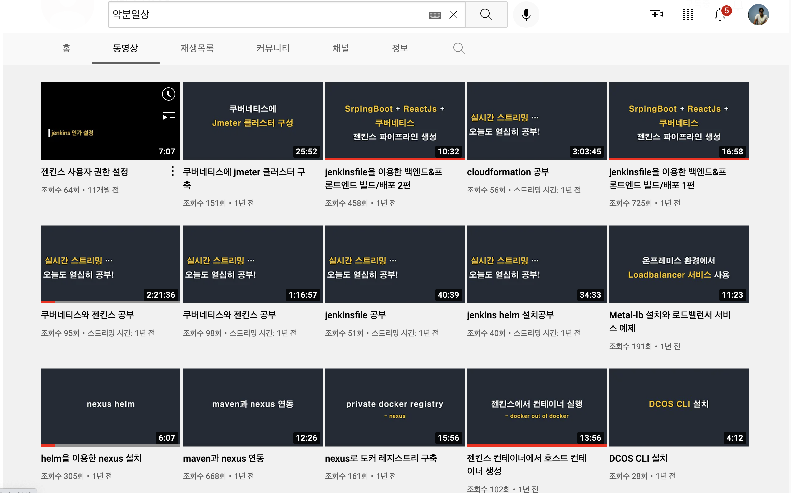  
- 인프런 초급 : https://youtu.be/qLlo7MAJvT0
<br/>