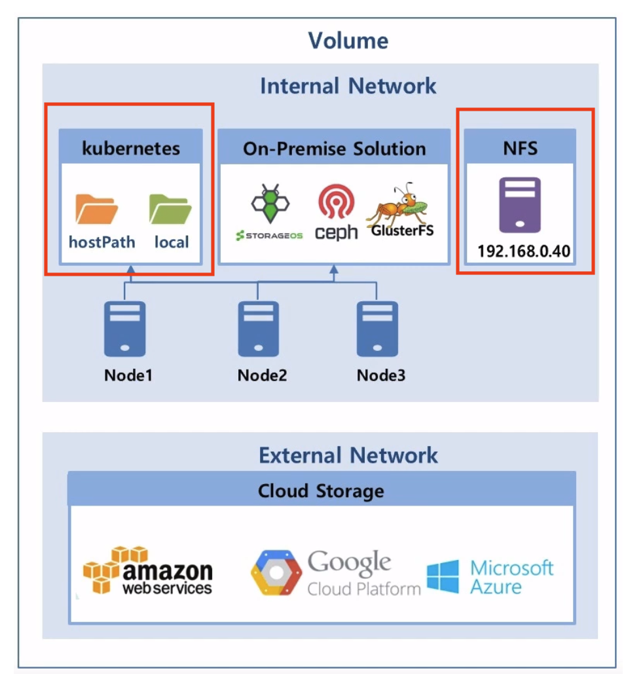
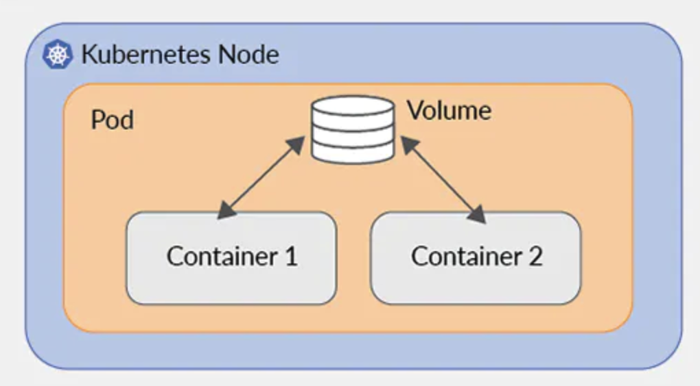
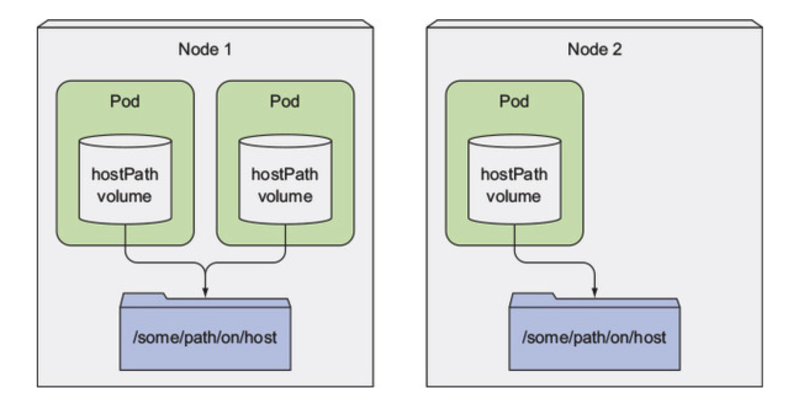
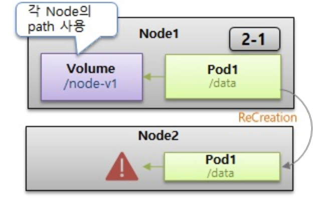
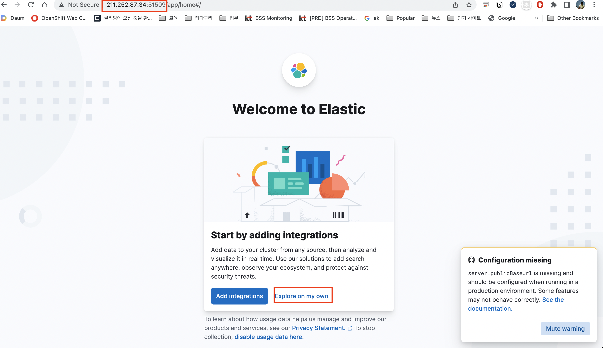
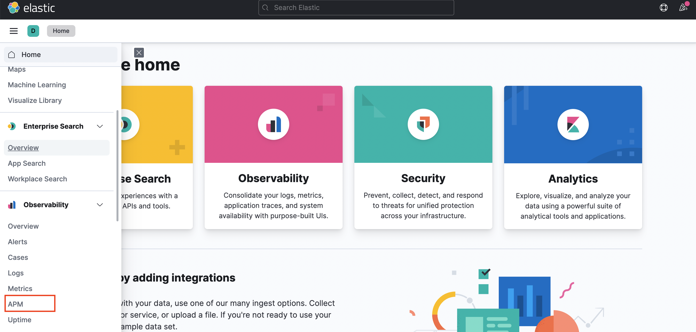
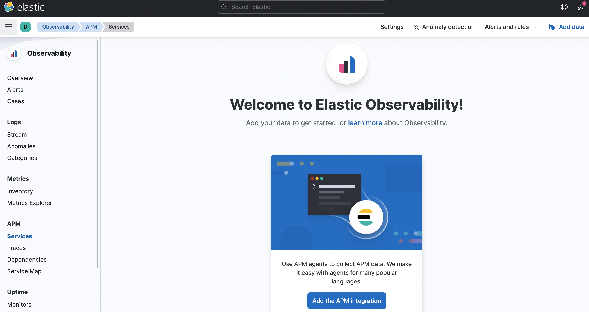

# k8s Middle Hands-on
 
kubernetes에서 Basic 과정에서 진행하지 못했던 부분 실습을 합니다.

1. Storage Volume  ( PV/PVC , DB 설치 + NFS )

2. NFS 라이브러리 설치 ( Native Kubernetes )

3. Service - Headless, Endpoint, ExternalName

4. EFK APM 설치

5. EFK APM Agent 설정  ( React / SpringBoot )

6. EFK APM 활용

7. 참고 사이트 
    - Storage Volume : https://anggeum.tistory.com/m/entry/Kubernetes-Volume-Deep-Dive
    - Ubuntu NFS : https://server-talk.tistory.com/378
    - https://tech.osci.kr/2021/10/06/kubernetes-volume%EC%9D%84-%EA%B3%B5%EB%B6%80%ED%95%B4%EB%B3%B4%EC%9E%90/
    - 인프런 : 대세는 쿠버네티스
    - https://junior-developer.tistory.com/76?category=928073
    - https://zgundam.tistory.com/179
    - https://waspro.tistory.com/580


<br/>

***

<br/>

본장 에서는 실습하기에 앞서 Docker Hub의 image pull limit 으로 인하여 테스트용 도커 이미지는 GitHub의 Private Docker Registry에 Push를 하고 진행을 합니다.  


<br/>


## Docker Hub Rate Limit  

<br/>

Docker Hub 정책은 다음과 같습니다.  


|유저| 제한 |
|:--| :-------|  
| 익명 유저(docker login 안함)	| IP 기반으로 6시간동안 100번 request 제한 |
| 로그인 유저(docker login 함)	| 계정 기반으로 6시간동안 200번 request 가능 |
| 지불 계정 유저(docker login 한 Paid 유저)	| 제한 없음 (IP기반 제한은 있음 )|

<br/>

GitHub Container Registry에  도커 이미지 Push 하기.  

참고 : https://qiita.com/leechungkyu/items/f95998506d45feb15393


<br/>


***


##  1. Storage Volume 

<br/>

kubernetes volume은  Pod의 구성 요소로  컨테이너 와 동일하게 Pod Spec에서 정의 된다.    

volume 은  kubernetes object가 아니므로 자체적으로 생성,삭제 될수 없다.  

volume 은 컨테이너에서 사용 가능 하지만 접근하려는 컨테이너에서  각각 마운트 되어야 한다. 각 컨테이너에서  파일 시스템의 어느 경로에나  볼륨을 마운트 할수 있다.  

<br/>

이번 실습에서는 Internal Network에서 로컬 볼륨과 NFS 볼륨을 대상으로 합니다.  



<br/>

***

### 1.1 로컬 볼륨

로컬 볼륨의 형태는 2가지가 있고 휘발성으로 인하여 자주 사용하지는 않는다.  
- emptyDir : Pod 내부의 Container들이 공유하는 임시 볼륨입니다.  
             emptyDir은 Pod가 기동되면서 생성되고 종료되면서 삭제됩니다.


- hostPath : Node ( VM인 경우 VM 서버 ) 에 있는 파일 시스템을  Pod의 디렉토리로   마운트 하는데 사용한다. pod가 다른 Node에 실행되면 사용 불가.  


<br/>


#### 1.1.1 emptyDir 

<br/>

대부분 POD는 1개의 컨테이너가 존재 하지만 여러개의 컨테이너가 있을 수도 있다.  


  

<br/>

아래 yaml 화일을 내용을 복사하여 emptyDir.yaml 화일을 생성 합니다.

<br/>

```bash
vi emptyDir.yaml
```  

emp-storage-pod 이라는 이름의 POD는 2개의 컨테이너로 구성이 되며
하나는 ubuntu-container, 또 하나는 nginx-container 입니다.  

같은 POD 안의 2개의 container 간에 logs 라는 폴더를 사용하여 데이터를 공유 할 수 있습니다.  

```bash
apiVersion: v1
kind: Pod
metadata:
  name: emp-storage-pod
spec:
  containers:
    - image: ghcr.io/shclub/ubuntu:18.04
      name: ubuntu-container
      command: ["tail","-f", "/dev/null"]
      volumeMounts:
        - mountPath: /logs
          name: emptydir-volume
    - image: ghcr.io/shclub/nginx:latest
      name: nginx-container
      volumeMounts:
        - mountPath: /logs
          name: emptydir-volume
  volumes:
    - name: emptydir-volume
      emptyDir: {}
```  

<br/>

본인의 namespace에 pod를 생성합니다.  


```bash
root@newedu-k3s:~# kubectl apply -f emptyDir.yaml 
pod/emp-storage-pod created
root@newedu-k3s:~# kubectl get po
NAME              READY   STATUS              RESTARTS   AGE
emp-storage-pod   0/2     ContainerCreating   0          8s
root@newedu-k3s:~# kubectl get po
NAME              READY   STATUS    RESTARTS   AGE
emp-storage-pod   2/2     Running   0          18s
```  

READY를 보면 하나의 pod에 READY 가 2/2로 되어 있는 것을 알 수 있습니다.  

컨테이너 이름을 모르면 아래 명령어를 사용하여 컨테이너 이름을 알수 있습니다.  

<br/>

```bash
root@newedu-k3s:~# kubectl describe po emp-storage-pod
Name:         emp-storage-pod
Namespace:    edu30
Priority:     0
Node:         newedu-k3s/172.27.0.41
Start Time:   Wed, 10 Aug 2022 08:03:16 +0000
Labels:       <none>
Annotations:  <none>
Status:       Running
IP:           10.42.0.169
IPs:
  IP:  10.42.0.169
Containers:
  ubuntu-container:
    Container ID:  containerd://6cdda9739a56356528252f95e10f4976881361beb3e1f711de983c52ce48d9ff
    Image:         ubuntu:18.04
    Image ID:      docker.io/library/ubuntu@sha256:eb1392bbdde63147bc2b4ff1a4053dcfe6d15e4dfd3cce29e9b9f52a4f88bc74
    Port:          <none>
    Host Port:     <none>
    Command:
      tail
      -f
      /dev/null
    State:          Running
      Started:      Wed, 10 Aug 2022 08:03:22 +0000
    Ready:          True
    Restart Count:  0
    Environment:    <none>
    Mounts:
      /logs from emptydir-volume (rw)
      /var/run/secrets/kubernetes.io/serviceaccount from kube-api-access-zlxq5 (ro)
  nginx-container:
    Container ID:   containerd://5f201c5ef11d04f1eaf8f2bf414cf278abbf6205045ba15821cfbeb6905e6387
    Image:          nginx:latest
    Image ID:       docker.io/library/nginx@sha256:ecc068890de55a75f1a32cc8063e79f90f0b043d70c5fcf28f1713395a4b3d49
    Port:           <none>
    Host Port:      <none>
    State:          Running
      Started:      Wed, 10 Aug 2022 08:03:29 +0000
    Ready:          True
    Restart Count:  0
    Environment:    <none>
    Mounts:
      /logs from emptydir-volume (rw)
      /var/run/secrets/kubernetes.io/serviceaccount from kube-api-access-zlxq5 (ro)
Conditions:
  Type              Status
  Initialized       True
  Ready             True
  ContainersReady   True
  PodScheduled      True
Volumes:
  emptydir-volume:
    Type:       EmptyDir 
    Medium:
    SizeLimit:  <unset>
  kube-api-access-zlxq5:
    Type:                    Projected (a volume that contains injected data from multiple sources)
    TokenExpirationSeconds:  3607
    ConfigMapName:           kube-root-ca.crt
    ConfigMapOptional:       <nil>
    DownwardAPI:             true
QoS Class:                   BestEffort
Node-Selectors:              <none>
Tolerations:                 node.kubernetes.io/not-ready:NoExecute op=Exists for 300s
                             node.kubernetes.io/unreachable:NoExecute op=Exists for 300s
Events:
  Type    Reason     Age   From               Message
  ----    ------     ----  ----               -------
  Normal  Scheduled  31s   default-scheduler  Successfully assigned storage-test/emp-storage-pod to newedu-k3s
  Normal  Pulling    31s   kubelet            Pulling image "ubuntu:18.04"
  Normal  Pulled     26s   kubelet            Successfully pulled image "ubuntu:18.04" in 5.706066951s
  Normal  Created    26s   kubelet            Created container ubuntu-container
  Normal  Started    26s   kubelet            Started container ubuntu-container
  Normal  Pulling    26s   kubelet            Pulling image "nginx:latest"
  Normal  Pulled     19s   kubelet            Successfully pulled image "nginx:latest" in 6.674048852s
  Normal  Created    19s   kubelet            Created container nginx-container
  Normal  Started    19s   kubelet            Started container nginx-container
``` 

<br/>

이제 ubuntu-container 에 shell 로 접속하여 logs 폴더에 화일을 하나 생성합니다.  

```bash
root@newedu-k3s:~# kubectl exec -it emp-storage-pod -c ubuntu-container sh
kubectl exec [POD] [COMMAND] is DEPRECATED and will be removed in a future version. Use kubectl exec [POD] -- [COMMAND] instead.
# ls
bin  boot  dev	etc  home  lib	lib64  logs  media  mnt  opt  proc  root  run  sbin  srv  sys  tmp  usr  var
# cd /logs
# ls
# echo "emptyDir test" >> edu.txt
# cat edu.txt
emptyDir test
# exit
```  

<br/>

ngix-container 에 shell 로 접속하여 logs 폴더에 생성된 edu.txt 라는 화일을 확인합니다.   

```bash
root@newedu-k3s:~# kubectl exec -it emp-storage-pod -c nginx-container sh 
kubectl exec [POD] [COMMAND] is DEPRECATED and will be removed in a future version. Use kubectl exec [POD] -- [COMMAND] instead.
# cd /logs
# ls
edu.txt
# cat edu.txt
emptyDir test
# exit
```  

<br/>

#### 1.1.2 hostPath 

<br/>

hostPath는 로컬 디스크의 경로를 Pod 에 Mount 해서 사용하는 Volume 방식입니다.  

Docker 에서 -v 옵션으로 Volume 을 연결하는 것과 동일하다고 생각하면 됩니다.   

   

<br/>


hostPath는 방식은 호스트 OS의 Docker(/var/lib/docker)에 접근해야 하거나 호스트 OS에서 개발한 환경을 Container 내부에 적용해야 하거나, 또는 반대로 컨테이너 환경에서 추가된 파일을 호스트 OS에서 사용해야 할 경우 유용하게 사용할 수 있습니다.  

hostPath는 방식의 경우 호스트 OS의 장애가 발생했을 경우 Pod를 실행할 수 없으며, 호스트 OS의 디스크에 대한 데이터 손실 또는 가용성 등에 대해 고려해야 합니다.  


아래 yaml 화일을 내용을 복사하여 hostpath.yaml 화일을 생성 합니다.

<br/>

```bash
vi hostpath.yaml
``` 

<br/>

hostpath를 사용하기 위해서는 securityContext를 설정해야 하고 ClusterAdmin이 권한을 할당해야 한다.  


```bash
oc adm policy add-scc-to-user privileged <유저>
```  


```bash
root@newedu:~# oc adm policy add-scc-to-user privileged edu1-admin
clusterrole.rbac.authorization.k8s.io/system:openshift:scc:privileged added: "edu1-admin"
```  
<br/>

serviceAccount에 권한을 줄 수도 있다.  
- default는 serviceAccount 이름  
- edu1는 namespace 이름
 
```bash
oc adm policy add-scc-to-user privileged -z default -n edu1
```  

<br/>

securityContext를 설정
```bash
      securityContext:
        privileged: true
```  

<br/>

hostpath.yaml
```bash
apiVersion: v1
kind: Pod
metadata:
  name: hostpath-storage-pod
spec:
  containers:
    - image: ghcr.io/shclub/nginx:latest
      name: nginx-container
      securityContext:
        privileged: true
      volumeMounts:
        - mountPath: /hostdir
          name: hostdir-volume
  volumes:
  - name: hostdir-volume
    hostPath:
      path: /root
      type: Directory
```  

<br/>

storage-test 라는 namespace를 사용하여 pod를 생성합니다.  
( 실습자는 본인의 namespace에서 실행 )   

```bash
root@newedu-k3s:~# kubectl apply -f hostpath.yaml -n storage-test
pod/hostpath-storage-pod created
root@newedu-k3s:~# kubectl get po -n storage-test
NAME                   READY   STATUS    RESTARTS   AGE
emp-storage-pod        2/2     Running   0          18m
hostpath-storage-pod   1/1     Running   0          13s
```  

<br/>

생성된 hostpath-storage-pod 에 shell 로 접근합니다.  

```bash
root@newedu-k3s:~# kubectl exec -it hostpath-storage-pod sh -n storage-test
kubectl exec [POD] [COMMAND] is DEPRECATED and will be removed in a future version. Use kubectl exec [POD] -- [COMMAND] instead.
# ls
bin   dev		   docker-entrypoint.sh  home	  lib	 media	opt   root  sbin  sys  usr
boot  docker-entrypoint.d  etc			 hostdir  lib64  mnt	proc  run   srv   tmp  var
```  

<br/>

hostdir로 이동을 하고 화일을 조회 해보면 현재 서버의 화일들이 있는 것을 확인 할 수 있다.    

```bash
# ls
bin   dev		   docker-entrypoint.sh  home	  lib	 media	opt   root  sbin  sys  usr
boot  docker-entrypoint.d  etc			 hostdir  lib64  mnt	proc  run   srv   tmp  var
# cd hostdir
# ls -al
total 12
drwx------. 4 root root  89 Jul 21 23:42 .
dr-xr-xr-x. 1 root root  54 Sep 15 06:12 ..
-rw-r--r--. 1 root root  18 Jun 20 08:04 .bash_logout
-rw-r--r--. 1 root root 141 Jun 20 08:04 .bash_profile
-rw-r--r--. 1 root root 376 Jun 20 08:04 .bashrc
drwx------. 3 root root  20 Jul 21 23:39 .config
drwx------. 2 root root  29 Jul 21 23:43 .ssh
# cd .ssh
# ls
authorized_keys
# cat authorized_keys
ssh-rsa AAAAB3NzaC1yc2EAAAADAQABAAABAQCuhPmv3xdhU7JbMoc/ecBTDxiGqFNKbe564p4aNT6JbYWjNwZ5z6E4iQQDQ0bEp7uBtB0aut0apqDF/SL7pN5ybh2X44aCwDaSEB6bJuJi0yMkZwIvenmtCA1LMAr2XifvGS/Ulac7Qh5vFzfw562cWC+IOI+LyQZAcPgr+CXphJhm8QQ+O454ItXurQX6oPlA2rNfF36fnxYss1ZvUYC80wWTi9k2+/XR3IoQXZHKCFsJiwyKO2CY+jShBbDBbtdOX3/ksHNVNStA/
```  

<br/>

즉 호스트 OS의 /root 디렉토리가 Pod 내부에서 /hostdir 디렉토리 위치에 마운트 된것을 확인할 수 있습니다.  

`위에 경우를 보면 알수 있듯 hostpath 권한을 허용 하면 안되는 이유 입니다.`  

hostPath 경우 ReadWriteOnce로만 적용이 가능하므로 Container 또는 서비스 별로 특정 디렉토리를 지정하여 로그에이전트가 수집하는 로그를 모으는 역할로 사용할 수 있습니다.  

<br/>

`NFS도 서버에서 Mount 한 후 hostPath로 설정 해서 사용 가능 하다. ` 


<br/>

hostPath Volume을 데이터 저장소로 채택하기에는 적합하지 않다.  

특정 노드의 FileSystem에 저장되므로 파드가 다른 노드로 Scheduling이 되면 더 이상 이전 데이터를 볼 수 없다.  

Pod가 어떤 노드에 Scheduling 되느냐에 따라 민감하기 때문에 일반적인 Pod에 사용하는 것은 좋은 생각이 아니다. 특수한 경우를 제외한다면 hostPath를 사용하는 것은 보안 및 활용성 측면에서 그다지 바람직하지 않다.  

<br/>

   

<br/>

***

### 1.2 네트웍 볼륨

Network Volume은 Persistent Volume(PV) 이외에 Persistent Volume Claim(이하 PVC)이 존재합니다.  


<br/>

#### 1.2.1 Persistent Volume

<br/>

Persistent Volume(이하 PV) 는 Kubernetes 에서 관리되는 저장소로 Pod 과는 다른 수명 주기로 관리됩니다.  

Pod 이 재실행 되더라도, PV의 데이터는 정책에 따라 유지/삭제가 됩니다.  

PV 생성은 Cluster 권한이 필요하면 일반 사용자는 생성이 불가능 하다.  

HostPath도 PV로 할당 가능 하지만 결국 Local 이기 때문에 큰 의미는 없다.  
    
<br/>

#### 1.2.2 Persistent Volume Claim

<br/>

Persistent Volume Claim(이하 PVC) 는 PV를 추상화하여 개발자가 손쉽게 PV를 사용 가능하게 만들어주는 기능입니다.  

개발자는 사용에 필요한 Volume의 크기, Volume의 정책을 선택하고 요청만 하면 됩니다.   

운영자는 개발자의 요청에 맞게 PV 를 생성하게 되고, PVC는 해당 PV를 가져가게 됩니다.  

PV 와 PVC는 1:1 관계이다.  

<br/>

#### 1.2.3 PV, PVC의 LifeCycle

<br/>

PV, PVC의 LifeCycle은 총 4가지 형태를 갖고 변화하게 됩니다.  


- Available : PV 생성
- Bound : PVC에 의해 바인딩 되었을 경우
- Released : PVC가 삭제되었을 경우
- Fail : PV에 문제가 발생하였을 경우  

LifeCycle은 Available → Bound → Released → Bound ... 순으로 반복되며, Released 즉 PVC가 삭제되었을 경우 실제 스토리지에 있는 파일을 어떻게 관리할 것인지에 대한 Reclaiming(재활용) 정책을 결정할 수 있습니다. 


PV, PVC의 Reclaiming 정책으로는 다음 세가지를 적용할 수 있습니다.  
- Retain : 삭제하지 않고 PV의 내용 유지
- Recycle : 재 사용이 가능하며, 재 사용시에는 데이타의 내용을 자동으로 rm -rf 로 삭제한 후 재사용
- Delete : 볼륨의 사용이 끝나면, 볼륨 삭제 (AWS EBS, GCE PD,Azure Disk 등)


<br/>

#### 1.2.5 Static Provisioning

<br/>


PV를 생성하고 PVC를 생성하는 방식을 Static Provisioning 이라 합니다. 

<br>

이번 실습은 NFS 서버를 PV로 사용하는 방식입니다.    

NFS 서버가 없는 경우 아래 deployment와 service yaml화일을 사용하여 임시로 컨테이너 NFS 서버를 구성 할 수 있다.    

<br/>

이미 NFS 서버가 있으면 skip.

<br/>


deployment 생성    

nfs-server-deployment.yaml  
```bash
apiVersion: apps/v1
kind: Deployment
metadata:
  name: nfs-server
spec:
  selector:
    matchLabels:
      role: nfs-server
  template:
    metadata:
      labels:
        role: nfs-server
    spec:
      containers:
      - name: nfs-server
        image: gcr.io/google_containers/volume-nfs:0.8
        ports:
          - name: nfs
            containerPort: 2049
          - name: mountd
            containerPort: 20048
          - name: rpcbind
            containerPort: 111
        securityContext:
          privileged: true
```  

<br/>


service 생성  

nfs-server-service.yaml  
```bash
apiVersion: v1
kind: Service
metadata:
  name: nfs-service
spec:
  ports:
  - name: nfs
    port: 2049
  - name: mountd
    port: 20048
  - name: rpcbind
    port: 111
  selector:
    role: nfs-server
```  

<br/>

kt cloud 에서 FlyingCube를 생성 하면 NAS가 할당이 되고 nfs 서버가 활성화 되어 NAS에 연결 할 수 있다.  

nfs에 연결하여 NAS 폴더를 보기 위한 pod 를 아래 yaml 을 이용하여 생성한다.   
- nfs 연동하기 전에 nfs 에 mount 하여 폴더를 생성 해야 한다. ( database 폴더 생성. https://github.com/shclub/edu/blob/master/chapter9.md 참고 )  

<br/>

vi 에디터로 생성한다.    

```bash
root@newedu:~# vi busybox-nfs-test.yaml
```  

아래 내용을 복사하여 붙여 넣기 하고 저장하고 나온다.    
- busybox 도커 이미지는 경량의 이미지로 간단한 테스트를 할때 많이 사용  
- busybox pod는 실행 후 바로 종료 되기 때문에 sleep 을 설정 ( 예제는 365일 동안 기동 )  
  - `command: ["/bin/sleep", "365d"]`
- subPath는 mountPath 의 바로 아래 폴더를 지정 할 수 있음.  

<br/>

busybox-nfs-test.yaml
```bash
apiVersion: apps/v1
kind: Deployment
metadata:
  name: busybox-nfs-test
spec:
  replicas: 1
  selector:
    matchLabels:
      app: busybox-nfs-test
  template:
    metadata:
      labels:
        app: busybox-nfs-test
    spec:
      containers:
      - name: busybox
        image: ghcr.io/shclub/busybox:1.28
        command: ["/bin/sleep", "365d"]
        imagePullPolicy: IfNotPresent
        volumeMounts:
          - name: storage-volume
            mountPath: /data
            #subPath: edu1
      volumes:
        - name: storage-volume
          nfs:
            path: /share_8c0fade2_649f_4ca5_aeaa_8fd57904f8d5/database
            server: 172.25.1.162  
```  

<br/>

apply 명령어를 사용하여 pod를 생성합니다.  

```bash
root@newedu:~# kubectl apply -f busybox-nfs-test.yaml
deployment.apps/busybox-nfs-test created
root@newedu:~# kubectl get po
NAME                                READY   STATUS        RESTARTS   AGE
busybox-nfs-test-54754db755-jnxlh   1/1     Running       0          4s
```  

<br/>

shell을 사용하여 pod 안으로 들어 가서  data 폴더 에 마운트 된 NFS 폴더를 확인 합니다.    

```bash
root@newedu:~# kubectl exec -it busybox-nfs-test-54754db755-jnxlh sh
kubectl exec [POD] [COMMAND] is DEPRECATED and will be removed in a future version. Use kubectl exec [POD] -- [COMMAND] instead.
/ # ls
bin   data  dev   etc   home  proc  root  run   sys   tmp   usr   var
/ # cd data
/data # ls
edu1
edu1-data-my-release-mariadb-0-pvc-1e585a5a-d211-4b1a-ba17-6e0f07dfa99c
edu2
/data #
```  

<br/>

---

<br/>

이제 bitnami 의 helm chart를 이용하여 mariadb 를 설치 해보도록 합니다.  

mariadb는 NFS 통해 데이터를 저장합니다.   


먼저 nfs를 pv로 등록 ( Cluster 권한 : 인프라  ) 하고 
각 namespace별로 pvc를 생성 ( namespace 권한 : 개발팀 ) 합니다.  

pv 화일 : 교육생들은 불필요 ( 사전 생성 되었음 )      

db_pv.yaml  
```bash  
apiVersion: v1
kind: PersistentVolume
metadata:
  labels:
    storage: mariadb-pv1
  name: mariadb-pv1
spec:
  accessModes:
  - ReadWriteMany
  capacity:
    storage: 4Gi
  nfs:
    path: /share_8c0fade2_649f_4ca5_aeaa_8fd57904f8d5/database
    server: 172.25.1.162
  persistentVolumeReclaimPolicy: Retain
```  
<br/>

pvc 화일은 아래 내용을 복사하여 vi 에디터로 db_pvc.yaml 화일을 생성합니다.    
volumeName을 본인의 pv로 변경 한다.  
   
db_pvc.yaml  
```bash  
apiVersion: v1
kind: PersistentVolumeClaim
metadata:
  labels:
    app: mariadb-pvc
  name: mariadb-pvc
spec:
  storageClassName: "" 
  accessModes:
  - ReadWriteMany
  resources:
    requests:
      storage: 4Gi
  volumeName: mariadb-pv1
```

<br/>

이제 pv를 생성합니다 ( 교육생들은 불필요. 사전 생성 되었음 )  

```bash
root@newedu:~# kubectl apply -f db_pv.yaml
persistentvolume/mariadb-pv created
root@newedu:~# kubectl get pv
NAME                        CAPACITY   ACCESS MODES   RECLAIM POLICY   STATUS      CLAIM                                                     STORAGECLASS   REASON   AGE
elasticsearch-data-0-pv     20Gi       RWO            Retain           Bound       edu-efk/elasticsearch-data-0                                                      10d
elasticsearch-kibana-pv     10Gi       RWO            Retain           Bound       edu-efk/elasticsearch-kibana                                                      10d
elasticsearch-master-0-pv   5Gi        RWO            Retain           Bound       edu-efk/elasticsearch-master-0                                                    10d
image-registry-pv           100Gi      RWX            Retain           Bound       openshift-image-registry/image-registry-storage                                   87d
jenkins-restore-pv          100Gi      RWX            Retain           Bound       devops/jenkins-restore-pvc                                                        43d
mariadb-pv-ojt1             8Gi        RWX            Retain           Available                                                                                     16d
mariadb-pv-ojt2             8Gi        RWX            Retain           Available                                                                                     16d
mariadb-pv-ojt3             8Gi        RWX            Retain           Available                                                                                     16d
mariadb-pv-ojt4             8Gi        RWX            Retain           Available                                                                                     16d
mariadb-pv-ojt5             8Gi        RWX            Retain           Available                                                                                     16d
mariadb-pv-ojt6             8Gi        RWX            Retain           Available                                                                                     16d
mariadb-pv1                 4Gi        RWX            Retain           Released    edu1/mariadb-pvc                                                                  16d
mariadb-pv10                4Gi        RWX            Retain           Available                                                                                     16d
mariadb-pv11                4Gi        RWX            Retain           Bound       edu11/mariadb-pvc                                                                 16d
mariadb-pv12                4Gi        RWX            Retain           Bound       edu12/mariadb-pvc                                                                 16d
mariadb-pv13                4Gi        RWX            Retain           Available                                                                                     16d
mariadb-pv14                4Gi        RWX            Retain           Bound       edu14/mariadb-pvc                                                                 16d
mariadb-pv15                4Gi        RWX            Retain           Bound       edu15/mariadb-pvc                                                                 16d
mariadb-pv16                4Gi        RWX            Retain           Bound       edu16/mariadb-pvc                                                                 16d
mariadb-pv17                4Gi        RWX            Retain           Available
```  

<br>

정상적으로 mariadb-pv<번호> 라는 이름으로 pv가 생성 되었습니다. 

<br/>

위의 과정은 Cluster 권한을 가진 admin 관리자가 수행하며 Namespace 권한을 가진 일반 유저는
PVC를 생성 합니다.  

<br/>

```bash
root@newedu:~# kubectl apply -f db_pvc.yaml
persistentvolumeclaim/mariadb-pvc created
root@newedu:~# kubectl get pvc
NAME          STATUS    VOLUME       CAPACITY   ACCESS MODES   STORAGECLASS   AGE
mariadb-pvc   Pending   mariadb-pv   0                                        5s
root@newedu:~# kubectl get pvc
NAME          STATUS   VOLUME       CAPACITY   ACCESS MODES   STORAGECLASS   AGE
mariadb-pvc   Bound    mariadb-pv   600Gi      RWX                           6s
```  

pvc 가  정상적으로 pv에 연결되면 STATUS가 Bound 로 표시됩니다.  

<br/><br/><br/>

이제 helm repository를 추가 합니다.  

<br/>

```bash
root@newedu:~# helm repo update
Hang tight while we grab the latest from your chart repositories...
...Successfully got an update from the "bitnami" chart repository
Update Complete. ⎈Happy Helming!⎈
root@newedu:~# helm repo add bitnami https://charts.bitnami.com/bitnami
root@newedu:~# helm repo list
NAME   	URL
bitnami	https://charts.bitnami.com/bitnami
root@newedu:~# helm search repo mariadb
NAME                  	CHART VERSION	APP VERSION	DESCRIPTION
bitnami/mariadb       	11.2.1       	10.6.9     	MariaDB is an open source, community-developed ...
bitnami/mariadb-galera	7.4.1        	10.6.9     	MariaDB Galera is a multi-primary database clus...
bitnami/phpmyadmin    	10.3.1       	5.2.0      	phpMyAdmin is a free software tool written in P...
root@newedu:~# helm list
NAME	NAMESPACE	REVISION	UPDATED	STATUS	CHART	APP VERSION
root@newedu:~# helm install my-release bitnami/mariadb
NAME: my-release
LAST DEPLOYED: Mon Aug 29 16:00:23 2022
NAMESPACE: edu1
STATUS: deployed
REVISION: 1
TEST SUITE: None
NOTES:
CHART NAME: mariadb
CHART VERSION: 11.2.1
APP VERSION: 10.6.9

** Please be patient while the chart is being deployed **

Tip:

  Watch the deployment status using the command: kubectl get pods -w --namespace edu1 -l app.kubernetes.io/instance=my-release

Services:

  echo Primary: my-release-mariadb.edu1.svc.cluster.local:3306

Administrator credentials:

  Username: root
  Password : $(kubectl get secret --namespace edu1 my-release-mariadb -o jsonpath="{.data.mariadb-root-password}" | base64 -d)

To connect to your database:

  1. Run a pod that you can use as a client:

      kubectl run my-release-mariadb-client --rm --tty -i --restart='Never' --image  docker.io/bitnami/mariadb:10.6.9-debian-11-r0 --namespace edu1 --command -- bash

  2. To connect to primary service (read/write):

      mysql -h my-release-mariadb.edu1.svc.cluster.local -uroot -p my_database

To upgrade this helm chart:

  1. Obtain the password as described on the 'Administrator credentials' section and set the 'auth.rootPassword' parameter as shown below:

      ROOT_PASSWORD=$(kubectl get secret --namespace edu1 my-release-mariadb -o jsonpath="{.data.mariadb-root-password}" | base64 -d)
      helm upgrade --namespace edu1 my-release bitnami/mariadb --set auth.rootPassword=$ROOT_PASSWORD
```  

<br/>

위와 같이 설치를 하면 pod가 하나도 생성이 되지 않고 에러가 발생합니다.  

pod가 생성되지 않은 상태에서 에러를 보는 명령어는 `kubectl get events` 입니다.  

명령어를 실행해 보면  

```bash
root@newedu:~# kubectl get events -n edu30 | grep mariadb
my-release-mariadb           create Pod my-release-mariadb-0 in StatefulSet my-release-mariadb failed error: pods "my-release-mariadb-0" is forbidden: unable to validate against any security context constraint: [provider restricted: .spec.securityContext.fsGroup: Invalid value: []int64{1000660000}: 1000660000 is not an allowed group spec.containers[0].securityContext.runAsUser: Invalid value: 1000660000: must be in the ranges: [1001420000, 1001429999]]
```  

위의 메시지를 보면 fsgroup의 값이 잘못 되어 다고 나오고 range 의 값을 사용하라는 메시지 입니다.  

helm 으로 재설치 할때 fsgroup과 runAsUser의 값을 변경하고 실행 해야 합니다.  


<br/>

재설치 하기 위해 helm 으로 생성된 my-release 차트를 삭제합니다.  

```bash
root@newedu:~# helm delete my-release
release "my-release" uninstalled
root@newedu:~# helm list
NAME	NAMESPACE	REVISION	UPDATED	STATUS	CHART	APP VERSION
```  

<br/>

Namespace 마다 sa.scc.uid-rang 값이 다르기 때문에   

아래 명령어로 range 를 확인한다.  

```bash
kubectl describe namespace <namespace>
```  

<br/>


```bash
root@newedu:~# kubectl describe namespace edu30
Name:         edu30
Labels:       <none>
Annotations:  openshift.io/description:
              openshift.io/display-name: edu30
              openshift.io/node-selector: edu=true
              openshift.io/sa.scc.mcs: s0:c38,c7
              openshift.io/sa.scc.supplemental-groups: 1001420000/10000
              openshift.io/sa.scc.uid-range: 1001420000/10000
Status:       Active

No resource quota.

No LimitRange resource.
```  

<br/>

helm chart에서는 values.yaml 화일이 있는데 사용자가 custom 할수 있는
yaml 화일 입니다.  

우리는 기본값으로 설치하지 않고 우리 환경에 맞게 수정하여 설치한다.

https://github.com/bitnami/charts/blob/master/bitnami/mariadb/values.yaml 사이트에서 values.yaml 를 다운 받고 수정한다.  

<br/>

설치 조건
- 서버 구성 : Primary 만 구성. secondary는 replica 0로 변경
- hostport : 사용 안함 ( 외부에서 접속을 위한 port )
- 아이디/패스워드 : edu / edu1234
- root 비밀번호 : 아이디와 동일
- DB 이름 : edu
- subPath: 본인 namespace/my-mariadb
- 도커 레지스트리 : docker hub ( private docker registry 이면 별도 설정 )
- podSecurityContext.fsGroup :  OKD의 경우 1000660000 로 수정 ( k3s는 불필요 )
- db사이즈는 4Gi 이상  

<br/>

```bash
root@newedu:~# helm show values bitnami/mariadb > values.yaml
```  

vi 데이터에서 생성된 values.yaml을 연다.  

```bash
root@newedu:~# vi values.yaml
```  

라인을 보기 위해 ESC 를 누른 후 `:set nu` 를 입력하면 왼쪽에 라인이 보인다.  

아래 라인을 찾아 값을 변경한다.  

<br/>

```bash
 107   rootPassword: edu1234
 111   database: edu
 115   username: edu
 118   password: edu1234
...
 301   podSecurityContext:
 302     enabled: true
 303     fsGroup: 1001420000 #1001
...

 424   persistence:
 431     existingClaim: "mariadb-pvc"
 434     subPath: "edu1/my-mariadb"
 452     size: 4Gi
 ...

 543 secondary:
 546   name: secondary
 549   replicaCount: 0

```  

<br/>

위의 화일을 수정하기 힘든 경우 아래 링크에서 다운 받습니다.  
- https://github.com/shclub/edu14/blob/master/values.yaml  

본인의 namespace 이름만 변경 하면 됩니다. 지금은 subPath edu1 로 설정 되어 있음.  

<br/>

화일 수정방법은 시간이 걸리기  때문에 아래 명령어를 사용하여 설치합니다.  

```bash
root@newedu:~# helm install my-release bitnami/mariadb -f values.yaml  \
--set auth.rootPassword=edu1234 \
--set auth.database=edu \
--set auth.username=edu  \
--set auth.password=edu1234 \
--set primary.podSecurityContext.fsGroup=1001420000 \
--set primary.containerSecurityContext.runAsUser=1001420000 \
--set primary.persistence.existingClaim=mariadb-pvc \
--set primary.persistence.subPath=edu1/my-mariadb  \
--set primary.persistence.size=4Gi  \
--set secondary.replicaCount=0
```  

<br/>

정상적으로 동작 하는지 확인한다.  

helm list 명령어로 확인해보고 pod 를 조회한다.  

<br/>

```bash
root@newedu:~# helm list
NAME      	NAMESPACE	REVISION	UPDATED                                	STATUS  	CHART         	APP VERSION
my-release	edu30    	1       	2022-09-14 16:30:27.937973478 +0900 KST	deployed	mariadb-11.3.0	10.6.9
root@newedu:~# kubectl get po
NAME                                READY   STATUS    RESTARTS   AGE
busybox-nfs-test-54754db755-jnxlh   1/1     Running   0          79m
my-release-mariadb-0                0/1     Running   0          31s
```  

해당 POD의 로그를 확인한다.  

```bash
root@newedu:~# kubectl logs my-release-mariadb-0
mariadb 06:39:37.09
mariadb 06:39:37.09 Welcome to the Bitnami mariadb container
mariadb 06:39:37.09 Subscribe to project updates by watching https://github.com/bitnami/containers
mariadb 06:39:37.09 Submit issues and feature requests at https://github.com/bitnami/containers/issues
mariadb 06:39:37.09
mariadb 06:39:37.09 INFO  ==> ** Starting MariaDB setup **
mariadb 06:39:37.11 INFO  ==> Validating settings in MYSQL_*/MARIADB_* env vars
mariadb 06:39:37.11 INFO  ==> Initializing mariadb database
mariadb 06:39:37.12 WARN  ==> The mariadb configuration file '/opt/bitnami/mariadb/conf/my.cnf' is not writable. Configurations based on environment variables will not be applied for this file.
mariadb 06:39:37.13 INFO  ==> Installing database
mariadb 06:39:47.10 INFO  ==> Starting mariadb in background
2022-09-01  6:39:47 0 [Note] InnoDB: Compressed tables use zlib 1.2.11
2022-09-01  6:39:47 0 [Note] InnoDB: Number of pools: 1
2022-09-01  6:39:47 0 [Note] InnoDB: Using crc32 + pclmulqdq instructions
2022-09-01  6:39:47 0 [Note] mysqld: O_TMPFILE is not supported on /opt/bitnami/mariadb/tmp (disabling future attempts)
2022-09-01  6:39:47 0 [Note] InnoDB: Using Linux native AIO
2022-09-01  6:39:47 0 [Note] InnoDB: Initializing buffer pool, total size = 134217728, chunk size = 134217728
2022-09-01  6:39:47 0 [Note] InnoDB: Completed initialization of buffer pool
2022-09-01  6:39:47 0 [Note] InnoDB: 128 rollback segments are active.
2022-09-01  6:39:47 0 [Note] InnoDB: Creating shared tablespace for temporary tables
2022-09-01  6:39:47 0 [Note] InnoDB: Setting file './ibtmp1' size to 12 MB. Physically writing the file full; Please wait ...
2022-09-01  6:39:50 0 [Note] InnoDB: File './ibtmp1' size is now 12 MB.
2022-09-01  6:39:50 0 [Note] InnoDB: 10.6.9 started; log sequence number 42147; transaction id 14
2022-09-01  6:39:50 0 [Note] Plugin 'FEEDBACK' is disabled.
2022-09-01  6:39:50 0 [Note] InnoDB: Loading buffer pool(s) from /bitnami/mariadb/data/ib_buffer_pool
2022-09-01  6:39:50 0 [Note] Server socket created on IP: '127.0.0.1'.
2022-09-01  6:39:50 0 [Warning] 'user' entry 'root@my-release-mariadb-0' ignored in --skip-name-resolve mode.
2022-09-01  6:39:50 0 [Warning] 'user' entry '@my-release-mariadb-0' ignored in --skip-name-resolve mode.
2022-09-01  6:39:50 0 [Warning] 'proxies_priv' entry '@% root@my-release-mariadb-0' ignored in --skip-name-resolve mode.
2022-09-01  6:39:50 0 [Note] InnoDB: Buffer pool(s) load completed at 220901  6:39:50
2022-09-01  6:39:50 0 [Note] /opt/bitnami/mariadb/sbin/mysqld: ready for connections.
Version: '10.6.9-MariaDB'  socket: '/opt/bitnami/mariadb/tmp/mysql.sock'  port: 3306  Source distribution
mariadb 06:39:51.12 INFO  ==> Configuring authentication
2022-09-01  6:39:51 5 [Warning] 'proxies_priv' entry '@% root@my-release-mariadb-0' ignored in --skip-name-resolve mode.
mariadb 06:39:51.23 INFO  ==> Running mysql_upgrade
2022-09-01  6:40:00 23 [Warning] 'proxies_priv' entry '@% root@my-release-mariadb-0' ignored in --skip-name-resolve mode.
find: '/docker-entrypoint-startdb.d/': No such file or directory
mariadb 06:40:00.43 INFO  ==> Stopping mariadb
2022-09-01  6:40:00 0 [Note] /opt/bitnami/mariadb/sbin/mysqld (initiated by: unknown): Normal shutdown
2022-09-01  6:40:00 0 [Note] InnoDB: FTS optimize thread exiting.
2022-09-01  6:40:00 0 [Note] InnoDB: Starting shutdown...
2022-09-01  6:40:00 0 [Note] InnoDB: Dumping buffer pool(s) to /bitnami/mariadb/data/ib_buffer_pool
2022-09-01  6:40:00 0 [Note] InnoDB: Buffer pool(s) dump completed at 220901  6:40:00
2022-09-01  6:40:00 0 [Note] InnoDB: Removed temporary tablespace data file: "./ibtmp1"
2022-09-01  6:40:00 0 [Note] InnoDB: Shutdown completed; log sequence number 42159; transaction id 18
2022-09-01  6:40:00 0 [Note] /opt/bitnami/mariadb/sbin/mysqld: Shutdown complete


mariadb 06:40:01.45 INFO  ==> ** MariaDB setup finished! **
mariadb 06:40:01.47 INFO  ==> ** Starting MariaDB **
2022-09-01  6:40:01 0 [Note] /opt/bitnami/mariadb/sbin/mysqld (server 10.6.9-MariaDB) starting as process 1 ...
2022-09-01  6:40:01 0 [Note] InnoDB: Compressed tables use zlib 1.2.11
2022-09-01  6:40:01 0 [Note] InnoDB: Number of pools: 1
2022-09-01  6:40:01 0 [Note] InnoDB: Using crc32 + pclmulqdq instructions
2022-09-01  6:40:01 0 [Note] mysqld: O_TMPFILE is not supported on /opt/bitnami/mariadb/tmp (disabling future attempts)
2022-09-01  6:40:01 0 [Note] InnoDB: Using Linux native AIO
2022-09-01  6:40:01 0 [Note] InnoDB: Initializing buffer pool, total size = 134217728, chunk size = 134217728
2022-09-01  6:40:01 0 [Note] InnoDB: Completed initialization of buffer pool
2022-09-01  6:40:01 0 [Note] InnoDB: 128 rollback segments are active.
2022-09-01  6:40:01 0 [Note] InnoDB: Creating shared tablespace for temporary tables
2022-09-01  6:40:01 0 [Note] InnoDB: Setting file './ibtmp1' size to 12 MB. Physically writing the file full; Please wait ...
2022-09-01  6:40:04 0 [Note] InnoDB: File './ibtmp1' size is now 12 MB.
2022-09-01  6:40:04 0 [Note] InnoDB: 10.6.9 started; log sequence number 42159; transaction id 14
2022-09-01  6:40:04 0 [Note] Plugin 'FEEDBACK' is disabled.
2022-09-01  6:40:04 0 [Note] InnoDB: Loading buffer pool(s) from /bitnami/mariadb/data/ib_buffer_pool
2022-09-01  6:40:04 0 [Note] Server socket created on IP: '0.0.0.0'.
2022-09-01  6:40:04 0 [Note] Server socket created on IP: '::'.
2022-09-01  6:40:04 0 [Note] InnoDB: Buffer pool(s) load completed at 220901  6:40:04
2022-09-01  6:40:04 0 [Warning] 'proxies_priv' entry '@% root@my-release-mariadb-0' ignored in --skip-name-resolve mode.
2022-09-01  6:40:04 0 [Note] /opt/bitnami/mariadb/sbin/mysqld: ready for connections.
Version: '10.6.9-MariaDB'  socket: '/opt/bitnami/mariadb/tmp/mysql.sock'  port: 3306  Source distribution
```  

<br/>

에러가 없으면 DB 기동이 완료 된 것으로 볼수 있고  
해당 pod에 들어가서 DB 에 접속해 본다.  (비밀번호 edu1234 )  

```bash
root@newedu:~# kubectl exec -it my-release-mariadb-0 sh
kubectl exec [POD] [COMMAND] is DEPRECATED and will be removed in a future version. Use kubectl exec [POD] -- [COMMAND] instead.
$ mysql -u edu1 -p
Enter password:
Welcome to the MariaDB monitor.  Commands end with ; or \g.
Your MariaDB connection id is 34
Server version: 10.6.9-MariaDB Source distribution

Copyright (c) 2000, 2018, Oracle, MariaDB Corporation Ab and others.

Type 'help;' or '\h' for help. Type '\c' to clear the current input statement.

MariaDB [(none)]> show databases;
+--------------------+
| Database           |
+--------------------+
| edu               |
| information_schema |
| test               |
+--------------------+
3 rows in set (0.002 sec)
```  

<br/>

mariadb에서 exit 하고 pod 안에서  아래 폴더를 조회해 본다.  
data 폴더에 보면 db 관련 화일이 생성 되어 있다.  

```bash
MariaDB [(none)]> exit
Bye
$ ls /bitnami/mariadb/data
aria_log.00000001  ddl_recovery.log  ib_buffer_pool  ibdata1  multi-master.info  mysql_upgrade_info  sys
aria_log_control   edu1		     ib_logfile0     ibtmp1   mysql		 performance_schema  test
```  

<br/>

nfs 서버에 들어가면 아래와 같이 폴더가 생성 된것을 확인 할 수 있다. ( 워커노드에서 조회 ).  

교육생들은 위에서 생성한 busybox-nfs-test pod에 들어가서 확인 할 수 있다.  

DB를 재기동 하더라도 데이터는 남아 있다.  

```bash
root@newedu:~# kubectl exec -it busybox-nfs-test-687b87878d-25h99
kubectl exec [POD] [COMMAND] is DEPRECATED and will be removed in a future version. Use kubectl exec [POD] -- [COMMAND] instead.
/ # ls
bin   data  dev   etc   home  proc  root  run   sys   tmp   usr   var
/ # cd data
/data # ls
edu12         edu15         edu20         edu30         edu8          edu11         edu14         edu16         edu24         edu4        
/data/edu30 # ls
my-mariadb
/data/edu30 # ls my-mariadb/data
aria_log.00000001   edu                 ibdata1             mysql               sys
aria_log_control    ib_buffer_pool      ibtmp1              mysql_upgrade_info  test
ddl_recovery.log    ib_logfile0         multi-master.info   performance_schema  
```  

<br/>

> TIP :  다른 Namespace 의 서비스 호출 하는 방법

본인의 Namespace 의 curl 명령어가 있는 POD에 들어간다.
- 예제는 : edu30 namespace 에서 edu9의 특정 서비스 호출   

```bash
root@newedu:~ # kubectl exec -it hostpath-storage-pod sh -n edu30
kubectl exec [POD] [COMMAND] is DEPRECATED and will be removed in a future version. Use kubectl exec [POD] -- [COMMAND] instead.
```  

다른 namesapce의 서비스를 조회해 본다. ( 단, 다른 namespace 접근 권한 필요. 예제는 edu9  namespace 호출 )  

여기서는  flask-edu4-app 서비스의 5000 포트로 접속해 본다.  

```bash
root@newedu:~# kubectl get svc -n edu9
NAME                        TYPE        CLUSTER-IP       EXTERNAL-IP   PORT(S)          AGE
flask-edu4-app              NodePort    172.30.63.230    <none>        5000:31081/TCP   42h
```  

<br/>

호출 규칙은 아래와 같다.  

-  <서비스 이름 >.< 호출할 namespace이름>.svc.cluster.local:<서비스 포트>

```bash
# curl http://flask-edu4-app.edu9.svc.cluster.local:5000
 Container EDU | POD Working : flask-edu4-app-757bcc87db-mmnz2 | v=2
```  

다른 namespace 서비스가 호출 되는 것을 볼 수 있다.  

<br/>

#### 1.2.6 Dynamic Provisioning 

<br/>

Static Provisioning 의 문제는 인프라에서 pv를 수동으로 생성을 해야 하고 업무팀에서 그에 맡게 pvc를 생성을 하는 번거로움이 있다.  

Dynamic Provisioning 은  프로비저너를 사용하여 자동으로  pvc/pv를 생성 할 수 있다.   

이번 예제는 NFS 서버를 위한 프로지저너를 사용하여 Dynamic Provisioning을 실습 한다.  

쿠버네티스에는 내장 NFS 프로비저너가 없다. NFS를 위한 스토리지클래스를 생성하려면 외부 프로비저너를 사용해야 한다. 쿠버네티스 1.19 이상에서 지원 한다.   

<br/>

NFS subdir external provisioner  

NFS 서버를 사용하여 PVC를 통해 Kubernetes PV의 동적 프로비저닝을 지원하는 자동 프로비저닝 도구입니다.  

- PVC(Persistent Volume Claim)에 대한 쿠버네티스 PV(Persistent Volume)를동적으로 프로비저닝하기 위하여 사전에 구성된 NFS server를 사용하는 automatic provisioner이다.  

- PV는 네이밍 규칙에 맞게 프로비저닝된다.  

<br/>

참고 
- https://1week.tistory.com/114 ( Native K8S deployment )
- https://kubepia.github.io/cloudpak/cp4app/install/ocp04.html ( OKD helm)

<br/>

우리는 helm (3.x) 을 사용하여 배포하도록 한다.  
기존 helm chart를 수정하기 위하여
https://github.com/kubernetes-sigs/nfs-subdir-external-provisioner/blob/master/charts/nfs-subdir-external-provisioner  링크에서 values.yaml 화일의 내용을 복사한다.  


복사한 내용을 vi dynamic_values.yaml 이라는 화일을 생성하여 붙여 넣기 한다.  

```bash
root@newedu:~# vi dynamic_values.yaml
```  

<br/>

dynamic_values.yaml 에서 변경 내용    
- nfs server: 172.25.1.162
- nfs path : /share_8c0fade2_649f_4ca5_aeaa_8fd57904f8d5/database
- reclaimPolicy: Retain
- archiveOnDelete: false ( 삭제시 아키이브 폴더를 만들지 않는다.)
- podSecurityPolicy:  ( OKD 인 경우만 사용 )
  enabled: true
- podSecurityContext:  ( OKD 인 경우 만 사용 )
  fsGroup: 1001420000 
- storageclass 에 reclaimPolicy: Delete를 하면 PVC 삭제시 pv와 nfs에서 생성된 폴더가 같이 삭제 된다.  

<br/>

dynamic_values.yaml
```bash
replicaCount: 1
strategyType: Recreate

image:
  repository: k8s.gcr.io/sig-storage/nfs-subdir-external-provisioner
  tag: v4.0.2
  pullPolicy: IfNotPresent
imagePullSecrets: []

nfs:
  server: 172.25.1.162
  path: /share_8c0fade2_649f_4ca5_aeaa_8fd57904f8d5/database
  mountOptions:
  volumeName: nfs-subdir-external-provisioner-root
  # Reclaim policy for the main nfs volume
  reclaimPolicy: Retain

# For creating the StorageClass automatically:
storageClass:
  create: true

  # Set a provisioner name. If unset, a name will be generated.
  # provisionerName:

  # Set StorageClass as the default StorageClass
  # Ignored if storageClass.create is false
  defaultClass: false

  # Set a StorageClass name
  # Ignored if storageClass.create is false
  name: nfs-client

  # Allow volume to be expanded dynamically
  allowVolumeExpansion: true

  # Method used to reclaim an obsoleted volume
  reclaimPolicy: Delete

  # When set to false your PVs will not be archived by the provisioner upon deletion of the PVC.
  archiveOnDelete: false

  # If it exists and has 'delete' value, delete the directory. If it exists and has 'retain' value, save the directory.
  # Overrides archiveOnDelete.
  # Ignored if value not set.
  onDelete:

  # Specifies a template for creating a directory path via PVC metadata's such as labels, annotations, name or namespace.
  # Ignored if value not set.
  pathPattern:

  # Set access mode - ReadWriteOnce, ReadOnlyMany or ReadWriteMany
  accessModes: ReadWriteOnce

  # Set volume bindinng mode - Immediate or WaitForFirstConsumer
  volumeBindingMode: Immediate

  # Storage class annotations
  annotations: {}

leaderElection:
  # When set to false leader election will be disabled
  enabled: true

## For RBAC support:
rbac:
  # Specifies whether RBAC resources should be created
  create: true

# If true, create & use Pod Security Policy resources
# https://kubernetes.io/docs/concepts/policy/pod-security-policy/
podSecurityPolicy:
  enabled: true

# Deployment pod annotations
podAnnotations: {}

## Set pod priorityClassName
# priorityClassName: ""

podSecurityContext:
  fsGroup: 1001420000 #1001

securityContext: {}

serviceAccount:
  # Specifies whether a ServiceAccount should be created
  create: true

  # Annotations to add to the service account
  annotations: {}

  # The name of the ServiceAccount to use.
  # If not set and create is true, a name is generated using the fullname template
  name:

resources: {}
  # limits:
  #  cpu: 100m
  #  memory: 128Mi
  # requests:
  #  cpu: 100m
  #  memory: 128Mi

nodeSelector: {}

tolerations: []

affinity: {}

# Additional labels for any resource created
labels: {}
```  

<br/>

이제 설치를 합니다. 프로비저너 설치는 Cluster 권한이 필요 합니다.  ( 교육생들은 불필요. 강사가 사전에 진행함 )  

helm repository를 추가합니다.  

```bash
root@newedu:~# helm repo add nfs-subdir-external-provisioner https://kubernetes-sigs.github.io/nfs-subdir-external-provisioner
root@newedu:~# helm repo list
NAME                           	URL
bitnami                        	https://charts.bitnami.com/bitnami
nfs-subdir-external-provisioner	https://kubernetes-sigs.github.io/nfs-subdir-external-provisioner/
```  

helm 을 사용하여 NFS subdir external provisioner 를 설치 합니다.  
수정한 dynamic_values.yaml 를 사용합니다.  

```bash
root@newedu:~# helm install nfs-subdir-external-provisioner -f dynamic_values.yaml  nfs-subdir-external-provisioner/nfs-subdir-external-provisioner -n devops
NAME: nfs-subdir-external-provisioner
LAST DEPLOYED: Tue Aug 30 14:52:58 2022
NAMESPACE: devops
STATUS: deployed
REVISION: 1
TEST SUITE: None
root@newedu:~# helm list
NAME	NAMESPACE	REVISION	UPDATED	STATUS	CHART	APP VERSION
root@newedu:~# helm list -n devops
NAME                           	NAMESPACE	REVISION	UPDATED                                	STATUS  	CHART                                 	APP VERSION
nfs-subdir-external-provisioner	devops   	1       	2022-08-30 14:52:58.711543994 +0900 KST	deployed	nfs-subdir-external-provisioner-4.0.17	4.0.2
```  

<br/>
storage class가 생성 되었는지 확인합니다.

```bash
root@newedu:~# kubectl get storageclass
NAME         PROVISIONER                                     RECLAIMPOLICY   VOLUMEBINDINGMODE   ALLOWVOLUMEEXPANSION   AGE
nfs-client   cluster.local/nfs-subdir-external-provisioner   Delete          Immediate           true                   95s
```    

오픈 쉬프트는 신규 생성된  service account에 hostmount 권한을 주어야 합니다. ( native K8S는 불필요 )    

```bash  
root@newedu:~# kubectl get sa -n devops
NAME                              SECRETS   AGE
builder                           2         35d
default                           2         35d
deployer                          2         35d
nfs-subdir-external-provisioner   2         3m34s
root@newedu:~# oc adm policy add-scc-to-user hostmount-anyuid -z nfs-subdir-external-provisioner -n devops
clusterrole.rbac.authorization.k8s.io/system:openshift:scc:hostmount-anyuid added: "nfs-subdir-external-provisioner"
```  

<br/>
 
이제 mariadb를 다이나믹 프로비저닝을 사용하여 생성 해보도록 하겠습니다.  

상단의 global storageClass에 nfs-client를 추가합니다.    

values.yaml 변경 사항  

```bash
  11 global:
  12   imageRegistry: ""
  17   imagePullSecrets: []
  18   storageClass: "nfs-client"
  ...

 431     #existingClaim: ""
 436     subPath: my-mariadb
```  


<br/>

values.yaml 을 수정을 하면 helm 으로 설치를 합니다.    

<br/>

화일 수정방법은 시간이 걸리기  때문에 아래 명령어를 사용하여 설치합니다.  

<br/>

```bash
root@newedu:~# helm install my-release bitnami/mariadb -f values.yaml  \
--set global.storageClass=nfs-client \
--set auth.rootPassword=edu1234 \
--set auth.database=edu \
--set auth.username=edu  \
--set auth.password=edu1234 \
--set primary.podSecurityContext.fsGroup=1000690000 \
--set primary.containerSecurityContext.runAsUser=1000690000 \
--set primary.persistence.existingClaim="" \
--set primary.persistence.subPath=my-mariadb  \
--set primary.persistence.size=4Gi  \
--set secondary.replicaCount=0
```  
<br/>


pod , pvc , statefulset 이 정상적으로 생성이 되었는지 확인 합니다.  
pv도 생성이 되었고 cluster 권한으로 조회 가능합니다.  


```bash
root@newedu:~# kubectl get po
NAME                              READY   STATUS    RESTARTS   AGE
my-release-mariadb-0              1/1     Running   0          67s
root@newedu:~# kubectl get pvc
NAME                        STATUS   VOLUME                                     CAPACITY   ACCESS MODES   STORAGECLASS   AGE
data-my-release-mariadb-0   Bound    pvc-1e585a5a-d211-4b1a-ba17-6e0f07dfa99c   8Gi        RWO            nfs-client     84s
mariadb-pvc                 Bound    mariadb-pv1                                8Gi        RWX                           4h53m
root@newedu:~# kubectl get storageclass
NAME         PROVISIONER                                     RECLAIMPOLICY   VOLUMEBINDINGMODE   ALLOWVOLUMEEXPANSION   AGE
nfs-client   cluster.local/nfs-subdir-external-provisioner   Retain          Immediate           true                   80m
root@newedu:~# kubectl get statefulset
NAME                 READY   AGE
my-release-mariadb   1/1     2m27s
```  

<br/>

NFS 서버에 접속 ( 워커노드로 접속 ) 하여 폴더가 생성된 것을 확인 할 수 있습니다.  

```bash
[root@edu database]# ls
edu1  edu1-data-my-release-mariadb-0-pvc-1e585a5a-d211-4b1a-ba17-6e0f07dfa99c  edu2
[root@edu database]# ls edu1-data-my-release-mariadb-0-pvc-1e585a5a-d211-4b1a-ba17-6e0f07dfa99c
my-mariadb
```  


***

<br/>

## 2. NFS 라이브러리 설치 ( Native Kubernetes )

<br/>

OKD 의 경우  Fedora CoreOS로 되어 있어 별도 라이브러리 설치 없이 hostmount 권한을 할당 하면  워커노드의 pod에서  nfs 연결 가능 하지만 native k8s의 경우 os에 따라 아래 라이브러리 설치 필요.  

<br/>

### centos 인 경우 아래 라이브러리 설치

<br/>


```bash
yum install nfs-utils
systemctl enable rpcbind --now ; systemctl status rpcbind
```  

<br/>

### ubuntu 인 경우 아래 라이브러리 설치
 
<br/>


```bash
apt-get update
apt-get install -y nfs-common
```
<br/>


***

<br/>

## 4. Elastic APM 설치 

<br/>

모니터링을 위해 elastic의 APM 을 설치해 본다.  
설치를 위해서는 elasticsearch , elastic apm server 2가지를 설치 해야하고
elastic apm server은 하나의 서버 ( 1 VM ) 에만 설치하는 무료이고 2개 이상 서버에 설치하면 유료.   

<br/>

helm 으로 elastic repository를 추가한다.  

```bash
root@newedu:~# helm repo add elastic https://helm.elastic.co
"elastic" has been added to your repositories
root@newedu:~# helm repo list
NAME                           	URL
bitnami                        	https://charts.bitnami.com/bitnami
nfs-subdir-external-provisioner	https://kubernetes-sigs.github.io/nfs-subdir-external-provisioner/
elastic                        	https://helm.elastic.co
```  

<br/>

elastic helm chart 를 조회해 본다.  

```bash
root@newedu:~# helm search repo elastic
NAME                     	CHART VERSION	APP VERSION	DESCRIPTION
elastic/eck-elasticsearch	0.1.0        	           	A Helm chart to deploy Elasticsearch managed by...
elastic/elasticsearch    	7.17.3       	7.17.3     	Official Elastic helm chart for Elasticsearch
elastic/apm-server       	7.17.3       	7.17.3     	Official Elastic helm chart for Elastic APM Server
elastic/eck-kibana       	0.1.0        	           	A Helm chart to deploy Kibana managed by the EC...
elastic/eck-operator     	2.4.0        	2.4.0      	A Helm chart for deploying the Elastic Cloud on...
elastic/eck-operator-crds	2.4.0        	2.4.0      	A Helm chart for installing the ECK operator Cu...
elastic/eck-stack        	0.1.0        	           	A Parent Helm chart for all Elastic stack resou...
elastic/filebeat         	7.17.3       	7.17.3     	Official Elastic helm chart for Filebeat
elastic/kibana           	7.17.3       	7.17.3     	Official Elastic helm chart for Kibana
elastic/logstash         	7.17.3       	7.17.3     	Official Elastic helm chart for Logstash
elastic/metricbeat       	7.17.3       	7.17.3     	Official Elastic helm chart for Metricbeat
```  

<br/>

위에서 우리가 사용할 것은 2가지 이다.  
kibana는 별도로 설치하지 않고 elastic/apm-server에 내장된 것만 설치한다.  


|이름| Chart Version | Description
|:--| :-------| :-------| 
| elastic/elasticsearch	| 7.17.3 | Official Elastic helm chart for Elasticsearch |
| elastic/apm-server	| 7.17.3 | Official Elastic helm chart for Elastic APM Server |
| elastic/kibana	| 7.17.3 | Official Elastic helm chart for Kibana |

<br/>

순서대로 설치를 한다.  

oc login 을 root 계정으로 하고 아래 edu-monitoring 이라는 namespace를 생성한다.  

```bash
root@newedu:~# oc new-project  edu-monitoring --display-name 'edu-monitoring'
Now using project "edu-monitoring" on server "https://api.211-34-231-81.nip.io:6443".

You can add applications to this project with the 'new-app' command. For example, try:

    oc new-app rails-postgresql-example

to build a new example application in Ruby. Or use kubectl to deploy a simple Kubernetes application:

    kubectl create deployment hello-node --image=k8s.gcr.io/serve_hostname

```  

<br/>

namespace를 할당하고 node selector를 할당하여 항상 5번 worker node에 pod가 뜨도록 한다.  

`openshift.io/node-selector: devops=true`    

<br/>

```bash
root@newedu:~# kubectl edit namespace edu-monitoring
namespace/edu-monitoring edited
root@newedu:~# kubectl describe namespace edu-monitoring
Name:         edu-monitoring
Labels:       <none>
Annotations:  openshift.io/description:
              openshift.io/display-name: edu-monitoring
              openshift.io/node-selector: devops=true
              openshift.io/requester: root
              openshift.io/sa.scc.mcs: s0:c27,c14
              openshift.io/sa.scc.supplemental-groups: 1000730000/10000
              openshift.io/sa.scc.uid-range: 1000730000/10000
Status:       Active

No resource quota.

No LimitRange resource.
```  

Annotation에 설정 된 것을 확인 할 수 있다.  

<br/>

해당 namespace에 권한을 부여한다.  ( anyuid 와 previleged )  

```bash
root@newedu:~# oc adm policy add-scc-to-user anyuid system:serviceaccount:edu-monitoring:default
clusterrole.rbac.authorization.k8s.io/system:openshift:scc:anyuid added: "default"
root@newedu:~# oc adm policy add-scc-to-user previleged system:serviceaccount:edu-monitoring:default
clusterrole.rbac.authorization.k8s.io/system:openshift:scc:previleged added: "default"
```  

<br/>

해당 namespace 에 elastic stack을 설치 한다. 

helm의 기본 값을 변경하기 위해서 아래 명령어를 사용하여 es-values.yaml 화일을 생성합니다.  


```bash
root@newedu:~# helm show values elastic/elasticsearch > es-values.yaml
```  

<br/>

테스트 용도이기 때문에 yaml 화일을 vi 에디터로 열어 해당 라인의 값을 아래와 같이 변경합니다.  


```bash
root@newedu:~# vi es-values.yaml
```  

변경할 내용    
```bash
 18 replicas: 1  
 19 minimumMasterNodes: 1
 ...
 80 resources:
 81   requests:
 82     cpu: "500m"
 83     memory: "1Gi"
 84   limits:
 85     cpu: "500m"
 86     memory: "1Gi"
 ...
 99 volumeClaimTemplate:
100   accessModes: ["ReadWriteOnce"]
101   resources:
102     requests:
103       storage: 1Gi
... OKD는 runAsUser 수정 필요
222   runAsUser: 1000730000
```  


<br/>

edu-monitoring namespace에 elasticsearch 를 설치합니다.    

```bash
root@newedu:~# helm install elastic elastic/elasticsearch -f es-values.yaml -n edu-monitoring
NAME: elastic
LAST DEPLOYED: Wed Aug 31 17:43:41 2022
NAMESPACE: edu-monitoring
STATUS: deployed
REVISION: 1
NOTES:
1. Watch all cluster members come up.
  $ kubectl get pods --namespace=edu-monitoring -l app=elasticsearch-master -w2. Test cluster health using Helm test.
  $ helm --namespace=edu-monitoring test elastic
```  


<br/>

주의 : k3s 에서는 아래 에러 발생시에는 콘솔에서 아래 명령을 먼저 실행하고 다시 helm install 한다.  


```bash
root@newedu:~# export KUBECONFIG=/etc/rancher/k3s/k3s.yaml
``` 
- Error: INSTALLATION FAILED: Kubernetes cluster unreachable: Get "http://localhost:8080/version": dial tcp [::1]:8080: connect: connection refused

<br/>

정상적으로 설치가 되면 아래와 같이 pod가 running 상태 인것을 확인 할수 있다.  

```bash
root@newedu:~# kubectl get po -n edu-monitoring
NAME                     READY   STATUS    RESTARTS   AGE
elasticsearch-master-0   1/1     Running   0          102s
```  

서비스를 조회하여 pod ip를 사용하여 정상 작동 하는 지를 확인한다.    

```bash
root@newedu:~# kubectl get svc -n edu-monitoring
NAME                            TYPE        CLUSTER-IP      EXTERNAL-IP   PORT(S)             AGE
elasticsearch-master-headless   ClusterIP   None            <none>        9200/TCP,9300/TCP   6m37s
elasticsearch-master            ClusterIP   10.43.115.188   <none>        9200/TCP,9300/TCP   6m37s
root@newedu:~# curl 10.43.115.188:9200
{
  "name" : "elasticsearch-master-0",
  "cluster_name" : "elasticsearch",
  "cluster_uuid" : "VEenVy0FQNKJv3hA75ul3A",
  "version" : {
    "number" : "7.17.3",
    "build_flavor" : "default",
    "build_type" : "docker",
    "build_hash" : "5ad023604c8d7416c9eb6c0eadb62b14e766caff",
    "build_date" : "2022-04-19T08:11:19.070913226Z",
    "build_snapshot" : false,
    "lucene_version" : "8.11.1",
    "minimum_wire_compatibility_version" : "6.8.0",
    "minimum_index_compatibility_version" : "6.0.0-beta1"
  },
  "tagline" : "You Know, for Search"
}
```  

<br/>

ip를 넣지 않고 localhost에서 접속하기 위해서는 port-forward 구문을 사용한다.  

`kubectl port-forward -n edu-monitoring  <POD 이름> <로컬포트>:<컨테이너 포트> `

서비스를 포트 포워딩 하려면 아래와 같이 `svc/` 를 추가 한다.  

`kubectl port-forward -n edu-monitoring  svc/<서비스 이름> <로컬포트>:<컨테이너 포트> `


```bash
root@newedu:~# kubectl port-forward -n edu-monitoring elasticsearch-master-0 9200:9200
Forwarding from 127.0.0.1:9200 -> 9200
Forwarding from [::1]:9200 -> 9200

Handling connection for 9200
```    

터미널을 하나 더 열고 새로운 창에서 아래 명령어를 수행하면 같은 결과 값을 얻을수 있다.  


```bash  
root@newedu:~# curl localhost:9200
{
  "name" : "elasticsearch-master-0",
  "cluster_name" : "elasticsearch",
  "cluster_uuid" : "VEenVy0FQNKJv3hA75ul3A",
  "version" : {
    "number" : "7.17.3",
    "build_flavor" : "default",
    "build_type" : "docker",
    "build_hash" : "5ad023604c8d7416c9eb6c0eadb62b14e766caff",
    "build_date" : "2022-04-19T08:11:19.070913226Z",
    "build_snapshot" : false,
    "lucene_version" : "8.11.1",
    "minimum_wire_compatibility_version" : "6.8.0",
    "minimum_index_compatibility_version" : "6.0.0-beta1"
  },
  "tagline" : "You Know, for Search"
}
```

<br/>

본인의 로컬 PC에서 위의 명령어를 수행하면 k8s 서버의 서비스를 localhost의 서비스 처럼 활용 할 수 있다.  

<br/>  

이제 두번째로 kibana 를 설치 합니다.  

kibana-values.yaml 화일을 생성합니다. 

```bash
root@newedu:~# helm show values elastic/kibana > kibana-values.yaml
root@newedu:~# vi kibana-values.yaml
```  

kibana-values.yaml 화일에서 아래 처럼 리소스를 적게 변경하고 저장합니다.  


```bash
 49 resources:
 50   requests:
 51     cpu: "500m"
 52     memory: "1Gi"
 53   limits:
 54     cpu: "500m"
 55     memory: "1Gi"
```  
<br/>

helm 으로 kibana를 설치 합니다.  

```bash
root@newedu:~# helm install kibana elastic/kibana -f kibana-values.yaml -n edu-monitoring
NAME: kibana
LAST DEPLOYED: Thu Sep  1 02:06:46 2022
NAMESPACE: edu-monitoring
STATUS: deployed
REVISION: 1
TEST SUITE: None
root@newedu:~# kubectl get po -n edu-monitoring
NAME                             READY   STATUS    RESTARTS   AGE
elasticsearch-master-0           1/1     Running   0          40m
kibana-kibana-799ccf6f47-nxsmj   1/1     Running   0          6m58s
```  

<br/>

kibana가 정상적으로 running 되면 아래 명령어를 수행하여 elasticsearch 에 데이터가 들어 간것을 확인 할 수 있습니다.  

elasticsearch 만 설치 했을 경우.  

```bash
root@newedu:~# curl localhost:9200/_cat/indices
green open .geoip_databases 8P2Xq6KXRY2XCSzTav83CQ 1 0 40 0 38.3mb 38.3mb
```  

<br/>

kibana를 추가로 설치 했을 경우.    

```bash
root@newedu-k3s:~# curl localhost:9200/_cat/indices
green open .geoip_databases                8P2Xq6KXRY2XCSzTav83CQ 1 0 40   0 38.3mb 38.3mb
green open .kibana_task_manager_7.17.3_001 --1OjiefSGWrpL2sU5biZw 1 0 17 372  160kb  160kb
green open .apm-custom-link                Cgc73yhcTnqCCe1hTSdNIw 1 0  0   0   226b   226b
green open .apm-agent-configuration        e8tnTJdjT2iEU1U_P7jAfA 1 0  0   0   226b   226b
green open .kibana_7.17.3_001              oB5hZubXRluBmF8oo6tJjA 1 0 15   0  2.3mb  2.3mb
```  
  
k3s에서 kibana 화면을 로드 하기 위해서 NodePort로 오픈 합니다.    

```bash
root@newedu:~# kubectl get svc -n edu-monitoring
NAME                            TYPE        CLUSTER-IP      EXTERNAL-IP   PORT(S)             AGE
elasticsearch-master-headless   ClusterIP   None            <none>        9200/TCP,9300/TCP   46m
elasticsearch-master            ClusterIP   10.43.115.188   <none>        9200/TCP,9300/TCP   46m
kibana-kibana                   ClusterIP   10.43.48.124    <none>        5601/TCP            12m
root@newedu:~# kubectl edit svc kibana-kibana -n edu-monitoring
service/kibana-kibana edited
root@newedu:~# kubectl get svc -n edu-monitoring
NAME                            TYPE        CLUSTER-IP      EXTERNAL-IP   PORT(S)             AGE
elasticsearch-master-headless   ClusterIP   None            <none>        9200/TCP,9300/TCP   47m
elasticsearch-master            ClusterIP   10.43.115.188   <none>        9200/TCP,9300/TCP   47m
kibana-kibana                   NodePort    10.43.48.124    <none>        5601:31509/TCP      13m
``` 

<br/>

웹 브라우저에서 `<VM Public IP>:<Node Port>` 를 입력하면 아래 화면이 나옵니다.  


   

<br/>

Explore on my own 을 클릭하고  왼쪽 상단에서 [Observability]-[APM] 메뉴로 이동 합니다.  

   

<br/>

현재 APM 이 세팅 되지 않아 아무 것도 보이지 않습니다.    

   

<br/>

이제 Elastic APM Server를 설치합니다.  


***

<br/>

## 4. EFK APM 설치  ( OKD 4.7)

<br/>

모니터링을 위해 elastic의 APM 을 설치해 본다.  
설치를 위해서는 elasticsearch , fluentd , kibana, elastic apm server 4가지를 설치 해야하고  
APM 서버는  서버 1곳에만 설치하는 무료이고 2개 이상 서버에 설치하면 유료.   

- Elasticsearch 
  - Apache 루씬 기반의 Java 오프소스 분산 검색엔진이다. 많은 양의 데이터를 보관하고 실시간으로 저장,검색, 분석할 수 있게 해준다.
- Fluentd 
  - 로그 데이터를 수집, 변환 후 Elasticsearch의 백엔드로 전송해주는 역할을 하는 오픈소스 데이터 수집기이다. CNCF에서 관리한다.  
- Kibana 
  - 그래프, 차트를 제공해주는 Elasticsearch용 데이터 시각화 관리 도구이다.       
  - Kibana를 사용하여 Elasticsearch 색인에 저장된 데이터를 검색할 수 있다.  

<br/>

oc login 을 root 계정으로 하고 아래 edu-efk 이라는 namespace를 생성한다.  

```bash
root@newedu:~# oc new-project  edu-efk --display-name 'edu-efk'
Now using project "edu-efk" on server "https://api.211-34-231-81.nip.io:6443".

You can add applications to this project with the 'new-app' command. For example, try:

    oc new-app rails-postgresql-example

to build a new example application in Ruby. Or use kubectl to deploy a simple Kubernetes application:

    kubectl create deployment hello-node --image=k8s.gcr.io/serve_hostname

```  

<br/>

namespace를 할당하고 node selector를 할당하여 항상 5번 worker node에 pod가 뜨도록 한다.  

`openshift.io/node-selector: devops=true`    

<br/>

```bash
root@newedu:~# kubectl edit namespace edu-efk
namespace/edu-monitoring edited
root@newedu:~# kubectl describe namespace edu-efk
Name:         edu-efk
Labels:       <none>
Annotations:  openshift.io/description:
              openshift.io/display-name: edu-monitoring
              openshift.io/node-selector: devops=true
              openshift.io/requester: root
              openshift.io/sa.scc.mcs: s0:c27,c14
              openshift.io/sa.scc.supplemental-groups: 1000730000/10000
              openshift.io/sa.scc.uid-range: 1000730000/10000
Status:       Active

No resource quota.

No LimitRange resource.
```  

Annotation에 설정 된 것을 확인 할 수 있다.  

<br/>

해당 namespace의 serviceaccount 인증을 부여한다.   

```bash
root@newedu:~# oc adm policy add-scc-to-group anyuid system:serviceaccounts:edu-efk
clusterrole.rbac.authorization.k8s.io/system:openshift:scc:anyuid added: "system:serviceaccounts:edu-efk"
```  

<br/>

efk는 bitnami 의 helm chart를 사용합니다.   

이전에 bitnami 를 repository로 추가를 했기 때문에 아래와 같이 elasticsearch로 조회해 봅니다.

<br/>

```bash
root@newedu:~# helm search repo elasticsearch
NAME                    	CHART VERSION	APP VERSION	DESCRIPTION
bitnami/elasticsearch   	19.2.2       	8.3.3      	Elasticsearch is a distributed search and analy...
bitnami/dataplatform-bp2	12.0.5       	1.0.1      	DEPRECATED This Helm chart can be used for the ...
bitnami/grafana         	7.6.5        	8.3.4      	Grafana is an open source, feature rich metrics...
bitnami/kibana          	10.2.1       	8.3.3      	Kibana is an open source, browser based analyti...
```  


<br/>

위에서 우리가 사용할 것은 2가지 이다.

|이름| App Version | Description
|:--| :-------| :-------| 
| bitnami/elasticsearch	| 8.3.3 | Elasticsearch is a distributed search and analy... |
| bitnami/kibana	| 8.3.3 | Kibana is an open source, browser based analyti... |

<br/>


먼저 PV/PVC를 생성한다.  

elasticsearch-master는 master.replicas가 기본 '3'으로 설정 되어 있으나 우리는 교육용으로 1개만 생성하기 때문에  1개의 pv/pvc를 생성한다.  

elasticsearch-data는 data.replicas는 기본 '2'로 설정 되어 있으나 우리는 교ㅕ육용으로  1개의 pv/pvc를 생성한다.  

elasticsearch-kibana의 replicaCount가 기본 '1'로 설정 되어 있어 1개의 pv/pvc를 생성한다.

<br/>

총 3개의 yaml 화일을 생성한다. 이전에 NAS ( NFS 서버 ) 에 접속하여
3개의  폴더를 생성한다.  

|폴더이름| Size 
|:--| :-------| 
| elasticsearch-master-0	| 5Gi | 
| elasticsearch-data-0	| 20Gi | 
| elasticsearch-kibana | 10Gi | 

<br/>

NFS 서버에 접속한다.  

```bash
[root@edu ~]# cd /mnt
[root@edu mnt]# ls
data  database  edu  image-registry  jenkins  prometheus-data00  prometheus-data01
[root@edu mnt]# ls
data  database  edu  image-registry  jenkins  prometheus-data00  prometheus-data01
[root@edu mnt]# mkdir elasticsearch-master-0
[root@edu mnt]# chown -R nfsnobody:nfsnobody elasticsearch-master-0
[root@edu mnt]# chmod 777 elasticsearch-master-0
[root@edu mnt]# mkdir elasticsearch-data-0
[root@edu mnt]# chown -R nfsnobody:nfsnobody elasticsearch-data-0
[root@edu mnt]# chmod 777 elasticsearch-data-0
[root@edu mnt]# mkdir elasticsearch-kibana
[root@edu mnt]# chown -R nfsnobody:nfsnobody elasticsearch-kibana
[root@edu mnt]# chmod 777 elasticsearch-kibana
[root@edu mnt]# ls -al
total 52
drwxrwxrwx. 12 root      root      4096 Sep  5  2022 .
drwxr-xr-x. 24 root      root      4096 Jul 21 03:29 ..
drwxrwxrwx.  2 root      root      4096 Jun 20 08:23 .snapshot
drwxrwxrwx.  2 nfsnobody nfsnobody 4096 Sep  1 04:51 data
drwxrwxrwx.  2 nfsnobody nfsnobody 4096 Sep  1 10:01 database
drwxrwxrwx.  3 nfsnobody nfsnobody 4096 Aug 29 05:31 edu
drwxrwxrwx.  2 nfsnobody nfsnobody 4096 Sep  5 07:30 elasticsearch-data-0
drwxrwxrwx.  2 nfsnobody nfsnobody 4096 Sep  5  2022 elasticsearch-kibana
drwxrwxrwx.  2 nfsnobody nfsnobody 4096 Sep  5 07:29 elasticsearch-master-0
drwxrwxrwx.  2 nfsnobody nfsnobody 4096 Jun 20 08:23 image-registry
drwxrwxrwx.  2 nfsnobody nfsnobody 4096 Aug 29 05:55 jenkins
drwxrwxrwx.  3 nfsnobody nfsnobody 4096 Jun 20 08:24 prometheus-data00
drwxrwxrwx.  3 nfsnobody nfsnobody 4096 Jun 20 08:24 prometheus-data01
```  

<br/>

elasticsearch-master-0 pv/pvc를 생성한다.  

elasticsearch-master-0.yaml  
```bash
apiVersion: v1
kind: PersistentVolume
metadata:
  name: elasticsearch-master-0-pv
  labels:
    storage: elasticsearch-master-0-pv
spec:
  accessModes:
  - ReadWriteOnce
  capacity:
    storage: 5Gi
  nfs:
    path: /share_8c0fade2_649f_4ca5_aeaa_8fd57904f8d5/elasticsearch-master-0
    server: 172.25.1.162
  persistentVolumeReclaimPolicy: Retain
  volumeMode: Filesystem
---
apiVersion: v1
kind: PersistentVolumeClaim
metadata:
  name: elasticsearch-master-0
  namespace: edu-efk
spec:
  accessModes:
  - ReadWriteOnce
  resources:
    requests:
      storage: 5Gi
  selector:
    matchLabels:
      storage: elasticsearch-master-0-pv
  volumeName: elasticsearch-master-0-pv
  volumeMode: Filesystem
```  

elasticsearch-data-0 pv/pvc를 생성한다.  

elasticsearch-data-0.yaml  
```bash
apiVersion: v1
kind: PersistentVolume
metadata:
  name: elasticsearch-data-0-pv
  labels:
    storage: elasticsearch-data-0-pv
spec:
  accessModes:
  - ReadWriteOnce
  capacity:
    storage: 20Gi
  nfs:
    path: /share_8c0fade2_649f_4ca5_aeaa_8fd57904f8d5/elasticsearch-data-0
    server: 172.25.1.162
  persistentVolumeReclaimPolicy: Retain
  volumeMode: Filesystem
---
apiVersion: v1
kind: PersistentVolumeClaim
metadata:
  name: elasticsearch-data-0
  namespace: edu-efk
spec:
  accessModes:
  - ReadWriteOnce
  resources:
    requests:
      storage: 20Gi
  selector:
    matchLabels:
      storage: elasticsearch-data-0-pv
  volumeName: elasticsearch-data-0-pv
  volumeMode: Filesystem
```

elasticsearch-kibana pv/pvc를 생성한다.  

elasticsearch-kibana.yaml  
```bash
apiVersion: v1
kind: PersistentVolume
metadata:
  name: elasticsearch-kibana-pv
  labels:
    storage: elasticsearch-kibana-pv
spec:
  accessModes:
  - ReadWriteOnce
  capacity:
    storage: 10Gi
  nfs:
    path: /share_8c0fade2_649f_4ca5_aeaa_8fd57904f8d5/elasticsearch-kibana
    server: 172.25.1.162
  persistentVolumeReclaimPolicy: Retain
  volumeMode: Filesystem
  resources:
    requests:
      storage: 10Gi
  selector:
    matchLabels:
      storage: elasticsearch-kibana-pv
  volumeName: elasticsearch-kibana-pv
  volumeMode: Filesystem
---
apiVersion: v1
kind: PersistentVolumeClaim
metadata:
  name: elasticsearch-kibana
  namespace: edu-efk
spec:
  accessModes:
  - ReadWriteOnce
  resources:
    requests:
      storage: 10Gi
  selector:
    matchLabels:
      storage: elasticsearch-kibana-pv
  volumeName: elasticsearch-kibana-pv
  volumeMode: Filesystem    
```   

<br/>

화일이 생성되면 순서대로 설치를 한다.    


```bash
root@newedu:~# vi elasticsearch-master-0.yaml
root@newedu:~# vi elasticsearch-data-0.yaml
root@newedu:~# vi elasticsearch-kibana.yaml
root@newedu:~# vi elasticsearch-kibana.yaml
root@newedu:~# kubectl apply -f elasticsearch-master-0.yaml
persistentvolume/elasticsearch-master-0-pv created
persistentvolumeclaim/elasticsearch-master-0 created
root@newedu:~# kubectl apply -f elasticsearch-data-0.yaml
persistentvolume/elasticsearch-data-0-pv created
persistentvolumeclaim/elasticsearch-data-0 created
root@newedu:~# vi elasticsearch-kibana.yaml
root@newedu:~# kubectl apply -f elasticsearch-kibana.yaml
persistentvolume/elasticsearch-kibana-pv created
persistentvolumeclaim/elasticsearch-kibana created
```  

<br/>

생성된 pv/pvc를 확인 합니다.  

```bash
root@newedu:~# kubectl get pv  -n edu-efk | grep elastic
elasticsearch-data-0-pv     20Gi       RWO            Retain           Bound       edu-efk/elasticsearch-data-0                                                      80s
elasticsearch-kibana-pv     10Gi       RWO            Retain           Bound       edu-efk/elasticsearch-kibana                                                      31s
elasticsearch-master-0-pv   5Gi        RWO            Retain           Bound       edu-efk/elasticsearch-master-0                                                    118s
root@newedu:~# kubectl get pvc  -n edu-efk
NAME                     STATUS   VOLUME                      CAPACITY   ACCESS MODES   STORAGECLASS   AGE
elasticsearch-data-0     Bound    elasticsearch-data-0-pv     20Gi       RWO                           92s
elasticsearch-kibana     Bound    elasticsearch-kibana-pv     10Gi       RWO                           43s
elasticsearch-master-0   Bound    elasticsearch-master-0-pv   5Gi        RWO
```  

정상적으로 생성이 되면 STATUS가 Bound 로 설정이 됩니다.  


<br/>

NAS에 폴더가 생성이 되고 PV / PVC 가 생성이 되면 elasticSearch를 설치를 합니다.  

먼저 아래 명령어로 values.yaml 화일을 생성합니다ㅏ.  


```bash
root@newedu:~# helm show values bitnami/elasticsearch > es-values.yaml
```  

<br/>

elasticsearch 를 설치한다.  ( 옵션을 사용하여 kibana 와 같이 설치 )  
  
```bash
root@newedu:~# helm  install elastic bitnami/elasticsearch -f es-values.yaml -n edu-efk  \
    --set global.kibanaEnabled=true \
    --set image.tag=7.17.1-debian-10-r9 \
    --set master.replicaCount=1 \
    --set master.heapSize=2096m \
    --set master.persistence.enabled=true \
    --set master.persistence.existingClaim=elasticsearch-master-0 \
    --set master.podSecurityContext.fsGroup=1000660000 \
    --set master.containerSecurityContext.runAsUser=1000660000 \
    --set coordinating.replicaCount=1 \
    --set data.replicaCount=1 \
    --set data.persistence.enabled=true \
    --set data.persistence.existingClaim=elasticsearch-data-0 \
    --set kibana.persistence.enabled=false
```
- heapsize : elasticsearch의 heapsize를 조정해 준다 ( 운영은 권장사항은 16G 이상이다 ) 기본 설치시 2G정도로 설정했다.  
- global.kibanaEnabled=true : elasticsearch 설치시 같이 설치한다

<br/>

위와 같이 설치하면 OKD의 경우 권한이 적용 되지 않아 정상적으로 설치가 되지 않는다.   

<br/>

```bash
root@newedu:~# kubectl get sa -n edu-efk
NAME             SECRETS   AGE
builder          2         144m
default          2         144m
deployer         2         144m
elastic-kibana   2         4m17s
root@newedu:~# oc adm policy add-scc-to-user anyuid -z default -n edu-efk
clusterrole.rbac.authorization.k8s.io/system:openshift:scc:anyuid added: "default"
root@newedu:~# oc adm policy add-scc-to-user privileged -z default -n edu-efk
clusterrole.rbac.authorization.k8s.io/system:openshift:scc:privileged added: "default"
root@newedu:~# oc adm policy add-scc-to-user anyuid -z elastic-kibana -n edu-efk
clusterrole.rbac.authorization.k8s.io/system:openshift:scc:anyuid added: "elastic-kibana"
root@newedu:~# oc adm policy add-scc-to-user privileged -z elastic-kibana -n edu-efk
clusterrole.rbac.authorization.k8s.io/system:openshift:scc:privileged added: "elastic-kibana"
```  

<br/>

삭제하고 권한을 다시 준다.

<br/>


```bash
root@newedu:~# helm list
NAME   	NAMESPACE	REVISION	UPDATED                                	STATUS  	CHART               	APP VERSION
elastic	edu-efk  	1       	2022-09-05 17:10:18.512784096 +0900 KST	deployed	elasticsearch-19.2.2	8.3.3
root@newedu:~# helm delete elastic
release "elastic" uninstalled
root@newedu:~# helm  install elastic bitnami/elasticsearch -f es-values.yaml -n edu-efk      --set global.kibanaEnabled=true     --set master.replicaCount=1     --set master.heapSize=2096m     --set master.persistence.enabled=true     --set master.podSecurityContext.fsGroup=1000660000     --set master.containerSecurityContext.runAsUser=1000660000     --set coordinating.replicaCount=2     --set data.replicaCount=1     --set data.persistence.enabled=true
NAME: elastic
LAST DEPLOYED: Mon Sep  5 17:18:00 2022
NAMESPACE: edu-efk
STATUS: deployed
REVISION: 1
TEST SUITE: None
NOTES:
CHART NAME: elasticsearch
CHART VERSION: 19.2.2
APP VERSION: 8.3.3

-------------------------------------------------------------------------------
 WARNING

    Elasticsearch requires some changes in the kernel of the host machine to
    work as expected. If those values are not set in the underlying operating
    system, the ES containers fail to boot with ERROR messages.

    More information about these requirements can be found in the links below:

      https://www.elastic.co/guide/en/elasticsearch/reference/current/file-descriptors.html
      https://www.elastic.co/guide/en/elasticsearch/reference/current/vm-max-map-count.html

    This chart uses a privileged initContainer to change those settings in the Kernel
    by running: sysctl -w vm.max_map_count=262144 && sysctl -w fs.file-max=65536

** Please be patient while the chart is being deployed **

  Elasticsearch can be accessed within the cluster on port 9200 at elastic-elasticsearch.edu-efk.svc.cluster.local

  To access from outside the cluster execute the following commands:

    kubectl port-forward --namespace edu-efk svc/elastic-elasticsearch 9200:9200 &
    curl http://127.0.0.1:9200/
```  

<br/>

2분 정도의 시간이 경과되면 아래와 같이 POD 들이 정상적으로 기동이 된다.  

```bash
root@newedu:~# kubectl get po -n edu-efk
NAME                                   READY   STATUS    RESTARTS   AGE
elastic-elasticsearch-coordinating-0   1/1     Running   0          115s
elastic-elasticsearch-data-0           1/1     Running   0          115s
elastic-elasticsearch-ingest-0         1/1     Running   0          113s
elastic-elasticsearch-ingest-1         1/1     Running   0          113s
elastic-elasticsearch-master-0         1/1     Running   0          115s
elastic-kibana-57df9df4bf-4cph6        1/1     Running   0          115s
```  


<br/>

이제 데이터 수집을 위해 fluentd 를 설치한다.  
fluentd 버전을 조회한다.  ( 뒤에 -l 을 추가한다. )  


```bash
root@newedu:~# helm search repo fluentd -l
NAME           	CHART VERSION	APP VERSION	DESCRIPTION
...
bitnami/fluentd	5.0.6        	1.14.5     	Fluentd collects events from various data sourc...
bitnami/fluentd	5.0.4        	1.14.5     	Fluentd collects events from various data sourc...
bitnami/fluentd	5.0.3        	1.14.5     	Fluentd collects events from various data sourc...
bitnami/fluentd	5.0.2        	1.14.5     	Fluentd collects events from various data sourc...
bitnami/fluentd	5.0.1        	1.14.4     	Fluentd is an open source data collector for un...
...
```  

<br/>

fluentd 는 elasticsearch 7.x 버전과 호환성이 있는 fluentd version: 1.14.4 버전(chart:5.0.1)으로 설치해야 한다.  

fluentd Demonset 권한부여를 먼저 한다.  

```bash
root@newedu:~# oc adm policy add-scc-to-user anyuid -z fluentd-forwarder -n edu-efk
clusterrole.rbac.authorization.k8s.io/system:openshift:scc:anyuid added: "fluentd-forwarder"
root@newedu:~# oc adm policy add-scc-to-user privileged -z fluentd-forwarder -n edu-efk
clusterrole.rbac.authorization.k8s.io/system:openshift:scc:privileged added: "fluentd-forwarder"
```  


폐쇄망에서 설치를 위해서는 helm chart를 로컬에 저장하는 방법이 필요하며 pull 명령어를 통하여 저장 할수 있다.  
 
```bash
root@newedu:~/test# helm pull bitnami/elasticsearch
root@newedu:~/test# ls
elasticsearch-19.2.2.tgz
root@newedu:~/test# tar xvfz elasticsearch-19.2.2.tgz
elasticsearch/Chart.yaml
elasticsearch/Chart.lock
elasticsearch/values.yaml
elasticsearch/templates/NOTES.txt
...
elasticsearch/charts/common/.helmignore
elasticsearch/charts/common/README.md
root@newedu:~/test# ls
elasticsearch  elasticsearch-19.2.2.tgz
```  

<br/>

#### helm   

<br/>

https://helm.sh/ko/docs/faq/

<br/>

