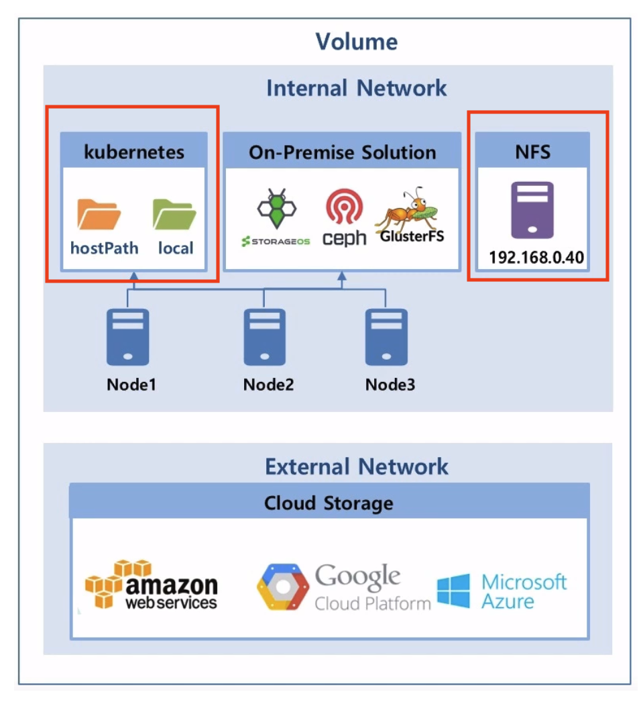

# k8s Middle Hands-on
 
kubernetes에서 Basic 과정에서 진행하지 못했던 부분 실습을 합니다.

1. Docker Hub Rate Limit

2. Helm

3. Kubernetes의 Node Scheduling

4. Storage Volume  ( PV/PVC , DB 설치 + NFS )

5. Service - Headless, Endpoint, ExternalName

6. Daemonset , Job , CronJob

7. configMap , Secret

8. NFS 라이브러리 설치 ( Native Kubernetes )

9. 참고 사이트 
    - Storage Volume : https://anggeum.tistory.com/m/entry/Kubernetes-Volume-Deep-Dive
    - Ubuntu NFS : https://server-talk.tistory.com/378
    - https://tech.osci.kr/2021/10/06/kubernetes-volume%EC%9D%84-%EA%B3%B5%EB%B6%80%ED%95%B4%EB%B3%B4%EC%9E%90/
    - 인프런 : 대세는 쿠버네티스
    - https://junior-developer.tistory.com/76?category=928073
    - https://zgundam.tistory.com/179
    - https://waspro.tistory.com/580


<br/>

***

<br/>

본장 에서는 실습하기에 앞서 Docker Hub의 image pull limit 으로 인하여 테스트용 도커 이미지는 GitHub의 Private Docker Registry에 Push를 하고 진행을 합니다.  


<br/>


## Docker Hub Rate Limit  

<br/>

Docker Hub 정책은 다음과 같습니다.  


|유저| 제한 |
|:--| :-------|  
| 익명 유저(docker login 안함)	| IP 기반으로 6시간동안 100번 request 제한 |
| 로그인 유저(docker login 함)	| 계정 기반으로 6시간동안 200번 request 가능 |
| 지불 계정 유저(docker login 한 Paid 유저)	| 제한 없음 (IP기반 제한은 있음 )|

<br/>

GitHub Container Registry에  도커 이미지 Push 하기.  

참고 : https://qiita.com/leechungkyu/items/f95998506d45feb15393


<br/>

***

<br/>

## Helm 

<br/>

참고 
- https://helm.sh/ko/docs/faq/
- https://coding-start.tistory.com/310
- https://devocean.sk.com/blog/techBoardDetail.do?ID=163262
- https://swalloow.github.io/umbrella-helm-chart/
- 악분일상 : https://malwareanalysis.tistory.com/202

<br/>
 
쿠버네티스에 서비스를 배포하기 위해 사용하는 대표적인 방법중에 하나가 바로 Helm chart 이다.
한마디로 말해서 Helm chart 는 쿠버네티스 용도의 패키징된 s/w 라 할 수 있다. Helm chart 문법은 go template 을 활용하였기 때문에 go template 을 안다면 조금 더 쉽게 이해할 수 있다.  

<br/>


<br/>

헬름은 클라이언트(cli)와 서버(쿠버네티스 클러스터에 설치되는 틸러)로 구성된다. 클라이언트는 서버를 대상으로 명령을 지시하는 역할을 한다. 서버는 클라이언트에서 전달받은 명령에 따라 쿠버네티스 클러스터에 패키지 설치, 업데이트, 삭제 등의 작업을 수행한다.  

<br/>

틸러 ( tiller )는 helm 2.x 에서 사용하고 3.x 부터는 없어짐.

<br/>

쿠버네티스는 서비스나 디플로이먼트, 인그레스 같은 리소스를 생성하고 매니페스트 파일을 적용하는 방식으로 애플리케이션을 배포한다. 이 매니페스트 파일을 생성하는 템플릿을 여러 개 패키징한 것이 차트다. 차트는 헬름 리포지토리에 tgz 파일로 저장되며, 틸러가 매니페스트를 생성하는 데 사용한다.

<br/>

우리는 Helm (v3)을 를 이미 설치 했기 때문에 별도 설치는 필요하지 않다.  

<br/>

### 기본 코드 생성하기  

<br/>

helm 폴더를 생성하고 해당  디렉토리로 이동해서 아래의 명령어로 기본 코드를 생성한다.

```bash
root@newedu:~# mkdir -p helm
root@newedu:~# cd helm
```  

```bash
root@newedu:~/helm# helm create umbrella
Creating umbrella
root@newedu:~/helm# l
umbrella/
root@newedu:~/helm# cd umbrella
root@newedu:~/helm/umbrella# ls
Chart.yaml  charts  templates  values.yaml
root@newedu:~/helm/umbrella# tree
.
├── Chart.yaml
├── charts
├── templates
│   ├── NOTES.txt
│   ├── _helpers.tpl
│   ├── deployment.yaml
│   ├── hpa.yaml
│   ├── ingress.yaml
│   ├── service.yaml
│   ├── serviceaccount.yaml
│   └── tests
│       └── test-connection.yaml
└── values.yaml

3 directories, 10 files
```  

<br/>

기본 생성되는 폴더 구조에서 requirements.yaml 파일은 추가로 생성해주셔야 합니다. 폴더 구조에서 알아두어야 할 경로는 아래와 같습니다.  

<br/>  

- Chart.yaml: 차트에 대한 메타 정보가 들어갑니다.
- charts/: 의존성이 있는 차트 패키지들이 설치됩니다.
- templates/: 차트에 필요한 template 파일들이 들어갑니다.
- templates/NOTES.txt: 차트 생성 시 나타나는 설명이 들어갑니다.
- requirements.yaml: 의존성 차트들이 들어갑니다.
- values.yaml: 차트 설정에 필요한 default 값들이 들어갑니다.

<br/>

Chart Metadata  

<br/>

먼저 Chart.yaml 파일을 간단히 수정해줍니다. 이름과 버전, 설명 등의 정보를 본인에 맞게 작성해주시면 됩니다.

<br/>

```bash
root@newedu:~/helm/umbrella# ls
Chart.yaml  charts  templates  values.yaml
root@newedu:~/helm/umbrella# vi Chart.yaml
apiVersion: v2
name: umbrella
description: A Edu  Helm chart for Kubernetes

# A chart can be either an 'application' or a 'library' chart.
#
# Application charts are a collection of templates that can be packaged into versioned archives
# to be deployed.
#
# Library charts provide useful utilities or functions for the chart developer. They're included as
# a dependency of application charts to inject those utilities and functions into the rendering
# pipeline. Library charts do not define any templates and therefore cannot be deployed.
type: application

# This is the chart version. This version number should be incremented each time you make changes
# to the chart and its templates, including the app version.
# Versions are expected to follow Semantic Versioning (https://semver.org/)
version: 0.1.0

# This is the version number of the application being deployed. This version number should be
# incremented each time you make changes to the application. Versions are not expected to
# follow Semantic Versioning. They should reflect the version the application is using.
# It is recommended to use it with quotes.
appVersion: "1.16.0"
```  

<br/>

Chart Dependencies    

<br/>  

이제 앞서 언급한 의존성 중에 Helm Chart 형태로 배포할 컴포넌트를 requirements.yaml 파일이 필요합니다.  

<br/>

우리는 values.yaml 화일만 수정하여 helm 으로 배포 해 보도록 하겠습니다.  

umbrella 폴더로 이동합니다.  

<br/>

```bash
root@newedu:~/helm/umbrella# vi values.yaml
```

<br/>

아래 화일에서 8,11,19 번 라인을 아래와 같이 수정합니다.  

```bash
  5 replicaCount: 1
  6
  7 image:
  8   repository: ghcr.io/shclub/nginx
  9   pullPolicy: IfNotPresent
 10   # Overrides the image tag whose default is the chart appVersion.
 11   tag: "1.14"
 17 serviceAccount:
 18   # Specifies whether a service account should be created
 19   create: false
```

<br/>

helm 폴더로 이동하여 아래 명령어 (--dry-run )로 helm 정보를 확인합니다.


<br/>

```bash
root@newedu:~/helm/umbrella# cd ..
```  

<br/>

```bash
root@newedu:~/helm# helm upgrade -i umbrella ./umbrella --dry-run --debug
history.go:56: [debug] getting history for release umbrella
Release "umbrella" does not exist. Installing it now.
install.go:178: [debug] Original chart version: ""
install.go:195: [debug] CHART PATH: /root/helm/umbrella

NAME: umbrella
LAST DEPLOYED: Mon Mar 20 10:11:48 2023
NAMESPACE: edu30
STATUS: pending-install
REVISION: 1
USER-SUPPLIED VALUES:
{}

COMPUTED VALUES:
affinity: {}
autoscaling:
  enabled: false
  maxReplicas: 100
  minReplicas: 1
  targetCPUUtilizationPercentage: 80
fullnameOverride: ""
image:
  pullPolicy: IfNotPresent
  repository: ghcr.io/shclub/nginx
  tag: "1.14"
imagePullSecrets: []
ingress:
  annotations: {}
  className: ""
  enabled: false
  hosts:
  - host: chart-example.local
    paths:
    - path: /
      pathType: ImplementationSpecific
  tls: []
nameOverride: ""
nodeSelector: {}
podAnnotations: {}
podSecurityContext: {}
replicaCount: 1
resources: {}
securityContext: {}
service:
  port: 80
  type: ClusterIP
serviceAccount:
  annotations: {}
  create: true
  name: ""
tolerations: []

HOOKS:
---
# Source: umbrella/templates/tests/test-connection.yaml
apiVersion: v1
kind: Pod
metadata:
  name: "umbrella-test-connection"
  labels:
    helm.sh/chart: umbrella-0.1.0
    app.kubernetes.io/name: umbrella
    app.kubernetes.io/instance: umbrella
    app.kubernetes.io/version: "1.16.0"
    app.kubernetes.io/managed-by: Helm
  annotations:
    "helm.sh/hook": test
spec:
  containers:
    - name: wget
      image: busybox
      command: ['wget']
      args: ['umbrella:80']
  restartPolicy: Never
MANIFEST:
---
# Source: umbrella/templates/serviceaccount.yaml
apiVersion: v1
kind: ServiceAccount
metadata:
  name: umbrella
  labels:
    helm.sh/chart: umbrella-0.1.0
    app.kubernetes.io/name: umbrella
    app.kubernetes.io/instance: umbrella
    app.kubernetes.io/version: "1.16.0"
    app.kubernetes.io/managed-by: Helm
---
# Source: umbrella/templates/service.yaml
apiVersion: v1
kind: Service
metadata:
  name: umbrella
  labels:
    helm.sh/chart: umbrella-0.1.0
    app.kubernetes.io/name: umbrella
    app.kubernetes.io/instance: umbrella
    app.kubernetes.io/version: "1.16.0"
    app.kubernetes.io/managed-by: Helm
spec:
  type: ClusterIP
  ports:
    - port: 80
      targetPort: http
      protocol: TCP
      name: http
  selector:
    app.kubernetes.io/name: umbrella
    app.kubernetes.io/instance: umbrella
---
# Source: umbrella/templates/deployment.yaml
apiVersion: apps/v1
kind: Deployment
metadata:
  name: umbrella
  labels:
    helm.sh/chart: umbrella-0.1.0
    app.kubernetes.io/name: umbrella
    app.kubernetes.io/instance: umbrella
    app.kubernetes.io/version: "1.16.0"
    app.kubernetes.io/managed-by: Helm
spec:
  replicas: 1
  selector:
    matchLabels:
      app.kubernetes.io/name: umbrella
      app.kubernetes.io/instance: umbrella
  template:
    metadata:
      labels:
        app.kubernetes.io/name: umbrella
        app.kubernetes.io/instance: umbrella
    spec:
      serviceAccountName: umbrella
      securityContext:
        {}
      containers:
        - name: umbrella
          securityContext:
            {}
          image: "ghcr.io/shclub/nginx:1.14"
          imagePullPolicy: IfNotPresent
          ports:
            - name: http
              containerPort: 80
              protocol: TCP
          livenessProbe:
            httpGet:
              path: /
              port: http
          readinessProbe:
            httpGet:
              path: /
              port: http
          resources:
            {}

NOTES:
1. Get the application URL by running these commands:
  export POD_NAME=$(kubectl get pods --namespace edu30 -l "app.kubernetes.io/name=umbrella,app.kubernetes.io/instance=umbrella" -o jsonpath="{.items[0].metadata.name}")
  export CONTAINER_PORT=$(kubectl get pod --namespace edu30 $POD_NAME -o jsonpath="{.spec.containers[0].ports[0].containerPort}")
  echo "Visit http://127.0.0.1:8080 to use your application"
  kubectl --namespace edu30 port-forward $POD_NAME 8080:$CONTAINER_PORT
```  

<br/> 

이상이 없으면 helm 을  사용하여 실제 배포를 합니다.  

<br/> 

```bash
root@newedu:~/helm# helm upgrade -i umbrella ./umbrella
Release "umbrella" does not exist. Installing it now.
NAME: umbrella
LAST DEPLOYED: Mon Mar 20 10:15:15 2023
NAMESPACE: edu30
STATUS: deployed
REVISION: 1
NOTES:
1. Get the application URL by running these commands:
  export POD_NAME=$(kubectl get pods --namespace edu30 -l "app.kubernetes.io/name=umbrella,app.kubernetes.io/instance=umbrella" -o jsonpath="{.items[0].metadata.name}")
  export CONTAINER_PORT=$(kubectl get pod --namespace edu30 $POD_NAME -o jsonpath="{.spec.containers[0].ports[0].containerPort}")
  echo "Visit http://127.0.0.1:8080 to use your application"
  kubectl --namespace edu30 port-forward $POD_NAME 8080:$CONTAINER_PORT
```

<br/> 

helm 배포 상태를 확인합니다.  

<br/>

```bash  
root@newedu:~/helm# helm list
NAME    	NAMESPACE	REVISION	UPDATED                                	STATUS  	CHART         	APP VERSION
umbrella	edu30    	1       	2023-03-20 10:15:15.481965122 +0900 KST	deployed	umbrella-0.1.0	1.16.0
```  


<br/>

pod가 정상적으로 기동 되어 있는지 확인합니다. 

<br/>

```bash
root@newedu:~/helm# kubectl get po
NAME                                        READY   STATUS    RESTARTS   AGE
umbrella-77d5bfbfc-j4rk6                    1/1     Running   0          11s
```

<br/>

service 가 정상적으로 기동 되어 있는지 확인합니다. 

<br/>

```bash
root@newedu:~/helm# kubectl get svc
NAME             TYPE        CLUSTER-IP       EXTERNAL-IP   PORT(S)          AGE
umbrella         ClusterIP   172.30.210.217   <none>        80/TCP           2m31s
```

<br/>

배포된 helm repository를 삭제 합니다.  

<br/>

```bash
root@newedu:~/helm# helm delete umbrella
release "umbrella" uninstalled
```  

<br/>


***

<br/>

##  Kubernetes의 Node Scheduling

<br/>

참고
- https://jangcenter.tistory.com/115

<br/>

Pod를 생성할 경우, 생성할 Pod가 어떤 노드에 할당되어야 할지 유저가 지정하거나 쿠버네티스에서 자동적으로 할당가능 또는 운영자가 특정 노드를 사용하지 못하도록 관리 가능  

<br/>

이를 Scheduling이라고 부르며 쿠버네티스는 다양한 기능으로 이러한 Scheduling을 지원  

<br/>

### 특정 Node 를 선택하는 방법 

<br/>

  

<br/>

NodeName  
- Pod를 생성하면서 특정 Node를 지정 Scheduler와 상관없이 Node에 할당됨 
- 명시적으로 사용할 수 있어 좋아보이지만, 실사용에서는 Node의 이름이 계속해서 변경되기 때문에 자주 사용하지는 않음  

<br/>

NodeSelector  
- Node의 Label(Key, Value)을 지정하여 해당 Node에 할당됨
- 같은 Label을 가진 Node 중에서는 Scheduler에 의해 자원이 많은 Node에 할당
- 매칭이 되는 Label(Node)가 없다면 어떠한 Node에도 할당이 안됨
- OKD는 Namepspace 에서 K8S는 Pod 에서 사용 가능 

<br/>

NodeAffinity
- NodeSelector를 보완하여 사용할 수 있는 기능
  - Node Affinity는 matchExpressions와 Required, Preferred의 옵션을 이용하여 복잡/세부적인 조건 구성 가능
    - Node Affinity의 2가지 옵션
      - Required : 해당 조건에 반드시 부합하는 Node에만 할당
      - Preferred : Required에 비해 유연한 선택이 가능
        - 해당 조건에 부합하지 않더라도 preferred Weight(가중치)에 의해 결정
          - Preferred Weight : Preferred 옵션에서 조건에 따른 가중치를 부여함  
          <br/>

            


### Pod간 집중/분산


<br/>

Node가 아닌 Pod를 기준으로 할당하는 방법 

<br/>

  

<br/>

Pod Affinity  
- 같은 PV 호스트패스를 사용한다면 Master Pod가 최초 할당된 Node에 Slave도 함께 생성
- 다수의 Pod가 네트워크와 같은 리소스 효율을 위해 동일한 Node에 동작하는 것이 효율적일 때 사용  

<br/>

Anti-Affinity
- Master와 Slave를 서로 다른 Node에 생성
- Pod들이 같이 있으면 해당 Node가 다운될 때, 서비스가 다운될 수도 있는 경우에 사용

<br/>

### 특정 Node에 대해 할당 제한 ( Toleration/Taint )

<br/>

  

<br/>

- 일반적인 경우에는 Node할당을 컨트롤하여, 해당 Node에는 Pod 생성이 되지 않게 함  
- Pod가 해당 Node를 직접 지정해도 할당 불가능
- Toleration옵션이 있어야만 할당가능
- GPU와 같이 특별한 하드웨어 옵션을 가진 Node를 이용하는 특정 Pod 배치에 유용하게 사용가능

<br/>

  

<br/>

- Taint / Toleration 의 옵션

<br/>

    


<br/>

특정 Node 에 nginx pod 를 기동하는 실습을 합니다.   

<br/>

먼저 node 이름을 확인합니다.  

<br/>

```bash  
root@newedu:~# kubectl get nodes
NAME               STATUS   ROLES    AGE     VERSION
edu.dmz-infra01    Ready    worker   272d    v1.20.0+bafe72f-1054
edu.dmz-infra02    Ready    worker   272d    v1.20.0+bafe72f-1054
edu.master01       Ready    master   272d    v1.20.0+bafe72f-1054
edu.master02       Ready    master   272d    v1.20.0+bafe72f-1054
edu.master03       Ready    master   272d    v1.20.0+bafe72f-1054
edu.monitoring01   Ready    worker   272d    v1.20.0+bafe72f-1054
edu.monitoring02   Ready    worker   272d    v1.20.0+bafe72f-1054
edu.worker01       Ready    worker   272d    v1.20.0+bafe72f-1054
edu.worker02       Ready    worker   272d    v1.20.0+bafe72f-1054
edu.worker03       Ready    worker   272d    v1.20.0+bafe72f-1054
edu.worker04       Ready    worker   272d    v1.20.0+bafe72f-1054
edu.worker05       Ready    worker   241d    v1.20.0+bafe72f-1054
edu.worker06       Ready    worker   193d    v1.20.0+bafe72f-1054
edu.worker07       Ready    worker   193d    v1.20.0+bafe72f-1054
edu.worker08       Ready    worker   5d      v1.20.0+bafe72f-1054
edu.worker09       Ready    worker   4d14h   v1.20.0+bafe72f-1054
```

<br/>

3번 worker node에 기동 하기 위해서 아래에 nodeName을 추가합니다.  

<br/>

```bash
root@newedu:~# vi nginx.yaml
apiVersion: apps/v1
kind: Deployment
metadata:
  name: nginx-deployment
  labels:
    app: nginx
spec:
  nodeName: edu.worker03  # node 추가
  replicas: 1
  selector:
    matchLabels:
      app: nginx
  template:
    metadata:
      labels:
        app: nginx
    spec:
      containers:
      - name: nginx
        image: ghcr.io/shclub/nginx:1.14
        ports:
        - containerPort: 80
```  

<br/>

***

<br/>

##  Storage Volume 

<br/>

kubernetes volume은  Pod의 구성 요소로  컨테이너 와 동일하게 Pod Spec에서 정의 된다.    

volume 은  kubernetes object가 아니므로 자체적으로 생성,삭제 될수 없다.  

volume 은 컨테이너에서 사용 가능 하지만 접근하려는 컨테이너에서  각각 마운트 되어야 한다. 각 컨테이너에서  파일 시스템의 어느 경로에나  볼륨을 마운트 할수 있다.  

<br/>

이번 실습에서는 Internal Network에서 로컬 볼륨과 NFS 볼륨을 대상으로 합니다.  



<br/>

***

### 1.1 로컬 볼륨

로컬 볼륨의 형태는 2가지가 있고 휘발성으로 인하여 자주 사용하지는 않는다.  
- emptyDir : Pod 내부의 Container들이 공유하는 임시 볼륨입니다.  
             emptyDir은 Pod가 기동되면서 생성되고 종료되면서 삭제됩니다.


- hostPath : Node ( VM인 경우 VM 서버 ) 에 있는 파일 시스템을  Pod의 디렉토리로   마운트 하는데 사용한다. pod가 다른 Node에 실행되면 사용 불가.  


<br/>


#### 1.1.1 emptyDir 

<br/>

대부분 POD는 1개의 컨테이너가 존재 하지만 여러개의 컨테이너가 있을 수도 있다.  


  

<br/>

아래 yaml 화일을 내용을 복사하여 emptyDir.yaml 화일을 생성 합니다.

<br/>

```bash
vi emptyDir.yaml
```  

emp-storage-pod 이라는 이름의 POD는 2개의 컨테이너로 구성이 되며
하나는 ubuntu-container, 또 하나는 nginx-container 입니다.  

같은 POD 안의 2개의 container 간에 logs 라는 폴더를 사용하여 데이터를 공유 할 수 있습니다.  

```bash
apiVersion: v1
kind: Pod
metadata:
  name: emp-storage-pod
spec:
  containers:
    - image: ghcr.io/shclub/ubuntu:18.04
      name: ubuntu-container
      command: ["tail","-f", "/dev/null"]
      volumeMounts:
        - mountPath: /logs
          name: emptydir-volume
    - image: ghcr.io/shclub/nginx:latest
      name: nginx-container
      volumeMounts:
        - mountPath: /logs
          name: emptydir-volume
  volumes:
    - name: emptydir-volume
      emptyDir: {}
```  

<br/>

본인의 namespace에 pod를 생성합니다.  


```bash
root@newedu-k3s:~# kubectl apply -f emptyDir.yaml 
pod/emp-storage-pod created
root@newedu-k3s:~# kubectl get po
NAME              READY   STATUS              RESTARTS   AGE
emp-storage-pod   0/2     ContainerCreating   0          8s
root@newedu-k3s:~# kubectl get po
NAME              READY   STATUS    RESTARTS   AGE
emp-storage-pod   2/2     Running   0          18s
```  

READY를 보면 하나의 pod에 READY 가 2/2로 되어 있는 것을 알 수 있습니다.  

컨테이너 이름을 모르면 아래 명령어를 사용하여 컨테이너 이름을 알수 있습니다.  

<br/>

```bash
root@newedu-k3s:~# kubectl describe po emp-storage-pod
Name:         emp-storage-pod
Namespace:    edu30
Priority:     0
Node:         newedu-k3s/172.27.0.41
Start Time:   Wed, 10 Aug 2022 08:03:16 +0000
Labels:       <none>
Annotations:  <none>
Status:       Running
IP:           10.42.0.169
IPs:
  IP:  10.42.0.169
Containers:
  ubuntu-container:
    Container ID:  containerd://6cdda9739a56356528252f95e10f4976881361beb3e1f711de983c52ce48d9ff
    Image:         ubuntu:18.04
    Image ID:      docker.io/library/ubuntu@sha256:eb1392bbdde63147bc2b4ff1a4053dcfe6d15e4dfd3cce29e9b9f52a4f88bc74
    Port:          <none>
    Host Port:     <none>
    Command:
      tail
      -f
      /dev/null
    State:          Running
      Started:      Wed, 10 Aug 2022 08:03:22 +0000
    Ready:          True
    Restart Count:  0
    Environment:    <none>
    Mounts:
      /logs from emptydir-volume (rw)
      /var/run/secrets/kubernetes.io/serviceaccount from kube-api-access-zlxq5 (ro)
  nginx-container:
    Container ID:   containerd://5f201c5ef11d04f1eaf8f2bf414cf278abbf6205045ba15821cfbeb6905e6387
    Image:          nginx:latest
    Image ID:       docker.io/library/nginx@sha256:ecc068890de55a75f1a32cc8063e79f90f0b043d70c5fcf28f1713395a4b3d49
    Port:           <none>
    Host Port:      <none>
    State:          Running
      Started:      Wed, 10 Aug 2022 08:03:29 +0000
    Ready:          True
    Restart Count:  0
    Environment:    <none>
    Mounts:
      /logs from emptydir-volume (rw)
      /var/run/secrets/kubernetes.io/serviceaccount from kube-api-access-zlxq5 (ro)
Conditions:
  Type              Status
  Initialized       True
  Ready             True
  ContainersReady   True
  PodScheduled      True
Volumes:
  emptydir-volume:
    Type:       EmptyDir 
    Medium:
    SizeLimit:  <unset>
  kube-api-access-zlxq5:
    Type:                    Projected (a volume that contains injected data from multiple sources)
    TokenExpirationSeconds:  3607
    ConfigMapName:           kube-root-ca.crt
    ConfigMapOptional:       <nil>
    DownwardAPI:             true
QoS Class:                   BestEffort
Node-Selectors:              <none>
Tolerations:                 node.kubernetes.io/not-ready:NoExecute op=Exists for 300s
                             node.kubernetes.io/unreachable:NoExecute op=Exists for 300s
Events:
  Type    Reason     Age   From               Message
  ----    ------     ----  ----               -------
  Normal  Scheduled  31s   default-scheduler  Successfully assigned storage-test/emp-storage-pod to newedu-k3s
  Normal  Pulling    31s   kubelet            Pulling image "ubuntu:18.04"
  Normal  Pulled     26s   kubelet            Successfully pulled image "ubuntu:18.04" in 5.706066951s
  Normal  Created    26s   kubelet            Created container ubuntu-container
  Normal  Started    26s   kubelet            Started container ubuntu-container
  Normal  Pulling    26s   kubelet            Pulling image "nginx:latest"
  Normal  Pulled     19s   kubelet            Successfully pulled image "nginx:latest" in 6.674048852s
  Normal  Created    19s   kubelet            Created container nginx-container
  Normal  Started    19s   kubelet            Started container nginx-container
``` 

<br/>

이제 ubuntu-container 에 shell 로 접속하여 logs 폴더에 화일을 하나 생성합니다.  

```bash
root@newedu-k3s:~# kubectl exec -it emp-storage-pod -c ubuntu-container sh
kubectl exec [POD] [COMMAND] is DEPRECATED and will be removed in a future version. Use kubectl exec [POD] -- [COMMAND] instead.
# ls
bin  boot  dev	etc  home  lib	lib64  logs  media  mnt  opt  proc  root  run  sbin  srv  sys  tmp  usr  var
# cd /logs
# ls
# echo "emptyDir test" >> edu.txt
# cat edu.txt
emptyDir test
# exit
```  

<br/>

ngix-container 에 shell 로 접속하여 logs 폴더에 생성된 edu.txt 라는 화일을 확인합니다.   

```bash
root@newedu-k3s:~# kubectl exec -it emp-storage-pod -c nginx-container sh 
kubectl exec [POD] [COMMAND] is DEPRECATED and will be removed in a future version. Use kubectl exec [POD] -- [COMMAND] instead.
# cd /logs
# ls
edu.txt
# cat edu.txt
emptyDir test
# exit
```  

<br/>

#### 1.1.2 hostPath 

<br/>

hostPath는 로컬 디스크의 경로를 Pod 에 Mount 해서 사용하는 Volume 방식입니다.  

Docker 에서 -v 옵션으로 Volume 을 연결하는 것과 동일하다고 생각하면 됩니다.   

   

<br/>


hostPath는 방식은 호스트 OS의 Docker(/var/lib/docker)에 접근해야 하거나 호스트 OS에서 개발한 환경을 Container 내부에 적용해야 하거나, 또는 반대로 컨테이너 환경에서 추가된 파일을 호스트 OS에서 사용해야 할 경우 유용하게 사용할 수 있습니다.  

hostPath는 방식의 경우 호스트 OS의 장애가 발생했을 경우 Pod를 실행할 수 없으며, 호스트 OS의 디스크에 대한 데이터 손실 또는 가용성 등에 대해 고려해야 합니다.  


아래 yaml 화일을 내용을 복사하여 hostpath.yaml 화일을 생성 합니다.

<br/>

```bash
vi hostpath.yaml
``` 

<br/>

hostpath를 사용하기 위해서는 securityContext를 설정해야 하고 ClusterAdmin이 권한을 할당해야 한다.  


```bash
oc adm policy add-scc-to-user privileged <유저>
```  


```bash
root@newedu:~# oc adm policy add-scc-to-user privileged edu1-admin
clusterrole.rbac.authorization.k8s.io/system:openshift:scc:privileged added: "edu1-admin"
```  
<br/>

serviceAccount에 권한을 줄 수도 있다.  
- default는 serviceAccount 이름  
- edu1는 namespace 이름
 
```bash
oc adm policy add-scc-to-user privileged -z default -n edu1
```  

<br/>

securityContext를 설정
```bash
      securityContext:
        privileged: true
```  

<br/>

hostpath.yaml
```bash
apiVersion: v1
kind: Pod
metadata:
  name: hostpath-storage-pod
spec:
  containers:
    - image: ghcr.io/shclub/nginx:latest
      name: nginx-container
      securityContext:
        privileged: true
      volumeMounts:
        - mountPath: /hostdir
          name: hostdir-volume
  volumes:
  - name: hostdir-volume
    hostPath:
      path: /root
      type: Directory
```  

<br/>

storage-test 라는 namespace를 사용하여 pod를 생성합니다.  
( 실습자는 본인의 namespace에서 실행 )   

```bash
root@newedu-k3s:~# kubectl apply -f hostpath.yaml -n storage-test
pod/hostpath-storage-pod created
root@newedu-k3s:~# kubectl get po -n storage-test
NAME                   READY   STATUS    RESTARTS   AGE
emp-storage-pod        2/2     Running   0          18m
hostpath-storage-pod   1/1     Running   0          13s
```  

<br/>

생성된 hostpath-storage-pod 에 shell 로 접근합니다.  

```bash
root@newedu-k3s:~# kubectl exec -it hostpath-storage-pod sh -n storage-test
kubectl exec [POD] [COMMAND] is DEPRECATED and will be removed in a future version. Use kubectl exec [POD] -- [COMMAND] instead.
# ls
bin   dev		   docker-entrypoint.sh  home	  lib	 media	opt   root  sbin  sys  usr
boot  docker-entrypoint.d  etc			 hostdir  lib64  mnt	proc  run   srv   tmp  var
```  

<br/>

hostdir로 이동을 하고 화일을 조회 해보면 현재 서버의 화일들이 있는 것을 확인 할 수 있다.    

```bash
# ls
bin   dev		   docker-entrypoint.sh  home	  lib	 media	opt   root  sbin  sys  usr
boot  docker-entrypoint.d  etc			 hostdir  lib64  mnt	proc  run   srv   tmp  var
# cd hostdir
# ls -al
total 12
drwx------. 4 root root  89 Jul 21 23:42 .
dr-xr-xr-x. 1 root root  54 Sep 15 06:12 ..
-rw-r--r--. 1 root root  18 Jun 20 08:04 .bash_logout
-rw-r--r--. 1 root root 141 Jun 20 08:04 .bash_profile
-rw-r--r--. 1 root root 376 Jun 20 08:04 .bashrc
drwx------. 3 root root  20 Jul 21 23:39 .config
drwx------. 2 root root  29 Jul 21 23:43 .ssh
# cd .ssh
# ls
authorized_keys
# cat authorized_keys
ssh-rsa AAAAB3NzaC1yc2EAAAADAQABAAABAQCuhPmv3xdhU7JbMoc/ecBTDxiGqFNKbe564p4aNT6JbYWjNwZ5z6E4iQQDQ0bEp7uBtB0aut0apqDF/SL7pN5ybh2X44aCwDaSEB6bJuJi0yMkZwIvenmtCA1LMAr2XifvGS/Ulac7Qh5vFzfw562cWC+IOI+LyQZAcPgr+CXphJhm8QQ+O454ItXurQX6oPlA2rNfF36fnxYss1ZvUYC80wWTi9k2+/XR3IoQXZHKCFsJiwyKO2CY+jShBbDBbtdOX3/ksHNVNStA/
```  

<br/>

즉 호스트 OS의 /root 디렉토리가 Pod 내부에서 /hostdir 디렉토리 위치에 마운트 된것을 확인할 수 있습니다.  

`위에 경우를 보면 알수 있듯 hostpath 권한을 허용 하면 안되는 이유 입니다.`  

hostPath 경우 ReadWriteOnce로만 적용이 가능하므로 Container 또는 서비스 별로 특정 디렉토리를 지정하여 로그에이전트가 수집하는 로그를 모으는 역할로 사용할 수 있습니다.  

<br/>

`NFS도 서버에서 Mount 한 후 hostPath로 설정 해서 사용 가능 하다. ` 


<br/>

hostPath Volume을 데이터 저장소로 채택하기에는 적합하지 않다.  

특정 노드의 FileSystem에 저장되므로 파드가 다른 노드로 Scheduling이 되면 더 이상 이전 데이터를 볼 수 없다.  

Pod가 어떤 노드에 Scheduling 되느냐에 따라 민감하기 때문에 일반적인 Pod에 사용하는 것은 좋은 생각이 아니다. 특수한 경우를 제외한다면 hostPath를 사용하는 것은 보안 및 활용성 측면에서 그다지 바람직하지 않다.  

<br/>

   

<br/>

***

### 1.2 네트웍 볼륨

Network Volume은 Persistent Volume(PV) 이외에 Persistent Volume Claim(이하 PVC)이 존재합니다.  


<br/>

#### 1.2.1 Persistent Volume

<br/>

Persistent Volume(이하 PV) 는 Kubernetes 에서 관리되는 저장소로 Pod 과는 다른 수명 주기로 관리됩니다.  

Pod 이 재실행 되더라도, PV의 데이터는 정책에 따라 유지/삭제가 됩니다.  

PV 생성은 Cluster 권한이 필요하면 일반 사용자는 생성이 불가능 하다.  

HostPath도 PV로 할당 가능 하지만 결국 Local 이기 때문에 큰 의미는 없다.  
    
<br/>

#### 1.2.2 Persistent Volume Claim

<br/>

Persistent Volume Claim(이하 PVC) 는 PV를 추상화하여 개발자가 손쉽게 PV를 사용 가능하게 만들어주는 기능입니다.  

개발자는 사용에 필요한 Volume의 크기, Volume의 정책을 선택하고 요청만 하면 됩니다.   

운영자는 개발자의 요청에 맞게 PV 를 생성하게 되고, PVC는 해당 PV를 가져가게 됩니다.  

PV 와 PVC는 1:1 관계이다.  

<br/>

#### 1.2.3 PV, PVC의 LifeCycle

<br/>

PV, PVC의 LifeCycle은 총 4가지 형태를 갖고 변화하게 됩니다.  


- Available : PV 생성
- Bound : PVC에 의해 바인딩 되었을 경우
- Released : PVC가 삭제되었을 경우
- Fail : PV에 문제가 발생하였을 경우  

LifeCycle은 Available → Bound → Released → Bound ... 순으로 반복되며, Released 즉 PVC가 삭제되었을 경우 실제 스토리지에 있는 파일을 어떻게 관리할 것인지에 대한 Reclaiming(재활용) 정책을 결정할 수 있습니다. 


PV, PVC의 Reclaiming 정책으로는 다음 세가지를 적용할 수 있습니다.  
- Retain : 삭제하지 않고 PV의 내용 유지
- Recycle : 재 사용이 가능하며, 재 사용시에는 데이타의 내용을 자동으로 rm -rf 로 삭제한 후 재사용
- Delete : 볼륨의 사용이 끝나면, 볼륨 삭제 (AWS EBS, GCE PD,Azure Disk 등)


<br/>

#### 1.2.5 Static Provisioning

<br/>


PV를 생성하고 PVC를 생성하는 방식을 Static Provisioning 이라 합니다. 

<br>

이번 실습은 NFS 서버를 PV로 사용하는 방식입니다.    

NFS 서버가 없는 경우 아래 deployment와 service yaml화일을 사용하여 임시로 컨테이너 NFS 서버를 구성 할 수 있다.    

<br/>

이미 NFS 서버가 있으면 skip.

<br/>


deployment 생성    

nfs-server-deployment.yaml  
```bash
apiVersion: apps/v1
kind: Deployment
metadata:
  name: nfs-server
spec:
  selector:
    matchLabels:
      role: nfs-server
  template:
    metadata:
      labels:
        role: nfs-server
    spec:
      containers:
      - name: nfs-server
        image: gcr.io/google_containers/volume-nfs:0.8
        ports:
          - name: nfs
            containerPort: 2049
          - name: mountd
            containerPort: 20048
          - name: rpcbind
            containerPort: 111
        securityContext:
          privileged: true
```  

<br/>


service 생성  

<br/>

nfs-server-service.yaml  
```bash
apiVersion: v1
kind: Service
metadata:
  name: nfs-service
spec:
  ports:
  - name: nfs
    port: 2049
  - name: mountd
    port: 20048
  - name: rpcbind
    port: 111
  selector:
    role: nfs-server
```  

<br/>

kt cloud 에서 FlyingCube를 생성 하면 NAS가 할당이 되고 nfs 서버가 활성화 되어 NAS에 연결 할 수 있다.  

nfs에 연결하여 NAS 폴더를 보기 위한 pod 를 아래 yaml 을 이용하여 생성한다.   
- nfs 연동하기 전에 nfs 에 mount 하여 폴더를 생성 해야 한다. ( database 폴더 생성. https://github.com/shclub/edu/blob/master/chapter9.md 참고 )  

<br/>

vi 에디터로 생성한다.    

```bash
root@newedu:~# vi busybox-nfs-test.yaml
```  

아래 내용을 복사하여 붙여 넣기 하고 저장하고 나온다.    
- busybox 도커 이미지는 경량의 이미지로 간단한 테스트를 할때 많이 사용  
- busybox pod는 실행 후 바로 종료 되기 때문에 sleep 을 설정 ( 예제는 365일 동안 기동 )  
  - `command: ["/bin/sleep", "365d"]`
- subPath는 mountPath 의 바로 아래 폴더를 지정 할 수 있음.  

<br/>

busybox-nfs-test.yaml
```bash
apiVersion: apps/v1
kind: Deployment
metadata:
  name: busybox-nfs-test
spec:
  replicas: 1
  selector:
    matchLabels:
      app: busybox-nfs-test
  template:
    metadata:
      labels:
        app: busybox-nfs-test
    spec:
      containers:
      - name: busybox
        image: ghcr.io/shclub/busybox:1.28
        command: ["/bin/sleep", "365d"]
        imagePullPolicy: IfNotPresent
        volumeMounts:
          - name: storage-volume
            mountPath: /data
            #subPath: edu1
      volumes:
        - name: storage-volume
          nfs:
            path: /share_8c0fade2_649f_4ca5_aeaa_8fd57904f8d5/database
            server: 172.25.1.162  
```  

<br/>

apply 명령어를 사용하여 pod를 생성합니다.  

```bash
root@newedu:~# kubectl apply -f busybox-nfs-test.yaml
deployment.apps/busybox-nfs-test created
root@newedu:~# kubectl get po
NAME                                READY   STATUS        RESTARTS   AGE
busybox-nfs-test-54754db755-jnxlh   1/1     Running       0          4s
```  

<br/>

shell을 사용하여 pod 안으로 들어 가서  data 폴더 에 마운트 된 NFS 폴더를 확인 합니다.    

```bash
root@newedu:~# kubectl exec -it busybox-nfs-test-54754db755-jnxlh sh
kubectl exec [POD] [COMMAND] is DEPRECATED and will be removed in a future version. Use kubectl exec [POD] -- [COMMAND] instead.
/ # ls
bin   data  dev   etc   home  proc  root  run   sys   tmp   usr   var
/ # cd data
/data # ls
edu1
edu1-data-my-release-mariadb-0-pvc-1e585a5a-d211-4b1a-ba17-6e0f07dfa99c
edu2
/data #
```  

<br/>

---

<br/>

이제 bitnami 의 helm chart를 이용하여 mariadb 를 설치 해보도록 합니다.  

mariadb는 NFS 통해 데이터를 저장합니다.   


먼저 nfs를 pv로 등록 ( Cluster 권한 : 인프라  ) 하고 
각 namespace별로 pvc를 생성 ( namespace 권한 : 개발팀 ) 합니다.  

pv 화일 : 교육생들은 불필요 ( 사전 생성 되었음 )      

db_pv.yaml  
```bash  
apiVersion: v1
kind: PersistentVolume
metadata:
  labels:
    storage: mariadb-pv1
  name: mariadb-pv1
spec:
  accessModes:
  - ReadWriteMany
  capacity:
    storage: 4Gi
  nfs:
    path: /share_8c0fade2_649f_4ca5_aeaa_8fd57904f8d5/database
    server: 172.25.1.162
  persistentVolumeReclaimPolicy: Retain
```  
<br/>

pvc 화일은 아래 내용을 복사하여 vi 에디터로 db_pvc.yaml 화일을 생성합니다.    
volumeName을 본인의 pv로 변경 한다.  
   
db_pvc.yaml  
```bash  
apiVersion: v1
kind: PersistentVolumeClaim
metadata:
  labels:
    app: mariadb-pvc
  name: mariadb-pvc
spec:
  storageClassName: "" 
  accessModes:
  - ReadWriteMany
  resources:
    requests:
      storage: 4Gi
  volumeName: mariadb-pv1
```

<br/>

이제 pv를 생성합니다 ( 교육생들은 불필요. 사전 생성 되었음 )  

```bash
root@newedu:~# kubectl apply -f db_pv.yaml
persistentvolume/mariadb-pv created
root@newedu:~# kubectl get pv
NAME                        CAPACITY   ACCESS MODES   RECLAIM POLICY   STATUS      CLAIM                                                     STORAGECLASS   REASON   AGE
elasticsearch-data-0-pv     20Gi       RWO            Retain           Bound       edu-efk/elasticsearch-data-0                                                      10d
elasticsearch-kibana-pv     10Gi       RWO            Retain           Bound       edu-efk/elasticsearch-kibana                                                      10d
elasticsearch-master-0-pv   5Gi        RWO            Retain           Bound       edu-efk/elasticsearch-master-0                                                    10d
image-registry-pv           100Gi      RWX            Retain           Bound       openshift-image-registry/image-registry-storage                                   87d
jenkins-restore-pv          100Gi      RWX            Retain           Bound       devops/jenkins-restore-pvc                                                        43d
mariadb-pv-ojt1             8Gi        RWX            Retain           Available                                                                                     16d
mariadb-pv-ojt2             8Gi        RWX            Retain           Available                                                                                     16d
mariadb-pv-ojt3             8Gi        RWX            Retain           Available                                                                                     16d
mariadb-pv-ojt4             8Gi        RWX            Retain           Available                                                                                     16d
mariadb-pv-ojt5             8Gi        RWX            Retain           Available                                                                                     16d
mariadb-pv-ojt6             8Gi        RWX            Retain           Available                                                                                     16d
mariadb-pv1                 4Gi        RWX            Retain           Released    edu1/mariadb-pvc                                                                  16d
mariadb-pv10                4Gi        RWX            Retain           Available                                                                                     16d
mariadb-pv11                4Gi        RWX            Retain           Bound       edu11/mariadb-pvc                                                                 16d
mariadb-pv12                4Gi        RWX            Retain           Bound       edu12/mariadb-pvc                                                                 16d
mariadb-pv13                4Gi        RWX            Retain           Available                                                                                     16d
mariadb-pv14                4Gi        RWX            Retain           Bound       edu14/mariadb-pvc                                                                 16d
mariadb-pv15                4Gi        RWX            Retain           Bound       edu15/mariadb-pvc                                                                 16d
mariadb-pv16                4Gi        RWX            Retain           Bound       edu16/mariadb-pvc                                                                 16d
mariadb-pv17                4Gi        RWX            Retain           Available
```  

<br>

정상적으로 mariadb-pv<번호> 라는 이름으로 pv가 생성 되었습니다. 

<br/>

위의 과정은 Cluster 권한을 가진 admin 관리자가 수행하며 Namespace 권한을 가진 일반 유저는
PVC를 생성 합니다.  

<br/>

```bash
root@newedu:~# kubectl apply -f db_pvc.yaml
persistentvolumeclaim/mariadb-pvc created
root@newedu:~# kubectl get pvc
NAME          STATUS    VOLUME       CAPACITY   ACCESS MODES   STORAGECLASS   AGE
mariadb-pvc   Pending   mariadb-pv   0                                        5s
root@newedu:~# kubectl get pvc
NAME          STATUS   VOLUME       CAPACITY   ACCESS MODES   STORAGECLASS   AGE
mariadb-pvc   Bound    mariadb-pv   600Gi      RWX                           6s
```  

<br/>

pvc 가  정상적으로 pv에 연결되면 STATUS가 Bound 로 표시됩니다.  

<br/>

이제 helm repository를 추가 합니다.  

<br/>

```bash
root@newedu:~# helm repo update
Hang tight while we grab the latest from your chart repositories...
...Successfully got an update from the "bitnami" chart repository
Update Complete. ⎈Happy Helming!⎈
root@newedu:~# helm repo add bitnami https://charts.bitnami.com/bitnami
root@newedu:~# helm repo list
NAME   	URL
bitnami	https://charts.bitnami.com/bitnami
root@newedu:~# helm search repo mariadb
NAME                  	CHART VERSION	APP VERSION	DESCRIPTION
bitnami/mariadb       	11.2.1       	10.6.9     	MariaDB is an open source, community-developed ...
bitnami/mariadb-galera	7.4.1        	10.6.9     	MariaDB Galera is a multi-primary database clus...
bitnami/phpmyadmin    	10.3.1       	5.2.0      	phpMyAdmin is a free software tool written in P...
root@newedu:~# helm list
NAME	NAMESPACE	REVISION	UPDATED	STATUS	CHART	APP VERSION
root@newedu:~# helm install my-release bitnami/mariadb
NAME: my-release
LAST DEPLOYED: Mon Aug 29 16:00:23 2022
NAMESPACE: edu1
STATUS: deployed
REVISION: 1
TEST SUITE: None
NOTES:
CHART NAME: mariadb
CHART VERSION: 11.2.1
APP VERSION: 10.6.9

** Please be patient while the chart is being deployed **

Tip:

  Watch the deployment status using the command: kubectl get pods -w --namespace edu1 -l app.kubernetes.io/instance=my-release

Services:

  echo Primary: my-release-mariadb.edu1.svc.cluster.local:3306

Administrator credentials:

  Username: root
  Password : $(kubectl get secret --namespace edu1 my-release-mariadb -o jsonpath="{.data.mariadb-root-password}" | base64 -d)

To connect to your database:

  1. Run a pod that you can use as a client:

      kubectl run my-release-mariadb-client --rm --tty -i --restart='Never' --image  docker.io/bitnami/mariadb:10.6.9-debian-11-r0 --namespace edu1 --command -- bash

  2. To connect to primary service (read/write):

      mysql -h my-release-mariadb.edu1.svc.cluster.local -uroot -p my_database

To upgrade this helm chart:

  1. Obtain the password as described on the 'Administrator credentials' section and set the 'auth.rootPassword' parameter as shown below:

      ROOT_PASSWORD=$(kubectl get secret --namespace edu1 my-release-mariadb -o jsonpath="{.data.mariadb-root-password}" | base64 -d)
      helm upgrade --namespace edu1 my-release bitnami/mariadb --set auth.rootPassword=$ROOT_PASSWORD
```  

<br/>

위와 같이 설치를 하면 pod가 하나도 생성이 되지 않고 에러가 발생합니다.  

pod가 생성되지 않은 상태에서 에러를 보는 명령어는 `kubectl get events` 입니다.  

명령어를 실행해 보면  

```bash
root@newedu:~# kubectl get events -n edu30 | grep mariadb
my-release-mariadb           create Pod my-release-mariadb-0 in StatefulSet my-release-mariadb failed error: pods "my-release-mariadb-0" is forbidden: unable to validate against any security context constraint: [provider restricted: .spec.securityContext.fsGroup: Invalid value: []int64{1000660000}: 1000660000 is not an allowed group spec.containers[0].securityContext.runAsUser: Invalid value: 1000660000: must be in the ranges: [1001420000, 1001429999]]
```  

위의 메시지를 보면 fsgroup의 값이 잘못 되어 다고 나오고 range 의 값을 사용하라는 메시지 입니다.  

helm 으로 재설치 할때 fsgroup과 runAsUser의 값을 변경하고 실행 해야 합니다.  


<br/>

재설치 하기 위해 helm 으로 생성된 my-release 차트를 삭제합니다.  

```bash
root@newedu:~# helm delete my-release
release "my-release" uninstalled
root@newedu:~# helm list
NAME	NAMESPACE	REVISION	UPDATED	STATUS	CHART	APP VERSION
```  

<br/>

Namespace 마다 sa.scc.uid-rang 값이 다르기 때문에   

아래 명령어로 range 를 확인한다.  

```bash
kubectl describe namespace <namespace>
```  

<br/>


```bash
root@newedu:~# kubectl describe namespace edu30
Name:         edu30
Labels:       <none>
Annotations:  openshift.io/description:
              openshift.io/display-name: edu30
              openshift.io/node-selector: edu=true
              openshift.io/sa.scc.mcs: s0:c38,c7
              openshift.io/sa.scc.supplemental-groups: 1001420000/10000
              openshift.io/sa.scc.uid-range: 1001420000/10000
Status:       Active

No resource quota.

No LimitRange resource.
```  

<br/>

helm chart에서는 values.yaml 화일이 있는데 사용자가 custom 할수 있는
yaml 화일 입니다.  

우리는 기본값으로 설치하지 않고 우리 환경에 맞게 수정하여 설치한다.

https://github.com/bitnami/charts/blob/master/bitnami/mariadb/values.yaml 사이트에서 values.yaml 를 다운 받고 수정한다.  

<br/>

설치 조건
- 서버 구성 : Primary 만 구성. secondary는 replica 0로 변경
- hostport : 사용 안함 ( 외부에서 접속을 위한 port )
- 아이디/패스워드 : edu / edu1234
- root 비밀번호 : 아이디와 동일
- DB 이름 : edu
- subPath: 본인 namespace/my-mariadb
- 도커 레지스트리 : docker hub ( private docker registry 이면 별도 설정 )
- podSecurityContext.fsGroup :  OKD의 경우 1000660000 로 수정 ( k3s는 불필요 )
- db사이즈는 4Gi 이상  

<br/>

```bash
root@newedu:~# helm show values bitnami/mariadb > values.yaml
```  

vi 데이터에서 생성된 values.yaml을 연다.  

```bash
root@newedu:~# vi values.yaml
```  

라인을 보기 위해 ESC 를 누른 후 `:set nu` 를 입력하면 왼쪽에 라인이 보인다.  

아래 라인을 찾아 값을 변경한다.  

<br/>

```bash
 107   rootPassword: edu1234
 111   database: edu
 115   username: edu
 118   password: edu1234
...
 301   podSecurityContext:
 302     enabled: true
 303     fsGroup: 1001420000 #1001
...

 424   persistence:
 431     existingClaim: "mariadb-pvc"
 434     subPath: "edu1/my-mariadb"
 452     size: 4Gi
 ...

 543 secondary:
 546   name: secondary
 549   replicaCount: 0

```  

<br/>

위의 화일을 수정하기 힘든 경우 아래 링크에서 다운 받습니다.  
- https://github.com/shclub/edu14/blob/master/values.yaml  

본인의 namespace 이름만 변경 하면 됩니다. 지금은 subPath edu1 로 설정 되어 있음.  

<br/>

화일 수정방법은 시간이 걸리기  때문에 아래 명령어를 사용하여 설치합니다.  

```bash
root@newedu:~# helm install my-release bitnami/mariadb -f values.yaml  \
--set auth.rootPassword=edu1234 \
--set auth.database=edu \
--set auth.username=edu  \
--set auth.password=edu1234 \
--set primary.podSecurityContext.fsGroup=1001420000 \
--set primary.containerSecurityContext.runAsUser=1001420000 \
--set primary.persistence.existingClaim=mariadb-pvc \
--set primary.persistence.subPath=edu1/my-mariadb  \
--set primary.persistence.size=4Gi  \
--set secondary.replicaCount=0
```  

<br/>

정상적으로 동작 하는지 확인한다.  

helm list 명령어로 확인해보고 pod 를 조회한다.  

<br/>

```bash
root@newedu:~# helm list
NAME      	NAMESPACE	REVISION	UPDATED                                	STATUS  	CHART         	APP VERSION
my-release	edu30    	1       	2022-09-14 16:30:27.937973478 +0900 KST	deployed	mariadb-11.3.0	10.6.9
root@newedu:~# kubectl get po
NAME                                READY   STATUS    RESTARTS   AGE
busybox-nfs-test-54754db755-jnxlh   1/1     Running   0          79m
my-release-mariadb-0                0/1     Running   0          31s
```  

해당 POD의 로그를 확인한다.  

```bash
root@newedu:~# kubectl logs my-release-mariadb-0
mariadb 06:39:37.09
mariadb 06:39:37.09 Welcome to the Bitnami mariadb container
mariadb 06:39:37.09 Subscribe to project updates by watching https://github.com/bitnami/containers
mariadb 06:39:37.09 Submit issues and feature requests at https://github.com/bitnami/containers/issues
mariadb 06:39:37.09
mariadb 06:39:37.09 INFO  ==> ** Starting MariaDB setup **
mariadb 06:39:37.11 INFO  ==> Validating settings in MYSQL_*/MARIADB_* env vars
mariadb 06:39:37.11 INFO  ==> Initializing mariadb database
mariadb 06:39:37.12 WARN  ==> The mariadb configuration file '/opt/bitnami/mariadb/conf/my.cnf' is not writable. Configurations based on environment variables will not be applied for this file.
mariadb 06:39:37.13 INFO  ==> Installing database
mariadb 06:39:47.10 INFO  ==> Starting mariadb in background
2022-09-01  6:39:47 0 [Note] InnoDB: Compressed tables use zlib 1.2.11
2022-09-01  6:39:47 0 [Note] InnoDB: Number of pools: 1
2022-09-01  6:39:47 0 [Note] InnoDB: Using crc32 + pclmulqdq instructions
2022-09-01  6:39:47 0 [Note] mysqld: O_TMPFILE is not supported on /opt/bitnami/mariadb/tmp (disabling future attempts)
2022-09-01  6:39:47 0 [Note] InnoDB: Using Linux native AIO
2022-09-01  6:39:47 0 [Note] InnoDB: Initializing buffer pool, total size = 134217728, chunk size = 134217728
2022-09-01  6:39:47 0 [Note] InnoDB: Completed initialization of buffer pool
2022-09-01  6:39:47 0 [Note] InnoDB: 128 rollback segments are active.
2022-09-01  6:39:47 0 [Note] InnoDB: Creating shared tablespace for temporary tables
2022-09-01  6:39:47 0 [Note] InnoDB: Setting file './ibtmp1' size to 12 MB. Physically writing the file full; Please wait ...
2022-09-01  6:39:50 0 [Note] InnoDB: File './ibtmp1' size is now 12 MB.
2022-09-01  6:39:50 0 [Note] InnoDB: 10.6.9 started; log sequence number 42147; transaction id 14
2022-09-01  6:39:50 0 [Note] Plugin 'FEEDBACK' is disabled.
2022-09-01  6:39:50 0 [Note] InnoDB: Loading buffer pool(s) from /bitnami/mariadb/data/ib_buffer_pool
2022-09-01  6:39:50 0 [Note] Server socket created on IP: '127.0.0.1'.
2022-09-01  6:39:50 0 [Warning] 'user' entry 'root@my-release-mariadb-0' ignored in --skip-name-resolve mode.
2022-09-01  6:39:50 0 [Warning] 'user' entry '@my-release-mariadb-0' ignored in --skip-name-resolve mode.
2022-09-01  6:39:50 0 [Warning] 'proxies_priv' entry '@% root@my-release-mariadb-0' ignored in --skip-name-resolve mode.
2022-09-01  6:39:50 0 [Note] InnoDB: Buffer pool(s) load completed at 220901  6:39:50
2022-09-01  6:39:50 0 [Note] /opt/bitnami/mariadb/sbin/mysqld: ready for connections.
Version: '10.6.9-MariaDB'  socket: '/opt/bitnami/mariadb/tmp/mysql.sock'  port: 3306  Source distribution
mariadb 06:39:51.12 INFO  ==> Configuring authentication
2022-09-01  6:39:51 5 [Warning] 'proxies_priv' entry '@% root@my-release-mariadb-0' ignored in --skip-name-resolve mode.
mariadb 06:39:51.23 INFO  ==> Running mysql_upgrade
2022-09-01  6:40:00 23 [Warning] 'proxies_priv' entry '@% root@my-release-mariadb-0' ignored in --skip-name-resolve mode.
find: '/docker-entrypoint-startdb.d/': No such file or directory
mariadb 06:40:00.43 INFO  ==> Stopping mariadb
2022-09-01  6:40:00 0 [Note] /opt/bitnami/mariadb/sbin/mysqld (initiated by: unknown): Normal shutdown
2022-09-01  6:40:00 0 [Note] InnoDB: FTS optimize thread exiting.
2022-09-01  6:40:00 0 [Note] InnoDB: Starting shutdown...
2022-09-01  6:40:00 0 [Note] InnoDB: Dumping buffer pool(s) to /bitnami/mariadb/data/ib_buffer_pool
2022-09-01  6:40:00 0 [Note] InnoDB: Buffer pool(s) dump completed at 220901  6:40:00
2022-09-01  6:40:00 0 [Note] InnoDB: Removed temporary tablespace data file: "./ibtmp1"
2022-09-01  6:40:00 0 [Note] InnoDB: Shutdown completed; log sequence number 42159; transaction id 18
2022-09-01  6:40:00 0 [Note] /opt/bitnami/mariadb/sbin/mysqld: Shutdown complete


mariadb 06:40:01.45 INFO  ==> ** MariaDB setup finished! **
mariadb 06:40:01.47 INFO  ==> ** Starting MariaDB **
2022-09-01  6:40:01 0 [Note] /opt/bitnami/mariadb/sbin/mysqld (server 10.6.9-MariaDB) starting as process 1 ...
2022-09-01  6:40:01 0 [Note] InnoDB: Compressed tables use zlib 1.2.11
2022-09-01  6:40:01 0 [Note] InnoDB: Number of pools: 1
2022-09-01  6:40:01 0 [Note] InnoDB: Using crc32 + pclmulqdq instructions
2022-09-01  6:40:01 0 [Note] mysqld: O_TMPFILE is not supported on /opt/bitnami/mariadb/tmp (disabling future attempts)
2022-09-01  6:40:01 0 [Note] InnoDB: Using Linux native AIO
2022-09-01  6:40:01 0 [Note] InnoDB: Initializing buffer pool, total size = 134217728, chunk size = 134217728
2022-09-01  6:40:01 0 [Note] InnoDB: Completed initialization of buffer pool
2022-09-01  6:40:01 0 [Note] InnoDB: 128 rollback segments are active.
2022-09-01  6:40:01 0 [Note] InnoDB: Creating shared tablespace for temporary tables
2022-09-01  6:40:01 0 [Note] InnoDB: Setting file './ibtmp1' size to 12 MB. Physically writing the file full; Please wait ...
2022-09-01  6:40:04 0 [Note] InnoDB: File './ibtmp1' size is now 12 MB.
2022-09-01  6:40:04 0 [Note] InnoDB: 10.6.9 started; log sequence number 42159; transaction id 14
2022-09-01  6:40:04 0 [Note] Plugin 'FEEDBACK' is disabled.
2022-09-01  6:40:04 0 [Note] InnoDB: Loading buffer pool(s) from /bitnami/mariadb/data/ib_buffer_pool
2022-09-01  6:40:04 0 [Note] Server socket created on IP: '0.0.0.0'.
2022-09-01  6:40:04 0 [Note] Server socket created on IP: '::'.
2022-09-01  6:40:04 0 [Note] InnoDB: Buffer pool(s) load completed at 220901  6:40:04
2022-09-01  6:40:04 0 [Warning] 'proxies_priv' entry '@% root@my-release-mariadb-0' ignored in --skip-name-resolve mode.
2022-09-01  6:40:04 0 [Note] /opt/bitnami/mariadb/sbin/mysqld: ready for connections.
Version: '10.6.9-MariaDB'  socket: '/opt/bitnami/mariadb/tmp/mysql.sock'  port: 3306  Source distribution
```  

<br/>

에러가 없으면 DB 기동이 완료 된 것으로 볼수 있고  
해당 pod에 들어가서 DB 에 접속해 본다.  (비밀번호 edu1234 )  

```bash
root@newedu:~# kubectl exec -it my-release-mariadb-0 sh
kubectl exec [POD] [COMMAND] is DEPRECATED and will be removed in a future version. Use kubectl exec [POD] -- [COMMAND] instead.
$ mysql -u edu1 -p
Enter password:
Welcome to the MariaDB monitor.  Commands end with ; or \g.
Your MariaDB connection id is 34
Server version: 10.6.9-MariaDB Source distribution

Copyright (c) 2000, 2018, Oracle, MariaDB Corporation Ab and others.

Type 'help;' or '\h' for help. Type '\c' to clear the current input statement.

MariaDB [(none)]> show databases;
+--------------------+
| Database           |
+--------------------+
| edu               |
| information_schema |
| test               |
+--------------------+
3 rows in set (0.002 sec)
```  

<br/>

mariadb에서 exit 하고 pod 안에서  아래 폴더를 조회해 본다.  
data 폴더에 보면 db 관련 화일이 생성 되어 있다.  

```bash
MariaDB [(none)]> exit
Bye
$ ls /bitnami/mariadb/data
aria_log.00000001  ddl_recovery.log  ib_buffer_pool  ibdata1  multi-master.info  mysql_upgrade_info  sys
aria_log_control   edu1		     ib_logfile0     ibtmp1   mysql		 performance_schema  test
```  

<br/>

nfs 서버에 들어가면 아래와 같이 폴더가 생성 된것을 확인 할 수 있다. ( 워커노드에서 조회 ).  

교육생들은 위에서 생성한 busybox-nfs-test pod에 들어가서 확인 할 수 있다.  

DB를 재기동 하더라도 데이터는 남아 있다.  

```bash
root@newedu:~# kubectl exec -it busybox-nfs-test-687b87878d-25h99
kubectl exec [POD] [COMMAND] is DEPRECATED and will be removed in a future version. Use kubectl exec [POD] -- [COMMAND] instead.
/ # ls
bin   data  dev   etc   home  proc  root  run   sys   tmp   usr   var
/ # cd data
/data # ls
edu12         edu15         edu20         edu30         edu8          edu11         edu14         edu16         edu24         edu4        
/data/edu30 # ls
my-mariadb
/data/edu30 # ls my-mariadb/data
aria_log.00000001   edu                 ibdata1             mysql               sys
aria_log_control    ib_buffer_pool      ibtmp1              mysql_upgrade_info  test
ddl_recovery.log    ib_logfile0         multi-master.info   performance_schema  
```  

<br/>

> TIP :  다른 Namespace 의 서비스 호출 하는 방법

본인의 Namespace 의 curl 명령어가 있는 POD에 들어간다.
- 예제는 : edu30 namespace 에서 edu9의 특정 서비스 호출   

```bash
root@newedu:~ # kubectl exec -it hostpath-storage-pod sh -n edu30
kubectl exec [POD] [COMMAND] is DEPRECATED and will be removed in a future version. Use kubectl exec [POD] -- [COMMAND] instead.
```  

다른 namesapce의 서비스를 조회해 본다. ( 단, 다른 namespace 접근 권한 필요. 예제는 edu9  namespace 호출 )  

여기서는  flask-edu4-app 서비스의 5000 포트로 접속해 본다.  

```bash
root@newedu:~# kubectl get svc -n edu9
NAME                        TYPE        CLUSTER-IP       EXTERNAL-IP   PORT(S)          AGE
flask-edu4-app              NodePort    172.30.63.230    <none>        5000:31081/TCP   42h
```  

<br/>

호출 규칙은 아래와 같다.  

-  <서비스 이름 >.< 호출할 namespace이름>.svc.cluster.local:<서비스 포트>

```bash
# curl http://flask-edu4-app.edu9.svc.cluster.local:5000
 Container EDU | POD Working : flask-edu4-app-757bcc87db-mmnz2 | v=2
```  

다른 namespace 서비스가 호출 되는 것을 볼 수 있다.  

<br/>

#### 1.2.6 Dynamic Provisioning 

<br/>

Static Provisioning 의 문제는 인프라에서 pv를 수동으로 생성을 해야 하고 업무팀에서 그에 맡게 pvc를 생성을 하는 번거로움이 있다.  

Dynamic Provisioning 은  프로비저너를 사용하여 자동으로  pvc/pv를 생성 할 수 있다.   

이번 예제는 NFS 서버를 위한 프로지저너를 사용하여 Dynamic Provisioning을 실습 한다.  

쿠버네티스에는 내장 NFS 프로비저너가 없다. NFS를 위한 스토리지클래스를 생성하려면 외부 프로비저너를 사용해야 한다. 쿠버네티스 1.19 이상에서 지원 한다.   

<br/>

NFS subdir external provisioner  

NFS 서버를 사용하여 PVC를 통해 Kubernetes PV의 동적 프로비저닝을 지원하는 자동 프로비저닝 도구입니다.  

- PVC(Persistent Volume Claim)에 대한 쿠버네티스 PV(Persistent Volume)를동적으로 프로비저닝하기 위하여 사전에 구성된 NFS server를 사용하는 automatic provisioner이다.  

- PV는 네이밍 규칙에 맞게 프로비저닝된다.  

<br/>

참고 
- https://1week.tistory.com/114 ( Native K8S deployment )
- https://kubepia.github.io/cloudpak/cp4app/install/ocp04.html ( OKD helm)

<br/>

우리는 helm (3.x) 을 사용하여 배포하도록 한다.  
기존 helm chart를 수정하기 위하여
https://github.com/kubernetes-sigs/nfs-subdir-external-provisioner/blob/master/charts/nfs-subdir-external-provisioner  링크에서 values.yaml 화일의 내용을 복사한다.  


복사한 내용을 vi dynamic_values.yaml 이라는 화일을 생성하여 붙여 넣기 한다.  

```bash
root@newedu:~# vi dynamic_values.yaml
```  

<br/>

dynamic_values.yaml 에서 변경 내용    
- nfs server: 172.25.1.162
- nfs path : /share_8c0fade2_649f_4ca5_aeaa_8fd57904f8d5/database
- reclaimPolicy: Retain
- archiveOnDelete: false ( 삭제시 아키이브 폴더를 만들지 않는다.)
- podSecurityPolicy:  ( OKD 인 경우만 사용 )
  enabled: true
- podSecurityContext:  ( OKD 인 경우 만 사용 )
  fsGroup: 1001420000 
- storageclass 에 reclaimPolicy: Delete를 하면 PVC 삭제시 pv와 nfs에서 생성된 폴더가 같이 삭제 된다.  

<br/>

dynamic_values.yaml
```bash
replicaCount: 1
strategyType: Recreate

image:
  repository: k8s.gcr.io/sig-storage/nfs-subdir-external-provisioner
  tag: v4.0.2
  pullPolicy: IfNotPresent
imagePullSecrets: []

nfs:
  server: 172.25.1.162
  path: /share_8c0fade2_649f_4ca5_aeaa_8fd57904f8d5/database
  mountOptions:
  volumeName: nfs-subdir-external-provisioner-root
  # Reclaim policy for the main nfs volume
  reclaimPolicy: Retain

# For creating the StorageClass automatically:
storageClass:
  create: true

  # Set a provisioner name. If unset, a name will be generated.
  # provisionerName:

  # Set StorageClass as the default StorageClass
  # Ignored if storageClass.create is false
  defaultClass: false

  # Set a StorageClass name
  # Ignored if storageClass.create is false
  name: nfs-client

  # Allow volume to be expanded dynamically
  allowVolumeExpansion: true

  # Method used to reclaim an obsoleted volume
  reclaimPolicy: Delete

  # When set to false your PVs will not be archived by the provisioner upon deletion of the PVC.
  archiveOnDelete: false

  # If it exists and has 'delete' value, delete the directory. If it exists and has 'retain' value, save the directory.
  # Overrides archiveOnDelete.
  # Ignored if value not set.
  onDelete:

  # Specifies a template for creating a directory path via PVC metadata's such as labels, annotations, name or namespace.
  # Ignored if value not set.
  pathPattern:

  # Set access mode - ReadWriteOnce, ReadOnlyMany or ReadWriteMany
  accessModes: ReadWriteOnce

  # Set volume bindinng mode - Immediate or WaitForFirstConsumer
  volumeBindingMode: Immediate

  # Storage class annotations
  annotations: {}

leaderElection:
  # When set to false leader election will be disabled
  enabled: true

## For RBAC support:
rbac:
  # Specifies whether RBAC resources should be created
  create: true

# If true, create & use Pod Security Policy resources
# https://kubernetes.io/docs/concepts/policy/pod-security-policy/
podSecurityPolicy:
  enabled: true

# Deployment pod annotations
podAnnotations: {}

## Set pod priorityClassName
# priorityClassName: ""

podSecurityContext:
  fsGroup: 1001420000 #1001

securityContext: {}

serviceAccount:
  # Specifies whether a ServiceAccount should be created
  create: true

  # Annotations to add to the service account
  annotations: {}

  # The name of the ServiceAccount to use.
  # If not set and create is true, a name is generated using the fullname template
  name:

resources: {}
  # limits:
  #  cpu: 100m
  #  memory: 128Mi
  # requests:
  #  cpu: 100m
  #  memory: 128Mi

nodeSelector: {}

tolerations: []

affinity: {}

# Additional labels for any resource created
labels: {}
```  

<br/>

이제 설치를 합니다. 프로비저너 설치는 Cluster 권한이 필요 합니다.  ( 교육생들은 불필요. 강사가 사전에 진행함 )  

helm repository를 추가합니다.  

```bash
root@newedu:~# helm repo add nfs-subdir-external-provisioner https://kubernetes-sigs.github.io/nfs-subdir-external-provisioner
root@newedu:~# helm repo list
NAME                           	URL
bitnami                        	https://charts.bitnami.com/bitnami
nfs-subdir-external-provisioner	https://kubernetes-sigs.github.io/nfs-subdir-external-provisioner/
```  

helm 을 사용하여 NFS subdir external provisioner 를 설치 합니다.  
수정한 dynamic_values.yaml 를 사용합니다.  

```bash
root@newedu:~# helm install nfs-subdir-external-provisioner -f dynamic_values.yaml  nfs-subdir-external-provisioner/nfs-subdir-external-provisioner -n devops
NAME: nfs-subdir-external-provisioner
LAST DEPLOYED: Tue Aug 30 14:52:58 2022
NAMESPACE: devops
STATUS: deployed
REVISION: 1
TEST SUITE: None
root@newedu:~# helm list
NAME	NAMESPACE	REVISION	UPDATED	STATUS	CHART	APP VERSION
root@newedu:~# helm list -n devops
NAME                           	NAMESPACE	REVISION	UPDATED                                	STATUS  	CHART                                 	APP VERSION
nfs-subdir-external-provisioner	devops   	1       	2022-08-30 14:52:58.711543994 +0900 KST	deployed	nfs-subdir-external-provisioner-4.0.17	4.0.2
```  

<br/>
storage class가 생성 되었는지 확인합니다.

```bash
root@newedu:~# kubectl get storageclass
NAME         PROVISIONER                                     RECLAIMPOLICY   VOLUMEBINDINGMODE   ALLOWVOLUMEEXPANSION   AGE
nfs-client   cluster.local/nfs-subdir-external-provisioner   Delete          Immediate           true                   95s
```    

오픈 쉬프트는 신규 생성된  service account에 hostmount 권한을 주어야 합니다. ( native K8S는 불필요 )    

```bash  
root@newedu:~# kubectl get sa -n devops
NAME                              SECRETS   AGE
builder                           2         35d
default                           2         35d
deployer                          2         35d
nfs-subdir-external-provisioner   2         3m34s
root@newedu:~# oc adm policy add-scc-to-user hostmount-anyuid -z nfs-subdir-external-provisioner -n devops
clusterrole.rbac.authorization.k8s.io/system:openshift:scc:hostmount-anyuid added: "nfs-subdir-external-provisioner"
```  

<br/>
 
이제 mariadb를 다이나믹 프로비저닝을 사용하여 생성 해보도록 하겠습니다.  

상단의 global storageClass에 nfs-client를 추가합니다.    

values.yaml 변경 사항  

```bash
  11 global:
  12   imageRegistry: ""
  17   imagePullSecrets: []
  18   storageClass: "nfs-client"
  ...

 431     #existingClaim: ""
 436     subPath: my-mariadb
```  


<br/>

values.yaml 을 수정을 하면 helm 으로 설치를 합니다.    

<br/>

화일 수정방법은 시간이 걸리기  때문에 아래 명령어를 사용하여 설치합니다.  

<br/>

```bash
root@newedu:~# helm install my-release bitnami/mariadb -f values.yaml  \
--set global.storageClass=nfs-client \
--set auth.rootPassword=edu1234 \
--set auth.database=edu \
--set auth.username=edu  \
--set auth.password=edu1234 \
--set primary.podSecurityContext.fsGroup=1000690000 \
--set primary.containerSecurityContext.runAsUser=1000690000 \
--set primary.persistence.existingClaim="" \
--set primary.persistence.subPath=my-mariadb  \
--set primary.persistence.size=4Gi  \
--set secondary.replicaCount=0
```  
<br/>


pod , pvc , statefulset 이 정상적으로 생성이 되었는지 확인 합니다.  
pv도 생성이 되었고 cluster 권한으로 조회 가능합니다.  


```bash
root@newedu:~# kubectl get po
NAME                              READY   STATUS    RESTARTS   AGE
my-release-mariadb-0              1/1     Running   0          67s
root@newedu:~# kubectl get pvc
NAME                        STATUS   VOLUME                                     CAPACITY   ACCESS MODES   STORAGECLASS   AGE
data-my-release-mariadb-0   Bound    pvc-1e585a5a-d211-4b1a-ba17-6e0f07dfa99c   8Gi        RWO            nfs-client     84s
mariadb-pvc                 Bound    mariadb-pv1                                8Gi        RWX                           4h53m
root@newedu:~# kubectl get storageclass
NAME         PROVISIONER                                     RECLAIMPOLICY   VOLUMEBINDINGMODE   ALLOWVOLUMEEXPANSION   AGE
nfs-client   cluster.local/nfs-subdir-external-provisioner   Retain          Immediate           true                   80m
root@newedu:~# kubectl get statefulset
NAME                 READY   AGE
my-release-mariadb   1/1     2m27s
```  

<br/>

NFS 서버에 접속 ( 워커노드로 접속 ) 하여 폴더가 생성된 것을 확인 할 수 있습니다.  

```bash
[root@edu database]# ls
edu1  edu1-data-my-release-mariadb-0-pvc-1e585a5a-d211-4b1a-ba17-6e0f07dfa99c  edu2
[root@edu database]# ls edu1-data-my-release-mariadb-0-pvc-1e585a5a-d211-4b1a-ba17-6e0f07dfa99c
my-mariadb
```  


<br/>

***

<br/>

## Service - Headless, Endpoint, ExternalName

<br/>

참고 
- https://jangcenter.tistory.com/118

<br/>

### 파드의 입장에서 연결 및 외부 서비스에 안정적인 연결방법

<br/>

DNS Server란  

- 쿠버네티스 클러스터 안에 존재하는 서비스의 이름과 IP가 저장되어 있는 존재
- Pod가 Service에 대한 도메인을 질의하면 해당 Service IP를 알려줌
- Pod가 유저를 찾으려고 할 때, 쿠버네티스 내부 뿐만 아니라, 상위 DNS 인 내부망 DNS, 외부 네트워크 DNS까지 조회가능
   * DNS Server는 FQDN(Fully Qualified Domain Name)으로 구성되어 있음

      

<br/>

### 파드의 입장에서 외부 및 다른 서비스/Pod와 연결 가능한 방법

<br/>

Headless

<br/>

  

<br/>

- Pod간의 연결을 위해 사용하는 방법
- Cluster IP가 None인 Service
- DNS Server에 Pod의 이름과 Service의 이름이 붙여져서 도메인 이름으로 등록됨
- 다른 Pod에 접근하기 위해 IP 주소를 알 필요없이, 도메인 이름으로 접근 가능

<br/>

Endpoint

<br/>

  

<br/>

- 사용자의 입장에서 Label을 이용해 Pod와 Service간의 연결을 진행
- 쿠버네티스측에서는 이러한 연결을 위해 EndPoint를 만들어서 연결고리를 관리함
- 이러한 EndPoint는 Service와 동일한 이름을 가지고 있고 Pod의 IP정보를 담고 있음
- EndPoint를 직접 만드는 것으로 Label, Selector를 만들지 않고도 연결이 가능
- Pod 뿐만 아니라 외부의 IP 주소를 입력하여 외부와도 연결이 가능

<br/>

ExternalName

<br/>

  

<br/>

- 외부 사이트에서 데이터를 가져오려는 경우 사용
- EndPoint로도 외부와 연결은 가능하지만, IP가 변동될 가능성이 있어 hostname으로 연결하는 방법
- 쿠버네티스 DNS Server로 부터 상위 DNS Server를 계속 거쳐 외부 네트워크로 접근하는 방법
* Pod는 Service만 가르키면 되고 Service에서 필요할 때마다 해당 도메인 주소 변경이 가능

     -> 외부 대상 IP가 변경될 때마다 Pod를 수정하고 재배포할 필요가 없어짐

<br/>

***

<br/>

## Daemonset , Job , CronJob

<br/>

참고 
- https://jangcenter.tistory.com/108

<br/>

### Daemonset

<br/>

Deployment와 유사하게 Pod를 생성하고 관리하는 컨트롤러  

<br/>

Deployment는 배포 작업을 좀 더 세분화하여 조작하는 반면, DaemonSet은 특정 노드 또는 모든 노드에 항상 실행되어야 할 특정 Pod를 관리  

<br/>

Node의 자원상태와 상관없이 모든 Node 또는 특정 Node에 Pod를 생성

<br/>


<br/>

DaemonSet의 구성  

Template를 이용해 동일한 Pod를 생성  

HostPort를 이용하여 Service의 NodePort와 비슷하게 외부에서의 접근가능   

* Nodeport와 다르게 Node의 IP로 접근  

<br/>


<br/>

### Job 이란

<br/>

하나 이상의 Pod를 지정하고 지정한 수의 Pod를 성공적으로 실행하도록 하는 컨트롤러  

백업이나 특정 배치 파일들처럼 한번 실행하고 종료되는 성격의 작업에 사용  

프로세스를 사용하지 않으면 Pod를 중료(삭제X, 자원을 사용하지 않는 상태)  

<br/>


<br/>

Job의 구성  

- Selector를 작성하지 않아도 Job에서 알아서 구성
- Completions : 파드가 지정한 개수 이상 정상 종료될 경우 성공처리
- Parallelism : 한번에 지정한 개수의 Pod를 실행
- ActiveDeadkineSeconds : 지정된 시간이 되면 Job이 종료되고 실행중이던 모든 포드를 종료


<br/>

### CronJob 이란

<br/>

Job들을 주기적인 시간에 따라 생성하는 컨트롤러  

Job하나 단위로 사용하는 경우는 드뭄, CronJob을 이용하여 특정 시간에 Job을 생성하는 식으로 사용  

<br/>

CronJob 구성  
- schedule로 주기를 구성 할 수 있음 

<br/>


<br/>

- 또한, concurrencyPolicy 필드를 이용하여 CronJob에 의해 생긴 Job의 동시 실행처리를 정의 가능  

<br/>


<br/><br/>


***

<br/>

## ConfigMap , Secret

<br/>

참고 
- https://jangcenter.tistory.com/102

<br/>

### ConfigMap

<br/>

일반적으로 컨테이너를 사용할 때, 개발과 서비스 사이의 차이로 발생하는 문제점을 방지하기 위해 Dev용, Production용 컨테이너는 같아야함  

하지만, 각각의 컨테이너가 서로 다른 설정이 필요한 경우가 있음 - ex) 개발용의 Test용 DB  

이처럼 서비스마다 다른 설정이 필요할 때 사용하는 것이 ConfigMap이며 환경 설정을 컨테이너와 분리해서 제공하는 방식으로 개발/서비스와 같은 다양한 방식으로 사용가능  

<br/>

- Key, Value로 구성된 탬플릿을 할당하는 것으로 사용
  - Value값은 기본적으로 String
    - Boolean값을 사용하기 위해서는 'true'와 같이 ''로 묶어줘야함


<br/>

### secret

<br/>

Password, OAuth Token, SSH KEY와 같은 민감한 정보를 저장하는 용도로 사용  

이러한 정보들을 컨테이너 안에 저장하지 않고 별도로 보관, 실제 Pod를 실행할때 Key, Value로 구성된 탬플릿으로 컨테이너에 제공  

ConfigMap을 포함한 일반적인 오브젝트의 값은 쿠버네티스 DB에 저장되는 반면, Secret은 메모리에 저장되며 1Mbyte의 제한을 가짐 -> 너무 많은 Secret은 시스템 환경에 영향을 줌  

<br/>

### configmap 과 secret 이 필요한 이유  

<br/>

Service에는 일반 접근, 보안 접근을 지원  

- 개발 환경에서는 보안 접근을 해제 가능
- 보안 접근을 한다면 접근 유저와 키를 설정 가능  

<br/>


  

<br/>

    이후
<br/>


<br/>

<br/>

### ConfigMap, Secret의 3가지 사용방법 

<br/>

상수를 환경변수로 사용  

- Secret에서는 바이너리 파일을 value로 구성하기도 하므로 Base64변환을 이용함
- Secret은 dashboard환경에서 생성할 때 value값을 Base64로 변환해서 기입해야함 
  - kubernetes 커맨드의 경우에는 자동으로 변환(원본 값만 기입하면 됨)

<br/>

파일을 환경변수로 사용  

- Pod 생성 후, ~.txt파일을 수정해도 수정된 값이 Pod에 반영되지 않음 ( Pod가 재생성되어야지만 수정된 값 반영 )  

<br/>

  

<br/>  

Pod내부의 파일로 마운트해 사용  

- 마운트는 원본과 연결되있기 때문에 원본 파일인 ~.txt가 수정되면 Pod에도 반영됨

<br/>

  

<br/>

secret를 생성하기 위해 edu 라는 값으르 base64로 변환합니다. 

```bash
root@newedu:~/ # echo edu | base64
ZWR1Cg==
```  
<br/>

secret 화일을 하나 생성하고 data 필드에 base64로 된 값을 넣어줍니다.  

<br/>

```bash
root@newedu:~/# vi secret.yaml
apiVersion: v1
kind: Secret
metadata:
  name: harbor-ci
data:
  harbor_id: ZWR1Cg==
```  

<br/>

secret 화일을 적용하여 secret을 만들고 확인합니다.  

<br/>

```bash
root@newedu:~/dns# kubectl apply -f secret.yaml
secret/harbor-ci created
root@newedu:~/dns# kubectl get secret
```  

<br/>

secret 정보를 가져와서 decode 해보면 위에서 입력한 edu라는 값이 있는 것을 확인 할 수 있습니다.  

<br/>

```bash
root@newedu:~/# kubectl get secrets/harbor-ci --template={{.data.harbor_id}} | base64 -d
edu
```  

<br/>

***

<br/>


## NFS 라이브러리 설치 ( Native Kubernetes )

<br/>

OKD 의 경우  Fedora CoreOS로 되어 있어 별도 라이브러리 설치 없이 hostmount 권한을 할당 하면  워커노드의 pod에서  nfs 연결 가능 하지만 native k8s의 경우 os에 따라 아래 라이브러리 설치 필요.  

<br/>

### centos 인 경우 아래 라이브러리 설치

<br/>

```bash
yum install nfs-utils
systemctl enable rpcbind --now ; systemctl status rpcbind
```  

<br/>

### ubuntu 인 경우 아래 라이브러리 설치
 
<br/>


```bash
apt-get update
apt-get install -y nfs-common
```
<br/>


