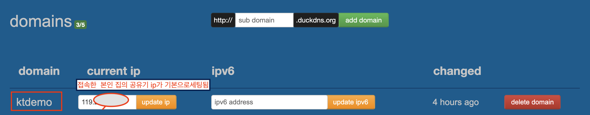
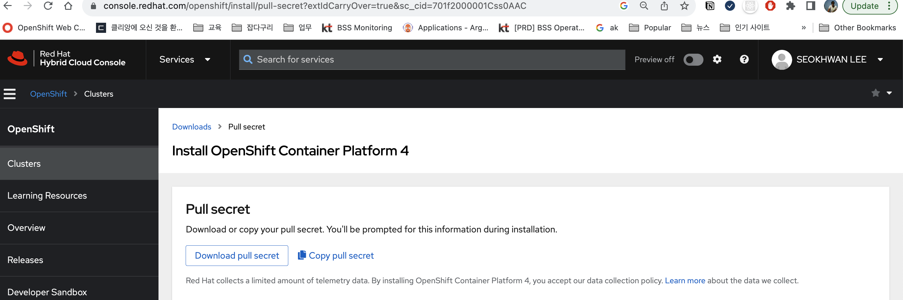
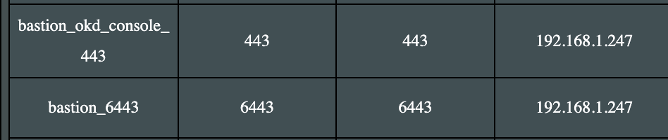
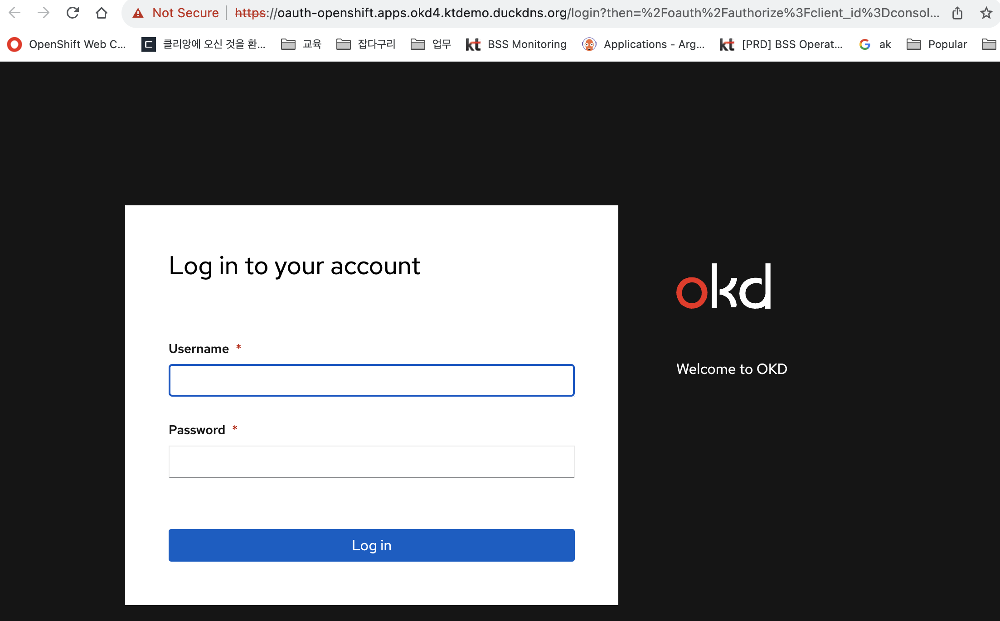
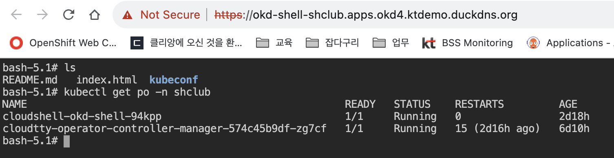

# OKD  설치 방법
 
Redhat Openshift 의  `오픈소스 버전`인 OKD Cluster 를  생성하고 사용해본다.   ( OKD 4.10 버전 기준 )     

<br/>

OKD 설명 참고 :  https://velog.io/@_gyullbb/OKD-%EA%B0%9C%EC%9A%94  

<br/>

1. 도메인 생성

2. 설치 환경 인프라 구성

3. Bastion 서버 설치 및 설정  

4. Cluster 생성 준비

5. Cluster 생성

6. Cluster 생성 후 할 일

7. Cloud shell 설치 및 core os 설정

8. Compute ( Worker Node ) Join 하기

9. NFS 설정하기

10. etcd 백업하기 

<br/>

## 1. 도메인 생성 

<br>

OKD 설치를 위해서는 Static IP 가 필요하지만 Static IP 가 없는 경우 도메인이 필요하고 아래 방법으로 무료 도메인 ( duckdns )을 생성한다.  

<br/>

https://www.duckdns.org/ 로 접속하여 가입을 하고 본인의 공유기의 WAN IP 와 도메인을 매칭 시킨다. WAN IP가 바뀌어도 주기적으로 update 된다.  

<br/>

ktdemo.duckdns.org 로 생성 을 한다. ip 를 변경하고 싶으면 ip를 수동으로 입력하고 update 한다.



<br/>

위의 도메인이 우리가 설치하는 base 도메인이 된다.  

<br/>

## 2. 설치 환경 인프라 구성

<br/>

설치에 필요한 Node는 총 3 개이고 boostrap 서버는 master 노드 설치 이후 제거 가능하다.  

<br/>


| 서버구분 | Hypervisor | IP | hostname | 용도 | OS | Spec | 기타
|:--------| :-----|:----|  :----|  :----| :----| :----| :----|  
| VM | proxmox | 192.168.1.1.247 | bastion.okd4.ktdemo.duckdns.org | Bastion(LB,DNS) | Centos 8 Stream | 2 core / 4 G / 30G |
| VM | proxmox | 192.168.1.1.128 | bootstrap.okd4.ktdemo.duckdns.org |  Bootstrap | Fedora Core OS 35 | 2 core / 6 G / 40G |
| VM | vmware | 192.168.1.1.146 | okd-1.okd4.ktdemo.duckdns.org | Master/Worker | Fedora Core OS 35 | 8 core / 20 G / 200G | Base OS 윈도우 11 


<br/>

## 3. Bastion 서버 설치 및 설정

<br/>

bastion 서버는 centos 8 stream 으로 proxmox 서버에 설치 한다.  

설치 과정은 생략한다.   

설치 이후에 centos에서 네트웍 활성화를 해야 IP 받아온다. 

<br/>

### 3.1 편의성 패키지 설치

<br/>

vi 에디터 와 tar, wget 라이브러리 설치

```bash
[root@localhost shclub]# dnf install -y vim bash-completion tcpdump tar wget
```

<br/>

### 3.2 hostname 설정

<br/>


```bash
[root@localhost shclub]# hostnamectl set-hostname bastion.okd4.ktdemo.duckdns.org
```

<br/>

### 3.3 방화벽및 selinux 설정

<br/>

```bash
[root@localhost shclub]# vi /etc/selinux/config
```  

<br/>

```bash
# This file controls the state of SELinux on the system.
# SELINUX= can take one of these three values:
#     enforcing - SELinux security policy is enforced.
#     permissive - SELinux prints warnings instead of enforcing.
#     disabled - No SELinux policy is loaded.
SELINUX=disabled
```

<br/>  

방화벽을 disable 한다.  


```bash
[root@localhost shclub]# systemctl disable firewalld --now
Removed /etc/systemd/system/multi-user.target.wants/firewalld.service.
Removed /etc/systemd/system/dbus-org.fedoraproject.FirewallD1.service.
```  

<br/>

### 3.4 bastion 서버 dns 확인

<br/>

bastion server는  resolv.conf 의 nameserver 설정 을 확인해야 하는 데 외부 라이브러리
설치를 하기 위해서는 공유기의 IP로 설정을 한다. ( search는 상관 없음 )  

```bash
[root@bastion shclub]# vi /etc/resolv.conf
# Generated by NetworkManager
search okd4.ktdemo.duckdns.org
nameserver 192.168.1.1
```

<br/>

### 3.5 HAProxy 설치 및 구성, 시작

<br/>

HA Proxy ( L7 ) 를 설치한다.

```bash
[root@localhost shclub]# yum install -y haproxy
```  

<br/>

configuration 을 설정한다.    

```bash
[root@bastion shclub]# vi /etc/haproxy/haproxy.cfg
# Global settings
#---------------------------------------------------------------------
global
    maxconn     20000
    log         /dev/log local0 info
    chroot      /var/lib/haproxy
    pidfile     /var/run/haproxy.pid
    user        haproxy
    group       haproxy
    daemon

    # turn on stats unix socket
    stats socket /var/lib/haproxy/stats

#---------------------------------------------------------------------
# common defaults that all the 'listen' and 'backend' sections will
# use if not designated in their block
#---------------------------------------------------------------------
defaults
    log                     global
    mode                    http
    option                  httplog
    option                  dontlognull
    option http-server-close
    option redispatch
    option forwardfor       except 127.0.0.0/8
    retries                 3
    maxconn                 20000
    timeout http-request    10000ms
    timeout http-keep-alive 10000ms
    timeout check           10000ms
    timeout connect         40000ms
    timeout client          300000ms
    timeout server          300000ms
    timeout queue           50000ms

# Enable HAProxy stats
listen stats
    bind :9000
    mode http
    stats enable
    stats uri /
    stats refresh 5s

#---------------------------------------------------------------------
# static backend for serving up images, stylesheets and such
#---------------------------------------------------------------------
backend static
    balance     roundrobin
    server      static 127.0.0.1:4331 check

# OKD  API Server
frontend openshift_api_frontend
    bind *:6443
    default_backend openshift_api_backend
    mode tcp
    option tcplog

backend openshift_api_backend
    mode tcp
    balance source
    server      bootstrap 192.168.1.128:6443 check # bootstrap 서버
    server      okd-1 192.168.1.146:6443 check # okd master/worker 설정
    #server     okd-2 192.168.1.147:6443 check  # 추가 서버 있다면 설정

# OKD Machine Config Server
frontend okd_machine_config_server_frontend
    mode tcp
    bind *:22623
    default_backend okd_machine_config_server_backend

backend okd_machine_config_server_backend
    mode tcp
    balance source
    server      bootstrap 192.168.1.128:22623 check # bootstrap 서버
    server      okd-1 192.168.1.146:22623 check # okd master/worker 설정
    #server     okd-2 192.168.1.147:22623 check  # 추가 서버 있다 면 설정

# OKD Ingress - layer 4 tcp mode for each. Ingress Controller will handle layer 7.
frontend okd_http_ingress_frontend
    bind *:80
    default_backend okd_http_ingress_backend
    mode tcp

backend okd_http_ingress_backend
    balance source
    mode tcp
    server      okd-1 192.168.1.146:80 check # okd master/worker 설정
    #server     okd-2 192.168.1.147:80 check  # 추가 서버 있다 면 설정

frontend okd_https_ingress_frontend
    bind *:443
    default_backend okd_https_ingress_backend
    mode tcp

backend okd_https_ingress_backend
    mode tcp
    balance source
    server      okd-1 192.168.1.146:443 check
    #server     okd-2 192.168.1.148:443 check  # 추가 서버 있다 면 설정

```

<br/>

haproxy를 enable 해서 활성화 한다.  

```bash
[root@localhost shclub]# systemctl enable haproxy --now
```  

<br/>

서비스 활성화시에 애러가 발생하면 status를 확인한다.

```bash
[root@bastion shclub]# systemctl status haproxy
```  

<br/>

bind 에러가 나는 경우 아래와 같이 설정한다.

```bash
[root@bastion shclub]# setsebool -P haproxy_connect_any=1
[root@bastion shclub]# systemctl restart haproxy
```  

<br/>

### 3.6 HTTP 서버 ( Apache ) 설치 및 구성

<br/>

bootstrap , master , worker 노드를 생성하기 위해서는 bastion에 web 서버를 구성하여  
ignition 화일을 다운 받아 설치를 한다.  ( 여기서는 Apache를 설치한다. )    

<br/>

HTTP 설치 후 기본 80 포트 구성을 8080으로 변경한 후 서비스를 시작합니다.

```bash
[root@localhost ~]# dnf install -y httpd
[root@localhost ~]# vi /etc/httpd/conf/httpd.conf
```

<br/>

```bash
[root@localhost ~]# cat /etc/httpd/conf/httpd.conf | grep Listen
# Listen: Allows you to bind Apache to specific IP addresses and/or
# Change this to Listen on specific IP addresses as shown below to
#Listen 12.34.56.78:80
Listen 8080
```  
<br/>

Apache web server를 활성화 하고 재기동 한다.

```bash
[root@localhost ~]# systemctl enable httpd --now
Created symlink /etc/systemd/system/multi-user.target.wants/httpd.service → /usr/lib/systemd/system/httpd.service.

[root@localhost ~]# systemctl restart httpd
```  

<br/>

### 3.7 DNS 서버 설치 및 구성

<br/>

bind 를 설치하고 DNS 서버를 구성하자.  

<br/>

```bash
[root@localhost ~]# dnf install -y bind bind-utils
[root@localhost ~]# systemctl enable named --now
Created symlink /etc/systemd/system/multi-user.target.wants/named.service → /usr/lib/systemd/system/named.service.
```

<br/>

/etc/named.conf 화일을 수정한다.  

<br/>

```bash
[root@bastion shclub]# vi /etc/named.conf
options {
	listen-on port 53 { any; };
	listen-on-v6 port 53 { none; };
	directory 	"/var/named";
	dump-file 	"/var/named/data/cache_dump.db";
	statistics-file "/var/named/data/named_stats.txt";
	memstatistics-file "/var/named/data/named_mem_stats.txt";
	secroots-file	"/var/named/data/named.secroots";
	recursing-file	"/var/named/data/named.recursing";
	allow-query     { any; };

	/*
	 - If you are building an AUTHORITATIVE DNS server, do NOT enable recursion.
	 - If you are building a RECURSIVE (caching) DNS server, you need to enable
	   recursion.
	 - If your recursive DNS server has a public IP address, you MUST enable access
	   control to limit queries to your legitimate users. Failing to do so will
	   cause your server to become part of large scale DNS amplification
	   attacks. Implementing BCP38 within your network would greatly
	   reduce such attack surface
	*/
	recursion yes;

	dnssec-enable yes;
	dnssec-validation yes;

	managed-keys-directory "/var/named/dynamic";

	pid-file "/run/named/named.pid";
	session-keyfile "/run/named/session.key";

	/* https://fedoraproject.org/wiki/Changes/CryptoPolicy */
	include "/etc/crypto-policies/back-ends/bind.config";
};

logging {
        channel default_debug {
                file "data/named.run";
                severity dynamic;
        };
};

zone "." IN {
	type hint;
	file "named.ca";
};

include "/etc/named.rfc1912.zones";
include "/etc/named.root.key";
```

<br/>

/etc/named.rfc1912.zones 화일을 수정한다.    

아래 2개의 존을 설정해야 한다.     
- ktdemo.duckdns.org : DNS 정방향
- 1.168.192.arpa : DNS 역방향 (  192.168.1 의 반대로 설정 )

<br/>

```bash
zone "ktdemo.duckdns.org" IN {
        type master;
        file "/var/named/okd4.ktdemo.duckdns.org.zone";
        allow-update { none; };
};

zone "1.168.192.arpa" IN {
        type master;
        file "/var/named/1.168.192.in-addr.rev";
        allow-update { none; };
};
```  

<br/>

```bash
[root@bastion named]# vi /etc/named.rfc1912.zones
zone "localhost.localdomain" IN {
	type master;
	file "named.localhost";
	allow-update { none; };
};

zone "localhost" IN {
	type master;
	file "named.localhost";
	allow-update { none; };
};

zone "1.0.0.0.0.0.0.0.0.0.0.0.0.0.0.0.0.0.0.0.0.0.0.0.0.0.0.0.0.0.0.0.ip6.arpa" IN {
	type master;
	file "named.loopback";
	allow-update { none; };
};

zone "1.0.0.127.in-addr.arpa" IN {
	type master;
	file "named.loopback";
	allow-update { none; };
};

zone "0.in-addr.arpa" IN {
	type master;
	file "named.empty";
	allow-update { none; };
};

zone "ktdemo.duckdns.org" IN {
        type master;
        file "/var/named/okd4.ktdemo.duckdns.org.zone";
        allow-update { none; };
};

zone "1.168.192.arpa" IN {
        type master;
        file "/var/named/1.168.192.in-addr.rev";
        allow-update { none; };
};
```

<br/>

/var/named 폴더로 이동한다.

<br/>

```bash
[root@bastion shclub]# cd /var/named
```  

<br/>

okd4.ktdemo.duckdns.org.zone 파일 설정 ( DNS 정방향 )  
- ip와 hostname을 잘 수정한다.  

<br/>

```bash
[root@bastion named]# ls
  data  dynamic  named.ca  named.empty  named.localhost  named.loopback   slaves
[root@bastion named]# vi okd4.ktdemo.duckdns.org.zone
$TTL 1D
@ IN SOA @ ns.ktdemo.duckdns.org. (
				0	; serial
				1D	; refresh
				1H	; retry
				1W	; expire
				3H )	; minimum
@ IN NS ns.ktdemo.duckdns.org.
@ IN A  192.168.1.247	;

; Ancillary services
lb.okd4 	IN	A       192.168.1.247

; Bastion or Jumphost
ns	IN	A	192.168.1.247	;

; OKD Cluster
bastion.okd4    IN      A       192.168.1.247
bootstrap.okd4	IN	A	192.168.1.128

okd-1.okd4	IN	A	192.168.1.146

api.okd4	IN	A	192.168.1.247
api-int.okd4	IN	A	192.168.1.247
*.apps.okd4	IN	A	192.168.1.247
```


<br/>

1.168.192.in-addr.rev 파일 설정 ( DNS 역방향 )

<br/>

```bash
[root@bastion named]# vi 1.168.192.in-addr.rev
$TTL 1D
@	IN	SOA	ktdemo.duckdns.org. ns.ktdemo.duckdns.org. (
						0	; serial
						1D	; refresh
						1H	; retry
						1W	; expire
						3H )	; minimum

@	IN	NS	ns.
247	IN	PTR	ns.
247	IN	PTR	bastion.okd4.ktdemo.duckdns.org.
128	IN	PTR	bootstrap.okd4.ktdemo.duckdns.org.
146	IN	PTR	okd-1.okd4.ktdemo.duckdns.org.

247	IN	PTR	api.okd4.ktdemo.duckdns.org.
247	IN	PTR	api-int.okd4.ktdemo.duckdns.org.
```

<br/>

zone 파일 권한 설정을 하고 named 서비스를 재기동한다.    

<br/>

```bash
[root@bastion named]# chown root:named okd4.ktdemo.duckdns.org.zone
[root@bastion named]# chown root:named 1.168.192.in-addr.rev
[root@bastion named]# systemctl restart named
```  

<br/>  

이제 bastion 서버의 기본 설정을 완료를 하였다. 


<br/>

## 4. Cluster 생성 준비

<br/>

### 4.1 SSH Key pair 생성

<br/>

bastion 서버의 root 폴더로 이동한다.

<br/>

```bash
[root@bastion named]# cd ~/
```  

<br/>

rsa key를 생성하고 엔터를 계속 치면 2개의 화일이 .ssh 폴더에 생성이 된다.  
- id_rsa : private key
- id_rsa.pub : public key ( bootstrap , master/worker 에 설치 될 key )

<br/>

```bash
[root@localhost ~]# ssh-keygen -t rsa -b 4096 -N ''
Generating public/private rsa key pair.
Enter file in which to save the key (/root/.ssh/id_rsa):
Created directory '/root/.ssh'.
Your identification has been saved in /root/.ssh/id_rsa.
Your public key has been saved in /root/.ssh/id_rsa.pub.
The key fingerprint is:
SHA256:QDIN4njCh9DzWBhgeUu3gye3VldDPb2*****jsXr**l4o root@bastion.okd4.ktdemo.duckdns.org
The key's randomart image is:
+---[RSA 4096]----+
|o++o+o.   ... .  |
|++=+.=.    o o . |
|oo=*+ o   . . . .|
| oo+.= o .   . o |
|    + + S     + .|
|     o       o  .|
|    .       .  .=|
|           .....*|
|           E.o++.|
+----[SHA256]-----+
```  

<br/>

### 4.2 oc 실행 바이너리 와 openshift-install 바이너리 다운로드

<br/>

oc 실행 바이너리 와 openshift-install 바이너리 다운로드 하고 압축을 푼다.  

<br/>

```bash
[root@bastion ~]# wget https://github.com/openshift/okd/releases/download/4.10.0-0.okd-2022-03-07-131213/openshift-install-linux-4.10.0-0.okd-2022-03-07-131213.tar.gz
[root@bastion ~]# wget https://github.com/openshift/okd/releases/download/4.10.0-0.okd-2022-03-07-131213/openshift-client-linux-4.10.0-0.okd-2022-03-07-131213.tar.gz
[root@bastion ~]# tar xvfz openshift-install-linux-4.10.0-0.okd-2022-03-07-131213.tar.gz
README.md
openshift-install
[root@bastion ~]# tar xvfz openshift-client-linux-4.10.0-0.okd-2022-03-07-131213.tar.gz
README.md
oc
kubectl
```
<br/>

/usr/local/bin/ 폴더에 실행화일을 이동하고 실행 권한을 준다.   

<br/>

```bash
[root@bastion ~]# mv oc kubectl openshift-install /usr/local/bin/
[root@bastion ~]# chmod 755 /usr/local/bin/{oc,kubectl,openshift-install}
[root@bastion ~]# /usr/local/bin/oc version
Client Version: 4.10.0-0.okd-2022-03-07-131213
```

<br/>


### 4.3 pull secret 다운 받기

<br/>

OKD를 설치 하는 과정에서 redhat 의 private registry 에서 이미지를 다운을 받는다.  
private registry 에 접속하기 위해서는 pull secret이 필요하고 아래 redhat 사이트에 접속을 하여 가입을 하고 pull secret를 다운 받는다.  

<br/>

접속하기 : https://cloud.redhat.com/openshift/create/local

<br/>



<br/>

pull secret의 포맷은 아래와 같다.  

<br/>

```bash
{"auths":{"cloud.openshift.com":{"auth":"b3BlbnNoaWZ0LXJlbGVhc2UtZGV2K29jbV9hY2Nlc3NfODA3Yjc0MDgzODBmNDg4NmE-------zSDdNSTFGRzFPN1hBODRSQjZONTFYSw==","email":"shclub@gmail.com"},"quay.io":{"auth":"b3BlbnNoaWZ0LXJlbGVhc2UtZGV2K29jbV9hY2Nlc3NfODA3Yjc0MDgzODBmNDg4NmExYTE4YWVjMzZjZDc3ZTE6WEhHTVhYWlAzMjEyR0tJUFRaN0Y3MUNSWVRHUEVMM1BBRThQUExWSlEzSDdNSTFGRzFPN1hBODRSQjZONTFYSw==","email":"shclub@gmail.com"},"registry.connect.redhat.com":{"auth":"fHVoYy1wb29sLTYxMTBkMjQyLTQ3MjgtNDBhYS05Zjc5LTdjZTMyNDUyNzJlYzpleUpoYkdjaU9pSlNVelV4TWlKOS5leUp6ZFdJaU9pSXdaamMyTkRRMU4yVXdNREUwT0dJek9EZGpNVGMyTW1GaE9ERTBORGcwTVNKOS5aNXZrTnNTb3NlQ1NfTDZOQ1NiN0I5NTVkUkR4NmVsUWpkZGMwRl9-------wSlRiX0hrUVVoUHE5dEthOVZDOWtsS2tCNVViSEF3OXByNTdnR25QSzFRNzJycDI4NA==","email":"shclub@gmail.com"},"registry.redhat.io":{"auth":"-------Da3JnS0xUMEJqYks5Y0FoR0JfRjBZMjZEa3lCOHF2SkdRSGE2VklOQ1Y3dnpRTU1GU3lHeWdZQ2VkWjFSWk9PRUQwSlRiX0hrUVVoUHE5dEthOVZDOWtsS2tCNVViSEF3OXByNTdnR25QSzFRNzJycDI4NA==","email":"shclub@gmail.com"}}}
```  

<br/>

### 4.4 install-config.yaml 파일 생성 및 백업

<br/>

manifest 와 innition 화일을 생성하기 위하여 install-config.yaml를 만든다.

<br/>

pull secret 항목은 위에서 다운받은 redhat pull secret을 복사하고 ssh 키는 bastion에서 생성한 public key를 가져와서 붙여 넣는다.  

```bash
[root@bastion ~]# mkdir -p okd4
[root@bastion ~]# vi ./okd4/install-config.yaml
apiVersion: v1
baseDomain: ktdemo.duckdns.org  # 베이스 도메인. 본인의 공유기 도메인
compute:
- hyperthreading: Enabled
  name: worker
  replicas: 0  # 워커 노드 수
controlPlane:
  hyperthreading: Enabled
  name: master
  replicas: 1  # 마스터 노드 수 ( master 노드는 기본은 worker node 혼용으로 설정 )
metadata:
  name: okd4  # OKD Cluster 이름이며 base domain 앞에 추가가 된다.
networking:
  clusterNetwork:
  - cidr: 10.128.0.0/14
    hostPrefix: 23
  networkType: OpenShiftSDN
  serviceNetwork:
  - 172.30.0.0/16
platform:
  none: {}
pullSecret: '{"auths":{"cloud.openshift.com":{"auth":"b3BlbnNoaWZ0LXJlbGVhc2UtZGV2K29jbV9hY2Nlc3NfODA3Yjc0MDgzODBmNDg4NmExYTE4YWVjMzZjZDc3ZTE6WEhHTVhYWlAzMjEyR0tJUFRaN0Y3MUNSWVRHUEVMM1BBRThQUExWSlE----CNVViSEF3OXByNTdnR25QSzFRNzJycDI4NA==","email":"shclub@gmail.com"}}}'
sshKey: 'ssh-rsa AAAAB3NzaC1yc2EAAAADAQABAAACAQCWJkGLkamR8mtMhNPUC7fY5lzXZFzGpEFftZwkFoXCBWmF------R8chyf60CkHOTFHVqsUHNs3JdkvmJBPWrE3FN3w== root@bastion.okd4.ktdemo.duckdns.org'
```  

<br/>

install-config.yaml 파일은 manifest 와 ignition 생성후 삭제가 되기때문에 백업 폴더를 생성하여 저장한다. 

```bash
[root@bastion ~]# mkdir backup
[root@bastion ~]# cp ./okd4/install-config.yaml ./backup/install-config.yaml
```

<br/>

manifest 화일을 생성한다.    

openshift 폴더가 생성이되고 master/worker 노드 설정 화일들이 있어 여기 값을 수정하여 role 을 할당 할 수 있다.

<br/>

```bash
[root@bastion ~]# /usr/local/bin/openshift-install create manifests --dir=okd4
INFO Consuming Install Config from target directory
WARNING Making control-plane schedulable by setting MastersSchedulable to true for Scheduler cluster settings
INFO Manifests created in: okd4/manifests and okd4/openshift
[root@bastion ~]# ls ./okd4
manifests  openshift
[root@bastion ~]# ls ./okd4/openshift
99_kubeadmin-password-secret.yaml                      99_openshift-machineconfig_99-master-ssh.yaml
99_openshift-cluster-api_master-user-data-secret.yaml  99_openshift-machineconfig_99-worker-ssh.yaml
99_openshift-cluster-api_worker-user-data-secret.yaml  openshift-install-manifests.yaml
```

<br/>

coreos 설정을 위한 ignition 화일을 생성한다.    
역할 별로 ign 파일이 생성이 되고 auth 폴더 안에는 연결 정보 (kubeconfig) 가 저장이 되어 있다.

<br/>

```bash
[root@bastion ~]# /usr/local/bin/openshift-install create ignition-configs --dir=okd4
INFO Consuming Master Machines from target directory
INFO Consuming Openshift Manifests from target directory
INFO Consuming Worker Machines from target directory
INFO Consuming Common Manifests from target directory
INFO Consuming OpenShift Install (Manifests) from target directory
INFO Ignition-Configs created in: okd4 and okd4/auth
[root@bastion ~]# ls ./okd4/
auth  bootstrap.ign  master.ign  metadata.json  worker.ign
```  

<br/>

bastion web 서버에 ign 화일을 복사하고 apache web server를 재 기동한다.

<br/>

```bash
[root@bastion ~]# mkdir /var/www/html/ign
[root@bastion ~]# cp ./okd4/*.ign /var/www/html/ign/
[root@bastion ~]# chmod 777 /var/www/html/ign/*.ign
[root@bastion ~]# systemctl restart httpd
```

<br/>

### 4.5 bootstrap 서버 생성

<br/>

proxmox 서버에 coreos 기반의 bootstrap 용 서버를 생성한다. ( 생성 과정은 생략 )

<br.>

- 다운로드 위치 : 
https://builds.coreos.fedoraproject.org/browser?stream=stable&arch=x86_64 에서
- Version : fedora-coreos-35.20220410.3.1-live.x86_64.iso

<br/>

처음 기동인 되면 자동 로그인 이 되고 proxmox 에서 OS 콘솔로 접속이 가능하다. 
- proxmox 콘솔은 웹이기 때문애 붙여 넣기가 안된다.


<br/>

먼저 네트웍을 설정을 하기 위해서 network device 이름을 확인한다.  

```bash  
[root@localhost core]# nmcli device
ens18   ethernet  connected  Wired connection 1
lo      loopback  unmanaged  --
```  

<br/>

connection 이름을 ens18로 생성한다.  

```bash  
[root@localhost core]# nmcli connection add type ethernet autoconnect yes con-name ens18 ifname ens18
```  

<br/>

네트웍 설정을 한다.  
- ip : bootstrap 서버는 192.168.1.128/24 로 설정한다.
- dns : bastion 서버는 192.168.1.247 로 설정한다.
- gateway : 공유기 ip 인 192.168.1.1 로 설정한다. ( bastion 서버 ip로 해도 상관 없음 )
- dns-search : okd4.ktdemo.duckdns.org 로 설정 ( cluster 이름 + . + base Domain)

<br/>

```bash  
[root@localhost core]# nmcli connection modify ens18 ipv4.addresses 192.168.1.128/24 ipv4.method manual
[root@localhost core]# nmcli connection modify ens18 ipv4.dns 192.168.1.247
[root@localhost core]# nmcli connection modify ens18 ipv4.gateway 192.168.1.1
[root@localhost core]# nmcli connection modify ens18 ipv4.dns-search okd4.ktdemo.duckdns.org
```  

<br/>

설치를 시작하기 전에 bastion 서버의 /etc/resolv.conf 화일의 nameserver 설정을 bastion 서버의 ip인 192.168.1.247 로 변경한다.  
- 변경하지 않으면 EOF 에러등 다양한 에러가 발생한다.
- 이제 부터는 내부 네트웍만 필요하다.    


<br/>

아래 명령어로 bootstrap 서버 설치를 시작한다.
- --copy-network 의미는 설치 될때 위에서 설정한 네트웍 정보로 설치가 된다.

<br/>

```bash  
[root@localhost core]# coreos-installer install /dev/sda -I http://192.168.1.247:8080/ign/bootstrap.ign --insecure-ignition --copy-network
Installing Fedora CoreOS 35.20220410.3.1 x86_64 (512-byte sectors)
> Read disk 2.5 GiB/2.5 GiB (100%)
Writing Ignition config
Copying networking configuration from /etc/NetworkManager/system-connections/
Copying /etc/NetworkManager/system-connections/ens18.nmconnection to installed system
Copying /etc/NetworkManager/system-connections/ens18-37d95251-8740-4053-a3ee-99ef2a2063c2.nmconnection to installed system
Install complete.
``` 

<br/>

설치가 완료 되면 재기동 한다. 

```bash
[root@localhost core]# reboot now
```

<br/>

bastion 서버에서 bootsrap 서버로 로그인을 해본다.

```bash
[root@bastion config]# ssh core@192.168.1.128
The authenticity of host '192.168.1.128 (192.168.1.128)' can't be established.
ECDSA key fingerprint is SHA256:7+MOJdsnC548GUrGZxYKTnvhG94F+2kyGa2bpSH6eA8.
Are you sure you want to continue connecting (yes/no/[fingerprint])? yes
Warning: Permanently added '192.168.1.128' (ECDSA) to the list of known hosts.
Red Hat Enterprise Linux CoreOS 48.84.202109241901-0
  Part of OpenShift 4.8, RHCOS is a Kubernetes native operating system
  managed by the Machine Config Operator (`clusteroperator/machine-config`).

WARNING: Direct SSH access to machines is not recommended; instead,
make configuration changes via `machineconfig` objects:
  https://docs.openshift.com/container-platform/4.8/architecture/architecture-rhcos.html

---
This is the bootstrap node; it will be destroyed when the master is fully up.

The primary services are release-image.service followed by bootkube.service. To watch their status, run e.g.

  journalctl -b -f -u release-image.service -u bootkube.service
```

<br/>

아래 명령어를 사용하여 설치 로그를 확인한다.  

<br/>

```bash
  [core@localhost ~]$   journalctl -b -f -u release-image.service -u bootkube.service
-- Logs begin at Mon 2023-08-07 05:48:45 UTC. --
Aug 07 05:50:23 localhost bootkube.sh[2232]: wrote /assets/ingress-operator-manifests/cluster-ingress-00-namespace.yaml
Aug 07 05:50:24 localhost bootkube.sh[2232]: Rendering MCO manifests...
Aug 07 05:50:32 localhost bootkube.sh[2232]: I0807 05:50:32.203425       1 bootstrap.go:86] Version: v4.8.0-202110020139.p0.git.6cf1670.assembly.stream-dirty (6cf167014583c41e80407eea5a4eda644f420d26)
Aug 07 05:50:32 localhost bootkube.sh[2232]: I0807 05:50:32.206504       1 bootstrap.go:188] manifests/machineconfigcontroller/controllerconfig.yaml
Aug 07 05:50:32 localhost bootkube.sh[2232]: I0807 05:50:32.208403       1 bootstrap.go:188] manifests/master.machineconfigpool.yaml
Aug 07 05:50:32 localhost bootkube.sh[2232]: I0807 05:50:32.208662       1 bootstrap.go:188] manifests/worker.machineconfigpool.yaml
Aug 07 05:50:32 localhost bootkube.sh[2232]: I0807 05:50:32.208867       1 bootstrap.go:188] manifests/bootstrap-pod-v2.yaml
Aug 07 05:50:32 localhost bootkube.sh[2232]: I0807 05:50:32.209096       1 bootstrap.go:188] manifests/machineconfigserver/csr-bootstrap-role-binding.yaml
Aug 07 05:50:32 localhost bootkube.sh[2232]: I0807 05:50:32.209326       1 bootstrap.go:188] manifests/machineconfigserver/kube-apiserver-serving-ca-configmap.yaml
Aug 07 05:50:32 localhost bootkube.sh[2232]: Rendering CCO manifests...
Aug 07 05:50:39 localhost bootkube.sh[2232]: time="2023-08-07T05:50:39Z" level=info msg="Rendering files to /assets/cco-bootstrap"
Aug 07 05:50:39 localhost bootkube.sh[2232]: time="2023-08-07T05:50:39Z" level=info msg="Writing file: /assets/cco-bootstrap/manifests/cco-cloudcredential_v1_operator_config_custresdef.yaml"
Aug 07 05:50:39 localhost bootkube.sh[2232]: time="2023-08-07T05:50:39Z" level=info msg="Writing file: /assets/cco-bootstrap/manifests/cco-cloudcredential_v1_credentialsrequest_crd.yaml"
Aug 07 05:50:39 localhost bootkube.sh[2232]: time="2023-08-07T05:50:39Z" level=info msg="Writing file: /assets/cco-bootstrap/manifests/cco-namespace.yaml"
Aug 07 05:50:39 localhost bootkube.sh[2232]: time="2023-08-07T05:50:39Z" level=info msg="Writing file: /assets/cco-bootstrap/manifests/cco-operator-config.yaml"
Aug 07 05:50:39 localhost bootkube.sh[2232]: time="2023-08-07T05:50:39Z" level=info msg="Rendering static pod"
Aug 07 05:50:39 localhost bootkube.sh[2232]: time="2023-08-07T05:50:39Z" level=info msg="writing file: /assets/cco-bootstrap/bootstrap-manifests/cloud-credential-operator-pod.yaml"
Aug 07 05:50:40 localhost bootkube.sh[2232]: https://localhost:2379 is healthy: successfully committed proposal: took = 8.685028ms
Aug 07 05:50:40 localhost bootkube.sh[2232]: Starting cluster-bootstrap...
Aug 07 05:50:46 localhost bootkube.sh[2232]: Starting temporary bootstrap control plane...
Aug 07 05:50:46 localhost bootkube.sh[2232]: Waiting up to 20m0s for the Kubernetes API
Aug 07 05:50:47 localhost bootkube.sh[2232]: Still waiting for the Kubernetes API: Get "https://localhost:6443/readyz": dial tcp [::1]:6443: connect: connection refused
```

<br/>

bootstrap 서버에서 exit 하여 bastion 서버로 돌아오고 아래 명령어를 사용하여 모니터링 한다.   

아래 API 버전까지 나와야 정상이고  대부분  the Kubernetes API 서버 접속시 에러가 많이 발생하는데 DNS 서버인 Bastion 서버의 ip로 설정이 안되어 있는 경우가 많다.

<br/>

```bash
[root@bastion shclub]# /usr/local/bin/openshift-install --dir=/root/okd4 wait-for bootstrap-complete --log-level=debug
DEBUG OpenShift Installer 4.10.0-0.okd-2022-03-07-131213
DEBUG Built from commit 3b701903d96b6375f6c3852a02b4b70fea01d694
INFO Waiting up to 20m0s (until 10:36PM) for the Kubernetes API at https://api.okd4.ktdemo.duckdns.org:6443...
INFO API v1.23.3-2003+e419edff267ffa-dirty up
INFO Waiting up to 30m0s (until 10:46PM) for bootstrapping to complete...
```   

<br/>

에러 가 발생하지 않고 `Bootstrap status: complete` 메시지가 나오면 Bootstrap 서버가 정상 설치가 되고 master 노드 생성을 시작합니다.  

```bash
[root@bastion ~]# /usr/local/bin/openshift-install --dir=/root/okd4 wait-for bootstrap-complete --log-level=debug
DEBUG OpenShift Installer 4.10.0-0.okd-2022-03-07-131213
DEBUG Built from commit 3b701903d96b6375f6c3852a02b4b70fea01d694
INFO Waiting up to 20m0s (until 9:58AM) for the Kubernetes API at https://api.okd4.ktdemo.duckdns.org:6443...
INFO API v1.23.3-2003+e419edff267ffa-dirty up
INFO Waiting up to 30m0s (until 10:08AM) for bootstrapping to complete...
DEBUG Bootstrap status: complete
```
<br/>

## 5. Cluster 생성 

<br/> 

### 5.1 master 노드 생성

<br/>

vmware 에 coreos 기반의 master/worker 겸용 서버를 생성한다. ( 생성 과정은 생략 )

<br.>

- 다운로드 위치 : 
https://builds.coreos.fedoraproject.org/browser?stream=stable&arch=x86_64 에서
- Version : fedora-coreos-35.20220410.3.1-live.x86_64.iso

<br/>

처음 기동인 되면 자동 로그인 이 되고 vmware 에서 OS 콘솔로 접속이 가능하다.  
- vmware 콘솔은 붙여 넣기가 가능하다.

<br/>

먼저 네트웍을 설정을 하기 위해서 network device 이름을 확인한다.  

```bash  
[root@localhost core]# nmcli device
DEVICE  TYPE      STATE      CONNECTION
ens160  ethernet  connected  Wired connection 1
lo      loopback  unmanaged  --
```  

<br/>

connection 이름을 ens160으로 생성한다.  

```bash  
[root@localhost core]# nmcli connection add type ethernet autoconnect yes con-name ens160 ifname ens160
```  

<br/>

네트웍 설정을 한다.  
- ip : okd-1 서버는 192.168.1.146/24 로 설정한다.
- dns : bastion 서버는 192.168.1.247 로 설정한다.
- gateway : 공유기 ip 인 192.168.1.1 로 설정한다. ( bastion 서버 ip로 해도 상관 없음 )
- dns-search : okd4.ktdemo.duckdns.org 로 설정 ( cluster 이름 + . + base Domain)

<br/>

```bash  
[root@localhost core]# nmcli connection modify ens160 ipv4.addresses 192.168.1.146/24 ipv4.method manual
[root@localhost core]# nmcli connection modify ens160 ipv4.dns 192.168.1.247
[root@localhost core]# nmcli connection modify ens160 ipv4.gateway 192.168.1.1
[root@localhost core]# nmcli connection modify ens160 ipv4.dns-search okd4.ktdemo.duckdns.org
```  

<br/>

master 노드 ( okd-1 ) 설치를 한다.

<br/>

```bash
[root@localhost core]# coreos-installer install /dev/sda -I http://192.168.1.247:8080/ign/master.ign --insecure-ignition --copy-network
Installing Fedora CoreOS 35.20220410.3.1 x86_64 (512-byte sectors)
> Read disk 2.5 GiB/2.5 GiB (100%)
Writing Ignition config
Copying networking configuration from /etc/NetworkManager/system-connections/
Copying /etc/NetworkManager/system-connections/ens160.nmconnection to installed system
Install complete.
```  

<br/>

hostname을 설정 하고 재기동 한다.

<br/>

```bash
[root@localhost core]# hostnamectl set-hostname okd-1.okd4.ktdemo.duckdns.org
[root@localhost core]# reboot now
``` 

<br/>

bastion 서버에서 아래 명령어로 모니터링을 하고  `It is now safe to remove the bootstrap resources` 가 나오면 정상적으로 master 노드가 설치가 완료 됩니다.   

<br/>

```bash
[root@bastion ~]# /usr/local/bin/openshift-install --dir=/root/okd4 wait-for bootstrap-complete --log-level=debug
DEBUG OpenShift Installer 4.10.0-0.okd-2022-03-07-131213
DEBUG Built from commit 3b701903d96b6375f6c3852a02b4b70fea01d694
INFO Waiting up to 20m0s (until 9:58AM) for the Kubernetes API at https://api.okd4.ktdemo.duckdns.org:6443...
INFO API v1.23.3-2003+e419edff267ffa-dirty up
INFO Waiting up to 30m0s (until 10:08AM) for bootstrapping to complete...
DEBUG Bootstrap status: complete
INFO It is now safe to remove the bootstrap resources
DEBUG Time elapsed per stage:
DEBUG Bootstrap Complete: 7m56s
INFO Time elapsed: 7m56s
```


<br/>

## 6. Cluster 생성 후 할일

<br/> 

### 6.1 HAProxy 설정 변경

<br/>

OKD 클러스터가 정상적으로 구성되었기 때문에 bastion 서버에서  HAProxy가 bootstrap으로 LB (Load Balancing) 되지 않도록 수정 후 서비스를 재시작합니다.

<br/>

```bash
[root@bastion config]# vi /etc/haproxy/haproxy.cfg
```

<br/>

```bash
backend openshift_api_backend
    mode tcp
    balance source
    #server      bootstrap 192.168.1.128:6443 check
    server      okd-1 192.168.1.146:6443 check

backend ocp_machine_config_server_backend
    mode tcp
    balance source
    #server      bootstrap 192.168.1.128:22623 check
    server      okd-1 192.168.1.146:22623 check
```

<br/>

haproxy를  재기동 한다.

<br/>

```bash
[root@bastion config]# systemctl restart haproxy
```

<br/>

### 6.2 OKD 연결 설정

<br/>

.bash_profile 에 연결 정보를 설정합니다.   


```bash
[root@bastion ~]# vi ~/.bash_profile
# .bash_profile

# Get the aliases and functions
if [ -f ~/.bashrc ]; then
	. ~/.bashrc
fi

# User specific environment and startup programs
# /usr/local/bin 추가 
PATH=$PATH:$HOME/bin:/usr/local/bin

export PATH

# Added for okd4 : 아래 구문 추가
export KUBECONFIG=/root/okd4/auth/kubeconfig
```

<br/>

source 명령어로 profile 를 적용하고 node를 조회해 봅니다.  
정상적으로 node가 조회가 됩니다.  

```bash
[root@bastion ~]# source ~/.bash_profile
[root@bastion ~]# oc get nodes
NAME                            STATUS   ROLES           AGE   VERSION
okd-1.okd4.ktdemo.duckdns.org   Ready    master,worker   18m   v1.23.3+759c22b
```

<br/>

cluster componet 조회를 해봅니다.  

모든 Cluster Operator가 True / False / False 여야 정상입니다.
  
<br/>

```bash
[root@bastion ~]# oc get co
NAME                                       VERSION                          AVAILABLE   PROGRESSING   DEGRADED   SINCE   MESSAGE
authentication                             4.10.0-0.okd-2022-03-07-131213   True        True          False      64s     OAuthServerDeploymentProgressing: deployment/oauth-openshift.openshift-authentication: observed generation is 2, desired generation is 3.
baremetal                                  4.10.0-0.okd-2022-03-07-131213   True        False         False      14m
cloud-controller-manager                   4.10.0-0.okd-2022-03-07-131213   True        False         False      18m
cloud-credential                           4.10.0-0.okd-2022-03-07-131213   True        False         False      17m
cluster-autoscaler                         4.10.0-0.okd-2022-03-07-131213   True        False         False      14m
config-operator                            4.10.0-0.okd-2022-03-07-131213   True        False         False      16m
console                                    4.10.0-0.okd-2022-03-07-131213   True        False         False      64s
csi-snapshot-controller                    4.10.0-0.okd-2022-03-07-131213   True        False         False      16m
dns                                        4.10.0-0.okd-2022-03-07-131213   True        False         False      14m
etcd                                       4.10.0-0.okd-2022-03-07-131213   True        False         False      14m
image-registry                             4.10.0-0.okd-2022-03-07-131213   True        False         False      7m6s
ingress                                    4.10.0-0.okd-2022-03-07-131213   True        False         False      13m
insights                                   4.10.0-0.okd-2022-03-07-131213   True        False         False      9m58s
kube-apiserver                             4.10.0-0.okd-2022-03-07-131213   True        False         False      9m29s
kube-controller-manager                    4.10.0-0.okd-2022-03-07-131213   True        False         False      13m
kube-scheduler                             4.10.0-0.okd-2022-03-07-131213   True        False         False      9m38s
kube-storage-version-migrator              4.10.0-0.okd-2022-03-07-131213   True        False         False      16m
machine-api                                4.10.0-0.okd-2022-03-07-131213   True        False         False      15m
machine-approver                           4.10.0-0.okd-2022-03-07-131213   True        False         False      16m
machine-config                             4.10.0-0.okd-2022-03-07-131213   True        False         False      14m
marketplace                                4.10.0-0.okd-2022-03-07-131213   True        False         False      14m
monitoring                                 4.10.0-0.okd-2022-03-07-131213   True        False         False      52s
network                                    4.10.0-0.okd-2022-03-07-131213   True        False         False      16m
node-tuning                                4.10.0-0.okd-2022-03-07-131213   True        False         False      15m
openshift-apiserver                        4.10.0-0.okd-2022-03-07-131213   True        False         False      5m27s
openshift-controller-manager               4.10.0-0.okd-2022-03-07-131213   True        False         False      15m
openshift-samples                          4.10.0-0.okd-2022-03-07-131213   True        False         False      6m53s
operator-lifecycle-manager                 4.10.0-0.okd-2022-03-07-131213   True        False         False      15m
operator-lifecycle-manager-catalog         4.10.0-0.okd-2022-03-07-131213   True        False         False      15m
operator-lifecycle-manager-packageserver   4.10.0-0.okd-2022-03-07-131213   True        False         False      8m48s
service-ca                                 4.10.0-0.okd-2022-03-07-131213   True        False         False      16m
storage                                    4.10.0-0.okd-2022-03-07-131213   True        False         False      16m
```

<br/>

bastion 서버에서 아래 명령어로 설치 확인을 하며 kubeadmin 비밀번호를 알수 있습니다.    

향후 계정을 신규로 생성하여 cluster admin 권한을 준후 kubeadmin은 삭제합니다.  
- cluster admin 계정을 먼저 생성하지 않고 kubeadmin 삭제하면 cluster 재생성 해야합니다.

<br/>

```bash
[root@bastion ~]# openshift-install --dir=/root/okd4 wait-for install-complete
INFO Waiting up to 40m0s (until 10:35AM) for the cluster at https://api.okd4.ktdemo.duckdns.org:6443 to initialize...
INFO Waiting up to 10m0s (until 10:05AM) for the openshift-console route to be created...
INFO Install complete!
INFO To access the cluster as the system:admin user when using 'oc', run 'export KUBECONFIG=/root/okd4/auth/kubeconfig'
INFO Access the OpenShift web-console here: https://console-openshift-console.apps.okd4.ktdemo.duckdns.org
INFO Login to the console with user: "kubeadmin", and password: "HeJDB-***-****b****-4hb4q"
INFO Time elapsed: 0s
```

<br/>

### 6.2 OKD 계정 생성

<br/>

admin으로 먼저 접속을 해봅니다.    

```bash
[root@bastion ~]# oc login -u system:admin
Logged into "https://api.okd4.ktdemo.duckdns.org:6443" as "system:admin" using existing credentials.

You have access to 65 projects, the list has been suppressed. You can list all projects with 'oc projects'

Using project "default".
```

<br/> 

okd 계정을 생성을 하고 비밀번호를 htpasswd 방식으로 설정하기 위해 httpd-tools 라이브러리를 설치합니다.  

<br/>

```bash
[root@bastion ~]# dnf install -y httpd-tools
Last metadata expiration check: 1:51:05 ago on Mon 07 Aug 2023 02:28:18 AM EDT.
Package httpd-tools-2.4.37-54.module_el8.8.0+1256+e1598b50.x86_64 is already installed.
Dependencies resolved.
Nothing to do.
Complete!
```

<br/>

shclub 라는 이름으로 계정을 만들고 비밀번호도 같이 입력합니다.

<br/>

```bash
[root@bastion ~]# touch htpasswd
[root@bastion ~]# htpasswd -Bb htpasswd shclub 'S#123************'
Adding password for user root
[root@bastion ~]# cat htpasswd
root:$2y$05$kjWLoagesIMy0.**************
```
<br/>

htpasswd 라는 이름으로 kubernetes secret 을 생성합니다.

<br/>

```bash
[root@bastion ~]# oc --user=admin create secret generic htpasswd  --from-file=htpasswd -n openshift-config
[root@bastion ~]# oc get secret  -n openshift-config
NAME                                      TYPE                                  DATA   AGE
builder-dockercfg-lkfwf                   kubernetes.io/dockercfg               1      20m
builder-token-n4j9g                       kubernetes.io/service-account-token   4      20m
builder-token-sng5g                       kubernetes.io/service-account-token   4      20m
default-dockercfg-cdtkb                   kubernetes.io/dockercfg               1      20m
default-token-mxlks                       kubernetes.io/service-account-token   4      20m
default-token-s2w2r                       kubernetes.io/service-account-token   4      27m
deployer-dockercfg-s2wbh                  kubernetes.io/dockercfg               1      20m
deployer-token-skjsq                      kubernetes.io/service-account-token   4      20m
deployer-token-wf8wn                      kubernetes.io/service-account-token   4      20m
etcd-client                               kubernetes.io/tls                     2      27m
etcd-metric-client                        kubernetes.io/tls                     2      27m
etcd-metric-signer                        kubernetes.io/tls                     2      27m
etcd-signer                               kubernetes.io/tls                     2      27m
htpasswd                                  Opaque                                0      8s
initial-service-account-private-key       Opaque                                1      27m
pull-secret                               kubernetes.io/dockerconfigjson        1      27m
webhook-authentication-integrated-oauth   Opaque                                1      24m
```  

<br/>

OKD Cluster 에 생성하기 위해 `Local Password` 라는 이름으로 identityProviders 를 생성하고 replace 명령어를 사용하여 적용합니다.

<br/>

```bash
[root@bastion ~]# vi oauth-config.yaml
apiVersion: config.openshift.io/v1
kind: OAuth
metadata:
  name: cluster
spec:
  identityProviders:
  - name: Local Password
    mappingMethod: claim
    type: HTPasswd
    htpasswd:
      fileData:
        name: htpasswd
[root@bastion ~]# oc replace -f oauth-config.yaml
oauth.config.openshift.io/cluster replaced
```

<br/>

브라우저를 통해 okd web console 에 접속하기 위해 url을 확인합니다.  

<br/>

```bash
[root@bastion ~]# oc whoami --show-console
https://console-openshift-console.apps.okd4.ktdemo.duckdns.org
```

<br/>

웹브라우저와 외부에서 접속하기 위해서는 공유기에서 포트포워딩을 해주어 합니다. ( 6443,443 포트)



<br/>

또한, bastion 서버의 nameserver 를 공유기의 ip로 아래과 같이 변경한다.

```bash
[root@bastion ~]# vi /etc/resolv.conf

# Generated by NetworkManager
search okd4.ktdemo.duckdns.org
nameserver 192.168.1.1
```  

<br/>

웹 브라우저에서 접속해 보면 정상적인 okd 로그인 화면이 나옵니다.  



<br/>

bastion 서버에서 해당 유저로 로그인 합니다.  

```bash
[root@bastion ~]# oc login https://api.okd4.ktdemo.duckdns.org:6443 -u shclub -p N********9876! --insecure-skip-tls-verify
Login successful.

You don't have any projects. You can try to create a new project, by running

    oc new-project <projectname>
```

<br/>

### 6.3 OKD 계정 권한 할당

<br/>


shcub 라는 namespace를 생성합니다.  

```bash
[root@bastion ~]# oc new-project shclub
```  

해당 namespace 에 pod를 생성하면 시작이된 후 권한이 없어서 곧 에러가 발생합니다.

<br/>

admin 으로 로그인 한 후 anyuid 권한을 할당합니다.      

아래와 같은 로그 발생시에는 context를 변경해야 합니다.

```bash
[root@bastion ~]# oc login -u system:admin
error: username system:admin is invalid for basic auth
```  

<br/>

context를 조회를 하면  * 표시가 현재 사용하는  context 입니다.

```bash
[root@bastion ~]# oc config get-contexts
CURRENT   NAME                                                    CLUSTER                            AUTHINFO                                        NAMESPACE
*         /api-okd4-ktdemoduckdns-org:6443/root                   api-okd4-ktdemoduckdns-org:6443    root/api-okd4-ktdemoduckdns-org:6443
          /api-okd4-ktdemoduckdns-org:6443/shclub                 api-okd4-ktdemoduckdns-org:6443    shclub/api-okd4-ktdemoduckdns-org:6443
          admin                                                   okd4                               admin
          default/api-okd4-ktdemo-duckdns-org:6443/system:admin   api-okd4-ktdemo-duckdns-org:6443   system:admin/api-okd4-ktdemo-duckdns-org:6443   default
```  

<br/>

use-context 구문을 사용하여 현재 사용하는 context 로 변경합니다.  

```bash          
[root@bastion ~]# kubectl config use-context  default/api-okd4-ktdemo-duckdns-org:6443/system:admin
Switched to context "default/api-okd4-ktdemo-duckdns-org:6443/system:admin".
[root@bastion ~]# oc login -u system:admin
Logged into "https://api.okd4.ktdemo.duckdns.org:6443" as "system:admin" using existing credentials.

You have access to 65 projects, the list has been suppressed. You can list all projects with 'oc projects'

Using project "default".
```   

<br/>

shclub 유저에게 shclub namespace의 default service account 권한을 할당합니다.      

<br/>

```bash
oc adm policy add-scc-to-user anyuid system:serviceaccount:<NAMESPACE>:default
```    


```bash
[root@bastion ~]# oc adm policy add-scc-to-user anyuid system:serviceaccount:shclub:default
clusterrole.rbac.authorization.k8s.io/system:openshift:scc:anyuid added: "default"
```  

<br/>

namespace의 admin 권한을 추가로 부여합니다.   

```bash
oc adm policy add-role-to-user admin <계정> -n <NAMESPACE> 
```  

<br/>

```bash
[root@bastion ~]# oc adm policy add-role-to-user admin shclub -n shclub
clusterrole.rbac.authorization.k8s.io/admin added: "shclub"
```

<br/>

Pod를 하나 생성해 봅니다.  


```bash
[root@bastion ~]# kubectl run nginx --image=nginx
pod/nginx created
[root@bastion ~]# kubectl get po
NAME    READY   STATUS              RESTARTS   AGE
nginx   0/1     ContainerCreating   0          4s
[root@bastion ~]# kubectl get po
NAME    READY   STATUS    RESTARTS   AGE
nginx   1/1     Running   0          8s
```  

<br/>

정상적으로 Running 하는 것을 확인 할 수 있습니다.  

<br/>

kubeadmin 대신 cluster-admin 생성은 root 라는 계정을 만들고 cluster-admin권한을 할당합니다.    

<br/>

```bash
[root@bastion ~]# oc adm policy add-cluster-role-to-user cluster-admin root
clusterrole.rbac.authorization.k8s.io/cluster-admin added: "root"
```

<br/>

### 6.4 Coreos  패스워드로 연결 방법

<br/>

coreos 를 ssh 대신 패스워드 방식으로 접속하기 위해서는 먼저 ssh로 로그인을 하고 super user 권한을 확득합니다.  

```bash
[core@localhost ~]$ sudo su
```  

<br/>  

core 계정에 비밀번호를 생성합니다.   
 
```bash
[root@localhost core]# passwd core
Changing password for user core.
New password:
Retype new password:
passwd: all authentication tokens updated successfully.
```  

<br/>  

/etc/ssh/sshd_config.d 폴더로 이동합니다.  


```bash 
[root@localhost core]# cd /etc/ssh/sshd_config.d
[root@localhost ssh]# ls
moduli      ssh_config.d        ssh_host_ecdsa_key.pub  ssh_host_ed25519_key.pub  ssh_host_rsa_key.pub
ssh_config  ssh_host_ecdsa_key  ssh_host_ed25519_key    ssh_host_rsa_key          sshd_config
```
<br/>  

20-enable-passwords.conf 를 생성한다.    

```bash
[root@okd-1 sshd_config.d]# ls
10-insecure-rsa-keysig.conf 40-disable-passwords.conf  40-ssh-key-dir.conf  50-redhat.conf
[root@localhost ssh]# vi 20-enable-passwords.conf
```  

<br/>

아래와 같이 값을 생성하고 저장한다.   

```bash
  PasswordAuthentication yes
```  

<br/>

sshd 데몬을 재기동한다.    

```bash
[root@localhost ssh]# systemctl restart sshd
```
이제 어느 곳에서든 id/password로 접속 가능하다.  

<br/>

## 7 Cloud shell 설치 및 core os 설정

<br/>


### 7.1 helm 으로 설치

<br/>

설치를 위해서 cluster admin 권한이 있어야 한다.    

<br/>


참고 : https://github.com/shclub/cloudtty

```bash
jakelee@jake-MacBookAir cloudshell % oc login https://api.okd4.ktdemo.duckdns.org:6443 -u root -p Sh********0 --insecure-skip-tls-verify
WARNING: Using insecure TLS client config. Setting this option is not supported!

Login successful.

You have access to 68 projects, the list has been suppressed. You can list all projects with 'oc projects'

Using project "shclub".
jakelee@jake-MacBookAir ~ % helm install cloudtty-operator --version 0.5.0 cloudtty/cloudtty
NAME: cloudtty-operator
LAST DEPLOYED: Fri Aug 11 13:19:49 2023
NAMESPACE: shclub
STATUS: deployed
REVISION: 1
TEST SUITE: None
NOTES:
Thank you for installing cloudtty.

Your release is named cloudtty-operator.

To learn more about the release, try:

  $ helm status cloudtty-operator
  $ helm get all cloudtty-operator

Documention: https://github.com/cloudtty/cloudtty/-/blob/main/README.md
jakelee@jake-MacBookAir ~ % kubectl wait deployment cloudtty-operator-controller-manager --for=condition=Available=True
deployment.apps/cloudtty-operator-controller-manager condition met
```  

<br/>

root/.kube 폴더에 kubeconfig 를 생성한다.     

```bash
[root@bastion .kube]# vi kubeconfig
apiVersion: v1
clusters:
- cluster:
    insecure-skip-tls-verify: true
    server: https://api.okd4.ktdemoduckdns.org:6443
  name: api-okd4-ktdemoduckdns-org:6443
contexts:
- context:
    cluster: api-okd4-ktdemoduckdns-org:6443
    user: shclub/api-okd4-ktdemoduckdns-org:6443
  name: /api-okd4-ktdemoduckdns-org:6443/shclub
current-context: /api-okd4-ktdemoduckdns-org:6443/root
kind: Config
preferences: {}
users:
- name: shclub/api-okd4-ktdemoduckdns-org:6443
  user:
    token: sha256~********cnLskhIKbwmYwoKAuZ9sowsvSZTsiU
```   

<br/>

```bash
[root@bastion .kube]# ls -al
total 32
drwxr-x---   3 root root    37 Aug  9 10:44 .
dr-xr-x---. 11 root root  4096 Aug 20 21:09 ..
drwxr-x---   4 root root    35 Aug  9 09:53 cache
-rw-r-----   1 root root 25107 Aug  9 10:44 kubeconfig
```  

<br/>

my-kubeconfig 라는 이름으로 secret을 생성한다.   
- 접속 정보를 제한. 


<br/>

```bash
[root@bastion ~]# kubectl create secret generic my-kubeconfig --from-file=/root/.kube/config
secret/my-kubeconfig created
```  

<br/>

Dockerfile 을 생성하고 custom 이미지를 생성한다.    

<br/>

https://github.com/shclub/cloudshell 의 Dockerfile를 사용하여 GitHub Action으로 생성한다.  
-  openshift client 는 Alpine Docker image 에서는 동작하지 않기 때문에 원한다면 ubuntu 이미지를 사용하여야 함.

<br/>

cloudshell 을 생성하기 위한 yaml 화일을 생성하고 적용한다.  

```bash
[root@bastion cloudshell]# cat cloud_shell.yaml
apiVersion: cloudshell.cloudtty.io/v1alpha1
kind: CloudShell
metadata:
  name: okd-shell
spec:
  secretRef:
    name: "my-kubeconfig"
  image: shclub/cloudshell:master
#  commandAction: "kubectl -n shclub get po && bash"
  commandAction: "bash"
  exposureMode: "ClusterIP"
#  exposureMode: "NodePort"
  ttl: 555555555555  # ttl 설정된 시간 만큼 pod 유지
  once: false
[root@bastion cloudshell]# kubectl apply -f cloud_shell.yaml -n shclub
cloudshell.cloudshell.cloudtty.io/okd-shell created
```  

<br/>

아래 명령어로 모니터링을 하고 `Ready` 상태가 되면 정상적으로 생성이 된것 입니다. 

```bash
jakelee@jake-MacBookAir ~ % kubectl get cloudshell -w
NAME          USER   COMMAND   TYPE        URL   PHASE   AGE
okd-shell            bash      ClusterIP                 0s
okd-shell            bash      ClusterIP                 0s
okd-shell            bash      ClusterIP         CreatedJob   0s
okd-shell            bash      ClusterIP   172.30.180.191:7681   CreatedRouteRule   0s
okd-shell            bash      ClusterIP   172.30.180.191:7681   Ready              3s
```

<br/>

서비스 이름을 확인한다.  

```bash
[root@bastion cloudshell]# kubectl get po -n shclub
NAME                                                    READY   STATUS    RESTARTS   AGE
cloudshell-okd-shell-llr7q                              1/1     Running   0          5s
cloudtty-operator-controller-manager-574c45b9df-zg7cf   1/1     Running   0          4m30s
```

<br/>

### 7.2 route 생성

<br/>

route 생성시 주의 사항은 tls option 설정을 아래와 같이 해야함. (`Allow`, `edge`)

<br/>

```bash
[root@bastion cloudshell]# cat cloudshell_route.yaml
apiVersion: route.openshift.io/v1
kind: Route
metadata:
  labels:
    app : okd-shell
  name: okd-shell
spec:
  host: okd-shell-shclub.apps.okd4.ktdemo.duckdns.org
  port:
    targetPort: ttyd
  tls:
    insecureEdgeTerminationPolicy: Allow
    termination: edge
#  tls:
#    insecureEdgeTerminationPolicy: Redirect
#    termination: reencrypt
  to:
    kind: Service
    name: cloudshell-okd-shell
    weight: 100
  wildcardPolicy: None
```

<br/>

route를 생성한다.  

<br/>

```bash  
[root@bastion cloudshell]# kubectl apply -f cloudshell_route.yaml -n shclub
[root@bastion cloudshell]# kubectl get route -n shclub
NAME      HOST/PORT                                       PATH   SERVICES               PORT    TERMINATION          WILDCARD
console   okd-shell-shclub.apps.okd4.ktdemo.duckdns.org          cloudshell-okd-shell   https   reencrypt/Redirect   None
```

<br/>
브라우저에서 route 인 https://okd-shell-shclub.apps.okd4.ktdemo.duckdns.org 로  접속해 보면 아래와 같이 shell이 생성 된것을 알수 있다.  

<br/>



<br/>

### 7.3 coreos timezone 설정

<br/>

```bash
[root@okd-1 core]# timedatectl set-timezone Asia/Seoul
[root@okd-1 core]# date
Mon Aug 21 09:35:38 KST 2023
```  


<br/>

### 7.4 coreos log 화일 사이즈 설정

<br/>

linux는 jounal 로그파일 크기가 많이 차지하면 시간이 엄청 걸립니다.    

systemd-journal로그 서비스는 커널의 로그, 초기 시스템 시작 단계, 시작 및 실행 중 시스템 데몬의 표준 출력 및 오류 메시지, syslog에서 로그를 수집하는 향상된 로그 관리 서비스입니다.    

여러가지 로그를 수집하므로 부피가 엄청 늘어날수 있어 조정이 필요.

<br/>

journal 로그 파일 사이즈 확인   

```bash
[root@okd-1 core]# journalctl --disk-usage
Archived and active journals take up 3.9G in the file system.
```  

<br/>

500M 의 로그만 유지  

```bash
[root@okd-1 core]# journalctl --vacuum-size=500M
Vacuuming done, freed 0B of archived journals from /var/log/journal.
Vacuuming done, freed 0B of archived journals from /run/log/journal.
Deleted archived journal /var/log/journal/126376a91cbf47ffab943ee1bddd8398/system@26be5bf4a08e49c2beb6cbdceed653fc-00000000012c8827-0006035fa10b7629.journal (128.0M).
Deleted archived journal /var/log/journal/126376a91cbf47ffab943ee1bddd8398/system@26be5bf4a08e49c2beb6cbdceed653fc-00000000012e44c0-0006035fc78d6328.journal (128.0M).
Deleted archived journal /var/log/journal/126376a91cbf47ffab943ee1bddd8398/system@26be5bf4a08e49c2beb6cbdceed653fc-0000000001300140-0006035fed1a8a7e.journal (128.0M).
Deleted archived journal /var/log/journal/126376a91cbf47ffab943ee1bddd8398/system@26be5bf4a08e49c2beb6cbdceed653fc-000000000131bdbe-0006036012a6a507.journal (128.0M).
Deleted archived journal /var/log/journal/126376a91cbf47ffab943ee1bddd8398/system@26be5bf4a08e49c2beb6cbdceed653fc-0000000001337a32-0006036038a6c081.journal (128.0M).
Deleted archived journal /var/log/journal/126376a91cbf47ffab943ee1bddd8398/system@26be5bf4a08e49c2beb6cbdceed653fc-00000000013536d8-000603605e0b49c9.journal (128.0M).
Deleted archived journal /var/log/journal/126376a91cbf47ffab943ee1bddd8398/system@26be5bf4a08e49c2beb6cbdceed653fc-000000000136f355-0006036083a417f6.journal (128.0M).
Deleted archived journal /var/log/journal/126376a91cbf47ffab943ee1bddd8398/system@26be5bf4a08e49c2beb6cbdceed653fc-000000000138afcf-00060360a8f02351.journal (128.0M).
Deleted archived journal /var/log/journal/126376a91cbf47ffab943ee1bddd8398/system@26be5bf4a08e49c2beb6cbdceed653fc-00000000013a6c6c-00060360ce699352.journal (128.0M).
Deleted archived journal /var/log/journal/126376a91cbf47ffab943ee1bddd8398/system@26be5bf4a08e49c2beb6cbdceed653fc-00000000013c28e6-00060360f3f491ba.journal (128.0M).
Deleted archived journal /var/log/journal/126376a91cbf47ffab943ee1bddd8398/system@26be5bf4a08e49c2beb6cbdceed653fc-00000000013de56f-00060361198158c4.journal (128.0M).
Deleted archived journal /var/log/journal/126376a91cbf47ffab943ee1bddd8398/system@26be5bf4a08e49c2beb6cbdceed653fc-00000000013fa213-000603613ea5b7d6.journal (128.0M).
Deleted archived journal /var/log/journal/126376a91cbf47ffab943ee1bddd8398/system@26be5bf4a08e49c2beb6cbdceed653fc-0000000001415e89-0006036163819ecc.journal (128.0M).
Deleted archived journal /var/log/journal/126376a91cbf47ffab943ee1bddd8398/system@26be5bf4a08e49c2beb6cbdceed653fc-0000000001431afd-0006036188605326.journal (128.0M).
Deleted archived journal /var/log/journal/126376a91cbf47ffab943ee1bddd8398/system@26be5bf4a08e49c2beb6cbdceed653fc-000000000144d776-00060361ad322dd9.journal (128.0M).
Deleted archived journal /var/log/journal/126376a91cbf47ffab943ee1bddd8398/system@26be5bf4a08e49c2beb6cbdceed653fc-000000000146941a-00060361d1b0f781.journal (128.0M).
Deleted archived journal /var/log/journal/126376a91cbf47ffab943ee1bddd8398/system@26be5bf4a08e49c2beb6cbdceed653fc-000000000148509e-00060361f6d10816.journal (128.0M).
Deleted archived journal /var/log/journal/126376a91cbf47ffab943ee1bddd8398/system@26be5bf4a08e49c2beb6cbdceed653fc-00000000014a0d35-000603621b013193.journal (128.0M).
Deleted archived journal /var/log/journal/126376a91cbf47ffab943ee1bddd8398/system@26be5bf4a08e49c2beb6cbdceed653fc-00000000014bc9cb-000603623f5a18fa.journal (128.0M).
Deleted archived journal /var/log/journal/126376a91cbf47ffab943ee1bddd8398/system@26be5bf4a08e49c2beb6cbdceed653fc-00000000014d8636-00060362642d0d3c.journal (128.0M).
Deleted archived journal /var/log/journal/126376a91cbf47ffab943ee1bddd8398/system@26be5bf4a08e49c2beb6cbdceed653fc-00000000014f42b0-00060362881420b1.journal (128.0M).
Deleted archived journal /var/log/journal/126376a91cbf47ffab943ee1bddd8398/system@26be5bf4a08e49c2beb6cbdceed653fc-000000000150ff51-00060362abff7e08.journal (128.0M).
Deleted archived journal /var/log/journal/126376a91cbf47ffab943ee1bddd8398/system@26be5bf4a08e49c2beb6cbdceed653fc-000000000152bbc5-00060362cfac3926.journal (128.0M).
Deleted archived journal /var/log/journal/126376a91cbf47ffab943ee1bddd8398/system@26be5bf4a08e49c2beb6cbdceed653fc-0000000001547830-00060362f3ef5bf9.journal (128.0M).
Deleted archived journal /var/log/journal/126376a91cbf47ffab943ee1bddd8398/system@26be5bf4a08e49c2beb6cbdceed653fc-00000000015634c7-0006036317d2f23e.journal (128.0M).
Deleted archived journal /var/log/journal/126376a91cbf47ffab943ee1bddd8398/system@26be5bf4a08e49c2beb6cbdceed653fc-000000000157f14c-000603633bc0af8e.journal (128.0M).
Deleted archived journal /var/log/journal/126376a91cbf47ffab943ee1bddd8398/system@26be5bf4a08e49c2beb6cbdceed653fc-000000000159ade2-000603635f64323d.journal (128.0M).
Deleted archived journal /var/log/journal/126376a91cbf47ffab943ee1bddd8398/system@26be5bf4a08e49c2beb6cbdceed653fc-00000000015b6a85-00060363827b4591.journal (128.0M).
Vacuuming done, freed 3.5G of archived journals from /var/log/journal/126376a91cbf47ffab943ee1bddd8398.
Vacuuming done, freed 0B of archived journals from /run/log/journal/cf886e957b874fa6b0133b1043b8a2c4.
```  

<br/>

에러 발생시 아래 처럼 로그를 다 삭제하고 재기동한다.    

```bash
[root@okd-1 core]# rm -rf /var/log/journal/*
[root@okd-1 core]# systemctl restart systemd-journald.service
```  

<br/><br/><br/>


참고 자료   

- 소개 : https://velog.io/@_gyullbb/series/OKD
- OKD 설치 :  https://www.server-world.info/en/note?os=CentOS_Stream_8&p=okd4&f=1
- Openshfit 설치 ( Main) : https://hkjeon2.tistory.com/104
- OKD 설치 (Sub) : https://www.okd.io/guides/upi-sno/
#post-install
- Openshfit 설치 (Baremetal) : https://gruuuuu.github.io/ocp/ocp4.7-restricted/
- 인증 : https://gruuuuu.github.io/ocp/ocp4-authentication/
- Openshfit 미러 사이트 : https://mirror.openshift.com/pub/openshift-v4/dependencies/rhcos/4.8/latest/
- HA Proxy : https://hoing.io/archives/2196
- DNS 서버 구축 : https://it-serial.tistory.com/entry/Linux-CentOS-7-DNS-%EC%84%9C%EB%B2%84-%EA%B5%AC%EC%B6%95-%EB%8F%84%EB%A9%94%EC%9D%B8-%EC%84%A4%EC%A0%95
- Proxmox 내부에 가상 사설망 구축: https://hwanstory.kr/@kim-hwan/posts/Proxmox-Virtual-Private-Network-Configuration
- pull secret 설정 : https://www.ibm.com/docs/ko/mas-cd/continuous-delivery?topic=platform-setting-up-bastion-host
- 오픈쉬프트 사용법 : https://sysdocu.tistory.com/1765 , https://sysdocu.tistory.com/1774
- OKD 아키텍처 : https://daaa0555.tistory.com/479


<br/>

