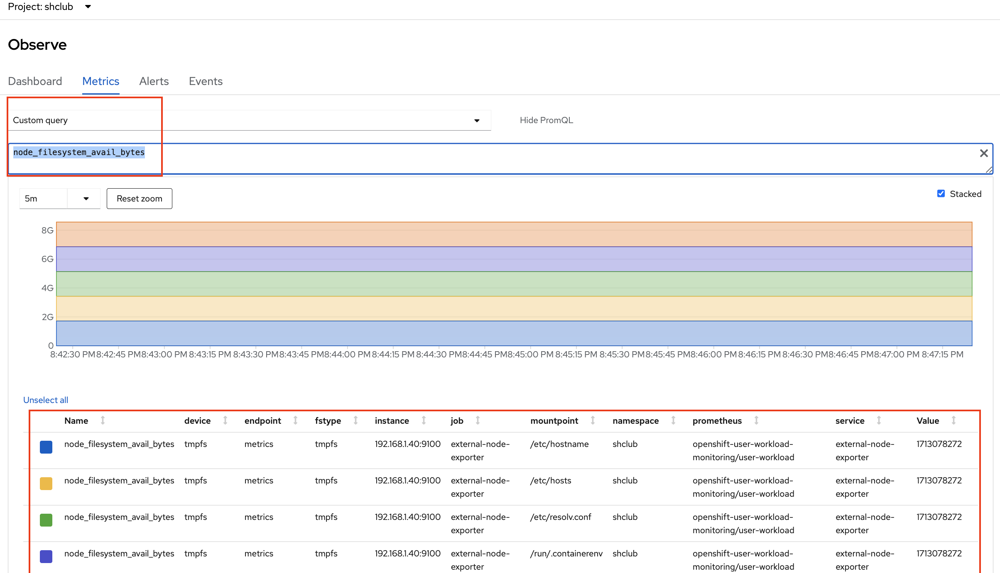

# OKD  설치 방법
 
Redhat Openshift 의  `오픈소스 버전`인 OKD Cluster 를  생성하고 사용해본다.   ( OKD 4.12 버전 기준 : k8s 1.25 )     

<br/>

OKD 설명 참고 :  https://velog.io/@_gyullbb/OKD-%EA%B0%9C%EC%9A%94  

<br/>

0. 환경 정보
   - OKD Console : https://console-openshift-console.apps.okd4.ktdemo.duckdns.org/ 
   - OKD API : https://api.okd4.ktdemo.duckdns.org:6443
   - Minio Object Storage : https://minino.apps.okd4.ktdemo.duckdns.org/   
   - ArgoCD : https://argocd.apps.okd4.ktdemo.duckdns.org/   
   - Harbor Private Docker Registry : https://myharbor.apps.okd4.ktdemo.duckdns.org/    
   - Grafana : https://grafana-route-openshift-user-workload-monitoring.apps.okd4.ktdemo.duckdns.org/  
   - Opensearch :  https://opensearch.apps.okd4.ktdemo.duckdns.org/  
   - kibana :  https://kibana.apps.okd4.ktdemo.duckdns.org/  
   
<br/>

1. 도메인 생성

2. 설치 환경 인프라 구성

3. Bastion 서버 설치 및 설정  

4. Cluster 생성 준비

5. Cluster 생성

6. Cluster 생성 후 할 일

7. Cloud shell 설치 및 core os 설정

8. ArgoCD 설치  

9. Dynamic Provisioning 설치

10. Minio Object Stroage 설치 ( w/ NFS )

11. Harbor ( Private Registry ) 설치 및 설정

12. Compute ( Worker Node ) Join 하기

13. etcd 백업하기 

14. Kubecost 설치  

15. Opensearch 설치  

16. Elastic Stack 설치  


<br/>

## 1. 도메인 생성 

<br>

OKD 설치를 위해서는 Static IP 가 필요하지만 Static IP 가 없는 경우 도메인이 필요하고 아래 방법으로 무료 도메인 ( duckdns )을 생성한다.  

<br/>

https://www.duckdns.org/ 로 접속하여 가입을 하고 본인의 공유기의 WAN IP 와 도메인을 매칭 시킨다. WAN IP가 바뀌어도 주기적으로 update 된다.  

<br/>

ktdemo.duckdns.org 로 생성 을 한다. ip 를 변경하고 싶으면 ip를 수동으로 입력하고 update 한다.


<br/>

위의 도메인이 우리가 설치하는 base 도메인이 된다.  

<br/>

## 2. 설치 환경 인프라 구성

<br/>

설치에 필요한 Node는 총 3 개이고 boostrap 서버는 master 노드 설치 이후 제거 가능하다.  

<br/>


| 서버구분 | Hypervisor | IP | hostname | 용도 | OS | Spec | 기타
|:--------| :-----|:----|  :----|  :----| :----| :----| :----|  
| VM | proxmox | 192.168.1.1.247 | bastion.okd4.ktdemo.duckdns.org | Bastion(LB,DNS) | Centos 8 Stream | 2 core / 4 G / 30G |
| VM | proxmox | 192.168.1.1.128 | bootstrap.okd4.ktdemo.duckdns.org |  Bootstrap | Fedora Core OS 37 | 2 core / 4 G / 40G | 
| VM | vmware | 192.168.1.1.146 | okd-1.okd4.ktdemo.duckdns.org | Master/Worker | Fedora Core OS 37 | 8 core / 20 G / 200G | Base OS 윈도우 11 
| VM | proxmox | 192.168.1.1.148 | okd-2.okd4.ktdemo.duckdns.org |  Worker | Fedora Core OS 37 | 2 core / 16 G / 300G | 워커 노드
| VM | proxmox | 192.168.1.1.149 | okd-3.okd4.ktdemo.duckdns.org |  Worker | Fedora Core OS 37 | 4 core / 20 G / 100G | 워커 노드 추가
| VM | vmware | 192.168.1.1.150 | okd-4.okd4.ktdemo.duckdns.org |  Worker | Fedora Core OS 37 | 4 core / 40 G / 100G | 워커 노드 추가
| VM | hyper-v | 192.168.1.1.154 | okd-5.okd4.ktdemo.duckdns.org |  Worker | Fedora Core OS 37 | 4 core / 16 G / 100G | 워커 노드 추가
| VM | esxi | 192.168.1.1.155 | okd-6.okd4.ktdemo.duckdns.org |  Worker | Fedora Core OS 37 | 4 core / 16 G / 100G | 워커 노드 추가
| VM | virtualbox | 192.168.1.1.156 | okd-6.okd4.ktdemo.duckdns.org |  Worker | Fedora Core OS 37 | 4 core / 14 G / 100G | 워커 노드 추가

<br/>

coreos 버전은 OKD 버전과 일치해야 합니다. 
- 버전이 일치 하지않으면 설치시 pivot 에러 발생  

https://github.com/okd-project/okd/releases?page=1 에서 확인 합니다.     

<br/>

fedora download 
- https://builds.coreos.fedoraproject.org/browser?stream=stable&arch=x86_64

<br/>

```bash
Release Metadata:
  Version:  4.12.0-0.okd-2023-03-18-084815
  Upgrades: <none>
  Metadata:

Component Versions:
  kubernetes 1.25.7        
  machine-os 37.20230218.3 Fedora CoreOS
```

<br/>

## 3. Bastion 서버 설치 및 설정

<br/>

bastion 서버는 centos 8 stream 으로 proxmox 서버에 설치 한다.  

설치 과정은 생략한다.   

설치 이후에 centos에서 네트웍 활성화를 해야 IP 받아온다. 

<br/>

### 3.1 편의성 패키지 설치

<br/>

vi 에디터 와 tar, wget 라이브러리 설치

```bash
[root@localhost shclub]# dnf install -y vim bash-completion tcpdump tar wget
```

<br/>

### 3.2 hostname 설정

<br/>


```bash
[root@localhost shclub]# hostnamectl set-hostname bastion.okd4.ktdemo.duckdns.org
```

<br/>

### 3.3 방화벽및 selinux 설정

<br/>

```bash
[root@localhost shclub]# vi /etc/selinux/config
```  

<br/>

```bash
# This file controls the state of SELinux on the system.
# SELINUX= can take one of these three values:
#     enforcing - SELinux security policy is enforced.
#     permissive - SELinux prints warnings instead of enforcing.
#     disabled - No SELinux policy is loaded.
SELINUX=disabled
```

<br/>  

방화벽을 disable 한다.  


```bash
[root@localhost shclub]# systemctl disable firewalld --now
Removed /etc/systemd/system/multi-user.target.wants/firewalld.service.
Removed /etc/systemd/system/dbus-org.fedoraproject.FirewallD1.service.
```  

<br/>

### 3.4 bastion 서버 dns 확인

<br/>

bastion server는  resolv.conf 의 nameserver 설정 을 확인해야 하는 데 외부 라이브러리
설치를 하기 위해서는 공유기의 IP로 설정을 한다. ( search는 상관 없음 )  

```bash
[root@bastion shclub]# vi /etc/resolv.conf
# Generated by NetworkManager
search okd4.ktdemo.duckdns.org
nameserver 192.168.1.1
```

<br/>

### 3.5 HAProxy 설치 및 구성, 시작

<br/>

HA Proxy ( L7 ) 를 설치한다.

```bash
[root@localhost shclub]# yum install -y haproxy
```  

<br/>

configuration 을 설정한다.    

```bash
[root@bastion shclub]# vi /etc/haproxy/haproxy.cfg
# Global settings
#---------------------------------------------------------------------
global
    maxconn     20000
    log         /dev/log local0 info
    chroot      /var/lib/haproxy
    pidfile     /var/run/haproxy.pid
    user        haproxy
    group       haproxy
    daemon

    # turn on stats unix socket
    stats socket /var/lib/haproxy/stats

#---------------------------------------------------------------------
# common defaults that all the 'listen' and 'backend' sections will
# use if not designated in their block
#---------------------------------------------------------------------
defaults
    log                     global
    mode                    http
    option                  httplog
    option                  dontlognull
    option http-server-close
    option redispatch
    option forwardfor       except 127.0.0.0/8
    retries                 3
    maxconn                 20000
    timeout http-request    10000ms
    timeout http-keep-alive 10000ms
    timeout check           10000ms
    timeout connect         40000ms
    timeout client          300000ms
    timeout server          300000ms
    timeout queue           50000ms

# Enable HAProxy stats
listen stats
    bind :9000
    mode http
    stats enable
    stats uri /
    stats refresh 5s

#---------------------------------------------------------------------
# static backend for serving up images, stylesheets and such
#---------------------------------------------------------------------
backend static
    balance     roundrobin
    server      static 127.0.0.1:4331 check

# OKD  API Server
frontend openshift_api_frontend
    bind *:6443
    default_backend openshift_api_backend
    mode tcp
    option tcplog

backend openshift_api_backend
    mode tcp
    balance source
    server      bootstrap 192.168.1.128:6443 check # bootstrap 서버
    server      okd-1 192.168.1.146:6443 check # okd master/worker 설정
    server      okd-2 192.168.1.148:6443 check  # 추가 서버 있다면 설정

# OKD Machine Config Server
frontend okd_machine_config_server_frontend
    mode tcp
    bind *:22623
    default_backend okd_machine_config_server_backend

backend okd_machine_config_server_backend
    mode tcp
    balance source
    server      bootstrap 192.168.1.128:22623 check # bootstrap 서버
    server      okd-1 192.168.1.146:22623 check # okd master/worker 설정
    server      okd-2 192.168.1.148:22623 check  # 추가 서버 있다 면 설정

# OKD Ingress - layer 4 tcp mode for each. Ingress Controller will handle layer 7.
frontend okd_http_ingress_frontend
    bind *:80
    default_backend okd_http_ingress_backend
    mode tcp

backend okd_http_ingress_backend
    balance source
    mode tcp
    server      okd-1 192.168.1.146:80 check # okd master/worker 설정
    server      okd-2 192.168.1.148:80 check  # 추가 서버 있다 면 설정

frontend okd_https_ingress_frontend
    bind *:443
    default_backend okd_https_ingress_backend
    mode tcp

backend okd_https_ingress_backend
    mode tcp
    balance source
    server      okd-1 192.168.1.146:443 check
    server      okd-2 192.168.1.148:443 check  # 추가 서버 있다 면 설정

```

<br/>

haproxy를 enable 해서 활성화 한다.  

```bash
[root@localhost shclub]# systemctl enable haproxy --now
```  

<br/>

서비스 활성화시에 애러가 발생하면 status를 확인한다.

```bash
[root@bastion shclub]# systemctl status haproxy
```  

<br/>

bind 에러가 나는 경우 아래와 같이 설정한다.

```bash
[root@bastion shclub]# setsebool -P haproxy_connect_any=1
[root@bastion shclub]# systemctl restart haproxy
```  

<br/>

HAproxy 로드발란서 상태 및 전송량 등 통계를 확인하려면 위에서 설정한대로 아래 URL 및 계정을 이용하여 로그인하면 됩니다.  
아래는 haproxy.cfg 설정이다.  

```bash
# Enable HAProxy stats
listen stats
    bind :9000
  stats auth admin:az1@
  stats uri /stats
```
<br/>

브라우저에서 http://192.168.1.247:9000/stats 로 로그인 하고 권한 을 설정했다면 위에 설정한 값으로 로그인 한다.  
- 계정 : admin / az1@


<br/>

### 3.6 HTTP 서버 ( Apache ) 설치 및 구성

<br/>

bootstrap , master , worker 노드를 생성하기 위해서는 bastion에 web 서버를 구성하여  
ignition 화일을 다운 받아 설치를 한다.  ( 여기서는 Apache를 설치한다. )    

<br/>

HTTP 설치 후 기본 80 포트 구성을 8080으로 변경한 후 서비스를 시작합니다.

```bash
[root@localhost ~]# dnf install -y httpd
[root@localhost ~]# vi /etc/httpd/conf/httpd.conf
```

<br/>

```bash
[root@localhost ~]# cat /etc/httpd/conf/httpd.conf | grep Listen
# Listen: Allows you to bind Apache to specific IP addresses and/or
# Change this to Listen on specific IP addresses as shown below to
#Listen 12.34.56.78:80
Listen 8080
```  
<br/>

Apache web server를 활성화 하고 재기동 한다.

```bash
[root@localhost ~]# systemctl enable httpd --now
Created symlink /etc/systemd/system/multi-user.target.wants/httpd.service → /usr/lib/systemd/system/httpd.service.

[root@localhost ~]# systemctl restart httpd
```  

<br/>

### 3.7 DNS 서버 설치 및 구성

<br/>

bind 를 설치하고 DNS 서버를 구성하자.  

<br/>

```bash
[root@localhost ~]# dnf install -y bind bind-utils
[root@localhost ~]# systemctl enable named --now
Created symlink /etc/systemd/system/multi-user.target.wants/named.service → /usr/lib/systemd/system/named.service.
```

<br/>

/etc/named.conf 화일을 수정한다.  

<br/>

```bash
[root@bastion shclub]# vi /etc/named.conf
options {
	listen-on port 53 { any; };
	listen-on-v6 port 53 { none; };
	directory 	"/var/named";
	dump-file 	"/var/named/data/cache_dump.db";
	statistics-file "/var/named/data/named_stats.txt";
	memstatistics-file "/var/named/data/named_mem_stats.txt";
	secroots-file	"/var/named/data/named.secroots";
	recursing-file	"/var/named/data/named.recursing";
	allow-query     { any; };

	/*
	 - If you are building an AUTHORITATIVE DNS server, do NOT enable recursion.
	 - If you are building a RECURSIVE (caching) DNS server, you need to enable
	   recursion.
	 - If your recursive DNS server has a public IP address, you MUST enable access
	   control to limit queries to your legitimate users. Failing to do so will
	   cause your server to become part of large scale DNS amplification
	   attacks. Implementing BCP38 within your network would greatly
	   reduce such attack surface
	*/
	recursion yes;

	dnssec-enable yes;
	dnssec-validation yes;

	managed-keys-directory "/var/named/dynamic";

	pid-file "/run/named/named.pid";
	session-keyfile "/run/named/session.key";

	/* https://fedoraproject.org/wiki/Changes/CryptoPolicy */
	include "/etc/crypto-policies/back-ends/bind.config";
};

logging {
        channel default_debug {
                file "data/named.run";
                severity dynamic;
        };
};

zone "." IN {
	type hint;
	file "named.ca";
};

include "/etc/named.rfc1912.zones";
include "/etc/named.root.key";
```

<br/>

/etc/named.rfc1912.zones 화일을 수정한다.    

아래 2개의 존을 설정해야 한다.     
- ktdemo.duckdns.org : DNS 정방향
- 1.168.192.arpa : DNS 역방향 (  192.168.1 의 반대로 설정 )

<br/>

```bash
zone "ktdemo.duckdns.org" IN {
        type master;
        file "/var/named/okd4.ktdemo.duckdns.org.zone";
        allow-update { none; };
};

zone "1.168.192.arpa" IN {
        type master;
        file "/var/named/1.168.192.in-addr.rev";
        allow-update { none; };
};
```  

<br/>

```bash
[root@bastion named]# vi /etc/named.rfc1912.zones
zone "localhost.localdomain" IN {
	type master;
	file "named.localhost";
	allow-update { none; };
};

zone "localhost" IN {
	type master;
	file "named.localhost";
	allow-update { none; };
};

zone "1.0.0.0.0.0.0.0.0.0.0.0.0.0.0.0.0.0.0.0.0.0.0.0.0.0.0.0.0.0.0.0.ip6.arpa" IN {
	type master;
	file "named.loopback";
	allow-update { none; };
};

zone "1.0.0.127.in-addr.arpa" IN {
	type master;
	file "named.loopback";
	allow-update { none; };
};

zone "0.in-addr.arpa" IN {
	type master;
	file "named.empty";
	allow-update { none; };
};

zone "ktdemo.duckdns.org" IN {
        type master;
        file "/var/named/okd4.ktdemo.duckdns.org.zone";
        allow-update { none; };
};

zone "1.168.192.arpa" IN {
        type master;
        file "/var/named/1.168.192.in-addr.rev";
        allow-update { none; };
};
```

<br/>

/var/named 폴더로 이동한다.

<br/>

```bash
[root@bastion shclub]# cd /var/named
```  

<br/>

okd4.ktdemo.duckdns.org.zone 파일 설정 ( DNS 정방향 )  
- ip와 hostname을 잘 수정한다.  

<br/>

```bash
[root@bastion named]# ls
  data  dynamic  named.ca  named.empty  named.localhost  named.loopback   slaves
[root@bastion named]# vi okd4.ktdemo.duckdns.org.zone
$TTL 1D
@ IN SOA @ ns.ktdemo.duckdns.org. (
				0	; serial
				1D	; refresh
				1H	; retry
				1W	; expire
				3H )	; minimum
@ IN NS ns.ktdemo.duckdns.org.
@ IN A  192.168.1.247	;

; Ancillary services
lb.okd4 	IN	A       192.168.1.247

; Bastion or Jumphost
ns	IN	A	192.168.1.247	;

; OKD Cluster
bastion.okd4    IN      A       192.168.1.247
bootstrap.okd4	IN	A	192.168.1.128

okd-1.okd4	IN	A	192.168.1.146
okd-2.okd4	IN	A	192.168.1.148

api.okd4	IN	A	192.168.1.247
api-int.okd4	IN	A	192.168.1.247
*.apps.okd4	IN	A	192.168.1.247
```


<br/>

1.168.192.in-addr.rev 파일 설정 ( DNS 역방향 )

<br/>

```bash
[root@bastion named]# vi 1.168.192.in-addr.rev
$TTL 1D
@	IN	SOA	ktdemo.duckdns.org. ns.ktdemo.duckdns.org. (
						0	; serial
						1D	; refresh
						1H	; retry
						1W	; expire
						3H )	; minimum

@	IN	NS	ns.
247	IN	PTR	ns.
247	IN	PTR	bastion.okd4.ktdemo.duckdns.org.
128	IN	PTR	bootstrap.okd4.ktdemo.duckdns.org.
146	IN	PTR	okd-1.okd4.ktdemo.duckdns.org.
148	IN	PTR	okd-2.okd4.ktdemo.duckdns.org.

247	IN	PTR	api.okd4.ktdemo.duckdns.org.
247	IN	PTR	api-int.okd4.ktdemo.duckdns.org.
```

<br/>

zone 파일 권한 설정을 하고 named 서비스를 재기동한다.    

<br/>

```bash
[root@bastion named]# chown root:named okd4.ktdemo.duckdns.org.zone
[root@bastion named]# chown root:named 1.168.192.in-addr.rev
[root@bastion named]# systemctl restart named
```  

<br/>  

이제 bastion 서버의 기본 설정을 완료를 하였다. 


<br/>

## 4. Cluster 생성 준비

<br/>

### 4.1 SSH Key pair 생성

<br/>

bastion 서버의 root 폴더로 이동한다.

<br/>

```bash
[root@bastion named]# cd ~/
```  

<br/>

rsa key를 생성하고 엔터를 계속 치면 2개의 화일이 .ssh 폴더에 생성이 된다.  
- id_rsa : private key
- id_rsa.pub : public key ( bootstrap , master/worker 에 설치 될 key )

<br/>

```bash
[root@localhost ~]# ssh-keygen -t rsa -b 4096 -N ''
Generating public/private rsa key pair.
Enter file in which to save the key (/root/.ssh/id_rsa):
Created directory '/root/.ssh'.
Your identification has been saved in /root/.ssh/id_rsa.
Your public key has been saved in /root/.ssh/id_rsa.pub.
The key fingerprint is:
SHA256:QDIN4njCh9DzWBhgeUu3gye3VldDPb2*****jsXr**l4o root@bastion.okd4.ktdemo.duckdns.org
The key's randomart image is:
+---[RSA 4096]----+
|o++o+o.   ... .  |
|++=+.=.    o o . |
|oo=*+ o   . . . .|
| oo+.= o .   . o |
|    + + S     + .|
|     o       o  .|
|    .       .  .=|
|           .....*|
|           E.o++.|
+----[SHA256]-----+
```  

<br/>

### 4.2 oc 실행 바이너리 와 openshift-install 바이너리 다운로드

<br/>

oc 실행 바이너리 와 openshift-install 바이너리 다운로드 하고 압축을 푼다.  

<br/>


```bash
[root@localhost ~]# wget https://github.com/okd-project/okd/releases/download/4.12.0-0.okd-2023-03-18-084815/openshift-client-linux-4.12.0-0.okd-2023-03-18-084815.tar.gz

[root@localhost ~]# wget https://github.com/okd-project/okd/releases/download/4.12.0-0.okd-2023-03-18-084815/openshift-install-linux-4.12.0-0.okd-2023-03-18-084815.tar.gz

[root@bastion ~]# tar xvfz openshift-client-linux-4.12.0-0.okd-2023-03-18-084815.tar.gz
README.md
oc
kubectl
[root@bastion ~]# tar xvfz openshift-install-linux-4.12.0-0.okd-2023-03-18-084815.tar.gz
README.md
openshift-install
```
<br/>

/usr/local/bin/ 폴더에 실행화일을 이동하고 실행 권한을 준다.   

<br/>

```bash
[root@bastion ~]# mv oc kubectl openshift-install /usr/local/bin/
[root@bastion ~]# chmod 755 /usr/local/bin/{oc,kubectl,openshift-install}
[root@bastion ~]# /usr/local/bin/oc version
Client Version: 4.12.0-0.okd-2023-03-18-084815
Kustomize Version: v4.5.7
```

<br/>


### 4.3 pull secret 다운 받기

<br/>

OKD를 설치 하는 과정에서 redhat 의 private registry 에서 이미지를 다운을 받는다.  
private registry 에 접속하기 위해서는 pull secret이 필요하고 아래 redhat 사이트에 접속을 하여 가입을 하고 pull secret를 다운 받는다.  

<br/>

> pull secret 을 받은 후 24시간 안에  master node 설치를 완료 해야 한다.  

<br/>

접속하기 : https://cloud.redhat.com/openshift/create/local

<br/>


<br/>

pull secret의 포맷은 아래와 같다.  

<br/>

```bash
{"auths":{"cloud.openshift.com":{"auth":"b3BlbnNoaWZ0LXJlbGVhc2UtZGV2K29jbV9hY2Nlc3NfODA3Yjc0MDgzODBmNDg4NmE-------zSDdNSTFGRzFPN1hBODRSQjZONTFYSw==","email":"shclub@gmail.com"},"quay.io":{"auth":"b3BlbnNoaWZ0LXJlbGVhc2UtZGV2K29jbV9hY2Nlc3NfODA3Yjc0MDgzODBmNDg4NmExYTE4YWVjMzZjZDc3ZTE6WEhHTVhYWlAzMjEyR0tJUFRaN0Y3MUNSWVRHUEVMM1BBRThQUExWSlEzSDdNSTFGRzFPN1hBODRSQjZONTFYSw==","email":"shclub@gmail.com"},"registry.connect.redhat.com":{"auth":"fHVoYy1wb29sLTYxMTBkMjQyLTQ3MjgtNDBhYS05Zjc5LTdjZTMyNDUyNzJlYzpleUpoYkdjaU9pSlNVelV4TWlKOS5leUp6ZFdJaU9pSXdaamMyTkRRMU4yVXdNREUwT0dJek9EZGpNVGMyTW1GaE9ERTBORGcwTVNKOS5aNXZrTnNTb3NlQ1NfTDZOQ1NiN0I5NTVkUkR4NmVsUWpkZGMwRl9-------wSlRiX0hrUVVoUHE5dEthOVZDOWtsS2tCNVViSEF3OXByNTdnR25QSzFRNzJycDI4NA==","email":"shclub@gmail.com"},"registry.redhat.io":{"auth":"-------Da3JnS0xUMEJqYks5Y0FoR0JfRjBZMjZEa3lCOHF2SkdRSGE2VklOQ1Y3dnpRTU1GU3lHeWdZQ2VkWjFSWk9PRUQwSlRiX0hrUVVoUHE5dEthOVZDOWtsS2tCNVViSEF3OXByNTdnR25QSzFRNzJycDI4NA==","email":"shclub@gmail.com"}}}
```  

<br/>

### 4.4 install-config.yaml 파일 생성 및 백업

<br/>

manifest 와 inition 화일을 생성하기 위하여 install-config.yaml를 만든다.

<br/>

pull secret 항목은 위에서 다운받은 redhat pull secret을 복사하고 ssh 키는 bastion에서 생성한 public key를 가져와서 붙여 넣는다.  

```bash
[root@bastion ~]# mkdir -p okd4
[root@bastion ~]# vi ./okd4/install-config.yaml
apiVersion: v1
baseDomain: ktdemo.duckdns.org  # 베이스 도메인. 본인의 공유기 도메인
compute:
- hyperthreading: Enabled
  name: worker
  replicas: 1  # 워커 노드 수
controlPlane:
  hyperthreading: Enabled
  name: master
  replicas: 1  # 마스터 노드 수 ( master 노드는 기본은 worker node 혼용으로 설정 )
metadata:
  name: okd4  # OKD Cluster 이름이며 base domain 앞에 추가가 된다.
networking:
  clusterNetwork:
  - cidr: 10.128.0.0/14
    hostPrefix: 23
  networkType: OpenShiftSDN
  serviceNetwork:
  - 172.30.0.0/16
platform:
  none: {}
pullSecret: '{"auths":{"cloud.openshift.com":{"auth":"b3BlbnNoaWZ0LXJlbGVhc2UtZGV2K29jbV9hY2Nlc3NfODA3Yjc0MDgzODBmNDg4NmExYTE4YWVjMzZjZDc3ZTE6WEhHTVhYWlAzMjEyR0tJUFRaN0Y3MUNSWVRHUEVMM1BBRThQUExWSlE----CNVViSEF3OXByNTdnR25QSzFRNzJycDI4NA==","email":"shclub@gmail.com"}}}'
sshKey: 'ssh-rsa AAAAB3NzaC1yc2EAAAADAQABAAACAQCWJkGLkamR8mtMhNPUC7fY5lzXZFzGpEFftZwkFoXCBWmF------R8chyf60CkHOTFHVqsUHNs3JdkvmJBPWrE3FN3w== root@bastion.okd4.ktdemo.duckdns.org'
```  

<br/>

install-config.yaml 파일은 manifest 와 ignition 생성후 삭제가 되기때문에 백업 폴더를 생성하여 저장한다. 

```bash
[root@bastion ~]# mkdir backup
[root@bastion ~]# cp ./okd4/install-config.yaml ./backup/install-config.yaml
```

<br/>

manifest 화일을 생성한다.    

openshift 폴더가 생성이되고 master/worker 노드 설정 화일들이 있어 여기 값을 수정하여 role 을 할당 할 수 있다.

<br/>

```bash
[root@bastion ~]# /usr/local/bin/openshift-install create manifests --dir=okd4
INFO Consuming Install Config from target directory
INFO Manifests created in: okd4/manifests and okd4/openshift
[root@bastion ~]# ls ./okd4
manifests  openshift
[root@bastion ~]# ls ./okd4/openshift
99_kubeadmin-password-secret.yaml                      99_openshift-machineconfig_99-master-ssh.yaml
99_openshift-cluster-api_master-user-data-secret.yaml  99_openshift-machineconfig_99-worker-ssh.yaml
99_openshift-cluster-api_worker-user-data-secret.yaml  openshift-install-manifests.yaml
```
<br/>


master 노드 기능의  구성을 하려면 manifest/cluster-scheduler-02-config.yml의 mastersSchedulable 파라미터를 `false` 로 변경한다.     

```bash
[root@bastion manifests]# vi cluster-scheduler-02-config.yml
[root@bastion manifests]# cat cluster-scheduler-02-config.yml
apiVersion: config.openshift.io/v1
kind: Scheduler
metadata:
  creationTimestamp: null
  name: cluster
spec:
  mastersSchedulable: false
  policy:
    name: ""
status: {}
```

<br/>

향후 수정할수 있고 master 노드에서 worker role을 삭제하려면 아래 명령어를 통해 삭제 할 수 있습니다.  

```bash
[root@bastion ]# oc patch schedulers.config.openshift.io/cluster --type merge -p '{"spec":{"mastersSchedulable":false}}'
scheduler.config.openshift.io/cluster patched
```  

<br/>
만일, master 노드에서 다시 worker role을 추가하려면 아래 명령어를 통해 롤을 부여 할 수 있습니다.  

```bash
[root@bastion ]# oc patch schedulers.config.openshift.io/cluster --type merge -p '{"spec":{"mastersSchedulable":true}}'
scheduler.config.openshift.io/cluster patched
```  

<br/>


coreos 설정을 위한 ignition 화일을 생성한다.    
역할 별로 ign 파일이 생성이 되고 auth 폴더 안에는 연결 정보 (kubeconfig) 가 저장이 되어 있다.

<br/>

```bash
[root@bastion ~]# /usr/local/bin/openshift-install create ignition-configs --dir=okd4
INFO Consuming OpenShift Install (Manifests) from target directory
INFO Consuming Openshift Manifests from target directory
INFO Consuming Worker Machines from target directory
INFO Consuming Common Manifests from target directory
INFO Consuming Master Machines from target directory
INFO Ignition-Configs created in: okd4 and okd4/auth
[root@bastion ~]# ls ./okd4/
auth  bootstrap.ign  master.ign  metadata.json  worker.ign
```  

<br/>

bastion web 서버에 ign 화일을 복사하고 apache web server를 재 기동한다.

<br/>

```bash
[root@bastion ~]# mkdir /var/www/html/ign
[root@bastion ~]# cp ./okd4/*.ign /var/www/html/ign/
[root@bastion ~]# chmod 777 /var/www/html/ign/*.ign
[root@bastion ~]# systemctl restart httpd
```

<br/>

### 4.5 bootstrap 서버 생성

<br/>

proxmox 서버에 coreos 기반의 bootstrap 용 서버를 생성한다. ( 생성 과정은 생략 )

<br.>

- 다운로드 위치 : 
https://builds.coreos.fedoraproject.org/browser?stream=stable&arch=x86_64
- Version : fedora-coreos-37.20230218.3.0-live.x86_64.iso

<br/>

처음 기동인 되면 자동 로그인 이 되고 proxmox 에서 OS 콘솔로 접속이 가능하다. 
- proxmox 콘솔은 웹이기 때문애 붙여 넣기가 안된다.


<br/>

먼저 네트웍을 설정을 하기 위해서 network device 이름을 확인한다.  
nmcli 대신 nmtui를 사용하면 gui 모드로 설정 가능하다.   

```bash  
[root@localhost core]# nmcli device
ens160   ethernet  connected  Wired connection 1
lo      loopback  unmanaged  --
```  

<br/>

connection 이름을 ens18로 생성한다.  

```bash  
[root@localhost core]# nmcli connection add type ethernet autoconnect yes con-name ens160 ifname ens160
```  

<br/>

네트웍 설정을 한다.  
- ip : bootstrap 서버는 192.168.1.128/24 로 설정한다.
- dns : bastion 서버는 192.168.1.247 로 설정한다.
- gateway : 공유기 ip 인 192.168.1.1 로 설정한다. ( bastion 서버 ip로 해도 상관 없음 )
- dns-search : okd4.ktdemo.duckdns.org 로 설정 ( cluster 이름 + . + base Domain)

<br/>

```bash  
[root@localhost core]# nmcli connection modify ens160 ipv4.addresses 192.168.1.128/24 ipv4.method manual
[root@localhost core]# nmcli connection modify ens160 ipv4.dns 192.168.1.247
[root@localhost core]# nmcli connection modify ens160 ipv4.gateway 192.168.1.1
[root@localhost core]# nmcli connection modify ens160 ipv4.dns-search okd4.ktdemo.duckdns.org
```  

<br/>

설치를 시작하기 전에 bastion 서버의 /etc/resolv.conf 화일에서 nameserver 설정을 bastion 서버의 ip인 192.168.1.247 로 변경한다.  
- 변경하지 않으면 EOF 에러등 다양한 에러가 발생한다.
- 이제 부터는 내부 네트웍만 필요하다.    


<br/>

아래 명령어로 bootstrap 서버 설치를 시작한다.
- --copy-network 의미는 설치 될때 위에서 설정한 네트웍 정보로 설치가 된다.

<br/>

disk 종류를 조회 한다.

```bash  
[root@localhost core]# fdisk -l
Disk /dev/loop0: 386.14 MiB, 404901888 bytes, 790824 sectors
Units: sectors of 1 * 512 = 512 bytes
Sector size (logical/physical): 512 bytes / 512 bytes
I/O size (minimum/optimal): 512 bytes / 512 bytes


Disk /dev/nvme0n1: 50 GiB, 53687091200 bytes, 104857600 sectors
Disk model: VMware Virtual NVMe Disk
Units: sectors of 1 * 512 = 512 bytes
Sector size (logical/physical): 512 bytes / 512 bytes
I/O size (minimum/optimal): 512 bytes / 512 bytes


Disk /dev/loop1: 680.51 MiB, 713562624 bytes, 1393677 sectors
Units: sectors of 1 * 512 = 512 bytes
Sector size (logical/physical): 512 bytes / 512 bytes
I/O size (minimum/optimal): 512 bytes / 512 bytes
```  
 
<br/>

```bash  
[root@localhost core]# coreos-installer install --copy-network /dev/sda -I http://192.168.1.247:8080/ign/bootstrap.ign --insecure-ignition 
Installing Fedora CoreOS 37.20230218.3.0 x86_64 (512-byte sectors)
> Read disk 2.5 GiB/2.5 GiB (100%)
Writing Ignition config
Copying networking configuration from /etc/NetworkManager/system-connections/
Copying /etc/NetworkManager/system-connections/ens18.nmconnection to installed system
Copying /etc/NetworkManager/system-connections/ens18-37d95251-8740-4053-a3ee-99ef2a2063c2.nmconnection to installed system
Install complete.
``` 

<br/>

설치가 완료 되면 재기동 한다. 

```bash
[root@localhost core]# reboot now
```

<br/>

bastion 서버에서 bootsrap 서버로 로그인을 해본다.

```bash
[root@bastion config]# ssh core@192.168.1.128
The authenticity of host '192.168.1.128 (192.168.1.128)' can't be established.
ECDSA key fingerprint is SHA256:7+MOJdsnC548GUrGZxYKTnvhG94F+2kyGa2bpSH6eA8.
Are you sure you want to continue connecting (yes/no/[fingerprint])? yes
Warning: Permanently added '192.168.1.128' (ECDSA) to the list of known hosts.
Red Hat Enterprise Linux CoreOS 48.84.202109241901-0
  Part of OpenShift 4.8, RHCOS is a Kubernetes native operating system
  managed by the Machine Config Operator (`clusteroperator/machine-config`).

WARNING: Direct SSH access to machines is not recommended; instead,
make configuration changes via `machineconfig` objects:
  https://docs.openshift.com/container-platform/4.8/architecture/architecture-rhcos.html

---
This is the bootstrap node; it will be destroyed when the master is fully up.

The primary services are release-image.service followed by bootkube.service. To watch their status, run e.g.

  journalctl -b -f -u release-image.service -u bootkube.service
```

<br/>

아래 명령어를 사용하여 설치 로그를 확인한다.    
시간이 지나면 한번 재기동을 진행한다.  

```bash
[core@localhost ~]$  journalctl -b -f -u release-image.service -u bootkube.service
Aug 31 05:03:07 localhost.localdomain systemd[1]: Starting release-image.service - Download the OpenShift Release Image...
Aug 31 05:03:07 localhost.localdomain release-image-download.sh[1552]: Pulling quay.io/openshift/okd@sha256:7153ed89133eeaca94b5fda702c5709b9ad199ce4ff9ad1a0f01678d6ecc720f...
Aug 31 05:03:07 localhost.localdomain podman[1627]: 2023-08-31 05:03:07.966165638 +0000 UTC m=+0.261238989 system refresh
Aug 31 05:03:24 localhost.localdomain release-image-download.sh[1627]: 976927c0e02baf3b3ef5c78bfed8b856bac8a7123f8e0f28cd15108db602202a
Aug 31 05:03:24 localhost.localdomain podman[1627]: 2023-08-31 05:03:07.967191803 +0000 UTC m=+0.262265164 image pull  quay.io/openshift/okd@sha256:7153ed89133eeaca94b5fda702c5709b9ad199ce4ff9ad1a0f01678d6ecc720f
Aug 31 05:03:24 localhost.localdomain systemd[1]: Finished release-image.service - Download the OpenShift Release Image
[root@localhost core]# sudo podman images
REPOSITORY                     TAG         IMAGE ID      CREATED       SIZE
quay.io/openshift/okd          <none>      976927c0e02b  5 months ago  422 MB
quay.io/openshift/okd-content  <none>      809d1bb470e0  5 months ago  2.33 GB
quay.io/openshift/okd-content  <none>      7409643ff5f3  5 months ago  448 MB
quay.io/openshift/okd-content  <none>      20487d50fb08  8 months ago  419 MB
[core@localhost ~]$
Broadcast message from root@localhost (Fri 2023-09-01 03:05:03 UTC):

The system is going down for reboot NOW!

Connection to 192.168.1.128 closed by remote host.
Connection to 192.168.1.128 closed.
```
 
 <br/>

부팅 완료 후 다시 로그인 해보면 설치가 진행이 된다.  

```bash
[core@localhost ~]$   journalctl -b -f -u release-image.service -u bootkube.service
Aug 31 05:06:57 localhost.localdomain bootkube.sh[2122]: Writing asset: /assets/config-bootstrap/manifests/0000_10_config-operator_01_infrastructure.crd.yaml
Aug 31 05:06:57 localhost.localdomain podman[2122]: 2023-08-31 05:06:57.175032705 +0000 UTC m=+10.142264168 container died 9e9f18af07f6c6ae0a1d344ff09b8ab388bcacb946575aa2ee5bd637067aa79b (image=quay.io/openshift/okd-content@sha256:fbc0cf0b8d2d8c1986c51b7dce88f36b33d6ff4a742d42e91edbae0b48b6991f, name=config-render, name=openshift/ose-base, version=v4.12.0, com.redhat.build-host=cpt-1001.osbs.prod.upshift.rdu2.redhat.com, io.openshift.tags=openshift,base, io.k8s.display-name=4.12-base, vcs-type=git, vendor=Red Hat, Inc., io.k8s.description=ART equivalent image openshift-4.12-openshift-enterprise-base - rhel-8/base-repos, release=202212060046.p0.g7e8a010.assembly.stream, distribution-scope=public, io.openshift.maintainer.product=OpenShift Container Platform, io.openshift.build.name=, maintainer=Red Hat, Inc., io.openshift.build.commit.date=, summary=Provides the latest release of the Red Hat Extended Life Base Image., url=https://access.redhat.com/containers/#/registry.access.redhat.com/openshift/ose-base/images/v4.12.0-202212060046.p0.g7e8a010.assembly.stream, io.openshift.build.commit.ref=release-4.12, com.redhat.license_terms=https://www.redhat.com/agreements, io.openshift.build.commit.message=, io.openshift.build.source-context-dir=, vcs-ref=4c6e171d26cc3c302c6d6193060344456bc381a1, build-date=2022-12-06T08:50:37, io.openshift.build.commit.id=4c6e171d26cc3c302c6d6193060344456bc381a1, io.buildah.version=1.26.4, vcs-url=https://github.com/openshift/cluster-config-operator, io.openshift.build.source-location=https://github.com/openshift/cluster-config-operator, io.openshift.release.operator=true, io.openshift.build.namespace=, io.openshift.build.commit.url=https://github.com/openshift/images/commit/7e8a0105eb7369f3f92ad7b2581a2efffab5b28e, description=This is the base image from which all OpenShift Container Platform images inherit., io.openshift.maintainer.component=Release, io.openshift.ci.from.base=sha256:0a36c595ecd06f505df6f5f140bf4d851f112db1120f447ee116b80e2ab47f0f, io.openshift.build.commit.author=, com.redhat.component=openshift-enterprise-base-container, architecture=x86_64, io.openshift.expose-services=, License=GPLv2+)
```

<br/>

nameserver 가 변경 된것을 확인 할 수 있다.  

```bash
[core@localhost ~]$ sudo cat /etc/resolv.conf
nameserver 192.168.1.247
search okd4.ktdemo.duckdns.org
```  

<br/>

bootstrap 서버에서 exit 하여 bastion 서버로 돌아오고 아래 명령어를 사용하여 모니터링 한다.   

아래 API 버전까지 나와야 정상이고  대부분  the Kubernetes API 서버 접속시 에러가 많이 발생하는데 DNS 서버인 Bastion 서버의 ip로 설정이 안되어 있는 경우가 많다.  

bootstrap 노드가 재기동 된 후 부터 아래 명령어를 사용해야 API 서버 EOF 에러가 발생 하지 않는다.  

<br/>

```bash
[root@bastion ~]# openshift-install --dir=/root/okd4 wait-for bootstrap-complete --log-level=debug
DEBUG OpenShift Installer 4.12.0-0.okd-2023-03-18-084815
DEBUG Built from commit 4688870d3a709eea34fe2bb5d1c62dea2cfd7e91
INFO Waiting up to 20m0s (until 10:26PM) for the Kubernetes API at https://api.okd4.ktdemo.duckdns.org:6443...
DEBUG Loading Agent Config...
INFO API v1.25.0-2786+eab9cc98fe4c00-dirty up
DEBUG Loading Install Config...
DEBUG   Loading SSH Key...
DEBUG   Loading Base Domain...
DEBUG     Loading Platform...
DEBUG   Loading Cluster Name...
DEBUG     Loading Base Domain...
DEBUG     Loading Platform...
DEBUG   Loading Networking...
DEBUG     Loading Platform...
DEBUG   Loading Pull Secret...
DEBUG   Loading Platform...
DEBUG Using Install Config loaded from state file
INFO Waiting up to 30m0s (until 10:36PM) for bootstrapping to complete...
```

<br/>

`INFO Waiting up to 30m0s (until 10:36PM) for bootstrapping to complete...`

위의 메시지가 나오면 바로 master node를 생성한다.  


<br/>

bootstrap 서버에 아래와 같이 pivot 에러가 발생하면 okd 버전에 맞는 coreos 가 달라서 발생한다.  okd github에서 해당 coreos를 찾아서 설치 해아한다.  

```bash
Aug 30 21:59:22 localhost.localdomain bootstrap-pivot.sh[19646]: + error_line='\''1 source ./pre-pivot.sh'\''
Aug 30 21:59:22 localhost.localdomain bootstrap-pivot.sh[19646]: ++ journalctl --unit=release-image-pivot.service --lines=3 --output=cat' '. += [
Aug 30 21:59:22 localhost.localdomain bootstrap-pivot.sh[19646]:           {$timestamp,$preCommand,$postCommand,$stage,$phase,$result,$errorLine,$errorMessage} |
Aug 30 21:59:22 localhost.localdomain bootstrap-pivot.sh[19646]:           reduce keys[] as $k (.; if .[$k] == "" then del(.[$k]) else . end)
Aug 30 21:59:22 localhost.localdomain bootstrap-pivot.sh[19646]:         ]'
Aug 30 21:59:22 localhost.localdomain bootstrap-pivot.sh[18854]: + mv /var/log/openshift//release-image-pivot.json.tmp /var/log/openshift//release-image-pivot.json
Aug 30 21:59:22 localhost.localdomain systemd[1]: release-image-pivot.service: Main process exited, code=exited, status=1/FAILURE
```  

<br/> 

아래 처럼 os 이미지 버전이 안 맞아서 rebase 해야 한다. coreos 재설치가 답이다.  

```bash
rpm-ostree rebase --experimental "ostree-unverified-registry:${MACHINE_OS_IMAGE}"
```
<br/>

설치 시 bootstrap 서버에 들어가서 oc 명령어를 사용하여 상태를 볼 수도 있다.   

```bash
[root@localhost core]# cd /etc/kubernetes
[root@localhost kubernetes]# oc --kubeconfig kubeconfig get po -A
NAMESPACE                              NAME                              READY   STATUS    RESTARTS   AGE
openshift-operator-lifecycle-manager   collect-profiles-28224240-dvr6d   0/1     Pending   0          14m

[root@localhost kubernetes]# oc --kubeconfig kubeconfig get events  -n openshift-operator-lifecycle-manager
LAST SEEN   TYPE      REASON              OBJECT                                        MESSAGE
37m         Warning   FailedCreate        replicaset/catalog-operator-c5d66646d         Error creating: pods "catalog-operator-c5d66646d-" is forbidden: autoscaling.openshift.io/ManagementCPUsOverride the cluster does not have any nodes
18m         Warning   FailedCreate        replicaset/catalog-operator-c5d66646d         Error creating: pods "catalog-operator-c5d66646d-" is forbidden: autoscaling.openshift.io/ManagementCPUsOverride the cluster does not have any nodes
3m25s       Warning   FailedCreate        replicaset/catalog-operator-c5d66646d         Error creating: pods "catalog-operator-c5d66646d-" is forbidden: autoscaling.openshift.io/ManagementCPUsOverride the cluster does not have any nodes
48m         Normal    ScalingReplicaSet   deployment/catalog-operator                   Scaled up replica set catalog-operator-c5d66646d to 1
33m         Warning   FailedScheduling    pod/collect-profiles-28224315-hh5n8           no nodes available to schedule pods
29m         Warning   FailedScheduling    pod/collect-profiles-28224315-hh5n8           no nodes available to schedule pods
28m         Warning   FailedScheduling    pod/collect-profiles-28224315-hh5n8           skip schedule deleting pod: openshift-operator-lifecycle-manager/collect-profiles-28224315-hh5n8
43m         Normal    SuccessfulCreate    job/collect-profiles-28224315                 Created pod: collect-profiles-28224315-hh5n8
28m         Warning   FailedScheduling    pod/collect-profiles-28224330-vb69j           no nodes available to schedule pods
23m         Warning   FailedScheduling    pod/collect-profiles-28224330-vb69j           no nodes available to schedule pods
28m         Normal    SuccessfulCreate    job/collect-profiles-28224330                 Created pod: collect-profiles-28224330-vb69j
13m         Warning   FailedScheduling    pod/collect-profiles-28224345-6hbjn           no nodes available to schedule pods
9m8s        Warning   FailedScheduling    pod/collect-profiles-28224345-6hbjn           no nodes available to schedule pods
13m         Normal    SuccessfulCreate    job/collect-profiles-28224345                 Created pod: collect-profiles-28224345-6hbjn
43m         Normal    SuccessfulCreate    cronjob/collect-profiles                      Created job collect-profiles-28224315
28m         Normal    SuccessfulDelete    cronjob/collect-profiles                      Deleted job collect-profiles-28224315
28m         Normal    SuccessfulCreate    cronjob/collect-profiles                      Created job collect-profiles-28224330
13m         Normal    SuccessfulDelete    cronjob/collect-profiles                      Deleted job collect-profiles-28224330
13m         Normal    SuccessfulCreate    cronjob/collect-profiles                      Created job collect-profiles-28224345
37m         Warning   FailedCreate        replicaset/olm-operator-5fb85799cb            Error creating: pods "olm-operator-5fb85799cb-" is forbidden: autoscaling.openshift.io/ManagementCPUsOverride the cluster does not have any nodes
18m         Warning   FailedCreate        replicaset/olm-operator-5fb85799cb            Error creating: pods "olm-operator-5fb85799cb-" is forbidden: autoscaling.openshift.io/ManagementCPUsOverride the cluster does not have any nodes
3m24s       Warning   FailedCreate        replicaset/olm-operator-5fb85799cb            Error creating: pods "olm-operator-5fb85799cb-" is forbidden: autoscaling.openshift.io/ManagementCPUsOverride the cluster does not have any nodes
48m         Normal    ScalingReplicaSet   deployment/olm-operator                       Scaled up replica set olm-operator-5fb85799cb to 1
37m         Warning   FailedCreate        replicaset/package-server-manager-9dfd89b5c   Error creating: pods "package-server-manager-9dfd89b5c-" is forbidden: autoscaling.openshift.io/ManagementCPUsOverride the cluster does not have any nodes
18m         Warning   FailedCreate        replicaset/package-server-manager-9dfd89b5c   Error creating: pods "package-server-manager-9dfd89b5c-" is forbidden: autoscaling.openshift.io/ManagementCPUsOverride the cluster does not have any nodes
3m24s       Warning   FailedCreate        replicaset/package-server-manager-9dfd89b5c   Error creating: pods "package-server-manager-9dfd89b5c-" is forbidden: autoscaling.openshift.io/ManagementCPUsOverride the cluster does not have any nodes
48m         Normal    ScalingReplicaSet   deployment/package-server-manager             Scaled up replica set package-server-manager-9dfd89b5c to 1
39m         Normal    NoPods              poddisruptionbudget/packageserver-pdb         No matching pods found
19m         Normal    NoPods              poddisruptionbudget/packageserver-pdb         No matching pods found
9m7s        Normal    NoPods              poddisruptionbudget/packageserver-pdb         No matching pods found

[root@localhost kubernetes]# oc --kubeconfig kubeconfig get clusterversion
NAME      VERSION   AVAILABLE   PROGRESSING   SINCE   STATUS
version             False       True          53m     Unable to apply 4.12.0-0.okd-2023-03-18-084815: an unknown error has occurred: MultipleErrors
```

<br/>

위의 에러는 bootstrap 서버가 종료 되기 전에 master node를 설치 하지 않아서 발생하는 에러이다.  
bootstrap 서버 기동 후 바로 master node 설치를 해야 한다.  


<br/>

정상적으로 master node 설치가 진행이 되면 아래와 같이 보인다.  

```bash
[root@localhost core]# cd /etc/kubernetes
[root@localhost kubernetes]# oc --kubeconfig kubeconfig get po -A
NAMESPACE                                          NAME                                                         READY   STATUS              RESTARTS   AGE
openshift-apiserver-operator                       openshift-apiserver-operator-8f8cb9ff4-nmkd9                 0/1     Pending             0          70s
openshift-authentication-operator                  authentication-operator-5f86f86574-fgljl                     0/1     Pending             0          70s
openshift-cloud-controller-manager-operator        cluster-cloud-controller-manager-operator-754cb759cb-cpb2w   2/2     Running             0          70s
openshift-cloud-credential-operator                cloud-credential-operator-8995bf858-ch255                    0/2     Pending             0          70s
openshift-cluster-machine-approver                 machine-approver-565564ff6c-r8fjv                            0/2     Pending             0          70s
openshift-cluster-node-tuning-operator             cluster-node-tuning-operator-8485fcdd45-2mgvd                0/1     ContainerCreating   0          70s
openshift-cluster-storage-operator                 cluster-storage-operator-749b9d89fc-bc2r6                    0/1     Pending             0          70s
openshift-cluster-storage-operator                 csi-snapshot-controller-operator-7c66dbf5fb-dmtv7            0/1     ContainerCreating   0          70s
openshift-cluster-version                          cluster-version-operator-5d4474d7b8-xwjww                    0/1     ContainerCreating   0          70s
openshift-config-operator                          openshift-config-operator-6d66bf8658-6zr4t                   0/1     Pending             0          70s
openshift-controller-manager-operator              openshift-controller-manager-operator-77879f6b5c-v6j9n       0/1     Pending             0          70s
openshift-dns-operator                             dns-operator-5f6df86d78-ztw7w                                0/2     Pending             0          70s
openshift-etcd-operator                            etcd-operator-f8fc7cfb4-wxd65                                0/1     Pending             0          70s
openshift-image-registry                           cluster-image-registry-operator-656b8989db-v6sb2             0/1     Pending             0          70s
openshift-ingress-operator                         ingress-operator-6d99dfbd-r4fdx                              0/2     Pending             0          70s
openshift-insights                                 insights-operator-75d976fcf7-2lhbw                           0/1     Pending             0          70s
openshift-kube-apiserver-operator                  kube-apiserver-operator-54fcf47c74-grwkh                     0/1     Pending             0          70s
openshift-kube-controller-manager-operator         kube-controller-manager-operator-6d5b4bbc9b-7hsc7            0/1     ContainerCreating   0          70s
openshift-kube-scheduler-operator                  openshift-kube-scheduler-operator-7cf4676c48-xv4k7           0/1     Pending             0          70s
openshift-kube-storage-version-migrator-operator   kube-storage-version-migrator-operator-6c4dbb7f98-s2t4q      0/1     Pending             0          70s
openshift-machine-api                              cluster-autoscaler-operator-768f7bc45-kkx4p                  0/2     ContainerCreating   0          70s
openshift-machine-api                              cluster-baremetal-operator-69f64d77dc-fw4xz                  0/2     ContainerCreating   0          70s
openshift-machine-api                              control-plane-machine-set-operator-6bb58cc97c-w792d          0/1     Pending             0          70s
openshift-machine-api                              machine-api-operator-d658c8c8f-8tqnq                         0/2     Pending             0          70s
openshift-machine-config-operator                  machine-config-operator-6c567dcc74-cpdtd                     0/1     Pending             0          70s
openshift-marketplace                              marketplace-operator-5dfccbb4f5-vnqzb                        0/1     Pending             0          70s
openshift-monitoring                               cluster-monitoring-operator-585c6bf574-pzqth                 0/2     Pending             0          70s
openshift-multus                                   multus-additional-cni-plugins-rt5tr                          0/1     Init:2/6            0          40s
openshift-multus                                   multus-admission-controller-754f6f745f-6n786                 0/2     Pending             0          37s
openshift-multus                                   multus-sgv6q                                                 1/1     Running             0          40s
openshift-multus                                   network-metrics-daemon-9fq6h                                 0/2     ContainerCreating   0          39s
openshift-network-diagnostics                      network-check-source-f6dc45665-bcv5d                         0/1     Pending             0          29s
openshift-network-diagnostics                      network-check-target-mhmvs                                   0/1     ContainerCreating   0          28s
openshift-network-operator                         network-operator-557ff659f8-b9s85                            1/1     Running             0          70s
openshift-operator-lifecycle-manager               catalog-operator-c5d66646d-k55px                             0/1     Pending             0          70s
openshift-operator-lifecycle-manager               collect-profiles-28225635-nm4zx                              0/1     Pending             0          3m46s
openshift-operator-lifecycle-manager               olm-operator-5fb85799cb-cd96x                                0/1     Pending             0          70s
openshift-operator-lifecycle-manager               package-server-manager-9dfd89b5c-pkd76                       0/1     Pending             0          70s
openshift-sdn                                      sdn-controller-xhfnk                                         0/2     ContainerCreating   0          33s
openshift-sdn                                      sdn-fjh45                                                    0/2     ContainerCreating   0          31s
openshift-service-ca-operator                      service-ca-operator-b65957b7f-dbprl                          0/1     Pending             0          70s
```  

<br/>

에러 가 발생하지 않고 `Bootstrap status: complete` 메시지가 나오면 Bootstrap 서버가 정상 설치가 되고 master 노드 생성을 시작합니다.  

```bash
[root@bastion ~]# /usr/local/bin/openshift-install --dir=/root/okd4 wait-for bootstrap-complete --log-level=debug
DEBUG OpenShift Installer 4.10.0-0.okd-2022-03-07-131213
DEBUG Built from commit 3b701903d96b6375f6c3852a02b4b70fea01d694
INFO Waiting up to 20m0s (until 9:58AM) for the Kubernetes API at https://api.okd4.ktdemo.duckdns.org:6443...
INFO API v1.23.3-2003+e419edff267ffa-dirty up
INFO Waiting up to 30m0s (until 10:08AM) for bootstrapping to complete...
DEBUG Bootstrap status: complete
```

DEBUG Bootstrap status: complete
INFO It is now safe to remove the bootstrap resources
DEBUG Time elapsed per stage:
DEBUG Bootstrap Complete: 20m51s
DEBUG                API: 2s
INFO Time elapsed: 20m51s


<br/>

## 5. Cluster 생성 

<br/> 

### 5.1 master 노드 생성

<br/>

vmware 에 coreos 기반의 master/worker 겸용 서버를 생성한다. ( 생성 과정은 생략 )

<br.>

- 다운로드 위치 : 
https://builds.coreos.fedoraproject.org/browser?stream=stable&arch=x86_64  
- Version : fedora-coreos-37.20230218.3.0-live.x86_64.iso

<br/>

처음 기동인 되면 자동 로그인 이 되고 vmware 에서 OS 콘솔로 접속이 가능하다.  
- vmware 콘솔은 붙여 넣기가 가능하다.

<br/>

먼저 네트웍을 설정을 하기 위해서 network device 이름을 확인한다.  

```bash  
[root@localhost core]# nmcli device
DEVICE  TYPE      STATE      CONNECTION
ens160  ethernet  connected  Wired connection 1
lo      loopback  unmanaged  --
```  

<br/>

connection 이름을 ens160으로 생성한다.  

```bash  
[root@localhost core]# nmcli connection add type ethernet autoconnect yes con-name ens160 ifname ens160
```  

<br/>

네트웍 설정을 한다.  
- ip : okd-1 서버는 192.168.1.146/24 로 설정한다.
- dns : bastion 서버는 192.168.1.247 로 설정한다.
- gateway : 공유기 ip 인 192.168.1.1 로 설정한다. ( bastion 서버 ip로 해도 상관 없음 )
- dns-search : okd4.ktdemo.duckdns.org 로 설정 ( cluster 이름 + . + base Domain)

<br/>

```bash  
[root@localhost core]# nmcli connection modify ens160 ipv4.addresses 192.168.1.146/24 ipv4.method manual
[root@localhost core]# nmcli connection modify ens160 ipv4.dns 192.168.1.247
[root@localhost core]# nmcli connection modify ens160 ipv4.gateway 192.168.1.1
[root@localhost core]# nmcli connection modify ens160 ipv4.dns-search okd4.ktdemo.duckdns.org
```  

<br/>

master 노드 ( okd-1 ) 설치를 한다.

<br/>

```bash
[root@localhost core]# coreos-installer install /dev/sda -I http://192.168.1.247:8080/ign/master.ign --insecure-ignition --copy-network
Installing Fedora CoreOS 37.20230218.3.0 x86_64 (512-byte sectors)
> Read disk 2.5 GiB/2.5 GiB (100%)
Writing Ignition config
Copying networking configuration from /etc/NetworkManager/system-connections/
Copying /etc/NetworkManager/system-connections/ens160.nmconnection to installed system
Install complete.
```  

<br/>

hostname을 설정 하고 재기동 한다.

<br/>

```bash
[root@localhost core]# hostnamectl set-hostname okd-1.okd4.ktdemo.duckdns.org
[root@localhost core]# reboot now
``` 

<br/>

bastion 서버에서 아래 명령어로 모니터링을 하고  `It is now safe to remove the bootstrap resources` 가 나오면 정상적으로 master 노드가 설치가 완료 됩니다.     

```bash
[root@bastion ~]# /usr/local/bin/openshift-install --dir=/root/okd4 wait-for bootstrap-complete --log-level=debug
It is now safe to remove the bootstrap resources
```

<br/>


### 5.2 worker 노드 생성

<br/>

proxmox 에 coreos 기반의 worker 노드를 생성한다.

<br.>

- 다운로드 위치 : 
https://builds.coreos.fedoraproject.org/browser?stream=stable&arch=x86_64  
- Version : fedora-coreos-37.20230218.3.0-live.x86_64.iso

<br/>

먼저 네트웍을 설정을 하기 위해서 network device 이름을 확인한다.  

```bash  
[root@localhost core]# nmcli device
DEVICE  TYPE      STATE      CONNECTION
ens18   ethernet  connected  Wired connection 1
lo      loopback  unmanaged  --
```  

<br/>

connection 이름을 ens160으로 생성한다.  

```bash  
[root@localhost core]# nmcli connection add type ethernet autoconnect yes con-name ens18 ifname ens18
```  

<br/>

네트웍 설정을 한다.  
- ip : okd-2 서버는 192.168.1.148/24 로 설정한다.
- dns : bastion 서버는 192.168.1.40 로 설정한다.
- gateway : 공유기 ip 인 192.168.1.1 로 설정한다. ( bastion 서버 ip로 해도 상관 없음 )
- dns-search : okd4.ktdemo.duckdns.org 로 설정 ( cluster 이름 + . + base Domain)

<br/>

```bash  
[root@localhost core]# nmcli connection modify ens18 ipv4.addresses 192.168.1.148/24 ipv4.method manual
[root@localhost core]# nmcli connection modify ens18 ipv4.dns 192.168.1.40
[root@localhost core]# nmcli connection modify ens18 ipv4.gateway 192.168.1.1
[root@localhost core]# nmcli connection modify ens18 ipv4.dns-search okd4.ktdemo.duckdns.org
```  

<br/>

worker 노드 ( okd-2 ) 설치를 한다.

```bash
[root@localhost core]# coreos-installer install /dev/sda -I http://192.168.1.40:8080/ign/worker.ign --insecure-ignition --copy-network
Installing Fedora CoreOS 37.20230218.3.0 x86_64 (512-byte sectors)
> Read disk 2.5 GiB/2.5 GiB (100%)
Writing Ignition config
Copying networking configuration from /etc/NetworkManager/system-connections/
Copying /etc/NetworkManager/system-connections/ens18.nmconnection to installed system
Install complete.
```  

<br/>

hostname을 설정 하고 재기동 한다.

<br/>

```bash
[root@localhost core]# hostnamectl set-hostname okd-2.okd4.ktdemo.duckdns.org
[root@localhost core]# reboot now
``` 

<br/>

node-hostname 에러가 발생하는 경우는  다시 로그인하여 hostname 설정하고 재기동한다.    

```bash
[root@localhost core]# hostnamectl set-hostname okd-2.okd4.ktdemo.duckdns.org
```  

<br/>

worker node 설치 모니터링을 한다.  

```bash
[root@bastion ~]# openshift-install --dir=/root/okd4 wait-for install-complete
INFO Waiting up to 40m0s (until 2:15PM) for the cluster at https://api.okd4.ktdemo.duckdns.org:6443 to initialize...
INFO Checking to see if there is a route at openshift-console/console...
INFO Install complete!
INFO To access the cluster as the system:admin user when using 'oc', run 'export KUBECONFIG=/root/okd4/auth/kubeconfig'
INFO Access the OpenShift web-console here: https://console-openshift-console.apps.okd4.ktdemo.duckdns.org
INFO Login to the console with user: "kubeadmin", and password: "**********"
INFO Time elapsed: 42s
```

<br/>

설치가 완료가 되면 먼저 node 를 확인해 본다. 아직 worker node 가 조인 되지 않았다.    

```bash
[root@bastion ~]# oc get nodes
NAME                            STATUS   ROLES           AGE   VERSION
okd-1.okd4.ktdemo.duckdns.org   Ready    master,worker   17d   v1.23.3+759c22b
```  

<br/>

csr를 조회하고 승인을 한다.  

```bash
[root@bastion ~]# oc get csr
NAME        AGE     SIGNERNAME                                    REQUESTOR                                                                   REQUESTEDDURATION   CONDITION
csr-5lgxl   17s     kubernetes.io/kube-apiserver-client-kubelet   system:serviceaccount:openshift-machine-config-operator:node-bootstrapper   <none>              Pending
csr-vhvjn   3m28s   kubernetes.io/kube-apiserver-client-kubelet   system:serviceaccount:openshift-machine-config-operator:node-bootstrapper   <none>
[root@bastion ~]# oc adm certificate approve csr-5lgxl
certificatesigningrequest.certificates.k8s.io/csr-5lgxl approved
[root@bastion ~]# oc adm certificate approve csr-vhvjn
certificatesigningrequest.certificates.k8s.io/csr-vhvjn approved
```

<br/>

승인 대상이 너무 많은 경우는 아래처럼 일괄 승인한다.  
 
```bash
[root@bastion ]# oc get csr -o go-template='{{range .items}}{{if not .status}}{{.metadata.name}}{{"\n"}}{{end}}{{end}}' | xargs --no-run-if-empty oc adm certificate approve
```  

<br/>

다시 node를 조회하면  join 된 것을 확인 할수 있고 status 는 `NotReady` 이다.  

```bash
[root@bastion ~]# oc get nodes
NAME                            STATUS     ROLES           AGE   VERSION
okd-1.okd4.ktdemo.duckdns.org   Ready      master,worker   17d   v1.23.3+759c22b
okd-2.okd4.ktdemo.duckdns.org   NotReady   worker          21s   v1.23.3+759c22b
```  

<br/>

다시 csr를 조회해 보면 승인 대기 중인 csr 이 있는데 okd 는 machine config 기능이 있어 master node 설정값이 worker node에 적용되는 시간이 필요하다.  

```bash
[root@bastion ~]# oc get csr
NAME        AGE     SIGNERNAME                                    REQUESTOR                                                                   REQUESTEDDURATION   CONDITION
csr-5lgxl   2m29s   kubernetes.io/kube-apiserver-client-kubelet   system:serviceaccount:openshift-machine-config-operator:node-bootstrapper   <none>              Approved,Issued
csr-j2m7b   17s     kubernetes.io/kubelet-serving                 system:node:okd-2.okd4.ktdemo.duckdns.org                                   <none>              Pending
csr-vhvjn   5m40s   kubernetes.io/kube-apiserver-client-kubelet   system:serviceaccount:openshift-machine-config-operator:node-bootstrapper   <none>
```  

<br/>

시간이 좀 더 지나면 아래와 같이 Ready로 바뀐 것을 확인 할 수 있다.

```bash
[root@bastion ~]# kubectl get nodes
NAME                            STATUS   ROLES                         AGE    VERSION
okd-1.okd4.ktdemo.duckdns.org   Ready    control-plane,master,worker   107m   v1.25.7+eab9cc9
okd-2.okd4.ktdemo.duckdns.org   Ready    worker                        109s   v1.25.7+eab9cc9
```

<br/>

향후 수정할수 있고 master 노드에서 worker role을 삭제하려면 아래 명령어를 통해 삭제 할 수 있습니다.  

```bash
[root@bastion ~]# oc patch schedulers.config.openshift.io/cluster --type merge -p '{"spec":{"mastersSchedulable":false}}'
scheduler.config.openshift.io/cluster patched
[root@bastion ~]# kubectl get nodes
NAME                            STATUS   ROLES                  AGE     VERSION
okd-1.okd4.ktdemo.duckdns.org   Ready    control-plane,master   109m    v1.25.7+eab9cc9
okd-2.okd4.ktdemo.duckdns.org   Ready    worker                 3m47s   v1.25.7+eab9cc9
```  

<br/>

## 6. Cluster 생성 후 할일

<br/> 

### 6.1 HAProxy 설정 변경

<br/>

OKD 클러스터가 정상적으로 구성되었기 때문에 bastion 서버에서  HAProxy가 bootstrap으로 LB (Load Balancing) 되지 않도록 수정 후 서비스를 재시작합니다.

<br/>

```bash
[root@bastion config]# vi /etc/haproxy/haproxy.cfg
```

<br/>

```bash
backend openshift_api_backend
    mode tcp
    balance source
    #server      bootstrap 192.168.1.128:6443 check
    server      okd-1 192.168.1.146:6443 check
    server      okd-2 192.168.1.148:6443 check

backend ocp_machine_config_server_backend
    mode tcp
    balance source
    #server      bootstrap 192.168.1.128:22623 check
    server      okd-1 192.168.1.146:22623 check
    server      okd-2 192.168.1.148:22623 check
```

<br/>

haproxy 를  재기동 한다.

<br/>

```bash
[root@bastion config]# systemctl restart haproxy
```

<br/>

### 6.2 OKD 연결 설정

<br/>

.bash_profile 에 연결 정보를 설정합니다.   


```bash
[root@bastion ~]# vi ~/.bash_profile
# .bash_profile

# Get the aliases and functions
if [ -f ~/.bashrc ]; then
	. ~/.bashrc
fi

# User specific environment and startup programs
# /usr/local/bin 추가 
PATH=$PATH:$HOME/bin:/usr/local/bin

export PATH

# Added for okd4 : 아래 구문 추가
export KUBECONFIG=/root/okd4/auth/kubeconfig
```

<br/>

source 명령어로 profile 를 적용하고 node를 조회해 봅니다.  
정상적으로 node가 조회가 됩니다.  

```bash
[root@bastion ~]# source ~/.bash_profile
[root@bastion ~]# oc get nodes
NAME                            STATUS   ROLES                  AGE   VERSION
okd-1.okd4.ktdemo.duckdns.org   Ready    control-plane,master   17m   v1.25.7+eab9cc9
```

<br/>

cluster componet 조회를 해봅니다.  

모든 Cluster Operator가 True / False / False 여야 정상입니다.
  
<br/>

```bash
[root@bastion ~]# oc get co
NAME                                       VERSION                          AVAILABLE   PROGRESSING   DEGRADED   SINCE   MESSAGE
authentication                             4.10.0-0.okd-2022-03-07-131213   True        True          False      64s     OAuthServerDeploymentProgressing: deployment/oauth-openshift.openshift-authentication: observed generation is 2, desired generation is 3.
baremetal                                  4.10.0-0.okd-2022-03-07-131213   True        False         False      14m
cloud-controller-manager                   4.10.0-0.okd-2022-03-07-131213   True        False         False      18m
cloud-credential                           4.10.0-0.okd-2022-03-07-131213   True        False         False      17m
cluster-autoscaler                         4.10.0-0.okd-2022-03-07-131213   True        False         False      14m
config-operator                            4.10.0-0.okd-2022-03-07-131213   True        False         False      16m
console                                    4.10.0-0.okd-2022-03-07-131213   True        False         False      64s
csi-snapshot-controller                    4.10.0-0.okd-2022-03-07-131213   True        False         False      16m
dns                                        4.10.0-0.okd-2022-03-07-131213   True        False         False      14m
etcd                                       4.10.0-0.okd-2022-03-07-131213   True        False         False      14m
image-registry                             4.10.0-0.okd-2022-03-07-131213   True        False         False      7m6s
ingress                                    4.10.0-0.okd-2022-03-07-131213   True        False         False      13m
insights                                   4.10.0-0.okd-2022-03-07-131213   True        False         False      9m58s
kube-apiserver                             4.10.0-0.okd-2022-03-07-131213   True        False         False      9m29s
kube-controller-manager                    4.10.0-0.okd-2022-03-07-131213   True        False         False      13m
kube-scheduler                             4.10.0-0.okd-2022-03-07-131213   True        False         False      9m38s
kube-storage-version-migrator              4.10.0-0.okd-2022-03-07-131213   True        False         False      16m
machine-api                                4.10.0-0.okd-2022-03-07-131213   True        False         False      15m
machine-approver                           4.10.0-0.okd-2022-03-07-131213   True        False         False      16m
machine-config                             4.10.0-0.okd-2022-03-07-131213   True        False         False      14m
marketplace                                4.10.0-0.okd-2022-03-07-131213   True        False         False      14m
monitoring                                 4.10.0-0.okd-2022-03-07-131213   True        False         False      52s
network                                    4.10.0-0.okd-2022-03-07-131213   True        False         False      16m
node-tuning                                4.10.0-0.okd-2022-03-07-131213   True        False         False      15m
openshift-apiserver                        4.10.0-0.okd-2022-03-07-131213   True        False         False      5m27s
openshift-controller-manager               4.10.0-0.okd-2022-03-07-131213   True        False         False      15m
openshift-samples                          4.10.0-0.okd-2022-03-07-131213   True        False         False      6m53s
operator-lifecycle-manager                 4.10.0-0.okd-2022-03-07-131213   True        False         False      15m
operator-lifecycle-manager-catalog         4.10.0-0.okd-2022-03-07-131213   True        False         False      15m
operator-lifecycle-manager-packageserver   4.10.0-0.okd-2022-03-07-131213   True        False         False      8m48s
service-ca                                 4.10.0-0.okd-2022-03-07-131213   True        False         False      16m
storage                                    4.10.0-0.okd-2022-03-07-131213   True        False         False      16m
```

<br/>

```bash
[root@bastion ~]# oc get co
NAME                                       VERSION                          AVAILABLE   PROGRESSING   DEGRADED   SINCE   MESSAGE
authentication                             4.12.0-0.okd-2023-03-18-084815   False       False         True       14m     OAuthServerServiceEndpointAccessibleControllerAvailable: Get "https://172.30.64.244:443/healthz": context deadline exceeded (Client.Timeout exceeded while awaiting headers)...
baremetal                                  4.12.0-0.okd-2023-03-18-084815   True        False         False      12m
cloud-controller-manager                   4.12.0-0.okd-2023-03-18-084815   True        False         False      16m
cloud-credential                                                            True        False         False      24m
cluster-autoscaler                         4.12.0-0.okd-2023-03-18-084815   True        False         False      11m
config-operator                            4.12.0-0.okd-2023-03-18-084815   True        False         False      14m
console                                    4.12.0-0.okd-2023-03-18-084815   Unknown     False         False      81s
control-plane-machine-set                  4.12.0-0.okd-2023-03-18-084815   True        False         False      12m
csi-snapshot-controller                    4.12.0-0.okd-2023-03-18-084815   True        False         False      13m
dns                                        4.12.0-0.okd-2023-03-18-084815   True        False         False      8m11s
etcd                                       4.12.0-0.okd-2023-03-18-084815   True        False         False      9m1s
image-registry                             4.12.0-0.okd-2023-03-18-084815   True        False         False      2m45s
ingress                                    4.12.0-0.okd-2023-03-18-084815   True        True          True       11m     The "default" ingress controller reports Degraded=True: DegradedConditions: One or more other status conditions indicate a degraded state: PodsScheduled=False (PodsNotScheduled: Some pods are not scheduled: Pod "router-default-fb8b9b7f9-5zkz6" cannot be scheduled: 0/1 nodes are available: 1 node(s) had untolerated taint {node-role.kubernetes.io/master: }. preemption: 0/1 nodes are available: 1 Preemption is not helpful for scheduling. Make sure you have sufficient worker nodes.), CanaryChecksSucceeding=Unknown (CanaryRouteNotAdmitted: Canary route is not admitted by the default ingress controller)
insights                                   4.12.0-0.okd-2023-03-18-084815   True        False         False      7m44s
kube-apiserver                             4.12.0-0.okd-2023-03-18-084815   True        False         False      7m26s
kube-controller-manager                    4.12.0-0.okd-2023-03-18-084815   True        True          True       7m55s   GarbageCollectorDegraded: error fetching rules: Get "https://thanos-querier.openshift-monitoring.svc:9091/api/v1/rules": dial tcp: lookup thanos-querier.openshift-monitoring.svc on 172.30.0.10:53: no such host
kube-scheduler                             4.12.0-0.okd-2023-03-18-084815   True        False         False      7m
kube-storage-version-migrator              4.12.0-0.okd-2023-03-18-084815   True        False         False      13m
machine-api                                4.12.0-0.okd-2023-03-18-084815   True        False         False      12m
machine-approver                           4.12.0-0.okd-2023-03-18-084815   True        False         False      12m
machine-config                             4.12.0-0.okd-2023-03-18-084815   True        False         False      7m28s
marketplace                                4.12.0-0.okd-2023-03-18-084815   True        False         False      11m
monitoring                                                                  Unknown     True          Unknown    12m     Rolling out the stack.
network                                    4.12.0-0.okd-2023-03-18-084815   True        True          False      13m     Deployment "/openshift-network-diagnostics/network-check-source" is waiting for other operators to become ready
node-tuning                                4.12.0-0.okd-2023-03-18-084815   True        False         False      11m
openshift-apiserver                        4.12.0-0.okd-2023-03-18-084815   True        False         False      101s
openshift-controller-manager               4.12.0-0.okd-2023-03-18-084815   True        False         False      7m14s
openshift-samples                          4.12.0-0.okd-2023-03-18-084815   True        False         False      5m56s
operator-lifecycle-manager                 4.12.0-0.okd-2023-03-18-084815   True        False         False      12m
operator-lifecycle-manager-catalog         4.12.0-0.okd-2023-03-18-084815   True        False         False      12m
operator-lifecycle-manager-packageserver   4.12.0-0.okd-2023-03-18-084815   True        False         False      6m11s
service-ca                                 4.12.0-0.okd-2023-03-18-084815   True        False         False      14m
storage                                    4.12.0-0.okd-2023-03-18-084815   True        False         False      14m
```

<br/>

bastion 서버에서 아래 명령어로 설치 확인을 하며 kubeadmin 비밀번호를 알수 있습니다.    

향후 계정을 신규로 생성하여 cluster admin 권한을 준후 kubeadmin은 삭제합니다.  
- cluster admin 계정을 먼저 생성하지 않고 kubeadmin 삭제하면 cluster 재생성 해야합니다.

<br/>

```bash
[root@bastion ~]# openshift-install --dir=/root/okd4 wait-for install-complete
INFO Waiting up to 40m0s (until 10:35AM) for the cluster at https://api.okd4.ktdemo.duckdns.org:6443 to initialize...
INFO Waiting up to 10m0s (until 10:05AM) for the openshift-console route to be created...
INFO Install complete!
INFO To access the cluster as the system:admin user when using 'oc', run 'export KUBECONFIG=/root/okd4/auth/kubeconfig'
INFO Access the OpenShift web-console here: https://console-openshift-console.apps.okd4.ktdemo.duckdns.org
INFO Login to the console with user: "kubeadmin", and password: "HeJDB-***-****b****-4hb4q"
INFO Time elapsed: 0s
```

<br/>

### 6.2 OKD 계정 생성

<br/>

admin으로 먼저 접속을 해봅니다.    

```bash
[root@bastion ~]# oc login -u system:admin
Logged into "https://api.okd4.ktdemo.duckdns.org:6443" as "system:admin" using existing credentials.

You have access to 65 projects, the list has been suppressed. You can list all projects with 'oc projects'

Using project "default".
```

<br/> 

okd 계정을 생성을 하고 비밀번호를 htpasswd 방식으로 설정하기 위해 httpd-tools 라이브러리를 설치합니다.  

<br/>

```bash
[root@bastion ~]# dnf install -y httpd-tools
Last metadata expiration check: 1:51:05 ago on Mon 07 Aug 2023 02:28:18 AM EDT.
Package httpd-tools-2.4.37-54.module_el8.8.0+1256+e1598b50.x86_64 is already installed.
Dependencies resolved.
Nothing to do.
Complete!
```

<br/>

shclub 라는 이름으로 계정을 만들고 비밀번호도 같이 입력합니다.

<br/>

```bash
[root@bastion ~]# touch htpasswd
[root@bastion ~]# htpasswd -Bb htpasswd shclub 'S#123************'
Adding password for user shclub
[root@bastion ~]# cat htpasswd
shclub:$2y$05$kjWLoagesIMy0.**************
```
<br/>

htpasswd 라는 이름으로 kubernetes secret 을 생성합니다.

<br/>

```bash
[root@bastion ~]# oc --user=admin create secret generic htpasswd  --from-file=htpasswd -n openshift-config
[root@bastion ~]# oc get secret  -n openshift-config
NAME                                      TYPE                                  DATA   AGE
builder-dockercfg-lkfwf                   kubernetes.io/dockercfg               1      20m
builder-token-n4j9g                       kubernetes.io/service-account-token   4      20m
builder-token-sng5g                       kubernetes.io/service-account-token   4      20m
default-dockercfg-cdtkb                   kubernetes.io/dockercfg               1      20m
default-token-mxlks                       kubernetes.io/service-account-token   4      20m
default-token-s2w2r                       kubernetes.io/service-account-token   4      27m
deployer-dockercfg-s2wbh                  kubernetes.io/dockercfg               1      20m
deployer-token-skjsq                      kubernetes.io/service-account-token   4      20m
deployer-token-wf8wn                      kubernetes.io/service-account-token   4      20m
etcd-client                               kubernetes.io/tls                     2      27m
etcd-metric-client                        kubernetes.io/tls                     2      27m
etcd-metric-signer                        kubernetes.io/tls                     2      27m
etcd-signer                               kubernetes.io/tls                     2      27m
htpasswd                                  Opaque                                0      8s
initial-service-account-private-key       Opaque                                1      27m
pull-secret                               kubernetes.io/dockerconfigjson        1      27m
webhook-authentication-integrated-oauth   Opaque                                1      24m
```  

<br/>

OKD Cluster 에 생성하기 위해 `Local Password` 라는 이름으로 identityProviders 를 생성하고 replace 명령어를 사용하여 적용합니다.

<br/>

```bash
[root@bastion ~]# vi oauth-config.yaml
apiVersion: config.openshift.io/v1
kind: OAuth
metadata:
  name: cluster
spec:
  identityProviders:
  - name: Local Password
    mappingMethod: claim
    type: HTPasswd
    htpasswd:
      fileData:
        name: htpasswd
[root@bastion ~]# oc replace -f oauth-config.yaml
oauth.config.openshift.io/cluster replaced
```

<br/>

브라우저를 통해 okd web console 에 접속하기 위해 url을 확인합니다.  

<br/>

```bash
[root@bastion ~]# oc whoami --show-console
https://console-openshift-console.apps.okd4.ktdemo.duckdns.org
```

<br/>

웹브라우저와 외부에서 접속하기 위해서는 공유기에서 포트포워딩을 해주어 합니다. ( 6443,443 포트)


<br/>

또한, bastion 서버의 nameserver 를 공유기의 ip로 아래과 같이 변경한다.

```bash
[root@bastion ~]# vi /etc/resolv.conf

# Generated by NetworkManager
search okd4.ktdemo.duckdns.org
nameserver 192.168.1.1
```  

<br/>

웹 브라우저에서 접속해 보면 정상적인 okd 로그인 화면이 나옵니다.  


<br/>

bastion 서버에서 해당 유저로 로그인 합니다.  

```bash
[root@bastion ~]# oc login https://api.okd4.ktdemo.duckdns.org:6443 -u shclub -p N********9876! --insecure-skip-tls-verify
Login successful.

You don't have any projects. You can try to create a new project, by running

    oc new-project <projectname>
```

<br/>

### 6.3 OKD 계정 추가

<br/>

계정을 추가하는 경우에는 먼저 htpasswd secret에서 기존 정보를 가져온다.

```bash 
[root@bastion ]# oc get secret htpasswd -ojsonpath={.data.htpasswd} -n openshift-config | base64 --decode > htpasswd
```  

<br/>

htpasswd  화일에 기존 계정의 값이 있고 아래와 같이 신규 계정을 추가한다.    

```bash
[root@bastion ~]# htpasswd -Bb htpasswd edu1 'S#123************'
Adding password for user edu1
```  

<br/>

이제 적용하고 web console에서 다시 접속해 본다.

```bash
[root@bastion ~]# oc --user=admin create secret generic htpasswd  --from-file=htpasswd -n openshift-config --dry-run=client -o yaml | oc replace -f -
secret/htpasswd replaced
```

<br/>

### 6.4 OKD 계정 권한 할당

<br/>


shcub 라는 namespace를 생성합니다.  

```bash
[root@bastion ~]# oc new-project shclub
```  

해당 namespace 에 pod를 생성하면 시작이된 후 권한이 없어서 곧 에러가 발생합니다.

<br/>

admin 으로 로그인 한 후 anyuid 권한을 할당합니다.      

아래와 같은 로그 발생시에는 context를 변경해야 합니다.

```bash
[root@bastion ~]# oc login -u system:admin
error: username system:admin is invalid for basic auth
```  

<br/>

context를 조회를 하면  * 표시가 현재 사용하는  context 입니다.

```bash
[root@bastion ~]# oc config get-contexts
CURRENT   NAME                                                    CLUSTER                            AUTHINFO                                        NAMESPACE
*         /api-okd4-ktdemoduckdns-org:6443/root                   api-okd4-ktdemoduckdns-org:6443    root/api-okd4-ktdemoduckdns-org:6443
          /api-okd4-ktdemoduckdns-org:6443/shclub                 api-okd4-ktdemoduckdns-org:6443    shclub/api-okd4-ktdemoduckdns-org:6443
          admin                                                   okd4                               admin
          default/api-okd4-ktdemo-duckdns-org:6443/system:admin   api-okd4-ktdemo-duckdns-org:6443   system:admin/api-okd4-ktdemo-duckdns-org:6443   default
```  

<br/>

use-context 구문을 사용하여 현재 사용하는 context 로 변경합니다.  

```bash          
[root@bastion ~]# kubectl config use-context  default/api-okd4-ktdemo-duckdns-org:6443/system:admin
Switched to context "default/api-okd4-ktdemo-duckdns-org:6443/system:admin".
[root@bastion ~]# oc login -u system:admin
Logged into "https://api.okd4.ktdemo.duckdns.org:6443" as "system:admin" using existing credentials.

You have access to 65 projects, the list has been suppressed. You can list all projects with 'oc projects'

Using project "default".
```   

<br/>

shclub namespace로 접속하기 위해 default service account 에 anyuid 권한을 할당합니다.      

<br/>

```bash
oc adm policy add-scc-to-user anyuid system:serviceaccount:<NAMESPACE>:default
```    


```bash
[root@bastion ~]# oc adm policy add-scc-to-user anyuid system:serviceaccount:shclub:default
clusterrole.rbac.authorization.k8s.io/system:openshift:scc:anyuid added: "default"
```  

<br/>

admin 권한을 추가로 부여합니다.   

```bash
oc adm policy add-role-to-user admin <계정> -n <NAMESPACE> 
```  

<br/>

```bash
[root@bastion ~]# oc adm policy add-role-to-user admin shclub -n shclub
clusterrole.rbac.authorization.k8s.io/admin added: "shclub"
```

<br/>

권한 제거는 아래와 같다.  


```bash
oc adm policy remove-role-from-user <role> <username>
```  

<br/>

Pod를 하나 생성해 봅니다.  

```bash
[root@bastion ~]# kubectl run nginx --image=nginx
pod/nginx created
[root@bastion ~]# kubectl get po
NAME    READY   STATUS              RESTARTS   AGE
nginx   0/1     ContainerCreating   0          4s
[root@bastion ~]# kubectl get po
NAME    READY   STATUS    RESTARTS   AGE
nginx   1/1     Running   0          8s
```  

<br/>

정상적으로 Running 하는 것을 확인 할 수 있습니다.  

<br/>

kubeadmin 대신 cluster-admin 생성은 root 라는 계정을 만들고 cluster-admin 권한을 할당합니다.    

<br/>

```bash
[root@bastion ~]# oc adm policy add-cluster-role-to-user cluster-admin root
clusterrole.rbac.authorization.k8s.io/cluster-admin added: "root"
```

<br/>

### 6.5 Coreos  패스워드로 연결 방법

<br/>

coreos 를 ssh 대신 패스워드 방식으로 접속하기 위해서는 먼저 ssh로 로그인을 하고 super user 권한을 확득합니다.  

```bash
[core@localhost ~]$ sudo su
```  

<br/>  

core 계정에 비밀번호를 생성합니다.   
 
```bash
[root@localhost core]# passwd core
Changing password for user core.
New password:
Retype new password:
passwd: all authentication tokens updated successfully.
```  

<br/>  

/etc/ssh/sshd_config.d 폴더로 이동합니다.  


```bash 
[root@localhost core]# cd /etc/ssh/sshd_config.d
[root@localhost ssh]# ls
moduli      ssh_config.d        ssh_host_ecdsa_key.pub  ssh_host_ed25519_key.pub  ssh_host_rsa_key.pub
ssh_config  ssh_host_ecdsa_key  ssh_host_ed25519_key    ssh_host_rsa_key          sshd_config
```
<br/>  

20-enable-passwords.conf 를 생성한다.    

```bash
[root@okd-1 sshd_config.d]# ls
10-insecure-rsa-keysig.conf 40-disable-passwords.conf  40-ssh-key-dir.conf  50-redhat.conf
[root@localhost ssh]# vi 20-enable-passwords.conf
```  

<br/>

아래와 같이 값을 생성하고 저장한다.   

```bash
  PasswordAuthentication yes
```  

<br/>

sshd 데몬을 재기동한다.    

```bash
[root@localhost ssh]# systemctl restart sshd
```
이제 어느 곳에서든 id/password로 접속 가능하다.  

<br/>

## 7 Cloud shell 설치 및 core os 설정

<br/>


### 7.1 helm 으로 설치

<br/>

설치를 위해서 cluster admin 권한이 있어야 한다.    

<br/>


참고 : https://github.com/shclub/cloudtty

```bash
jakelee@jake-MacBookAir cloudshell % oc login https://api.okd4.ktdemo.duckdns.org:6443 -u root -p Sh********0 --insecure-skip-tls-verify
WARNING: Using insecure TLS client config. Setting this option is not supported!

Login successful.

You have access to 68 projects, the list has been suppressed. You can list all projects with 'oc projects'

Using project "shclub".
jakelee@jake-MacBookAir ~ % helm install cloudtty-operator --version 0.5.0 cloudtty/cloudtty
NAME: cloudtty-operator
LAST DEPLOYED: Fri Aug 11 13:19:49 2023
NAMESPACE: shclub
STATUS: deployed
REVISION: 1
TEST SUITE: None
NOTES:
Thank you for installing cloudtty.

Your release is named cloudtty-operator.

To learn more about the release, try:

  $ helm status cloudtty-operator
  $ helm get all cloudtty-operator

Documention: https://github.com/cloudtty/cloudtty/-/blob/main/README.md
jakelee@jake-MacBookAir ~ % kubectl wait deployment cloudtty-operator-controller-manager --for=condition=Available=True
deployment.apps/cloudtty-operator-controller-manager condition met
```  

<br/>

root/.kube 폴더에 kubeconfig 를 생성한다.     

```bash
[root@bastion .kube]# vi kubeconfig
apiVersion: v1
clusters:
- cluster:
    insecure-skip-tls-verify: true
    server: https://api.okd4.ktdemoduckdns.org:6443
  name: api-okd4-ktdemoduckdns-org:6443
contexts:
- context:
    cluster: api-okd4-ktdemoduckdns-org:6443
    user: shclub/api-okd4-ktdemoduckdns-org:6443
  name: /api-okd4-ktdemoduckdns-org:6443/shclub
current-context: /api-okd4-ktdemoduckdns-org:6443/root
kind: Config
preferences: {}
users:
- name: shclub/api-okd4-ktdemoduckdns-org:6443
  user:
    token: sha256~********cnLskhIKbwmYwoKAuZ9sowsvSZTsiU
```   

<br/>

```bash
[root@bastion .kube]# ls -al
total 32
drwxr-x---   3 root root    37 Aug  9 10:44 .
dr-xr-x---. 11 root root  4096 Aug 20 21:09 ..
drwxr-x---   4 root root    35 Aug  9 09:53 cache
-rw-r-----   1 root root 25107 Aug  9 10:44 kubeconfig
```  

<br/>

my-kubeconfig 라는 이름으로 secret을 생성한다.   
- 접속 정보를 제한. 


<br/>

```bash
[root@bastion ~]# kubectl create secret generic my-kubeconfig --from-file=/root/.kube/config
secret/my-kubeconfig created
```  

<br/>

Dockerfile 을 생성하고 custom 이미지를 생성한다.    

<br/>

https://github.com/shclub/cloudshell 의 Dockerfile를 사용하여 GitHub Action으로 생성한다.  
-  openshift client 는 Alpine Docker image 에서는 동작하지 않기 때문에 apk add gcompat  을 추가한다. ( 이미 추가됨 )  

<br/>

cloudshell 을 생성하기 위한 yaml 화일을 생성하고 적용한다.  

```bash
[root@bastion cloudshell]# cat cloud_shell.yaml
apiVersion: cloudshell.cloudtty.io/v1alpha1
kind: CloudShell
metadata:
  name: okd-shell
spec:
  secretRef:
    name: "my-kubeconfig"
  image: shclub/cloudshell:master
#  commandAction: "kubectl -n shclub get po && bash"
  commandAction: "bash"
  exposureMode: "ClusterIP"
#  exposureMode: "NodePort"
  ttl: 55555555  # ttl 설정된 시간 만큼 pod 유지
  once: false
[root@bastion cloudshell]# kubectl apply -f cloud_shell.yaml -n shclub
cloudshell.cloudshell.cloudtty.io/okd-shell created
```  

<br/>

아래 명령어로 모니터링을 하고 `Ready` 상태가 되면 정상적으로 생성이 된것 입니다. 

```bash
jakelee@jake-MacBookAir ~ % kubectl get cloudshell -w
NAME          USER   COMMAND   TYPE        URL   PHASE   AGE
okd-shell            bash      ClusterIP                 0s
okd-shell            bash      ClusterIP                 0s
okd-shell            bash      ClusterIP         CreatedJob   0s
okd-shell            bash      ClusterIP   172.30.180.191:7681   CreatedRouteRule   0s
okd-shell            bash      ClusterIP   172.30.180.191:7681   Ready              3s
```

<br/>

서비스 이름을 확인한다.  

```bash
[root@bastion cloudshell]# kubectl get po -n shclub
NAME                                                    READY   STATUS    RESTARTS   AGE
cloudshell-okd-shell-llr7q                              1/1     Running   0          5s
cloudtty-operator-controller-manager-574c45b9df-zg7cf   1/1     Running   0          4m30s
```

<br/>

### 7.2 route 생성

<br/>

route 생성시 주의 사항은 tls option 설정을 아래와 같이 해야함. (`Allow`, `edge`)

<br/>

```bash
[root@bastion cloudshell]# cat cloudshell_route.yaml
apiVersion: route.openshift.io/v1
kind: Route
metadata:
  labels:
    app : okd-shell
  name: okd-shell
spec:
  host: okd-shell-shclub.apps.okd4.ktdemo.duckdns.org
  port:
    targetPort: ttyd
  tls:
    insecureEdgeTerminationPolicy: Allow
    termination: edge
#  tls:
#    insecureEdgeTerminationPolicy: Redirect
#    termination: reencrypt
  to:
    kind: Service
    name: cloudshell-okd-shell
    weight: 100
  wildcardPolicy: None
```

<br/>

route를 생성한다.  

<br/>

```bash  
[root@bastion cloudshell]# kubectl apply -f cloudshell_route.yaml -n shclub
[root@bastion cloudshell]# kubectl get route -n shclub
NAME      HOST/PORT                                       PATH   SERVICES               PORT    TERMINATION          WILDCARD
console   okd-shell-shclub.apps.okd4.ktdemo.duckdns.org          cloudshell-okd-shell   https   edge/Allow   None
```

<br/>
브라우저에서 route 인 https://okd-shell-shclub.apps.okd4.ktdemo.duckdns.org 로  접속해 보면 아래와 같이 shell이 생성 된것을 알수 있다.  

<br/>


<br/>

### 7.3 coreos timezone 설정

<br/>

```bash
[root@okd-1 core]# timedatectl set-timezone Asia/Seoul
[root@okd-1 core]# date
Mon Aug 21 09:35:38 KST 2023
```  


<br/>

### 7.4 coreos log 화일 사이즈 설정

<br/>

linux는 jounal 로그파일 크기가 많이 차지하면 시간이 엄청 걸립니다.    

systemd-journal로그 서비스는 커널의 로그, 초기 시스템 시작 단계, 시작 및 실행 중 시스템 데몬의 표준 출력 및 오류 메시지, syslog에서 로그를 수집하는 향상된 로그 관리 서비스입니다.    

여러가지 로그를 수집하므로 부피가 엄청 늘어날수 있어 조정이 필요.

<br/>

journal 로그 파일 사이즈 확인   

```bash
[root@okd-1 core]# journalctl --disk-usage
Archived and active journals take up 3.9G in the file system.
```  

<br/>

500M 의 로그만 유지  

```bash
[root@okd-1 core]# journalctl --vacuum-size=500M
Vacuuming done, freed 0B of archived journals from /var/log/journal.
Vacuuming done, freed 0B of archived journals from /run/log/journal.
Deleted archived journal /var/log/journal/126376a91cbf47ffab943ee1bddd8398/system@26be5bf4a08e49c2beb6cbdceed653fc-00000000012c8827-0006035fa10b7629.journal (128.0M).
Deleted archived journal /var/log/journal/126376a91cbf47ffab943ee1bddd8398/system@26be5bf4a08e49c2beb6cbdceed653fc-00000000012e44c0-0006035fc78d6328.journal (128.0M).
Deleted archived journal /var/log/journal/126376a91cbf47ffab943ee1bddd8398/system@26be5bf4a08e49c2beb6cbdceed653fc-0000000001300140-0006035fed1a8a7e.journal (128.0M).
Deleted archived journal /var/log/journal/126376a91cbf47ffab943ee1bddd8398/system@26be5bf4a08e49c2beb6cbdceed653fc-000000000131bdbe-0006036012a6a507.journal (128.0M).
Deleted archived journal /var/log/journal/126376a91cbf47ffab943ee1bddd8398/system@26be5bf4a08e49c2beb6cbdceed653fc-0000000001337a32-0006036038a6c081.journal (128.0M).
Deleted archived journal /var/log/journal/126376a91cbf47ffab943ee1bddd8398/system@26be5bf4a08e49c2beb6cbdceed653fc-00000000013536d8-000603605e0b49c9.journal (128.0M).
Deleted archived journal /var/log/journal/126376a91cbf47ffab943ee1bddd8398/system@26be5bf4a08e49c2beb6cbdceed653fc-000000000136f355-0006036083a417f6.journal (128.0M).
Deleted archived journal /var/log/journal/126376a91cbf47ffab943ee1bddd8398/system@26be5bf4a08e49c2beb6cbdceed653fc-000000000138afcf-00060360a8f02351.journal (128.0M).
Deleted archived journal /var/log/journal/126376a91cbf47ffab943ee1bddd8398/system@26be5bf4a08e49c2beb6cbdceed653fc-00000000013a6c6c-00060360ce699352.journal (128.0M).
Deleted archived journal /var/log/journal/126376a91cbf47ffab943ee1bddd8398/system@26be5bf4a08e49c2beb6cbdceed653fc-00000000013c28e6-00060360f3f491ba.journal (128.0M).
Deleted archived journal /var/log/journal/126376a91cbf47ffab943ee1bddd8398/system@26be5bf4a08e49c2beb6cbdceed653fc-00000000013de56f-00060361198158c4.journal (128.0M).
Deleted archived journal /var/log/journal/126376a91cbf47ffab943ee1bddd8398/system@26be5bf4a08e49c2beb6cbdceed653fc-00000000013fa213-000603613ea5b7d6.journal (128.0M).
Deleted archived journal /var/log/journal/126376a91cbf47ffab943ee1bddd8398/system@26be5bf4a08e49c2beb6cbdceed653fc-0000000001415e89-0006036163819ecc.journal (128.0M).
Deleted archived journal /var/log/journal/126376a91cbf47ffab943ee1bddd8398/system@26be5bf4a08e49c2beb6cbdceed653fc-0000000001431afd-0006036188605326.journal (128.0M).
Deleted archived journal /var/log/journal/126376a91cbf47ffab943ee1bddd8398/system@26be5bf4a08e49c2beb6cbdceed653fc-000000000144d776-00060361ad322dd9.journal (128.0M).
Deleted archived journal /var/log/journal/126376a91cbf47ffab943ee1bddd8398/system@26be5bf4a08e49c2beb6cbdceed653fc-000000000146941a-00060361d1b0f781.journal (128.0M).
Deleted archived journal /var/log/journal/126376a91cbf47ffab943ee1bddd8398/system@26be5bf4a08e49c2beb6cbdceed653fc-000000000148509e-00060361f6d10816.journal (128.0M).
Deleted archived journal /var/log/journal/126376a91cbf47ffab943ee1bddd8398/system@26be5bf4a08e49c2beb6cbdceed653fc-00000000014a0d35-000603621b013193.journal (128.0M).
Deleted archived journal /var/log/journal/126376a91cbf47ffab943ee1bddd8398/system@26be5bf4a08e49c2beb6cbdceed653fc-00000000014bc9cb-000603623f5a18fa.journal (128.0M).
Deleted archived journal /var/log/journal/126376a91cbf47ffab943ee1bddd8398/system@26be5bf4a08e49c2beb6cbdceed653fc-00000000014d8636-00060362642d0d3c.journal (128.0M).
Deleted archived journal /var/log/journal/126376a91cbf47ffab943ee1bddd8398/system@26be5bf4a08e49c2beb6cbdceed653fc-00000000014f42b0-00060362881420b1.journal (128.0M).
Deleted archived journal /var/log/journal/126376a91cbf47ffab943ee1bddd8398/system@26be5bf4a08e49c2beb6cbdceed653fc-000000000150ff51-00060362abff7e08.journal (128.0M).
Deleted archived journal /var/log/journal/126376a91cbf47ffab943ee1bddd8398/system@26be5bf4a08e49c2beb6cbdceed653fc-000000000152bbc5-00060362cfac3926.journal (128.0M).
Deleted archived journal /var/log/journal/126376a91cbf47ffab943ee1bddd8398/system@26be5bf4a08e49c2beb6cbdceed653fc-0000000001547830-00060362f3ef5bf9.journal (128.0M).
Deleted archived journal /var/log/journal/126376a91cbf47ffab943ee1bddd8398/system@26be5bf4a08e49c2beb6cbdceed653fc-00000000015634c7-0006036317d2f23e.journal (128.0M).
Deleted archived journal /var/log/journal/126376a91cbf47ffab943ee1bddd8398/system@26be5bf4a08e49c2beb6cbdceed653fc-000000000157f14c-000603633bc0af8e.journal (128.0M).
Deleted archived journal /var/log/journal/126376a91cbf47ffab943ee1bddd8398/system@26be5bf4a08e49c2beb6cbdceed653fc-000000000159ade2-000603635f64323d.journal (128.0M).
Deleted archived journal /var/log/journal/126376a91cbf47ffab943ee1bddd8398/system@26be5bf4a08e49c2beb6cbdceed653fc-00000000015b6a85-00060363827b4591.journal (128.0M).
Vacuuming done, freed 3.5G of archived journals from /var/log/journal/126376a91cbf47ffab943ee1bddd8398.
Vacuuming done, freed 0B of archived journals from /run/log/journal/cf886e957b874fa6b0133b1043b8a2c4.
```  

<br/>

에러 발생시 아래 처럼 로그를 다 삭제하고 재기동한다.    

```bash
[root@okd-1 core]# rm -rf /var/log/journal/*
[root@okd-1 core]# systemctl restart systemd-journald.service
```  


<br/>

## 8 ArgoCD 설치

<br/>

### 8.1 ArgoCD 설치

<br/>

먼저 namespace를 2개를 생성한다.  

```bash
oc new-project argocd
oc new-project argo-rollouts
```  

<br/>

권한을 설정한다.


```bash
oc adm policy add-scc-to-user anyuid -z default -n argocd
oc adm policy add-scc-to-user privileged -z default -n argocd

oc adm policy add-scc-to-user privileged -z argocd-redis -n argocd
oc adm policy add-scc-to-user privileged -z argocd-repo-server -n argocd
oc adm policy add-scc-to-user privileged -z argocd-dex-server -n argocd
oc adm policy add-scc-to-user privileged -z argocd-server -n argocd
oc adm policy add-scc-to-user privileged -z argocd-applicationset-controller -n argocd
oc adm policy add-scc-to-user privileged -z argocd-notifications-controller -n argocd
```    

<br/>  

ArgoCD Manifest 화일을 다운 받는다. argo-cd.yaml 화일이 다운로드 된 것을 확인 할 수 있다.  


```bash
curl https://raw.githubusercontent.com/argoproj/argo-cd/stable/manifests/install.yaml -o argo-cd.yaml
```  
<br/>

이번엔 Argo CD CLI 툴을 다운로드하고, PATH 경로에 추가한다.  

```bash
VERSION=$(curl --silent "https://api.github.com/repos/argoproj/argo-cd/releases/latest" | grep '"tag_name"' | sed -E 's/.*"([^"]+)".*/\1/')
```
<br/>

```bash
curl -sSL -o /usr/local/bin/argocd https://github.com/argoproj/argo-cd/releases/download/$VERSION/argocd-linux-amd64
```  
<br/>

```bash
chmod +x /usr/local/bin/argocd
```

<br/>

k8s에 ArgoCD를 설치 합니다.

```bash
kubectl apply -n argocd -f argo-cd.yaml
```  

<br/>  

k8s에 argo-rollouts을 설치 합니다.  
argo-rollouts 은 blue/green 과 canary 배포 방식을 지원합니다.  


```bash
kubectl apply -f https://github.com/argoproj/argo-rollouts/releases/latest/download/install.yaml -n argo-rollouts
```  

<br/>

redis pod 가 안올라가는 경우는 event를 확인 하는데 아래와 같이 에러가 발생한다.  

deployment에서 runAsUser 값을 ranges 값으로 변경한다.  

<br/>

```bash
spec.containers[0].securityContext.runAsUser: Invalid value: 999: must be in the ranges: [1000660000, 1000669999], 
```

<br/>  

route 를 생성하기 위해 서비스 이름을 확인합니다.

```bash
[root@bastion argocd]# kubectl get svc -n argocd
NAME                                      TYPE        CLUSTER-IP       EXTERNAL-IP   PORT(S)                      AGE
argocd-applicationset-controller          ClusterIP   172.30.169.175   <none>        7000/TCP,8080/TCP            28m
argocd-dex-server                         ClusterIP   172.30.253.118   <none>        5556/TCP,5557/TCP,5558/TCP   28m
argocd-metrics                            ClusterIP   172.30.215.134   <none>        8082/TCP                     28m
argocd-notifications-controller-metrics   ClusterIP   172.30.70.168    <none>        9001/TCP                     28m
argocd-redis                              ClusterIP   172.30.211.26    <none>        6379/TCP                     28m
argocd-repo-server                        ClusterIP   172.30.217.222   <none>        8081/TCP,8084/TCP            28m
argocd-server                             ClusterIP   172.30.172.143   <none>        80/TCP,443/TCP               28m
```  

<br/>

웹 브라우저에서 접속하기 위해 route 를 생성합니다.  

```bash
[root@bastion argocd]# vi argocd_route.yaml
apiVersion: route.openshift.io/v1
kind: Route
metadata:
  labels:
    app : argocd
  name: argocd
spec:
  host: argocd.apps.okd4.ktdemo.duckdns.org
  port:
    targetPort: http
  tls:
    insecureEdgeTerminationPolicy: Allow
    termination: edge
  to:
    kind: Service
    name: argocd-server
    weight: 100
  wildcardPolicy: None
```

<br/>

적용하고 생성된 route를 확인합니다.  

```bash  
[root@bastion argocd]# kubectl apply -f argocd_route.yaml -n argocd
[root@bastion argocd]# kubectl get route -n argocd
NAME            HOST/PORT                                           PATH   SERVICES        PORT   TERMINATION   WILDCARD
argocd          argocd.apps.okd4.ktdemo.duckdns.org                 argocd-server   http   edge/Allow    None
```  

<br/> 

route 에서 https 인증을 처리하는 경우, argocd 의 https 강제실행을 중지시켜야 할 필요가 있다.  

아래 명령으로 강제 실행을 중지한다.     

```bash  
[root@bastion argocd]# kubectl edit cm argocd-cmd-params-cm -n argocd
apiVersion: v1
data:
  server.insecure: "true"
kind: ConfigMap
```  
<br/>

아래 내용 추가  

```bash
data:
  server.insecure: "true"
```  

<br/>

### 8.2 트러블 슈팅

<br/>

최신 버전부터는 OKD에 설치시 속도가 느려지고 argocd-redis 서비스 연결 오류가 발생하는 데 이런 경우에는 network policy를 삭제 하면 된다.    

```bash
[root@bastion argocd]# kubectl get networkpolicy  -n argocd
NAME                                              POD-SELECTOR                                              AGE
argocd-application-controller-network-policy      app.kubernetes.io/name=argocd-application-controller      114m
argocd-applicationset-controller-network-policy   app.kubernetes.io/name=argocd-applicationset-controller   114m
argocd-dex-server-network-policy                  app.kubernetes.io/name=argocd-dex-server                  114m
argocd-notifications-controller-network-policy    app.kubernetes.io/name=argocd-notifications-controller    114m
argocd-redis-network-policy                       app.kubernetes.io/name=argocd-redis                       114m
argocd-repo-server-network-policy                 app.kubernetes.io/name=argocd-repo-server                 114m
argocd-server-network-policy                      app.kubernetes.io/name=argocd-server
```  

<br/>

아래와 같이 삭제한다.  

```bash
[root@bastion argocd]# kubectl delete networkpolicy argocd-server-79bc95c4-kkhwv argocd-repo-server-network-policy argocd-redis-network-policy argocd-dex-server-network-policy  -n argocd
networkpolicy.networking.k8s.io "argocd-repo-server-network-policy" deleted
networkpolicy.networking.k8s.io "argocd-redis-network-policy" deleted
networkpolicy.networking.k8s.io "argocd-dex-server-network-policy" deleted
```  

<br/>

kubectl rollout restart statefulset -n argocd argocd-application-controller


deployment 전체 재기동은 아래와 같이 실행한다.  

```bash
[root@bastion argocd]# kubectl rollout restart deployment -n argocd
deployment.apps/argocd-applicationset-controller restarted
deployment.apps/argocd-dex-server restarted
deployment.apps/argocd-notifications-controller restarted
deployment.apps/argocd-redis restarted
deployment.apps/argocd-repo-server restarted
deployment.apps/argocd-server restarted
```


<br/>

재기동후에 `Unable to load data: error getting cached app managed resources: cache: key is missing` 에러가 발생하면 `secret caching` 문제로 `statefulset` 도 재배포 필요


```bash
kubectl rollout restart statefulset  argocd-application-controller -n argocd
```  

<br/>


### 8.3 console 접속

<br/>

초기 비밀번호 확인    

```bash
[root@bastion argocd]# kubectl get secret argocd-initial-admin-secret -o jsonpath="{.data.password}" -n argocd | base64 -d && echo
1jBqpaCukWy58RzT
```    

<br/>

웹브라우저에서 http://argocd.apps.okd4.ktdemo.duckdns.org 로 접속하고 admin 계정/초기비밀번호로 로그인 하고  비밀번호를 변경합니다.  

<br/>


<br/>

### 8.4 계정 생성

<br/>

계정 생성을 위해서는 argocd-server를 NodePort 로 expose하고 argocd cli 로 접속한다.  

```bash
[root@bastion argocd]# kubectl get svc -n argocd
NAME                                      TYPE        CLUSTER-IP       EXTERNAL-IP   PORT(S)                      AGE
argocd-applicationset-controller          ClusterIP   172.30.157.78    <none>        7000/TCP,8080/TCP            162m
argocd-dex-server                         ClusterIP   172.30.96.19     <none>        5556/TCP,5557/TCP,5558/TCP   162m
argocd-metrics                            ClusterIP   172.30.216.229   <none>        8082/TCP                     162m
argocd-notifications-controller-metrics   ClusterIP   172.30.155.71    <none>        9001/TCP                     162m
argocd-redis                              ClusterIP   172.30.45.66     <none>        6379/TCP                     162m
argocd-repo-server                        ClusterIP   172.30.178.138   <none>        8081/TCP,8084/TCP            162m
argocd-server                             NodePort    172.30.154.250   <none>        80:32270/TCP,443:31928/TCP   162m
argocd-server-metrics                     ClusterIP   172.30.55.105    <none>        8083/TCP                     162m
[root@bastion argocd]# argocd login 192.168.1.40:32270
FATA[0000] dial tcp 192.168.1.247:30866: connect: connection refused
```  

<br/>

Master 와 Workor node 의 ip로 접속한다.  

```bash
[root@bastion argocd]# argocd login 192.168.1.146:32270
WARNING: server is not configured with TLS. Proceed (y/n)? y
Username: admin
Password:
'admin:login' logged in successfully
Context '192.168.1.146:32270' updated
```  

<br/>

`argocd-cm` configmap에 data 를 생성하고 계정을 아래와 같이 추가합니다.    

```bash
[root@bastion argocd]# kubectl -n argocd edit configmap argocd-cm -o yaml
apiVersion: v1
data:
  accounts.edu1: apiKey,login
  accounts.edu2: apiKey,login
  accounts.edu3: apiKey,login
  accounts.edu4: apiKey,login
  accounts.edu5: apiKey,login
  accounts.haerin: apiKey,login
  accounts.shclub: apiKey,login
  accounts.rorty: apiKey,login
  accounts.hans: apiKey,login
  exec.enabled: "true"
kind: ConfigMap
metadata:
  annotations:
    kubectl.kubernetes.io/last-applied-configuration: |
      {"apiVersion":"v1","kind":"ConfigMap","metadata":{"annotations":{},"labels":{"app.kubernetes.io/name":"argocd-cm","app.kubernetes.io/part-of":"argocd"},"name":"argocd-cm","namespace":"argocd"}}
  creationTimestamp: "2023-08-22T06:32:36Z"
  labels:
    app.kubernetes.io/name: argocd-cm
    app.kubernetes.io/part-of: argocd
  name: argocd-cm
  namespace: argocd
  resourceVersion: "5057239"
  uid: 2b5d0dbe-eb9c-41f7-bc26-e93355aa6e48
```

<br/>

계정 별로 비밀번호를 생성합니다.  

```bash
  [root@bastion argocd]# argocd account update-password --account shclub
*** Enter password of currently logged in user (admin):
*** Enter new password for user shclub:
*** Confirm new password for user shclub:
ERRO[0011] Passwords do not match
*** Enter new password for user shclub:
*** Confirm new password for user shclub:
Password updated
```
<br/>

아래처럼 해도 됨  

```bash
argocd account update-password --account developer --new-password Developer123
```

<br/>

`argocd-rbac-cm` configmap에 data 를 생성하고 계정별로 권한을 추가합니다.
- exec는 terminal 을 사용할수 있는 권한 입니다.  

```bash
[root@bastion argocd]# kubectl -n argocd edit configmap argocd-rbac-cm -o yaml

data:
  policy.csv: |
    p, role:manager, applications, *, */*, allow
    p, role:manager, clusters, get, *, allow
    p, role:manager, repositories, *, *, allow
    p, role:manager, projects, *, *, allow
    p, role:manager, exec, *, */*, allow
    p, role:edu1, clusters, get, *, allow
    p, role:edu1, repositories, get, *, allow
    p, role:edu1, projects, get, *, allow
    p, role:edu1, applications, *, edu1/*, allow
    p, role:edu1, exec, create, edu1/*, allow
    p, role:edu2, clusters, get, *, allow
    p, role:edu2, repositories, get, *, allow
    p, role:edu2, projects, get, *, allow
    p, role:edu2, applications, *, edu2/*, allow
    p, role:edu2, exec, create, edu2/*, allow
    p, role:edu3, clusters, get, *, allow
    p, role:edu3, repositories, get, *, allow
    p, role:edu3, projects, get, *, allow
    p, role:edu3, applications, *, edu3/*, allow
    p, role:edu3, exec, create, edu3/*, allow
    p, role:edu4, clusters, get, *, allow
    p, role:edu4, repositories, get, *, allow
    p, role:edu4, projects, get, *, allow
    p, role:edu4, applications, *, edu4/*, allow
    p, role:edu4, exec, create, edu4/*, allow
    p, role:edu5, clusters, get, *, allow
    p, role:edu5, repositories, get, *, allow
    p, role:edu5, projects, get, *, allow
    p, role:edu5, applications, *, edu5/*, allow
    p, role:edu5, exec, create, edu5/*, allow
    g, edu1, role:edu1
    g, edu2, role:edu2
    g, edu3, role:edu3
    g, edu4, role:edu4
    g, edu5, role:edu5
    g, shclub, role:manager
    g, haerin, role:manager
    g, hans, role:manager
    g, rorty, role:manager
  policy.default: role:''
```
<br/>


### 8.5 터미닐 실행 기능 설정

<br/>

argocd 2.4 버전 부터 terminal 기능을 사용 하려면 터미널 실행 기능을 설정한다.  
   

```bash  
[root@bastion argocd]# kubectl edit cm argocd-cm -n argocd
apiVersion: v1
data:
  accounts.edu1: apiKey,login
  accounts.edu2: apiKey,login
  accounts.edu3: apiKey,login
  accounts.edu4: apiKey,login
  accounts.edu5: apiKey,login
  accounts.haerin: apiKey,login
  accounts.hans: apiKey,login
  accounts.rorty: apiKey,login
  accounts.shclub: apiKey,login
  exec.enabled: "true"
kind: ConfigMap
```  
<br/>

아래 내용 추가  

```bash
data:
  exec.enabled: "true"
```     

<br/>

이제 `argocd-server` role 을 변경합니다.  
- 반드시 clusterrole 를 주어야 터미널로 접속이 가능 하다.  


<br/>

```bash
[root@bastion argocd]# kubectl edit clusterrole argocd-server
clusterrole.rbac.authorization.k8s.io/argocd-server edited
```  

<br/>

맨 아래에 아래 내용을 추가 한다.   

```bash
- apiGroups:
  - ""
  resources:
  - pods/exec
  verbs:
  - create
```

<br/>  

argocd-rbac-cm 를 수정하여 `exec, create` 를 추가한다.  

위에서 추가 해서 여기서는 여기서는 확인만 한다.  

```bash
[root@bastion argocd]# kubectl -n argocd edit configmap argocd-rbac-cm -o yaml
```

<br/>

```bash
    p, role:<유저명>, exec, create, <프로젝트명>/*, allow
```  

<br/>

argocd-server pod를 삭제하고 재기동 한다.    

```bash
[root@bastion argocd]# kubectl get pod -n argocd

NAME                                                READY   STATUS    RESTARTS   AGE
argocd-application-controller-0                     1/1     Running   0          118m
argocd-applicationset-controller-6765c74d68-t5jdv   1/1     Running   0          118m
argocd-dex-server-7d974fc66b-ntz2d                  1/1     Running   0          113m
argocd-notifications-controller-5df7fddfb7-gqs2w    1/1     Running   0          118m
argocd-redis-74b8bcc46b-hg22b                       1/1     Running   0          110m
argocd-repo-server-6db877f7d9-d78qf                 1/1     Running   0          112m
argocd-server-6c7df9df6b-85vn9                      1/1     Running   0          115m
[root@bastion argocd]#
[root@bastion argocd]# kubectl delete po argocd-server-6c7df9df6b-85vn9 -n argocd
pod "argocd-server-6c7df9df6b-85vn9" deleted
```  

<br/>

아래와 같이 터미널이 활성화가 된다.  


<br/>

## 9. Dynamic Provisioning 설치

<br/>


참고   
- https://github.com/shclub/edu/blob/master/k8s_middle_hands_on_2023.md  

<br/>

설치 전에 git과 helm 을 먼저 설치한다.  

```bash
[root@bastion ~]# yum install git
[root@bastion ~]# curl -fsSL -o get_helm.sh https://raw.githubusercontent.com/helm/helm/main/scripts/get-helm-3
[root@bastion ~]# chmod 700 get_helm.sh
[root@bastion ~]# ./get_helm.sh
Downloading https://get.helm.sh/helm-v3.12.3-linux-amd64.tar.gz
Verifying checksum... Done.
Preparing to install helm into /usr/local/bin
helm installed into /usr/local/bin/helm
```  

<br/>

PV/PVC 를  자동으로 생성하기 위해서 Dynamic Provisioning 을 사용한다.    
`nfs-subdir-external-provisioner` 를 사용하기로 한다.    

helm repository를 추가한다.  

```bash
[root@bastion dynamic_provisioning]# helm repo add nfs-subdir-external-provisioner https://kubernetes-sigs.github.io/nfs-subdir-external-provisioner
WARNING: Kubernetes configuration file is group-readable. This is insecure. Location: /root/okd4/auth/kubeconfig
"nfs-subdir-external-provisioner" has been added to your repositories
[root@bastion dynamic_provisioning]# helm repo list
WARNING: Kubernetes configuration file is group-readable. This is insecure. Location: /root/okd4/auth/kubeconfig
NAME                           	URL
bitnami                        	https://charts.bitnami.com/bitnami
harbor                         	https://helm.goharbor.io
nfs-subdir-external-provisioner	https://kubernetes-sigs.github.io/nfs-subdir-external-provisioner
```

<br/>
 
chart를 검색한다.  

```bash
[root@bastion dynamic_provisioning]# helm search repo nfs-subdir-external-provisioner
WARNING: Kubernetes configuration file is group-readable. This is insecure. Location: /root/okd4/auth/kubeconfig
NAME                                              	CHART VERSION	APP VERSION	DESCRIPTION
nfs-subdir-external-provisioner/nfs-subdir-exte...	4.0.18       	4.0.2      	nfs-subdir-external-provisioner is an automatic...
```

<br/>

helm 으로 values.yaml 화일을 생성한다.  


```bash
[root@bastion dynamic_provisioning]# helm show values nfs-subdir-external-provisioner/nfs-subdir-external-provisioner > values.yaml
```  

<br/>

values 에서는 아래와 같이 변경한다.    

```bash
      1 replicaCount: 1
      2 strategyType: Recreate
      3
      4 image:
      5   repository: registry.k8s.io/sig-storage/nfs-subdir-external-provisioner
      6   tag: v4.0.2
      7   pullPolicy: IfNotPresent
      8 imagePullSecrets: []
      9
     10 nfs:
     11   server: 192.168.1.79  # NAS IP
     12   path: /volume3/okd/dynamic  # path
     13   mountOptions:
     14   volumeName: nfs-subdir-external-provisioner-root
     15   # Reclaim policy for the main nfs volume
     16   reclaimPolicy: Retain
     17
     18 # For creating the StorageClass automatically:
     19 storageClass:
     20   create: true
     21
     22   # Set a provisioner name. If unset, a name will be generated.
     23   # provisionerName:
     24
     25   # Set StorageClass as the default StorageClass
     26   # Ignored if storageClass.create is false
     27   defaultClass: false
     28
     29   # Set a StorageClass name
     30   # Ignored if storageClass.create is false
     31   name: nfs-client  # storage class 이름
     32
     33   # Allow volume to be expanded dynamically
     34   allowVolumeExpansion: true
     35
     36   # Method used to reclaim an obsoleted volume
     37   reclaimPolicy: Delete
     38
     39   # When set to false your PVs will not be archived by the provisioner upon deletion of the PVC.
     40   archiveOnDelete: false # archive 안함 
     41
     42   # If it exists and has 'delete' value, delete the directory. If it exists and has 'retain' value, save the directory.
     43   # Overrides archiveOnDelete.
     44   # Ignored if value not set.
     ...
     49   pathPattern:
     50
     51   # Set access mode - ReadWriteOnce, ReadOnlyMany or ReadWriteMany
     52   accessModes: ReadWriteOnce
     53
     54   # Set volume bindinng mode - Immediate or WaitForFirstConsumer
     55   volumeBindingMode: Immediate
     56
     57   # Storage class annotations
     58   annotations: {}
     59
     60 leaderElection:
     61   # When set to false leader election will be disabled
     62   enabled: true
     63
     64 ## For RBAC support:
     65 rbac:
     66   # Specifies whether RBAC resources should be created
     67   create: true
     68
     ...
     71 podSecurityPolicy:
     72   enabled: false # okd (k8s 1.24 이하는 설정. 1.25 이상에서는 false
     73
     74 # Deployment pod annotations
     75 podAnnotations: {}
     76
     80 #podSecurityContext: {}
     81
     82 podSecurityContext: {}
```

<br/>

이제 helm 으로 설치를 한다.  

<br/>

```bash
[root@bastion dynamic_provisioning]# helm install nfs-subdir-external-provisioner -f values.yaml  nfs-subdir-external-provisioner/nfs-subdir-external-provisioner -n shclub
WARNING: Kubernetes configuration file is group-readable. This is insecure. Location: /root/okd4/auth/kubeconfig
NAME: nfs-subdir-external-provisioner
LAST DEPLOYED: Fri Sep  1 22:59:26 2023
NAMESPACE: shclub
STATUS: deployed
REVISION: 1
TEST SUITE: None
```

<br/>

설치를 진행하면 에러가 발생하고 `nfs-subdir-external-provisioner` service account에  권한을 할당한다.    


```bash
[root@bastion dynamic_provisioning]# oc adm policy add-scc-to-user privileged -z nfs-subdir-external-provisioner -n shclub
clusterrole.rbac.authorization.k8s.io/system:openshift:scc:privileged added: "nfs-subdir-external-provisioner"
```  

<br/>

storageclass 가 nfs-client 이름으로 생성이 된 것을 확인 할 수 있다.  

```bash
[root@bastion dynamic_provisioning]# kubectl get storageclass
NAME         PROVISIONER                                     RECLAIMPOLICY   VOLUMEBINDINGMODE   ALLOWVOLUMEEXPANSION   AGE
nfs-client   cluster.local/nfs-subdir-external-provisioner   Delete          Immediate           true                   15s
```  

<br/>

PVC 를 생성하여 테스트 해본다.   

```bash
[root@bastion dynamic_provisioning]# vi test_claim.yaml
apiVersion: v1
kind: PersistentVolumeClaim
metadata:
  name: nfs-pvc-test
spec:
  storageClassName: nfs-client # SAME NAME AS THE STORAGECLASS
  accessModes:
    - ReadWriteMany #  must be the same as PersistentVolume
  resources:
    requests:
      storage: 1Gi
```

<br/>

정상적으로 PVC 가 자동 생성 된 것을 확인 할 수 있다.  

```bash
[root@bastion dynamic_provisioning]# kubectl get pvc -n shclub
NAME           STATUS   VOLUME                                     CAPACITY   ACCESS MODES   STORAGECLASS   AGE
nfs-pvc-test   Bound    pvc-3b872a76-4fe5-4a6d-9c19-9ebdb4c4e58f   1Gi        RWX            nfs-client     6m36s
```  

<br/>


## 10. Minio Object Stroage 설치 ( w/ NFS )

<br/>

### 10.1 Minio Object Stroage 설치 

<br/>

minio 이름으로 namespace를 생성하고 `uid-range` 를 확인한다.  

```bash
[root@bastion minio]# oc new-project minio
[root@bastion minio]# kubectl describe namespace minio
Name:         minio
Labels:       kubernetes.io/metadata.name=minio
Annotations:  openshift.io/description:
              openshift.io/display-name:
              openshift.io/requester: system:admin
              openshift.io/sa.scc.mcs: s0:c27,c4
              openshift.io/sa.scc.supplemental-groups: 1000710000/10000
              openshift.io/sa.scc.uid-range: 1000710000/10000
Status:       Active

No resource quota.

No LimitRange resource.
```  
<br/>

minio namespace 에 권한을 할당한다.  

```bash
[root@bastion minio]# oc adm policy add-scc-to-user anyuid system:serviceaccount:minio:default
clusterrole.rbac.authorization.k8s.io/system:openshift:scc:anyuid added: "default"
[root@bastion minio]# oc adm policy add-scc-to-user privileged system:serviceaccount:minio:default
clusterrole.rbac.authorization.k8s.io/system:openshift:scc:privileged added: "default"
```
<br/>

helm 설정을 한다.  우리는 bitnami 에서 제공하는 chart를 사용한다.    


```bash
[root@bastion minio]# helm repo add bitnami https://charts.bitnami.com/bitnami
[root@bastion minio]# helm search repo bitnami | grep minio
WARNING: Kubernetes configuration file is group-readable. This is insecure. Location: /root/okd4/auth/kubeconfig
bitnami/minio                               	12.7.0       	2023.7.18    	MinIO(R) is an object storage server, compatibl...
```  

<br/>

우리는 다이나믹 프로지저닝으로 설치 할 예정임 으로 아래 pv/pvc 생성은 skip 해도 된다.  

minio 에서 사용한 pv 와 pvc를 생성한다.  nfs는 synology nas 에서 생성하였고 과정은 skip.  

```bash
[root@bastion minio]# vi minio_pv.yaml
apiVersion: v1
kind: PersistentVolume
metadata:
  name: minio-pv
spec:
  accessModes:
  - ReadWriteMany
  capacity:
    storage: 100Gi
  nfs:
    path: /volume3/okd/minio
    server: 192.168.1.79
  persistentVolumeReclaimPolicy: Retain
```

<br/>

pvc 생성     

```bash
[root@bastion minio]# vi minio_pvc.yaml
apiVersion: v1
kind: PersistentVolumeClaim
metadata:
  name: minio-pvc
spec:
  accessModes:
  - ReadWriteMany
  resources:
    requests:
      storage: 100Gi
  volumeName: minio-pv
```

<br/>

Openshift 에 맞게 values를 수정하기 위해 values.yaml 로 다운 받는다.  

```bash
[root@bastion minio]# helm show values bitnami/minio > values.yaml
```  

<br/>

values.yaml 화일에서 아래 부분을 수정한다.    

```bash
    100   rootUser: admin
    101   ## @param auth.rootPassword Password for MinIO&reg; root user
    102   ##
    103   rootPassword: "hahahaha"  # 본인의 비밀번호 설정
    ...
    377   ##  config:
    378   ##   - name: region
    379   ##     options:
    380   ##       name: us-east-1
    381   config:
    382     - name: region
    383       options:
    384         name: ap-northeast-2  # S3 호환으로 사용하기 위해 region을 설정한다.
   ...
    389   ##
    390   podSecurityContext:
    391     enabled: true
    392     fsGroup: 1000680000 #1001  # namespace 의 uid range 값으로 변경한다.
   ...
    399   containerSecurityContext:
    400     enabled: true
    401     runAsUser: 1000680000 #1001
    ...
    426 podSecurityContext:
    427   enabled: true
    428   fsGroup: 1000680000 # 1001
    ...
    434 ##
    435 containerSecurityContext:
    436   enabled: true
    437   runAsUser: 1000680000 #1001
    438   runAsNonRoot: true
    ...
    899 persistence:
    900   ## @param persistence.enabled Enable MinIO&reg; data persistence using PVC. If false, use emptyDir
    901   ##
    902   enabled: true
    909   ##
    910   storageClass: "nfs-client" # storage class 이름
    911   ## @param persistence.mountPath Data volume mount path
    912   ##
    913   mountPath: /data
    914   ## @param persistence.accessModes PVC Access Modes for MinIO&reg; data volume
    915   ##
    916   accessModes:
    917     - ReadWriteOnce
    918   ## @param persistence.size PVC Storage Request for MinIO&reg; data volume
    919   ##
    920   size: 100Gi # 위에서 설정한 pvc 사이즈
    925   ##
    926   existingClaim: ""  # 다이나믹 으로 설치함으로 아무 것도 넣지 않는다.
```


<br/>

이제 위에서 수정한 values.yaml 화일로 설치를 한다.  

```bash    
[root@bastion minio]# helm install my-minio -f values.yaml bitnami/minio -n minio
NAME: my-minio
LAST DEPLOYED: Wed Aug 23 10:04:29 2023
NAMESPACE: minio
STATUS: deployed
REVISION: 1
TEST SUITE: None
NOTES:
CHART NAME: minio
CHART VERSION: 12.7.0
APP VERSION: 2023.7.18

** Please be patient while the chart is being deployed **

MinIO&reg; can be accessed via port  on the following DNS name from within your cluster:

   my-minio.minio.svc.cluster.local

To get your credentials run:

   export ROOT_USER=$(kubectl get secret --namespace minio my-minio -o jsonpath="{.data.root-user}" | base64 -d)
   export ROOT_PASSWORD=$(kubectl get secret --namespace minio my-minio -o jsonpath="{.data.root-password}" | base64 -d)

To connect to your MinIO&reg; server using a client:

- Run a MinIO&reg; Client pod and append the desired command (e.g. 'admin info'):

   kubectl run --namespace minio my-minio-client \
     --rm --tty -i --restart='Never' \
     --env MINIO_SERVER_ROOT_USER=$ROOT_USER \
     --env MINIO_SERVER_ROOT_PASSWORD=$ROOT_PASSWORD \
     --env MINIO_SERVER_HOST=my-minio \
     --image docker.io/bitnami/minio-client:2023.7.18-debian-11-r0 -- admin info minio

To access the MinIO&reg; web UI:

- Get the MinIO&reg; URL:

   echo "MinIO&reg; web URL: http://127.0.0.1:9001/minio"
   kubectl port-forward --namespace minio svc/my-minio 9001:9001
```    
<br/>

외부에서 접속하기 위해서 route를 생성한다.       

```bash
[root@bastion minio]# kubectl get svc -n minio
NAME       TYPE        CLUSTER-IP      EXTERNAL-IP   PORT(S)             AGE
my-minio   ClusterIP   172.30.88.228   <none>        9000/TCP,9001/TCP   84m
[root@bastion minio]# kubectl describe svc my-minio -n minio
Name:              my-minio
Namespace:         minio
Labels:            app.kubernetes.io/instance=my-minio
                   app.kubernetes.io/managed-by=Helm
                   app.kubernetes.io/name=minio
                   helm.sh/chart=minio-12.7.0
Annotations:       meta.helm.sh/release-name: my-minio
                   meta.helm.sh/release-namespace: minio
Selector:          app.kubernetes.io/instance=my-minio,app.kubernetes.io/name=minio
Type:              ClusterIP
IP Family Policy:  SingleStack
IP Families:       IPv4
IP:                172.30.88.228
IPs:               172.30.88.228
Port:              minio-api  9000/TCP
TargetPort:        minio-api/TCP
Endpoints:         10.128.0.48:9000
Port:              minio-console  9001/TCP
TargetPort:        minio-console/TCP
Endpoints:         10.128.0.48:9001
Session Affinity:  None
Events:            <none>
```  

<br/>

`minio-console` 포트로 route와 서비스 포트 매핑이 필요하다.  


```bash
[root@bastion minio]# vi minio_route.yaml
apiVersion: route.openshift.io/v1
kind: Route
metadata:
  labels:
    app : minio
  name: minio
spec:
  host: minio.apps.okd4.ktdemo.duckdns.org
  port:
    targetPort: minio-console
  tls:
    insecureEdgeTerminationPolicy: Allow
    termination: edge
  to:
    kind: Service
    name: my-minio
    weight: 100
  wildcardPolicy: None
```


<br/>

웹브라우저에서 https://minio.apps.okd4.ktdemo.duckdns.org 로 접속하고 admin 계정/values.yaml에 설정한 비밀번호로 로그인 한다.  

<br/>


<br/>

### 10.2 Minio 설정 ( bucket 생성 )

<br/>

admin으로 로그인을 한 후 Administrator -> Identity -> Users 메뉴에서 계정을 하나 생성하고 권한을 부여한다.    

admin 계정은 로그 아웃 하고 신규 생성한 계정으로 로그인 하고  Object Browser 메뉴로 이동하면 bucket을 생성하라는 화면이 나온다.  

<br/>


<br/>

harbor를 docker private registry 로 설치할 예정이고 스토리지는 minio를 사용할 예정이기 때문에 이름을  `harbor-registry` 라는 이름으로 할당하고 create bucket 버튼을 클릭하여 생성한다.
- versioning 만 체크 한다.


<br/>

생성된 된 bucket은 다음 과 같다.  read/write 권한이 할당 되어 있다.    


<br/>

bucket 이름을 클릭하고 access 를 private 으로 설정한다.  


<br/>

### 10.3 Minio 설정 ( Access keys 생성 )

<br/>

위에서 생성한 bucket 에 접근하기 위한 access key를 생성한다.    

create acces key 버튼 클릭.

<br/>


create 버튼 을 누르면 Access key 와 secret 이 생성이 되고 Download 버튼을 눌러 키를 다운 받을 수 있다.

<br/>


생성된 key 를 확인 할 수 있다.  

<br/>


<br/>


## 11. Harbor ( Private Registry ) 설치 및 설정

<br/>

## 11.1 Harbor 설치

<br/>

bastion 서버에 harbor 폴더를 생성하고 okd에 harbor namespace를 생성한다.    

```bash
[root@bastion harbor]# oc new-project harbor
Now using project "harbor" on server "https://api.okd4.ktdemo.duckdns.org:6443".

You can add applications to this project with the 'new-app' command. For example, try:

    oc new-app rails-postgresql-example

to build a new example application in Ruby. Or use kubectl to deploy a simple Kubernetes application:

    kubectl create deployment hello-node --image=k8s.gcr.io/e2e-test-images/agnhost:2.33 -- /agnhost serve-hostname
```

<br/>

해당 namespace 에 권한을 부여한다.  

```bash
[root@bastion harbor]# oc adm policy add-scc-to-user anyuid system:serviceaccount:harbor:default
clusterrole.rbac.authorization.k8s.io/system:openshift:scc:anyuid added: "default"
[root@bastion harbor]# oc adm policy add-scc-to-user privileged system:serviceaccount:harbor:default
clusterrole.rbac.authorization.k8s.io/system:openshift:scc:privileged added: "default"
```

<br/>

harbor repository 를 추가한다. bitnami 를 사용 시 불 필요.  

아래 과정은 harbor를 사용 하는 예제이다.  

```bash
[root@bastion harbor]#  helm repo add harbor https://helm.goharbor.io
WARNING: Kubernetes configuration file is group-readable. This is insecure. Location: /root/okd4/auth/kubeconfig
"harbor" has been added to your repositories
[root@bastion harbor]# helm repo list
WARNING: Kubernetes configuration file is group-readable. This is insecure. Location: /root/okd4/auth/kubeconfig
NAME   	URL
bitnami	https://charts.bitnami.com/bitnami
harbor 	https://helm.goharbor.io
[root@bastion harbor]# helm search repo harbor
WARNING: Kubernetes configuration file is group-readable. This is insecure. Location: /root/okd4/auth/kubeconfig
NAME          	CHART VERSION	APP VERSION	DESCRIPTION
bitnami/harbor	16.7.4       	2.8.3      	Harbor is an open source trusted cloud-native r...
harbor/harbor 	1.12.4       	2.8.4      	An open source trusted cloud native registry th...
```  

<br/>

Openshift 에 맞게 values를 수정하기 위해 harbor_values.yaml 로 다운 받는다.  

```bash
[root@bastion harbor]# helm show values harbor/harbor > harbor_values.yaml
```  

<br/>

values.yaml 화일에서 아래 부분을 수정한다.    

```bash
     1 expose:
      2   
      4   type: ingress  # ingress 로 설정
      5   tls:
      6     # Enable TLS or not.
      7     # Delete the "ssl-redirect" annotations in "expose.ingress.annotations" when TLS is disabled and "expose.type" is "ingress"
      8     # Note: if the "expose.type" is "ingress" and TLS is disabled,
      9     # the port must be included in the command when pulling/pushing images.
     10     # Refer to https://github.com/goharbor/harbor/issues/5291 for details.
     11     enabled: true  # true 로 설정해야 route/ingress에서 tls 설정이 생성됨. 아주 중요
   ...
     34   ingress:
     35     hosts:
     36       core: myharbor.apps.okd4.ktdemo.duckdns.org # 나의 URL 로 설정
     37       notary: notray-harbor.apps.okd4.ktdemo.duckdns.org #notary.harbor.domain
    ...
    126 # If Harbor is deployed behind the proxy, set it as the URL of proxy
    127 externalURL: https://myharbor.apps.okd4.ktdemo.duckdns.org # url 이 정상적으로 설정되어야  docker push가 되고 push command가 정상적으로 나옴
    ...
    203   resourcePolicy: "keep"  # keep이면 helm 지워도 pvc 삭제 안됨
    204   persistentVolumeClaim:
    205     registry:
    208       existingClaim: ""
    ...
    212       storageClass: "nfs-client" # storage class 설정
    213       subPath: ""
    214       accessMode: ReadWriteOnce
    215       size: 5Gi
    216       annotations: {}
    217     jobservice:
    218       jobLog:
    219         existingClaim: ""
    220         storageClass: "nfs-client" # storage class 설정
    221         subPath: ""
    222         accessMode: ReadWriteOnce
    223         size: 1Gi
    224         annotations: {}
    225     # If external database is used, the following settings for database will
    226     # be ignored
    227     database:
    228       existingClaim: ""
    229       storageClass: "nfs-client" # storage class 설정
    230       subPath: ""
    231       accessMode: ReadWriteOnce
    232       size: 1Gi
    233       annotations: {}
    234     # If external Redis is used, the following settings for Redis will
    ...
    236     redis:
    237       existingClaim: ""
    238       storageClass: "nfs-client" # storage class 설정
    239       subPath: ""
    240       accessMode: ReadWriteOnce
    241       size: 1Gi
    242       annotations: {}
    243     trivy:
    244       existingClaim: ""
    245       storageClass: "nfs-client" # storage class 설정
    246       subPath: ""
    247       accessMode: ReadWriteOnce
    248       size: 5Gi
    249       annotations: {}
    ...
    267     # Specify the type of storage: "filesystem", "azure", "gcs", "s3", "swift",
    268     # "oss" and fill the information needed in the corresponding section. The type
    269     # must be "filesystem" if you want to use persistent volumes for registry
    270     type: s3 #  스토로지 타입을 선택한다. 우리는 minio object storage를 사용하기 때문에 s3로 설정
    ...
    290     s3:
    291       # Set an existing secret for S3 accesskey and secretkey
    292       # keys in the secret should be REGISTRY_STORAGE_S3_ACCESSKEY and REGISTRY_STORAGE_S3_SECRETKEY for registry
    293       region: ap-northeast-2 # minio 에 설정한 region
    294       bucket: harbor-registry
    295       accesskey: "xs2Bg88****"
    296       secretkey: "7A2HdVf*******K"
    297       regionendpoint: "http://my-minio.minio.svc.cluster.local:9000" # k8s 서비스 url
    298       #existingSecret: ""
    299       #region: us-west-1
    300       #bucket: bucketname
    301       #accesskey: awsaccesskey
    302       #secretkey: awssecretkey
    303       #regionendpoint: http://myobjects.local
    304       #encrypt: false
    305       #keyid: mykeyid
    306       #secure: true
    307       #skipverify: false
    308       #v4auth: true
    309       #chunksize: "5242880"
    310       #rootdirectory: /s3/object/name/prefix
    311       #storageclass: STANDARD
    312       #multipartcopychunksize: "33554432"
    313       #multipartcopymaxconcurrency: 100
    314       #multipartcopythresholdsize: "33554432"
```


<br/>

이제 위에서 수정한 harbor_values.yaml 화일로 설치를 한다.     

service 와 pod 그리고 pvc 생성을 확인한다.  


```bash
[root@bastion harbor]# helm install my-harbor -f harbor_values.yaml harbor/harbor -n harbor
WARNING: Kubernetes configuration file is group-readable. This is insecure. Location: /root/okd4/auth/kubeconfig
NAME: my-harbor
LAST DEPLOYED: Thu Aug 24 09:07:21 2023
NAMESPACE: harbor
STATUS: deployed
REVISION: 1
TEST SUITE: None
NOTES:
Please wait for several minutes for Harbor deployment to complete.
Then you should be able to visit the Harbor portal at https://core.harbor.domain
For more details, please visit https://github.com/goharbor/harbor
[root@bastion harbor]# kubectl get svc -n harbor
NAME                      TYPE        CLUSTER-IP       EXTERNAL-IP   PORT(S)                   AGE
harbor                    ClusterIP   172.30.232.108   <none>        80/TCP,443/TCP,4443/TCP   9s
my-harbor-core            ClusterIP   172.30.73.246    <none>        80/TCP                    10s
my-harbor-database        ClusterIP   172.30.134.241   <none>        5432/TCP                  9s
my-harbor-jobservice      ClusterIP   172.30.149.250   <none>        80/TCP                    9s
my-harbor-notary-server   ClusterIP   172.30.112.41    <none>        4443/TCP                  9s
my-harbor-notary-signer   ClusterIP   172.30.46.231    <none>        7899/TCP                  9s
my-harbor-portal          ClusterIP   172.30.77.199    <none>        80/TCP                    9s
my-harbor-redis           ClusterIP   172.30.253.146   <none>        6379/TCP                  9s
my-harbor-registry        ClusterIP   172.30.83.190    <none>        5000/TCP,8080/TCP         9s
my-harbor-trivy           ClusterIP   172.30.76.51     <none>        8080/TCP                  9s
[root@bastion harbor]# kubectl get po -n harbor
NAME                                       READY   STATUS    RESTARTS        AGE
my-harbor-core-67587bcbc4-x6whs            1/1     Running   0               6m35s
my-harbor-database-0                       1/1     Running   0               6m34s
my-harbor-jobservice-599859fd57-4qvkk      1/1     Running   2 (6m19s ago)   6m35s
my-harbor-notary-server-bf5f9b94f-pmxd4    1/1     Running   0               6m35s
my-harbor-notary-signer-55db47f788-srzq8   1/1     Running   0               6m34s
my-harbor-portal-694bf8c545-p56f6          1/1     Running   0               6m34s
my-harbor-redis-0                          1/1     Running   0               6m34s
my-harbor-registry-6c57986d5d-84fzb        2/2     Running   0               6m34s
my-harbor-trivy-0                          1/1     Running   0               6m34s
[root@bastion harbor]# kubectl get pvc -n harbor
NAME                                 STATUS   VOLUME                                     CAPACITY   ACCESS MODES   STORAGECLASS   AGE
data-my-harbor-redis-0               Bound    pvc-8c45a518-871e-4c4c-bd15-e91243ba5ade   1Gi        RWO            nfs-client     12m
data-my-harbor-trivy-0               Bound    pvc-88724475-62b8-44d7-93c6-70ec4f2b48f8   5Gi        RWO            nfs-client     12m
database-data-my-harbor-database-0   Bound    pvc-d7c7d316-7d28-4258-b326-925e25c8bb68   1Gi        RWO            nfs-client     12m
my-harbor-jobservice                 Bound    pvc-e0a9fcf7-d360-4c56-9a4d-0500572cbfc1   1Gi        RWO            nfs-client     12m
my-harbor-registry                   Bound    pvc-7a0cb3da-87ba-4758-ba4d-aaa78baec07c   5Gi        RWO            nfs-client     12m
```

<br/>

ingress 와 route 도 확인해 본다.

```bash
[root@bastion harbor]# kubectl get route -n harbor
NAME                             HOST/PORT                                    PATH          SERVICES                  PORT       TERMINATION     WILDCARD
harbor                           harbor-harbor.apps.okd4.ktdemo.duckdns.org                 my-harbor-portal          http-web   edge/Allow      None
my-harbor-ingress-2cggf          myharbor.apps.okd4.ktdemo.duckdns.org        /service/     my-harbor-core            http-web   edge/Redirect   None
my-harbor-ingress-5xdrs          myharbor.apps.okd4.ktdemo.duckdns.org        /api/         my-harbor-core            http-web   edge/Redirect   None
my-harbor-ingress-bxkmn          myharbor.apps.okd4.ktdemo.duckdns.org        /chartrepo/   my-harbor-core            http-web   edge/Redirect   None
my-harbor-ingress-hqspm          myharbor.apps.okd4.ktdemo.duckdns.org        /v2/          my-harbor-core            http-web   edge/Redirect   None
my-harbor-ingress-jx9x7          myharbor.apps.okd4.ktdemo.duckdns.org        /c/           my-harbor-core            http-web   edge/Redirect   None
my-harbor-ingress-notary-6j87b   notray-harbor.apps.okd4.ktdemo.duckdns.org   /             my-harbor-notary-server   <all>      edge/Redirect   None
my-harbor-ingress-tsr84          myharbor.apps.okd4.ktdemo.duckdns.org        /             my-harbor-portal          <all>      edge/Redirect   None
[root@bastion harbor]# kubectl get ing -n harbor
NAME                       CLASS    HOSTS                                        ADDRESS                                       PORTS     AGE
my-harbor-ingress          <none>   myharbor.apps.okd4.ktdemo.duckdns.org        router-default.apps.okd4.ktdemo.duckdns.org   80, 443   10m
my-harbor-ingress-notary   <none>   notray-harbor.apps.okd4.ktdemo.duckdns.org   router-default.apps.okd4.ktdemo.duckdns.org   80, 443   10m
```  


<br/>


## 11.2 Harbor 설정

<br/>

포탈에 접속하기 위해서 portal 서비스의 host를 찾는다.  

웹브라우저에서 https://myharbor.apps.okd4.ktdemo.duckdns.org 로 접속하고 admin 계정과 초기 비빌번호인 `Harbor12345` 로 로그인 하고 변경한다.    

<br/>


<br/>

설정 참고 : https://github.com/shclub/edu_homework/blob/master/homework.md      

계정을 생성을 하고 나서 project 로 이동하여 repository를 생성하고 public 에 체크한다.  


<br/>

생성한 repository 에서 tag / push command 를 확인한다.   


<br/>

생성한 repository 에서 tag / push command 를 확인한다.   


command 로 image를 push 하기 위해서는 insecure registry를 설정 해야 하는데 Mac에서는 도커 데스크의 preferences 로 이동한 후 도커 엔진에서 harbor url을 입력하고 docker 를 재기동한다.   


<br/>

 docker 를 재기동한다.   


<br/>

> linux 기준   

docker 의 경우 /etc/docker/daemon.json 화일에 아래와 같이 작성하고  도커를 재시작한다.    

```bash
{
    "insecure-registries" : ["myharbor.apps.okd4.ktdemo.duckdns.org"]
}
```  

<br/>

반드시 재기동한다.  

```bash
# flush changes
sudo systemctl daemon-reload
# restart docker
sudo systemctl restart docker
```  

<br/>

podman 의 경우는 `/etc/containers/registries.conf.d` 로 이동하여 `myregistry.conf` 라는 이름으로 화일을 하나 생성한다.  

```bash
[root@bastion containers]# cd /etc/containers/registries.conf.d
[root@bastion registries.conf.d]# vi myregistry.conf
```  

<br/>

`location` 에 harbor 주소를 적어 주고 `insecure` 옵션은 `true` 로 설정한다.  

```bash
[[registry]]
location = "myharbor.apps.okd4.ktdemo.duckdns.org"
insecure = true
```   

podman의 경우 docker 처럼 재기동 필요가 없다.    

현재 다운 되어 있는 docker image를 조회해 본다.

```bash
[root@bastion registries.conf.d]# podman images
REPOSITORY                                             TAG         IMAGE ID      CREATED       SIZE
docker.io/shclub/edu1                                  master      26efc9f33ac0  24 hours ago  166 MB
```

<br/>

로그인을 하고 tagging 을 하고 push 를 해봅니다.  
- 중간에 edu 는 harbor 의 project ( repository ) 이름

```bash
[root@bastion registries.conf.d]# podman login myharbor.apps.okd4.ktdemo.duckdns.org
Username: shclub
Password:
Login Succeeded!

[root@bastion registries.conf.d]# podman tag docker.io/shclub/edu1 myharbor.apps.okd4.ktdemo.duckdns.org/edu/shclub/edu1
[root@bastion registries.conf.d]# podman images
REPOSITORY                                             TAG         IMAGE ID      CREATED       SIZE
docker.io/shclub/edu1                                  master      26efc9f33ac0  24 hours ago  166 MB
myharbor.apps.okd4.ktdemo.duckdns.org/edu/shclub/edu1  latest      26efc9f33ac0  24 hours ago  166 MB
[root@bastion registries.conf.d]# podman push myharbor.apps.okd4.ktdemo.duckdns.org/edu/shclub/edu1
Getting image source signatures
Copying blob bc9e2ff0c9d4 done
Copying blob 870fb40b1d5c done
Copying blob 690a4af2c9f7 done
Copying blob 511780f88f80 done
Copying blob 0048c3fcf4cb done
Copying blob 5b60283f3630 done
Copying blob 93b4d35bad0a done
Copying blob 6c2a89cbf5af done
Copying blob d404f6c08f8b done
Copying config 26efc9f33a done
Writing manifest to image destination
Storing signatures
```  

<br/>

정상적으로 push 가 되었고 harbor에서 확인해 봅니다.  


<br/>

우리는 repository 를 minio에 설정 했기 때문에 minio 에서도 확인합니다.     

Object browser 에 보면 용량을 확인 할 수 있다 


<br/>

`harbor-registry` 를 클릭해서 들어가면  `harbor-registry/docker/registry/v2` 이경로로 이동하여 repository 항목을 클릭하면 repository 들을 볼 수 있다.  


<br/>

meta 데이터는 도커이미지 이름의 경로인 `harbor-registry/docker/registry/v2/repositories/edu/shclub/edu1` 로 이동하여 보면 폴더 3개가 보인다.  


<br/>

데이터는  `harbor-registry/docker/registry/v2/blobs/sha256` 이경로로 이동하여 보면 숫자 폴더가 나오고 데이터가 저장된 것을 볼 수 있다.  


<br/>

## 12. Compute ( Worker Node ) Join 하기

<br/>

### 12.1 Haproxy 에 노드 추가

<br/>

bastion 서버에서 haproxy.cfg 에 신규 노드를 추가한다.    


/etc/haproxy/haproxy.cfg  를 아래와 같이 수정한다.  

```bash
backend openshift_api_backend
    mode tcp
    balance source
    #server      bootstrap 192.168.1.128:6443 check # bootstrap 서버
    server      okd-1 192.168.1.146:6443 check # okd master 설정
    server      okd-2 192.168.1.148:6443 check  # okd worker 설정
    server      okd-2 192.168.1.149:6443 check  # worker node 추가 

# OKD Machine Config Server
frontend okd_machine_config_server_frontend
    mode tcp
    bind *:22623
    default_backend okd_machine_config_server_backend

backend okd_machine_config_server_backend
    mode tcp
    balance source
    #server      bootstrap 192.168.1.128:22623 check # bootstrap 서버
    server      okd-1 192.168.1.146:22623 check # okd master 설정
    server      okd-2 192.168.1.148:22623 check  # okd worker 설정
    server      okd-3 192.168.1.149:22623 check  # worker node 추가 

# OKD Ingress - layer 4 tcp mode for each. Ingress Controller will handle layer 7.
frontend okd_http_ingress_frontend
    bind *:80
    default_backend okd_http_ingress_backend
    mode tcp

backend okd_http_ingress_backend
    balance source
    mode tcp
    server      okd-1 192.168.1.146:80 check # okd master 설정
    server      okd-2 192.168.1.148:80 check  # okd worker 설정
    server      okd-3 192.168.1.149:80 check  # worker node 추가 


frontend okd_https_ingress_frontend
    bind *:443
    default_backend okd_https_ingress_backend
    mode tcp

backend okd_https_ingress_backend
    mode tcp
    balance source
    server      okd-1 192.168.1.146:443 check
    server      okd-2 192.168.1.148:443 check 
    server      okd-3 192.168.1.149:443 check  # worker node 추가 
```  

<br/>

haproxy를 재기동 한다.  

```bash
[root@bastion shclub]# systemctl restart haproxy
```  


<br/>

### 12.2 nameserver 변경

<br/>

/var/named 폴더로 이동한다.

<br/>

```bash
[root@bastion shclub]# cd /var/named
```  

<br/>

okd4.ktdemo.duckdns.org.zone 파일 설정 ( DNS 정방향 )  
- ip와 hostname을 잘 수정한다.  

<br/>

```bash
[root@bastion named]# ls
  data  dynamic  named.ca  named.empty  named.localhost  named.loopback   slaves
[root@bastion named]# vi okd4.ktdemo.duckdns.org.zone
$TTL 1D
@ IN SOA @ ns.ktdemo.duckdns.org. (
				0	; serial
				1D	; refresh
				1H	; retry
				1W	; expire 
				3H )	; minimum
@ IN NS ns.ktdemo.duckdns.org.
@ IN A  192.168.1.247	;

; Ancillary services
lb.okd4 	IN	A       192.168.1.247

; Bastion or Jumphost
ns	IN	A	192.168.1.247	;

; OKD Cluster
bastion.okd4    IN      A       192.168.1.247
bootstrap.okd4	IN	A	192.168.1.128

okd-1.okd4	IN	A	192.168.1.146
okd-2.okd4	IN	A	192.168.1.148
okd-3.okd4	IN	A	192.168.1.149

api.okd4	IN	A	192.168.1.247
api-int.okd4	IN	A	192.168.1.247
*.apps.okd4	IN	A	192.168.1.247
```


<br/>

1.168.192.in-addr.rev 파일 설정 ( DNS 역방향 )

<br/>

```bash
[root@bastion named]# vi 1.168.192.in-addr.rev
$TTL 1D
@	IN	SOA	ktdemo.duckdns.org. ns.ktdemo.duckdns.org. (
						0	; serial
						1D	; refresh
						1H	; retry
						1W	; expire
						3H )	; minimum

@	IN	NS	ns.
247	IN	PTR	ns.
247	IN	PTR	bastion.okd4.ktdemo.duckdns.org.
128	IN	PTR	bootstrap.okd4.ktdemo.duckdns.org.
146	IN	PTR	okd-1.okd4.ktdemo.duckdns.org.
148	IN	PTR	okd-2.okd4.ktdemo.duckdns.org.
150	IN	PTR	okd-3.okd4.ktdemo.duckdns.org.

247	IN	PTR	api.okd4.ktdemo.duckdns.org.
247	IN	PTR	api-int.okd4.ktdemo.duckdns.org.
```

<br/>

zone 파일 권한 설정을 하고 named 서비스를 재기동한다.    

<br/>

```bash
[root@bastion named]# systemctl restart named
```  
<br/> 

### 12.3 worker ( compute ) 노드 생성

<br/>

proxmox 에 coreos 기반의 worker 노드를 생성한다. ( 생성 과정은 생략 )

<br/>

- 다운로드 위치 : 
https://builds.coreos.fedoraproject.org/browser?stream=stable&arch=x86_64
- Version : fedora-coreos-37.20230218.3.0-live.x86_64.iso


<br/>

24 시간이 지난 후에 worker node를 추가하는 경우에는 에러가 발생을 하는데 worker.ign의 정보가 bootstrap 생성시 만들어진 것이기 때문에 인증이 유효 하지 않다.     

- 참고 : https://access.redhat.com/solutions/4799921

<br/>

신규로 worker.ign을 생성해야 한다. 
worker.ign 기존 화일을 복사를 하여 백업하고 worker.ign은 지우지 않는다.

```bash  
[root@bastion okd4]# export MCS=api-int.okd4.ktdemo.duckdns.org:22623
```  

<br/>

```bash
echo "q" | openssl s_client -connect $MCS  -showcerts | awk '/-----BEGIN CERTIFICATE-----/,/-----END CERTIFICATE-----/' | base64 --wrap=0 | tee ./api-int.base64 && sed --regexp-extended --in-place=.backup "s%base64,[a-zA-Z0-9+\/=]+%base64,$(cat ./api-int.base64)%" ./worker.ign
```  
<br/>

```bash
[root@bastion okd4]# echo "q" | openssl s_client -connect $MCS  -showcerts | awk '/-----BEGIN CERTIFICATE-----/,/-----END CERTIFICATE-----/' | base64 --wrap=0 | tee ./api-int.base64 && sed --regexp-extended --in-place=.backup "s%base64,[a-zA-Z0-9+\/=]+%base64,$(cat ./api-int.base64)%" ./worker.ign

depth=0 CN = system:machine-config-server
verify error:num=20:unable to get local issuer certificate
verify return:1
depth=0 CN = system:machine-config-server
verify error:num=21:unable to verify the first certificate
verify return:1
depth=0 CN = system:machine-config-server
verify return:1
DONE
LS0tLS1CRUdJTiBDRVJUSUZJQ0FURS0tLS0tCk1JSURZakN******LS0K
```

<br/>

다시 worker.ign 화일을 web server에 update 한다.  

```bash  
[root@bastion ~]# cp worker.ign /var/www/html/ign/
cp: overwrite '/var/www/html/ign/worker.ign'? y
[root@bastion ~]# systemctl restart httpd
```

<br/>

추가할 워커 노드로 부팅을 한다. 

먼저 네트웍을 설정을 하기 위해서 nmtui 라는 gui 환경으로 구성한다.     

edit 에 들어가서 수정한다.  


```bash  
[root@localhost core]# nmtui
```  

<br/>


<br/>

worker 노드 ( okd-3 ) 설치를 한다.

<br/>

```bash
[root@localhost core]# coreos-installer install /dev/sda -I http://192.168.1.40:8080/ign/worker.ign --insecure-ignition --copy-network
Installing Fedora CoreOS 37.20230218.3.0 x86_64 (512-byte sectors)
> Read disk 2.5 GiB/2.5 GiB (100%)
Writing Ignition config
Copying networking configuration from /etc/NetworkManager/system-connections/
Copying /etc/NetworkManager/system-connections/ens18.nmconnection to installed system
Install complete.
```  

<br/>

hostname을 설정 하고 재기동 한다.

<br/>

```bash
[root@localhost core]# hostnamectl set-hostname okd-3.okd4.ktdemo.duckdns.org
[root@localhost core]# reboot now
``` 

<br/>

node-hostname 에러가 발생하는 경우는  다시 로그인하여 hostname 설정하고 재기동한다.    

```bash
[root@localhost core]# hostnamectl set-hostname okd-3.okd4.ktdemo.duckdns.org
```

<br/>

worker node 가 재기동 하기에는 시간이 많이 소요가 되고 완료가 되면 bastion 서버에서 csr를 확인하고 approve를 해야 join이 완료가 된다.      

먼저 node를 확인해 본다 아직 worker node 가 조인 되지 않았다.    

```bash
[root@bastion ~]# oc get nodes
NAME                            STATUS   ROLES           AGE   VERSION
okd-1.okd4.ktdemo.duckdns.org   Ready      control-plane,master   7d      v1.25.7+eab9cc9
okd-2.okd4.ktdemo.duckdns.org   Ready      worker                 6d22h   v1.25.7+eab9cc9
```  

<br/>

csr를 조회하고 승인을 한다.  

```bash
[root@bastion ~]# kubectl get csr
NAME        AGE   SIGNERNAME                                    REQUESTOR                                                                   REQUESTEDDURATION   CONDITION
csr-8qg9p   85s   kubernetes.io/kube-apiserver-client-kubelet   system:serviceaccount:openshift-machine-config-operator:node-bootstrapper   <none>              Pending
csr-dnbcd   74s   kubernetes.io/kube-apiserver-client-kubelet   system:serviceaccount:openshift-machine-config-operator:node-bootstrapper   <none>              Pending
[root@bastion ~]#  oc adm certificate approve csr-8qg9p
certificatesigningrequest.certificates.k8s.io/csr-8qg9p approved
[root@bastion ~]#  oc adm certificate approve csr-dnbcd
certificatesigningrequest.certificates.k8s.io/csr-dnbcd approved
```

<br/>

다시 node를 조회하면  join 된 것을 확인 할수 있고 status 는 `NotReady` 이다.  

```bash
[root@bastion ~]# kubectl get nodes
NAME                            STATUS     ROLES                  AGE     VERSION
okd-1.okd4.ktdemo.duckdns.org   Ready      control-plane,master   7d      v1.25.7+eab9cc9
okd-2.okd4.ktdemo.duckdns.org   Ready      worker                 6d22h   v1.25.7+eab9cc9
okd-3.okd4.ktdemo.duckdns.org   NotReady   worker                 81s     v1.25.7+eab9cc9
```  

<br/>

다시 csr를 조회해 보면 승인 대기 중인 csr 이 있는데 okd 는 machine config 기능이 있어 master node 설정값이 worker node에 적용되는 시간이 필요하다.  

```bash
[root@bastion ~]# oc get csr
NAME        AGE     SIGNERNAME                                    REQUESTOR                                                                   REQUESTEDDURATION   CONDITION
csr-5lgxl   2m29s   kubernetes.io/kube-apiserver-client-kubelet   system:serviceaccount:openshift-machine-config-operator:node-bootstrapper   <none>              Approved,Issued
csr-j2m7b   17s     kubernetes.io/kubelet-serving                 system:node:okd-2.okd4.ktdemo.duckdns.org                                   <none>              Pending
csr-vhvjn   5m40s   kubernetes.io/kube-apiserver-client-kubelet   system:serviceaccount:openshift-machine-config-operator:node-bootstrapper   <none>
```  

<br/>


시간이 좀 더 지나면 아래와 같이 Ready로 바뀐 것을 확인 할 수 있다.

```bash
[root@bastion ~]# kubectl get nodes
NAME                            STATUS   ROLES                  AGE     VERSION
okd-1.okd4.ktdemo.duckdns.org   Ready    control-plane,master   7d      v1.25.7+eab9cc9
okd-2.okd4.ktdemo.duckdns.org   Ready    worker                 6d22h   v1.25.7+eab9cc9
okd-3.okd4.ktdemo.duckdns.org   Ready    worker                 2m54s   v1.25.7+eab9cc9
```

<br/>

machine config pool 값을 조회해 본다.  


<br/>

UPDATING 가 `false` 이면 update 완료

```bash
[root@bastion ~]# oc get mcp
NAME     CONFIG                                             UPDATED   UPDATING   DEGRADED   MACHINECOUNT   READYMACHINECOUNT   UPDATEDMACHINECOUNT   DEGRADEDMACHINECOUNT   AGE
master   rendered-master-5fab3f83edfada45fc6c80c4653e299d   True      False      False      1              1                   1                     0                      7d
worker   rendered-worker-74e8fd7160efccd8d97f4fe105f4991e   True      False      False      2              2                   2                     0                      7d
```  

<br/> 

### 12.4 Node Selector 설정

<br/>

기존에 master/worker 겸용 노드에서 생성된 namespace 중 일부는 신규 worker node 로 재기동 시키기 위해서 node selector를 설정한다.  

<br/>

okd-2 , okd-3 node 를 edit 하여 label 을  설정한다.  
- okd-2 :  `edu: "true"`     
- okd-3 :  `devops: "true"`       

<br/>

```bash
[root@bastion ~]# kubectl edit node okd-2.okd4.ktdemo.duckdns.org
```


<br/>

namespace 에 node selector 를 annotations 에 적용한다.     
- `openshift.io/node-selector: edu=true`  


<br/>

```bash
[root@bastion ~]# kubectl edit namespace edu3
```

<br/> 


<br/>

Pod를 하나 생성해 본다. okd-3 에 pod가 생성된 것을 확인 할 수 있다.  

```bash
[root@bastion ~]# kubectl run nginx --image=nginx -n edu3
pod/nginx created
[root@bastion ~]# kubectl get po -n edu3 -o wide
NAME    READY   STATUS    RESTARTS   AGE   IP            NODE                            NOMINATED NODE   READINESS GATES
nginx   1/1     Running   0          20s   10.129.0.10   okd-2.okd4.ktdemo.duckdns.org   <none>           <none>
```  

<br/>


## 13. etcd 백업하기 

<br/>

참고 : https://github.com/shclub/edu/blob/master/chapter9.md  


<br/>

###  13.1 수동으로 하기 

<br/>

master node 에 로그인하여 cluster-backup.sh 를 수행한다.    


```bash
[core@okd-1 ~]$ sudo /usr/local/bin/cluster-backup.sh /home/core/assets/backup
Certificate /etc/kubernetes/static-pod-certs/configmaps/etcd-serving-ca/ca-bundle.crt is missing. Checking in different directory
Certificate /etc/kubernetes/static-pod-resources/etcd-certs/configmaps/etcd-serving-ca/ca-bundle.crt found!
found latest kube-apiserver: /etc/kubernetes/static-pod-resources/kube-apiserver-pod-10
found latest kube-controller-manager: /etc/kubernetes/static-pod-resources/kube-controller-manager-pod-7
found latest kube-scheduler: /etc/kubernetes/static-pod-resources/kube-scheduler-pod-7
found latest etcd: /etc/kubernetes/static-pod-resources/etcd-pod-5
8b350855539690bf729d7d708955e5c0732ac956c8be04089bd0cf107f1da531
etcdctl version: 3.5.6
API version: 3.5
{"level":"info","ts":"2023-09-08T14:42:19.542+0900","caller":"snapshot/v3_snapshot.go:65","msg":"created temporary db file","path":"/home/core/assets/backup/snapshot_2023-09-08_144210.db.part"}
{"level":"info","ts":"2023-09-08T14:42:19.548+0900","logger":"client","caller":"v3@v3.5.6/maintenance.go:212","msg":"opened snapshot stream; downloading"}
{"level":"info","ts":"2023-09-08T14:42:19.548+0900","caller":"snapshot/v3_snapshot.go:73","msg":"fetching snapshot","endpoint":"https://192.168.1.146:2379"}
{"level":"info","ts":"2023-09-08T14:42:20.404+0900","logger":"client","caller":"v3@v3.5.6/maintenance.go:220","msg":"completed snapshot read; closing"}
{"level":"info","ts":"2023-09-08T14:42:20.677+0900","caller":"snapshot/v3_snapshot.go:88","msg":"fetched snapshot","endpoint":"https://192.168.1.146:2379","size":"105 MB","took":"1 second ago"}
{"level":"info","ts":"2023-09-08T14:42:20.677+0900","caller":"snapshot/v3_snapshot.go:97","msg":"saved","path":"/home/core/assets/backup/snapshot_2023-09-08_144210.db"}
Snapshot saved at /home/core/assets/backup/snapshot_2023-09-08_144210.db
Deprecated: Use `etcdutl snapshot status` instead.

{"hash":607384973,"revision":2738905,"totalKey":7435,"totalSize":104706048}
snapshot db and kube resources are successfully saved to /home/core/assets/backup
```

<br/>
local 에 저장 하는 것보다는 NAS 저장하는 것이 좋다.  

master node에 로그인 하여 mnt 폴더에 nfs 마운트를 한다.  

```bash
[root@okd-1 ~]# mount -t nfs 192.168.1.79:/volume3/okd/cluster_backup /mnt
[root@okd-1 ~]# ls -al /mnt
lrwxrwxrwx. 2 root root 7 Mar  7  2023 /mnt -> var/mnt
[root@okd-1 ~]# cd /mnt
[root@okd-1 mnt]# ls
```  

<br/>

###  13.2 자동으로 백업 하기 

<br/>

먼저 namespace와 권한을 할당한다.  


```bash
[root@bastion etcd_backup]# oc new-project etcd-backup

Now using project "etcd-backup" on server "https://api.okd4.ktdemo.duckdns.org:6443".

You can add applications to this project with the 'new-app' command. For example, try:

    oc new-app rails-postgresql-example

to build a new example application in Ruby. Or use kubectl to deploy a simple Kubernetes application:

    kubectl create deployment hello-node --image=k8s.gcr.io/e2e-test-images/agnhost:2.33 -- /agnhost serve-hostname

[root@bastion etcd_backup]# oc adm policy add-scc-to-user anyuid -z default -n etcd-backup
clusterrole.rbac.authorization.k8s.io/system:openshift:scc:anyuid added: "default"
[root@bastion etcd_backup]# oc adm policy add-scc-to-user privileged -z default -n etcd-backup
clusterrole.rbac.authorization.k8s.io/system:openshift:scc:privileged added: "default"
```   


<br/>

configmap 과 cronjob 화일을 생성한다.  

backup-config.yaml  
```bash
kind: ConfigMap
apiVersion: v1
metadata:
  name: backup-config
data:
  OCP_BACKUP_SUBDIR: "/"
  OCP_BACKUP_DIRNAME: "+etcd-backup-%FT%T%:z"
  OCP_BACKUP_EXPIRE_TYPE: "days"
  OCP_BACKUP_KEEP_DAYS: "10"
  OCP_BACKUP_KEEP_COUNT: "10"
  OCP_BACKUP_UMASK: "0027"
```

<br/>

```bash
[root@bastion etcd_backup]# cat backup-nfs-cronjob.yaml
apiVersion: batch/v1
kind: CronJob
metadata:
  name: etcd-backup
spec:
  schedule: "1 7 * * *"
  startingDeadlineSeconds: 600
  jobTemplate:
    spec:
      backoffLimit: 0
      template:
        spec:
          containers:
          - command:
            - /bin/sh
            - /usr/local/bin/backup.sh
            image: ghcr.io/adfinis/openshift-etcd-backup
            imagePullPolicy: Always
            name: backup-etcd
            resources:
              requests:
                cpu: 500m
                memory: 128Mi
              limits:
                cpu: 1000m
                memory: 512Mi
            envFrom:
            - configMapRef:
                name: backup-config
            #securityContext:
            #  capabilities:
            #    add:
            #    - SYS_CHROOT
            #  runAsUser: 0
            securityContext:
              privileged: true
              runAsUser: 0
            volumeMounts:
            - mountPath: /host
              name: host
            - name: etcd-backup
              mountPath: /backup
          nodeSelector:  # node selector
            node-role.kubernetes.io/master: ""
          tolerations:  # 모든 master node에 pod 스케줄링
            - effect: NoSchedule # taint 설정과 같은 값 설정
              key: node-role.kubernetes.io/master
          nodeName : okd-1.okd4.ktdemo.duckdns.org # master node 중 하나 지정
          hostNetwork: true
          hostPID: true
          restartPolicy: Never
          dnsPolicy: ClusterFirst
          volumes:
          - hostPath:
              path: /
              type: Directory
            name: host
          - name: etcd-backup
            nfs:
              server: 192.168.1.79
              path: /volume3/okd/cluster_backup
```

<br/>

호스트 네트워크 모드로 실행되기 때문입니다. 포드 스펙에 아래의 그림과 같이 hostNetwork를 설정해주면 마치 docker run 명령어의 --net host와 같은 효과를 낼 수 있습니다.

<br/>

configmap 과 cronjob을 생성합니다.    

```bash
[root@bastion etcd_backup]# kubectl apply  -f backup-config.yaml -n etcd-backup
configmap/backup-config created
[root@bastion etcd_backup]# kubectl apply  -f backup-nfs-cronjob.yaml -n etcd-backup
cronjob.batch/etcd-backup created
[root@bastion etcd_backup]# kubectl get cronjob -n etcd-backup
NAME          SCHEDULE    SUSPEND   ACTIVE   LAST SCHEDULE   AGE
etcd-backup   1 7 * * *   False     0        <none>          42s
```  

<br/>

수동으로 cronjob이 잘 되었는지 테스트 하기 위해서는 job을 하나 생성하여 검증합니다.    

hostnetwork 으로 설정 했기 때문에 pod의 ip가 아닌 master node IP 로 실행이 된 것을 볼수 있다.  


```bash
[root@bastion etcd_backup]# kubectl create job --from=cronjob/etcd-backup test-backup -n etcd-backup
job.batch/test-backup created
[root@bastion etcd_backup]# kubectl get po -n etcd-backup -o wide
NAME                 READY   STATUS      RESTARTS   AGE     IP              NODE                            NOMINATED NODE   READINESS GATES
test-backup-2sh2f   0/1     Completed   0          7s      192.168.1.146   okd-1.okd4.ktdemo.duckdns.org   <none>           <none>
```

<br/>

nfs 폴더 확인을 해본다.  


<br/>

## 14. Kubecost 설치 및 설정

<br/>

## 14.1 Kubecost 설치

<br/>

bastion 서버에 kubecost 폴더를 생성하고 okd에 kubecost namespace를 생성한다.    

```bash
[root@bastion kubecost]# oc new-project kubecost
Now using project "kubecost" on server "https://api.okd4.ktdemo.duckdns.org:6443".

You can add applications to this project with the 'new-app' command. For example, try:

    oc new-app rails-postgresql-example

to build a new example application in Ruby. Or use kubectl to deploy a simple Kubernetes application:

    kubectl create deployment hello-node --image=k8s.gcr.io/e2e-test-images/agnhost:2.33 -- /agnhost serve-hostname
```

<br/>

해당 namespace 에 권한을 부여한다.  

```bash
[root@bastion kubecost]# oc adm policy add-scc-to-user anyuid system:serviceaccount:kubecost:default
clusterrole.rbac.authorization.k8s.io/system:openshift:scc:anyuid added: "default"
[root@bastion kubecost]# oc adm policy add-scc-to-user privileged system:serviceaccount:kubecost:default
clusterrole.rbac.authorization.k8s.io/system:openshift:scc:privileged added: "default"
```

<br/>

kubecost repository 를 추가한다.  

```bash
[root@bastion kubecost]# helm repo add kubecost https://kubecost.github.io/cost-analyzer/
WARNING: Kubernetes configuration file is group-readable. This is insecure. Location: /root/okd4/auth/kubeconfig
"kubecost" has been added to your repositories
[root@bastion kubecost]# helm search repo kubecost
WARNING: Kubernetes configuration file is group-readable. This is insecure. Location: /root/okd4/auth/kubeconfig
NAME                  	CHART VERSION	APP VERSION	DESCRIPTION
kubecost/cost-analyzer	1.106.0      	1.106.0    	A Helm chart that sets up Kubecost, Prometheus,...
```  

<br/>

https://www.kubecost.com/install#show-instructions

```bash
[root@bastion kubecost]# kubectl label --overwrite ns kubecost \
>   pod-security.kubernetes.io/enforce=baseline \
>   pod-security.kubernetes.io/enforce-version=v1.24
```   


Openshift 에 맞게 values를 수정하기 위해 values.yaml 로 다운 받는다.  

```bash
[root@bastion kubecost]# helm show values kubecost/cost-analyzer > values.yaml
```  

<br/>

values.yaml 화일에서 아래 부분을 수정한다.    

```bash
    223 # generated at http://kubecost.com/install, used for alerts tracking and free trials
    224 kubecostToken: "c2hjbHViQG************f98"
    ...
    565 persistentVolume:
    566   size: 32Gi
    567   dbSize: 32.0Gi
    568   enabled: true # Note that setting this to false means configurations will be wiped out on pod restart.
    569   storageClass: "nfs-client" #
    ...
    596       password: ******** # change me
    ...
    873         cpu: 1000m
    874         memory: 500Mi
    875     ## default storage class
    876     storageClass: "nfs-client"
    877     databaseVolumeSize: 100Gi
    878     configVolumeSize: 1Gi
    879
```

<br/>

이제 위에서 수정한 values.yaml 화일로 설치를 한다.     

service 와 pod 그리고 pvc 생성을 확인한다.  


```bash
[root@bastion kubecost]# helm install my-kubecost -f values.yaml kubecost/cost-analyzer -n kubecost
WARNING: Kubernetes configuration file is group-readable. This is insecure. Location: /root/okd4/auth/kubeconfig
NAME: my-kubecost
LAST DEPLOYED: Tue Sep  5 12:56:13 2023
NAMESPACE: kubecost
STATUS: deployed
REVISION: 1
TEST SUITE: None
NOTES:
--------------------------------------------------Kubecost has been successfully installed.

Please allow 5-10 minutes for Kubecost to gather metrics.

If you have configured cloud-integrations, it can take up to 48 hours for cost reconciliation to occur.

When using Durable storage (Enterprise Edition), please allow up to 4 hours for data to be collected and the UI to be healthy.

When pods are Ready, you can enable port-forwarding with the following command:

    kubectl port-forward --namespace kubecost deployment/my-kubecost-cost-analyzer 9090

Next, navigate to http://localhost:9090 in a web browser.

Having installation issues? View our Troubleshooting Guide at http://docs.kubecost.com/troubleshoot-install
[root@bastion kubecost]# kubectl get svc -n kubecost
NAME                      TYPE        CLUSTER-IP       EXTERNAL-IP   PORT(S)                   AGE
harbor                    ClusterIP   172.30.232.108   <none>        80/TCP,443/TCP,4443/TCP   9s
my-harbor-core            ClusterIP   172.30.73.246    <none>        80/TCP                    10s
my-harbor-database        ClusterIP   172.30.134.241   <none>        5432/TCP                  9s
my-harbor-jobservice      ClusterIP   172.30.149.250   <none>        80/TCP                    9s
my-harbor-notary-server   ClusterIP   172.30.112.41    <none>        4443/TCP                  9s
my-harbor-notary-signer   ClusterIP   172.30.46.231    <none>        7899/TCP                  9s
my-harbor-portal          ClusterIP   172.30.77.199    <none>        80/TCP                    9s
my-harbor-redis           ClusterIP   172.30.253.146   <none>        6379/TCP                  9s
my-harbor-registry        ClusterIP   172.30.83.190    <none>        5000/TCP,8080/TCP         9s
my-harbor-trivy           ClusterIP   172.30.76.51     <none>        8080/TCP                  9s
[root@bastion harbor]# kubectl get po -n harbor
NAME                                       READY   STATUS    RESTARTS        AGE
my-harbor-core-67587bcbc4-x6whs            1/1     Running   0               6m35s
my-harbor-database-0                       1/1     Running   0               6m34s
my-harbor-jobservice-599859fd57-4qvkk      1/1     Running   2 (6m19s ago)   6m35s
my-harbor-notary-server-bf5f9b94f-pmxd4    1/1     Running   0               6m35s
my-harbor-notary-signer-55db47f788-srzq8   1/1     Running   0               6m34s
my-harbor-portal-694bf8c545-p56f6          1/1     Running   0               6m34s
my-harbor-redis-0                          1/1     Running   0               6m34s
my-harbor-registry-6c57986d5d-84fzb        2/2     Running   0               6m34s
my-harbor-trivy-0                          1/1     Running   0               6m34s
[root@bastion harbor]# kubectl get pvc -n harbor
NAME                                 STATUS   VOLUME                                     CAPACITY   ACCESS MODES   STORAGECLASS   AGE
data-my-harbor-redis-0               Bound    pvc-8c45a518-871e-4c4c-bd15-e91243ba5ade   1Gi        RWO            nfs-client     12m
data-my-harbor-trivy-0               Bound    pvc-88724475-62b8-44d7-93c6-70ec4f2b48f8   5Gi        RWO            nfs-client     12m
database-data-my-harbor-database-0   Bound    pvc-d7c7d316-7d28-4258-b326-925e25c8bb68   1Gi        RWO            nfs-client     12m
my-harbor-jobservice                 Bound    pvc-e0a9fcf7-d360-4c56-9a4d-0500572cbfc1   1Gi        RWO            nfs-client     12m
my-harbor-registry                   Bound    pvc-7a0cb3da-87ba-4758-ba4d-aaa78baec07c   5Gi        RWO            nfs-client     12m
```

<br/>

grafana 계정 알아보기  

```bash
[root@bastion kubecost]# kubectl get secret -n kubecost
NAME                                        TYPE                                  DATA   AGE
builder-dockercfg-dsjcd                     kubernetes.io/dockercfg               1      6h48m
builder-token-x8b56                         kubernetes.io/service-account-token   4      6h48m
default-dockercfg-jtnw6                     kubernetes.io/dockercfg               1      6h48m
default-token-567gx                         kubernetes.io/service-account-token   4      6h48m
deployer-dockercfg-vqhgw                    kubernetes.io/dockercfg               1      6h48m
deployer-token-hvc44                        kubernetes.io/service-account-token   4      6h48m
my-kubecost-cost-analyzer-dockercfg-24jng   kubernetes.io/dockercfg               1      64m
my-kubecost-cost-analyzer-token-m4jph       kubernetes.io/service-account-token   4      64m
my-kubecost-grafana                         Opaque                                3      64m
my-kubecost-grafana-dockercfg-rb585         kubernetes.io/dockercfg               1      64m
my-kubecost-grafana-token-qbtpx             kubernetes.io/service-account-token   4      64m
sh.helm.release.v1.my-kubecost.v1           helm.sh/release.v1                    1      64m
[root@bastion kubecost]# kubectl get secret my-kubecost-grafana -o jsonpath='{.data}'
{"admin-password":"c3Ryb25ncGFzc3dvcmQ=","admin-user":"YWRtaW4=","ldap-toml":""}
[root@bastion kubecost]# echo "c3Ryb25ncGFzc3dvcmQ=" | base64 --decode
strongpassword
[root@bastion kubecost]# echo "YWRtaW4=" | base64 --decode
admin
```
<br/>

ingress 와 route 도 확인해 본다.

```bash
[root@bastion harbor]# kubectl get route -n harbor
NAME                             HOST/PORT                                    PATH          SERVICES                  PORT       TERMINATION     WILDCARD
harbor                           harbor-harbor.apps.okd4.ktdemo.duckdns.org                 my-harbor-portal          http-web   edge/Allow      None
my-harbor-ingress-2cggf          myharbor.apps.okd4.ktdemo.duckdns.org        /service/     my-harbor-core            http-web   edge/Redirect   None
my-harbor-ingress-5xdrs          myharbor.apps.okd4.ktdemo.duckdns.org        /api/         my-harbor-core            http-web   edge/Redirect   None
my-harbor-ingress-bxkmn          myharbor.apps.okd4.ktdemo.duckdns.org        /chartrepo/   my-harbor-core            http-web   edge/Redirect   None
my-harbor-ingress-hqspm          myharbor.apps.okd4.ktdemo.duckdns.org        /v2/          my-harbor-core            http-web   edge/Redirect   None
my-harbor-ingress-jx9x7          myharbor.apps.okd4.ktdemo.duckdns.org        /c/           my-harbor-core            http-web   edge/Redirect   None
my-harbor-ingress-notary-6j87b   notray-harbor.apps.okd4.ktdemo.duckdns.org   /             my-harbor-notary-server   <all>      edge/Redirect   None
my-harbor-ingress-tsr84          myharbor.apps.okd4.ktdemo.duckdns.org        /             my-harbor-portal          <all>      edge/Redirect   None
[root@bastion harbor]# kubectl get ing -n harbor
NAME                       CLASS    HOSTS                                        ADDRESS                                       PORTS     AGE
my-harbor-ingress          <none>   myharbor.apps.okd4.ktdemo.duckdns.org        router-default.apps.okd4.ktdemo.duckdns.org   80, 443   10m
my-harbor-ingress-notary   <none>   notray-harbor.apps.okd4.ktdemo.duckdns.org   router-default.apps.okd4.ktdemo.duckdns.org   80, 443   10m
```  


## 15. Opensearch 설치  

<br/> 

`opensearch` namespace를 생성합니다.  

<br/>

```bash
[root@bastion ~]# oc new-project opensearch
Now using project "opensearch" on server "https://api.okd4.ktdemo.duckdns.org:6443".

You can add applications to this project with the 'new-app' command. For example, try:

    oc new-app rails-postgresql-example

to build a new example application in Ruby. Or use kubectl to deploy a simple Kubernetes application:

    kubectl create deployment hello-node --image=k8s.gcr.io/e2e-test-images/agnhost:2.33 -- /agnhost serve-hostname
```

<br/>

namespace 에 annotation 설정을 하고 권한을 할당 합니다.  

```bash
[root@bastion ~]# kubectl edit namespace opensearch -n opensearch
namespace/opensearch edited
[root@bastion ~]# oc adm policy add-scc-to-user anyuid -z default -n opensearch
clusterrole.rbac.authorization.k8s.io/system:openshift:scc:anyuid added: "default"
[root@bastion ~]# oc adm policy add-scc-to-user privileged -z default -n opensearch
clusterrole.rbac.authorization.k8s.io/system:openshift:scc:privileged added: "default"
```

<br/>

opensearch helm repository를 추가합니다.  

```bash
[root@bastion ~]# helm repo add opensearch https://opensearch-project.github.io/helm-charts/
WARNING: Kubernetes configuration file is group-readable. This is insecure. Location: /root/okd4/auth/kubeconfig
"opensearch" has been added to your repositories
[root@bastion ~]# helm repo update
WARNING: Kubernetes configuration file is group-readable. This is insecure. Location: /root/okd4/auth/kubeconfig
Hang tight while we grab the latest from your chart repositories...
...Successfully got an update from the "opensearch" chart repository
...Successfully got an update from the "kubecost" chart repository
...Successfully got an update from the "nfs-subdir-external-provisioner" chart repository
...Successfully got an update from the "aspecto" chart repository
...Successfully got an update from the "kubescape" chart repository
...Successfully got an update from the "harbor" chart repository
...Successfully got an update from the "bitnami" chart repository
Update Complete. ⎈Happy Helming!⎈
[root@bastion ~]# helm repo list
WARNING: Kubernetes configuration file is group-readable. This is insecure. Location: /root/okd4/auth/kubeconfig
NAME                           	URL
nfs-subdir-external-provisioner	https://kubernetes-sigs.github.io/nfs-subdir-external-provisioner
harbor                         	https://helm.goharbor.io
bitnami                        	https://charts.bitnami.com/bitnami
kubecost                       	https://kubecost.github.io/cost-analyzer/
aspecto                        	https://aspecto-io.github.io/helm-charts
kubescape                      	https://kubescape.github.io/helm-charts/
opensearch                     	https://opensearch-project.github.io/helm-charts/
[root@bastion ~]# mkdir -p opensearch
[root@bastion ~]# cd opensearch
[root@bastion opensearch]# helm search repo opensearch
WARNING: Kubernetes configuration file is group-readable. This is insecure. Location: /root/okd4/auth/kubeconfig
NAME                            	CHART VERSION	APP VERSION	DESCRIPTION
bitnami/opensearch              	0.2.3        	2.10.0     	OpenSearch is a scalable open-source solution f...
opensearch/opensearch           	2.15.0       	2.10.0     	A Helm chart for OpenSearch
opensearch/opensearch-dashboards	2.13.0       	2.10.0     	A Helm chart for OpenSearch Dashboards
``` 

<br/>

values.yaml 화일을 생성합니다.    

```bash 
[root@bastion opensearch]# helm show values opensearch/opensearch > values.yaml
WARNING: Kubernetes configuration file is group-readable. This is insecure. Location: /root/okd4/auth/kubeconfig
```  

<br/>

values.yaml 의 화일에서 storageClass 는 `nfs-client` 인 dynamic provisioning 으로 설정한다.     

<br/>

```bash
[root@bastion opensearch]# vi values.yaml
```    

<br/>

```bash
    210   storageClass: "nfs-client"
    211   accessModes:
    212     - ReadWriteOnce
    213   size: 50Gi
```  


설치를 진행 합니다.  

<br/>

```bash
[root@bastion opensearch]# helm install opensearch  opensearch/opensearch -f opensearch_values.yaml -n opensearch
WARNING: Kubernetes configuration file is group-readable. This is insecure. Location: /root/okd4/auth/kubeconfig
NAME: opensearch
LAST DEPLOYED: Thu Oct  5 18:20:09 2023
NAMESPACE: opensearch
STATUS: deployed
REVISION: 1
TEST SUITE: None
NOTES:
Watch all cluster members come up.
  $ kubectl get pods --namespace=opensearch -l app.kubernetes.io/component=opensearch-cluster-master -w
```  


<br/>

정상적으로 설치가 되어 있는지 확인한다.  

```bash
[root@bastion opensearch]# kubectl get po -n opensearch
NAME                          READY   STATUS    RESTARTS   AGE
opensearch-cluster-master-0   1/1     Running   0          4m
opensearch-cluster-master-1   1/1     Running   0          22s
opensearch-cluster-master-2   1/1     Running   0          2m44s
[root@bastion opensearch]# kubectl get svc -n opensearch
NAME                                 TYPE        CLUSTER-IP       EXTERNAL-IP   PORT(S)                      AGE
opensearch-cluster-master            ClusterIP   172.30.175.101   <none>        9200/TCP,9300/TCP            7m56s
opensearch-cluster-master-headless   ClusterIP   None             <none>        9200/TCP,9300/TCP,9600/TCP   7m56s
[root@bastion opensearch]# kubectl get pvc -n opensearch
NAME                                                    STATUS   VOLUME                                     CAPACITY   ACCESS MODES   STORAGECLASS   AGE
opensearch-cluster-master-opensearch-cluster-master-0   Bound    pvc-6bf577dd-14ff-4076-bca4-132a0dfb4203   50Gi       RWO            nfs-client     8m
opensearch-cluster-master-opensearch-cluster-master-1   Bound    pvc-d283ed3c-4f15-484d-9197-45ae944b1f8e   50Gi       RWO            nfs-client     8m
opensearch-cluster-master-opensearch-cluster-master-2   Bound    pvc-5b2d0dc9-9c51-4fa5-97ce-bf862e3c19f9   50Gi       RWO            nfs-client     7m59s
```

<br/>

dashboard 를 설치를 하기 위해 helm 설정을 합니다.  

<br/>

```bash
[root@bastion opensearch]# helm search repo opensearch
WARNING: Kubernetes configuration file is group-readable. This is insecure. Location: /root/okd4/auth/kubeconfig
NAME                            	CHART VERSION	APP VERSION	DESCRIPTION
bitnami/opensearch              	0.2.3        	2.10.0     	OpenSearch is a scalable open-source solution f...
opensearch/opensearch           	2.15.0       	2.10.0     	A Helm chart for OpenSearch
opensearch/opensearch-dashboards	2.13.0       	2.10.0     	A Helm chart for OpenSearch Dashboards
[root@bastion opensearch]# helm show values opensearch/opensearch-dashboards > dashboard_values.yaml
WARNING: Kubernetes configuration file is group-readable. This is insecure. Location: /root/okd4/auth/kubeconfig
```

<br/>

아래와 같이 환경에 맞게 수정합니다.  
- dashboard_values.yaml    


```bash
      9 replicaCount: 2
    ...  
    188 resources:
    189   requests:
    190     cpu: "100m"
    191     memory: "512M"
    192   limits:
    193     cpu: "1000m"
    194     memory: "1024M"
```  

<br/>

Dashboard 설치를 합니다.  

```bash
[root@bastion opensearch]# helm install opensearch-dashboard  opensearch/opensearch-dashboards -f dashboard_values.yaml -n opensearch
WARNING: Kubernetes configuration file is group-readable. This is insecure. Location: /root/okd4/auth/kubeconfig
NAME: opensearch-dashboard
LAST DEPLOYED: Thu Oct  5 18:30:31 2023
NAMESPACE: opensearch
STATUS: deployed
REVISION: 1
TEST SUITE: None
NOTES:
1. Get the application URL by running these commands:
  export POD_NAME=$(kubectl get pods --namespace opensearch -l "app.kubernetes.io/name=opensearch-dashboards,app.kubernetes.io/instance=opensearch-dashboard" -o jsonpath="{.items[0].metadata.name}")
  export CONTAINER_PORT=$(kubectl get pod --namespace opensearch $POD_NAME -o jsonpath="{.spec.containers[0].ports[0].containerPort}")
  echo "Visit http://127.0.0.1:8080 to use your application"
  kubectl --namespace opensearch port-forward $POD_NAME 8080:$CONTAINER_PORT
[root@bastion opensearch]# kubectl get po -n opensearch
NAME                                                         READY   STATUS    RESTARTS   AGE
opensearch-cluster-master-0                                  1/1     Running   0          6m56s
opensearch-cluster-master-1                                  1/1     Running   0          3m18s
opensearch-cluster-master-2                                  1/1     Running   0          5m40s
opensearch-dashboard-opensearch-dashboards-878bcb586-cgz9g   1/1     Running   0          23s
opensearch-dashboard-opensearch-dashboards-878bcb586-fcxsb   1/1     Running   0          23s
[root@bastion opensearch]# kubectl get svc -n opensearch
NAME                                         TYPE        CLUSTER-IP       EXTERNAL-IP   PORT(S)                      AGE
opensearch-cluster-master                    ClusterIP   172.30.175.101   <none>        9200/TCP,9300/TCP            10m
opensearch-cluster-master-headless           ClusterIP   None             <none>        9200/TCP,9300/TCP,9600/TCP   10m
opensearch-dashboard-opensearch-dashboards   ClusterIP   172.30.185.79    <none>        5601/TCP                     32s
```


<br/>

웹 브라우저에서 Dashboard에 접속하기 위해 route 를 생성합니다.  

```bash
[root@bastion opensearch]# vi opensearch_route.yaml
apiVersion: route.openshift.io/v1
kind: Route
metadata:
  labels:
    app : opensearch
  name: opensearch
spec:
  host: opensearch.apps.okd4.ktdemo.duckdns.org
  port:
    targetPort: http
  tls:
    insecureEdgeTerminationPolicy: Allow
    termination: edge
  to:
    kind: Service
    name: opensearch-dashboard-opensearch-dashboards
    weight: 100
  wildcardPolicy: None
```

<br/>

적용하고 생성된 route를 확인합니다.  

```bash  
[root@bastion opensearch]# kubectl apply -f opensearch_dashboard_route.yaml -n opensearch
route.route.openshift.io/opensearch created
[root@bastion opensearch]# kubectl get route -n opensearch
NAME         HOST/PORT                                 PATH   SERVICES                                     PORT   TERMINATION   WILDCARD
opensearch   opensearch.apps.okd4.ktdemo.duckdns.org          opensearch-dashboard-opensearch-dashboards   http   edge/Allow    None
```  

<br/>

웹브라우저에서 https://opensearch.apps.okd4.ktdemo.duckdns.org/ 를 입력하면 로그인 하는 창이 나오고
admin/admin 으로 로그인 한다.  


<br/>

## 16. Elastic Stack 설치  

<br/> 

`elastic` namespace를 생성합니다.  

<br/>

```bash
[root@bastion ~]# oc new-project elastic
Now using project "elastic" on server "https://api.okd4.ktdemo.duckdns.org:6443".

You can add applications to this project with the 'new-app' command. For example, try:

    oc new-app rails-postgresql-example

to build a new example application in Ruby. Or use kubectl to deploy a simple Kubernetes application:

    kubectl create deployment hello-node --image=k8s.gcr.io/e2e-test-images/agnhost:2.33 -- /agnhost serve-hostname
```

<br/>

node에 label을 추가한다.  

```bash
[root@bastion elastic]# kubectl edit node okd-4.okd4.ktdemo.duckdns.org -n elastic
node/okd-4.okd4.ktdemo.duckdns.org edited
```  


```bash
     18   labels:
     19     beta.kubernetes.io/arch: amd64
     20     beta.kubernetes.io/os: linux
     21     edu2: "true"
     22     elastic: "true"
```  

<br/>

namespace 에 annotation 설정을 하고 권한을 할당 합니다.     

```bash
      8   annotations:
      9     openshift.io/description: ""
     10     openshift.io/display-name: ""
     11     openshift.io/node-selector: elastic=true
     12     openshift.io/requester: root
```  

<br/>


```bash
[root@bastion ~]# kubectl edit namespace elastic -n elastic
namespace/elastic edited
[root@bastion ~]# oc adm policy add-scc-to-user anyuid -z default -n elastic
clusterrole.rbac.authorization.k8s.io/system:elastic:scc:anyuid added: "default"
[root@bastion ~]# oc adm policy add-scc-to-user privileged -z default -n elastic
clusterrole.rbac.authorization.k8s.io/system:elastic:scc:privileged added: "default"
```

<br/>

elastic helm repository를 추가합니다.  

```bash
[root@bastion ~]# helm repo add elastic https://helm.elastic.co
WARNING: Kubernetes configuration file is group-readable. This is insecure. Location: /root/okd4/auth/kubeconfig
"elastic" has been added to your repositories
[root@bastion ~]# helm repo list
WARNING: Kubernetes configuration file is group-readable. This is insecure. Location: /root/okd4/auth/kubeconfig
NAME                           	URL
nfs-subdir-external-provisioner	https://kubernetes-sigs.github.io/nfs-subdir-external-provisioner
harbor                         	https://helm.goharbor.io
bitnami                        	https://charts.bitnami.com/bitnami
kubecost                       	https://kubecost.github.io/cost-analyzer/
aspecto                        	https://aspecto-io.github.io/helm-charts
kubescape                      	https://kubescape.github.io/helm-charts/
opensearch                     	https://opensearch-project.github.io/helm-charts/
elastic                        	https://helm.elastic.co
[root@bastion ~]# helm search repo elastic
WARNING: Kubernetes configuration file is group-readable. This is insecure. Location: /root/okd4/auth/kubeconfig
NAME                     	CHART VERSION	APP VERSION	DESCRIPTION
bitnami/elasticsearch    	19.13.0      	8.10.2     	Elasticsearch is a distributed search and analy...
elastic/eck-elasticsearch	0.7.0        	           	Elasticsearch managed by the ECK operator
elastic/elasticsearch    	8.5.1        	8.5.1      	Official Elastic helm chart for Elasticsearch
elastic/apm-attacher     	0.1.0        	           	A Helm chart installing the Elastic APM mutatin...
elastic/apm-server       	8.5.1        	8.5.1      	Official Elastic helm chart for Elastic APM Server
elastic/eck-agent        	0.7.0        	           	Elastic Agent managed by the ECK operator
elastic/eck-beats        	0.7.0        	           	Elastic Beats managed by the ECK operator
elastic/eck-fleet-server 	0.7.0        	           	Elastic Fleet Server as an Agent managed by the...
elastic/eck-kibana       	0.7.0        	           	Kibana managed by the ECK operator
elastic/eck-operator     	2.9.0        	2.9.0      	Elastic Cloud on Kubernetes (ECK) operator
elastic/eck-operator-crds	2.9.0        	2.9.0      	ECK operator Custom Resource Definitions
elastic/eck-stack        	0.7.0        	           	Elastic Stack managed by the ECK Operator
elastic/filebeat         	8.5.1        	8.5.1      	Official Elastic helm chart for Filebeat
elastic/kibana           	8.5.1        	8.5.1      	Official Elastic helm chart for Kibana
elastic/logstash         	8.5.1        	8.5.1      	Official Elastic helm chart for Logstash
elastic/metricbeat       	8.5.1        	8.5.1      	Official Elastic helm chart for Metricbeat
elastic/pf-host-agent    	8.10.2       	8.10.2     	Hyperscaler software efficiency. For everybody.
bitnami/dataplatform-bp2 	12.0.5       	1.0.1      	DEPRECATED This Helm chart can be used for the ...
bitnami/kibana           	10.5.5       	8.10.2     	Kibana is an open source, browser based analyti...
[root@bastion ~]# mkdir -p elastic
[root@bastion ~]# cd elastic
``` 

<br/>

values.yaml 화일을 생성합니다.    

```bash 
[root@bastion elastic]# helm show values elastic/elasticsearch > values.yaml
WARNING: Kubernetes configuration file is group-readable. This is insecure. Location: /root/okd4/auth/kubeconfig
[root@bastion elastic]# ls
values.yaml
```  

<br/>

master용 pvc를 생성한다.  


```bash
[root@bastion elastic]# vi elasticsearch-master-0-pvc.yaml
```  
<br/>

```bash
apiVersion: v1
kind: PersistentVolumeClaim
metadata:
  name: elasticsearch-master-elasticsearch-master-0
spec:
  accessModes:
  - ReadWriteOnce
  resources:
    requests:
      storage: 10Gi
  storageClassName: nfs-client
```

<br/>

```bash
[root@bastion elastic]# kubectl apply -f elasticsearch-master-0-pvc.yaml -n elastic
[root@bastion elastic]# kubectl get pvc -n elastic
NAME                                          STATUS    VOLUME                                     CAPACITY   ACCESS MODES   STORAGECLASS   AGE
elasticsearch-master-elasticsearch-master-0   Bound    pvc-d0e92fc9-68a5-428c-a17e-9c7ea2d37787   10Gi       RWO            nfs-client     86m
```


<br/>

snapshot용 pvc를 생성합니다.    

```bash
[root@bastion elastic]# vi elasticsearch-snapshot-pvc.yaml
```  
<br/>

```bash
apiVersion: v1
kind: PersistentVolumeClaim
metadata:
  name: elasticsearch-snapshot-pvc
spec:
  accessModes:
  - ReadWriteOnce
  resources:
    requests:
      storage: 20Gi
  storageClassName: nfs-client
```

<br/>

```bash
[root@bastion elastic]# kubectl apply -f elasticsearch-snapshot-pvc.yaml -n elastic
[root@bastion elastic]# kubectl get pvc -n elastic
NAME                                          STATUS    VOLUME                                     CAPACITY   ACCESS MODES   STORAGECLASS   AGE
elasticsearch-snapshot-pvc                    Bound     pvc-40957b18-6ce1-4192-af8b-78752163d721   20Gi       RWO            nfs-client     5s
```

<br/>

values.yaml 의 화일에서 storageClass 는 `nfs-client` 인 dynamic provisioning 으로 설정한다.     

<br/>

```bash
[root@bastion opensearch]# vi values.yaml
```    

<br/>

```bash
     24 replicas: 1  # pod 갯수
     25 minimumMasterNodes: 1  # 최소 마스터 노드수 
     ...
     31 esConfig: #  {}
     32   elasticsearch.yml: |
     33     path.repo: "/usr/share/elasticsearch/snapshot"
     ...
     60 secret:
     61   enabled: true
     62   password: "elastic" # 비밀번호를 입력한다.
     ...
     80 imageTag: "8.9.1"
     ...
     89 esJavaOpts: "-Xmx5g -Xms5g -Djna.tmpdir=/usr/share/elasticsearch/tmp" # example: "-Xmx1g -Xms1g"
     90
     91 resources:
     92   requests:
     93     cpu: "1"
     94     memory: "2Gi"
     95   limits:
     96     cpu: "8"
     97     memory: "20Gi"
     ...
    109 volumeClaimTemplate:  # master volume
    110   accessModes: ["ReadWriteOnce"]
    111   resources:
    112     requests:
    113       storage: 10Gi
     ...
    147 extraVolumes: # []
    148  - name: snapshot #extras
    149    persistentVolumeClaim:
    150      claimName: elasticsearch-snapshot-pvc
    151 #   emptyDir: {}
    152
    153 extraVolumeMounts: # []
    154  - name: snapshot # extras
    155    mountPath: /usr/share/elasticsearch/snapshot #/usr/share/extras
    156 #   readOnly: true
     ...
    178 antiAffinity: "soft"
     ...
    253 nodeSelector: # {}
    254   elastic: "true" 
```  


<br/>

설치를 진행 합니다.  

<br/>

```bash
[root@bastion elastic]# helm install elasticsearch elastic/elasticsearch -f values.yaml -n elastic
WARNING: Kubernetes configuration file is group-readable. This is insecure. Location: /root/okd4/auth/kubeconfig
NAME: elasticsearch
LAST DEPLOYED: Fri Oct  6 13:01:43 2023
NAMESPACE: elastic
STATUS: deployed
REVISION: 1
NOTES:
1. Watch all cluster members come up.
  $ kubectl get pods --namespace=elastic -l app=elasticsearch-master -w
2. Retrieve elastic user's password.
  $ kubectl get secrets --namespace=elastic elasticsearch-master-credentials -ojsonpath='{.data.password}' | base64 -d
3. Test cluster health using Helm test.
  $ helm --namespace=elastic test elasticsearch
```  

<br/>

정상적으로 설치가 되어 있는지 확인한다.  

```bash
[root@bastion elastic]# kubectl get po -n elastic
NAME                     READY   STATUS    RESTARTS   AGE
elasticsearch-master-0   1/1     Running   0          102s
[root@bastion elastic]# kubectl get svc -n elastic
NAME                            TYPE        CLUSTER-IP       EXTERNAL-IP   PORT(S)             AGE
elasticsearch-master            ClusterIP   172.30.217.171   <none>        9200/TCP,9300/TCP   2m6s
elasticsearch-master-headless   ClusterIP   None             <none>        9200/TCP,9300/TCP   2m6s
```

<br/>

### kibana 설치

<br/>

kibana 를 설치를 하기 위해 helm 설정을 합니다.  

<br/>

```bash
[root@bastion elastic]# helm search repo kibana
WARNING: Kubernetes configuration file is group-readable. This is insecure. Location: /root/okd4/auth/kubeconfig
NAME                     	CHART VERSION	APP VERSION	DESCRIPTION
bitnami/kibana           	10.5.5       	8.10.2     	Kibana is an open source, browser based analyti...
elastic/eck-kibana       	0.7.0        	           	Kibana managed by the ECK operator
elastic/kibana           	8.5.1        	8.5.1      	Official Elastic helm chart for Kibana
elastic/eck-operator     	2.7.0        	2.7.0      	A Helm chart for deploying the Elastic Cloud on...
elastic/eck-stack        	0.4.0        	           	A Parent Helm chart for all Elastic stack resou...
bitnami/dataplatform-bp2 	12.0.5       	1.0.1      	DEPRECATED This Helm chart can be used for the ...
elastic/eck-operator-crds	2.9.0        	2.9.0      	ECK operator Custom Resource Definitions
[root@bastion elastic]# helm show values elastic/kibana > kibana_values.yaml
```

<br/>

아래와 같이 환경에 맞게 수정합니다.  
- kibana_values.yaml    

```bash
     12 extraEnvs:
     13   - name: "NODE_OPTIONS"
     14     value: "--max-old-space-size=3072"
     ...  
     41 imageTag: "8.9.1"
     ...     
     52 resources:
     53   requests:
     54     cpu: "1"
     55     memory: "2Gi"
     56 #  limits:
     57 #    cpu: "1000m"
     58 #    memory: "2Gi"
     ...
    162 nodeSelector: #{}
    163   elastic: 'true'
```  

<br/>

kibana 설치를 합니다.  

```bash
[root@bastion elastic]# helm install kibana elastic/kibana -f kibana_values.yaml -n elastic
WARNING: Kubernetes configuration file is group-readable. This is insecure. Location: /root/okd4/auth/kubeconfig
NAME: kibana
LAST DEPLOYED: Fri Oct  6 15:45:44 2023
NAMESPACE: elastic
STATUS: deployed
REVISION: 1
TEST SUITE: None
NOTES:
1. Watch all containers come up.
  $ kubectl get pods --namespace=elastic -l release=kibana -w
2. Retrieve the elastic user's password.
  $ kubectl get secrets --namespace=elastic elasticsearch-master-credentials -ojsonpath='{.data.password}' | base64 -d
3. Retrieve the kibana service account token.
  $ kubectl get secrets --namespace=elastic kibana-kibana-es-token -ojsonpath='{.data.token}' | base64 -d
```  

<br/>

```bash  
[root@bastion elastic]# kubectl get svc -n elastic
NAME                            TYPE        CLUSTER-IP       EXTERNAL-IP   PORT(S)             AGE
elasticsearch-master            ClusterIP   172.30.48.68     <none>        9200/TCP,9300/TCP   106m
elasticsearch-master-headless   ClusterIP   None             <none>        9200/TCP,9300/TCP   106m
kibana-kibana                   ClusterIP   172.30.252.244   <none>        5601/TCP            49s
[root@bastion elastic]# kubectl get po -n elastic
NAME                           READY   STATUS    RESTARTS   AGE
elasticsearch-master-0         1/1     Running   0          8m57s
kibana-kibana-d8dcc5f6-4stg7   1/1     Running   0          2m15s
```


<br/>

웹 브라우저에서 kibana 에 접속하기 위해 route 를 생성합니다.  

```bash
[root@bastion elastic]# vi kibana_route.yaml
apiVersion: route.openshift.io/v1
kind: Route
metadata:
  labels:
    app : kibana
  name: kibana
spec:
  host: kibana.apps.okd4.ktdemo.duckdns.org
  port:
    targetPort: http
  tls:
    insecureEdgeTerminationPolicy: Allow
    termination: edge
  to:
    kind: Service
    name: kibana-kibana
    weight: 100
  wildcardPolicy: None
```

<br/>

적용하고 생성된 route를 확인합니다.  

```bash  
[root@bastion elastic]# kubectl apply -f kibana_route.yaml -n elastic
route.route.openshift.io/kibana created
[root@bastion elastic]# kubectl get route -n elastic
NAME     HOST/PORT                             PATH   SERVICES        PORT   TERMINATION   WILDCARD
kibana   kibana.apps.okd4.ktdemo.duckdns.org          kibana-kibana   http   edge/Allow    None
```  

<br/>

웹브라우저에서 https://kibana.apps.okd4.ktdemo.duckdns.org/ 를 입력하면 로그인 하는 창이 나오고
elastic/비밀번호 로 로그인 한다.  


<br/><br/><br/>


참고 자료   

- 소개 : https://velog.io/@_gyullbb/series/OKD
- OKD 설치 :  https://www.server-world.info/en/note?os=CentOS_Stream_8&p=okd4&f=1
- Openshfit 설치 ( Main) : https://hkjeon2.tistory.com/104
- OKD 설치 (Sub) : https://www.okd.io/guides/upi-sno/
#post-install
- Openshfit 설치 (Baremetal) : https://gruuuuu.github.io/ocp/ocp4.7-restricted/
- 인증 : https://gruuuuu.github.io/ocp/ocp4-authentication/
- Openshfit 미러 사이트 : https://mirror.openshift.com/pub/openshift-v4/dependencies/rhcos/4.8/latest/
- HA Proxy : https://hoing.io/archives/2196
- DNS 서버 구축 : https://it-serial.tistory.com/entry/Linux-CentOS-7-DNS-%EC%84%9C%EB%B2%84-%EA%B5%AC%EC%B6%95-%EB%8F%84%EB%A9%94%EC%9D%B8-%EC%84%A4%EC%A0%95
- Proxmox 내부에 가상 사설망 구축: https://hwanstory.kr/@kim-hwan/posts/Proxmox-Virtual-Private-Network-Configuration
- pull secret 설정 : https://www.ibm.com/docs/ko/mas-cd/continuous-delivery?topic=platform-setting-up-bastion-host
- 오픈쉬프트 사용법 : https://sysdocu.tistory.com/1765 , https://sysdocu.tistory.com/1774
- OKD 아키텍처 : https://daaa0555.tistory.com/479
- ArgoCD : https://www.skyer9.pe.kr/wordpress/?p=6845
- ArgoCD Redis 접속 에러 (networkpolicy) : https://www.xiexianbin.cn/cicd/argo-cd/deploy/index.html
- Harbor 설치 : https://computingforgeeks.com/install-harbor-image-registry-on-kubernetes-openshift-with-helm-chart/?amp
- Openshift 4.12.0 on BareMetal 설치 및 설정 : https://sysdocu.tistory.com/1765
- kubecost : https://devocean.sk.com/blog/techBoardDetail.do?ID=164699&boardType=techBlog
- kubecost : https://judae.tistory.com/45

<br/>

## 로그 조회

<br/>

```bash
journalctl -b -f -u crio.service
journalctl -xeu kubelet -f
```

<br/>

## route 경로  조회


```bash
[root@okd-1 core]# iptables-save | grep 443
-A KUBE-SERVICES -d 172.30.176.17/32 -p tcp -m comment --comment "openshift-config-operator/metrics:https has no endpoints" -m tcp --dport 443 -j REJECT --reject-with icmp-port-unreachable
-A KUBE-SERVICES -d 172.30.80.69/32 -p tcp -m comment --comment "openshift-kube-controller-manager-operator/metrics:https has no endpoints" -m tcp --dport 443 -j REJECT --reject-with icmp-port-unreachable
-A KUBE-SERVICES -d 172.30.17.22/32 -p tcp -m comment --comment "openshift-cluster-storage-operator/csi-snapshot-webhook:webhook has no endpoints" -m tcp --dport 443 -j REJECT --reject-with icmp-port-unreachable
-A KUBE-SERVICES -d 172.30.47.60/32 -p tcp -m comment --comment "openshift-service-ca-operator/metrics:https has no endpoints" -m tcp --dport 443 -j REJECT --reject-with icmp-port-unreachable
-A KUBE-SERVICES -d 172.30.157.102/32 -p tcp -m comment --comment "openshift-authentication/oauth-openshift:https has no endpoints" -m tcp --dport 443 -j REJECT --reject-with icmp-port-unreachable
-A KUBE-SERVICES -d 172.30.4.82/32 -p tcp -m comment --comment "openshift-oauth-apiserver/api:https has no endpoints" -m tcp --dport 443 -j REJECT --reject-with icmp-port-unreachable
-A KUBE-SERVICES -d 172.30.61.212/32 -p tcp -m comment --comment "openshift-console/console:https has no endpoints" -m tcp --dport 443 -j REJECT --reject-with icmp-port-unreachable
-A KUBE-SERVICES -d 172.30.189.3/32 -p tcp -m comment --comment "openshift-operator-lifecycle-manager/catalog-operator-metrics:https-metrics has no endpoints" -m tcp --dport 8443 -j REJECT --reject-with icmp-port-unreachable
-A KUBE-SERVICES -d 172.30.92.217/32 -p tcp -m comment --comment "openshift-machine-api/cluster-baremetal-operator-service:https has no endpoints" -m tcp --dport 8443 -j REJECT --reject-with icmp-port-unreachable
-A KUBE-SERVICES -d 172.30.148.240/32 -p tcp -m comment --comment "openshift-operator-lifecycle-manager/packageserver-service:5443 has no endpoints" -m tcp --dport 5443 -j REJECT --reject-with icmp-port-unreachable
-A KUBE-SERVICES -d 172.30.253.148/32 -p tcp -m comment --comment "openshift-kube-storage-version-migrator-operator/metrics:https has no endpoints" -m tcp --dport 443 -j REJECT --reject-with icmp-port-unreachable
-A KUBE-SERVICES -d 172.30.85.240/32 -p tcp -m comment --comment "openshift-authentication-operator/metrics:https has no endpoints" -m tcp --dport 443 -j REJECT --reject-with icmp-port-unreachable
-A KUBE-SERVICES -d 172.30.158.160/32 -p tcp -m comment --comment "openshift-console-operator/metrics:https has no endpoints" -m tcp --dport 443 -j REJECT --reject-with icmp-port-unreachable
-A KUBE-SERVICES -d 172.30.179.123/32 -p tcp -m comment --comment "openshift-cloud-credential-operator/cco-metrics:metrics has no endpoints" -m tcp --dport 8443 -j REJECT --reject-with icmp-port-unreachable
-A KUBE-SERVICES -d 172.30.27.215/32 -p tcp -m comment --comment "openshift-monitoring/prometheus-adapter:https has no endpoints" -m tcp --dport 443 -j REJECT --reject-with icmp-port-unreachable
-A KUBE-SERVICES -d 172.30.19.233/32 -p tcp -m comment --comment "openshift-cluster-storage-operator/csi-snapshot-controller-operator-metrics:https has no endpoints" -m tcp --dport 443 -j REJECT --reject-with icmp-port-unreachable
-A KUBE-SERVICES -d 172.30.160.67/32 -p tcp -m comment --comment "openshift-multus/multus-admission-controller:webhook has no endpoints" -m tcp --dport 443 -j REJECT --reject-with icmp-port-unreachable
-A KUBE-SERVICES -d 172.30.20.56/32 -p tcp -m comment --comment "openshift-cluster-storage-operator/cluster-storage-operator-metrics:https has no endpoints" -m tcp --dport 443 -j REJECT --reject-with icmp-port-unreachable
-A KUBE-SERVICES -d 172.30.139.147/32 -p tcp -m comment --comment "openshift-apiserver/api:https has no endpoints" -m tcp --dport 443 -j REJECT --reject-with icmp-port-unreachable
-A KUBE-SERVICES -d 172.30.131.213/32 -p tcp -m comment --comment "openshift-insights/metrics:https has no endpoints" -m tcp --dport 443 -j REJECT --reject-with icmp-port-unreachable
-A KUBE-SERVICES -d 172.30.231.206/32 -p tcp -m comment --comment "openshift-machine-api/cluster-autoscaler-operator:https has no endpoints" -m tcp --dport 443 -j REJECT --reject-with icmp-port-unreachable
-A KUBE-SERVICES -d 172.30.129.139/32 -p tcp -m comment --comment "openshift-kube-apiserver-operator/metrics:https has no endpoints" -m tcp --dport 443 -j REJECT --reject-with icmp-port-unreachable
-A KUBE-SERVICES -d 172.30.254.166/32 -p tcp -m comment --comment "openshift-machine-api/machine-api-operator:https has no endpoints" -m tcp --dport 8443 -j REJECT --reject-with icmp-port-unreachable
-A KUBE-SERVICES -d 172.30.33.145/32 -p tcp -m comment --comment "openshift-controller-manager/controller-manager:https has no endpoints" -m tcp --dport 443 -j REJECT --reject-with icmp-port-unreachable
-A KUBE-SERVICES -d 172.30.78.19/32 -p tcp -m comment --comment "openshift-machine-api/machine-api-operator-webhook:https has no endpoints" -m tcp --dport 443 -j REJECT --reject-with icmp-port-unreachable
-A KUBE-SERVICES -d 172.30.20.240/32 -p tcp -m comment --comment "openshift-etcd-operator/metrics:https has no endpoints" -m tcp --dport 443 -j REJECT --reject-with icmp-port-unreachable
-A KUBE-SERVICES -d 172.30.173.83/32 -p tcp -m comment --comment "openshift-kube-scheduler-operator/metrics:https has no endpoints" -m tcp --dport 443 -j REJECT --reject-with icmp-port-unreachable
-A KUBE-SERVICES -d 172.30.70.103/32 -p tcp -m comment --comment "openshift-controller-manager-operator/metrics:https has no endpoints" -m tcp --dport 443 -j REJECT --reject-with icmp-port-unreachable
-A KUBE-SERVICES -d 172.30.160.67/32 -p tcp -m comment --comment "openshift-multus/multus-admission-controller:metrics has no endpoints" -m tcp --dport 8443 -j REJECT --reject-with icmp-port-unreachable
-A KUBE-SERVICES -d 172.30.211.88/32 -p tcp -m comment --comment "openshift-operator-lifecycle-manager/olm-operator-metrics:https-metrics has no endpoints" -m tcp --dport 8443 -j REJECT --reject-with icmp-port-unreachable
-A KUBE-SERVICES -d 172.30.167.51/32 -p tcp -m comment --comment "openshift-machine-api/cluster-baremetal-webhook-service has no endpoints" -m tcp --dport 443 -j REJECT --reject-with icmp-port-unreachable
-A KUBE-SERVICES -d 172.30.0.6/32 -p tcp -m comment --comment "openshift-apiserver-operator/metrics:https has no endpoints" -m tcp --dport 443 -j REJECT --reject-with icmp-port-unreachable
-A KUBE-SEP-O36DLNQIDMAMWMZX -p tcp -m comment --comment "default/kubernetes:https" -m tcp -j DNAT --to-destination 192.168.1.146:6443
-A KUBE-SEP-OJQBONVVMSWJJ73L -p tcp -m comment --comment "harbor/my-harbor-notary-server" -m tcp -j DNAT --to-destination 10.129.0.23:4443
-A KUBE-SEP-QQSOREN4FLMPNLUL -p tcp -m comment --comment "openshift-kube-apiserver/apiserver:https" -m tcp -j DNAT --to-destination 192.168.1.146:6443
-A KUBE-SEP-YO6BHA4K2YLFIUW6 -p tcp -m comment --comment "openshift-ingress/router-internal-default:https" -m tcp -j DNAT --to-destination 192.168.1.146:443
-A KUBE-SERVICES -d 172.30.254.208/32 -p tcp -m comment --comment "harbor/my-harbor-notary-server cluster IP" -m tcp --dport 4443 -j KUBE-SVC-R5E3RRBI3OXL227A
-A KUBE-SERVICES -d 172.30.239.126/32 -p tcp -m comment --comment "openshift-kube-scheduler/scheduler:https cluster IP" -m tcp --dport 443 -j KUBE-SVC-OGQPOTBHHZMRDA43
-A KUBE-SERVICES -d 172.30.100.183/32 -p tcp -m comment --comment "openshift-kube-controller-manager/kube-controller-manager:https cluster IP" -m tcp --dport 443 -j KUBE-SVC-VQFT5ZCKL2KRMQ3Q
-A KUBE-SERVICES -d 172.30.154.250/32 -p tcp -m comment --comment "argocd/argocd-server:https cluster IP" -m tcp --dport 443 -j KUBE-SVC-A32MGCDFPRQGQDBB
-A KUBE-SERVICES -d 172.30.85.98/32 -p tcp -m comment --comment "openshift-ingress/router-internal-default:https cluster IP" -m tcp --dport 443 -j KUBE-SVC-PIUKAOOLWSYDMVAC
-A KUBE-SERVICES -d 172.30.0.1/32 -p tcp -m comment --comment "default/kubernetes:https cluster IP" -m tcp --dport 443 -j KUBE-SVC-NPX46M4PTMTKRN6Y
-A KUBE-SERVICES -d 172.30.6.240/32 -p tcp -m comment --comment "openshift-kube-apiserver/apiserver:https cluster IP" -m tcp --dport 443 -j KUBE-SVC-X7YGTN7QRQI2VNWZ
-A KUBE-SVC-A32MGCDFPRQGQDBB -d 172.30.154.250/32 ! -i tun0 -p tcp -m comment --comment "argocd/argocd-server:https cluster IP" -m tcp --dport 443 -j KUBE-MARK-MASQ
-A KUBE-SVC-NPX46M4PTMTKRN6Y -d 172.30.0.1/32 ! -i tun0 -p tcp -m comment --comment "default/kubernetes:https cluster IP" -m tcp --dport 443 -j KUBE-MARK-MASQ
-A KUBE-SVC-OGQPOTBHHZMRDA43 -d 172.30.239.126/32 ! -i tun0 -p tcp -m comment --comment "openshift-kube-scheduler/scheduler:https cluster IP" -m tcp --dport 443 -j KUBE-MARK-MASQ
-A KUBE-SVC-PIUKAOOLWSYDMVAC -d 172.30.85.98/32 ! -i tun0 -p tcp -m comment --comment "openshift-ingress/router-internal-default:https cluster IP" -m tcp --dport 443 -j KUBE-MARK-MASQ
-A KUBE-SVC-R5E3RRBI3OXL227A -d 172.30.254.208/32 ! -i tun0 -p tcp -m comment --comment "harbor/my-harbor-notary-server cluster IP" -m tcp --dport 4443 -j KUBE-MARK-MASQ
-A KUBE-SVC-VQFT5ZCKL2KRMQ3Q -d 172.30.100.183/32 ! -i tun0 -p tcp -m comment --comment "openshift-kube-controller-manager/kube-controller-manager:https cluster IP" -m tcp --dport 443 -j KUBE-MARK-MASQ
-A KUBE-SVC-X7YGTN7QRQI2VNWZ -d 172.30.6.240/32 ! -i tun0 -p tcp -m comment --comment "openshift-kube-apiserver/apiserver:https cluster IP" -m tcp --dport 443 -j KUBE-MARK-MASQ
```

<br/>

## journal 사이즈 변경

<br/>

참고 : 
- https://yjwang.tistory.com/209  

<br/>


```bash
[root@okd-1 core]# df -h /
Filesystem      Size  Used Avail Use% Mounted on
/dev/sda4       120G   46G   75G  38% /
[root@okd-1 core]# journalctl --disk-usage
Archived and active journals take up 4.0G in the file system.
[root@okd-1 core]# journalctl --vacuum-size=3758096384
[root@okd-1 core]# journalctl --vacuum-files=100
Vacuuming done, freed 0B of archived journals from /run/log/journal.
Vacuuming done, freed 0B of archived journals from /var/log/journal.
Vacuuming done, freed 0B of archived journals from /var/log/journal/126376a91cbf47ffab943ee1bddd8398.
Vacuuming done, freed 0B of archived journals from /run/log/journal/c4748c3389184cc596c377b877a5bb0f.
[root@okd-1 core]# journalctl --disk-usage
Archived and active journals take up 3.5G in the file system.
[root@okd-1 core]# journalctl --vacuum-time=1d
```


<br/>

## system coredum 에러 발생시 조치

<br/>

```bash
[core@okd-1 ~]$ systemctl status systemd-coredump@0-128284-0.service
× systemd-coredump@0-128284-0.service - Process Core Dump (PID 128284/UID 0)
     Loaded: loaded (/usr/lib/systemd/system/systemd-coredump@.service; static)
     Active: failed (Result: timeout) since Fri 2023-09-08 09:26:06 KST; 5h 18min ago
   Duration: 5min 619ms
TriggeredBy: ● systemd-coredump.socket
       Docs: man:systemd-coredump(8)
    Process: 128307 ExecStart=/usr/lib/systemd/systemd-coredump (code=killed, signal=TERM)
   Main PID: 128307 (code=killed, signal=TERM)
        CPU: 44.847s
```

<br/>

서비스를 재기동 하고 failed 된 것들을 reset 한다.  

```bash
[root@okd-1 core]# systemctl restart systemd-coredump.socket
[root@okd-1 core]# systemctl reset-failed
[root@okd-1 core]# systemctl status systemd-coredump.socket
● systemd-coredump.socket - Process Core Dump Socket
     Loaded: loaded (/usr/lib/systemd/system/systemd-coredump.socket; static)
     Active: active (listening) since Fri 2023-09-08 14:46:39 KST; 16s ago
      Until: Fri 2023-09-08 14:46:39 KST; 16s ago
       Docs: man:systemd-coredump(8)
     Listen: /run/systemd/coredump (SequentialPacket)
   Accepted: 1; Connected: 0;
     CGroup: /system.slice/systemd-coredump.socket

Sep 08 14:46:39 okd-1.okd4.ktdemo.duckdns.org systemd[1]: Listening on systemd-coredump.socket - Process Core Dump Socket.
```

<br/>

### bastion에  node exporter를 설치합니다.  

<br/>

참고 : https://velog.io/@sojukang/세상에서-제일-쉬운-Prometheus-Grafana-모니터링-설정  

<br/>

```bash
[root@bastion ~]# wget https://github.com/prometheus/node_exporter/releases/download/v1.6.1/node_exporter-1.6.1.linux-amd64.tar.gz
node_exporter-1.6.1.linux-amd64.tar.gz  100%[==============================================================================>]   9.89M  21.8MB/s    in 0.5s

2023-09-12 08:11:18 (21.8 MB/s) - 'node_exporter-1.6.1.linux-amd64.tar.gz' saved [10368103/10368103]

[root@bastion ~]# ls
README.md             etcd_backup           kubecost                                oclogin
anaconda-ks.cfg       harbor                minio                                   okd4
argocd                htpasswd              monitoring                              openshift-client-linux-4.12.0-0.okd-2023-03-18-084815.tar.gz
cloud_shell           initial-setup-ks.cfg  node_exporter-1.6.1.linux-amd64.tar.gz  openshift-install-linux-4.12.0-0.okd-2023-03-18-084815.tar.gz
dynamic_provisioning  install-config.yaml   oauth-config.yaml
[root@bastion ~]# tar xvfz node_exporter-1.6.1.linux-amd64.tar.gz
node_exporter-1.6.1.linux-amd64/
node_exporter-1.6.1.linux-amd64/NOTICE
node_exporter-1.6.1.linux-amd64/node_exporter
node_exporter-1.6.1.linux-amd64/LICENSE
[root@bastion ~]# mv node_exporter-1.6.1.linux-amd64 node_exporter
[root@bastion ~]# cd node_exporter
[root@bastion node_exporter]# ls
LICENSE  NOTICE  node_exporter
[root@bastion node_exporter]# nohup ./node_exporter --web.listen-address=:8081 &
[1] 193400
```  


<br/>
-- 여기까지 복사

Assign the user-workload-monitoring-config-edit role to a user in the openshift-user-workload-monitoring project:


$ oc -n openshift-user-workload-monitoring adm policy add-role-to-user \
  user-workload-monitoring-config-edit shclub \
  --role-namespace openshift-user-workload-monitoring


  alert manager

  https://access.redhat.com/documentation/en-us/openshift_container_platform/4.12/html-single/monitoring/index#enabling-monitoring-for-user-defined-projects


```bash
apiVersion: v1
kind: ConfigMap
metadata:
  name: cluster-monitoring-config
  namespace: openshift-monitoring
data:
  config.yaml: |
    alertmanagerMain:
      enableUserAlertmanagerConfig: true 
```  

<br/>

```bash
apiVersion: v1
kind: ConfigMap
metadata:
  name: user-workload-monitoring-config
  namespace: openshift-user-workload-monitoring
data:
  config.yaml: |
    alertmanager:
      enabled: true 
      enableAlertmanagerConfig: true 
```  

```bash
# oc -n openshift-user-workload-monitoring get alertmanager
```  

Assign the alert-routing-edit cluster role to a user in the user-defined project:

```bash
$ oc -n <namespace> adm policy add-role-to-user alert-routing-edit <user> 
```  


<br/>

2.5. Configurable monitoring components
This table shows the monitoring components you can configure and the keys used to specify the components in the cluster-monitoring-config and user-workload-monitoring-config ConfigMap objects:

<br/>


https://access.redhat.com/documentation/en-us/openshift_container_platform/4.12/html-single/monitoring/index#configuring-a-local-persistent-volume-claim_configuring-the-monitoring-stack


<br/>

```bash
[root@bastion monitoring]# kubectl get configmap -n openshift-user-workload-monitoring
NAME                                           DATA   AGE
kube-root-ca.crt                               1      12d
metrics-client-ca                              1      26h
openshift-service-ca.crt                       1      12d
prometheus-user-workload-rulefiles-0           0      26h
serving-certs-ca-bundle                        1      26h
thanos-ruler-trusted-ca-bundle                 1      26h
thanos-ruler-trusted-ca-bundle-c7nmestil7q08   1      26h
thanos-ruler-user-workload-rulefiles-0         0      26h
user-workload-monitoring-config                0      26h
[root@bastion monitoring]# kubectl edit  configmap  user-workload-monitoring-config -n openshift-user-workload-monitoring
configmap/user-workload-monitoring-config edited
```    

<br/>


```bash
apiVersion: v1
kind: ConfigMap
metadata:
  name: user-workload-monitoring-config
  namespace: openshift-user-workload-monitoring
data:
  config.yaml: |
    prometheus:
      retention: 14d
      volumeClaimTemplate:
        spec:
          storageClassName: nfs-client
          resources:
            requests:
              storage: 10Gi
    thanosRuler:
      retention: 14d
      volumeClaimTemplate:
        spec:
          storageClassName: nfs-client
          resources:
            requests:
              storage: 10Gi
```

<br/>

`prometheus-user-workload` 와 `thanos-ruler-user-workload` 이름으로  statefulset 이 생성이 된다.  

<br/>


```bash
[root@bastion monitoring]# kubectl get statefulset  -n openshift-user-workload-monitoring
NAME                         READY   AGE
prometheus-user-workload     1/1     81m
thanos-ruler-user-workload   1/1     5m17s
[root@bastion monitoring]# kubectl get po  -n openshift-user-workload-monitoring
NAME                                  READY   STATUS    RESTARTS   AGE
prometheus-operator-9d64bcf56-468q5   2/2     Running   0          28h
prometheus-user-workload-0            6/6     Running   0          81m
thanos-ruler-user-workload-0          3/3     Running   0          4m55s
```  

tsdb  status 확인 방법

```bash
[root@bastion ~]# host=$(oc -n openshift-monitoring get route prometheus-k8s -ojsonpath={.spec.host})
[root@bastion ~]# echo $host
prometheus-k8s-openshift-monitoring.apps.okd4.ktdemo.duckdns.org
[root@bastion ~]# token=$(oc whoami -t)
[root@bastion ~]# curl -H "Authorization: Bearer $token" -k "https://$host/api/v1/status/tsdb"
{"status":"success","data":{"headStats":{"numSeries":142428,"numLabelPairs":12717,"chunkCount":369937,"minTime":1694592000485,"maxTime":1694601927016},"seriesCountByMetricName":[{"name":"apiserver_request_duration_seconds_bucket","value":11086},{"name":"apiserver_request_slo_duration_seconds_bucket","value":10802},{"name":"etcd_request_duration_seconds_bucket","value":7848},{"name":"workqueue_queue_duration_seconds_bucket","value":4554},{"name":"workqueue_work_duration_seconds_bucket","value":4554},{"name":"apiserver_response_sizes_bucket","value":3568},{"name":"apiserver_watch_events_sizes_bucket","value":1692},{"name":"prober_probe_duration_seconds_bucket","value":1464},{"name":"apiserver_request_total","value":1402},{"name":"grpc_server_handled_total","value":1326}],"labelValueCountByLabelName":[{"name":"__name__","value":1890},{"name":"name","value":1059},{"name":"secret","value":1035},{"name":"id","value":828},{"name":"resource","value":463},{"name":"configmap","value":413},{"name":"le","value":407},{"name":"type","value":336},{"name":"container_id","value":327},{"name":"uid","value":321}],"memoryInBytesByLabelName":[{"name":"id","value":134699},{"name":"name","value":77553},{"name":"__name__","value":70940},{"name":"secret","value":27612},{"name":"container_id","value":23544},{"name":"mountpoint","value":20798},{"name":"rule_group","value":13094},{"name":"uid","value":11540},{"name":"image_id","value":11385},{"name":"type","value":11119}],"seriesCountByLabelValuePair":[{"name":"endpoint=https","value":75269},{"name":"namespace=default","value":45665},{"name":"service=kubernetes","value":45635},{"name":"job=apiserver","value":45634},{"name":"apiserver=kube-apiserver","value":45633},{"name":"instance=192.168.1.146:6443","value":44948},{"name":"service=kubelet","value":33095},{"name":"endpoint=https-metrics","value":31939},{"name":"job=kubelet","value":31772},{"name":"component=apiserver","value":30400}]}}
```  


docker run node_exporter

https://devops.college/prometheus-operator-how-to-monitor-an-external-service-3cb6ac8d5acb

prometheus.yaml vs operator

https://github.com/prometheus-operator/prometheus-operator/blob/main/Documentation/additional-scrape-config.md


<br/>

metric url


node_cpu_seconds_total


node_filesystem_avail_bytes





prometheus.xml vs operator  구분

https://nakamasato.medium.com/how-prometheus-operator-facilitates-prometheus-configuration-updates-a55844186e04

promethus rule  역할 ?


<br/>

## Grafana 설치 

<br/>

OKD 4.11 이후 부터는 loki stack 이 기본으로 사용이 되어 Grafana 설치는 Operator 로 설치 해야 한다.  

설치가이드는 IBM 사이트를 참고한다.

<br/>

참고     
- https://www.ibm.com/docs/en/mhmpmh-and-p-u/continuous-delivery?topic=dashboards-installing-configuring-grafana  
- https://loki-operator.dev/docs/howto_connect_grafana.md/  
- https://docs.okd.io/4.12/logging/cluster-logging-loki.html

openshift-user-workload-monitoring 에 grafana operator 설치


<br/>

`openshift-user-workload-monitoring` namespace 에 grafana operator 설치 한다.  


<br/>

시간이 좀 걸려서 설치가 되면 view operator 화면이 보이고 클릭한다.  


<br/>

Operator > OperatorHub > Grafana Operator 로 이동하고 Grafana tab을 클릭한다.  


<br/>

Operator 에서 Grafana를 생성한다.      

Create Grafana를 클릭하고 YAML view 를 선택하고 아래 내용을 붙여넣는다.     
- `class: ocs-storagecluster-cephfs` 를 `class: nfs-client` 로 변경한다.

<br/>


<br/>

```bash
apiVersion: integreatly.org/v1alpha1
kind: Grafana
metadata:
  name: mas-grafana
  namespace: openshift-user-workload-monitoring
spec:
  ingress:
    enabled: true
  dataStorage:
    accessModes:
      - ReadWriteOnce
    size: 10Gi
    class: nfs-client
  config:
    log:
      mode: "console"
      level: "warn"
    security:
      admin_user: "root"
      admin_password: "secret"
    auth:
      disable_login_form: False
      disable_signout_menu: True
    auth.anonymous:
      enabled: True
  dashboardLabelSelector:
    - matchExpressions:
        - {key: app, operator: In, values: [grafana]}
```  

<br/>

Operator 에서 status 를 확인 한다.


<br/>

```bash
[root@bastion monitoring]# kubectl get po -n openshift-user-workload-monitoring
NAME                                                   READY   STATUS    RESTARTS       AGE
grafana-deployment-748dfdc468-scp5m                    1/1     Running   2 (4m8s ago)   4m18s
grafana-operator-controller-manager-679556bd5f-gdq5h   2/2     Running   0              21m
prometheus-operator-9d64bcf56-tvk4g                    2/2     Running   0              3h17m
prometheus-user-workload-0                             6/6     Running   0              3h16m
thanos-ruler-user-workload-0                           3/3     Running   0              3h17m
```  

<br/>


권한을 할당한다.  

```bash
[root@bastion monitoring]# oc adm policy add-cluster-role-to-user cluster-monitoring-view -z grafana-serviceaccount -n openshift-user-workload-monitoring
clusterrole.rbac.authorization.k8s.io/cluster-monitoring-view added: "grafana-serviceaccount"
```  

<br/>


secret 으로 token 값을 알아낸다.  

```bash
[root@bastion monitoring]# SECRET=`oc get secret -n openshift-user-workload-monitoring | grep  prometheus-user-workload-token | head -n 1 | awk '{print $1 }'`
[root@bastion monitoring]# TOKEN=`echo $(oc get secret $SECRET -n openshift-user-workload-monitoring -o json | jq -r '.data.token') | base64 -d`
```   

<br/>

grafana dashboard 를 생성한다.  위의 토큰 값으로 아래 `${BEARER_TOKEN}` 를 replace 한다.  

<br/>

```bash
apiVersion: integreatly.org/v1alpha1
kind: GrafanaDataSource
metadata:
  name: prometheus-grafanadatasource
  namespace:  openshift-user-workload-monitoring
spec:
  datasources:
    - access: proxy
      editable: true
      isDefault: true
      jsonData:
        httpHeaderName1: 'Authorization'
        timeInterval: 5s
        tlsSkipVerify: true
      name: Prometheus
      secureJsonData:
        httpHeaderValue1: 'Bearer ${BEARER_TOKEN}'
      type: prometheus
      url: 'https://thanos-querier.openshift-monitoring.svc.cluster.local:9091'
  name: prometheus-grafanadatasource.yaml
```  

<br/>


<br/>  

Grafana Dashboard 를 생성한다.   


<br/>

web 브라우저로 route 에 연결한다. 
- https://grafana-route-openshift-user-workload-monitoring.apps.okd4.ktdemo.duckdns.org/


<br/>

로그인 창이 뜨고 로그인 을 한다.  


<br/>

초기 ID와 비밀번호는 secret에서 확인한다.  ( root/secret )  


<br/>

Configuration 메뉴에서 Datasource 를 확인 한다.  


<br/>

Dashboard 를 import 하여 생성한다.  


<br/>

### Prometheus Service Discovery  

<br/>

참고 : https://www.jacobbaek.com/1540


job 을 만든다.  

```bash
[root@bastion monitoring]#  cat prometheus-additional.yaml
- job_name: node
    static_configs:
      - targets: ['localhost:9100']
```

<br/>

secret 화일을 생성한다.  

```bash
[root@bastion monitoring]# kubectl create secret generic additional-scrape-configs --from-file=prometheus-additional.yaml --dry-run=client -oyaml > additional-scrape-configs.yaml
```  

<br/>

```bash
[root@bastion monitoring]# cat additional-scrape-configs.yaml
apiVersion: v1
data:
  prometheus-additional.yaml: LSBqb2JfbmFtZTogbm9kZQogICAgc3RhdGljX2NvbmZpZ3M6CiAgICAgIC0gdGFyZ2V0czogWydsb2NhbGhvc3Q6OTEwMCddCg==
kind: Secret
metadata:
  creationTimestamp: null
  name: additional-scrape-configs
```

<br/>

`additional-scrape-configs`  라는 이름의 secret을 생성한다.  

```bash 
[root@bastion monitoring]# kubectl apply -f additional-scrape-configs.yaml -n openshift-user-workload-monitoring
secret/additional-scrape-configs created
```  

<br/>

prometheus crd의 spec내에 아래 라인을 추가한다. 이건 아님..

```bash
[root@bastion monitoring]# kubectl edit crd prometheuses.monitoring.coreos.com -n openshift-user-workload-monitoring
```  

<br/>

```bash 
spec:
  additionalScrapeConfigs:
    key: prometheus-additional.yaml
    name: additional-scrape-configs
```  

```bash 
[root@bastion monitoring]# kubectl get prometheus -n openshift-user-workload-monitoring
NAME            VERSION   DESIRED   READY   RECONCILED   AVAILABLE   AGE
user-workload   2.39.1    1         1       False        True        35h
```  

https://www.reddit.com/r/openshift/comments/1029ud7/is_it_possible_to_set_additional_scrape_configs/

<br/>


```bash
apiVersion: v1
kind: ConfigMap
metadata:
  name: user-workload-monitoring-config
  namespace: openshift-user-workload-monitoring
data:
  config.yaml: |
    prometheus:
      retention: 14d
      additionalScrapeConfigs:
        enabled: true
        name: additional-scrape-configs
        key: additional_scrape_config.yaml
      volumeClaimTemplate:
        spec:
          storageClassName: nfs-client
          resources:
            requests:
              storage: 10Gi
    thanosRuler:
      retention: 14d
      volumeClaimTemplate:
        spec:
          storageClassName: nfs-client
          resources:
            requests:
              storage: 10Gi
```  


[root@bastion monitoring]# kubectl get servicemonitors.monitoring.coreos.com  -n openshift-user-workload-monitoring
NAME                       AGE
prometheus-operator        45h
prometheus-user-workload   45h
thanos-ruler               45h
thanos-sidecar             45h
[root@bastion monitoring]# kubectl get servicemonitors.monitoring.coreos.com  -n shclub
NAME                     AGE
backend-monitor          39h
external-node-exporter   14h


minio 

13502

15306

12563  : standalone 으로 설치 된경우


prometheusK8s:
      - job_name: 'kubernetes-pods'
        kubernetes_sd_configs:
        - role: pod

- job_name: minio-job
  bearer_token: my-minio
  metrics_path: /minio/v2/metrics/cluster
  scheme: http
  static_configs:
  - targets: ['my-minio.minio.svc.cluster.local:9000']


https://min.io/docs/minio/kubernetes/upstream/operations/monitoring/metrics-and-alerts.html
https://min.io/docs/minio/linux/reference/minio-server/minio-server.html#envvar.MINIO_PROMETHEUS_AUTH_TYPE


 curl https://play.min.io/minio/v2/metrics/cluster

http://minio.example.net:9000/minio/v2/metrics/cluster


잠시만 백업

apiVersion: v1
data:
  config.yaml: |
    prometheus:
      - job_name: minio-job
        bearer_token: my-minio
        metrics_path: /minio/v2/metrics/cluster
        scheme: http
        static_configs:
         - targets: ['my-minio.minio.svc.cluster.local:9000']
      retention: 14d
      additionalScrapeConfigs:
        enabled: true
        name: additional-scrape-configs
        key: additional_scrape_config.yaml


        TOKEN=$(oc create token grafana-serviceaccount -n openshift-user-workload-monitoring)

cat manifests/grafana-datasource.yaml | sed 's/Bearer .*/Bearer '"$TOKEN""'"'/'|oc apply -n openshift-user-workload-monitoring -f -

okd_minio_env.png

okd_minio_metric_test.png


okd_cadvisor1.png


api server 에러 로그
[root@okd-1 core]# cat /var/log/kube-apiserver/audit.log


[root@okd-1 core]# swapoff -a
[root@okd-1 core]# systemctl restart kubelet
[root@okd-1 core]# cat /etc/systemd/system/kubelet.service
[Unit]
Description=Kubernetes Kubelet
Wants=rpc-statd.service network-online.target
Requires=crio.service kubelet-auto-node-size.service
After=network-online.target crio.service kubelet-auto-node-size.service
After=ostree-finalize-staged.service

[Service]
Type=notify
ExecStartPre=/bin/mkdir --parents /etc/kubernetes/manifests
ExecStartPre=/bin/rm -f /var/lib/kubelet/cpu_manager_state
ExecStartPre=/bin/rm -f /var/lib/kubelet/memory_manager_state
EnvironmentFile=/etc/os-release
EnvironmentFile=-/etc/kubernetes/kubelet-workaround
EnvironmentFile=-/etc/kubernetes/kubelet-env
EnvironmentFile=/etc/node-sizing.env

ExecStart=/usr/local/bin/kubenswrapper \
    /usr/bin/kubelet \
      --config=/etc/kubernetes/kubelet.conf \
      --bootstrap-kubeconfig=/etc/kubernetes/kubeconfig \
      --kubeconfig=/var/lib/kubelet/kubeconfig \
      --container-runtime=remote \
      --container-runtime-endpoint=/var/run/crio/crio.sock \
      --runtime-cgroups=/system.slice/crio.service \
      --node-labels=node-role.kubernetes.io/control-plane,node-role.kubernetes.io/master,node.openshift.io/os_id=${ID} \
      --node-ip=${KUBELET_NODE_IP} \
      --minimum-container-ttl-duration=6m0s \
      --cloud-provider= \
      --volume-plugin-dir=/etc/kubernetes/kubelet-plugins/volume/exec \
       \
      --hostname-override=${KUBELET_NODE_NAME} \
      --provider-id=${KUBELET_PROVIDERID} \
      --register-with-taints=node-role.kubernetes.io/master=:NoSchedule \
      --pod-infra-container-image=quay.io/openshift/okd-content@sha256:5e754620ce9f9c97f8ef12ed089338511d60eaa6d8c9f9cf79b472d3fe8ef988 \
      --system-reserved=cpu=${SYSTEM_RESERVED_CPU},memory=${SYSTEM_RESERVED_MEMORY},ephemeral-storage=${SYSTEM_RESERVED_ES} \
      --v=${KUBELET_LOG_LEVEL}

Restart=always
RestartSec=10

[Install]
WantedBy=multi-user.target

..
[root@okd-1 multus.d]# pwd
/etc/kubernetes/cni/net.d/multus.d

master node 에 접속 하여  

# export KUBECONFIG=/etc/kubernetes/static-pod-resources/kube-apiserver-certs/secrets/node-kubeconfigs/lb-int.kubeconfig
# oc get csr -o name | xargs oc adm certificate approve 


[root@okd-1 kubernetes]# systemctl status kubelet
● kubelet.service - Kubernetes Kubelet
     Loaded: loaded (/etc/systemd/system/kubelet.service; enabled; preset: disabled)
    Drop-In: /etc/systemd/system/kubelet.service.d
             └─01-kubens.conf, 10-mco-default-env.conf, 10-mco-default-madv.conf, 20-logging.conf, 20-nodenet.conf
     Active: active (running) since Sat 2023-09-16 22:47:25 KST; 6min ago
    Process: 1992 ExecStartPre=/bin/mkdir --parents /etc/kubernetes/manifests (code=exited, status=0/SUCCESS)
    Process: 1993 ExecStartPre=/bin/rm -f /var/lib/kubelet/cpu_manager_state (code=exited, status=0/SUCCESS)
    Process: 1994 ExecStartPre=/bin/rm -f /var/lib/kubelet/memory_manager_state (code=exited, status=0/SUCCESS)
   Main PID: 1995 (kubelet)
      Tasks: 24 (limit: 11606)
     Memory: 46.3M
        CPU: 7.025s
     CGroup: /system.slice/kubelet.service
             └─1995 /usr/bin/kubelet --config=/etc/kubernetes/kubelet.conf --bootstrap-kubeconfig=/etc/kubernetes/kubeconfig --kubeconfig=/var/lib/kubelet/kubeconfig --container-runtime=rem>

Sep 16 22:54:20 okd-1.okd4.ktdemo.duckdns.org kubenswrapper[1995]: I0916 22:54:20.970618    1995 kubelet_node_status.go:590] "Recording event message for node" node="okd-1.okd4.ktdemo.duckd>
Sep 16 22:54:20 okd-1.okd4.ktdemo.duckdns.org kubenswrapper[1995]: I0916 22:54:20.970627    1995 kubelet_node_status.go:590] "Recording event message for node" node="okd-1.okd4.ktdemo.duckd>
Sep 16 22:54:20 okd-1.okd4.ktdemo.duckdns.org kubenswrapper[1995]: I0916 22:54:20.970647    1995 kubelet_node_status.go:72] "Attempting to register node" node="okd-1.okd4.ktdemo.duckdns.org"
Sep 16 22:54:20 okd-1.okd4.ktdemo.duckdns.org kubenswrapper[1995]: E0916 22:54:20.971915    1995 kubelet_node_status.go:94] "Unable to register node with API server" err="nodes is forbidden>
Sep 16 22:54:21 okd-1.okd4.ktdemo.duckdns.org kubenswrapper[1995]: E0916 22:54:21.057688    1995 kubelet.go:2471] "Error getting node" err="node \"okd-1.okd4.ktdemo.duckdns.org\" not found"
Sep 16 22:54:21 okd-1.okd4.ktdemo.duckdns.org kubenswrapper[1995]: E0916 22:54:21.158320    1995 kubelet.go:2471] "Error getting node" err="node \"okd-1.okd4.ktdemo.duckdns.org\" not found"
Sep 16 22:54:21 okd-1.okd4.ktdemo.duckdns.org kubenswrapper[1995]: E0916 22:54:21.259128    1995 kubelet.go:2471] "Error getting node" err="node \"okd-1.okd4.ktdemo.duckdns.org\" not found"
Sep 16 22:54:21 okd-1.okd4.ktdemo.duckdns.org kubenswrapper[1995]: E0916 22:54:21.359983    1995 kubelet.go:2471] "Error getting node" err="node \"okd-1.okd4.ktdemo.duckdns.org\" not found"
Sep 16 22:54:21 okd-1.okd4.ktdemo.duckdns.org kubenswrapper[1995]: E0916 22:54:21.460865    1995 kubelet.go:2471] "Error getting node" err="node \"okd-1.okd4.ktdemo.duckdns.org\" not found"
Sep 16 22:54:21 okd-1.okd4.ktdemo.duckdns.org kubenswrapper[1995]: E0916 22:54:21.561750    1995 kubelet.go:2471] "Error getting node" err="node \"okd-1.okd4.ktdemo.duckdns.org\" not found"


[root@okd-1 kubernetes]# oc whoami
Error from server (ServiceUnavailable): the server is currently unable to handle the request (get users.user.openshift.io ~)
[root@okd-1 kubernetes]# oc get csr
NAME        AGE     SIGNERNAME                                    REQUESTOR                                                                   REQUESTEDDURATION   CONDITION
csr-48vzj   77m     kubernetes.io/kube-apiserver-client-kubelet   system:serviceaccount:openshift-machine-config-operator:node-bootstrapper   <none>              Pending
csr-5tscx   113m    kubernetes.io/kube-apiserver-client-kubelet   system:serviceaccount:openshift-machine-config-operator:node-bootstrapper   <none>              Pending
csr-6xnr7   72m     kubernetes.io/kube-apiserver-client-kubelet   system:serviceaccount:openshift-machine-config-operator:node-bootstrapper   <none>              Pending
csr-bjftj   6m30s   kubernetes.io/kube-apiserver-client-kubelet   system:serviceaccount:openshift-machine-config-operator:node-bootstrapper   <none>              Pending
csr-g2fjp   96m     kubernetes.io/kube-apiserver-client-kubelet   system:serviceaccount:openshift-machine-config-operator:node-bootstrapper   <none>              Pending
csr-h2f95   27m     kubernetes.io/kube-apiserver-client-kubelet   system:serviceaccount:openshift-machine-config-operator:node-bootstrapper   <none>              Pending
csr-kh7dr   42m     kubernetes.io/kube-apiserver-client-kubelet   system:serviceaccount:openshift-machine-config-operator:node-bootstrapper   <none>              Pending
csr-pbkq2   106m    kubernetes.io/kube-apiserver-client-kubelet   system:serviceaccount:openshift-machine-config-operator:node-bootstrapper   <none>              Pending
csr-qn87p   99m     kubernetes.io/kube-apiserver-client-kubelet   system:serviceaccount:openshift-machine-config-operator:node-bootstrapper   <none>              Pending
csr-x2k78   92m     kubernetes.io/kube-apiserver-client-kubelet   system:serviceaccount:openshift-machine-config-operator:node-bootstrapper   <none>              Pending
csr-zp94n   57m     kubernetes.io/kube-apiserver-client-kubelet   system:serviceaccount:openshift-machine-config-operator:node-bootstrapper   <none>              Pending
[root@okd-1 kubernetes]# oc get csr -o name | xargs oc adm certificate approve
certificatesigningrequest.certificates.k8s.io/csr-48vzj approved
certificatesigningrequest.certificates.k8s.io/csr-5tscx approved
certificatesigningrequest.certificates.k8s.io/csr-6xnr7 approved
certificatesigningrequest.certificates.k8s.io/csr-bjftj approved
certificatesigningrequest.certificates.k8s.io/csr-g2fjp approved
certificatesigningrequest.certificates.k8s.io/csr-h2f95 approved
certificatesigningrequest.certificates.k8s.io/csr-kh7dr approved
certificatesigningrequest.certificates.k8s.io/csr-pbkq2 approved
certificatesigningrequest.certificates.k8s.io/csr-qn87p approved
certificatesigningrequest.certificates.k8s.io/csr-x2k78 approved
certificatesigningrequest.certificates.k8s.io/csr-zp94n approved


[root@okd-1 kubernetes]# oc get csr
NAME        AGE     SIGNERNAME                                    REQUESTOR                                                                   REQUESTEDDURATION   CONDITION
csr-48vzj   79m     kubernetes.io/kube-apiserver-client-kubelet   system:serviceaccount:openshift-machine-config-operator:node-bootstrapper   <none>              Approved,Issued
csr-5tscx   115m    kubernetes.io/kube-apiserver-client-kubelet   system:serviceaccount:openshift-machine-config-operator:node-bootstrapper   <none>              Approved,Issued
csr-6xnr7   74m     kubernetes.io/kube-apiserver-client-kubelet   system:serviceaccount:openshift-machine-config-operator:node-bootstrapper   <none>              Approved,Issued
csr-bjftj   8m36s   kubernetes.io/kube-apiserver-client-kubelet   system:serviceaccount:openshift-machine-config-operator:node-bootstrapper   <none>              Approved,Issued
csr-g2fjp   98m     kubernetes.io/kube-apiserver-client-kubelet   system:serviceaccount:openshift-machine-config-operator:node-bootstrapper   <none>              Approved,Issued
csr-ghlqp   41s     kubernetes.io/kubelet-serving                 system:node:okd-1.okd4.ktdemo.duckdns.org                                   <none>              Pending
csr-h2f95   29m     kubernetes.io/kube-apiserver-client-kubelet   system:serviceaccount:openshift-machine-config-operator:node-bootstrapper   <none>              Approved,Issued
csr-kh7dr   44m     kubernetes.io/kube-apiserver-client-kubelet   system:serviceaccount:openshift-machine-config-operator:node-bootstrapper   <none>              Approved,Issued
csr-pbkq2   108m    kubernetes.io/kube-apiserver-client-kubelet   system:serviceaccount:openshift-machine-config-operator:node-bootstrapper   <none>              Approved,Issued
csr-qn87p   101m    kubernetes.io/kube-apiserver-client-kubelet   system:serviceaccount:openshift-machine-config-operator:node-bootstrapper   <none>              Approved,Issued
csr-x2k78   94m     kubernetes.io/kube-apiserver-client-kubelet   system:serviceaccount:openshift-machine-config-operator:node-bootstrapper   <none>              Approved,Issued
csr-zp94n   59m     kubernetes.io/kube-apiserver-client-kubelet   system:serviceaccount:openshift-machine-config-operator:node-bootstrapper   <none>              Approved,Issued
[root@okd-1 kubernetes]# oc get csr -o name | xargs oc adm certificate approve
certificatesigningrequest.certificates.k8s.io/csr-48vzj approved


```bash
[root@okd-1 kubernetes]# oc adm certificate approve csr-ghlqp
certificatesigningrequest.certificates.k8s.io/csr-ghlqp approved
```  


```bash
[root@bastion ~]# oc extract -n openshift-machine-api secret/worker-user-data-managed --keys=userData --to=- > worker.ign
# userData
[root@bastion ~]# cat worker.ign
{"ignition":{"config":{"merge":[{"source":"https://api-int.okd4.ktdemo.duckdns.org:22623/config/worker","verification":{}}],"replace":{"verification":{}}},"proxy":{},"security":{"tls":{"certificateAuthorities":[{"source":"data:text/plain;charset=utf-8;base64,LS0tLS1CRUdJTiBDRVJUSUZJQ0FURS0tLS0tCk1JSURFRENDQWZpZ0F3SUJBZ0lJUFNOQkNySVA4ZjB3RFFZSktvWklodmNOQVFFTEJRQXdKakVTTUJBR0ExVUUKQ3hNSmIzQmxibk5vYVdaME1SQXdEZ1lEVlFRREV3ZHliMjkwTFdOaE1CNFhEVEl6TURrd01UQXdNelkwTVZvWApEVE16TURneU9UQXdNelkwTVZvd0pqRVNNQkFHQTFVRUN4TUpiM0JsYm5Ob2FXWjBNUkF3RGdZRFZRUURFd2R5CmIyOTBMV05oTUlJQklqQU5CZ2txaGtpRzl3MEJBUUVGQUFPQ0FROEFNSUlCQ2dLQ0FRRUEwZ1QyQndyM0pBU28Kd2tKdE5Ca3Y5YkdmZDN5RisyNXBOZGhJbDhuZGJzQjUyeGpvQU1MZFBSekRXOStBWkNEeDFKUDlQR245Qnp5Tgo4K2UxYk1UMDRwWExUWkNyRXNlZkdUcGswYVljbWxLU3gwaThWYUU1cEJtSHZYNDVaUE1YamtRemJsWStGY3BBCmhydkowS0E4eTl5cDJSQllyb1kyZVNLcTB2UkJlRCtaQ0dyZVRKdUdrQ3FKVTFYS3kwRHY0TTVGOWE4Q3dNS1cKcVlUSkIwaThoVnh4K2xqTnBLUWtJcjR2ZXNOQkNsRERVZzR1WVFjdXlmRURLcDlqSDhOSTBXYng5aFB6bGZJOAppMi8wS2NVdnYrVURTVnYvcHA0RVh4QXZnSW93MVhsQnU3b0phVWYwSUJWRFlSeUNZUi9RNkQrQjRXMG1lMTZrClJQVWVQSlZQMVFJREFRQUJvMEl3UURBT0JnTlZIUThCQWY4RUJBTUNBcVF3RHdZRFZSMFRBUUgvQkFVd0F3RUIKL3pBZEJnTlZIUTRFRmdRVXlFRWVkeWM1WFMrS0dQY0ovc3UwU3k3Y2tYa3dEUVlKS29aSWh2Y05BUUVMQlFBRApnZ0VCQUd5YzdXOHJLcThYRWQ1c2VBSElKSld0WHd2T1ZzTVFrVVo5ditEam5pSVRyNkRVU3JpbEVHQzBmM08xCk9Pbk5kWjI5RVRtNmgxbDZOVG11WUtoK2J5V045eEZFTGZxSXFvelFCeG1TNUZWMEYrNXBxRE5qbEo3UWxIZkMKVGZETWROeTQ5WEZBOGhwOGtPdklMcXR4YmxReVR6c1o3M3ZEVlB5a01OSXMwUzRoUmlyOFBUcmt0a2pGakNIMgpUREFITERtdU91TTA2V0RIL0dGRUJsOVpHSWx2bThUYTY0Y28vNE5SaU1Zak5aWnNBd0kxSlI0dDk5NTg5UmpPCno0UmFUOVRZdmFoZlczdUJuY2E3TkJ4d29ZS1NVYlU4YStUazg3bTZaNHpudGdYVnhUVjlRdU5kZkNwdklNTTEKNThERHpCdnM2OVBqTEdOQmRwN3lWMnBlQlE4PQotLS0tLUVORCBDRVJUSUZJQ0FURS0tLS0tCg==","verification":{}}]}},"timeouts":{},"version":"3.2.0"},"passwd":{},"storage":{},"systemd":{}}
```


<br/>

## recovery

<br/>

참고   
- https://docs.okd.io/4.8/backup_and_restore/control_plane_backup_and_restore/disaster_recovery/scenario-2-restoring-cluster-state.html  

<br/>

```bash
[root@okd-1 kubernetes]# mount -t nfs 192.168.1.79:/volume3/okd/cluster_backup /mnt
[root@okd-1 kubernetes]# ls /mnt
etcd-backup-2023-09-11T01:53:12+00:00  etcd-backup-2023-09-12T07:01:02+00:00  etcd-backup-2023-09-14T07:01:02+00:00
etcd-backup-2023-09-11T07:01:02+00:00  etcd-backup-2023-09-13T07:01:02+00:00
[root@okd-1 mnt]# cd /home/core
[root@okd-1 core]# mkdir -p backup
[root@okd-1 core]# cd /mnt/etcd-backup-2023-09-14T07:01:02+00:00
[root@okd-1 etcd-backup-2023-09-14T07:01:02+00:00]# ls
snapshot_2023-09-14_160102.db  static_kuberesources_2023-09-14_160102.tar.gz
[root@okd-1 etcd-backup-2023-09-14T07:01:02+00:00]# cp * /home/core/backup
[root@okd-1 etcd-backup-2023-09-14T07:01:02+00:00]# cd /home/core/backup
[root@okd-1 backup]# ls
snapshot_2023-09-14_160102.db  static_kuberesources_2023-09-14_160102.tar.gz
```

<br/>

Move the existing etcd pod file out of the kubelet manifest directory:

```bash
[root@okd-1 core]#  mv /etc/kubernetes/manifests/etcd-pod.yaml /tmp
```

<br/>

Verify that the etcd pods are stopped. 아무것도 안나와야 정상이다.  

```bash
[root@okd-1 core]# crictl ps | grep etcd | grep -v operator
```

<br/>

Move the existing Kubernetes API server pod file out of the kubelet manifest directory:  

```bash
[root@okd-1 core]# mv /etc/kubernetes/manifests/kube-apiserver-pod.yaml /tmp
```


<br/>

Verify that the Kubernetes API server pods are stopped.  


```bash
[root@okd-1 core]#  crictl ps | grep kube-apiserver | grep -v operator
```

<br/>

Move the etcd data directory to a different location:  

```bash
[root@okd-1 core]#  mv /var/lib/etcd/ /tmp
```

<br/>

```bash
[root@okd-1 core]# ls -al /tmp
total 148
drwxrwxrwt. 11 root root    280 Sep 17 16:16 .
drwxr-xr-x. 12 root root   4096 Sep  1 12:15 ..
drwxrwxrwt.  2 root root     40 Sep 17 07:37 .ICE-unix
drwxrwxrwt.  2 root root     40 Sep 17 07:37 .X11-unix
drwxrwxrwt.  2 root root     40 Sep 17 07:37 .XIM-unix
drwxrwxrwt.  2 root root     40 Sep 17 07:37 .font-unix
drwxr-xr-x.  3 root root     60 Sep 17 07:43 etcd
-rw-r--r--.  1 root root  20110 Sep  1 12:28 etcd-pod.yaml
-rw-r--r--.  1 root root   9182 Sep 17 00:32 kube-apiserver-pod.yaml
-rw-r--r--.  1 root root 114610 Sep 17 14:50 multus-lumberjack.log
drwx------.  3 root root     60 Sep 17 07:37 systemd-private-7aa69c824f82418882c1c0e7161675f8-chronyd.service-lITnch
drwx------.  3 root root     60 Sep 17 07:37 systemd-private-7aa69c824f82418882c1c0e7161675f8-dbus-broker.service-eeBP6c
drwx------.  3 root root     60 Sep 17 07:37 systemd-private-7aa69c824f82418882c1c0e7161675f8-systemd-logind.service-dBL8lL
drwx------.  3 root root     60 Sep 17 07:37 systemd-private-7aa69c824f82418882c1c0e7161675f8-systemd-resolved.service-xTQ1Ss
```  

<br/>


```bash
[root@okd-1 core]# /usr/local/bin/cluster-restore.sh /home/core/backup
993c4dcfe4594585c54f17989b10d5ffaa7a5f1d5b3591399e5af5e56a507955
etcdctl version: 3.5.6
API version: 3.5
Deprecated: Use `etcdutl snapshot status` instead.

{"hash":3451402762,"revision":5760427,"totalKey":8772,"totalSize":135467008}
...stopping kube-apiserver-pod.yaml
...stopping kube-controller-manager-pod.yaml
...stopping kube-scheduler-pod.yaml
...stopping etcd-pod.yaml
Waiting for container etcd to stop
complete
Waiting for container etcdctl to stop
complete
Waiting for container etcd-metrics to stop
complete
Waiting for container kube-controller-manager to stop
................complete
Waiting for container kube-apiserver to stop
complete
Waiting for container kube-scheduler to stop
.......................................................complete
starting restore-etcd static pod
starting kube-apiserver-pod.yaml
static-pod-resources/kube-apiserver-pod-10/kube-apiserver-pod.yaml
starting kube-controller-manager-pod.yaml
static-pod-resources/kube-controller-manager-pod-7/kube-controller-manager-pod.yaml
starting kube-scheduler-pod.yaml
static-pod-resources/kube-scheduler-pod-7/kube-scheduler-pod.yaml
```  

<br/>


```bash
[root@okd-1 core]# oc get nodes
NAME                            STATUS   ROLES                  AGE   VERSION
okd-1.okd4.ktdemo.duckdns.org   Ready    control-plane,master   16d   v1.25.7+eab9cc9
okd-2.okd4.ktdemo.duckdns.org   Ready    worker                 16d   v1.25.7+eab9cc9
okd-3.okd4.ktdemo.duckdns.org   Ready    worker                 9d    v1.25.7+eab9cc9
[root@okd-1 core]# systemctl restart kubelet.service
[root@okd-1 core]# oc get csr
No resources found
```


[root@okd-1 core]# cd /var/lib/kubelet/pki
[root@okd-1 pki]# ls
kubelet-client-2023-09-01-03-16-13.pem  kubelet-client-current.pem              kubelet-server-2023-09-17-08-10-36.pem  kubelet.crt
kubelet-client-2023-09-16-22-57-51.pem  kubelet-server-2023-09-01-03-16-34.pem  kubelet-server-current.pem              kubelet.key
[root@okd-1 pki]# mv * /home/core


[root@okd-1 pki]# openssl  x509 -in kubelet-client.pem -text
Certificate:
    Data:
        Version: 3 (0x2)
        Serial Number:
            da:2f:6e:89:7b:8f:6b:56:e5:b9:40:0c:a5:61:d1:4d
        Signature Algorithm: sha256WithRSAEncryption
        Issuer: OU = openshift, CN = kubelet-signer
        Validity
            Not Before: Sep  1 03:11:13 2023 GMT
            Not After : Sep  2 00:36:57 2023 GMT
        Subject: O = system:nodes, CN = system:node:okd-1.okd4.ktdemo.duckdns.org
        Subject Public Key Info:
            Public Key Algorithm: id-ecPublicKey
                Public-Key: (256 bit)
                pub:
                    04:eb:ab:91:53:ab:50:73:4d:75:ce:f0:c6:19:a6:
                    12:50:74:e4:6a:b8:d5:0d:62:5f:00:44:6e:14:91:
                    19:db:97:a5:95:6e:fa:17:1b:0d:4a:13:23:a6:fb:
                    24:d6:e8:fd:c0:e0:e1:f2:e9:94:9c:33:6f:8f:f5:
                    f7:57:42:17:77
                ASN1 OID: prime256v1
                NIST CURVE: P-256
        X509v3 extensions:
            X509v3 Key Usage: critical
                Digital Signature, Key Encipherment
            X509v3 Extended Key Usage:
                TLS Web Client Authentication
            X509v3 Basic Constraints: critical
                CA:FALSE
            X509v3 Authority Key Identifier:
                4A:13:BB:F5:96:36:01:5C:BA:FE:26:06:96:81:EA:F5:4B:67:D2:95
    Signature Algorithm: sha256WithRSAEncryption
    Signature Value:
        20:7b:f7:92:5b:b8:06:fb:99:18:53:bb:02:39:12:99:dd:9f:
        82:a5:f3:a0:18:65:9c:eb:1c:3d:af:bd:81:ec:71:ee:4d:86:
        e0:4c:dd:38:56:40:d5:2a:c8:b5:ec:a6:bd:09:bf:0f:ef:c1:
        80:bf:97:a6:e1:0b:3e:40:fa:fc:38:5a:54:4e:45:5d:26:52:
        2d:2e:4a:f4:6c:3d:c0:7d:83:da:02:d1:f3:89:27:ac:8c:53:
        55:9d:9f:12:3c:ea:b0:f4:00:12:e2:48:dc:85:e4:04:d5:83:
        c3:24:65:00:7c:4e:57:93:30:7e:ef:07:ef:e4:83:0d:96:77:
        b0:b6:bd:22:1c:14:08:36:eb:20:7a:29:0d:52:2b:09:63:12:
        12:66:0d:c1:66:90:01:9c:44:0a:4f:95:69:27:87:2e:21:50:
        fd:b5:83:09:37:58:d5:3b:9f:0b:01:00:17:9a:fa:bd:60:a4:
        66:88:36:d1:cc:ae:e4:5f:4a:8c:ee:8c:66:a8:bc:85:3b:79:
        8f:98:12:48:14:99:21:15:c8:81:85:3c:fe:49:07:dc:59:9e:
        76:ee:9d:ff:74:d5:76:99:1b:e4:e0:ef:a0:a9:2b:2f:29:4a:
        b9:17:c2:ce:79:57:ec:bb:a1:dd:c8:4c:a7:b5:f1:bc:cb:b2:
        b0:47:31:4e
-----BEGIN CERTIFICATE-----
MIICjjCCAXagAwIBAgIRANovbol7j2tW5blADKVh0U0wDQYJKoZIhvcNAQELBQAw
LTESMBAGA1UECxMJb3BlbnNoaWZ0MRcwFQYDVQQDEw5rdWJlbGV0LXNpZ25lcjAe
Fw0yMzA5MDEwMzExMTNaFw0yMzA5MDIwMDM2NTdaMEsxFTATBgNVBAoTDHN5c3Rl
bTpub2RlczEyMDAGA1UEAxMpc3lzdGVtOm5vZGU6b2tkLTEub2tkNC5rdGRlbW8u
ZHVja2Rucy5vcmcwWTATBgcqhkjOPQIBBggqhkjOPQMBBwNCAATrq5FTq1BzTXXO
8MYZphJQdORquNUNYl8ARG4UkRnbl6WVbvoXGw1KEyOm+yTW6P3A4OHy6ZScM2+P
9fdXQhd3o1YwVDAOBgNVHQ8BAf8EBAMCBaAwEwYDVR0lBAwwCgYIKwYBBQUHAwIw
DAYDVR0TAQH/BAIwADAfBgNVHSMEGDAWgBRKE7v1ljYBXLr+JgaWger1S2fSlTAN
BgkqhkiG9w0BAQsFAAOCAQEAIHv3klu4BvuZGFO7AjkSmd2fgqXzoBhlnOscPa+9
gexx7k2G4EzdOFZA1SrIteymvQm/D+/BgL+XpuELPkD6/DhaVE5FXSZSLS5K9Gw9
wH2D2gLR84knrIxTVZ2fEjzqsPQAEuJI3IXkBNWDwyRlAHxOV5Mwfu8H7+SDDZZ3
sLa9IhwUCDbrIHopDVIrCWMSEmYNwWaQAZxECk+VaSeHLiFQ/bWDCTdY1TufCwEA
F5r6vWCkZog20cyu5F9KjO6MZqi8hTt5j5gSSBSZIRXIgYU8/kkH3Fmedu6d/3TV
dpkb5ODvoKkrLylKuRfCznlX7Luh3chMp7XxvMuysEcxTg==
-----END CERTIFICATE-----


[root@okd-1 pki]# openssl  x509 -in kubelet-client.pem -text
Certificate:
    Data:
        Version: 3 (0x2)
        Serial Number:
            da:2f:6e:89:7b:8f:6b:56:e5:b9:40:0c:a5:61:d1:4d
        Signature Algorithm: sha256WithRSAEncryption
        Issuer: OU = openshift, CN = kubelet-signer
        Validity
            Not Before: Sep  1 03:11:13 2023 GMT
            Not After : Sep  2 00:36:57 2023 GMT
        Subject: O = system:nodes, CN = system:node:okd-1.okd4.ktdemo.duckdns.org
        Subject Public Key Info:
            Public Key Algorithm: id-ecPublicKey
                Public-Key: (256 bit)
                pub:
                    04:eb:ab:91:53:ab:50:73:4d:75:ce:f0:c6:19:a6:
                    12:50:74:e4:6a:b8:d5:0d:62:5f:00:44:6e:14:91:
                    19:db:97:a5:95:6e:fa:17:1b:0d:4a:13:23:a6:fb:
                    24:d6:e8:fd:c0:e0:e1:f2:e9:94:9c:33:6f:8f:f5:
                    f7:57:42:17:77
                ASN1 OID: prime256v1
                NIST CURVE: P-256
        X509v3 extensions:
            X509v3 Key Usage: critical
                Digital Signature, Key Encipherment
            X509v3 Extended Key Usage:
                TLS Web Client Authentication
            X509v3 Basic Constraints: critical
                CA:FALSE
            X509v3 Authority Key Identifier:
                4A:13:BB:F5:96:36:01:5C:BA:FE:26:06:96:81:EA:F5:4B:67:D2:95
    Signature Algorithm: sha256WithRSAEncryption
    Signature Value:
        20:7b:f7:92:5b:b8:06:fb:99:18:53:bb:02:39:12:99:dd:9f:
        82:a5:f3:a0:18:65:9c:eb:1c:3d:af:bd:81:ec:71:ee:4d:86:
        e0:4c:dd:38:56:40:d5:2a:c8:b5:ec:a6:bd:09:bf:0f:ef:c1:
        80:bf:97:a6:e1:0b:3e:40:fa:fc:38:5a:54:4e:45:5d:26:52:
        2d:2e:4a:f4:6c:3d:c0:7d:83:da:02:d1:f3:89:27:ac:8c:53:
        55:9d:9f:12:3c:ea:b0:f4:00:12:e2:48:dc:85:e4:04:d5:83:
        c3:24:65:00:7c:4e:57:93:30:7e:ef:07:ef:e4:83:0d:96:77:
        b0:b6:bd:22:1c:14:08:36:eb:20:7a:29:0d:52:2b:09:63:12:
        12:66:0d:c1:66:90:01:9c:44:0a:4f:95:69:27:87:2e:21:50:
        fd:b5:83:09:37:58:d5:3b:9f:0b:01:00:17:9a:fa:bd:60:a4:
        66:88:36:d1:cc:ae:e4:5f:4a:8c:ee:8c:66:a8:bc:85:3b:79:
        8f:98:12:48:14:99:21:15:c8:81:85:3c:fe:49:07:dc:59:9e:
        76:ee:9d:ff:74:d5:76:99:1b:e4:e0:ef:a0:a9:2b:2f:29:4a:
        b9:17:c2:ce:79:57:ec:bb:a1:dd:c8:4c:a7:b5:f1:bc:cb:b2:
        b0:47:31:4e
-----BEGIN CERTIFICATE-----
MIICjjCCAXagAwIBAgIRANovbol7j2tW5blADKVh0U0wDQYJKoZIhvcNAQELBQAw
LTESMBAGA1UECxMJb3BlbnNoaWZ0MRcwFQYDVQQDEw5rdWJlbGV0LXNpZ25lcjAe
Fw0yMzA5MDEwMzExMTNaFw0yMzA5MDIwMDM2NTdaMEsxFTATBgNVBAoTDHN5c3Rl
bTpub2RlczEyMDAGA1UEAxMpc3lzdGVtOm5vZGU6b2tkLTEub2tkNC5rdGRlbW8u
ZHVja2Rucy5vcmcwWTATBgcqhkjOPQIBBggqhkjOPQMBBwNCAATrq5FTq1BzTXXO
8MYZphJQdORquNUNYl8ARG4UkRnbl6WVbvoXGw1KEyOm+yTW6P3A4OHy6ZScM2+P
9fdXQhd3o1YwVDAOBgNVHQ8BAf8EBAMCBaAwEwYDVR0lBAwwCgYIKwYBBQUHAwIw
DAYDVR0TAQH/BAIwADAfBgNVHSMEGDAWgBRKE7v1ljYBXLr+JgaWger1S2fSlTAN
BgkqhkiG9w0BAQsFAAOCAQEAIHv3klu4BvuZGFO7AjkSmd2fgqXzoBhlnOscPa+9
gexx7k2G4EzdOFZA1SrIteymvQm/D+/BgL+XpuELPkD6/DhaVE5FXSZSLS5K9Gw9
wH2D2gLR84knrIxTVZ2fEjzqsPQAEuJI3IXkBNWDwyRlAHxOV5Mwfu8H7+SDDZZ3
sLa9IhwUCDbrIHopDVIrCWMSEmYNwWaQAZxECk+VaSeHLiFQ/bWDCTdY1TufCwEA
F5r6vWCkZog20cyu5F9KjO6MZqi8hTt5j5gSSBSZIRXIgYU8/kkH3Fmedu6d/3TV
dpkb5ODvoKkrLylKuRfCznlX7Luh3chMp7XxvMuysEcxTg==
-----END CERTIFICATE-----
[root@okd-1 pki]# ls
kubelet-client.pem  kubelet-server.pem  kubelet.crt  kubelet.key
[root@okd-1 pki]# openssl  x509 -in kubelet-server.pem -text
Certificate:
    Data:
        Version: 3 (0x2)
        Serial Number:
            3e:09:e2:5b:a9:a2:08:bb:cd:81:89:39:53:2a:18:f6
        Signature Algorithm: sha256WithRSAEncryption
        Issuer: OU = openshift, CN = kubelet-signer
        Validity
            Not Before: Sep  1 03:11:34 2023 GMT
            Not After : Sep  2 00:36:57 2023 GMT
        Subject: O = system:nodes, CN = system:node:okd-1.okd4.ktdemo.duckdns.org
        Subject Public Key Info:
            Public Key Algorithm: id-ecPublicKey
                Public-Key: (256 bit)
                pub:
                    04:60:0a:eb:a7:80:87:33:55:94:ad:76:af:b7:c3:
                    67:ba:71:cc:b5:73:20:f3:be:27:b2:b9:3b:2f:b9:
                    9a:ec:70:88:b7:58:65:ed:1b:16:95:ad:9f:d2:b1:
                    82:73:11:3c:a2:df:20:79:5d:d6:dd:6d:40:17:3a:
                    6a:44:c4:0c:a8
                ASN1 OID: prime256v1
                NIST CURVE: P-256
        X509v3 extensions:
            X509v3 Key Usage: critical
                Digital Signature, Key Encipherment
            X509v3 Extended Key Usage:
                TLS Web Server Authentication
            X509v3 Basic Constraints: critical
                CA:FALSE
            X509v3 Authority Key Identifier:
                4A:13:BB:F5:96:36:01:5C:BA:FE:26:06:96:81:EA:F5:4B:67:D2:95
            X509v3 Subject Alternative Name:
                DNS:okd-1.okd4.ktdemo.duckdns.org, IP Address:192.168.1.146
    Signature Algorithm: sha256WithRSAEncryption
    Signature Value:
        8a:95:28:9f:f7:6a:6a:69:7b:c2:ad:52:db:05:3a:b8:1d:f2:
        26:4d:a4:ae:79:f5:2a:c6:66:35:ac:f3:e9:48:ac:d8:e9:6a:
        23:a4:07:9f:be:78:cb:64:7e:45:4a:0f:80:06:e3:df:82:c2:
        cc:fc:ee:93:01:63:f8:11:0c:28:a5:58:7a:87:ef:c4:3c:33:
        ea:03:46:df:2d:94:ac:b0:e6:e2:4d:39:a0:07:6c:0c:b8:a8:
        1b:17:01:69:58:2b:38:59:dd:d0:83:03:21:a9:c6:b3:d1:73:
        c9:39:91:6f:71:b2:a1:2e:c7:62:3a:d0:d7:76:12:a4:28:1b:
        a5:6e:55:d8:e4:20:38:6d:05:22:c8:6e:e1:94:6e:7f:b0:b8:
        ee:53:06:fb:fe:cd:3b:78:a4:fe:8d:8f:db:6f:fa:0c:18:a0:
        4f:cb:ac:37:fe:eb:8d:dd:f0:97:72:1c:54:ca:ac:91:3a:4b:
        3e:b0:8c:55:ba:5d:22:5d:43:97:9d:ee:26:e8:7a:be:e7:da:
        4c:3d:97:36:44:40:eb:3f:ca:0b:08:18:59:d4:05:e4:76:c5:
        1a:0c:59:00:a8:8d:29:93:68:f1:7d:6d:fb:29:b5:00:32:34:
        2a:d4:be:3b:dd:63:9a:aa:1e:d4:40:21:d2:d6:c6:c2:7f:20:
        2a:6d:1e:71
-----BEGIN CERTIFICATE-----
MIICvzCCAaegAwIBAgIQPgniW6miCLvNgYk5UyoY9jANBgkqhkiG9w0BAQsFADAt
MRIwEAYDVQQLEwlvcGVuc2hpZnQxFzAVBgNVBAMTDmt1YmVsZXQtc2lnbmVyMB4X
DTIzMDkwMTAzMTEzNFoXDTIzMDkwMjAwMzY1N1owSzEVMBMGA1UEChMMc3lzdGVt
Om5vZGVzMTIwMAYDVQQDEylzeXN0ZW06bm9kZTpva2QtMS5va2Q0Lmt0ZGVtby5k
dWNrZG5zLm9yZzBZMBMGByqGSM49AgEGCCqGSM49AwEHA0IABGAK66eAhzNVlK12
r7fDZ7pxzLVzIPO+J7K5Oy+5muxwiLdYZe0bFpWtn9KxgnMRPKLfIHld1t1tQBc6
akTEDKijgYcwgYQwDgYDVR0PAQH/BAQDAgWgMBMGA1UdJQQMMAoGCCsGAQUFBwMB
MAwGA1UdEwEB/wQCMAAwHwYDVR0jBBgwFoAUShO79ZY2AVy6/iYGloHq9Utn0pUw
LgYDVR0RBCcwJYIdb2tkLTEub2tkNC5rdGRlbW8uZHVja2Rucy5vcmeHBMCoAZIw
DQYJKoZIhvcNAQELBQADggEBAIqVKJ/3amppe8KtUtsFOrgd8iZNpK559SrGZjWs
8+lIrNjpaiOkB5++eMtkfkVKD4AG49+Cwsz87pMBY/gRDCilWHqH78Q8M+oDRt8t
lKyw5uJNOaAHbAy4qBsXAWlYKzhZ3dCDAyGpxrPRc8k5kW9xsqEux2I60Nd2EqQo
G6VuVdjkIDhtBSLIbuGUbn+wuO5TBvv+zTt4pP6Nj9tv+gwYoE/LrDf+643d8Jdy
HFTKrJE6Sz6wjFW6XSJdQ5ed7iboer7n2kw9lzZEQOs/ygsIGFnUBeR2xRoMWQCo
jSmTaPF9bfsptQAyNCrUvjvdY5qqHtRAIdLWxsJ/ICptHnE=
-----END CERTIFICATE-----


[root@okd-1 core]# oc get csr
NAME                                             AGE   SIGNERNAME                                    REQUESTOR                                                                         REQUESTEDDURATION   CONDITION
csr-4zbk8                                        19s   kubernetes.io/kube-apiserver-client-kubelet   system:serviceaccount:openshift-machine-config-operator:node-bootstrapper         <none>              Pending
csr-5nbgm                                        16d   kubernetes.io/kube-apiserver-client-kubelet   system:serviceaccount:openshift-machine-config-operator:node-bootstrapper         <none>              Pending
csr-cck4v                                        16d   kubernetes.io/kube-apiserver-client-kubelet   system:serviceaccount:openshift-machine-config-operator:node-bootstrapper         <none>              Approved,Issued
csr-dxq7v                                        16d   kubernetes.io/kube-apiserver-client-kubelet   system:serviceaccount:openshift-machine-config-operator:node-bootstrapper         <none>              Pending
csr-k8cns                                        16d   kubernetes.io/kube-apiserver-client-kubelet   system:serviceaccount:openshift-machine-config-operator:node-bootstrapper         <none>              Pending
csr-lmw6j                                        16d   kubernetes.io/kube-apiserver-client-kubelet   system:serviceaccount:openshift-machine-config-operator:node-bootstrapper         <none>              Pending
csr-phl8h                                        16d   kubernetes.io/kube-apiserver-client-kubelet   system:serviceaccount:openshift-machine-config-operator:node-bootstrapper         <none>              Pending
csr-qn8pj                                        16d   kubernetes.io/kubelet-serving                 system:node:okd-1.okd4.ktdemo.duckdns.org                                         <none>              Approved,Issued
csr-r8554                                        16d   kubernetes.io/kube-apiserver-client-kubelet   system:serviceaccount:openshift-machine-config-operator:node-bootstrapper         <none>              Approved,Issued
system:openshift:openshift-authenticator-d7v5c   16d   kubernetes.io/kube-apiserver-client           system:serviceaccount:openshift-authentication-operator:authentication-operator   <none>              Approved,Issued
system:openshift:openshift-monitoring-np6r8      16d   kubernetes.io/kube-apiserver-client           system:serviceaccount:openshift-monitoring:cluster-monitoring-operator            <none>              Approved,Issued


3번노드 재설치

[root@okd-1 core]# oc get csr
NAME                                             AGE   SIGNERNAME                                    REQUESTOR                                                                         REQUESTEDDURATION   CONDITION
csr-4zbk8                                        67m   kubernetes.io/kube-apiserver-client-kubelet   system:serviceaccount:openshift-machine-config-operator:node-bootstrapper         <none>              Approved,Issued
csr-5nbgm                                        16d   kubernetes.io/kube-apiserver-client-kubelet   system:serviceaccount:openshift-machine-config-operator:node-bootstrapper         <none>              Approved,Issued
csr-6b8z9                                        11m   kubernetes.io/kubelet-serving                 system:node:okd-1.okd4.ktdemo.duckdns.org                                         <none>              Approved,Issued
csr-b2hhb                                        63m   kubernetes.io/kube-apiserver-client-kubelet   system:serviceaccount:openshift-machine-config-operator:node-bootstrapper         <none>              Approved,Issued
csr-cck4v                                        17d   kubernetes.io/kube-apiserver-client-kubelet   system:serviceaccount:openshift-machine-config-operator:node-bootstrapper         <none>              Approved,Issued
csr-dxq7v                                        16d   kubernetes.io/kube-apiserver-client-kubelet   system:serviceaccount:openshift-machine-config-operator:node-bootstrapper         <none>              Approved,Issued
csr-dxtxg                                        32s   kubernetes.io/kube-apiserver-client-kubelet   system:serviceaccount:openshift-machine-config-operator:node-bootstrapper         <none>              Pending
csr-k8cns                                        16d   kubernetes.io/kube-apiserver-client-kubelet   system:serviceaccount:openshift-machine-config-operator:node-bootstrapper         <none>              Approved,Issued
csr-lmw6j                                        16d   kubernetes.io/kube-apiserver-client-kubelet   system:serviceaccount:openshift-machine-config-operator:node-bootstrapper         <none>              Approved,Issued
csr-nr9dz                                        42s   kubernetes.io/kube-apiserver-client-kubelet   system:serviceaccount:openshift-machine-config-operator:node-bootstrapper         <none>              Pending


승인하고 나면 

[root@okd-1 core]# oc get csr
NAME                                             AGE    SIGNERNAME                                    REQUESTOR                                                                         REQUESTEDDURATION   CONDITION
csr-4zbk8                                        69m    kubernetes.io/kube-apiserver-client-kubelet   system:serviceaccount:openshift-machine-config-operator:node-bootstrapper         <none>              Approved,Issued
csr-5nbgm                                        16d    kubernetes.io/kube-apiserver-client-kubelet   system:serviceaccount:openshift-machine-config-operator:node-bootstrapper         <none>              Approved,Issued
csr-6b8z9                                        13m    kubernetes.io/kubelet-serving                 system:node:okd-1.okd4.ktdemo.duckdns.org                                         <none>              Approved,Issued
csr-6f5jq                                        14s    kubernetes.io/kubelet-serving                 system:node:okd-3.okd4.ktdemo.duckdns.org                                         <none>              Pending


4번 서버

[root@bastion ~]# oc get csr
NAME        AGE   SIGNERNAME                                    REQUESTOR                                                                   REQUESTEDDURATION   CONDITION
csr-fzpbw   8s    kubernetes.io/kube-apiserver-client-kubelet   system:serviceaccount:openshift-machine-config-operator:node-bootstrapper   <none>              Pending
csr-sphb7   19s   kubernetes.io/kube-apiserver-client-kubelet   system:serviceaccount:openshift-machine-config-operator:node-bootstrapper   <none>              Pending

[root@bastion ~]# oc get csr
NAME        AGE    SIGNERNAME                                    REQUESTOR                                                                   REQUESTEDDURATION   CONDITION
csr-fzpbw   108s   kubernetes.io/kube-apiserver-client-kubelet   system:serviceaccount:openshift-machine-config-operator:node-bootstrapper   <none>              Approved,Issued
csr-nn266   4s     kubernetes.io/kubelet-serving                 system:node:okd-4.okd4.ktdemo.duckdns.org                                   <none>              Pending
csr-sphb7   119s   kubernetes.io/kube-apiserver-client-kubelet   system:serviceaccount:openshift-machine-config-operator:node-bootstrapper   <none>              Approved,Issued
[root@bastion ~]#  oc adm certificate approve csr-nn266
certificatesigningrequest.certificates.k8s.io/csr-nn266 approved


journalctl -u kubelet 에서 특정 날짜 에러 보기


No valid client certificate is found but the server is not responsive. A restart may be necessary to retrieve new initial credentials." lastCertificateAvailabilityTim

https://access.redhat.com/solutions/6748611


<br/>

에러가 자주 발생하면 아래 처럼 확인하고 문제가 되는 node를 재기동 한다.

```bash
[root@bastion ~]# oc get co
NAME                                       VERSION                          AVAILABLE   PROGRESSING   DEGRADED   SINCE   MESSAGE
authentication                             4.12.0-0.okd-2023-03-18-084815   True        False         False      4m44s
baremetal                                  4.12.0-0.okd-2023-03-18-084815   True        False         False      33d
cloud-controller-manager                   4.12.0-0.okd-2023-03-18-084815   True        False         False      33d
cloud-credential                           4.12.0-0.okd-2023-03-18-084815   True        False         False      33d
cluster-autoscaler                         4.12.0-0.okd-2023-03-18-084815   True        False         False      33d
config-operator                            4.12.0-0.okd-2023-03-18-084815   True        False         False      33d
console                                    4.12.0-0.okd-2023-03-18-084815   True        False         False      76m
control-plane-machine-set                  4.12.0-0.okd-2023-03-18-084815   True        False         False      33d
csi-snapshot-controller                    4.12.0-0.okd-2023-03-18-084815   True        False         False      81m
dns                                        4.12.0-0.okd-2023-03-18-084815   True        True          False      16d     DNS "default" reports Progressing=True: "Have 3 available node-resolver pods, want 4."
etcd                                       4.12.0-0.okd-2023-03-18-084815   True        False         False      33d
image-registry                             4.12.0-0.okd-2023-03-18-084815   True        True          True       33d     Degraded: The registry is removed...
ingress                                    4.12.0-0.okd-2023-03-18-084815   True        False         False      33d
insights                                   4.12.0-0.okd-2023-03-18-084815   True        False         False      33d
kube-apiserver                             4.12.0-0.okd-2023-03-18-084815   True        False         False      33d
kube-controller-manager                    4.12.0-0.okd-2023-03-18-084815   True        False         False      33d
kube-scheduler                             4.12.0-0.okd-2023-03-18-084815   True        False         False      33d
kube-storage-version-migrator              4.12.0-0.okd-2023-03-18-084815   True        False         False      81m
machine-api                                4.12.0-0.okd-2023-03-18-084815   True        False         False      33d
machine-approver                           4.12.0-0.okd-2023-03-18-084815   True        False         False      33d
machine-config                             4.12.0-0.okd-2023-03-18-084815   True        False         False      15d
marketplace                                4.12.0-0.okd-2023-03-18-084815   True        False         False      33d
monitoring                                 4.12.0-0.okd-2023-03-18-084815   True        False         False      77m
network                                    4.12.0-0.okd-2023-03-18-084815   True        True          False      33d     DaemonSet "/openshift-multus/multus" is not available (awaiting 1 nodes)...
node-tuning                                4.12.0-0.okd-2023-03-18-084815   True        False         False      33d
openshift-apiserver                        4.12.0-0.okd-2023-03-18-084815   True        False         False      64m
openshift-controller-manager               4.12.0-0.okd-2023-03-18-084815   True        False         False      81m
openshift-samples                          4.12.0-0.okd-2023-03-18-084815   True        False         False      33d
operator-lifecycle-manager                 4.12.0-0.okd-2023-03-18-084815   True        False         False      33d
operator-lifecycle-manager-catalog         4.12.0-0.okd-2023-03-18-084815   True        False         False      33d
operator-lifecycle-manager-packageserver   4.12.0-0.okd-2023-03-18-084815   True        False         False      81m
service-ca                                 4.12.0-0.okd-2023-03-18-084815   True        False         False      33d
storage                                    4.12.0-0.okd-2023-03-18-084815   True        False         False      33d 
```  

<br/>

시간이 지나면 아래와 같이 해결이 된다.  

```bash
[root@bastion ~]# oc get co
NAME                                       VERSION                          AVAILABLE   PROGRESSING   DEGRADED   SINCE   MESSAGE
authentication                             4.12.0-0.okd-2023-03-18-084815   True        False         False      95s
baremetal                                  4.12.0-0.okd-2023-03-18-084815   True        False         False      33d
cloud-controller-manager                   4.12.0-0.okd-2023-03-18-084815   True        False         False      33d
cloud-credential                           4.12.0-0.okd-2023-03-18-084815   True        False         False      33d
cluster-autoscaler                         4.12.0-0.okd-2023-03-18-084815   True        False         False      33d
config-operator                            4.12.0-0.okd-2023-03-18-084815   True        False         False      33d
console                                    4.12.0-0.okd-2023-03-18-084815   True        False         False      80m
control-plane-machine-set                  4.12.0-0.okd-2023-03-18-084815   True        False         False      33d
csi-snapshot-controller                    4.12.0-0.okd-2023-03-18-084815   True        False         False      85m
dns                                        4.12.0-0.okd-2023-03-18-084815   True        False         False      16d
etcd                                       4.12.0-0.okd-2023-03-18-084815   True        False         False      33d
image-registry                             4.12.0-0.okd-2023-03-18-084815   True        False         True       33d     Degraded: The registry is removed...
ingress                                    4.12.0-0.okd-2023-03-18-084815   True        False         False      33d
insights                                   4.12.0-0.okd-2023-03-18-084815   True        False         False      33d
kube-apiserver                             4.12.0-0.okd-2023-03-18-084815   True        False         False      33d
kube-controller-manager                    4.12.0-0.okd-2023-03-18-084815   True        False         False      33d
kube-scheduler                             4.12.0-0.okd-2023-03-18-084815   True        False         False      33d
kube-storage-version-migrator              4.12.0-0.okd-2023-03-18-084815   True        False         False      85m
machine-api                                4.12.0-0.okd-2023-03-18-084815   True        False         False      33d
machine-approver                           4.12.0-0.okd-2023-03-18-084815   True        False         False      33d
machine-config                             4.12.0-0.okd-2023-03-18-084815   True        False         False      15d
marketplace                                4.12.0-0.okd-2023-03-18-084815   True        False         False      33d
monitoring                                 4.12.0-0.okd-2023-03-18-084815   True        False         False      82m
network                                    4.12.0-0.okd-2023-03-18-084815   True        False         False      33d
node-tuning                                4.12.0-0.okd-2023-03-18-084815   True        False         False      33d
openshift-apiserver                        4.12.0-0.okd-2023-03-18-084815   True        False         False      69m
openshift-controller-manager               4.12.0-0.okd-2023-03-18-084815   True        False         False      85m
openshift-samples                          4.12.0-0.okd-2023-03-18-084815   True        False         False      33d
operator-lifecycle-manager                 4.12.0-0.okd-2023-03-18-084815   True        False         False      33d
operator-lifecycle-manager-catalog         4.12.0-0.okd-2023-03-18-084815   True        False         False      33d
operator-lifecycle-manager-packageserver   4.12.0-0.okd-2023-03-18-084815   True        False         False      85m
service-ca                                 4.12.0-0.okd-2023-03-18-084815   True        False         False      33d
storage                                    4.12.0-0.okd-2023-03-18-084815   True        False         False      33d
```

<br/>

image-registry 가 Degrade 된 경우 해결법 

참고 : https://gist.github.com/ruo91/98b965daaa0d3fdddb05eea2362a50c4  

<br/>

- 원인 : image-registry에 사용할 수 있는 스토리지가 없을때 발생한다.
즉, managementState가 Removed 상태인 경우에는 operator가 image-registry pod를 생성하지 않아도,
Image Pruner가 cronjob을 생성하고 이를 수행하는 부분에서 발생하는 것으로 이해 한다.  

<br/>

- 해결방법 : Image Pruner 상태 변경을 한다. suspend를 false에서 true로 변경 해준다.   


```bash
[root@bastion ~]# oc edit imagepruner.imageregistry/cluster
imagepruner.imageregistry.operator.openshift.io/cluster edited
[root@bastion ~]# oc delete jobs --all -n openshift-image-registry
job.batch "image-pruner-28264320" deleted
job.batch "image-pruner-28265760" deleted
job.batch "image-pruner-28267200" deleted
[root@bastion ~]# oc get clusteroperators | image-registry
zsh: command not found: image-registry
[root@bastion ~]# oc get clusteroperators | grep image-registry
image-registry                             4.12.0-0.okd-2023-03-18-084815   True        False         False      33d
[root@bastion ~]# oc describe clusteroperators image-registry  | grep Message
    Message:               Available: The registry is removed
    Message:               Progressing: All registry resources are removed
    Message:               Degraded: The registry is removed
```    

<br/>

모든 component 가 정상 인것을 확인 할 수 있다.

```bash
[root@bastion ~]# oc get co
NAME                                       VERSION                          AVAILABLE   PROGRESSING   DEGRADED   SINCE   MESSAGE
authentication                             4.12.0-0.okd-2023-03-18-084815   True        False         False      55s
baremetal                                  4.12.0-0.okd-2023-03-18-084815   True        False         False      33d
cloud-controller-manager                   4.12.0-0.okd-2023-03-18-084815   True        False         False      33d
cloud-credential                           4.12.0-0.okd-2023-03-18-084815   True        False         False      33d
cluster-autoscaler                         4.12.0-0.okd-2023-03-18-084815   True        False         False      33d
config-operator                            4.12.0-0.okd-2023-03-18-084815   True        False         False      33d
console                                    4.12.0-0.okd-2023-03-18-084815   True        False         False      144m
control-plane-machine-set                  4.12.0-0.okd-2023-03-18-084815   True        False         False      33d
csi-snapshot-controller                    4.12.0-0.okd-2023-03-18-084815   True        False         False      16h
dns                                        4.12.0-0.okd-2023-03-18-084815   True        False         False      16d
etcd                                       4.12.0-0.okd-2023-03-18-084815   True        False         False      33d
image-registry                             4.12.0-0.okd-2023-03-18-084815   True        False         False      33d
ingress                                    4.12.0-0.okd-2023-03-18-084815   True        False         False      33d
insights                                   4.12.0-0.okd-2023-03-18-084815   True        False         False      33d
kube-apiserver                             4.12.0-0.okd-2023-03-18-084815   True        False         False      33d
kube-controller-manager                    4.12.0-0.okd-2023-03-18-084815   True        False         False      33d
kube-scheduler                             4.12.0-0.okd-2023-03-18-084815   True        False         False      33d
kube-storage-version-migrator              4.12.0-0.okd-2023-03-18-084815   True        False         False      16h
machine-api                                4.12.0-0.okd-2023-03-18-084815   True        False         False      33d
machine-approver                           4.12.0-0.okd-2023-03-18-084815   True        False         False      33d
machine-config                             4.12.0-0.okd-2023-03-18-084815   True        False         False      16d
marketplace                                4.12.0-0.okd-2023-03-18-084815   True        False         False      33d
monitoring                                 4.12.0-0.okd-2023-03-18-084815   True        False         False      16h
network                                    4.12.0-0.okd-2023-03-18-084815   True        False         False      33d
node-tuning                                4.12.0-0.okd-2023-03-18-084815   True        False         False      33d
openshift-apiserver                        4.12.0-0.okd-2023-03-18-084815   True        False         False      3h18m
openshift-controller-manager               4.12.0-0.okd-2023-03-18-084815   True        False         False      16h
openshift-samples                          4.12.0-0.okd-2023-03-18-084815   True        False         False      33d
operator-lifecycle-manager                 4.12.0-0.okd-2023-03-18-084815   True        False         False      33d
operator-lifecycle-manager-catalog         4.12.0-0.okd-2023-03-18-084815   True        False         False      33d
operator-lifecycle-manager-packageserver   4.12.0-0.okd-2023-03-18-084815   True        False         False      16h
service-ca                                 4.12.0-0.okd-2023-03-18-084815   True        False         False      33d
storage                                    4.12.0-0.okd-2023-03-18-084815   True        False         False      33d
```  


<br/>

### metric 정리

<br/>


##### metrics 서버 동작 원리

<br/>


```bash
[root@bastion opensearch]# kubectl get po -n openshift-monitoring
NAME                                                    READY   STATUS    RESTARTS       AGE
alertmanager-main-0                                     6/6     Running   8              39d
cluster-monitoring-operator-585c6bf574-pzqth            2/2     Running   13 (22h ago)   39d
kube-state-metrics-7fc57d8785-r52m9                     3/3     Running   9 (22h ago)    39d
node-exporter-29s9w                                     2/2     Running   0              22d
node-exporter-5sg8p                                     2/2     Running   2              22d
node-exporter-dvtf9                                     2/2     Running   2              22d
node-exporter-p6khv                                     2/2     Running   4              39d
openshift-state-metrics-866ff84554-clxp8                3/3     Running   4              39d
prometheus-adapter-5696bbcf66-bn7f7                     1/1     Running   0              6d1h
prometheus-k8s-0                                        6/6     Running   6              39d
prometheus-operator-864d498767-5298f                    2/2     Running   4 (22h ago)    39d
prometheus-operator-admission-webhook-cf7d8fb4d-4d9wj   1/1     Running   3              39d
telemeter-client-dcb65ff66-pxwrj                        3/3     Running   4              39d
thanos-querier-767bcd5786-nntjm                         6/6     Running   7              39d
```   

<br/>

cadvisor에 접속하기 위한 token 값을 구한다.  

```bash
[root@bastion opensearch]# kubectl get secrets -n openshift-monitoring
NAME                                                    TYPE                                  DATA   AGE
...
kube-state-metrics-dockercfg-x7jx5                      kubernetes.io/dockercfg               1      39d
kube-state-metrics-kube-rbac-proxy-config               Opaque                                1      39d
kube-state-metrics-tls                                  kubernetes.io/tls                     2      39d
kube-state-metrics-token-fx5r8                          kubernetes.io/service-account-token   4      39d
metrics-client-certs                                    Opaque                                2      39d
node-exporter-dockercfg-zh5v5                           kubernetes.io/dockercfg               1      39d
node-exporter-kube-rbac-proxy-config                    Opaque                                1      39d
node-exporter-tls                                       kubernetes.io/tls                     2      39d
node-exporter-token-gsg9m                               kubernetes.io/service-account-token   4      39d
openshift-state-metrics-dockercfg-pm5lp                 kubernetes.io/dockercfg               1      39d
openshift-state-metrics-kube-rbac-proxy-config          Opaque                                1      39d
openshift-state-metrics-tls                             kubernetes.io/tls                     2      39d
openshift-state-metrics-token-sqd8x                     kubernetes.io/service-account-token   4      39d
...
```   

<br/>

`state-metrics-token` 이 들어가는 secret를 찾아서 token 값을 확인한다.  


```bash
[root@bastion opensearch]# TOKEN=`echo $(kubectl get secrets -n openshift-monitoring openshift-state-metrics-token-sqd8x -o jsonpath={.data.token}) | base64 -d`
```  


<br/>


```bash
curl https://okd-1.okd4.ktdemo.duckdns.org:10250/stats/summary -k -H "Authorization: Bearer $TOKEN"
```

<br/>

```bash
[root@bastion opensearch]# kubectl get --raw /apis/metrics.k8s.io | jq
{
  "kind": "APIGroup",
  "apiVersion": "v1",
  "name": "metrics.k8s.io",
  "versions": [
    {
      "groupVersion": "metrics.k8s.io/v1beta1",
      "version": "v1beta1"
    }
  ],
  "preferredVersion": {
    "groupVersion": "metrics.k8s.io/v1beta1",
    "version": "v1beta1"
  }
}
[root@bastion opensearch]# kubectl get --raw /apis/metrics.k8s.io/v1beta1/nodes | jq
{
  "kind": "NodeMetricsList",
  "apiVersion": "metrics.k8s.io/v1beta1",
  "metadata": {},
  "items": [
    {
      "metadata": {
        "name": "okd-1.okd4.ktdemo.duckdns.org",
        "creationTimestamp": "2023-10-10T09:07:57Z",
        "labels": {
          "beta.kubernetes.io/arch": "amd64",
          "beta.kubernetes.io/os": "linux",
          "kubernetes.io/arch": "amd64",
          "kubernetes.io/hostname": "okd-1.okd4.ktdemo.duckdns.org",
          "kubernetes.io/os": "linux",
          "node-role.kubernetes.io/control-plane": "",
          "node-role.kubernetes.io/master": "",
          "node.openshift.io/os_id": "fedora"
        }
      },
      "timestamp": "2023-10-10T09:07:57Z",
      "window": "5m0s",
      "usage": {
        "cpu": "1441m",
        "memory": "11049704Ki"
      }
    },
    {
      "metadata": {
        "name": "okd-2.okd4.ktdemo.duckdns.org",
        "creationTimestamp": "2023-10-10T09:07:57Z",
        "labels": {
          "beta.kubernetes.io/arch": "amd64",
          "beta.kubernetes.io/os": "linux",
          "devops": "true",
          "edu": "true",
          "kubernetes.io/arch": "amd64",
          "kubernetes.io/hostname": "okd-2.okd4.ktdemo.duckdns.org",
          "kubernetes.io/os": "linux",
          "node-role.kubernetes.io/worker": "",
          "node.openshift.io/os_id": "fedora"
        }
      },
      "timestamp": "2023-10-10T09:07:57Z",
      "window": "5m0s",
      "usage": {
        "cpu": "361m",
        "memory": "4976272Ki"
      }
    },
    {
      "metadata": {
        "name": "okd-3.okd4.ktdemo.duckdns.org",
        "creationTimestamp": "2023-10-10T09:07:57Z",
        "labels": {
          "beta.kubernetes.io/arch": "amd64",
          "beta.kubernetes.io/os": "linux",
          "devops": "true",
          "kubernetes.io/arch": "amd64",
          "kubernetes.io/hostname": "okd-3.okd4.ktdemo.duckdns.org",
          "kubernetes.io/os": "linux",
          "node-role.kubernetes.io/worker": "",
          "node.openshift.io/os_id": "fedora"
        }
      },
      "timestamp": "2023-10-10T09:07:57Z",
      "window": "5m0s",
      "usage": {
        "cpu": "180m",
        "memory": "3077016Ki"
      }
    }
  ]
}
```   

<br/>

pods 들에 대한 metric 도 확인 할 수 있다.  

```bash
kubectl get --raw /apis/metrics.k8s.io/v1beta1/pods | jq
```

<br/>


### Opensearch 설정 ( S3 plugin )

<br/>

참고 :
- https://opensearch.org/docs/latest/install-and-configure/plugins/  


<br/>

S3 snapshot 을 위한 plugin을 설치해야 한다.   

opensearch 모든 노드 에서 아래 명령어로 plugin 을 추가 한다.   

```bash
sh-5.2$ bin/opensearch-plugin install repository-s3
-> Installing repository-s3
-> Downloading repository-s3 from opensearch
[=================================================] 100%?? 
@@@@@@@@@@@@@@@@@@@@@@@@@@@@@@@@@@@@@@@@@@@@@@@@@@@@@@@@@@@
@     WARNING: plugin requires additional permissions     @
@@@@@@@@@@@@@@@@@@@@@@@@@@@@@@@@@@@@@@@@@@@@@@@@@@@@@@@@@@@
* java.io.FilePermission config#plus read
* java.lang.RuntimePermission accessDeclaredMembers
* java.lang.RuntimePermission getClassLoader
* java.lang.RuntimePermission setContextClassLoader
* java.lang.reflect.ReflectPermission suppressAccessChecks
* java.net.NetPermission setDefaultAuthenticator
* java.net.SocketPermission * connect,resolve
* java.util.PropertyPermission aws.configFile read,write
* java.util.PropertyPermission aws.sharedCredentialsFile read,write
* java.util.PropertyPermission opensearch.allow_insecure_settings read,write
* java.util.PropertyPermission opensearch.path.conf read,write
See http://docs.oracle.com/javase/8/docs/technotes/guides/security/permissions.html
for descriptions of what these permissions allow and the associated risks.

Continue with installation? [y/N]y
-> Installed repository-s3 with folder name repository-s3
```  

<br/>

```bash
sh-5.2$ bin/opensearch-keystore add s3.client.okd.access_key
Enter value for s3.client.okd.access_key: 
sh-5.2$ bin/opensearch-keystore add s3.client.okd.secret_key
Enter value for s3.client.okd.secret_key: 
```

<br/>

Dev Tool에서 아래 구문을 실행을 한다.

```bash
POST _nodes/reload_secure_settings
```

<br/>

아래 처럼 응답이오면 적용이 된것이다.  

```bash
{
  "_nodes": {
    "total": 3,
    "successful": 3,
    "failed": 0
  },
  "cluster_name": "opensearch-cluster",
  "nodes": {
    "_sVxIlViSgOQ6VcgQd9Egg": {
      "name": "opensearch-cluster-master-1"
    },
    "8jZgt4yHRwOzAOYXp0nmXA": {
      "name": "opensearch-cluster-master-0"
    },
    "1K16F2RJT0G4IQObyZwv4g": {
      "name": "opensearch-cluster-master-2"
    }
  }
}
```

<br/>  

plugin list 를 확인한다.  

```bash
GET _cat/plugins
```  

<br/>

```bash
opensearch-cluster-master-2 opensearch-alerting                  2.10.0.0
opensearch-cluster-master-2 opensearch-anomaly-detection         2.10.0.0
opensearch-cluster-master-2 opensearch-asynchronous-search       2.10.0.0
opensearch-cluster-master-2 opensearch-cross-cluster-replication 2.10.0.0
opensearch-cluster-master-2 opensearch-custom-codecs             2.10.0.0
opensearch-cluster-master-2 opensearch-geospatial                2.10.0.0
opensearch-cluster-master-2 opensearch-index-management          2.10.0.0
opensearch-cluster-master-2 opensearch-job-scheduler             2.10.0.0
opensearch-cluster-master-2 opensearch-knn                       2.10.0.0
opensearch-cluster-master-2 opensearch-ml                        2.10.0.0
opensearch-cluster-master-2 opensearch-neural-search             2.10.0.0
opensearch-cluster-master-2 opensearch-notifications             2.10.0.0
opensearch-cluster-master-2 opensearch-notifications-core        2.10.0.0
opensearch-cluster-master-2 opensearch-observability             2.10.0.0
opensearch-cluster-master-2 opensearch-performance-analyzer      2.10.0.0
opensearch-cluster-master-2 opensearch-reports-scheduler         2.10.0.0
opensearch-cluster-master-2 opensearch-security                  2.10.0.0
opensearch-cluster-master-2 opensearch-security-analytics        2.10.0.0
opensearch-cluster-master-2 opensearch-sql                       2.10.0.0
opensearch-cluster-master-0 opensearch-alerting                  2.10.0.0
opensearch-cluster-master-0 opensearch-anomaly-detection         2.10.0.0
opensearch-cluster-master-0 opensearch-asynchronous-search       2.10.0.0
opensearch-cluster-master-0 opensearch-cross-cluster-replication 2.10.0.0
opensearch-cluster-master-0 opensearch-custom-codecs             2.10.0.0
opensearch-cluster-master-0 opensearch-geospatial                2.10.0.0
opensearch-cluster-master-0 opensearch-index-management          2.10.0.0
opensearch-cluster-master-0 opensearch-job-scheduler             2.10.0.0
opensearch-cluster-master-0 opensearch-knn                       2.10.0.0
opensearch-cluster-master-0 opensearch-ml                        2.10.0.0
opensearch-cluster-master-0 opensearch-neural-search             2.10.0.0
opensearch-cluster-master-0 opensearch-notifications             2.10.0.0
opensearch-cluster-master-0 opensearch-notifications-core        2.10.0.0
opensearch-cluster-master-0 opensearch-observability             2.10.0.0
opensearch-cluster-master-0 opensearch-performance-analyzer      2.10.0.0
opensearch-cluster-master-0 opensearch-reports-scheduler         2.10.0.0
opensearch-cluster-master-0 opensearch-security                  2.10.0.0
opensearch-cluster-master-0 opensearch-security-analytics        2.10.0.0
opensearch-cluster-master-0 opensearch-sql                       2.10.0.0
opensearch-cluster-master-1 opensearch-alerting                  2.10.0.0
opensearch-cluster-master-1 opensearch-anomaly-detection         2.10.0.0
opensearch-cluster-master-1 opensearch-asynchronous-search       2.10.0.0
opensearch-cluster-master-1 opensearch-cross-cluster-replication 2.10.0.0
opensearch-cluster-master-1 opensearch-custom-codecs             2.10.0.0
opensearch-cluster-master-1 opensearch-geospatial                2.10.0.0
opensearch-cluster-master-1 opensearch-index-management          2.10.0.0
opensearch-cluster-master-1 opensearch-job-scheduler             2.10.0.0
opensearch-cluster-master-1 opensearch-knn                       2.10.0.0
opensearch-cluster-master-1 opensearch-ml                        2.10.0.0
opensearch-cluster-master-1 opensearch-neural-search             2.10.0.0
opensearch-cluster-master-1 opensearch-notifications             2.10.0.0
opensearch-cluster-master-1 opensearch-notifications-core        2.10.0.0
opensearch-cluster-master-1 opensearch-observability             2.10.0.0
opensearch-cluster-master-1 opensearch-performance-analyzer      2.10.0.0
opensearch-cluster-master-1 opensearch-reports-scheduler         2.10.0.0
opensearch-cluster-master-1 opensearch-security                  2.10.0.0
opensearch-cluster-master-1 opensearch-security-analytics        2.10.0.0
opensearch-cluster-master-1 opensearch-sql                       2.10.0.0
```  


<br/>

`opensearch-cluster-master` statefulset을 재기동 한다.  

```bash
[root@bastion opensearch]# kubectl rollout restart statefulset opensearch-cluster-master -n opensearch
statefulset.apps/opensearch-cluster-master restarted
```

<br/>

재기동 이후 다시 terminal 로 들어가서 `repository-s3`을 확인한다.

```bash
sh-5.2$ ls plugins
opensearch-alerting                   opensearch-geospatial        opensearch-neural-search         opensearch-reports-scheduler
opensearch-anomaly-detection          opensearch-index-management  opensearch-notifications         opensearch-security
opensearch-asynchronous-search        opensearch-job-scheduler     opensearch-notifications-core    opensearch-security-analytics
opensearch-cross-cluster-replication  opensearch-knn               opensearch-observability         opensearch-sql
opensearch-custom-codecs              opensearch-ml                opensearch-performance-analyzer  repository-s3
```  

<br/>

opensearch dashboard deployment 를 재기동한다.      


<br/>


### LOGZ 테스트


<br/>

env_id 는 k8s cluster 이름을 명시하면 됨.  


```bash
helm install -n elastic  \
  --set logs.enabled=true \
  --set logzio-fluentd.secrets.logzioShippingToken='QGCDkINAfVsSfRiMYCMiUWHeXSBUMlAk' \
  --set logzio-fluentd.secrets.logzioListener='listener.logz.io' \
  --set logzio-fluentd.env_id='ktdemo1234' \
  --set metricsOrTraces.enabled=true \
  --set logzio-k8s-telemetry.metrics.enabled=true \
  --set logzio-k8s-telemetry.secrets.MetricsToken='SIQFVioypfwhJxNrpjtklXJuuGOuJRKC' \
  --set logzio-k8s-telemetry.secrets.ListenerHost='https://listener.logz.io:8053' \
  --set logzio-k8s-telemetry.secrets.p8s_logzio_name='ktdemo1234' \
  --set logzio-k8s-telemetry.enableMetricsFilter.aks=true \
  --set logzio-k8s-telemetry.traces.enabled=true \
  --set logzio-k8s-telemetry.secrets.TracesToken='wyHtBnJHexFohLTQlCqwIezhckHWjbEP' \
  --set logzio-k8s-telemetry.secrets.LogzioRegion='us' \
  --set logzio-k8s-telemetry.spm.enabled=true \
  --set logzio-k8s-telemetry.secrets.env_id='ktdemo1234' \
  --set logzio-k8s-telemetry.secrets.SpmToken='SIQFVioypfwhJxNrpjtklXJuuGOuJRKC' \
  --set securityReport.enabled=true \
  --set logzio-trivy.env_id='ktdemo1234' \
  --set logzio-trivy.secrets.logzioShippingToken='QGCDkINAfVsSfRiMYCMiUWHeXSBUMlAk' \
  --set logzio-trivy.secrets.logzioListener='listener.logz.io' \
logzio-monitoring logzio-helm/logzio-monitoring
```

<br/>

```bash
[root@bastion elastic]# helm repo add logzio-helm https://logzio.github.io/logzio-helm
WARNING: Kubernetes configuration file is group-readable. This is insecure. Location: /root/okd4/auth/kubeconfig
"logzio-helm" has been added to your repositories
[root@bastion elastic]# helm update
WARNING: Kubernetes configuration file is group-readable. This is insecure. Location: /root/okd4/auth/kubeconfig
Error: unknown command "update" for "helm"
Run 'helm --help' for usage.
[root@bastion elastic]# helm repo update
WARNING: Kubernetes configuration file is group-readable. This is insecure. Location: /root/okd4/auth/kubeconfig
Hang tight while we grab the latest from your chart repositories...
...Successfully got an update from the "logzio-helm" chart repository
...Successfully got an update from the "kubecost" chart repository
...Successfully got an update from the "opentelemetry" chart repository
...Successfully got an update from the "harbor" chart repository
...Successfully got an update from the "aspecto" chart repository
...Successfully got an update from the "kubescape" chart repository
...Successfully got an update from the "opensearch" chart repository
...Successfully got an update from the "nfs-subdir-external-provisioner" chart repository
...Successfully got an update from the "elastic" chart repository
...Successfully got an update from the "jetstack" chart repository
...Successfully got an update from the "bitnami" chart repository
Update Complete. ⎈Happy Helming!⎈
[root@bastion elastic]#helm install -n elastic  \
  --set logs.enabled=true \
  --set logzio-fluentd.secrets.logzioShippingToken='QGCDkINAfVsSfRiMYCMiUWHeXSBUMlAk' \
  --set logzio-fluentd.secrets.logzioListener='listener.logz.io' \
  --set logzio-fluentd.env_id='ktdemo1234' \
  --set metricsOrTraces.enabled=true \
  --set logzio-k8s-telemetry.metrics.enabled=true \
  --set logzio-k8s-telemetry.secrets.MetricsToken='SIQFVioypfwhJxNrpjtklXJuuGOuJRKC' \
  --set logzio-k8s-telemetry.secrets.ListenerHost='https://listener.logz.io:8053' \
  --set logzio-k8s-telemetry.secrets.p8s_logzio_name='ktdemo1234' \
  --set logzio-k8s-telemetry.enableMetricsFilter.aks=true \
  --set logzio-k8s-telemetry.traces.enabled=true \
  --set logzio-k8s-telemetry.secrets.TracesToken='wyHtBnJHexFohLTQlCqwIezhckHWjbEP' \
  --set logzio-k8s-telemetry.secrets.LogzioRegion='us' \
  --set logzio-k8s-telemetry.spm.enabled=true \
  --set logzio-k8s-telemetry.secrets.env_id='ktdemo1234' \
  --set logzio-k8s-telemetry.secrets.SpmToken='SIQFVioypfwhJxNrpjtklXJuuGOuJRKC' \
  --set securityReport.enabled=true \
  --set logzio-trivy.env_id='ktdemo1234' \
  --set logzio-trivy.secrets.logzioShippingToken='QGCDkINAfVsSfRiMYCMiUWHeXSBUMlAk' \
  --set logzio-trivy.secrets.logzioListener='listener.logz.io' \
logzio-monitoring logzio-helm/logzio-monitoring
WARNING: Kubernetes configuration file is group-readable. This is insecure. Location: /root/okd4/auth/kubeconfig
W1012 09:07:29.877213   37330 warnings.go:70] unknown field "spec.replicas"
NAME: logzio-monitoring
LAST DEPLOYED: Thu Oct 12 09:07:22 2023
NAMESPACE: elastic
STATUS: deployed
REVISION: 1
TEST SUITE: None
```  


<br/>

```bash
[root@bastion elastic]# kubectl get po -n elastic
NAME                                                          READY   STATUS      RESTARTS   AGE
elasticsearch-master-0                                        1/1     Running     0          14h
integration-server-deployment-7cdf9bbfb5-s6t2m                1/1     Running     0          10h
kibana-kibana-f66c5d46d-6smhm                                 1/1     Running     0          14h
logzio-monitoring-kube-state-metrics-7676f49c99-cbzt2         1/1     Running     0          115s
logzio-monitoring-logzio-fluentd-ld4p9                        1/1     Running     0          114s
logzio-monitoring-logzio-trivy-57cf4cd595-phpg5               1/1     Running     0          115s
logzio-monitoring-otel-collector-ds-xzgrc                     1/1     Running     0          115s
logzio-monitoring-otel-collector-spm-658468cdb9-hbv78         1/1     Running     0          115s
logzio-monitoring-otel-collector-standalone-b68c5c4dd-7b4jk   1/1     Running     0          115s
logzio-monitoring-prometheus-pushgateway-84464d8cbd-dljgd     1/1     Running     0          115s
logzio-monitoring-trivy-operator-84865d6f79-h9jbs             1/1     Running     0          114s
scan-vulnerabilityreport-57c6f5788b-srfvh                     0/1     Completed   0          96s
scan-vulnerabilityreport-597bc9fbc9-gtcxr                     0/1     Init:0/1    0          1s
scan-vulnerabilityreport-598f4fb5f4-s9s6v                     2/2     Running     0          97s
scan-vulnerabilityreport-6698b65fd8-6w8xs                     2/3     NotReady    0          94s
scan-vulnerabilityreport-67458979bb-bk7th                     1/1     Running     0          99s
scan-vulnerabilityreport-6cdc487bd-pvhpp                      1/2     NotReady    0          92s
scan-vulnerabilityreport-7f6f95947d-2xm8s                     0/1     Completed   0          92s
scan-vulnerabilityreport-8545c8ff87-gprqh                     2/2     Running     0          98s
scan-vulnerabilityreport-f9db6984d-hm67t                      0/1     Completed   0          96s
scan-vulnerabilityreport-fd56c4b8b-28nxh                      1/1     Running     0          97s
```

<br/>

node-exporter 권한을 할당 한다.  

```bash
[root@bastion elastic]# oc adm policy add-scc-to-user anyuid -z logzio-monitoring-prometheus-node-exporter -n elastic
clusterrole.rbac.authorization.k8s.io/system:openshift:scc:anyuid added: "logzio-monitoring-prometheus-node-exporter"
[root@bastion elastic]# oc adm policy add-scc-to-user privileged -z logzio-monitoring-prometheus-node-exporter -n elastic
clusterrole.rbac.authorization.k8s.io/system:openshift:scc:privileged added: "logzio-monitoring-prometheus-node-exporter"
```  

<br/>


<br/>

### signoz 설치

<br/>


### LOGZ 테스트


<br/>

env_id 는 k8s cluster 이름을 명시하면 됨.  


```bash
[root@bastion elastic]# helm repo add signoz https://charts.signoz.io
WARNING: Kubernetes configuration file is group-readable. This is insecure. Location: /root/okd4/auth/kubeconfig
"signoz" has been added to your repositories
[root@bastion elastic]# helm  repo update
WARNING: Kubernetes configuration file is group-readable. This is insecure. Location: /root/okd4/auth/kubeconfig
Hang tight while we grab the latest from your chart repositories...
...Successfully got an update from the "elastic" chart repository
...Successfully got an update from the "signoz" chart repository
...Successfully got an update from the "nfs-subdir-external-provisioner" chart repository
...Successfully got an update from the "opensearch" chart repository
...Successfully got an update from the "kubecost" chart repository
...Successfully got an update from the "opentelemetry" chart repository
...Successfully got an update from the "harbor" chart repository
...Successfully got an update from the "kubescape" chart repository
...Successfully got an update from the "aspecto" chart repository
...Successfully got an update from the "logzio-helm" chart repository
...Successfully got an update from the "jetstack" chart repository
...Successfully got an update from the "bitnami" chart repository
Update Complete. ⎈Happy Helming!⎈
[root@bastion ~]# cd signoz
[root@bastion signoz]# helm show values  signoz/signoz > values.yaml
WARNING: Kubernetes configuration file is group-readable. This is insecure. Location: /root/okd4/auth/kubeconfig
[root@bastion signoz]# ls
values.yaml
[root@bastion signoz]# vi values.yaml
[root@bastion signoz]# helm install -n edu my-signoz signoz/signoz -f values.yaml
WARNING: Kubernetes configuration file is group-readable. This is insecure. Location: /root/okd4/auth/kubeconfig
coalesce.go:175: warning: skipped value for zookeeper.initContainers: Not a table.
W1012 10:36:32.509929   38210 warnings.go:70] would violate PodSecurity "baseline:v1.24": hostPath volumes (volumes "varlog", "varlibdockercontainers"), hostPort (container "my-signoz-k8s-infra-otel-agent" uses hostPorts 13133, 4317, 4318, 8888)
NAME: my-signoz
LAST DEPLOYED: Thu Oct 12 10:36:20 2023
NAMESPACE: edu
STATUS: deployed
REVISION: 1
NOTES:
1. You have just deployed SigNoz cluster:

- frontend version: '0.30.0'
- query-service version: '0.30.0'
- alertmanager version: '0.23.4'
- otel-collector version: '0.79.7'
- otel-collector-metrics version: '0.79.7'

2. Get the application URL by running these commands:

  export POD_NAME=$(kubectl get pods --namespace edu -l "app.kubernetes.io/name=signoz,app.kubernetes.io/instance=my-signoz,app.kubernetes.io/component=frontend" -o jsonpath="{.items[0].metadata.name}")
  echo "Visit http://127.0.0.1:3301 to use your application"
  kubectl --namespace edu port-forward $POD_NAME 3301:3301


If you have any ideas, questions, or any feedback, please share on our Github Discussions:
  https://github.com/SigNoz/signoz/discussions/713
[root@bastion signoz]# kubectl get po -n edu
NAME                                                   READY   STATUS              RESTARTS   AGE
chi-my-signoz-clickhouse-cluster-0-0-0                 0/1     Pending             0          26m
my-signoz-alertmanager-0                               0/1     Pending             0          17s
my-signoz-clickhouse-operator-8bb7bb446-tbqtt          0/2     ContainerCreating   0          21s
my-signoz-frontend-65bbffc466-h9fgh                    0/1     Init:0/1            0          20s
my-signoz-k8s-infra-otel-deployment-6f45f64457-ch4g5   0/1     Running             0          20s
my-signoz-otel-collector-7dc69d4b5b-krk9p              0/1     Init:0/1            0          19s
my-signoz-otel-collector-metrics-5477cf574c-wqkwp      0/1     Init:0/1            0          19s
my-signoz-query-service-0                              0/1     Pending             0          17s
my-signoz-zookeeper-0                                  0/1     Pending             0          19s
nginx                                                  1/1     Running             0          23h
```

<br/>

agent daemonset 을 위한 권한을 할당한다.   

```bash
[root@bastion signoz]# oc adm policy add-scc-to-user privileged -z my-signoz-k8s-infra-otel-agent -n opensearch
clusterrole.rbac.authorization.k8s.io/system:openshift:scc:privileged added: "my-signoz-k8s-infra-otel-agent"
[root@bastion signoz]# oc adm policy add-scc-to-user anyuid -z my-signoz-k8s-infra-otel-agent -n opensearch
clusterrole.rbac.authorization.k8s.io/system:openshift:scc:anyuid added: "my-signoz-k8s-infra-otel-agent"
[root@bastion signoz]# kubectl rollout restart daemonsets my-signoz-k8s-infra-otel-agent -n opensearch
daemonset.apps/my-signoz-k8s-infra-otel-agent restarted
```


<br/>

### polaris 설치


<br/>

```bash
[root@bastion polaris]# kubectl apply -f dashboard.yaml -n devops
serviceaccount/polaris created
clusterrole.rbac.authorization.k8s.io/polaris created
clusterrolebinding.rbac.authorization.k8s.io/polaris-view created
clusterrolebinding.rbac.authorization.k8s.io/polaris created
service/polaris-dashboard created
deployment.apps/polaris-dashboard created
[root@bastion polaris]# kubectl get po -n devops
NAME                                               READY   STATUS    RESTARTS      AGE
busybox                                            1/1     Running   2             27d
nfs-mount                                          1/1     Running   2             27d
nfs-subdir-external-provisioner-7dc55b4f4c-mjbjm   1/1     Running   92 (8h ago)   27d
polaris-dashboard-6cfb8d85fd-gs42t                 1/1     Running   0             44s
polaris-dashboard-6cfb8d85fd-qttbt                 1/1     Running   0             44s
[root@bastion polaris]# kubectl get svc -n devops
NAME                TYPE        CLUSTER-IP       EXTERNAL-IP   PORT(S)   AGE
[root@bastion opensearch]# cat opensearch_route.yaml
polaris-dashboard   ClusterIP   172.30.176.142   <none>        80/TCP    53s
```  

<br/>

route를 생성한다.  


<br/>

```bash
[root@bastion polaris]# kubectl apply -f polaris_route.yaml -n devops
route.route.openshift.io/polaris created
```  

### polars 상용버전 설치

<br/>

```bash
[root@bastion polaris]# helm repo add fairwinds-stable https://charts.fairwinds.com/stable
WARNING: Kubernetes configuration file is group-readable. This is insecure. Location: /root/okd4/auth/kubeconfig
"fairwinds-stable" has been added to your repositories
[root@bastion polaris]# helm repo update
WARNING: Kubernetes configuration file is group-readable. This is insecure. Location: /root/okd4/auth/kubeconfig
Hang tight while we grab the latest from your chart repositories...
...Successfully got an update from the "fairwinds-stable" chart repository
...Successfully got an update from the "elastic" chart repository
...Successfully got an update from the "harbor" chart repository
...Successfully got an update from the "kubecost" chart repository
...Successfully got an update from the "opentelemetry" chart repository
...Successfully got an update from the "nfs-subdir-external-provisioner" chart repository
...Successfully got an update from the "aspecto" chart repository
...Successfully got an update from the "opensearch" chart repository
...Successfully got an update from the "logzio-helm" chart repository
...Successfully got an update from the "kubescape" chart repository
...Successfully got an update from the "signoz" chart repository
...Successfully got an update from the "jetstack" chart repository
...Successfully got an update from the "bitnami" chart repository
Update Complete. ⎈Happy Helming!⎈
[root@bastion polaris]# cat values.yaml
insights:
  organization: "ktdemo"
  cluster: "ktdemo"
  base64token: "MGNidUUzTkZhMXg1Sm9SZWdvVVI4U1NsWXZrT2VBT2xfZkhtV0pfdzd3dmtqSnZrbVYxbmpWY0RIekZRWXRFbg=="
goldilocks:
  enabled: false
[root@bastion polaris]# helm upgrade --install insights-agent fairwinds-stable/insights-agent -f values.yaml \
>   --version "2.24.*" \
>   --namespace edu \
>   --wait \
>   --atomic
WARNING: Kubernetes configuration file is group-readable. This is insecure. Location: /root/okd4/auth/kubeconfig
Release "insights-agent" does not exist. Installing it now.
NAME: insights-agent
LAST DEPLOYED: Tue Oct 17 08:55:06 2023
NAMESPACE: edu
STATUS: deployed
REVISION: 1
``` 


<br/>

polaris helm 으로 설치하기 


```bash
[root@bastion polaris]# oc new-project opensearch
[root@bastion polaris]# kubectl edit namespace polaris -n polaris
namespace/polaris edited
[root@bastion polaris]# oc adm policy add-scc-to-user anyuid -z default -n polaris
clusterrole.rbac.authorization.k8s.io/system:openshift:scc:anyuid added: "default"
[root@bastion polaris]# oc adm policy add-scc-to-user privileged -z default -n polaris
clusterrole.rbac.authorization.k8s.io/system:openshift:scc:privileged added: "default"
```


```bash
[root@bastion polaris]# helm repo add fairwinds-stable https://charts.fairwinds.com/stable
[root@bastion polaris]# helm repo update
[root@bastion polaris]# helm search repo polaris
WARNING: Kubernetes configuration file is group-readable. This is insecure. Location: /root/okd4/auth/kubeconfig
NAME                    	CHART VERSION	APP VERSION	DESCRIPTION
fairwinds-stable/polaris	5.15.0       	8.5        	Validation of best practices in your Kubernetes...
[root@bastion polaris]# helm show values fairwinds-stable/polaris > polaris_values.yaml
WARNING: Kubernetes configuration file is group-readable. This is insecure. Location: /root/okd4/auth/kubeconfig
[root@bastion polaris]# helm install polaris fairwinds-stable/polaris -f polaris_values.yaml -n polaris
WARNING: Kubernetes configuration file is group-readable. This is insecure. Location: /root/okd4/auth/kubeconfig
NAME: polaris
LAST DEPLOYED: Tue Oct 17 09:22:46 2023
NAMESPACE: polaris
STATUS: deployed
REVISION: 1
TEST SUITE: None
NOTES:
** Please be patient while the chart is being deployed **

Enjoy Polaris and smooth sailing!
To view the dashboard execute this command:

kubectl port-forward --namespace polaris svc/polaris-dashboard 8080:80

Then open http://localhost:8080 in your browser.
[root@bastion polaris]# kubectl get po -n polaris
NAME                                READY   STATUS    RESTARTS   AGE
polaris-dashboard-f55cd5cc8-fszkw   1/1     Running   0          58s
polaris-dashboard-f55cd5cc8-xz5h2   1/1     Running   0          58s
[root@bastion polaris]# kubectl get svc -n polaris
NAME                TYPE        CLUSTER-IP       EXTERNAL-IP   PORT(S)   AGE
polaris-dashboard   ClusterIP   172.30.118.188   <none>        80/TCP    2m35s
```

route를 생성한다.  

<br/>

```bash
[root@bastion polaris]# kubectl apply -f polaris_route.yaml -n polaris
route.route.openshift.io/polaris created
```  

<br/>


### kubescape  설치

<br/>

```bash
[root@bastion kubescape]# helm repo add kubescape https://kubescape.github.io/helm-charts/ 
[root@bastion kubescape]# helm repo update
WARNING: Kubernetes configuration file is group-readable. This is insecure. Location: /root/okd4/auth/kubeconfig
Hang tight while we grab the latest from your chart repositories...
...Successfully got an update from the "elastic" chart repository
...Successfully got an update from the "opensearch" chart repository
...Successfully got an update from the "kubecost" chart repository
...Successfully got an update from the "opentelemetry" chart repository
...Successfully got an update from the "nfs-subdir-external-provisioner" chart repository
...Successfully got an update from the "harbor" chart repository
...Successfully got an update from the "aspecto" chart repository
...Successfully got an update from the "kubescape" chart repository
...Successfully got an update from the "signoz" chart repository
...Successfully got an update from the "logzio-helm" chart repository
...Successfully got an update from the "jetstack" chart repository
...Successfully got an update from the "fairwinds-stable" chart repository
...Successfully got an update from the "bitnami" chart repository
Update Complete. ⎈Happy Helming!⎈
[root@bastion kubescape]# helm search repo kubescape
WARNING: Kubernetes configuration file is group-readable. This is insecure. Location: /root/okd4/auth/kubeconfig
NAME                                     	CHART VERSION	APP VERSION	DESCRIPTION
kubescape/kubescape-cloud-operator       	1.14.5       	1.14.5     	Kubescape is an E2E Kubernetes cluster security...
kubescape/kubescape-operator             	1.16.1       	1.16.1     	Kubescape is an E2E Kubernetes cluster security...
kubescape/kubescape-prometheus-integrator	0.0.13       	v0.0.13    	Kubescape integration with Prometheus
kubescape/kubescape-relevancy            	3.0.4        	3.0.4      	Kubescape is an E2E Kubernetes cluster security...
[root@bastion kubescape]#  helm show values kubescape/kubescape-operator  > values.yaml
WARNING: Kubernetes configuration file is group-readable. This is insecure. Location: /root/okd4/auth/kubeconfig
```  

<br/>

`values.yaml` 화일에 storageClass를 설정한다.  

```bash
66   # -- persistence storage class
67   #    ref: https://kubernetes.io/docs/concepts/storage/storage-classes/
68   #    note: set to "-" (dash) for default storage class
69   storageClass: "nfs-client"
```  

<br/>

helm 으로 설치를 한다.   

```bash
helm install kubescape kubescape/kubescape-operator -f values.yaml -n kubescape  --set clusterName=`kubectl config current-context` --set account=3054be31-a882-4c7e-a223-5b79d9e37157 --set server=api.armosec.io
```  

Output  
```bash
WARNING: Kubernetes configuration file is group-readable. This is insecure. Location: /root/okd4/auth/kubeconfig
NAME: kubescape
LAST DEPLOYED: Tue Oct 31 14:38:51 2023
NAMESPACE: kubescape
STATUS: deployed
REVISION: 1
TEST SUITE: None
NOTES:
Thank you for installing kubescape-operator version 1.16.1.

You can see and change the values of your's recurring configurations daily scan in the following link:
https://cloud.armosec.io/settings/assets/clusters/scheduled-scans?cluster=edu25-api-okd4-ktdemo-duckdns-org-6443-root
> kubectl -n kubescape get cj kubescape-scheduler -o=jsonpath='{.metadata.name}{"\t"}{.spec.schedule}{"\n"}'

You can see and change the values of your's recurring images daily scan in the following link:
https://cloud.armosec.io/settings/assets/images
> kubectl -n kubescape get cj kubevuln-scheduler -o=jsonpath='{.metadata.name}{"\t"}{.spec.schedule}{"\n"}'

See you!!!
```  


https://cloud.armosec.io/