# Orcle cloud 사용법
 
Oracle Cloud의 `평생 무료 계정`을 생성하고 사용해본다.  

1. 계정 생성

2. vm 생성 : ubuntu 18.04

3. oracle cloud shell 사용법

4. vm에 k3s 설치

5. 외부에서 k3s 접속

6. 참고 사이트 
    - vm 생성 : https://bonohubby.com/entry/OCI-VM-Instance-%EC%83%9D%EC%84%B1-%EB%B0%8F-%EC%A0%91%EC%86%8D-%EB%B0%A9%EB%B2%95
    - VPS : https://hoing.io/archives/369 

<br/>

##  계정 생성

<br/>

### 무료 계정 생성

<br/>

 Oracle Cloud Infrastructure(이하 OCI) 회원가입을 진행한다.

 - 아래로 접속하여 오라클 클라우드 무료체험 버튼 클릭 -> 무료로 시작하기 클릭

    www.oracle.com/kr/cloud/

    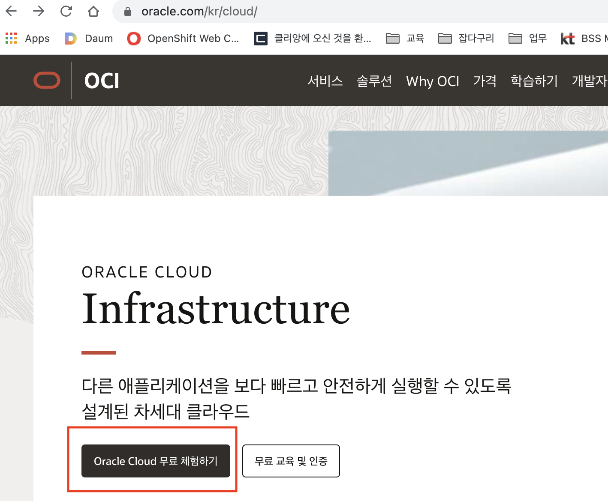  


    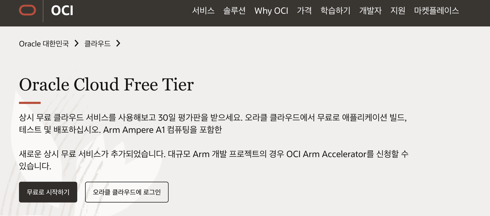  

<br/>

Account info를 입력한다.  

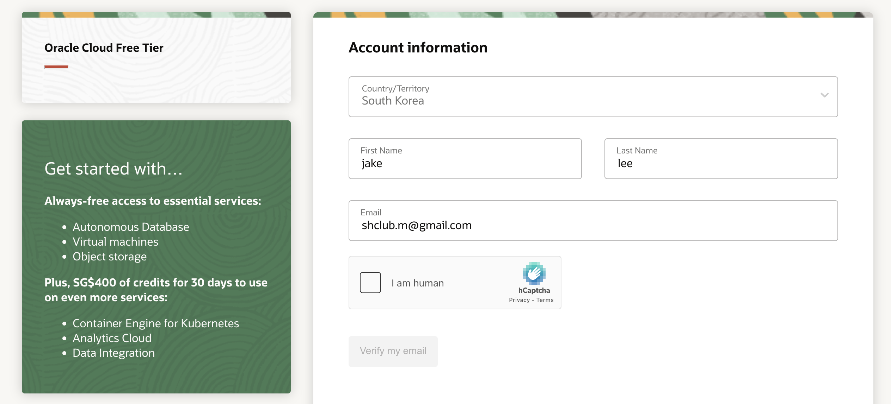    

이메일로 가입 정보가 오고 Account가 신규로 생성된다.   
이메일과 Account ID는 다르다.  오라클에서 자동으로 생성하며 이메일에서 확인 필요.  
- 예 ) Account ID : shclubm ( shclub.m@gmail.com )

<br/>

빌링 정보를 위하여 카드번호를 넣으면 되고 plan을 업그레이드 하지 않는한 과금이 되지 않는다.  

기본적으로 평생 무료 3개의 VM 이 할당 된다고 볼 수 있다.  

VM 의 Disk는 Block Storage로 최대 200G이고 VM 1당 기본 50G 할당.
향후 조정하여 VM당 100G까지 할당 가능.  

네트웍 트래픽은 Inboud는 무제한, Outbound는 월 10TB.  

네트워크 대역폭이 최대 480Mbps.  

- VM 1: Oracle Cloud Shell ( 메모리 공유 , DISK : 5G )
    - http://taewan.kim/cloud/oci_cloud_shell/
    - 기본 설치 : ssh , docker , ansible , git , kubectl , helm ,
       python , maven , java 
- VM 2: 직접 생성 ( CPU 1/4 Core , 메모리 1G , DISK : 50G ) 
- VM 3: 직접 생성 ( CPU 1/4 Core , 메모리 1G , DISK : 50G )

<br/>

### Oracle cloud shell  

<br/>

VM 접속을 위한 web 기반의 shell을 제공하며 oracle 이외의 외부 시스템과   
ssh접속을 할수 있다.   

기본 설치 되어 있는 프로그램을 활용하면 대부분 cli 작업은 가능하다.  
root 권한은 확보할 수 없어 프로그램 추가 설치를 쉽지 않지만 docker를 활용하면 대부분 프로그램을 사용할 수 있다.  

<br/>

```bash
Welcome to Oracle Cloud Shell.
Cloud Shell now offers two pre-installed Java runtimes: OpenJDK 11 and OpenJDK 8. You can use the csruntimectl command from within Cloud Shell to switch between the runtimes. For more information, see Managing Language Runtimes in the Cloud Shell documentation.

Your Cloud Shell machine comes with 5GB of storage for your home directory. Your Cloud Shell (machine and home directory) are located in: South Korea Central (Seoul).
You are using Cloud Shell in tenancy shclubm as an OCI Local user shclub.m@gmail.com

Type `help` for more info.
shclub_m@cloudshell:~ (ap-seoul-1)$ free -h
              total        used        free      shared  buff/cache   available
Mem:           9.5G        769M        5.7G         16M        3.1G        8.4G
Swap:          1.0G          0B        1.0G
```  

cpu 정보와 디스크 사이즈  


```bash
shclub_m@cloudshell:~ (ap-seoul-1)$ cat /proc/cpuinfo | grep process
processor       : 0
processor       : 1
shclub_m@cloudshell:~ (ap-seoul-1)$ df -h
Filesystem                Size  Used Avail Use% Mounted on
overlay                    69G   18G   48G  27% /
tmpfs                      64M     0   64M   0% /dev
tmpfs                     4.8G     0  4.8G   0% /sys/fs/cgroup
shm                        64M     0   64M   0% /dev/shm
/dev/sdb1                 5.0G   33M  5.0G   1% /home/shclub_m
/dev/mapper/vg00-root      69G   18G   48G  27% /etc/hosts
/dev/mapper/vg00-var_log  3.8G   18M  3.6G   1% /etc/extensions/logs
```
<br/>

도커로 리눅스 이미지를 가져오고 실행하여 추가 프로그램 설치 가능  


```bash
shclub_m@cloudshell:~ (ap-seoul-1)$ docker run -it --rm alpine
Unable to find image 'alpine:latest' locally
Trying to pull repository docker.io/library/alpine ... 
latest: Pulling from docker.io/library/alpine
df9b9388f04a: Pull complete 
Digest: sha256:4edbd2beb5f78b1014028f4fbb99f3237d9561100b6881aabbf5acce2c4f9454
Status: Downloaded newer image for alpine:latest
/ # apk add curl
fetch https://dl-cdn.alpinelinux.org/alpine/v3.15/main/x86_64/APKINDEX.tar.gz
fetch https://dl-cdn.alpinelinux.org/alpine/v3.15/community/x86_64/APKINDEX.tar.gz
(1/5) Installing ca-certificates (20211220-r0)
(2/5) Installing brotli-libs (1.0.9-r5)
(3/5) Installing nghttp2-libs (1.46.0-r0)
(4/5) Installing libcurl (7.80.0-r0)
(5/5) Installing curl (7.80.0-r0)
Executing busybox-1.34.1-r5.trigger
Executing ca-certificates-20211220-r0.trigger
OK: 8 MiB in 19 packages
/ # 
```

##  로그인 및 VM 생성

<br/>

### 로그인

<br/>

 Oracle Cloud 사이트의 오른쪽 상단에 로그인 버튼을 클릭한다.  

 

<br/>

### vm 생성

<br/>

로그인이 완료가 되면 시작하기 와 대쉬보드 탭이 나오고 기존에 VM이 생성되었으면   
대쉬보드로 이동하고 신규 VM 생성이 필요하면 시작하기 탭의 아래 VM인스턴스 생성 화면을 클릭한다.  

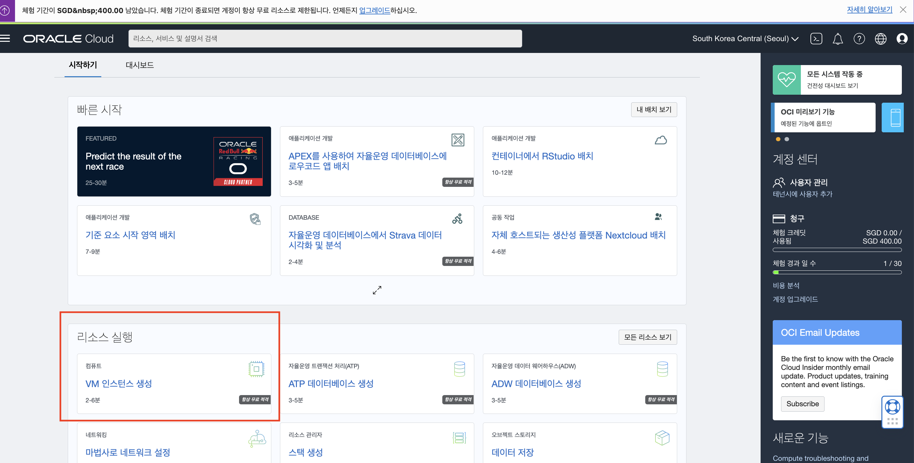 

<br/>

첫 로그인 후에 생성시에는 구획을 설정 해야한다. 구획은 본인의 Account ID를 선택하면 된다.  

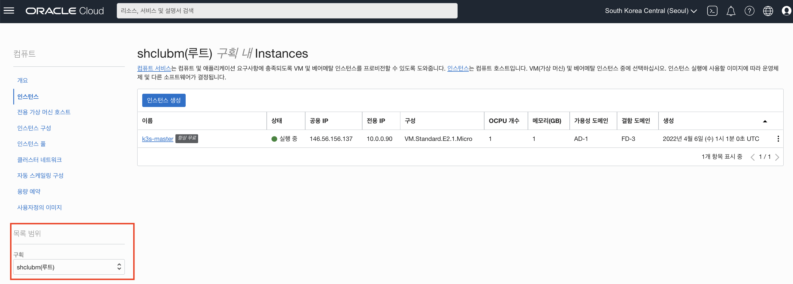   

Instance 이름을 입력하고 아래 이미지를 편집한다.  
편집하지 않으면 oracle linux로 설치가 된다.    

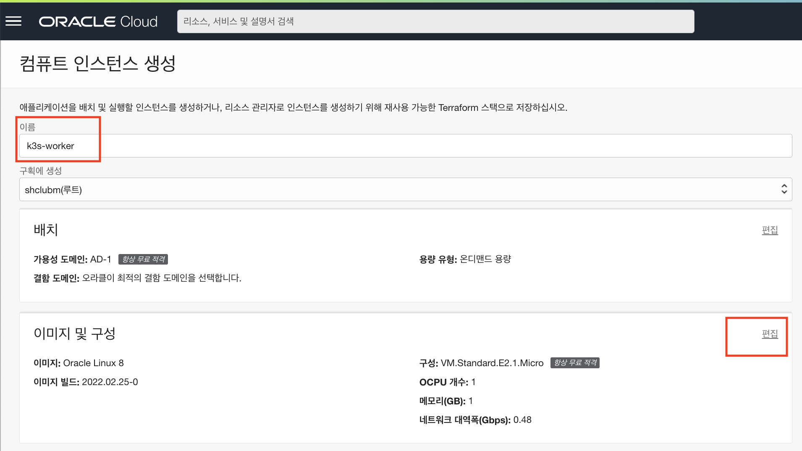   

이미지 변경 버튼을 클릭한다.  

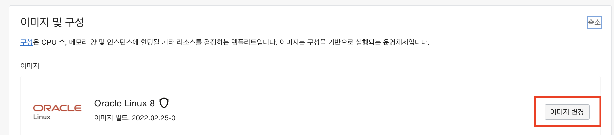   

ubuntu로 이미지를 변경하고 버전은 18.04 그리고 이미지 빌드는 최신으로 설정하고
이미지 설정을 완료한다.  

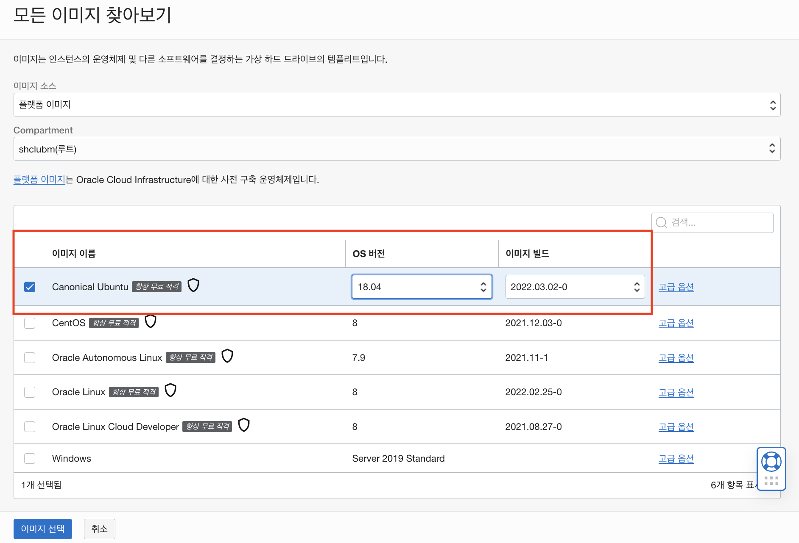   

ssh로 접속하기 위해서 ssh 전용키를 다운로드 받고 인스턴스를 생성한다.  
  
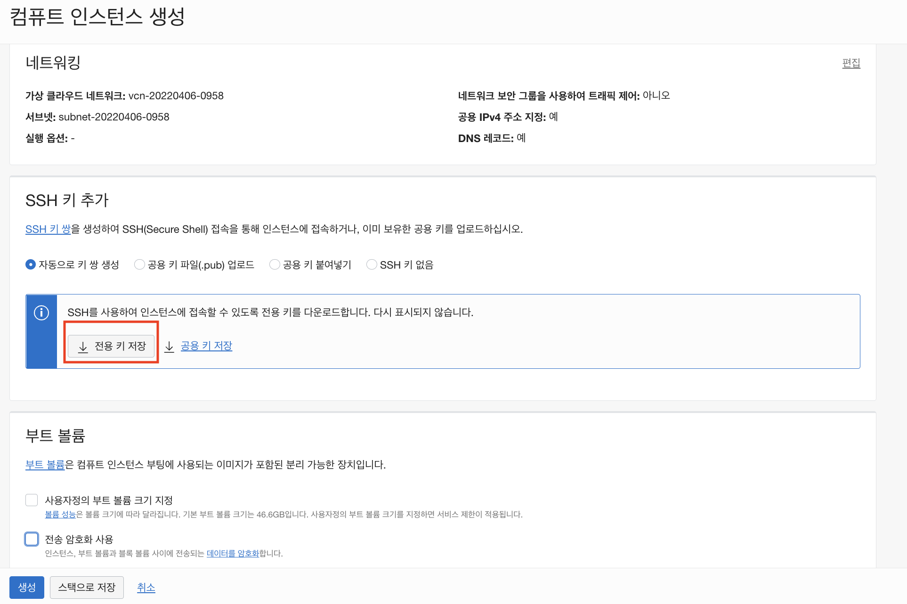   

provision ( 노란색 ) 이 진행이 되고 몇 초 후에 vm이 생성된다.  

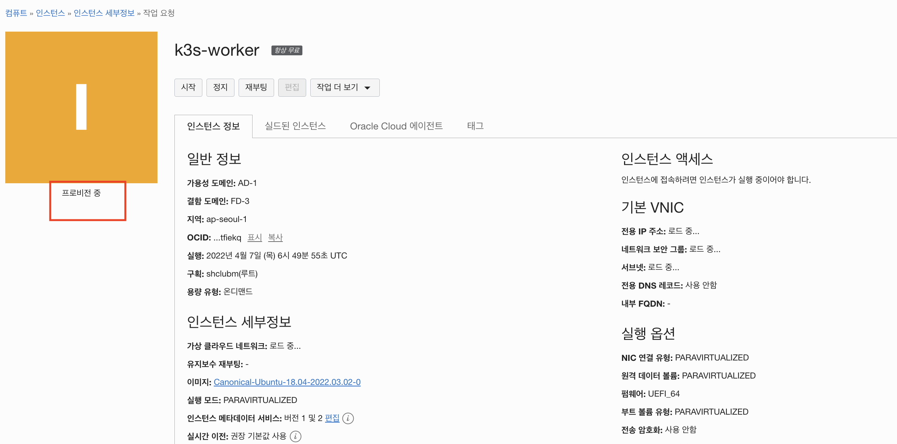   

실행중 ( 녹색 ) 이 되면 생성이 왼료가 되며 공용 IP가 할당이 된다.     

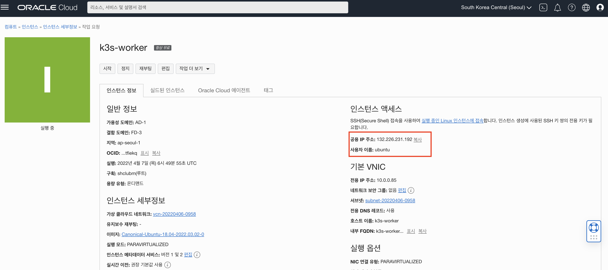   

<br/>

### vm 접속 설정  

<br/>


접속을 하기 위해 cloud shell 을 활성화 한다. 오른쪽 상단 클릭  

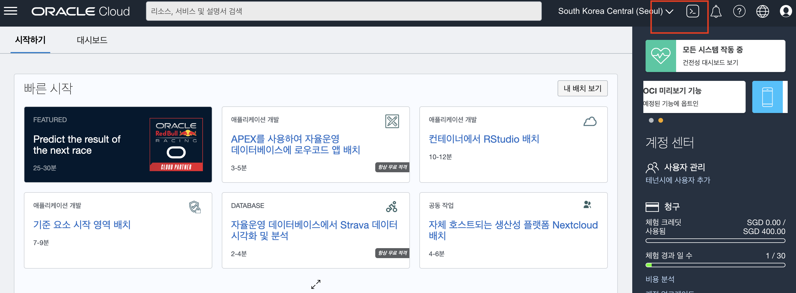   


브라우저 하단에 cloud shell 창이 뜬다.  

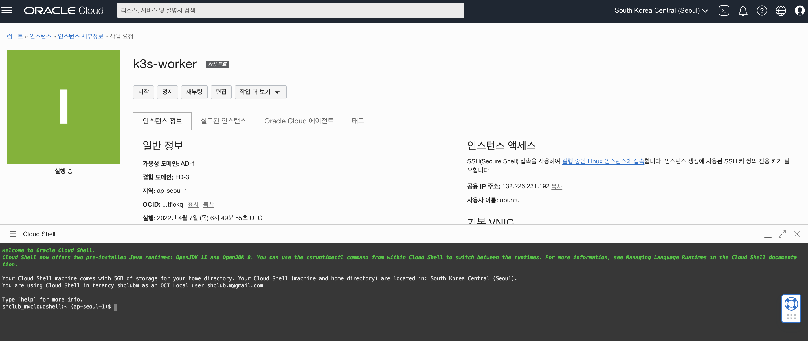   


cloud shell 의 왼쪽 상단에 upload를 하여 다운 받은 ssh 전용키를 upload 한다.    

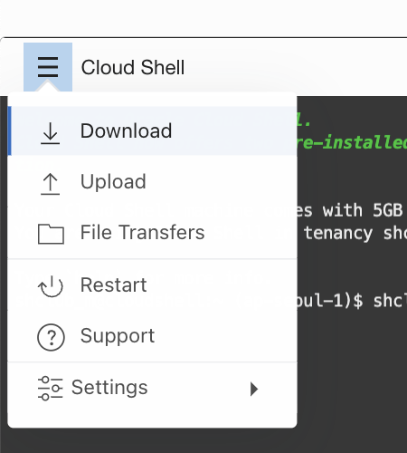   

다운받은 private key 화일을 선택한다.  
- 예: ssh-key-날짜.key    

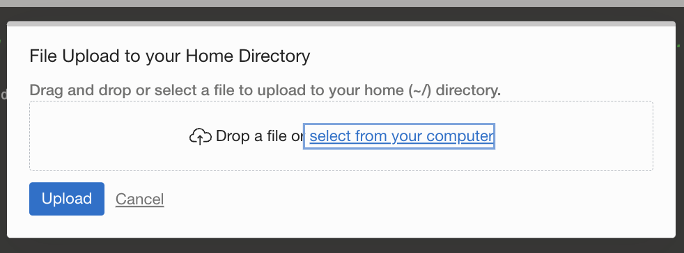   

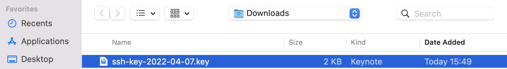   


화일이 선택이 되면 upload 버튼을 클릭한다.

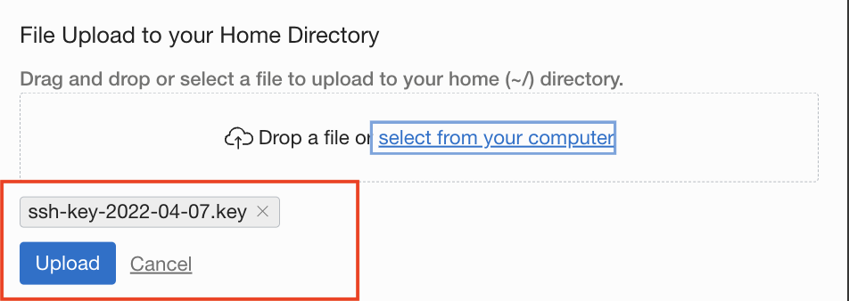  

upload 완료가 되면 오른편에 completed 메시지를  볼 수 있다.

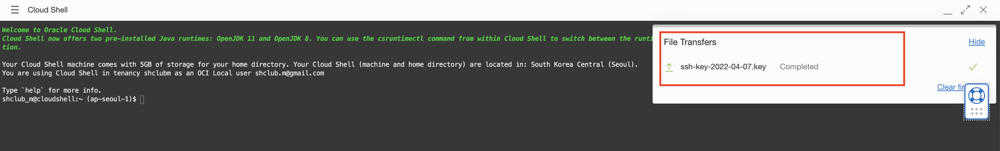   

아래 명령어를 사용하여 정상 확인을 한다.  

```bash
Type `help` for more info.
shclub_m@cloudshell:~ (ap-seoul-1)$ ls
ssh-key-2022-04-07.key
```  

해당 화일을 사용하기 위해 권한을 400으로 변경한다.

```bash
shclub_m@cloudshell:~ (ap-seoul-1)$ chmod 400 *
shclub_m@cloudshell:~ (ap-seoul-1)$ ssh -i ./ssh-key-2022-04-07.key ubuntu@132.226.231.192
```  

private key로 신규 생성한 서버에 접속한다.   
공용 ip 와 계정을 확인하고 ssh 로 접속. 

```bash
shclub_m@cloudshell:~ (ap-seoul-1)$ ssh -i ./ssh-key-2022-04-07.key ubuntu@132.226.231.192
```

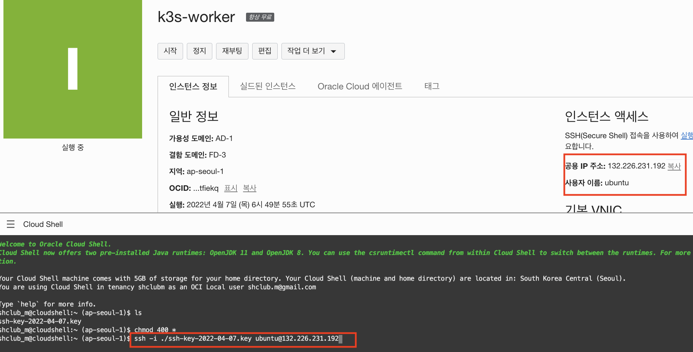   

<br/>

접속이 정상적으로 된것을 확인 할수 있다.  

```bash
shclub_m@cloudshell:~ (ap-seoul-1)$ ssh -i ./ssh-key-2022-04-07.key ubuntu@132.226.231.192
FIPS mode initialized
The authenticity of host '132.226.231.192 (132.226.231.192)' can't be established.
ECDSA key fingerprint is SHA256:PujFtNQQt6CMugrFwDN/ZkmFH8mbhXkfPh4ngltOQUM.
ECDSA key fingerprint is SHA1:A26AdotCURdmdNed8KUYRRG3Rqk.
Are you sure you want to continue connecting (yes/no)?yes    
Please type 'yes' or 'no': yes
Warning: Permanently added '132.226.231.192' (ECDSA) to the list of known hosts.
Welcome to Ubuntu 18.04.6 LTS (GNU/Linux 5.4.0-1064-oracle x86_64)

 * Documentation:  https://help.ubuntu.com
 * Management:     https://landscape.canonical.com
 * Support:        https://ubuntu.com/advantage

  System information as of Thu Apr  7 09:31:23 UTC 2022

  System load:  0.0               Processes:           110
  Usage of /:   3.3% of 44.97GB   Users logged in:     0
  Memory usage: 20%               IP address for ens3: 10.0.0.85
  Swap usage:   0%

 * Super-optimized for small spaces - read how we shrank the memory
   footprint of MicroK8s to make it the smallest full K8s around.

   https://ubuntu.com/blog/microk8s-memory-optimisation

0 updates can be applied immediately.


The programs included with the Ubuntu system are free software;
the exact distribution terms for each program are described in the
individual files in /usr/share/doc/*/copyright.

Ubuntu comes with ABSOLUTELY NO WARRANTY, to the extent permitted by
applicable law.

To run a command as administrator (user "root"), use "sudo <command>".
See "man sudo_root" for details.

ubuntu@k3s-worker:~$ 
```

ssh로 접속하는 방법 대신 root 계정으로 비밀번호로 접속할 수 있도록 설정을 변경한다.  

ubutu 계정에서 root로 변경한다.  

```bash
ubuntu@k3s-worker:~$ sudo su -
root@k3s-worker:~# 
```

root 비밀번호를 생성한다.  

```bash
root@k3s-worker:~# passwd
Enter new UNIX password: 
Retype new UNIX password: 
passwd: password updated successfully
root@k3s-worker:~# 
```  

vi 에디터로 아래 화일을 열고 2개의 라인을 수정한다.

```bash
root@k3s-worker:~# vi /etc/ssh/sshd_config
```  

그 다음 nano 편집기가 켜졌으면 CTRL + W를 눌러 PermitRootLogin 를 입력하여 검색합니다.  

이 부분이 root 사용자의 로그인 허용 여부를 뜻 합니다.  

#PermitRootLogin prohibit-password 라고 되어 있는 부분에서 #을 지우고 PermitRootLogin 다음 부분을 yes라고 변경합니다.  

#PermitRootLogin prohibit-password -> PermitRootLogin yes  


```bash
#LoginGraceTime 2m
PermitRootLogin yes  << 수정
#StrictModes yes
#MaxAuthTries 6
#MaxSessions 10
```  

PasswordAuthentication no로 되어 있는 부분을 yes로 변경합니다.  

이 부분은 비밀번호 로그인 허용 여부를 뜻 합니다.  

PasswordAuthentication no -> PasswordAuthentication yes로 변경합니다.  

#


```bash
# To disable tunneled clear text passwords, change to no here!
PasswordAuthentication yes  << 수정
#PermitEmptyPasswords no
```  

ssh 데몬을 재 실행한다.  

```bash
root@k3s-worker:~# service sshd restart
```  

2번 exit를 하여 vm을 빠져 나온다.

```bash
root@k3s-worker:~# exit
logout
ubuntu@k3s-worker:~$ exit
logout
Connection to 132.226.231.192 closed.
```

다시 root로 비밀번호를 사용하여 로그인 한다. 아래와 같이 나오면 로그인 성공.  

```bash
shclub_m@cloudshell:~ (ap-seoul-1)$ ssh root@132.226.231.192
FIPS mode initialized
root@132.226.231.192's password: 
Welcome to Ubuntu 18.04.6 LTS (GNU/Linux 5.4.0-1064-oracle x86_64)

 * Documentation:  https://help.ubuntu.com
 * Management:     https://landscape.canonical.com
 * Support:        https://ubuntu.com/advantage

  System information as of Thu Apr  7 09:48:51 UTC 2022

  System load:  0.0               Processes:           115
  Usage of /:   3.3% of 44.97GB   Users logged in:     0
  Memory usage: 20%               IP address for ens3: 10.0.0.85
  Swap usage:   0%

 * Super-optimized for small spaces - read how we shrank the memory
   footprint of MicroK8s to make it the smallest full K8s around.

   https://ubuntu.com/blog/microk8s-memory-optimisation

0 updates can be applied immediately.

New release '20.04.4 LTS' available.
Run 'do-release-upgrade' to upgrade to it.


The programs included with the Ubuntu system are free software;
the exact distribution terms for each program are described in the
individual files in /usr/share/doc/*/copyright.

Ubuntu comes with ABSOLUTELY NO WARRANTY, to the extent permitted by
applicable law.

root@k3s-worker:~# 
```

<br/>

### k3s 설치   

<br/>

oracle cloud에 k3s를 아래와 같이 설치한다.   
--disable-cloud-controller 옵션을 추가하여 용량을 최소화 한다.  

```bash
curl -sfL https://get.k3s.io | INSTALL_K3S_EXEC="--tls-san <본인 oracle vm public ip>  --disable-cloud-controller" sh -s - 
```

vm의 리소스가 많이 부족한 것을 확인 할 수 있다.  

```bash
root@k3s-worker:~# curl -sfL https://get.k3s.io | INSTALL_K3S_EXEC="--tls-san 132.226.231.192 --disable-cloud-controller" sh -s - 
[INFO]  Finding release for channel stable
[INFO]  Using v1.22.7+k3s1 as release
[INFO]  Downloading hash https://github.com/k3s-io/k3s/releases/download/v1.22.7+k3s1/sha256sum-amd64.txt
[INFO]  Downloading binary https://github.com/k3s-io/k3s/releases/download/v1.22.7+k3s1/k3s
[INFO]  Verifying binary download
[INFO]  Installing k3s to /usr/local/bin/k3s
[INFO]  Skipping installation of SELinux RPM
[INFO]  Creating /usr/local/bin/kubectl symlink to k3s
[INFO]  Creating /usr/local/bin/crictl symlink to k3s
[INFO]  Creating /usr/local/bin/ctr symlink to k3s
[INFO]  Creating killall script /usr/local/bin/k3s-killall.sh
[INFO]  Creating uninstall script /usr/local/bin/k3s-uninstall.sh
[INFO]  env: Creating environment file /etc/systemd/system/k3s.service.env
[INFO]  systemd: Creating service file /etc/systemd/system/k3s.service
[INFO]  systemd: Enabling k3s unit
Created symlink /etc/systemd/system/multi-user.target.wants/k3s.service → /etc/systemd/system/k3s.service.
[INFO]  systemd: Starting k3s
root@k3s-worker:~# kubectl get nodes
NAME         STATUS   ROLES                  AGE   VERSION
k3s-worker   Ready    control-plane,master   32s   v1.22.7+k3s1
root@k3s-worker:~# kubectl top nodes
NAME         CPU(cores)   CPU%   MEMORY(bytes)   MEMORY%   
k3s-worker   692m         34%    704Mi           72%       
root@k3s-worker:~# 
```  

외부에서 접속가능 하도록 port를 오픈한다.  
-  80 , 443, 6443 포트 오픈

```bash
root@k3s-worker:~# iptables -I INPUT 1 -p tcp --dport 80 -j ACCEPT
root@k3s-worker:~# iptables -I INPUT 1 -p tcp --dport 443 -j ACCEPT
root@k3s-worker:~# iptables -I INPUT 1 -p tcp --dport 6443 -j ACCEPT
root@k3s-worker:~# netfilter-persistent save
run-parts: executing /usr/share/netfilter-persistent/plugins.d/15-ip4tables save
run-parts: executing /usr/share/netfilter-persistent/plugins.d/25-ip6tables save
```

이제 oracle cloud portal에서 Ingress Rule을 추가 한다.  

Instance 화면에서 subnet을 클릭한다.  

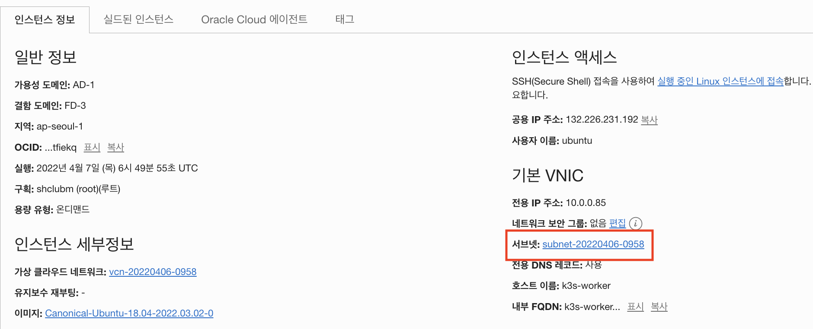   

보안리스트가 보이고 보안목록 추가 밑에 vcn-20이 들어간 리스트를 클릭한다.   

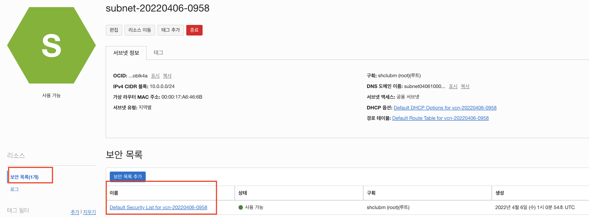   

수신 규칙 ( Ingress Rule ) 추가 버튼을 클릭하면 팝업 창이 하나 뜬다.  

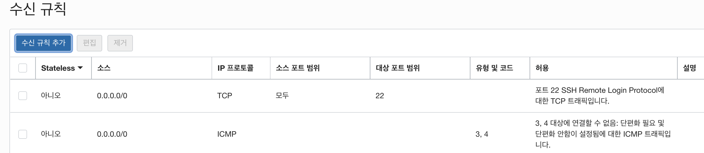   

아래 3가지 값을 설정한다. 다른 값은 설정 안해도 됨    
-  소스 CI/DR : 0.0.0.0/0
-  대상 포트 범위  : 80 , 443 , 6443 
-  설명 : k3s ( 아무거나 상관 없음 )

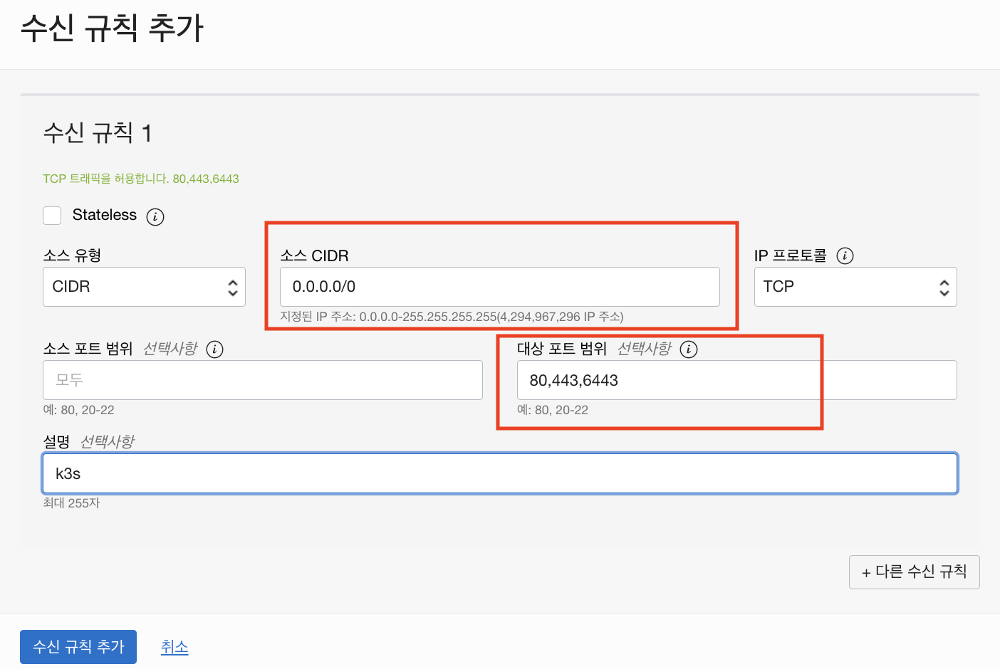   

수신 규칙 추가를 클릭해서 완료하면 아래와 같이 Rule이 추가 된것을 확인 할 수 있다.  

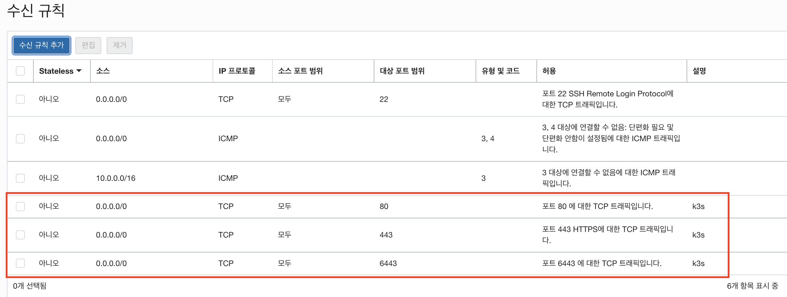   


외부에서 web browser로 접속을 시도하면 응답이 오는 것을 확인 할 수 있다.  

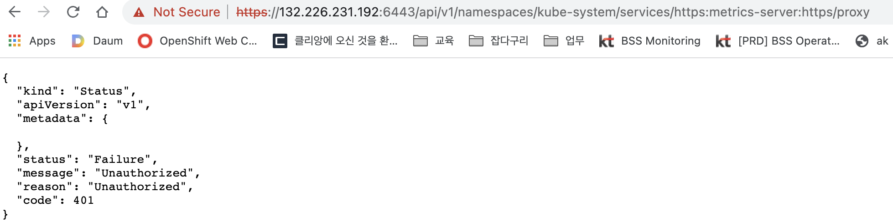  