#  SpringBoot Hands-on
 
SpringBoot 활용 방법에 대해서 실습한다.  

1. 뷰 템플릿 과 MVC 패턴

2. SpringBoot JPA hands-on 

3. 롬복과 리팩토링

4. Rest API 와 JSON 

5. HTTP 와 Rest Controller

6. SpringBoot JDBC hands-on 

7. 서비스와 트랜잭션, 그리고 롤백

8. 테스트 작성하기

9. 댓글 서비스 만들기

10. IoC 와 DI

11. AOP

12. Object Mapper

<br/>

##  뷰 템플릿 과 MVC 패턴


<br/>

### web service 의 동작원리  

<br/>

- 웹서비스는 클라이언트와 서버의 요청과 응답으로 동작
- 클라이언트 : 서비스를 사용하는 프로그램, 컴퓨터 → 브라우저
- 서버 : 서비스를 제공하는 프로그램, 컴퓨터 → 스프링부트

    

<br/>

hello world 출력 과정  

<br/>

- 스프링 부트 실행
- src - main - java - 기본패키지 - 메인 메소드를 가진 클래스 실행 (Run)
- Tomcat started on port(s) 8080 (http) → 웹 서버 실행 (동작)
- localhost:8080 → 내 컴퓨터의 서버 주소:포트번호, 포트번호 8080에서
  스프링 부트가 동작
- localhost:8080/hello.html → 'hello world' 출력 → 내 컴퓨터의 8080 
  번호에서 수행되고 있는 서버에게 hello.html 파일 요청  
  localhost:8080/hello.html  : 내 컴퓨터의 8080 번호에서 수행되고 있는 서버에게 hello.html 파일 요청
- src - main  - resources - static - hello.html → static
  폴더에서 파일을 찾아서 그 안의 HTML 코드를 응답으로 전송  

<br/>

### 뷰 템플릿의 필요성과 머스테치  

<br/>

- 웹페이지의 변수를 활용하는 뷰 템플릿과 분야별 담당자를 나누는 MVC 패턴
- 사용자 수마다 생성되는 페이지 ? → 화면을 담당하는 기술인 뷰 템플릿을 통해 극복
- 뷰 템플릿 : 웹 페이지를 하나의 틀로 만들고 변수를 삽입해 틀이 되는 페이지가 
- 변수의 값에 따라서 수많은 페이지로 변화 
- 스프링 부트의 머스테치 (Mustache) : 뷰 템플릿을 만드는 도구 ( Thymeleaf , JSP )
- 뷰 템플릿에는 처리 과정을 담당하는 Controller와 데이터를 관리하는 Model가 존재
- MVC 패턴 : 화면, 처리, 데이터를 각 담당자 별로 나누는 기법

    

  앞에 글자를 따서 MVC 라 부름.   
  
  

<br/>

이제 지난번 생성했던 firstproject 를 intelliJ를 사용하여 오픈한다.  

<br/>

뷰 템플릿의 위치는  

프로젝트명 -> src -> main -> resources -> templates 에  생성한다.  

  

<br/>

마우스 오른쪽 버튼 클릭하고 New File 선택하고 greetings.mustache 생성한다.  

제일 처음 생성하면 mustache 화일을 인식하지 못한다. plugin 설치 필요.  

  

<br/>

IntelliJ 에서 Help -> Find Action 으로 이동한다.  

  

<br/>

plugins입력하고 엔터를 친다.  

  

<br/>

market place를 선택 한후 mustache를 입력하면 아래와 같이 나오고 첫번째 항목 선택후 Install 한다.  

  

<br/>

다시 한번 greetings.mustache 생성을 해보면 에러 없이 생성이 된다.    


doc를 입력하고 tab을 누르면 자동으로 코드가 생성이 된다.  


<br/>

body tag 안에 값을 입력한다.

```html
<body>
    <h1>안녕하세요 반갑습니다.</h1> 
</body>
```  

<br/>

view template 이제 완성이 되었고 이것을 보기 위해서는 controller 가 필요하다.  

<br/>

### 컨트롤러 만들기   

<br/>  

컨트롤러는 아래와 같은 순서로 만든다.  

프로젝트명 -> src -> main -> java -> 기본 패키지 -> 'controller' package 생성   

기본 패키지명 위에서 마우스 오른쪽 키 클릭하고 New -> Package 선택  

  

아래와 같이 창이 뜨면 끝에 controller 이름을 붙여 넣는다.  

  

<br/>

controller 안에 java class를 생성합니다.  
New -> Java Class 선택 하고 FirstController라는 이름으로 생성.  

  

생성한 view template과 controller를 연결해 주기 위한 코드를 작성합니다.  


class 위에 @Controller 라는 Annotation을 입력하면 자동으로 import 가 삽입됩니다.  

  

Auto import가 안되면 Preferences ( 윈도우는 settings ) -> Editor -> General -> Auto import 에서 아래와 같이 체크를 하고 always옵션을 선택한다.  
배제된 항목이 있는지도 확인합니다.  

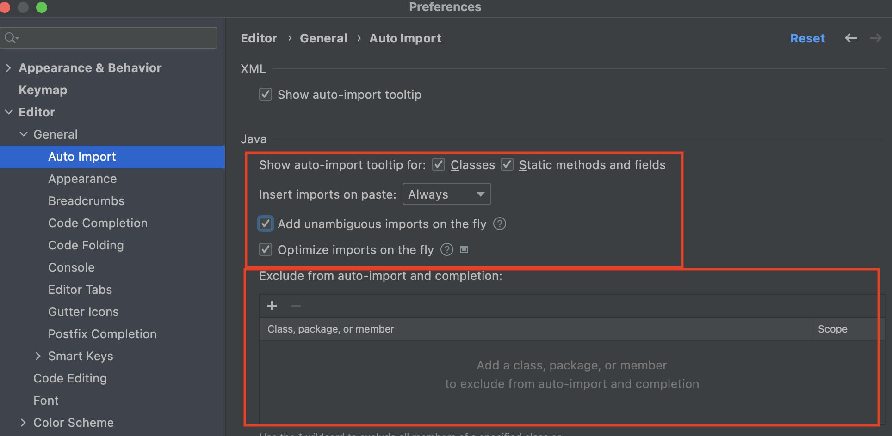  

<br/>

Method 를 추가합니다.  

url 연결 요청을 하기 위해 @GetMapping를 사용합니다.  ( Rest API )  

응답 페이지 설정 을 위해 return "페이지명" 을 입력합니다.  

이 페이지 명은 mustache의 화일명인 greetings 입니다.  
( 페이지명의 파일을 찾아서 브라우저로 전송  )

```java
package com.example.firstproject.controller;

import org.springframework.stereotype.Controller;
import org.springframework.web.bind.annotation.GetMapping;

@Controller
public class FirstController {
    @GetMapping("/hi")
    public String niceToMeetYou() {
        return "greetings";
    }
}
```  

자동으로 import 코드가 생성되지 않으면 import Class를 클릭한다.  

 

서버실행은 메인 method인 FirstprojectApplication 에서 실행하는데 이미 서비스가 기동되어 있으면 rerun (재시작) 아이콘을 한다.  

<br/>

web browser에서 http://localhost:8080/hi 를 입력하면 에러 메시지를 볼 수 있다.  

   

GetMapping의 옆에 지구본 모양을 클릭하면 API를 테스트 할수 있는 기능이 있다.   

Generate request in HTTP Client를 클릭한다.  


<br/>

Rest API를 테스트 할수 있는 화면이 나오고 왼쪽 녹색 화살표를 클릭하면 테스트가 진행이되고 아래 콘솔 화면에 결과 값이 나온다.  

   

<br/>

데이터  흐름은 다음과 같다.  
 


이제 뷰페이지에 변수를 삽입을 해 봅니다.  

mustache 화일에서 아래와 같이 {{변수이름}} 을 사용하여 수정합니다.  

```html
<body>
    <h1>{{username}} 반갑습니다.</h1>
</body>
```  

위와 같이 설정하고 재시작 버튼 클릭 한 후 브라우저에서 실행을 하면 아래와 같이 에러가 발생합니다.  

  

username 이라는 변수를 못 찾아서 에러가 발생했고 모델을 만들어서 에러를 제거 해야 합니다.  

<br/>

### 모델 만들기   

<br/>  

페이지에 변수 삽입 + 템플릿 변수를 활용하기 위해 모델을 사용합니다.  

Controller에 Model 받아오기 위해 파라미터에 추가 합니다.  

```java
package com.example.firstproject.controller;

import org.springframework.stereotype.Controller;
import org.springframework.ui.Model;
import org.springframework.web.bind.annotation.GetMapping;

@Controller
public class FirstController {
    @GetMapping("/hi")
    public String niceToMeetYou(Model model) {
        model.addAttribute("username", "jake lee"); //변수 등록
        return "greetings";
    }
}
```  
<br/>

Model class를 인식하지 못하여 붉은색으로 표시되며 import class를 클릭하면 import 가 삽입됩니다.  

  

재시작 아이콘을 클릭하여 재기동 하고 웹 브라우저에서 확인 합니다.  

 

<br/>

전체 흐름은 다음과 같다.  

 

<br/>


## SpringBoot JPA hands-on 

<br/>


JPA vs JDBC

<br/>


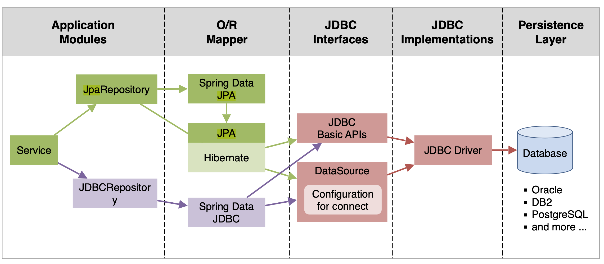 

<br/>

[ JPA Hands-On 문서보기로 이동하기 ](./springboot_hands_on_jpa.md)       


<br/>

참고 : https://gmlwjd9405.github.io/2018/12/25/difference-jdbc-jpa-mybatis.html


<br/>

## 롬복과 리팩토링

<br/>

### Lombok 과 Refactoring

<br/>

롬복 ( Lombok ) 이란 소스를 간소화 시켜주는 라이브러리 이다.  
필수 코드 기입 최소화 및 로깅 기능을 개선 할 수 있다.

    

리팩토링 ( Refactoring ) 이란 코드의 구조 성능의 개선을 말한다.  


롬복을 설치한다.  ( IntelliJ는 이미 포함이 되어 있음 )
롬복을 설치한 이후에 pom 파일에 아래 내용을 추가한다.  

pom.xml
```bash
<dependency>
    <groupId>org.projectlombok</groupId>
    <artifactId>lombok</artifactId>
    <optional>true</optional>
</dependency>
```  

<br/>

아래와 같이 추가 하면 된다.  

   

<br/>

M으로 표시된 아이콘이 보이고  Load Maven Changes 라고 나오는데  이것을 클릭한다.  

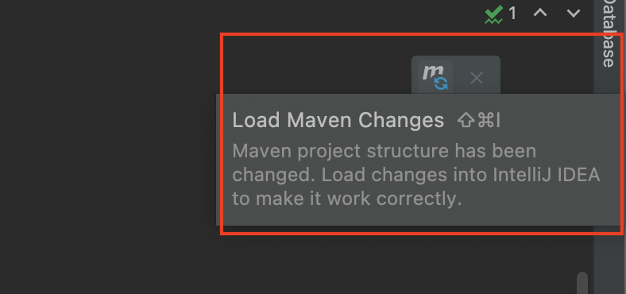   

화면 하단에 아래와 같이 라이브러리를 다운 받기 시작한다. 시간이 좀 소요된다.    

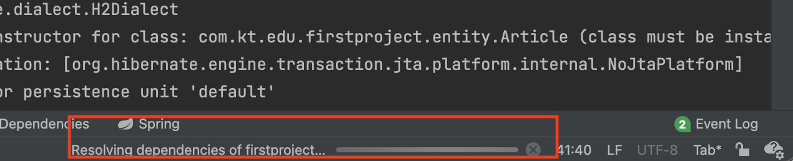  

다운이 완료가 되면 오른쪽에 Maven Tab을 클릭하고 Dependency에 가면 라이브러리가 추가 된것을 확인 할 수 있다.   

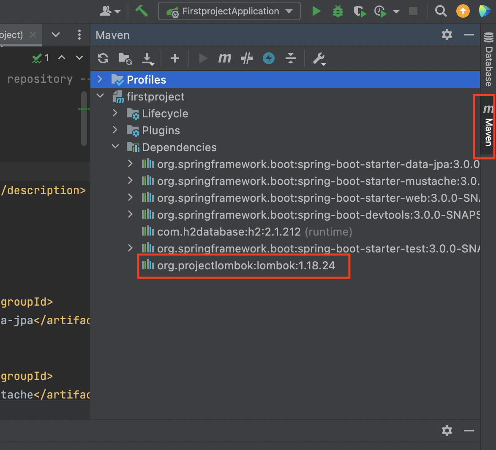   

<br/>

### Lombok 플러그인 설치

<br/>

Intellij 2020.3 버전부터는 Lombok Plugin을 기본으로 제공하고 있습니다. 

이하 버전에서는 상단 Help > Find Action > Plugins > "lombok" 검색 > Install 클릭하여 설치합니다.

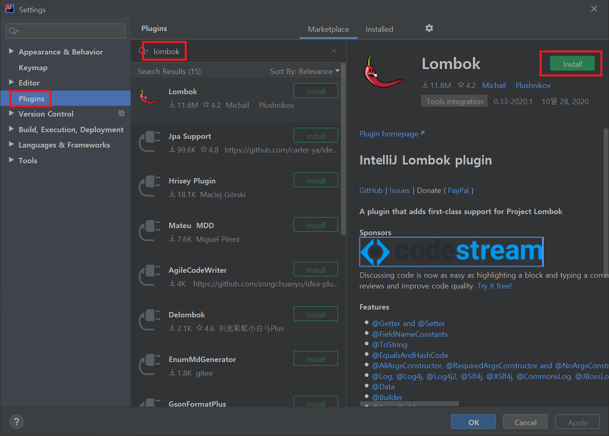    

설치가 완료되면 IntelliJ 를 재시작합니다.  

plugins를 활성화 하기 위해서 Preferences > Build, Execution, Deployment > Compiler > Annotation Processors에서 Enable annotation processing을 체크해줍니다. 

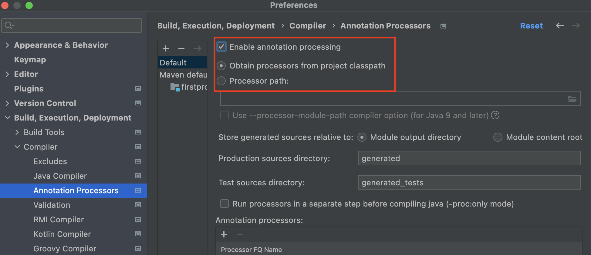    


<br/>

### refactoring

<br/>

Intellij 2020.3 버전부터는 Lombok Plugin을 기본으로 제공하고 있습니다.   

ArticleForm java 화일에서 생성사와 toString을 지우고 Annotation을 추가한다.  

붉은색으로 글씨가 나오기 때문에 import class를 해준다.  

../dto/ArticleForm
```java
package com.kt.edu.firstproject.dto;

import com.kt.edu.firstproject.entity.Article;

@AllArgsConstructor
@ToString
public class ArticleForm {
    private String title;
    private String content;

    public Article toEntity() {
        return new Article(null,title,content);
    }
}
```  

<br/>

Article 화일도 수정한다.  

../entity/Article
```java
package com.kt.edu.firstproject.entity;

import jakarta.persistence.Column;
import jakarta.persistence.Entity;
import jakarta.persistence.GeneratedValue;
import jakarta.persistence.Id;

@Entity
@AllArgsConstructor
@ToString
public class Article {
    @Id
    @GeneratedValue
    private Long id;
    
    @Column
    private String title;
    
    @Column
    private String content;
}
```  


<br/>

###  Rest API 와 JSON

<br/>

API와 Spring 웹 계층  
  
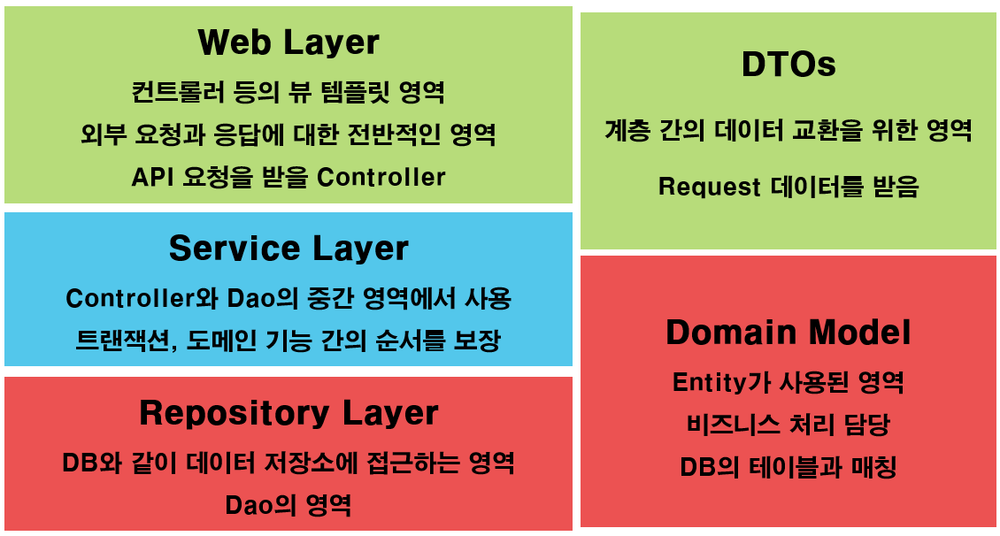  

<br/>

다양한 client 들과 서버 연동을 위해서 데이터를 주고 받는 방식으로 Rest 방식을 최근에 많이 사용 합니다.   

기존에는 xml 방식을 사용하였습니다.  

  

최근에는 JSON 방식으로 데이터 포맷을 사용합니다.  

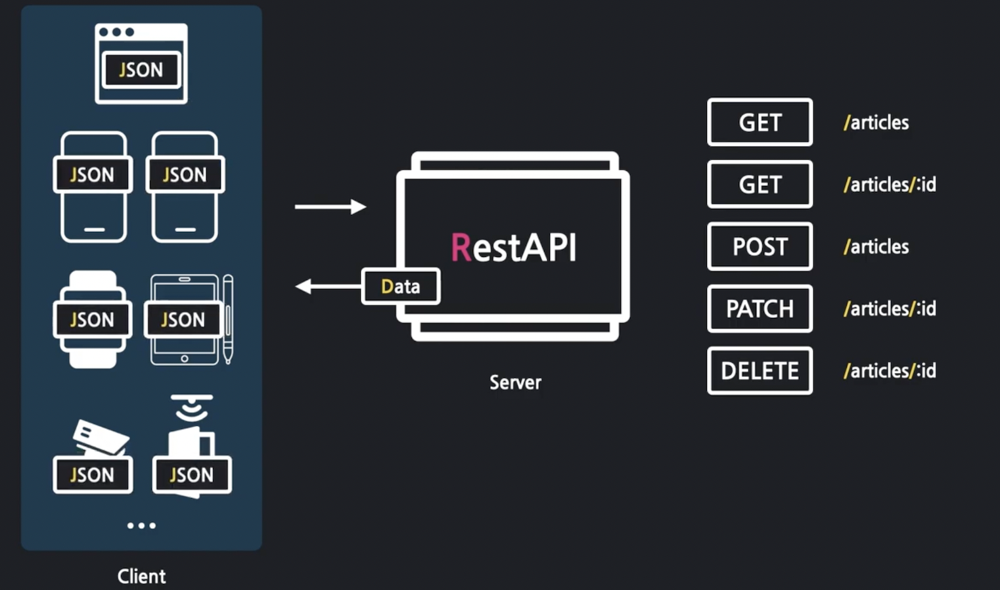  

JSON은 Key , Value 형태를 중괄호 형태로 표현합니다.  
json안에 depth를 더 추가하여 array 형태로도 구현이 가능합니다.  

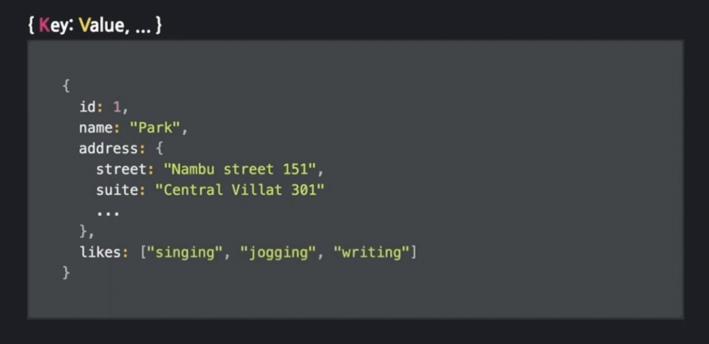  


API를 테스트 하기 위한 사이트로 https://jsonplaceholder.typicode.com/ 를 사용을 할 예정이며   

chrome 에서 API 테스트 하기 위한 도구로 talend api 확장 프로그램을 사용합니다.     
구글에서 `talend api 확장 프로그램`으로 검색을 합니다.

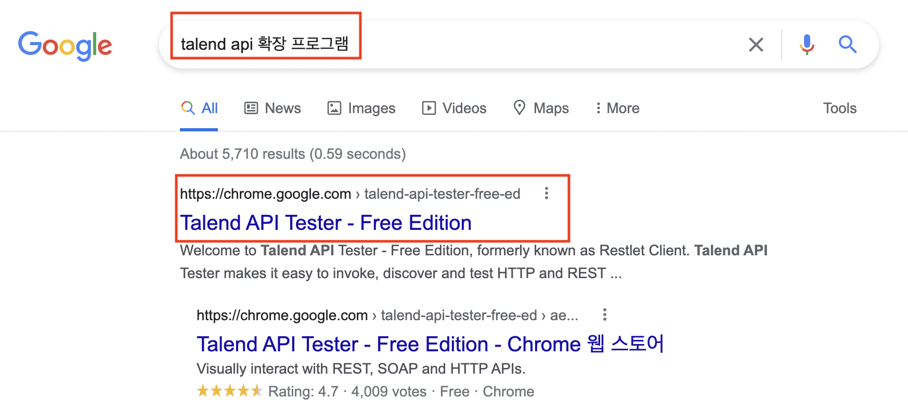  

chrome Appstore 를 선택 하고 chrome에 추가 버튼을 클릭하여 extension을 설치 합니다.

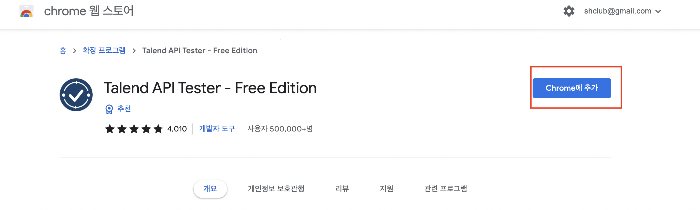    

아래와 같이  chrome 에 설치가 된 것을 확인 할 수 있습니다.  

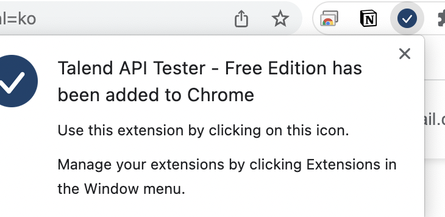  

퍼즐 모양을 클릭한다.  

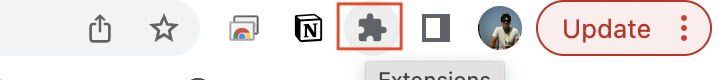  

Talend API Test를 클릭하여 Pin을 설정하면 항상 메뉴에 나오게 된다.  

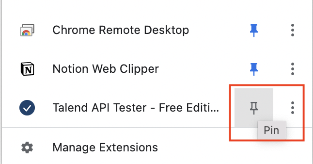  

체크 박스 같은 아이콘이 나오고 클릭을 하면 아래 처럼 welcome 화면이 나옵니다.  

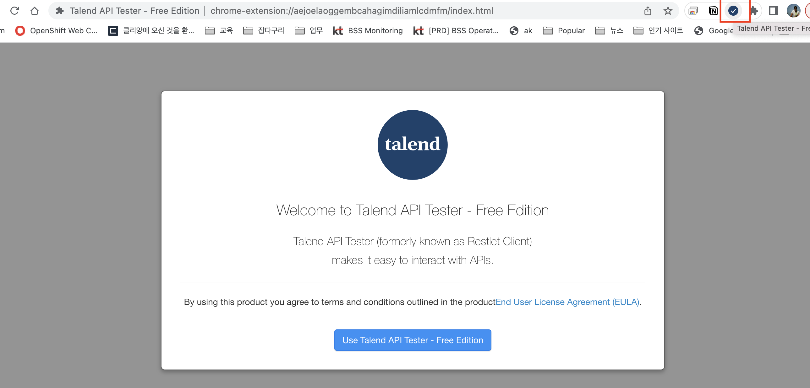  

하단의 Fee는 버튼을 클릭하면 talend api 확장 프로그램이 실행이 됩니다.  

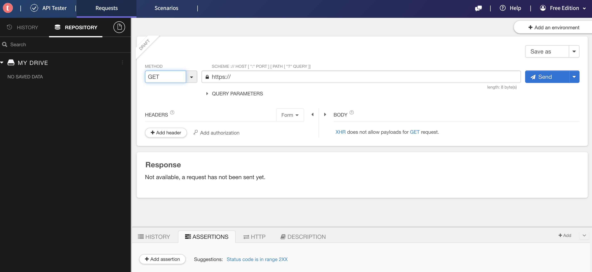  


이제 테스트를 실행해봅니다.  
talend API Test에서 method는 GET 으로 하고  https://jsonplaceholder.typicode.com/posts 를 입력하고 send를 클릭합니다.  

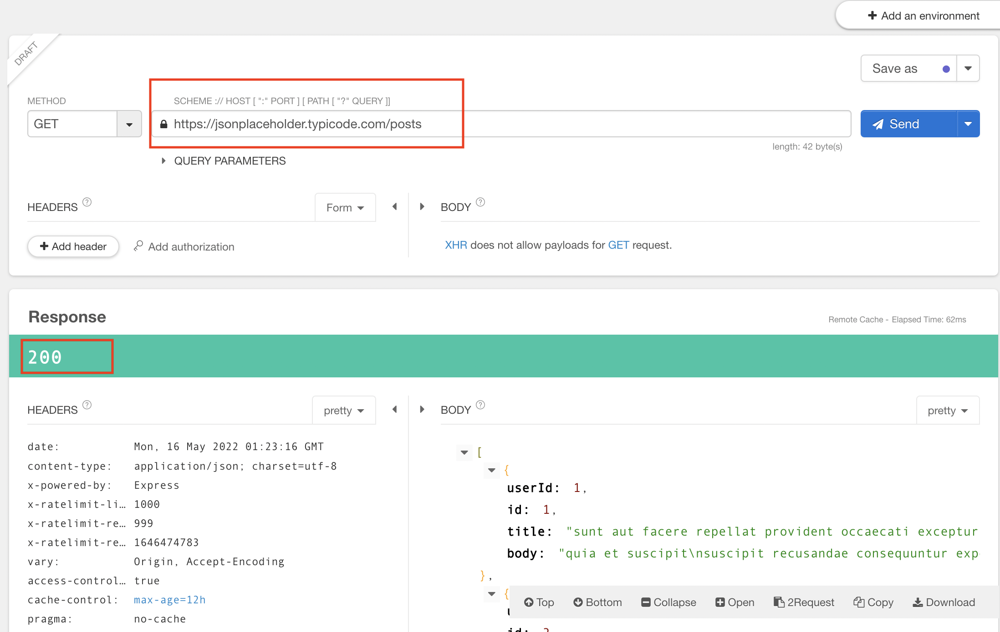  

response : 200 은 응답이 성공 했음을 의미합니다.  

데이터를 보면  게시글 1번으로 된 게시글의 제목과 내용이 나오는 것을 볼수 있습니다.  

```json
...
{
"userId": 1,
"id": 1,
"title": "sunt aut facere repellat provident occaecati excepturi optio reprehenderit",
"body": "quia et suscipit\nsuscipit recusandae consequuntur expedita et cum\nreprehenderit molestiae ut ut quas totam\nnostrum rerum est autem sunt rem eveniet architecto"
},
...
```  

다시 한번 https://jsonplaceholder.typicode.com/posts/101 값을 일력하고 send 버튼을 클릭합니다.  

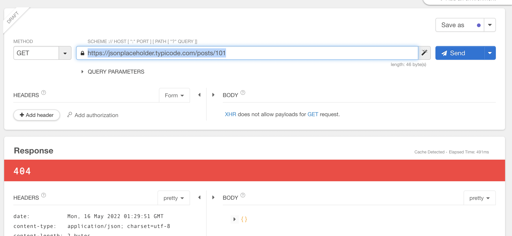  

response : 404 가 return 이 되고 찾을수  없는 페이지를 요청했다는 의미이다.  

<br/>

http tab을 클릭해보면 http header의 값을 볼수 있다.  

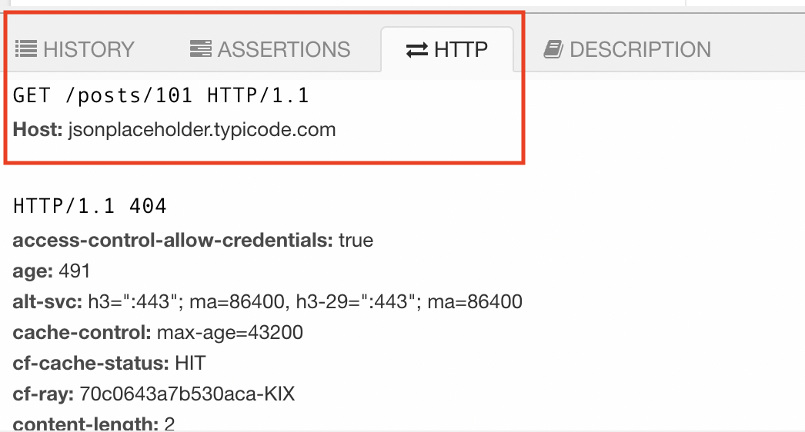  

더 아래로 내려보면 response body를 볼 수 있다.    

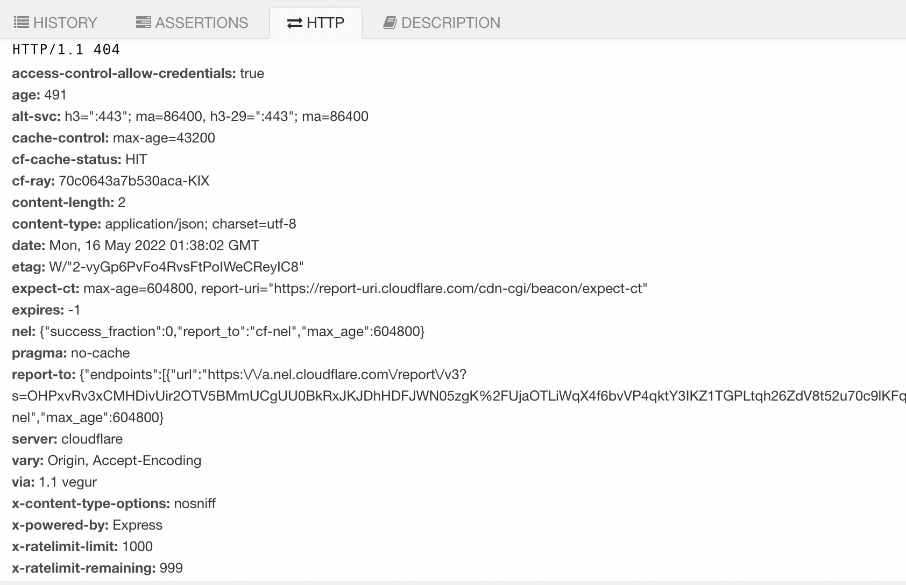  

<br/> 

post로 데이터를 전송해봅니다.  

method는  post 로 변경하고 url은 아래와 같습니다. 
https://jsonplaceholder.typicode.com/posts  

request 데이터가 JSON형식으로 필요합니다.    

```json
{
    "title": "test 1",
    "body" : "교육용입니다."
}
```
아래 샘플을 참고 하였습니다.  

```javascript
fetch('https://jsonplaceholder.typicode.com/posts', {
  method: 'POST',
  body: JSON.stringify({
    title: 'foo',
    body: 'bar',
    userId: 1,
  }),
  headers: {
    'Content-type': 'application/json; charset=UTF-8',
  },
})
  .then((response) => response.json())
  .then((json) => console.log(json));
```  

데이터를 입력을 하고 send 버튼을 클릭합니다.  


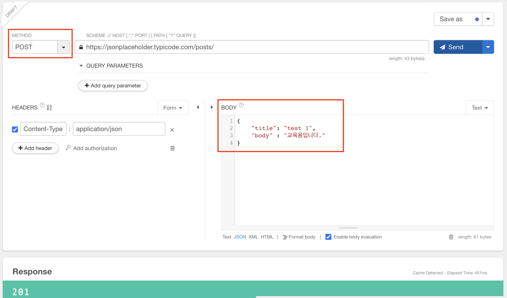    

response 201 : 데이터 생성이 성공했다는 의미 이다.  


생성된 데이터가 response 로 return 이 됩니다.  

```json
{
    "title": "test 1",
    "body": "교육용입니다.",
    "id": 101
}
```

실패 경우를 테스트 하기 위해서  request body 값을 변경 하고 보내봅니다.  ( key 값에 따옴표 제거)


```
{
    title : "test 1",
    body : "교육용입니다."
}
```  

reponse 500 : 서버 내부 오류 ( Internal Server Error) 를 나타낸다.  ( 여기서는 JSON 파싱 오류 )  

<br/>

이제 데이터를 수정해 봅니다.  

method를 patch ( put )로 선택을 하고 게시글에 1번을 변경해봅니다.  


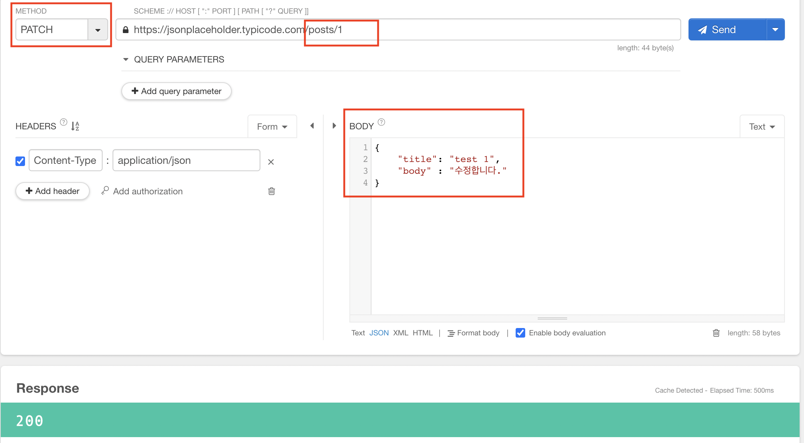  


200 응답 메시지를 받았고 response Body에 아래와 같이 변경 된것 을 확인 할 수 있습니다.  

```json
{
    "userId": 1,
    "id": 1,
    "title": "test 1",
    "body": "수정합니다."
}
```  

<br/>

데이터를 삭제해 봅니다.  

method를 DELETE 로 선택을 하고 게시글에 100번을 삭제해봅니다.  

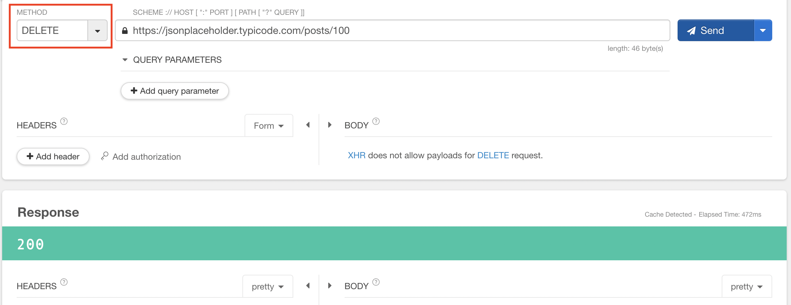  

response : 200 이 나오면 정상적으로 삭제가 된 것입니다.  

요약해보면  전체 구조는 JSON 포맷으로 HTTP를 통해서
데이터는 주고 받습니다.

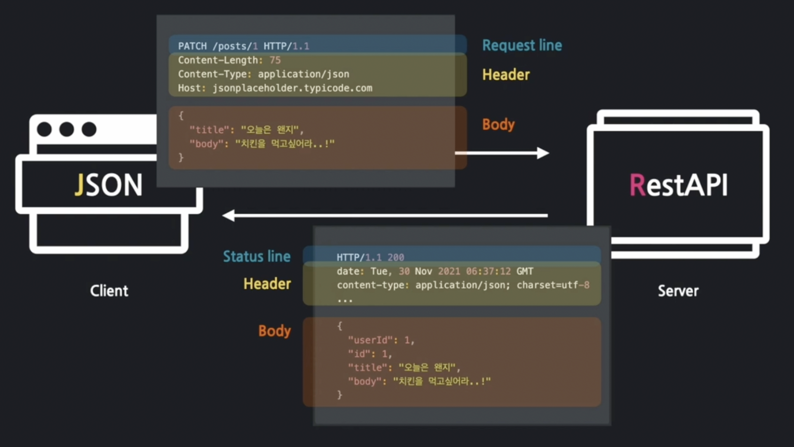  

상태코드는 5가지 종류로 나눌수 있습니다.  
  
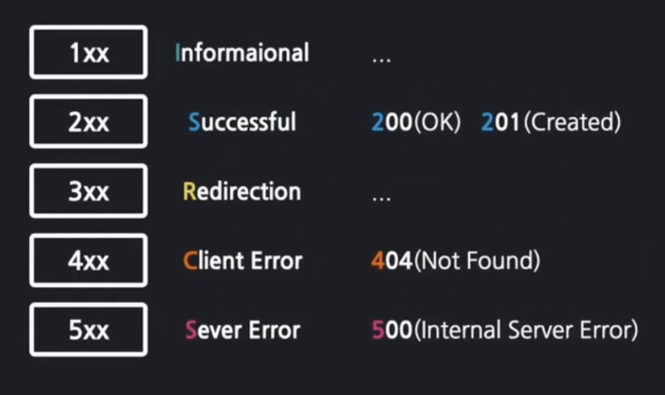  

<br/>

###  HTTP 와 Rest Controller

<br/>

Article 데이터 CRUD를 위한, REST API를 만드는 실습을 합니다.  

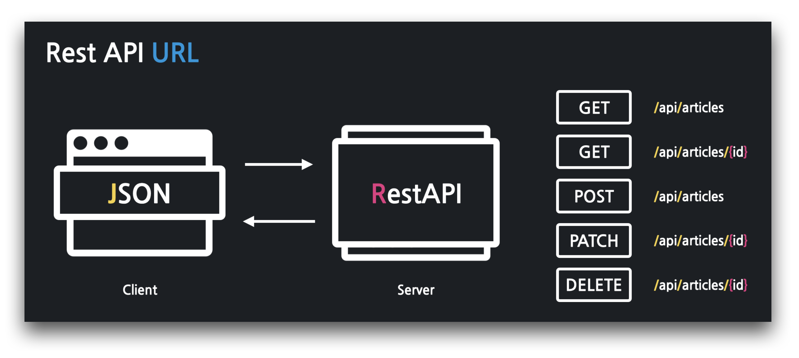  

<br/>

RestController를 사용 하여 구현을 합니다.  

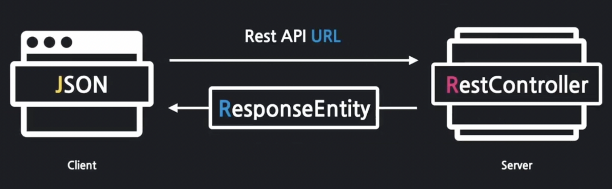  


hello rest api를 만들기 위해 api라는 이름의 패키지를 생성합니다.  

firstproject 패키지 위에서 마우스 오른쪽 버튼을 누른후 패키지를 선택을 하고 api라는 이름으로 생성을 합니다.  

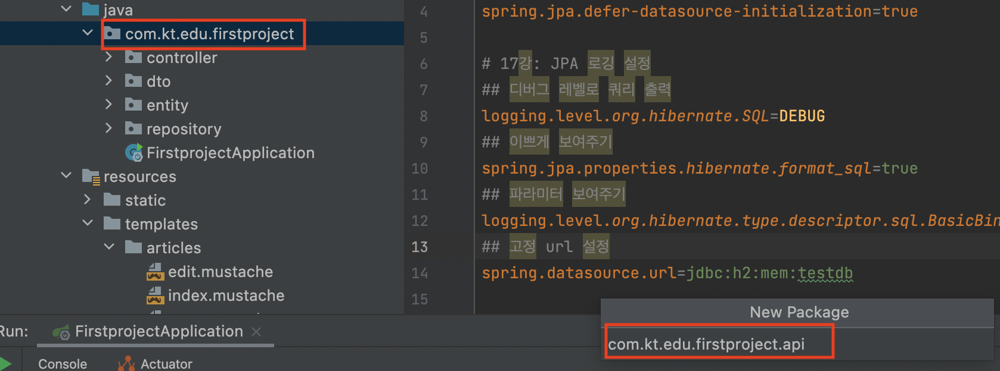  

Rest Controller java 화일을 생성합니다.
- Rest Controller : Rest API용 컨트롤러이고 JSON 반환  
- Controller : view template page 반환  

api 폴더 아래에 생성합니다.  

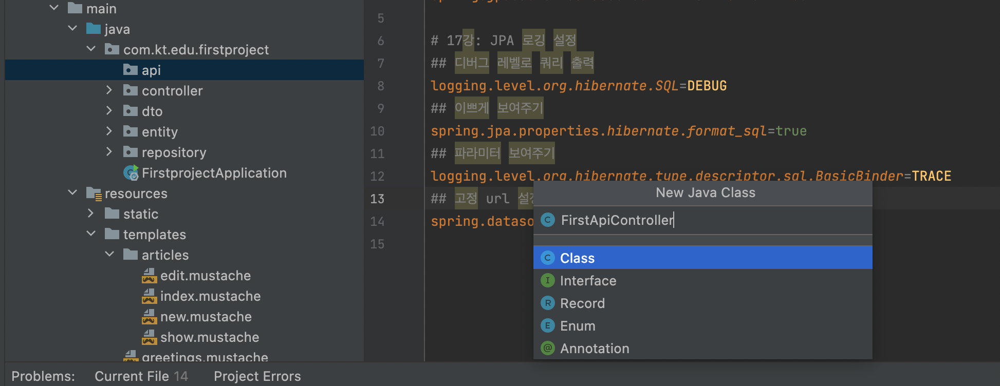  

../api/FirstApiController
```java
package com.kt.edu.firstproject.api;

import org.springframework.web.bind.annotation.GetMapping;
import org.springframework.web.bind.annotation.RestController;

@RestController // Rest API용 컨트롤러이고 JSON 반환 
public class FirstApiController {
    @GetMapping("/api/hello")
    public String hello() {
        return "hello world!";
    }
}
```  

프로젝트를 실행을 하고 Talend API로 테스트를 합니다.  
method는 GET , url은 http://localhost:8080/api/hello 입니다.  


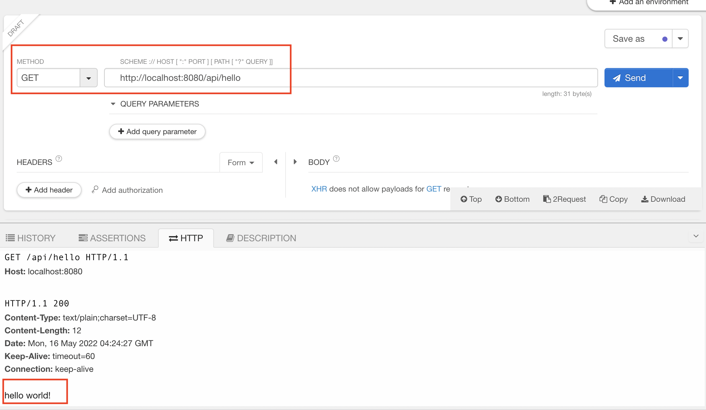  

http tab에서 보면 hello world! 가 나온 것을 확인 할 수 있습니다.  

<br/>

Controller vs Rest Controller  

일반 controller인  hi라는 api를 Talend 로 실행해보면 응답값이 html로 보내집니다.

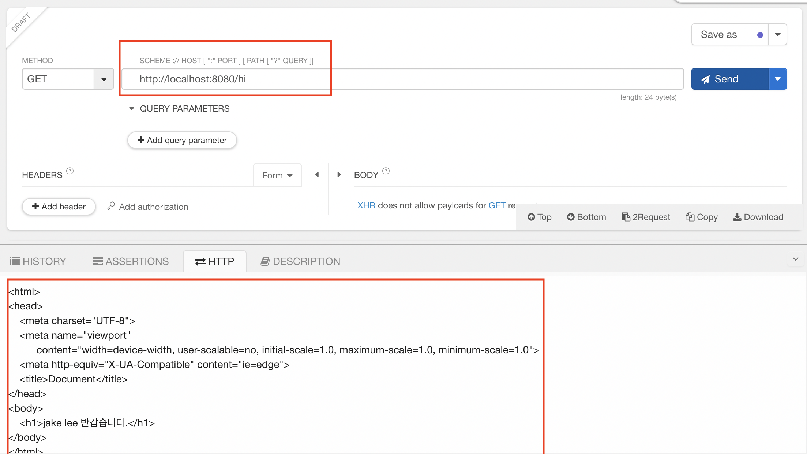  


<br/>


Rest API로 Get 함수를 구현해 봅니다.  
ArticleApiController class를 생성합니다.  
아래 코드를 복사하여 붙여 넣기 합니다.  


../api/ArticleApiController
```java
package com.kt.edu.firstproject.api;

import com.kt.edu.firstproject.entity.Article;
import com.kt.edu.firstproject.repository.ArticleRepository;
import org.springframework.beans.factory.annotation.Autowired;
import org.springframework.web.bind.annotation.GetMapping;
import org.springframework.web.bind.annotation.PathVariable;
import org.springframework.web.bind.annotation.RestController;

import java.util.List;

@RestController // rest api용 컨트롤러이며 데이터(JSON) 반환
public class ArticleApiController {
    @Autowired // DI : 외부에서 가져온다는 의미
    private ArticleRepository articleRepository;
    // GET
    @GetMapping("/api/articles")
    public List<Article> index() {
        return articleRepository.findAll();
    }
    @GetMapping("/api/articles/{id}")  //단일 record 조회
    public Article show(@PathVariable Long id) {
        return articleRepository.findById(id).orElse(null);
    }
    // POST
    // PATCH
    // DELETE
}
```  

재기동을 하고 Talend 에서 GET Method로 http://localhost:8080/api/articles 를 호출을 하면

return 값으로 아래와 같은 값이 JSON으로 나오는 것을 볼수 있습니다.  

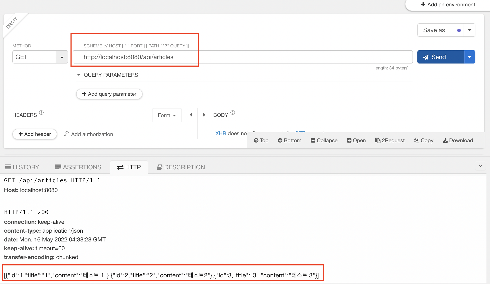  

단일 값도 가져오는것을 테스트 할 수 있다.  

<br/><br/>

`@RequestParam, @PathVariable` 차이점

- 1) http://restapi.com?userId=test&memo=테스트
- 2) http://restapi.com/test/테스트  

1과 같은 방식은 쿼리 스트링이라 부르며 Get 방식의 통신을 할 때 주로 쓰인다.  

2와 같은 방식은 RESTful 방식이며 Rest 통신할 때 쓰인다.  

각자의 장단점이 있으며 두 개의 방식은 Spring에서 파라미터를 받는 방식이 조금 다르다.   

`@RequestParam`
```java
@RestController
public class TestController (){

  @GetMapping("/")
  public String test(@RequestParam("userId") String userId, 
                     @RequestParam("memo")   String memo){

    //아래와 같이 해당 변수에 파라미터값이 할당된다.
    //userId = "test"
    //memo   = "테스트"

    return "TEST 성공"
  }
}
```  

<br/>
<br/>

`@PathVariable`
```java
@RestController
public class TestController (){

  @GetMapping("/{userId}/{memo}")
  public String test(@PathVariable("userId") String userId,
                     @PathVariable("memo")   String memo){

    //아래와 같이 해당 변수에 파라미터값이 할당된다.
    //userId = "test"
    //memo   = "테스트"

    return "TEST 성공"
  }
  
}
```  

`@PathVariable`에서 이메일과 같은 방식의 값이나 특수문자를 받을 때는 값이 잘리거나 비정상적으로 들어온다.  
이때는 아래와 같은 방법을 사용하면 정상적으로 받을 수 있다.

```java
RestController
public class TestController (){

  @GetMapping("/{userId}/{memo:.+}")
  public String test(@PathVariable("userId") String userId,
                     @PathVariable("memo")   String memo){

    //아래와 같이 해당 변수에 파라미터값이 할당된다.
    //userId = "test"
    //memo   = "테스트"

    return "TEST 성공"
  }
  
}
```  

`@PathVariable`은 아무래도 RESTful 방식에 맞게 좀 더 직관적이다.  

`@RequestParam`는 null 값 허용이나 키:밸류 값으로 보낼 수 있다는 점 정도로 들 수 있다.  

<br/>
<br/>

Rest API로 Post를 사용해 데이터를 생성 해 봅니다.  

아래 코드를 복사하여 붙여 넣기 합니다.  

PostMapping을 사용하며  JSON으로 Request를 던지기 위해서는 @RequestBody를 넣어줍니다.  

../api/ArticleApiController
```java
...
@RestController
public class ArticleApiController {
    ...
    // POST
    @PostMapping("/api/articles")
    public Article create(@RequestBody ArticleForm dto) {
        Article article = dto.toEntity(); // article 저장
        return articleRepository.save(article);
    }
    // PATCH
    // DELETE
}
```

<br/>

재기동을 하고 Talend 에서 POST Method로 url은 http://localhost:8080/api/articles 로 호출을 합니다.  
Request Body는  아래 json을 사용 합니다.  

```json
{
    "title": "rest api 1",
    "content" : "json test 합니다."
}
```  

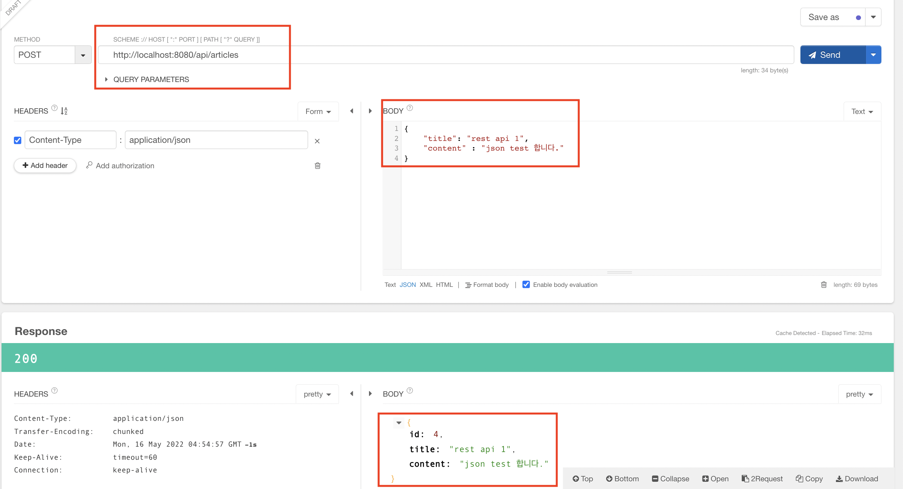  

return 값으로 위와 같은 값이 JSON으로 나오는 것을 볼수 있습니다.  
DB pk가 오류가 나면 몇번 더 실행합니다. ( pk의 identity 값이 충돌하는 이슈로 데이터를 auto identity로 생성하지 않아서 발생  )  


<br/>

Rest API로 Patch를 사용해 데이터를 수정 해 봅니다.  

아래 코드를 복사하여 붙여 넣기 합니다.  

PatchMapping을 사용하며  JSON으로 Request를 던지기 위해서는 @RequestBody를 넣어줍니다.   

데이터와 status값을 전달 하기 위해서는 ResponseEntity를 사용합니다.  

  

../api/ArticleApiController
```java
...
@Slf4j  //로그 추가
@RestController
public class ArticleApiController {
    ...
    // PATCH
    @PatchMapping("/api/articles/{id}")
    public ResponseEntity<Article> update(@PathVariable Long id,
                                          @RequestBody ArticleForm dto) {
        // 1: DTO -> 엔티티
        Article article = dto.toEntity();
        log.info("id: {}, article: {}", id, article.toString());
        // 2: 타겟 조회
        Article target = articleRepository.findById(id).orElse(null);
        // 3: 잘못된 요청 처리
        if (target == null || id != article.getId()) {
            // 400, 잘못된 요청 응답!
            log.info("잘못된 요청! id: {}, article: {}", id, article.toString());
            return ResponseEntity.status(HttpStatus.BAD_REQUEST).body(null);
        }
        // 4: 업데이트 및 정상 응답(200)
        // key와 value가 있는 경우만 update하는 로직 추가
        target.patch(article);
        Article updated = articleRepository.save(target);
        return ResponseEntity.status(HttpStatus.OK).body(updated);  // body 에 데이터를 넣어서 보냅니다.
    }
    // DELETE
}  
```  

<br/>

patch 함수를 구현하기 위해서 Article entity를 아래와 같이 수정합니다.  
 
../entity/Article
```java
package com.kt.edu.firstproject.entity;
...
public class Article {
    ...
    // 데이터가 있는 경우만 Update . 
    public void patch(Article article) {
        if (article.title != null)
            this.title = article.title;
        if (article.content != null)
            this.content = article.content;
    }
}
```  

<br/>

재기동을 하고 Talend 에서 PATCH Method로 url은 http://localhost:8080/api/articles/1 로 호출을 합니다.  
Request Body는  아래 json을 사용 합니다.  

```json
{
    "id" : 3,
    "title": "rest api 1",
    "content" : "json test 합니다."
}
```  

400에러가 발생을 합니다.  

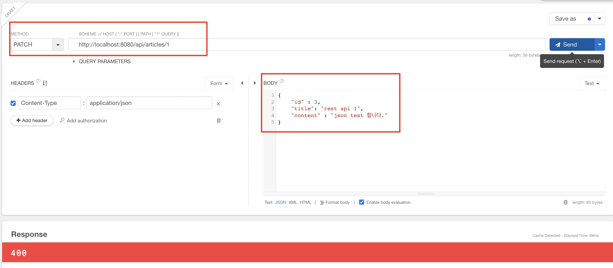  

IntelliJ 콘솔에 가면 아래와 같이 에러가 발생 한 내용을 확인 할 수 있습니다.  

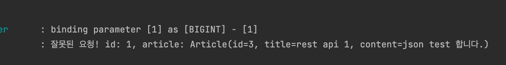  

Request Body 값을 변경을 하고 api를 다시 호출해 봅니다.  

```json
{
    "id" : 1,
    "title": "rest api 1",
    "content" : "json test 합니다."
}
```  

정상적으로 변경이 된 것을 확 인 할수 있습니다.   

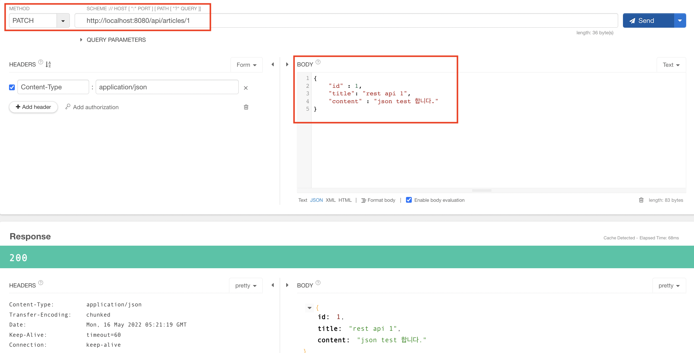  

<br/>

Rest API로 Delete를 사용해 데이터를 삭제 해 봅니다.  

아래 코드를 복사하여 붙여 넣기 합니다.  

DeleteMapping을 사용합니다.  
  
../api/ArticleApiController
```java
...
@Slf4j
@RestController
public class ArticleApiController {
    ...
    // DELETE
    @DeleteMapping("/api/articles/{id}")
    public ResponseEntity<Article> delete(@PathVariable Long id) {
        // 대상 찾기
        Article target = articleRepository.findById(id).orElse(null);
        // 잘못된 요청 처리
        if (target == null) {
            return ResponseEntity.status(HttpStatus.BAD_REQUEST).body(null);
        }
        // 대상 삭제
        articleRepository.delete(target);
        return ResponseEntity.status(HttpStatus.OK).build();
    }
}
```  

재기동을 하고 Talend 에서 DELETE Method로 url은 http://localhost:8080/api/articles/1 로 호출을 합니다.  

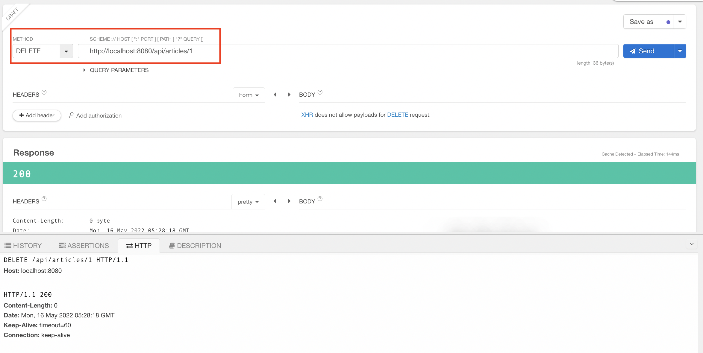  

데이터가 삭제 된 것을 확인 할 수 있습니다.  


<br/>

###  서비스와 트랜잭션, 그리고 롤백

<br/>

서비스 계층을 추가하여, 기존 Article Rest API를 리팩토링 합니다.  

service 는 RestController 와 Repository 사이에 위치하며 처리 업무의 순서를 총괄한다.  

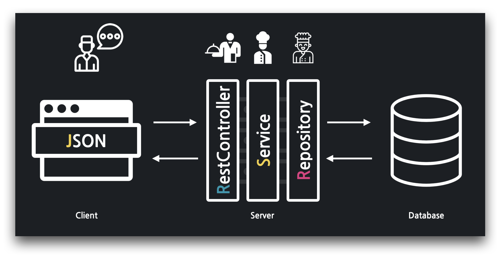    


트랜잭션 이란 모두 성공되어야 하는 일련의 과정이다. 

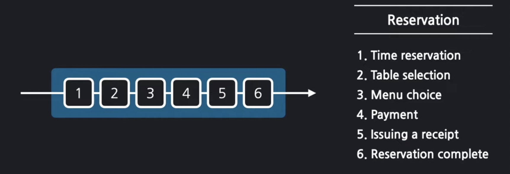    


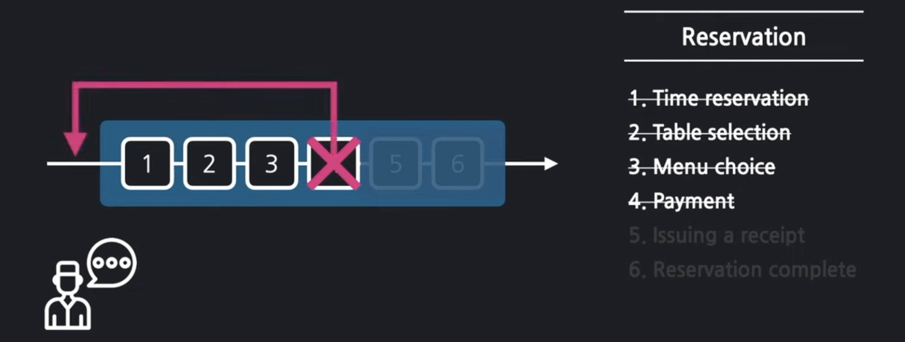   


실패시 원래 상태로 돌리는 것을 롤백이라고 한다.  

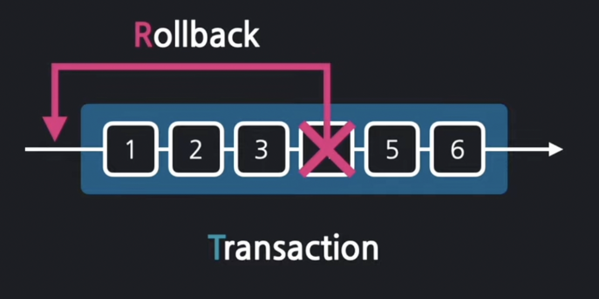    

기존의 RestController는 Client 의 요청을 처리하고 repository에 db 작업을 명령합니다.  

webservice는 서비스 계층을 통해 client 요청과 db처리를 분업화 합니다.  

<br/>
ArticleApiController 에 서비스 계층을 추가해 봅니다.  

해당 코드를 모두 주석 처리하고 아래과 같이 수정합니다.  

../api/ArticleApiController
```java
package com.kt.edu.firstproject.api;
import lombok.extern.slf4j.Slf4j;
import org.springframework.beans.factory.annotation.Autowired;
import org.springframework.web.bind.annotation.*;

@Slf4j
@RestController
public
class ArticleApiController {
    @Autowired // DI, 생성 객체를 가져와 연결!
    private ArticleService articleService;
}
```  

서비스 패키지를 생성을 합니다.  

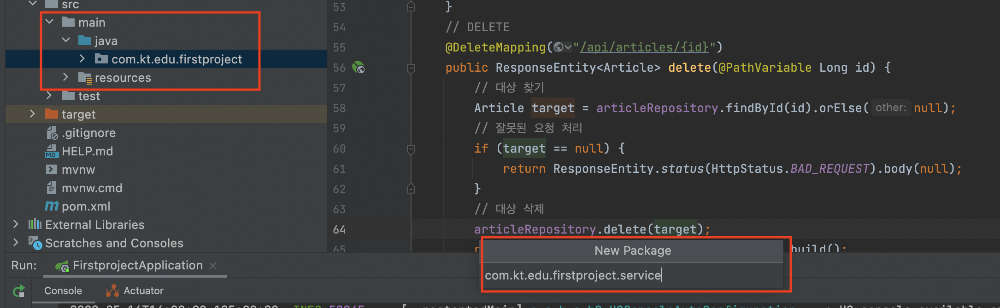   

ArticleService 를 아래와 같이 생성합니다.  

../serivce/ArticleService
```java
package com.kt.edu.firstproject.service;

import com.kt.edu.firstproject.repository.ArticleRepository;
import org.springframework.beans.factory.annotation.Autowired;
import org.springframework.stereotype.Service;

@Service // 해당 클래스를 서비스로 인식하여 스프링부트에 객체를 생성(등록)
public class ArticleService {
    @Autowired
    private ArticleRepository articleRepository;
}
```

<br/>

리팩토링, Article 목록 조회

../api/ArticleApiController
```java
...
@Slf4j
@RestController
public class ArticleApiController {
    @Autowired
    private ArticleService articleService;
    // GET
    @GetMapping("/api/articles")
    public List<Article> index() {
        return articleService.index();
    }
}
```  

../service/ArticleService
```java
package com.kt.edu.firstproject.service;

import com.kt.edu.firstproject.entity.Article;
import com.kt.edu.firstproject.repository.ArticleRepository;
import org.springframework.beans.factory.annotation.Autowired;
import org.springframework.stereotype.Service;
import java.util.List;

@Service
public class ArticleService {
    @Autowired
    private ArticleRepository articleRepository;
    public List<Article> index() {
        return articleRepository.findAll();
    }
}
```  

재기동하고 Talend에서  해당 서비스를 호출해 봅니다.  

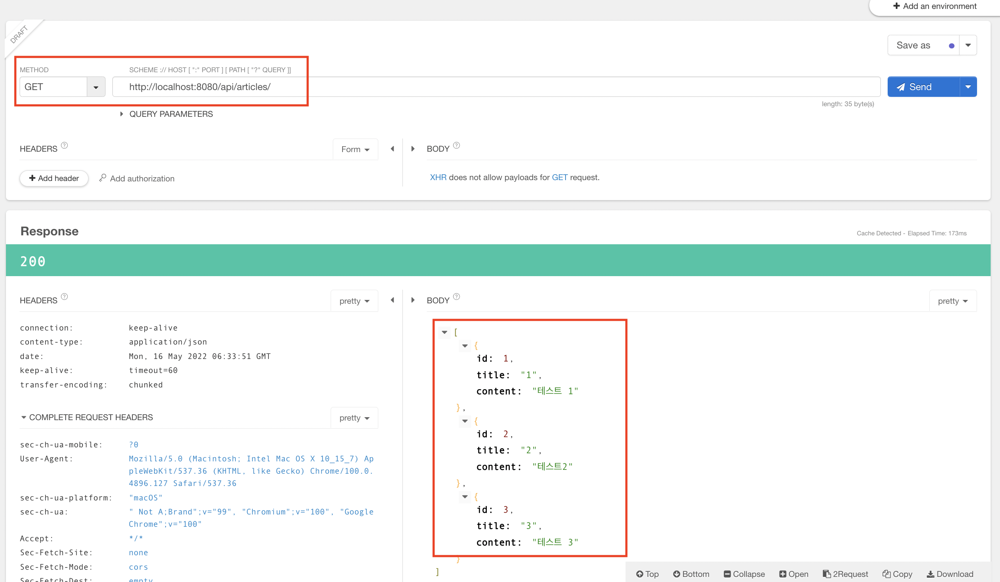 

3건의 데이터가 정상 조회가 됩니다.  

<br/> 

데이터 단건 조회를 수정해 봅니다.  


../api/ArticleApiController
```java
...
@Slf4j
@RestController
public class ArticleApiController {
    @Autowired
    private ArticleService articleService;
    // GET
    @GetMapping("/api/articles")
    public List<Article> index() {
        return articleService.index();
    }
    @GetMapping("/api/articles/{id}")
    public Article show(@PathVariable Long id) {
        return articleService.findById(id);
    }
}
```  

../service/ArticleService
```java
package com.kt.edu.firstproject.service;

import com.kt.edu.firstproject.entity.Article;
import com.kt.edu.firstproject.repository.ArticleRepository;
import org.springframework.beans.factory.annotation.Autowired;
import org.springframework.stereotype.Service;
import java.util.List;

@Service
public class ArticleService {
    @Autowired
    private ArticleRepository articleRepository;
    public List<Article> index() {
        return articleRepository.findAll();
    }
    public Article findById(Long id) {
        return articleRepository.findById(id).orElse(null);
    }
}
``` 

재기동하고 Talend에서  해당 서비스를 호출해 봅니다.  

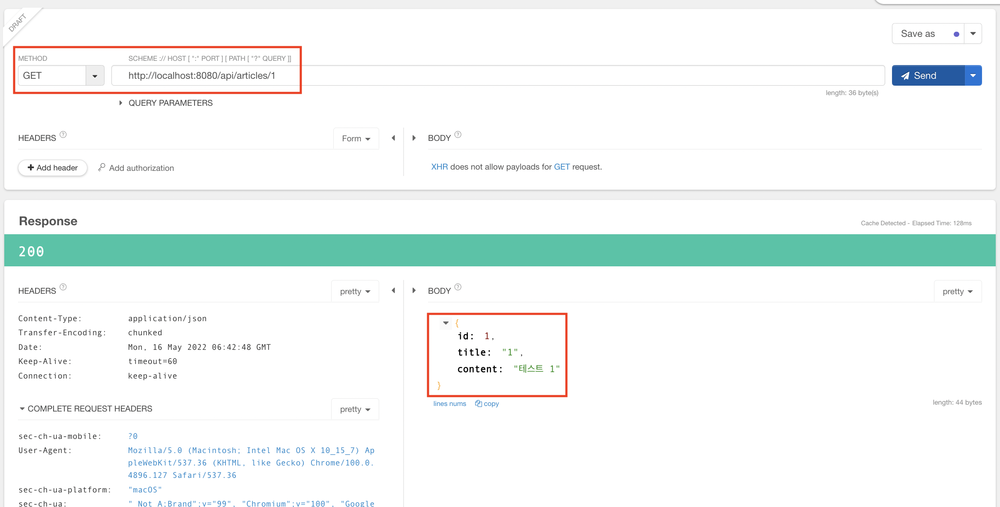 

1건의 데이터가 정상 조회가 됩니다.  