#  SpringBoot Hands-on JPA
 
SpringBoot JPA 활용 방법에 대해서 실습한다.  


1. 데이터 생성 with JPA

2. 데이터 조회 , 수정 및 삭제  with JPA

3. CRUD 와 SQL Query

4. 소스위치 : https://github.com/shclub/edu9

<br/>

## 데이터 생성 with JPA

<br/>

### JPA 

<br/>

JPA란 자바 ORM(Object Relational Mapping) 기술에 대한 API 표준 명세를 의미합니다.  

JPA는 특정 기능을 하는 라이브러리가 아니고, ORM을 사용하기 위한 인터페이스를 모아둔 것입니다.  

JPA는 자바 어플리케이션에서 관계형 데이터베이스를 어떻게 사용해야 하는지를 정의하는 방법중 한 가지 입니다.  

JPA는 단순히 명세이기 때문에 구현이 없습니다.  

JPA를 정의한 javax.persistence 패키지의 대부분은 interface , enum , Exception, 그리고  Annotation 들로 이루어져 있습니다.  

JPA의 핵심이 되는 EntityManager 는 아래와 같이 javax.persistence 패키지 안에 interface 로 정의되어 있습니다.  

JPA를 사용하기 위해서는 JPA를 구현한 Hibernate, EclipseLink, DataNucleus 같은 ORM 프레임워크를 사용해야 합니다.

우리가 Hibernate를 많이 사용하는 이유는 가장 범용적으로 다양한 기능을 제공하기 때문입니다.

 

<br/>

### Hibernate 

<br/>

Hibernate는 JPA의 구현체 중 하나입니다.  

Hibernate는 SQL을 사용하지 않고 직관적인 코드(메소드)를 사용해 데이터를 조작할 수 있습니다.

Hibernate가 SQL을 직접 사용하지 않는다고 해서 JDBC API를 사용하지 않는 것은 아닙니다.

Hibernate가 지원하는 메소드 내부에서는 JDBC API가 동작하고 있으며, 단지 개발자가 직접 SQL을 작성하지 않을 뿐 입니다.

   

JPA와 Hibernate는 마치 자바의 interface와 해당 interface를 구현한 class와 같은 관계입니다.   

   

위 사진은 JPA와 Hibernate의 상속 및 구현 관계를 나타낸 것입니다.  

JPA의 핵심인 EntityManagerFactory , EntityManager , EntityTransaction 을 Hibernate에서는 각각 SessionFactory , Session , Transaction 으로 상속받고 각각 Impl로 구현하고 있음을 확인할 수 있습니다.  

<br/>

### Spring Data JPA 

<br/>

Spring Data JPA는 Spring에서 제공하는 모듈 중 하나로 JPA를 쉽고 편하게 사용할 수 있도록 도와줍니다.  

기존에 JPA를 사용하려면 EntityManager를 주입받아 사용해야 하지만,  
Spring Data JPA는 JPA를 한단계 더 추상화 시킨 Repository 인터페이스를 제공합니다.  

Spring Data JPA가 JPA를 추상화 했다는 말은, Spring Data JPA의 Repository의 구현에서 JPA를 사용하고 있다는 것입니다.  

사용자가 Repository 인터페이스에 정해진 규칙대로 메소드를 입력하면,  
Spring이 알아서 해당 메소드 이름에 적합한 쿼리를 날리는 구현체를 만들어서 Bean으로 등록해줍니다.  


<br/>

### Hibernate와 Spring Data JPA의 차이점
 
<br/>

하이버네이트는 JPA 구현체이고, 스프링 데이터 JPA는 JPA에 대한 데이터 접근의 추상화라고 말할 수 있습니다.  

스프링 데이터 JPA는 GenericDao라는 커스텀 구현체를 제공합니다. 이것의 메소드의 명칭으로 JPA 쿼리들을 생성할 수 있습니다.   

Spring Data를 사용하면 Hibernate, Eclipse Link 등의 JPA 구현체를 사용할 수 있습니다.  

또 한가지는 @Transaction 어노테이션을 통해 트랜잭션 영역을 선언하여 관리할 수 있습니다.  

Hibernate는 낮은 결합도의 이점을 살린 ORM 프레임워크로써 API 레퍼런스를 제공합니다.  

여기서 반드시 기억해야할 점은 Spring Data JPA는 항상 Hibernate와 같은 JPA 구현체가 필요합니다.  

<br/>

### Spring Data JPA로 데이터 생성하기  
 
<br/>

이번 예제는 H2 라고하는 SpringBoot에서 제공하는 메모리 DB를 사용합니다.  

  


Database는 SQL만 이해를 하고 Java 라는 언어를 이해를 하지 못한다.  

  

Java에서 DB에서 명령하기 위해 JPA를 사용한다.  

  

<br/>

JPA 와 H2 DB 를 사용하기 위해서는 project 구성시 Dependency에 추가 해야한다.  

  

JPA 핵심 도구는 Entity 와 Repository로 구성.  

  

Entity는 Java 객체를 DB가 이해 할수 있도록 규격화 한다.  

  

Repository는 DB에 전달하고 실행하는 기능을 담당한다.  


이제 DTO를 Entity로 변환하고 Repository를 통해 DB에 저장하는 시나리오를 개발해 본다.  

  

- DTO : DTO(Data Transfer Object) 는 계층 간 데이터 교환을 하기 위해 사용하는 객체로, DTO는 로직을 가지지 않는 순수한 데이터 객체(getter & setter 만 가진 클래스)입니다.  

- VO : VO(Value Object) 값 오브젝트로써 값을 위해 쓰입니다.   

  read-Only 특징(사용하는 도중에 변경 불가능하며 오직 읽기만 가능)을 가집니다.  

  DTO와 유사하지만 DTO는 setter를 가지고 있어 값이 변할 수 있습니다.

<br/>

1단계 : Form에서 데이터를 DTO를 통해 Controller로 가져온다.  

  

<br/>

입력 폼을 만듭니다.  

../templates/articles/new.mustache
```html
<form class="container" action="/articles/create" method="post">
    <div class="mb-3">
        <label class="form-label">제목</label>
        <!-- 입력값: title -->
        <input type="text" class="form-control" name="title">
    </div>
    <div class="mb-3">
        <label class="form-label">내용</label>
        <!-- 입력값: content -->
        <textarea class="form-control" rows="3" name="content"></textarea>
    </div>
    <button type="submit" class="btn btn-primary">Submit</button>
</form>
```

<br/>

ArticleController를 생성한다.  

../controller/ArticleController
```java
package com.example.firstproject.controller;
import org.springframework.stereotype.Controller;
import org.springframework.web.bind.annotation.GetMapping;
@Controller
public class ArticleController {
    @GetMapping("/articles/new")
    public String newArticleForm() {
        return "articles/new";
    }
}
```  

<br/>

폼 데이터를 전송한다.    

../templates/articles/new.mustache
```html
<form class="container" action="/articles/create" method="post">
    <div class="mb-3">
        <label class="form-label">제목</label>
        <!-- 입력값: title -->
        <input type="text" class="form-control" name="title">
    </div>
    <div class="mb-3">
        <label class="form-label">내용</label>
        <!-- 입력값: content -->
        <textarea class="form-control" rows="3" name="content"></textarea>
    </div>
    <button type="submit" class="btn btn-primary">Submit</button>
</form>
```  

<br/>

폼 데이터를 받는다.    


../controller/ArticleController
```java
package com.kt.edu.firstproject.controller;

import com.kt.edu.firstproject.dto.ArticleForm;
import org.springframework.stereotype.Controller;
import org.springframework.web.bind.annotation.GetMapping;
import org.springframework.web.bind.annotation.PostMapping;

@Controller
public class ArticleController {
    @GetMapping("/articles/new")
    public String newArticleForm() {
        return "articles/new";
    }
    @PostMapping("/articles/create")
    public String createArticle(ArticleForm form) {
        System.out.println(form.toString());
        return "";
    }
}
```  

<br/>

DTO를 생성한다.  

../dto/ArticleForm
```java
package com.kt.edu.firstproject.dto;

public class ArticleForm {
    private String title;
    private String content;

    public ArticleForm(String title, String content) {
        this.title = title;
        this.content = content;
    }
    @Override
    public String toString() {
        return "ArticleForm{" +
                "title='" + title + '\'' +
                ", content='" + content + '\'' +
                '}';
    }
}
```  

<br/>

2단계 : DTO를 Entity 로 변환한다.    

  

<br/>

Entity를 생성한다.  

../controller/ArticleController
```java
...
@Controller
public class ArticleController {
    ...
    @PostMapping("/articles/create")
    public String createArticle(ArticleForm form) {
        System.out.println(form.toString());
        // 1. Dto를 Entity 변환
        Article article = form.toEntity();
        // 2. Repository에게 Entity를 DB로 저장하게 함
        return "";
    }
}
```   

Article 라인에 붉은 전구가 들어오고 클릭하여 create class를 클릭한다.  

  


Destination Package에는 entity 를 입력한다.  

  

entity 폴더가 생성이 되고 Article이 생성된 것을 확인 할 수 있다.  

  

<br/>

Article class에 entity를 작성한다.  DTO와 유사하다.  

../entity/Article
```java
package com.kt.edu.firstproject.entity;

import javax.persistence.*;

@Entity //DB가 해당 객체를 인식 가능
public class Article {

    @Id   // 대표 값
    @GeneratedValue // 자동생성

    private Long id;

    @Column
    private String title;

    @Column
    private String content;
    public Article(Long id, String title, String content) {
        this.id = id;
        this.title = title;
        this.content = content;
    }


    @Override
    public String toString() {
        return "Article{" +
                "id=" + id +
                ", title='" + title + '\'' +
                ", content='" + content + '\'' +
                '}';
    }
}
```

<br/>

Form 에  Entity로 변환하기 위해 toEntity Method를 생성한다.  

toEntity에 마우스를 가지고 가면 create method 가 나오고 클릭하면 ArticleForm으로 이동하여 method를 만들수 있다.  

  

<br/>

../dto/ArticleForm
```java
package com.example.firstproject.dto;
import com.example.firstproject.entity.Article;
public class ArticleForm {
    ...
    public Article toEntity() {
        return new Article(null, title, content);
    }
}
```  

<br/>

3단계 : 데이터를 저장한다.      

<br/>

ArticleRepository 에  Repository를 추가한다.  

<br/>

../controller/ArticleRepository
```java
...
@Controller
public class ArticleController {
    ...
    private ArticleRepository articleRepository; //추가

    @PostMapping("/articles/create")
    public String createArticle(ArticleForm form) {
        System.out.println(form.toString());
        // 1. Dto를 Entity 변환
        Article article = form.toEntity();
        // 2. Repository에게 Entity를 DB로 저장하게 함
        Article saved = articleRepository.save(article); //추가
        return "";
    }
}
```   

<br/>

Repository를 작성한다.  
먼저 repository 패키지를 생성한다.  
- 이름 : com.kt.edu.firstproject.repository


  

<br/>

repository 패키지 위에서 마우스 오른쪽 버튼을 눌러 ArticleRepository 라는 `Interface` 를 생성한다.  

  

extends 라는 구문은 상속을 받는 다는 의미이며 여기서는 CRUD를 새로 구현할 필요가 없다.  

../repository/ArticleRepository  
```java
ppackage com.kt.edu.firstproject.repository;

import com.kt.edu.firstproject.entity.Article;
import org.springframework.data.repository.CrudRepository;

public interface ArticleRepository extends CrudRepository<Article, Long> {
}
```  

ArticleRepository 가 작성이 되면 ArticleController 로 이동하여 에러난 부분을 수정한다.   ( import class 등 )    

```java
@Controller
public class ArticleController {
// 이전
    private ArticleRepository articleRepository;
```  
<br/>

추가적으로 repository 객체를 생성하지 않고 AutoWired를 추가하면
springboot가 알아서 처리한다.  

```java
@Controller
public class ArticleController {
    // 이후
    @Autowired // 스프링 부트가 미리 생성해놓은 리파지터리 객체를 가져옴(DI)
    private ArticleRepository articleRepository;
```  

<br/>

테스트를 하기 위해 System.out 로직을 삽입한다.  

../controller/ArticleController
```java
package com.kt.edu.firstproject.controller;

import com.kt.edu.firstproject.dto.ArticleForm;
import com.kt.edu.firstproject.entity.Article;
import com.kt.edu.firstproject.repository.ArticleRepository;
import org.springframework.beans.factory.annotation.Autowired;
import org.springframework.stereotype.Controller;
import org.springframework.web.bind.annotation.GetMapping;
import org.springframework.web.bind.annotation.PostMapping;

@Controller
public class ArticleController {

    @Autowired // 스프링 부트가 미리 생성해놓은 리파지터리 객체를 가져옴(DI)
    private ArticleRepository articleRepository;

    @GetMapping("/articles/new")
    public String newArticleForm() {
        return "articles/new";
    }
    @PostMapping("/articles/create")
    public String createArticle(ArticleForm form) {
        System.out.println(form.toString());
        //1. DTO를 를 변환 , entity
        Article article = form.toEntity();
        System.out.println(article.toString());
        
        // 2. Repository에게 Entity를 DB로 저장하게 함
        Article saved = articleRepository.save(article);
        System.out.println(saved.toString());

        return "";
    }
}
```  

<br/>

4단계 : 데이터를 저장 확인.      

<br/>  

  

프로젝트를 재시작하고 웹 브라우저에서 값을 입력하고 submit을 한다.  

  

IntelliJ의 console에 id 값이 1로 되어 있는것을 확인 할 수 있다.  

  

한번더 submit을 하면 id 가 2로 증가가 된다.  

<br/>

5단계 : H2 DB 접속 및 설정      

<br/> 

SpringBoot는 내부적으로 H2 Database 를 사용하며 H2 DB 접근을 위해서는 아래 설정값을 추가한다.  

../resources/application.properties  
```bash
# h2 DB, 웹 콘솔 접근 허용
spring.h2.console.enabled=true
```  

프로젝트 재기동을 하고 웹 브라우저에서 http://localhost:8080/h2-console 를 입력한다.   

처음부터 접속하면 바로 에러가 발생을 한다.  

IntelliJ 화면에서 찾기 ( 맥 기준 : cmd + F) 사용하여 jdbc로 검색하면 아래 내용을 확인 할 수 있다.  

 

url 을 복사해사 웹 브라우저의 h2 web admin의 JDBC URL 에 붙여 넣기하고 connect 한다.  ( url은 재기동시 계속 변경된다. 향후에 고정 하는 방법 설명 예정 )  

  

접속이 성공하면 아래와 같이 나온다.  
ARTICLE 테이블을 선택 하고 RUN 버튼을 클릭하여 데이터를 조회한다.  

  

데이터가 아무것도 조회 되지 않는다. H2 DB는 메모리 DB이기 때문에 재기동하면
데이터가 삭제가 된다.  

이제 웹에서 http://localhost:8080/articles/new 입력하고 다시 데이터를 보내본다.    

데이터 1건이 입력 된 것을 확인 할 수 있다.  

  


<br/>

## 데이터 조회 , 수정 및 삭제 with JPA

<br/>

### 데이터 조회

<br/>

데이터 조회 흐름

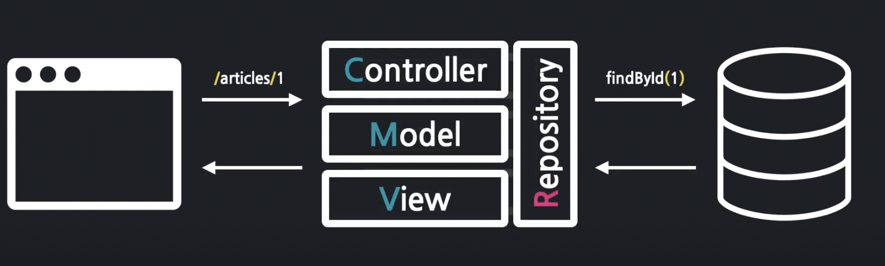    

기존에 생성한 프로젝트는 웹브라우저 를 통하여 데이터를 전달 받았고 우리는
http://localhost:8080/articles/1 이런 형태로 데이터를 조회하고자 한다. ( 1은 테이블의 key 값 )  

데이터를 받아주기 위한 controller를 생성합니다.  
ArticleController가 있기 때문에 아래 처럼 추가합니다.  

- URL요청 처리
  @GetMapping("/articles/{id}")
- URL에서 id를 변수로 가져오기
  @PathVariable   

../controller/ArticleController  
```java
...
@Controller
@Slf4j
public class ArticleController {
    ...
    @GetMapping("/articles/{id}") // 해당 URL요청을 처리 선언
    public String show(@PathVariable Long id) { // URL에서 id를 변수로 가져옴
        log.info("id = " + id);
        return "";
    }
}
```  

재기동을 하고 웹 브라우저에서 http://localhost:8080/articles/1 호출하면 IntelliJ Console에서 로그 정보를 통해 id 가 1인 값이 전달 된것을 확인 할 수 있다.  

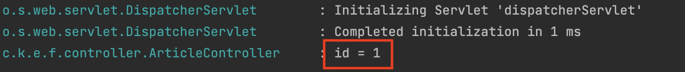   

아래 단계를 통해 데이터를 가져온다.

- 1단계 : id로 데이터를 가져오기 
- 2단계 : 가져온 데이터를 모델에 등록
- 3단계 : 보여줄 페이지를 설정 

<br/> 

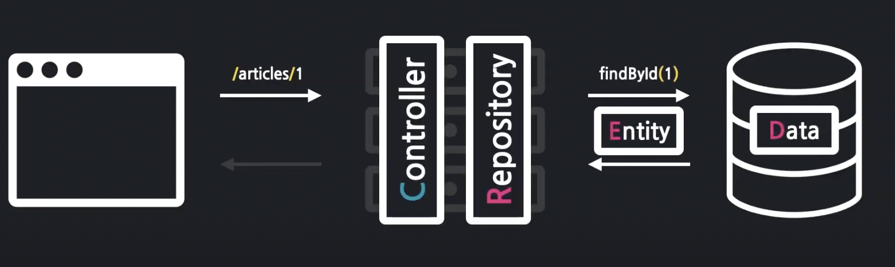   

데이터를 가져오는 것은 Repository의 역할이다.  

findById는 이미 Repository Interface에 정의된 method 이고 여기에
구현을 하면 된다.  ( interface는 껍데기만 있음 )  

../controller/ArticleController
```java
      // 1: id로 데이터를 가져옴!
        Article articleEntity = articleRepository.findById(id).orElse(null);  // orElse는 데이터가 없으면 다른 값 return
        return "";
 ```  

view에서 데이터를 보여주기 위해 가져온 데이터를 모델에 등록한다.  

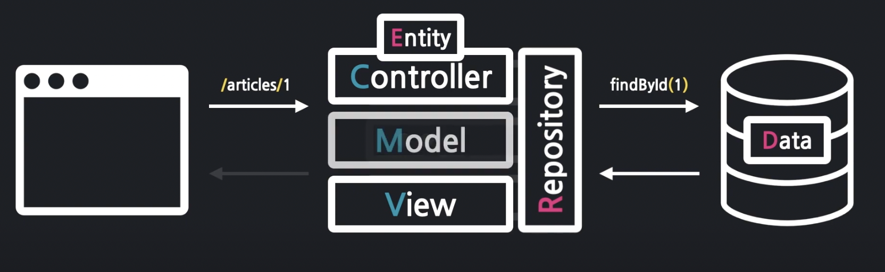   

<br/>

show 매개변수에  model 을 추가한다.  

../controller/ArticleController
```java
public String show(@PathVariable Long id, Model model) { // URL에서 id를 변수로 가져옴
        log.info("id = " + id);

        // 1: id로 데이터를 가져옴!
        Article articleEntity = articleRepository.findById(id).orElse(null);  // orElse는 데이터가 없으면 다른 값 return
        // 2: 가져온 데이터를 모델에 등록!
        model.addAttribute("article", articleEntity);
        
        return "";
```  

데이터를 보여 주기 위해 페이지를 설정한다.  
articles 폴더에 show 라는 mustache 파일이 있다고 가정한다.  

../controller/ArticleController
```java
      // 1: id로 데이터를 가져옴!
        Article articleEntity = articleRepository.findById(id).orElse(null);  // orElse는 데이터가 없으면 다른 값 return
        // 2: 가져온 데이터를 모델에 등록!
        model.addAttribute("article", articleEntity);
        // 3: 보여줄 페이지를 설정!
        return "articles/show";
 ```  

 mustache 화일을 만들기 위해서 resourcs > templates > articles로 이동하여 New > File 선택하고 화일명을 입력한다.  
 
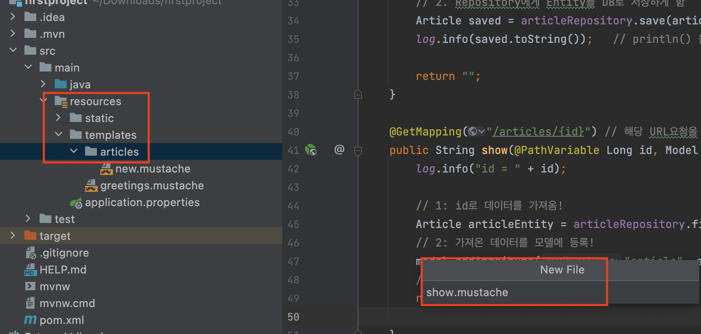   

 ../articles/show.mustache
 ```html
 
<style>
    table, th, td {
        border: 1px solid black;
    }
</style>

<table class="table" style="width:50%">
    <thead>
    <tr>
        <th scope="col">ID</th>
        <th scope="col">Title</th>
        <th scope="col">Content</th>
    </tr>
    </thead>
    <tbody>
    {{#article}}
        <tr>
            <th>{{id}}</th>
            <td>{{title}}</td>
            <td>{{content}}</td>
        </tr>
    {{/article}}
    </tbody>
</table>
 ```  
프로젝트를 재기동하고 웹 브라우저에서  http://localhost:8080/articles/new 를 접속을하고 데이터를 생성한다.   

그리고  http://localhost:8080/articles/1 를 호출 해본다.  
아래와 같은 에러가 발생한다.  

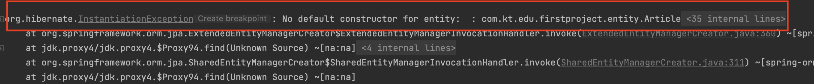   

entity에 Default 생성자가 없다는 에러 이다.
Default 생성자는 파라미터가 하나도 없는 생성자이다.  
  
```bash
No default constructor for entity: : com.kt.edu.firstproject.entity
```  

Article 자바 화일에 lombok을 이용하여 생성자를 생성한다.  
```bash
...
@Entity
@AllArgsConstructor
@NoArgsConstructor // Default 생성자 추가
@ToString
public class Article {
    @Id
    @GeneratedValue
    private Long id;
...
}
```  

재기동 하면 데이터가 삭제가 되기 때문에 다시 한번 데이터를 입력한다.   

입력 후에  http://localhost:8080/articles/1 를 호출 하면
아래 화면을 볼수 있습니다.  

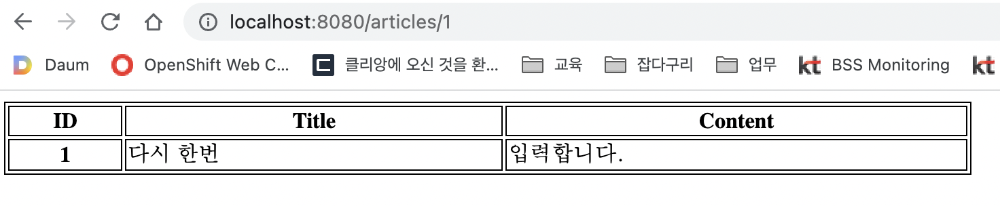  


<br/>

### 데이터 전체 조회

<br/>

데이터 전체 조회 흐름

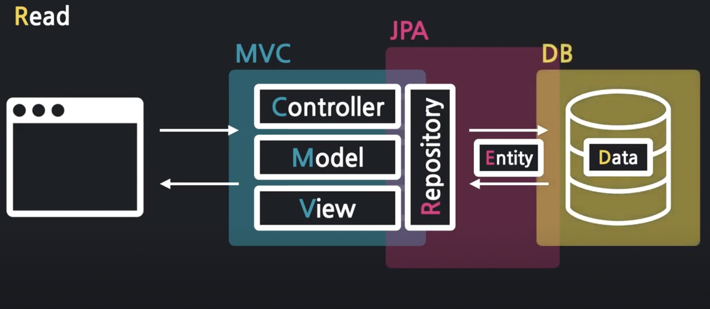    

ArticleController 에 index라는 메소드를 생성한다.  

../controller/ArticleController  
```java
...
@Controller
@Slf4j
public class ArticleController {
    ...
    @GetMapping("/articles")
    public String index() {
        // 1: 모든 Article을 가져온다!
        // 2: 가져온 Article 묶음을 뷰로 전달!
        // 3: 뷰 페이지를 설정!
        return "";
    }
}
```  

<br/>

controller 흐름  

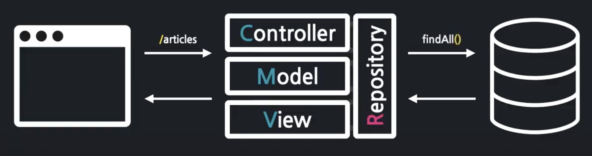    

<br/>

Article 데이터를 가져오기 위해서는 Repository가 필요하고 findAll 함수는 모든 데이터를 가져오는 기능을 한다.  

데이터 묶음을 가져오기 위해 List를 사용한다.  

../controller/ArticleController  
```java
...
@Controller
@Slf4j
public class ArticleController {
    ...
    @GetMapping("/articles")
    public String index() {
        // 1: 모든 Article을 가져온다!
        List<Article> articleEntityList = articleRepository.findAll();
        // 2: 가져온 Article 묶음을 뷰로 전달!
        // 3: 뷰 페이지를 설정!
        return "";
    }
}
```  

findAll 함수에 마우스를 올리면 타입이 불일치 하는 것을 알 수 있다.  
이때 캐스팅을 해야 한다.  

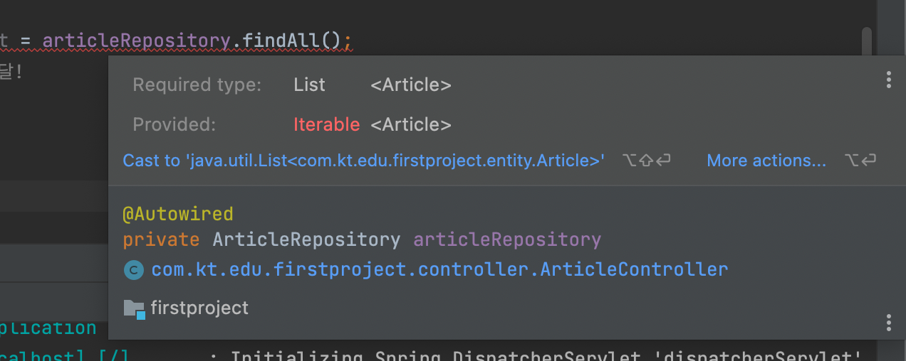    

Iterable로 변경하면 에러가 사라진다.  

../controller/ArticleController  
```java
...
@Controller
@Slf4j
public class ArticleController {
    ...
    @GetMapping("/articles")
    public String index() {
        // 1: 모든 Article을 가져온다!
        Iterable<Article> articleEntityList = articleRepository.findAll();
        // 2: 가져온 Article 묶음을 뷰로 전달!
        // 3: 뷰 페이지를 설정!
        return "";
    }
}
```  

Iterable을 익숙한 ArrayList로 변경해보자.   

repository 폴더로 이동하여 ArticleRepository를 클릭한다.  

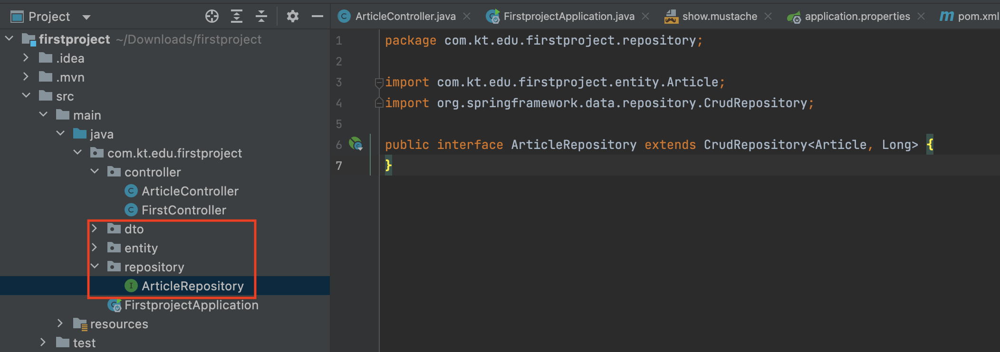   

ArticleRepository는 CrudRepository를 오버라이딩 하여 새로운 method를 만들어 줍니다.  

interface 안에서 마우스 오른쪽을 클릭하고 Generate > Override를 선택합니다.   

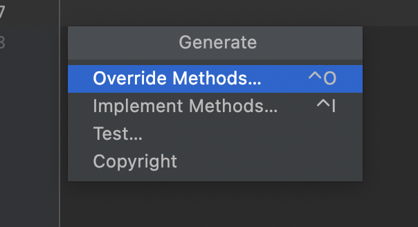   

오버라이드할 findAll 함수를 선택하고 OK를 누르면 소스가 생성이 됩니다.  

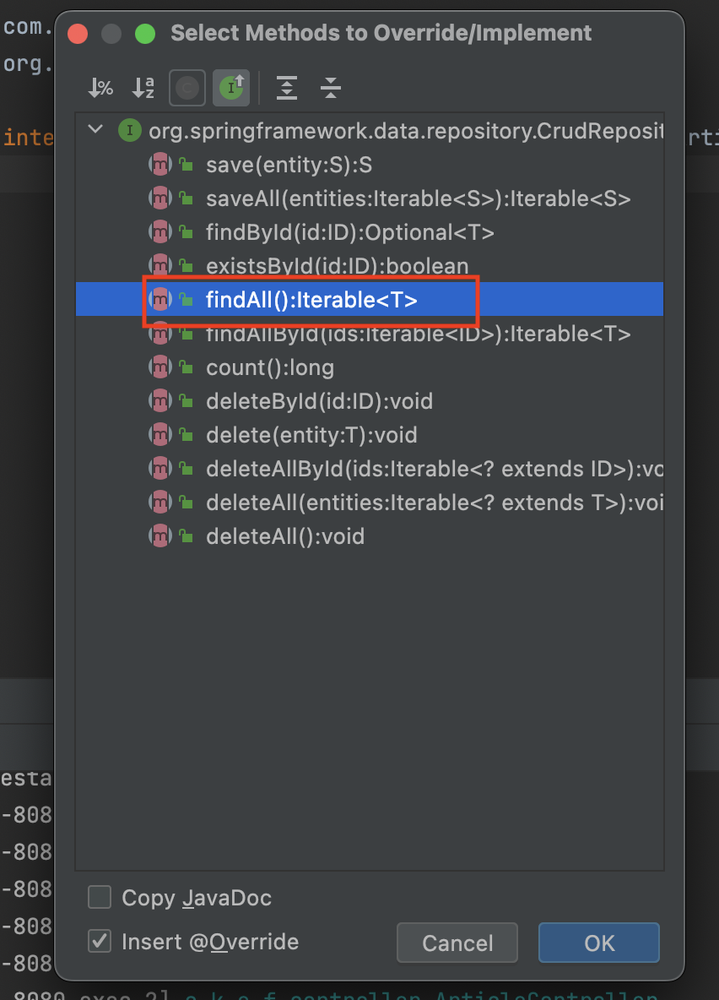   

Iterable을 ArrayList로 변경하여 method override를 합니다.  

../repository/ArticleRepository
```java
public interface ArticleRepository extends CrudRepository<Article, Long> {
    @Override
    ArrayList<Article> findAll();
}
```  
<br/>

ArticleController도 List로 변경을 하면 에러가 발생하지 않습니다.  

../controller/ArticleController  
```java
 @GetMapping("/articles")
    public String index() {
        // 1: 모든 Article을 가져온다!
        List<Article> articleEntityList = articleRepository.findAll();
        // 2: 가져온 Article 묶음을 뷰로 전달!
        // 3: 뷰 페이지를 설정!
        return "";
    }
```    

모델에 데이터를 등록합니다.  
articleList 라는 이름으로 articleEntityList 를 전달 합니다.  
  
../controller/ArticleController  
```java
...
@Controller
@Slf4j
public class ArticleController {
    ...
    @GetMapping("/articles")
    public String index(Model model) {
        // 1: 모든 Article을 가져온다!
        List<Article> articleEntityList = articleRepository.findAll();
        // 2: 가져온 Article 묶음을 뷰로 전달!
        model.addAttribute("articleList", articleEntityList);
        // 3: 뷰 페이지를 설정!
        return "";
    }
}
```  

<br/>

뷰페이지를 연결합니다.  

articles 폴더에 index mustache 화일로 설정합니다.  

../controller/ArticleController  
```java
...
@Controller
@Slf4j
public class ArticleController {
    ...
    @GetMapping("/articles")
    public String index(Model model) {
        // 1: 모든 Article을 가져온다!
        List<Article> articleEntityList = articleRepository.findAll();
        // 2: 가져온 Article 묶음을 뷰로 전달!
        model.addAttribute("articleList", articleEntityList);
        // 3: 뷰 페이지를 설정!
        return "articles/index";
    }
}
``` 

index.mustache 화일을 생성합니다.  
model에서 articleList로 보냈기 때문에 articleList로 설정한다.  

../articles/index.mustache
```html
<style>
    table, th, td {
        border: 1px solid black;
    }
</style>

<table class="table" style="width:50%">
  <thead>
  <tr>
    <th scope="col">ID</th>
    <th scope="col">Title</th>
    <th scope="col">Content</th>
  </tr>
  </thead>
  <tbody>
  {{#articleList}}
    <tr>
      <th>{{id}}</th>
      <td>{{title}}</td>
      <td>{{content}}</td>
    </tr>
  {{/articleList}}
  </tbody>
</table>
```  

웹브라우저에서 데이터를 3건 정도 입력한다.  

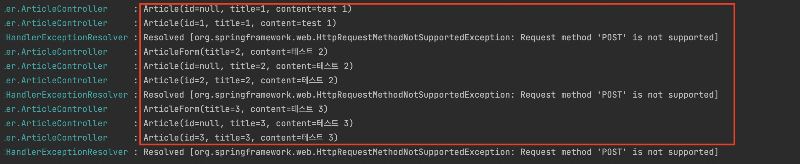   

웹브라우저에서 http://localhost:8080/articles 를 사용하여 데이터를 조회해 보면 3건이 들어가 있는 것을 확인 할 수 있다.  

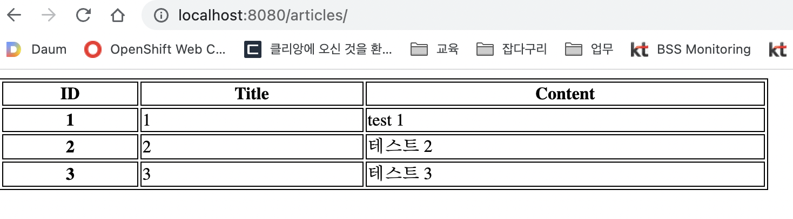   

mustache 문법을 보면 articleList 에 데이터가 복수개 이면 아래 내용이 데이터 갯수 만큼 반복으로 수행된다.  

```html
{{#articleList}}
    <tr>
      <th>{{id}}</th>
      <td>{{title}}</td>
      <td>{{content}}</td>
    </tr>
  {{/articleList}}
```  


<br/>

### 링크와 리다이렉트

<br/>

링크와 리다이렉트를 통해, 페이지간 이동을 연결합니다.

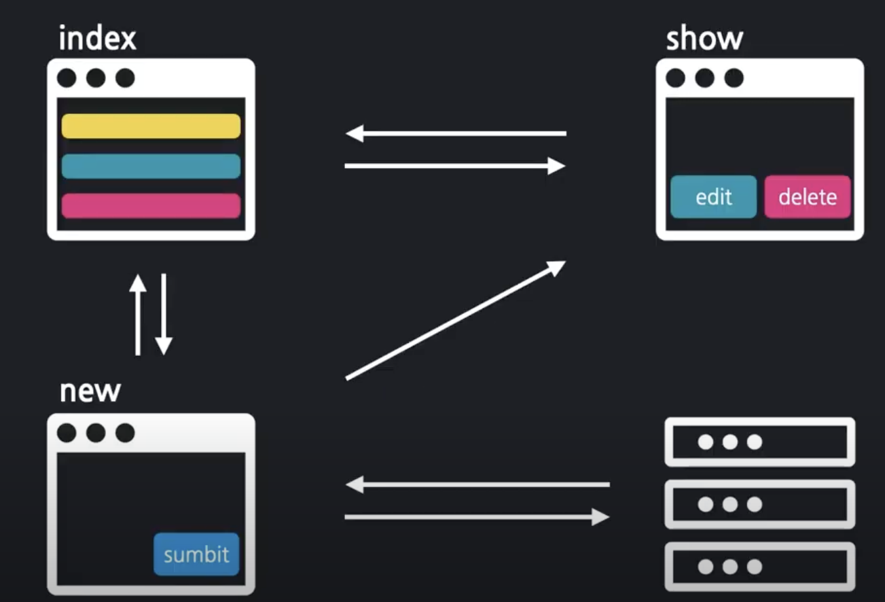    

Link는 Request를 하고 Redirect는 Response 에 해당 합니다.  

  

Link는 `<a> , <form>` 의 형태로 사용합니다.  
  
  

<br/>

Redirect는 해당 페이지에서 다른 페이지로 연결 할때 사용합니다.  

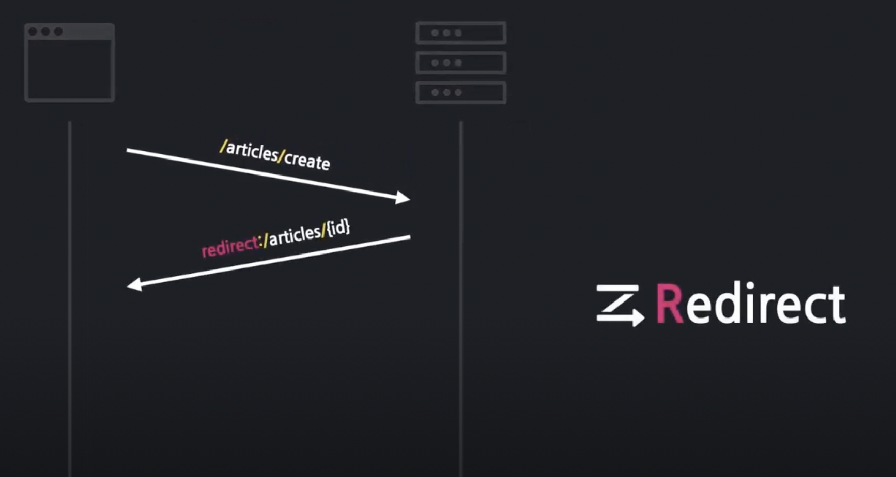  

목록에서 새 글작성 링크를 만든다.    

../articles/index.mustache  
```html
<table class="table">
  ...
</table>
<a href="/articles/new">New Article</a>
```  

망치 아이콘을 클릭하고 웹 브라우저에서 http://localhost:8080/articles 를 입력한다.   

New Article 링크가 생성 된것을 확인 할 수 있다.  

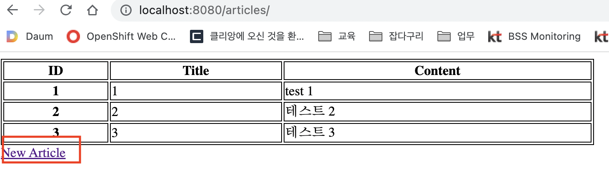  

목록 돌아가기 링크를 만든다.  

../articles/new.mustache
```html
<form class="container" action="/articles/create" method="post">
  ...
  <button type="submit" class="btn btn-primary">Submit</button>
  <a href="/articles">Back</a>
</form>
```  

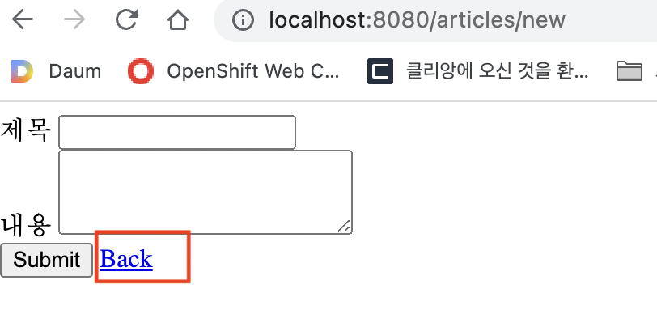  

<br/>

새글 저장 후에 상세 페이지로 redirect 한다.  

ArticleController 에 리다이렉트를 추가 한다.  

../controller/ArticleController  
```java
...
@Controller
@Slf4j
public class ArticleController {
    ...
    @PostMapping("/articles/create")
    public String createArticle(ArticleForm form) {
        log.info(form.toString());
        Article article = form.toEntity();
        log.info(article.toString());
        Article saved = articleRepository.save(article);
        log.info(saved.toString());
        // 리다이렉트 적용: 생성 후, 브라우저가 해당 URL로 재요청
        return "redirect:/articles/" + saved.getId();
    }
    ...
}
```  

<br/>
Article 에 Getter를 추가한다.  

```java
../entity/Article
@Entity
@AllArgsConstructor
@NoArgsConstructor
@ToString
@Getter // 롬복으로 Getter 추가
public class Article {
    @Id
    @GeneratedValue
    private Long id;
    @Column
    private String title;
    @Column
    private String content;
}
```   

상세 페이지에서 전체 목록으로 이동하는 Link를 만든다.   

../articles/show.mustache
```html
<table class="table">
  ...
</table>
<a href="/articles">Go to Article List</a>
```

<br/>

index.mustache에 
```html
<a href="/articles/{{id}}">{{title}}</a>  
```
를 추가한다.   

../articles/index.mustache
```html
...
  {{#articleList}}
    <tr>
      <th>{{id}}</th>
      <!-- 제목에 링크 걸기 -->
      <td><a href="/articles/{{id}}">{{title}}</a></td>
      <td>{{content}}</td>
    </tr>
  {{/articleList}}
  </tbody>
</table>
<a href="/articles/new">New Article</a>
```  

재기동을 하고  웹브라우저에서 http://localhost:8080/articles 를 입력하고
데이터가 없으면 New Article를 통해 추가한다.  

아래와 같이 나오면 성공.  

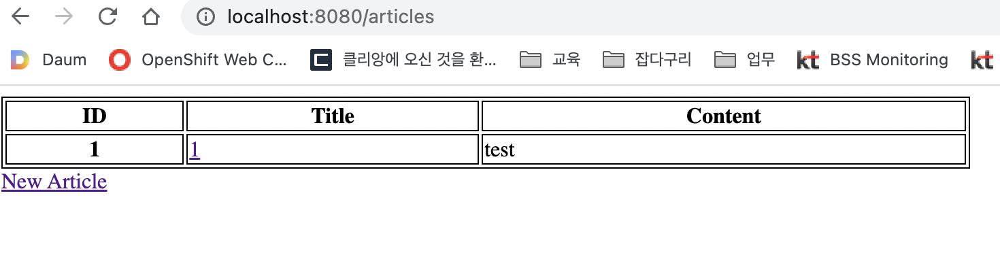  

<br/>

전체 흐름은 아래와 같다.  

  

<br/>

### 수정 폼 만들기

<br/>

데이터 수정을 위한 수정 폼을 만든다.  

    

수정폼으로 이동하기 위해 수정 링크를 추가한다.  

../articles/show.mustache
```html
<!-- 수정 링크 추가 -->
<a href="/articles/{{article.id}}/edit" class="btn btn-primary">Edit</a>
<a href="/articles">Go to Article List</a>
```  

<br/>

수정 입력을 받기 위해서 컨트롤러에 수정 method 를 추가한다.  

```java
...
@Controller
@Slf4j
public class ArticleController {
    ...
    @GetMapping("/articles/{id}/edit")
    public String edit(@PathVariable Long id, Model model) {
        // 수정할 데이터 가져오기
        Article articleEntity = articleRepository.findById(id).orElse(null);
        // 모델에 데이터 등록
        model.addAttribute("article", articleEntity);
        // 뷰 페이지 설정
        return "articles/edit";
    }
}
```  

<br/>

수정 페이지를 작성한다.  

../articles/edit.mustache
```html
{{#article}}
<form class="container" action="" method="post">
  <div class="mb-3">
    <label class="form-label">제목</label>
    <input type="text" class="form-control" name="title" value="{{title}}">
  </div>
  <div class="mb-3">
    <label class="form-label">내용</label>
    <textarea class="form-control" rows="3" name="content">{{content}}</textarea>
  </div>
  <button type="submit" class="btn btn-primary">Submit</button>
  <a href="/articles/{{id}}">Back</a>
</form>
{{/article}}
```

Edit 메뉴가 나오는 것을 확인 할 수 있다.  

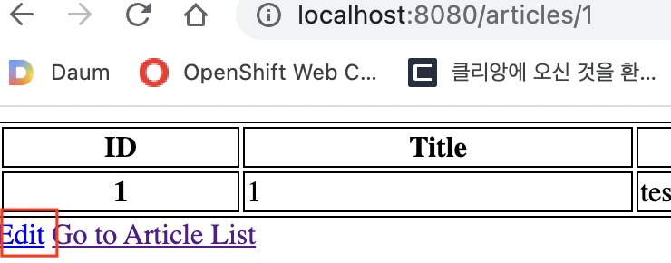   

Edit 메뉴를 클릭하면 수정폼으로 이동한다.  

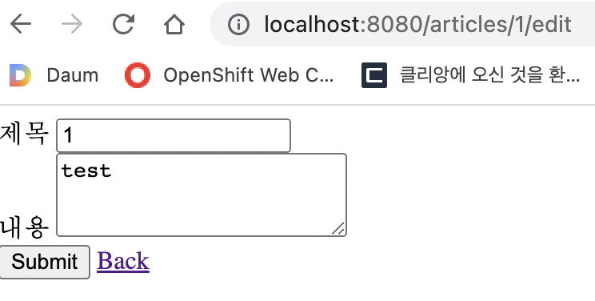   

<br/>

전체 흐름은 다음과 같다.  

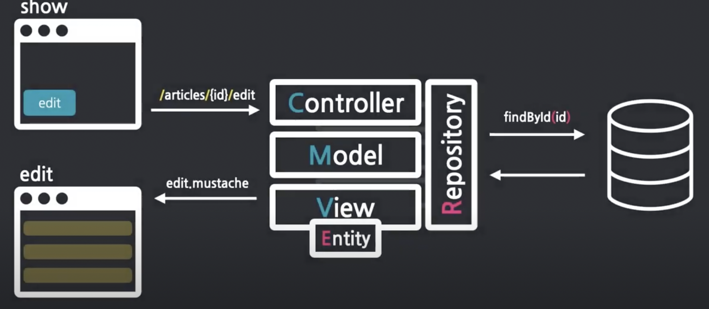  

<br/>

### 데이터 수정하기

<br/>

이제 데이터를 수정하여 DB에 update를 합니다.  

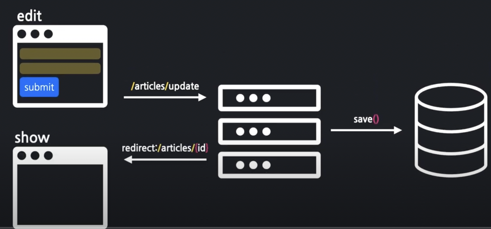    

<br/>

웹페이지와 서버간의 통신은 HTTP를 사용하며  SpringBoot 서버는 MVC로 구현을 하고  JPA를 통해 DB와 연결합니다.  

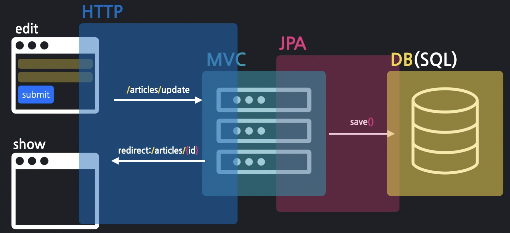   

<br/>

HTTP와  매핑되는 SQL 기능

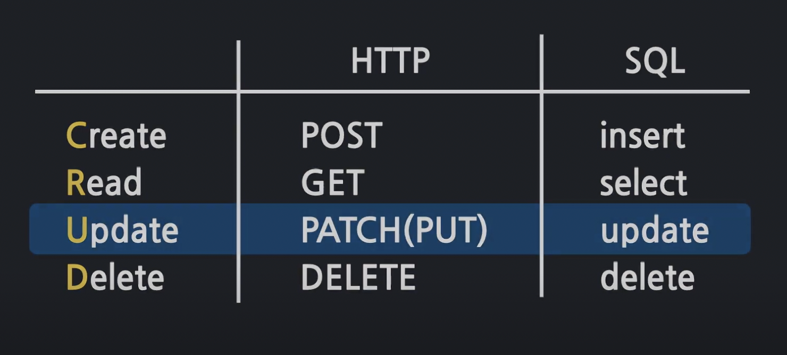  

데이터를 계속 넣어주는 번거로움을 피하기 위해  더미 데이터를 sql로 작성합니다.  
이렇게 작성을 하면 재기동시에 아래 구문이 실행이 되고 H2 DB에 저장이 된다.  

../resources/data.sql
```sql
INSERT INTO article(id, title, content) VALUES(1, '1', '테스트 1');
INSERT INTO article(id, title, content) VALUES(2, '2', '테스트2');
INSERT INTO article(id, title, content) VALUES(3, '3', '테스트 3');
```  

추가적으로 application.properties에 아래 구문을 추가한다.  

../resources/application.properties
```
# data.sql 적용을 위한 설정(스프링부트 2.5 이상 필수)
spring.jpa.defer-datasource-initialization=true
```
재기동 하고 웹브라우저에 http://localhost:8080/articles 를 입력하면
데이터가 3건 들어가 있는 것을 확인 할 수 있다.  

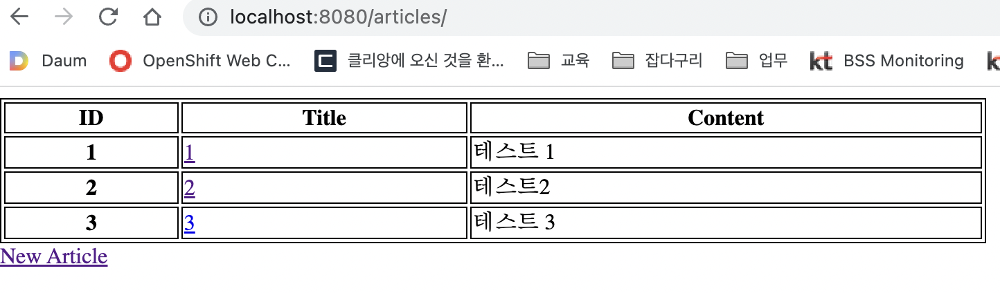  

<br/>

수정페이지를 변경합니다.  

edit.mustache 에서 action 에 데이터를 보낼 곳을 설정합니다.  
method는 보내는 방법을 설정합니다. 여기서는  post를 사용합니다.  

데이터를 보내는 값을 설정을 해줍니다.  ( hidden은 숨겨서 데이터 보내기 )  

```html
  <input name="id" type="hidden" value="{{id}}" />
```  

전체 수정  

../articles/edit.mustache
```html
{{#article}}
<form class="container" action="/articles/update" method="post">
  <input name="id" type="hidden" value="{{id}}" />
  <div class="mb-3">
    <label class="form-label">제목</label>
    <input type="text" class="form-control" name="title" value="{{title}}">
  </div>
  <div class="mb-3">
    <label class="form-label">내용</label>
    <textarea class="form-control" rows="3" name="content">{{content}}</textarea>
  </div>
  <button type="submit" class="btn btn-primary">Submit</button>
  <a href="/articles/{{id}}">Back</a>
</form>

{{/article}}
```  

여기 까지 진행 흐름 입니다.  

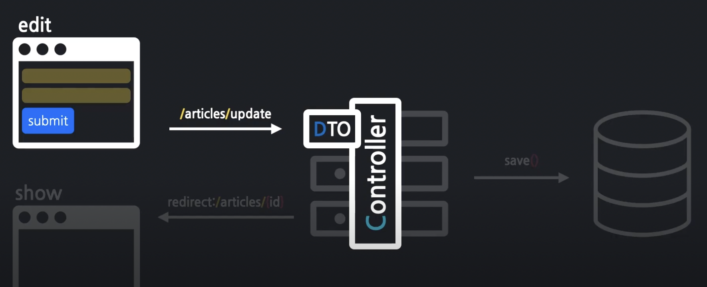  

<br/>  

수정폼을 받아 오기 위해서 controller에  method를 추가 합니다.  
update 메소드에 ArticleForm 으로 받는다.  

../controller/ArticleController
```java
...
@Controller
@Slf4j
public class ArticleController {
    ...
    @PostMapping("/articles/update")
    public String update(ArticleForm form) {
        log.info(form.toString());
        return "";
    }
}
```  

<br/>

id 값으로 데이터를 추가해야 하기 때문에 DTO를 변경합니다.  
id 필드 추가 및 엔티티 변환 메소드 변경.

../dto/ArticleForm
```java
package com.kt.edu.firstproject.dto;

import com.kt.edu.firstproject.entity.Article;
import lombok.AllArgsConstructor;
import lombok.ToString;

@AllArgsConstructor
@ToString
public class ArticleForm {

    private Long id; //신규로 추가
    private String title;
    private String content;

    public Article toEntity() {
        return new Article(id, title, content);
    }
}
```  

<br/>

컨트롤러에 에서 수정 폼 처리 로직을 추가합니다.  

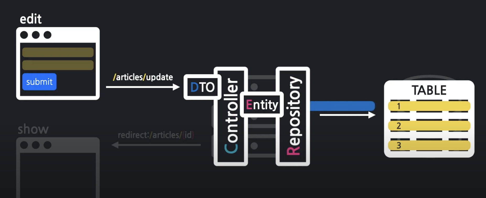    

<br/>

../controller/ArticleController
```java
...
@Controller
@Slf4j
public class ArticleController {
    ...
    @PostMapping("/articles/update")
    public String update(ArticleForm form) {
        log.info(form.toString());
        // 1: DTO를 엔티티로 변환
        Article articleEntity = form.toEntity();
        log.info(articleEntity.toString());
        // 2: 엔티티를 DB로 저장
        // 2-1: DB에서 기존 데이터를 가져옴
        Article target = articleRepository.findById(articleEntity.getId())
                .orElse(null);
        // 2-2: 기존 데이터가 있다면, 값을 갱신
        if (target != null) {
            articleRepository.save(articleEntity);
        }
        // 3: 수정 결과 페이지로 리다이렉트
        return "redirect:/articles/" + articleEntity.getId();
    }
}
```  


  

데이터를 수정해 보고 확인합니다.  
웹 브라우저에서 http://localhost:8080/articles 를 입력하고 원하는 데이터를 선택하여 수정을 해보고 정상적으로 되는지 확인합니다.  

<br/>

한글 깨짐 발생시  
메뉴바 > Help > VM 옵션 수정으로 이동하여 다음 설정을 끝부분에 추가한다.  

```
-Dfile.encoding=UTF-8
```  

메뉴바 > File > Settings(or Preferences) > … > File Encodings 설정  

Global Encoding, Project Encoding, Properties Files 모두를 UTF-8로 바꾼다.  

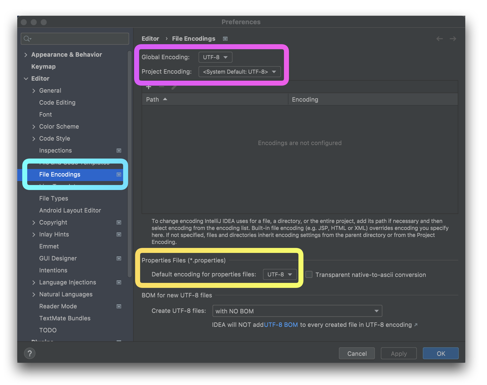   

<br/> 


<br/>

### 데이터 삭제하기

<br/>

이제 데이터를 DB에서 delete 를 합니다.  

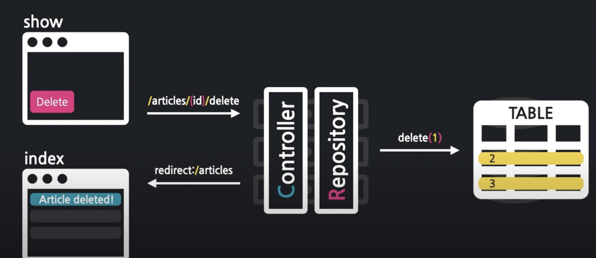    

<br/>

RedirectAttributes는 화면에 한번만 사용하고  다음에는 사용되지 않는 데이터를 전달하기 위해 사용한다.  
 
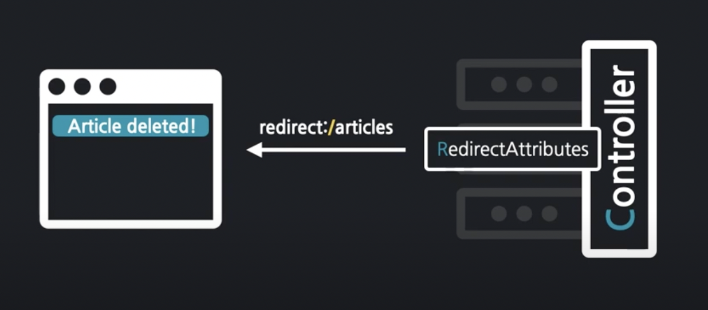    

addFlashAttributes method를 통하여 전달합니다.  

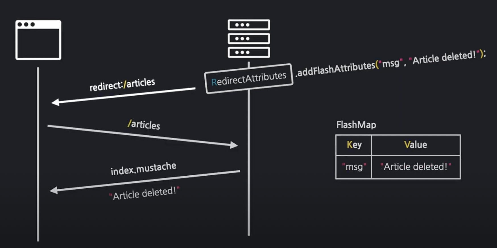    

<br/>

삭제 링크를 추가합니다.  
a 태그와 Get http 메소드를 사용합니다.  향후에는 javascript 로 변환 예정. 

../articles/show.mustache
```html
<table class="table">
  ...
</table>
<a href="/articles/{{article.id}}/edit" class="btn btn-primary">Edit</a>
<!-- 삭제 링크 추가 -->
<a href="/articles/{{article.id}}/delete" class="btn btn-danger">Delete</a>
<a href="/articles">Go to Article List</a>
```

contoller에서 delete method를 추가합니다.  

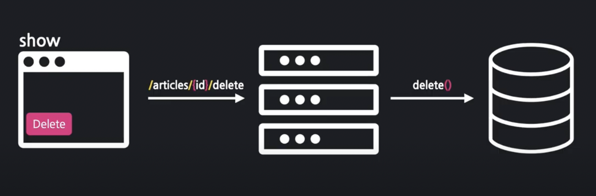   

아래는 삭제 처리 개요에 대한 설명입니다.  


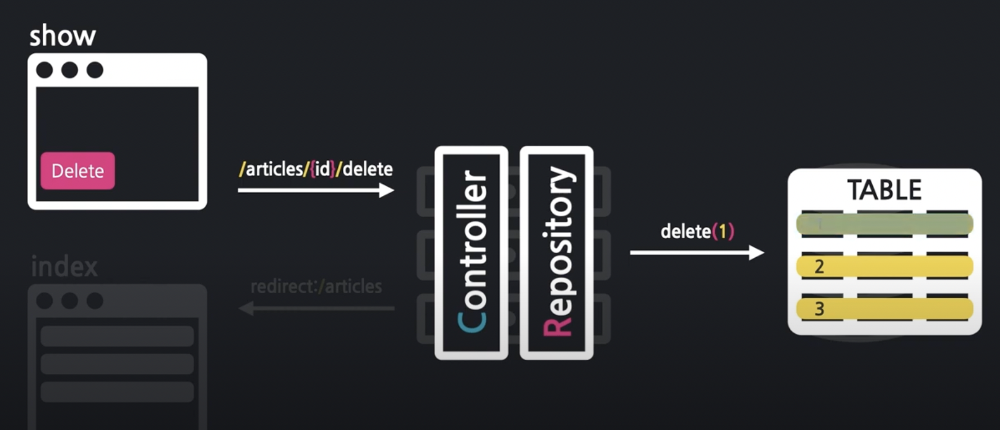  

../controller/ArticleController
```java
...
@Controller
@Slf4j
public class ArticleController {
    ...
    @GetMapping("/articles/{id}/delete")
    public String delete(@PathVariable Long id) {
        log.info("삭제 요청이 들어왔습니다!!");
        // 1: 삭제 대상을 가져옴
        Article target = articleRepository.findById(id).orElse(null);
        log.info(target.toString());
        // 2: 대상을 삭제
        if (target != null) {
            articleRepository.delete(target);
        }
        // 3: 결과 페이지로 리다이렉트
        return "redirect:/articles";
    }
}
```  

<br/>  

삭제 완료 메시지를 만들어 본다. ( RedirectAttributes, addFlashAttribute )  


../controller/ArticleController
```java
...
@Controller
@Slf4j
public class ArticleController {
    ...
    @GetMapping("/articles/{id}/delete")
    public String delete(@PathVariable Long id,
                         RedirectAttributes rttr) {
        log.info("삭제 요청이 들어왔습니다!!");
        // 1: 삭제 대상을 가져옴
        Article target = articleRepository.findById(id).orElse(null);
        log.info(target.toString());
        // 2: 대상을 삭제
        if (target != null) {
            articleRepository.delete(target);
            rttr.addFlashAttribute("msg", "삭제가 완료되었습니다.");
        }
        // 3: 결과 페이지로 리다이렉트
        return "redirect:/articles";
    }
}
```  

index.mustach 상단에 아래 처럼 alert 로직을 추가한다.  

../layouts/index.mustache
```html
<!-- alert msg -->
{{#msg}}
<div class="alert alert-primary alert-dismissible">
  {{msg}}
  <button type="button" class="btn-close" data-bs-dismiss="alert" aria-label="Close"></button>
</div>
{{/msg}}
```  

재기동을 하면 3개의 데이터가 있고 하나를 지워보면 아래과 같이 메시지가 나온다.  

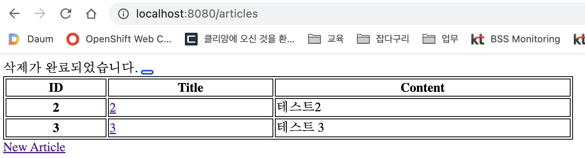  


<br/>

###  CRUD 와 SQL Query

<br/>

JPA 로깅을 설정하고 DB Query를 확인 한다.  

JPA 로깅 설정을 하기 위해서는 application.properties 화일에 아래 내용을 추가한다.  

```bash
../resources/application.properties
#  JPA 로깅 설정

## 디버그 레벨로 쿼리 출력
logging.level.org.hibernate.SQL=DEBUG
## 이쁘게 보여주기
spring.jpa.properties.hibernate.format_sql=true
## 파라미터 보여주기
logging.level.org.hibernate.type.descriptor.sql.BasicBinder=TRACE
## 고정 H2 DB url 설정
spring.datasource.url=jdbc:h2:mem:testdb
```  

재기동을 하면 SQL이 보이는 것을 확인 할 수 있다.  

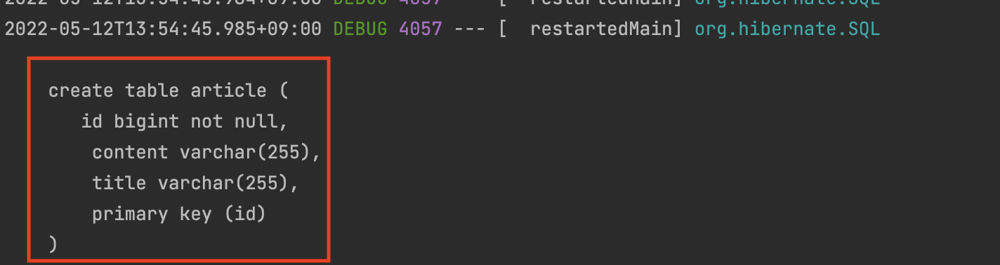  

id를 자동으로 생성하게 설정한다.  
Article DB에서는 id가 primary key 이다.  

../entity/Article
```java
@Getter
public class Article {
    @Id
    @GeneratedValue(strategy = GenerationType.IDENTITY) // DB가 id를 자동 생성 Annotation 
    private Long id;
```  

재기동을 하고 웹 브라우저에서 http://localhost:8080/articles 를 입력하고
기존의 3개의 데이터를 삭제한 후에 신규 데이터를 입력한다.  

아래와 같이 ID가 새로 생성된것을 확인 할 수 있다.  

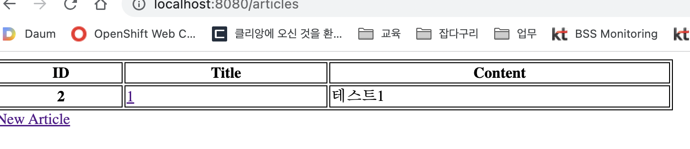  


인텔리제이 콘솔에 가면 아래와 같이 SQL Query를 확인 할 수 있다.  

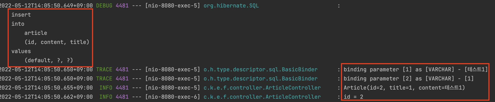  