#  Spring JDBC ( MyBatis) Hands-on 
 
MyBatis 활용 방법에 대해서 실습한다.  


1. 프로젝트 생성 및 환경 설정

2. 프로젝트 구성하기 

3. 실행해보기

4. SQL문 로그 보기

5. Swagger 설정

6. 소스위치 : https://github.com/shclub/edu10

7. 로그 변경 및 swagger 변경

8. 소스위치 : https://github.com/shclub/edu10-1

9. Springbean을 등록하는 2가지 방식

<br/>

## MyBatis 실습

<br/>

### MyBatis ? 

<br/>

개발자가 지정한 SQL, 저장 프로시저 그리고 몇 가지 고급 매핑을 지원하는 SQL Mapper이다.  

- JDBC로 처리하는 상당 부분의 코드와 파라미터 설정 및 결과 매핑을 대신해준다.
    - 기존에 JDBC를 사용할 때는 DB와 관련된 여러 복잡한 설정(Connection)들을 다루어야 했지만 SQL Mapper는 자바 객체를 실제 SQL문에 연결함으로써, 빠른 개발과 편리한 테스트 환경을 제공한다.  

  
- 데이터베이스 record에 원시 타입과 Map 인터페이스 그리고 자바 POJO를 설정해서 매핑하기 위해 xml과 Annotation을 사용할 수 있다.  

- MyBatis는 원래 Apache Foundation의 iBatis였으나, 생산성, 개발 프로세스, 커뮤니티 등의 이유로 Google Code로 이전되면서 이름이 바뀌었다.


<br/>

### Mapper ? 

<br/>

Mybatis는 Mapper 인터페이스를 제공한다.  

DAO 대신 mapper를 사용하면 DAO를 만들지 않고 interface만을 이용해서 간편히 개발할 수 있다.  

mybatis는 java code와 sql문을 분리하여 편리하게 관리하도록 한다.  

SQL문은 *.xml 형식으로 저장한다.  

DB에 질의할 쿼리문을 관리하는 Mapper파일에 요청한다.  

<br/>

### 프로젝트 생성 및 환경 설정   

<br/>

웹브라우저에서 https://start.spring.io/ 접속하여 아래와 같이 라이브러리를 추가하여 신규 프로젝트를 생성한다.  

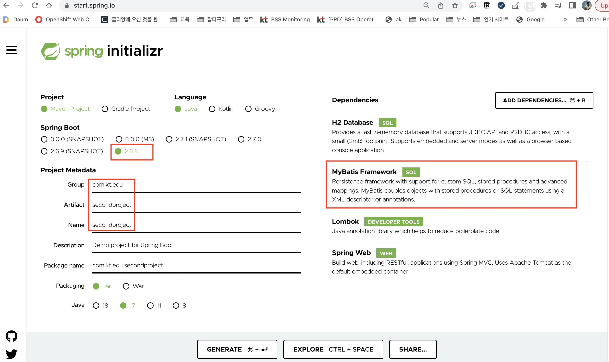 

<br/>

secondproject.zip으로 다운 받은 화일의 압축을 풀고   
IntelliJ 메뉴 File > New > Project from Existing Sources 으로 이동하여 프로젝트를 선택하여 오픈 한다.    

 

<br/>

사내 환경에 맞추기 위하여 pom.xml 을 오픈한 후  springboot 버전을  2.6.3 으로 변경 한다.  

<br/>

초기 서버 기동시 DB 데이트를 생성하기 위해서 resources 폴더 밑에 schema.sql 과 data.sql 화일을 생성한다.  

테이블 생성 schema.sql  

```sql  
create sequence hibernate_sequence;

create table article
(
    id              long    not null,
    title         	varchar(255),
    content         varchar(255)
);

alter table article add constraint article_pk primary key (id);  
```  


데이터 생성 data.sql  

```sql  
INSERT INTO article(id, title, content) VALUES(1, '1', '테스트 1');
INSERT INTO article(id, title, content) VALUES(2, '2', '테스트2');
INSERT INTO article(id, title, content) VALUES(3, '3', '테스트 3');
```  

<br/>

application.properties 화일에 DB 연결 설정 및 mybatis 설정을 한다.  

../resources/application.properties  

```bash  
# h2 DB
spring.h2.console.enabled=true
spring.h2.console.path=/h2-console
spring.datasource.generate-unique-name=false

# log configuration path
#logging.config=classpath:log4j2.xml
logging.config=classpath:logback-spring-dev.xml

# for inserting data.sql
#spring.jpa.defer-datasource-initialization=true

# Default Profile
spring.profiles.active=dev

spring.main.allow-bean-definition-overriding=true

# Database Platform : DB 생성 및 초기화 여부
spring.sql.init.platform=h2
spring.sql.init.mode=embedded
spring.datasource.driver-class-name=org.h2.Driver
spring.datasource.url=jdbc:h2:mem:testdb
spring.datasource.username=sa
spring.datasource.password=

# log4jdbc
#spring.datasource.driver-class-name=net.sf.log4jdbc.sql.jdbcapi.DriverSpy
#spring.datasource.url=jdbc:log4jdbc:h2:mem:testdb


# model/domain package
mybatis.type-aliases-package= com.kt.edu
mybatis.mapper-locations= mapper/*.xml
mybatis.config-location= classpath:mybatis-config.xml

```

<br/>

이제 mybatis-config.xml 화일을 생성한다.   

mybatis-config.xml 화일은  Mybatis에 별도의 설정들을 정의 합니다.  

sql문의 리턴타입을 DTO로 사용할 경우 태그를 사용하면  풀 패키지명 없이  간단하게 리턴 타입을  사용할 수 있습니다.  
- typeAlias는 DTO 이름을 간단하게 사용하기 위해 Alias 를 설정.  

../resources/mybatis-config.xml
```xml
<?xml version="1.0" encoding="UTF-8"?>
<!DOCTYPE configuration PUBLIC "-//mybatis.org//DTD config 3.0//EN"
        "http://mybatis.org/dtd/mybatis-3-config.dtd">

<configuration>

    <settings>
        <!-- Logger 설정 -->
        <setting name="logImpl" value="SLF4J" />

        <!-- Mybatis 캐시는 사용하지 않음 (서비스 영역에서 사용) -->
        <setting name="cacheEnabled" value="false" />

        <!-- Prepared Statement 를 재사용 -->
        <setting name="defaultExecutorType" value="REUSE" />

        <!-- Multiple Result-set 설정(허용하지 않음). 허용이 꼭 필요한 경우 true 로 변경 -->
        <setting name="multipleResultSetsEnabled" value="false" />

        <!-- 필드와 프로퍼티간 자동 매핑
         Partial: nested result mapping 은 지원하지 않음. 단일 테이블에 대해서 지원
        -->
        <setting name="autoMappingBehavior" value="PARTIAL" />

        <!-- Table: ABC_DEF -> Vo: abcDef 로 매핑  -->
        <setting name="mapUnderscoreToCamelCase" value="false" />

        <!-- Lazy Loading 여부 -->
        <setting name="aggressiveLazyLoading" value="false" />

        <!-- Null Parameter 처리 -->
        <setting name="jdbcTypeForNull" value="NULL" />

    </settings>

    <typeAliases>

        <!-- Article -->
        <typeAlias alias="Article" type="com.kt.edu.secondproject.domain.Article"/>

    </typeAliases>

</configuration>
```  

<br/>

로그 정보의 세밀한 컨트롤을 위해 logback-spring-dev.xml 화일을 생성한다.  

dev 환경에서와 운영환경에서는 설정이 다를수가 있어 향후 profile로 관리한다.  

```xml
<?xml version="1.0" encoding="UTF-8"?>
<configuration>

    <jmxConfigurator/>
    <include resource="org/springframework/boot/logging/logback/defaults.xml"/>
    <include resource="org/springframework/boot/logging/logback/console-appender.xml"/>
    <statusListener class="ch.qos.logback.core.status.NopStatusListener" />

    <!-- STDOUT appender -->
    <appender name="STDOUT" class="ch.qos.logback.core.ConsoleAppender">
        <layout class="ch.qos.logback.classic.PatternLayout">
            <Pattern>
                %d{yyyy-MM-dd HH:mm:ss} [%thread] %-5level %50.50C (%file:%line\) - %msg%n
            </Pattern>
        </layout>
    </appender>

    <!-- application Logger -->
    <logger name="com.kt.edu" level="DEBUG" additivity="false">
        <appender-ref ref="STDOUT"/>
    </logger>

    <!-- springframework Loggers -->
    <logger name="org.springframework.core" level="ERROR" additivity="false" >
        <appender-ref ref="STDOUT" />
    </logger>

    <logger name="org.springframework.beans" level="ERROR" additivity="false" >
        <appender-ref ref="STDOUT" />
    </logger>

    <logger name="org.springframework.context" level="ERROR" additivity="false" >
        <appender-ref ref="STDOUT" />
    </logger>

    <logger name="org.springframework.web" level="ERROR" additivity="false" >
        <appender-ref ref="STDOUT" />
    </logger>

    <logger name="org.springframework.tx" level="ERROR" additivity="false" >
        <appender-ref ref="STDOUT" />
    </logger>

    <logger name="org.springframework.jdbc" level="ERROR" additivity="false">
        <appender-ref ref="STDOUT" />
    </logger>

    <!-- jdbc loggers -->
    <logger name="jdbc.sqltiming" level="INFO" additivity="false">
        <appender-ref ref="STDOUT" />
    </logger>

    <logger name="jdbc.sqlonly" level="ERROR"  additivity="false">
        <appender-ref ref="STDOUT" />
    </logger>

    <logger name="jdbc.resultsettable" level="INFO" additivity="false">
        <appender-ref ref="STDOUT" />
    </logger>

    <logger name="org.apache.ibatis" level="ERROR" additivity="false">
        <appender-ref ref="STDOUT" />
    </logger>

    <logger name="net.sf.log4jdbc.log.slf4j" level="ERROR" additivity="false">
        <appender-ref ref="STDOUT" />
    </logger>

    <!-- connection pool -->
    <logger name="com.zaxxer.hikari" level="INFO" additivity="false">
        <appender-ref ref="STDOUT"/>
    </logger>

    <!-- root -->
    <root level="ERROR">
        <appender-ref ref="STDOUT" />
    </root>

</configuration>
```  

<br/>

### 프로젝트 구성하기     

<br/>

프로젝트 이름에서 마우스 오른쪽을 클릭하고  New -> Package를 선택하여 4개의 package를 만들고 resources 폴더에는 mapper 디렉토리를 생성합니다.  

- domain
- controller
- repository
- service
- resources/mapper


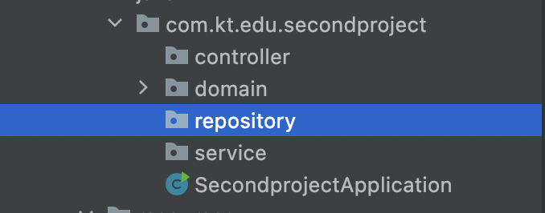 

<br/>

controller 패키지에 ArticleController 를 RestController 로 생성합니다.  

../controller/ArticleController.java  
```java
package com.kt.edu.secondproject.controller;


import com.kt.edu.secondproject.domain.Article;
import com.kt.edu.secondproject.service.ArticleService;
import org.springframework.beans.factory.annotation.Autowired;
import org.springframework.web.bind.annotation.*;

import java.util.List;

@RestController
@RequestMapping("/articles")
public class ArticleController {

    @Autowired
    private final ArticleService articleService;

    public ArticleController(ArticleService articleService) {
        this.articleService = articleService;
    }

    @GetMapping
    public List<Article> findAll() {
        return this.articleService.findAll();
    }

    @GetMapping("/{id}")
    public Article findById(@PathVariable Long id) {
        return this.articleService.findById(id);
    }

   /* @GetMapping("/active")
    public List<Article> findAllActive() {
        return this.articleService.findAllActive();
    }

    @GetMapping("/inactive")
    public List<Article> findAllInactive() {
        return this.articleService.findAllInactive();
    }*/

    @PostMapping
    public Article create(@RequestBody Article article) {
        return this.articleService.create(article);
    }

    /*@DeleteMapping("/{id}")
    public void delete(@PathVariable Long id) {
        this.articleService.delete(id);
    }*/
}
```

<br/>

domain 패키지에 Article DTO 를 생성한다.  

../domain/Article.java
```java
package com.kt.edu.secondproject.domain;

import lombok.*;

@Data
@Builder
@AllArgsConstructor
@NoArgsConstructor
public class Article {
    private Long id;
    private String title;
    private String content;
}
```
 
<br/>

repository 패키지에 ArticleMapper Interface 를 생성한다.    

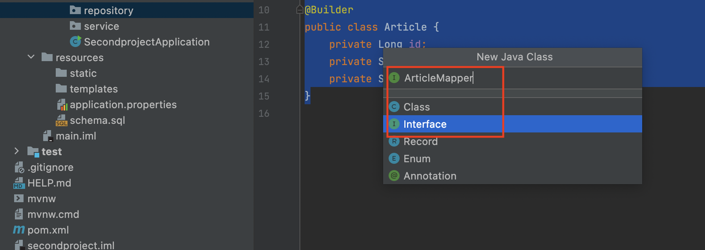

<br/>

../repository/ArticleMapper.java

```java
package com.kt.edu.secondproject.repository;

import com.kt.edu.secondproject.domain.Article;
import org.apache.ibatis.annotations.Mapper;
import org.springframework.context.annotation.Configuration;

import java.util.List;
import java.util.Optional;

@Mapper
public interface ArticleMapper {

    public long getId();
    public long insert(Article article);
    public long update(Article article);
    public Optional<Article> findById(Long id);

    //@Select("SELECT * FROM article")
    public List<Article> findAll();

}
```  

<br/>

service 패키지에 ArticleService class 를 생성한다.  

<br/>

../service/ArticleService.java  
```java
package com.kt.edu.secondproject.service;

import com.kt.edu.secondproject.domain.Article;
import com.kt.edu.secondproject.repository.ArticleMapper;
import lombok.extern.slf4j.Slf4j;
import org.springframework.beans.factory.annotation.Autowired;
import org.springframework.stereotype.Service;
import org.springframework.transaction.annotation.Transactional;

import java.util.List;
import java.util.stream.Collectors;

@Service
@Transactional
@Slf4j
public class ArticleService {

    @Autowired
    private  ArticleMapper articleMapper;

    public Article create(Article article) {
        log.info("Request to create Article : " +  article);
        articleMapper.insert(article);
        return article;
    }

    public List<Article> findAll() {
        log.info("Request to get all Articles");
        //return this.articleMapper.findAll();
        return articleMapper.findAll()
         .stream()
         .collect(Collectors.toList());
    }

    @Transactional(readOnly = true)
    public Article findById(Long id) {
        log.debug("Request to get Article : {}", id);
        return articleMapper.findById(id).get();
    }

    /*
    public List<Article> findAllActive() {
        log.debug("Request to get all Articles");
        return this.articleMapper.findAllByEnabled(true);
    }

    public List<Article> findAllInactive() {
        log.debug("Request to get all Articles");
        return this.articleMapper.findAllByEnabled(false);
    }*/

    /*public void delete(Long id) {
        log.debug("Request to delete article : {}", id);

        Article article = this.articleMapper.findById(id)
                .orElseThrow(() -> new IllegalStateException("Cannot find Article with id " + id));

        article.setEnabled(false);
        this.articleMapper.update(article);
    }*/
}
```

<br/>

resources 폴더에 mapper 디렉토리를 생성하고 ArticleMapper xml 화일을 생성한다.   

<br/>

../resources/mapper/ArticleMapper.xml    

```xml
<?xml version="1.0" encoding="UTF-8"?>

<!DOCTYPE mapper PUBLIC "-//mybatis.org//DTD Mapper 3.0//EN"
        "http://mybatis.org/dtd/mybatis-3-mapper.dtd">

<mapper namespace="com.kt.edu.secondproject.repository.ArticleMapper">
    <select id="getId" resultType="long">
        select hibernate_sequence.nextval from dual
    </select>

    <insert id="insert" parameterType="Article">
        <selectKey keyProperty="id" resultType="long" order="BEFORE">
            select hibernate_sequence.nextval from dual
        </selectKey>
        insert into article
        (id, title, content)
        values
        (#{id}, #{title}, #{content})
    </insert>


    <update id="update" parameterType="Article">
        update article set
            title = #{title}
                           , content = #{content}
        where id = #{id}
    </update>

    <select id="findById" parameterType="long" resultType="Article">
        select
            id
             , title
             , content
        from article
        where id = #{id}
    </select>

    <select id="findAll" resultType="Article">
        select
            id
             , title
             , content
        from article
    </select>

</mapper>
```  

<br/> 

전체 폴더 구성은 아래와 같습니다.   

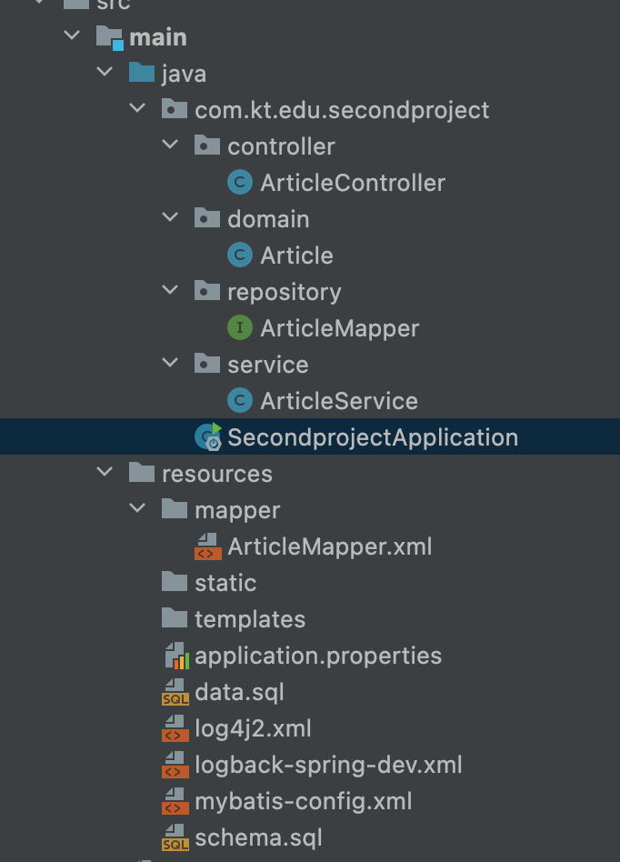

<br/>

### 실행하기     

<br/>

Main 함수가 있는 class를 마우스 오른쪽 버튼을 클릭하고 Run 메뉴를 선택하여 실행한다.  

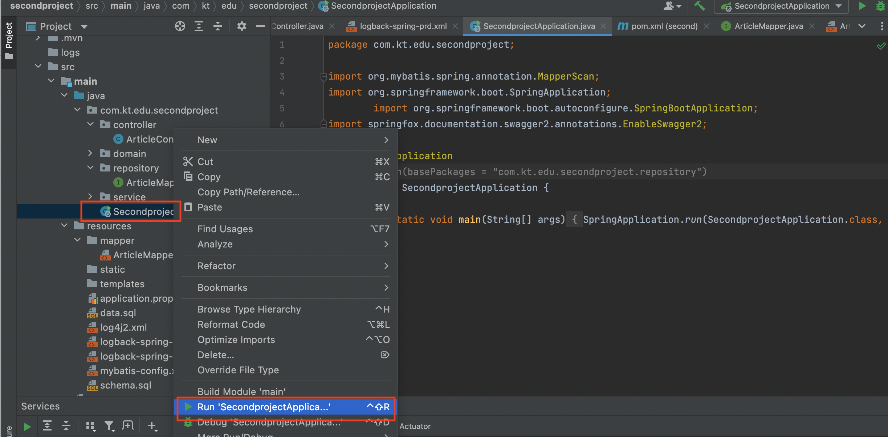  

<br/>

에러가 발생하지 않으면 웹 브라우저에서 http://localhost:8080/articles 를 입력하여 데이터를 조회합니다.  

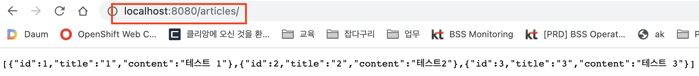  

<br/>

json 형태로 데이터가 나오는 것을 확인 할 수 있습니다.  

http://localhost:8080/articles/1 호출하여 단건 데이터를 확인 합니다.  


<br/>

Talend API Tester로 설정값을 입력해 봅니다.    
- Method : post
- URL : http://localhost:8080/articles/
- header : JSON
- BODY : 
    ```json
    {
        "id" : 4,
        "title": "mybatis 4",
        "content" : "4번 test 합니다."
    }
    ```  

위와 같이 설정하고 send 버튼을 4번 누르면 데이터가 정상으로 입력이 됩니다.  
- pk 오류가 발생하고 sequence 가 4까지 증가하면 에러 발생 안함.  

성공하면 아래와 같은 화면을 볼 수 있습니다.  

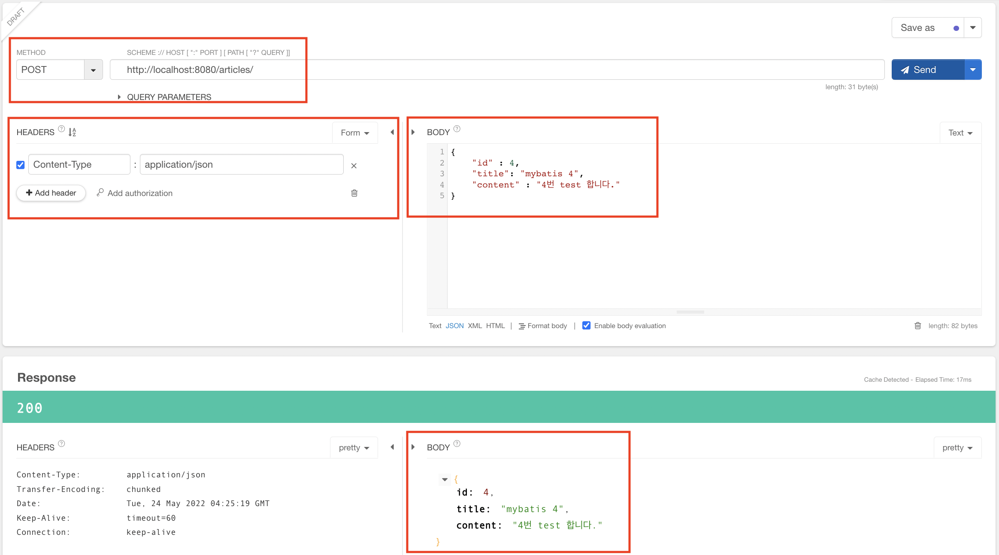  

<br/> 

웹브라우저에서 DB를 접속해서 데이터를 확인 합니다.  

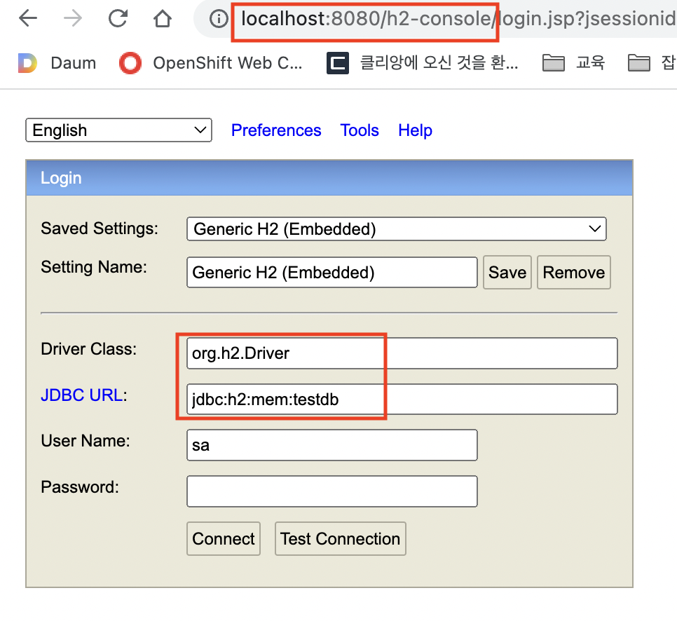

Article 테이블을 조회 하여 데이터를 확인 합니다.  

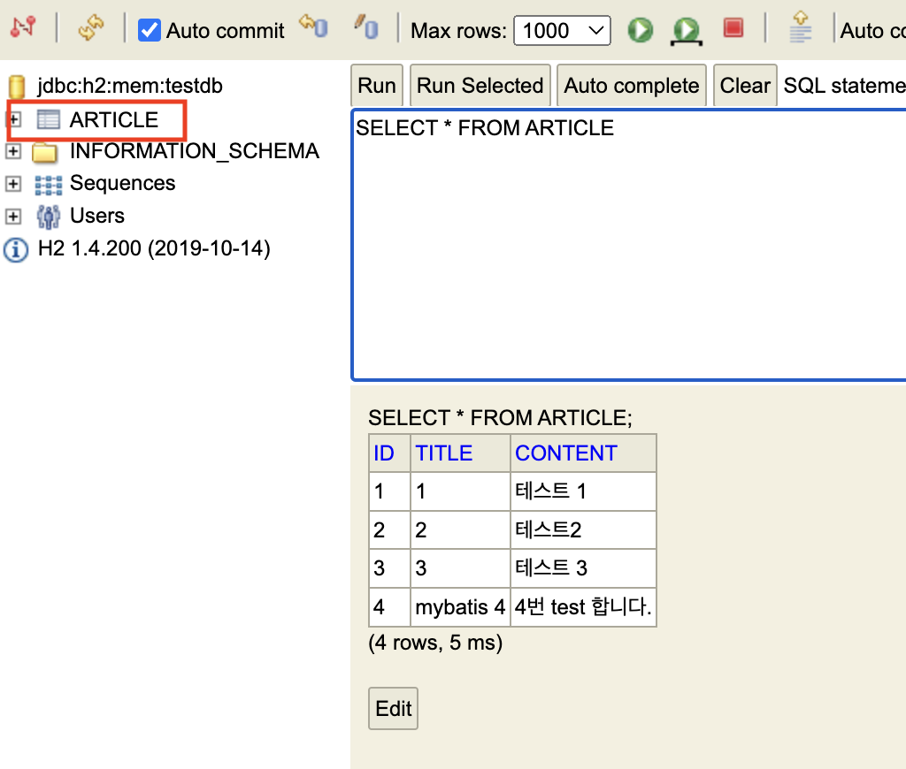

<br/>

### SQL문 로그 보기     

<br/>

이번 에는 log4jdbc를 사용하여 쿼리를 log로 찍어보도록 하겠습니다.  

먼저 pom.xml 화일에 log4jdbc를 dependency로 추가한다.

```xml
<!-- MyBatis sql pretty -->
		<dependency>
			<groupId>org.bgee.log4jdbc-log4j2</groupId>
			<artifactId>log4jdbc-log4j2-jdbc4.1</artifactId>
			<version>1.16</version>
		</dependency>
```  


resources 폴더 아래에 log4jdbc.log4j2.properties 화일을 생성합니다.  


<br/>

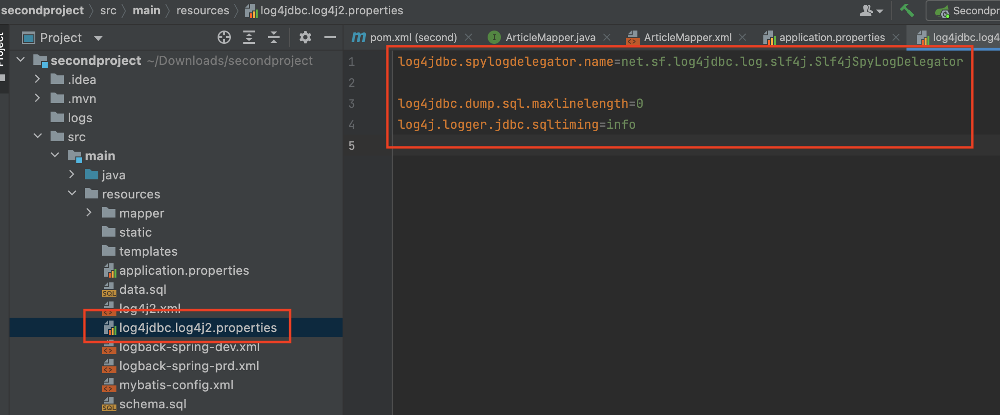   

<br/>

화일에 아래 내용을 추가합니다.  

```
log4jdbc.spylogdelegator.name=net.sf.log4jdbc.log.slf4j.Slf4jSpyLogDelegator

log4jdbc.dump.sql.maxlinelength=0
log4j.logger.jdbc.sqltiming=info
```

<br>

application.properties 에서 DB 설정 정보를 수정합니다.  

기존 연결 설정은 주석 처리 하고 새로 Driver, Url 부분은 변경하여 줍니다.  

```  
#spring.datasource.driver-class-name=org.h2.Driver
#spring.datasource.url=jdbc:h2:mem:testdb

# log4jdbc
spring.datasource.driver-class-name=net.sf.log4jdbc.sql.jdbcapi.DriverSpy
spring.datasource.url=jdbc:log4jdbc:h2:mem:testdb
```  

<br/>

springboot 를 재기동 하면 IntelliJ Console 에서 
schema.sql , data.sql 화일의 Query가 동작 하는 것을 불 수 있습니다.    

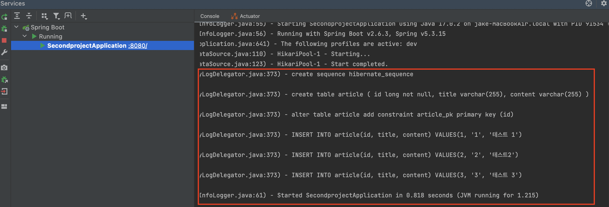   

<br/>

log4jdbc는 SQL문에서부터 Connect정보, JDBC호출 정보, SQL 결과를 Table로 표현 하는 등의 옵션을 제공한다. 이에 대해 간단히 설명하고, 설정하는 방법을  살펴봅니다.  

- jdbc.sqlonly  
    SQL문만을 로그로 남기며, PreparedStatement일 경우 관련된 argument 값으로 대체된 SQL문이 보여진다.  

- jdbc.sqltiming  
    SQL문과 해당 SQL을 실행시키는데 수행된 시간 정보(milliseconds)를 포함한다.  
      
- jdbc.audit  
    ResultSet을 제외한 모든 JDBC 호출 정보를 로그로 남긴다. 많은 양의 로그가 생성되므로 특별히 JDBC 문제를 추적해야 할 필요가 있는 경우를 제외하고는 사용을 권장하지 않는다.  
      
- jdbc.resultset
    ResultSet을 포함한 모든 JDBC 호출 정보를 로그로 남기므로 매우 방대한 양의 로그가 생성된다.  
      
- jdbc.resultsettable
    SQL 결과 조회된 데이터의 table을 로그로 남긴다.

<br/>

해당 프로젝트에는 logback-spring-dev.xml 화일에 아래와 같이 설정하였습니다.

```xml
...
<!-- jdbc loggers -->
<!-- SQL문과 해당 SQL을 실행시키는데 수행된 시간 정보(milliseconds)를 포함한다. -->
    <logger name="jdbc.sqltiming" level="INFO" additivity="false">
        <appender-ref ref="STDOUT" />
    </logger>

<!-- SQL문만을 로그로 남기며, PreparedStatement일 경우 관련된 argument 값으로 대체된 SQL문이 보여진다. -->
    <logger name="jdbc.sqlonly" level="ERROR"  additivity="false">
        <appender-ref ref="STDOUT" />
    </logger>

<!-- SQL 결과 조회된 데이터의 table을 로그로 남긴다. -->
    <logger name="jdbc.resultsettable" level="INFO" additivity="false">
        <appender-ref ref="STDOUT" />
    </logger>
```  

<br/>

웹 브라우저에서 http://localhost:8080/h2-console 를 입력하고 DB 접속을 해 봅니다.  

- Driver Class : net.sf.log4jdbc.sql.jdbcapi.DriverSpy
- JDBC URL : jdbc:log4jdbc:h2:mem:testdb  


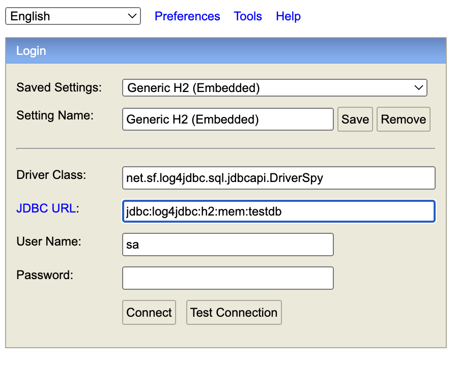

<br/>

정상적으로 접속이되면 ARTICLE 테이블을 선택을 하고 데이터를 조회해 봅니다.  

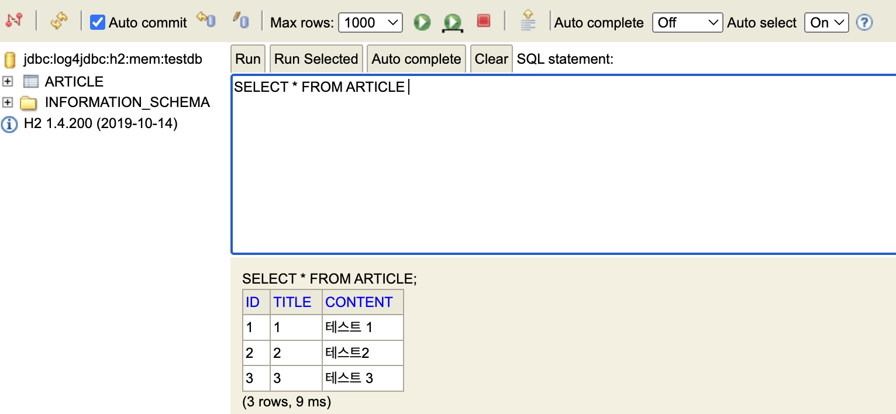

<br/>

IntelliJ Console 에서 조회한 로그를 볼수 있습니다.  

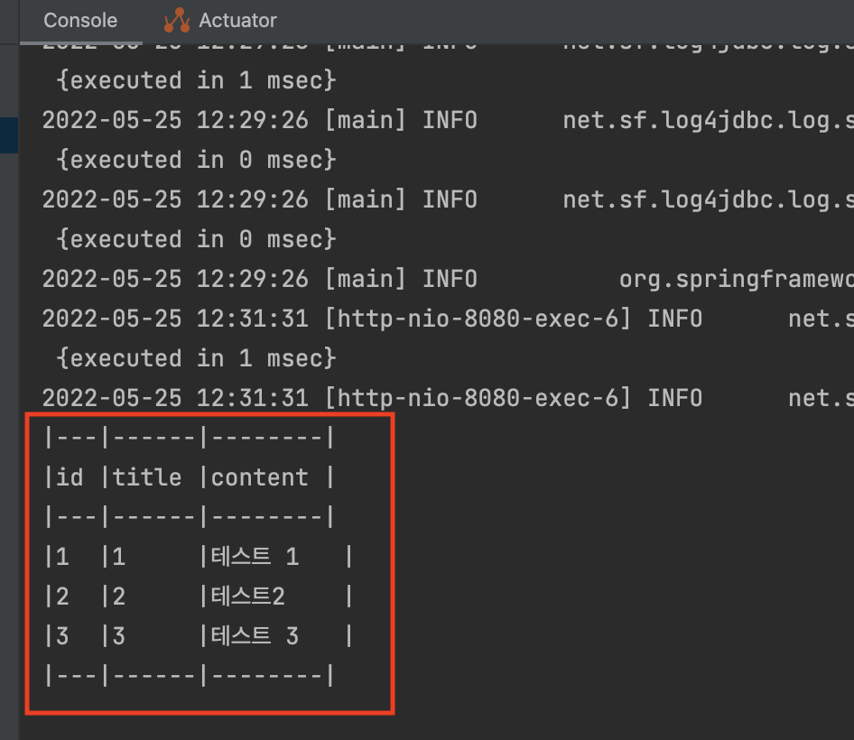

<br/>
Talend API 로  http://localhost:8080/articles 를 호출해 보면  
아래와 같이 sql 문과 resultset 이 나옵니다.     

<br/>

sqltiming과 resultsettable의 레벨을 info로 설정한 결과입니다.  
SQL, 수행시간, Table을 확인 할 수 있습니다.  

<br/>

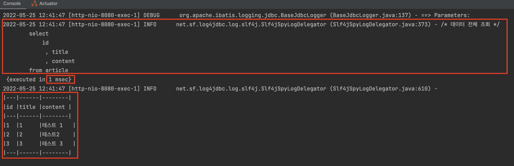

<br/>

위의 SQL 형식은  ArticleMapper.xml  파일에 있는 형식과 동일하게 출력됩니다.  

```xml
    <select id="findAll" resultType="Article">

      /* 데이터 전체 조회 */
        select
            id
             , title
             , content
        from article
    </select>
```

<br/>

### Swagger 설정     

<br/>

Rest Api 문서화를 위한 Spring Boot Swagger 3 를 설정합니다.  

먼저 pom.xml 화일에 swagger dependency로 추가한다.

```xml
		<!-- swagger 3 -->
		<dependency>
			<groupId>io.springfox</groupId>
			<artifactId>springfox-boot-starter</artifactId>
			<version>3.0.0</version>
		</dependency>
		<dependency>
			<groupId>io.springfox</groupId>
			<artifactId>springfox-swagger-ui</artifactId>
			<version>3.0.0</version>
		</dependency>
```  

<br/>

config 설정을 위하여 project 상단 폴더 밑에 SwaggerConfig class를 생성합니다.  

basepackage는 com.kt.edu 로 설정합니다.  

<br/> 

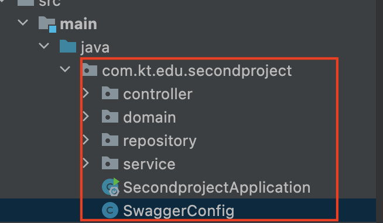

<br/>

../SwaggerConfig.java   
```java
package com.kt.edu.secondproject;

import org.springframework.context.annotation.Bean;
import org.springframework.context.annotation.Configuration;
import org.springframework.web.servlet.config.annotation.EnableWebMvc;
import springfox.documentation.builders.ApiInfoBuilder;
import springfox.documentation.builders.PathSelectors;
import springfox.documentation.builders.RequestHandlerSelectors;
import springfox.documentation.service.ApiInfo;
import springfox.documentation.spi.DocumentationType;
import springfox.documentation.spring.web.plugins.Docket;

@Configuration
@EnableWebMvc
public class SwaggerConfig {

    @Bean
    public Docket swaggerAPI(){
        //Docket : swagger Bean
        return new Docket(DocumentationType.OAS_30)
                .useDefaultResponseMessages(true) //기본 응답 메시지 표시 여부
                .select()
                .apis(RequestHandlerSelectors.basePackage("com.kt.edu")) //swagger탐색 대상 패키지
                .paths(PathSelectors.any())
                .build()
                .apiInfo(apiInfo());
    }

    private ApiInfo apiInfo() {
        return new ApiInfoBuilder()
                .title("kt Caravan Swagger")
                .description("Education swagger")
                .version("1.0")
                .build();
    }

}
```  


<br/>

springboot를 기동하고 웹브라우저에서 http://localhost:8080/swagger-ui/index.html 로 접속을 합니다.  

article-controller 를 확장하면 rest api 목록을 볼 수 있습니다.  

<br/> 

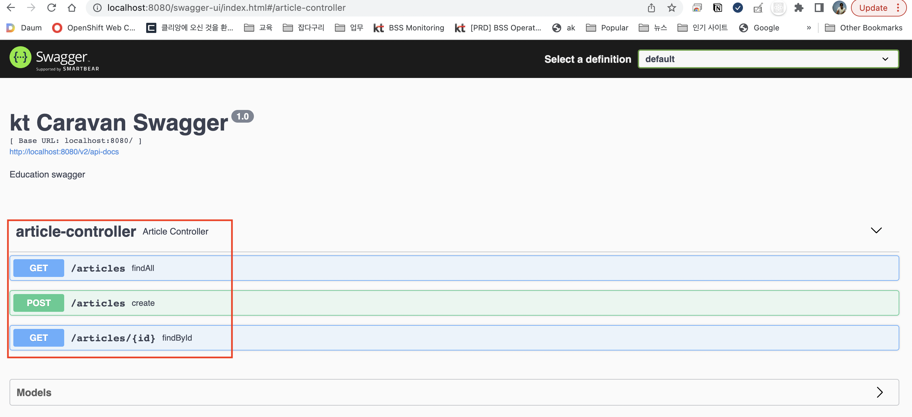

<br/>  

테스트를 하기 위해 articles API 를 선택하고 try it out 버튼을 클릭합니다.    

<br/>

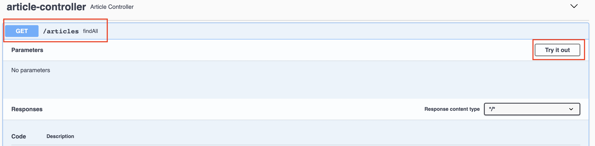

<br/>

Execute 버튼을 클릭하면 API 호출이 되고 Resonse 값을 JSON으로 받을 수 있습니다.  
    
<br/>

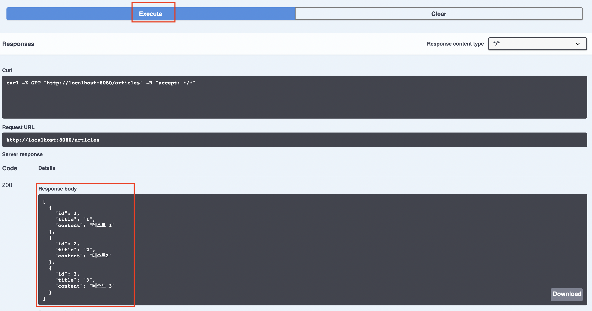

<br/>

swagger 2.0과 3.0의 차이  

- config  
    @EnableSwagger2 : swagger 2.0 버전   
    @EnableWebMvc : swagger 3.0 버전  

- url  
    2.X.X  :  http://localhost:8080/swagger-ui.html  
    3.X.X  :  http://localhost:8080/swagger-ui/index.html    


### 로그 변경 및 swagger 변경    

<br/>

로그 관리를 logback 에서 log4j2로 변경 한다.  

pom 화일을 변경하지 않고 log4j2를 설정하면 Multi Bind 오류가 발생하기 때문에 아래와 같이 기존 log를 exclusion tag를 사용하여 제외하고  log4j2 라이브러리를 추가한다.    

swagger는 springfox 에서 openapi 로 변경한다.  

최근에는 springfox 보다 openapi를 많이 사용하는 추세.

    
pom.xml
```xml
...
<dependency>
			<groupId>org.springframework.boot</groupId>
			<artifactId>spring-boot-starter-web</artifactId>
            <!-- 기존 logback 제외 -->
			<exclusions>
				<exclusion>
					<groupId>org.springframework.boot</groupId>
					<artifactId>spring-boot-starter-logging</artifactId>
				</exclusion>
			</exclusions>
		</dependency>

		<!-- spring log4j2 -->
		<dependency>
			<groupId>org.springframework.boot</groupId>
			<artifactId>spring-boot-starter-log4j2</artifactId>
		</dependency>

        <!-- swagger 3 -->
		<!--dependency>
			<groupId>io.springfox</groupId>
			<artifactId>springfox-boot-starter</artifactId>
			<version>3.0.0</version>
		</dependency>
		<dependency>
			<groupId>io.springfox</groupId>
			<artifactId>springfox-swagger-ui</artifactId>
			<version>3.0.0</version>
		</dependency-->

		<!-- Open API 3 -->
		<dependency>
			<groupId>org.springdoc</groupId>
			<artifactId>springdoc-openapi-ui</artifactId>
			<version>1.6.6</version>
		</dependency>
...
```  

<br/>

이번 부터는  application.properties 대신에 application.yml 화일을 사용한다.  

yml 화일에서는 indent를 주의해서 사용해야 한다.  


```yml 
server:
  tomcat:
    url-encoding: UTF-8
  servlet:
    context-path: /
spring:
  application:
    name: edu-MyBatis
  profiles:
    active: local
  banner: # banner 위치를 가르킨다
    location: "classpath:banner.txt"
# logging : log4j2.xml 위치를 가르킨다
logging:
  config: classpath:log4j2.xml
# actuator
management:
  endpoints:
    web:
      exposure:
        include: "*"
  endpoint:
    shutdown:
      enabled: true
    health:
      show-details: always

# app : openapi swagger 설정을 위한 설정
app-info:
  app-name: "edu-MyBatis"
  title: "Caravan Edu API"
  build:
    version: '@project.version@'
    timestamp: '@app.build.timestamp@'
  user-id: "jakelee"
  org-id: "my-home"
  desc: "EDU 관련 설명입니다."
  doc-url: "https://github.com/shclub/edu/"
  license: "Apache License"
  license_url: "https://github.com/shclub/edu/"
  version: "@app.build.timestamp@"
  doc-desc: "기타정보"
```

<br/>

폴더 구조는 다음과 같다.  

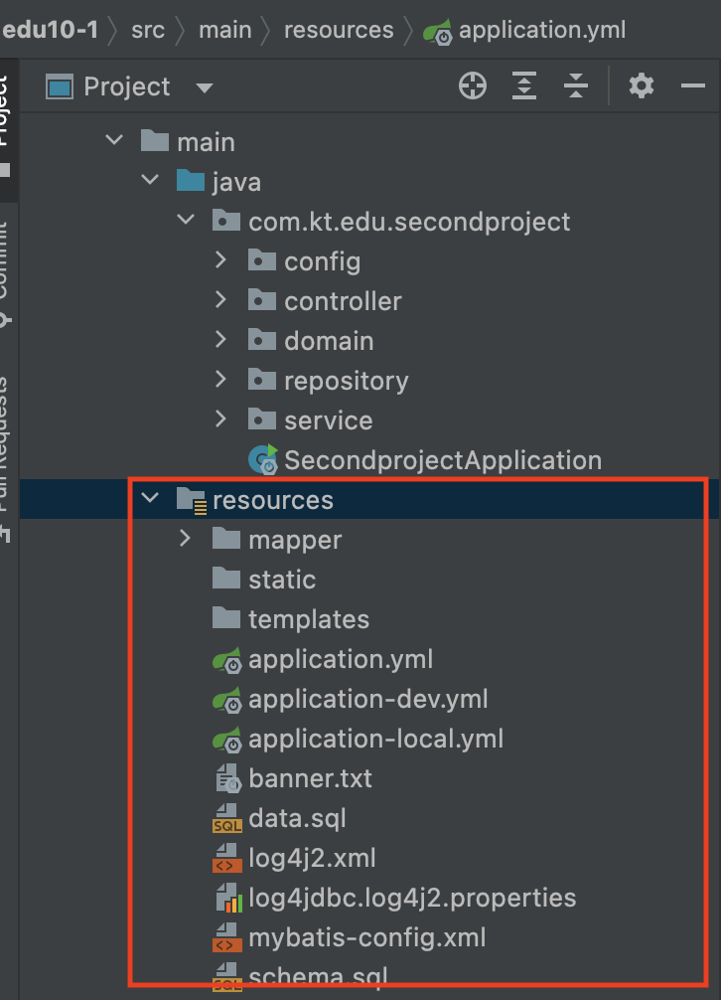  

<br/>

환경에 맞는 yml 화일이 구분이 되고 spring profile에 따라 환경이 다르다.  

- local PC 환경 : application-local.yml
- 개발 환경 : application-dev.yml  

<br/>

아래는 개발 환경에 대한 application-dev.yml 화일 내용이다.  
개발 환경의 서버 및 DB 정보 그리고 swagger를 설정한다.  

../application-dev.yml
```yml  
##############
### dev
##############
server:
  # embeded was 설정
  port: 8080
  servlet:
    context-path: /
  tomcat:
    connection-timeout: 5s
    max-connections: 1000
    accept-count: 20
    threads:
      max: 200
spring:
  h2:
    # h2 DB
    console:
      enabled: true
      path: /h2-console
  # Database Platform
  sql:
    init:
      platform: h2
      mode: embedded
  datasource:
    driverClassName: net.sf.log4jdbc.sql.jdbcapi.DriverSpy
    url: jdbc:log4jdbc:h2:mem:testdb 
    # TMAX Tibero 연동시
    #jdbc:log4jdbc:tibero:thin:@localhost:8640:POCICISORDDB
    username: sa
    password:
    # h2 DB
    generate-unique-name: false
    # DB Connection pool 을 설정한다.
    hikari:
      pool-name: hikari-cp
      maximum-pool-size: 30
      minimum-idle: 2
      data-source-properties:
        cachePrepStmts: true
        prepStmtCacheSize: 250
        prepStmtCacheSqlLimit: 2048
        useServerPrepStmts: true

# model/domain package
mybatis:
  type-aliases-package: com.kt.edu
  mapper-locations: mapper/*.xml
  config-location: classpath:mybatis-config.xml

# swagger ui 설정
springdoc:
  swagger-ui:
    operations-sorter: alpha
    tags-sorter: alpha
    disable-swagger-default-url: true
    doc-expansion: none

# 로그 레벨 설정
logging:
  level:
    com.kt.edu: trace
```

<br/> 

springboot 기동시 처음에 보이는 banner를 변경 할 수 있다.    
인터넷에서 text 만드는 방법이 많이 나와 있다.  
  
banner.txt
```bash
   _____                                                    ______   _____    _    _
  / ____|                                                  |  ____| |  __ \  | |  | |
 | |        __ _   _ __    __ _  __   __   __ _   _ __     | |__    | |  | | | |  | |
 | |       / _` | | '__|  / _` | \ \ / /  / _` | | '_ \    |  __|   | |  | | | |  | |
 | |____  | (_| | | |    | (_| |  \ V /  | (_| | | | | |   | |____  | |__| | | |__| |
  \_____|  \__,_| |_|     \__,_|   \_/    \__,_| |_| |_|   |______| |_____/   \____/

:: Spring Boot ${spring-boot.version} ::
```  

<br/>

log4j2.xml 에서 로그 세부 설정을 할 수 있다.  
아래 xml 화일은 console과 file 저장을 동시에 할 수 있는 예제이다.

최상위 에서 logs 폴더를 생성한다.

```xml
<?xml version="1.0" encoding="UTF-8"?>
<Configuration status="INFO">

    <Properties>
        <Property name="logFileName">edu10-1</Property>
        <!-- 디폴트 로깅시-->
        <Property name="consoleLayout">${logFileName} %d{HH:mm:ss.SSS} %-5level %c : - %enc{%msg}{CRLF} %n%throwable</Property>
        <!-- <Property name="consoleLayout">${logFileName} %style{%d{ISO8601}}{black} %highlight{%-5level }[%style{%t}{bright,blue}] %style{%C{1.}}{bright,yellow}: - %msg%n%throwable</Property> -->
        <!-- 로깅 마스킹 -->
        <Property name="fileLayout">${logFileName} %d{HH:mm:ss.SSS} %-5level %c : - %enc{%msg}{CRLF} %n</Property>
        <!-- <Property name="fileLayout">%d [%t] %-5level %c(%M:%L) - %spi%n</Property> -->
        <Property name="baseDir">logs</Property>

    </Properties>

    <Appenders>
        <Console name="console" target="SYSTEM_OUT">
            <PatternLayout pattern="${consoleLayout}" />
        </Console>
        <Async name="file" bufferSize="200">
            <AppenderRef ref="RollingAppender" />
        </Async>
        <!-- 화일로 로그를 저장하기 위한 설정 -->
        <RollingFile name="RollingAppender"
                     fileName="${baseDir}/edu.log"
                     filePattern="${baseDir}/edu-%d{yyyy-MM-DD-HH}-%02i.log.gz" append="true"
                     ignoreExceptions="false">
            <PatternLayout>
                <Pattern>${fileLayout}</Pattern>
            </PatternLayout>
            <Policies>
                <OnStartupTriggeringPolicy />
                <SizeBasedTriggeringPolicy size="40MB" />
                <TimeBasedTriggeringPolicy />
            </Policies>
            <DefaultRolloverStrategy>
                <Delete basePath="${baseDir}" maxDepth="2">
                    <IfFileName glob="*/edu-*.log.gz" />
                    <IfLastModified age="1d" />
                </Delete>
            </DefaultRolloverStrategy>
        </RollingFile>
    </Appenders>

    <Loggers>
        <!-- 스프링 프레임워크에서 찍는건 level을 info로 설정 -->
        <logger name="org.springframework" level="info" additivity="false" >
            <AppenderRef ref="console" />
            <AppenderRef ref="file" />
        </logger>
        <!-- rolling file에는 debug, console에는 info 분리하여 처리 가능하다. -->
        <logger name="com.kt.edu" additivity="false" >
            <AppenderRef ref="console" level="info" />
            <AppenderRef ref="file" level="debug"/>
        </logger>

        <logger name="org.springframework" level="warn" additivity="false" >
            <AppenderRef ref="console" level="info" />
        </logger>
        <logger name="jdbc.audit" level="warn" additivity="false" >
            <AppenderRef ref="console" level="info" />
        </logger>

        <!-- connection pool -->
        <logger name="com.zaxxer" level="INFO" additivity="false">
            <appender-ref ref="console"/>
            <appender-ref ref="file"/>
        </logger>
        <logger name="jdbc.connection" level="warn" additivity="false" >
            <AppenderRef ref="console" level="info" />
            <AppenderRef ref="file" level="info" />
        </logger>
        <logger name="org.apache.kafka" level="warn" additivity="false" >
            <AppenderRef ref="console" level="info" />
        </logger>

        <logger name="com.kt.edu" additivity="false" >
            <AppenderRef ref="console" level="info" />
            <AppenderRef ref="file" level="info" />
        </logger>

        <!--logger name="Slf4jSpyLogDelegator" additivity="false" >
            <AppenderRef ref="console" level="info" />
            <AppenderRef ref="file" level="info" />
        </logger-->

        <logger name="net.sf.log4jdbc.log.slf4j" level="info" additivity="false">
            <appender-ref ref="console" />
            <appender-ref ref="file" />
        </logger>

        <logger name="jdbc.sqlonly" additivity="false" >
            <AppenderRef ref="console" level="error" />
        </logger>

        <logger name="jdbc.sqltiming" additivity="false" >
            <AppenderRef ref="console" level="info" />
            <AppenderRef ref="file" level="info" />
        </logger>

        <logger name="jdbc.resultset" additivity="false" >
            <AppenderRef ref="console" level="error" />
        </logger>

        <logger name="jdbc.resultsettable" level="info" additivity="false" >
            <AppenderRef ref="console" level="info" />
            <AppenderRef ref="file" level="info" />
        </logger>

        <root level="info">
            <AppenderRef ref="console" />
            <AppenderRef ref="file" />
        </root>

    </Loggers>
</Configuration>
```  

<br/>

최상위 폴더에서 config 패키지를 생성을 하고 OpenApiConfig 클래스를 생성한다.  

../config/OpenApiConfig.java
```java
package com.kt.edu.secondproject.config;

import org.springdoc.core.GroupedOpenApi;
import org.springframework.beans.factory.annotation.Value;
import org.springframework.context.annotation.Bean;
import org.springframework.context.annotation.Configuration;
import org.springframework.context.annotation.Profile;
import io.swagger.v3.oas.models.ExternalDocumentation;
import io.swagger.v3.oas.models.OpenAPI;
import io.swagger.v3.oas.models.info.Info;
import io.swagger.v3.oas.models.info.License;

@Configuration
public class OpenApiConfig {

    // value annotation은 application.yml 의 값을 가져온다.
    @Value("${spring.application.name}")
    private String group;

    @Value("${app-info.title}")
    private String title;

    @Value("${app-info.desc}")
    private String desc;

    @Value("${app-info.build.version}")
    private String version;

    @Value("${app-info.license}")
    private String license;

    @Value("${app-info.license-url}")
    private String licenseUrl;

    @Value("${app-info.doc-desc}")
    private String docDesc;

    @Value("${app-info.doc-url}")
    private String docUurl;

    @Profile({"local", "dev"})
    @Bean
    public GroupedOpenApi openApi() {
        String[] paths = {"/**"};
        return GroupedOpenApi.builder().group(group).pathsToMatch(paths).build();
    }

    @Bean
    public OpenAPI springShopOpenAPI() {
        return new OpenAPI()
                .info(new Info().title(title)
                        .description(desc)
                        .version(version)
                        .license(new License().name(license).url(licenseUrl)))
                .externalDocs(new ExternalDocumentation()
                        .description(docDesc)
                        .url(docUurl));
    }

}
```  

<br/>

Swagger에서 원하는 설명이 나오도록 소스를 수정한다.  
- 참고 : https://blog.jiniworld.me/91  

Controller 패키지로 이동하여 ArticleController.java 화일을 수정한다.

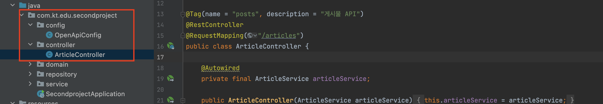  

<br/>

../controller/ArticleController.java
```java
ArticleController.java 
...
@Tag(name = "posts", description = "게시물 API")
@RestController
@RequestMapping("/articles")
public class ArticleController {

    @Autowired
    private final ArticleService articleService;

    public ArticleController(ArticleService articleService) {
        this.articleService = articleService;
    }

    @GetMapping
    @Operation(summary ="게시물 전체 조회",description="제목과 내용 전체를 조회 합니다.")
    public List<Article> findAll() {
        return this.articleService.findAll();
    }
```  

<br/>

Tag , Schema , Operation annotation을 추가하고 SpringBoot를 기동한다.    

웹브라우저에서 http://localhost:8080/swagger-ui/index.html 를 입력하면 swagger ui를 확인 할 수 있다.  

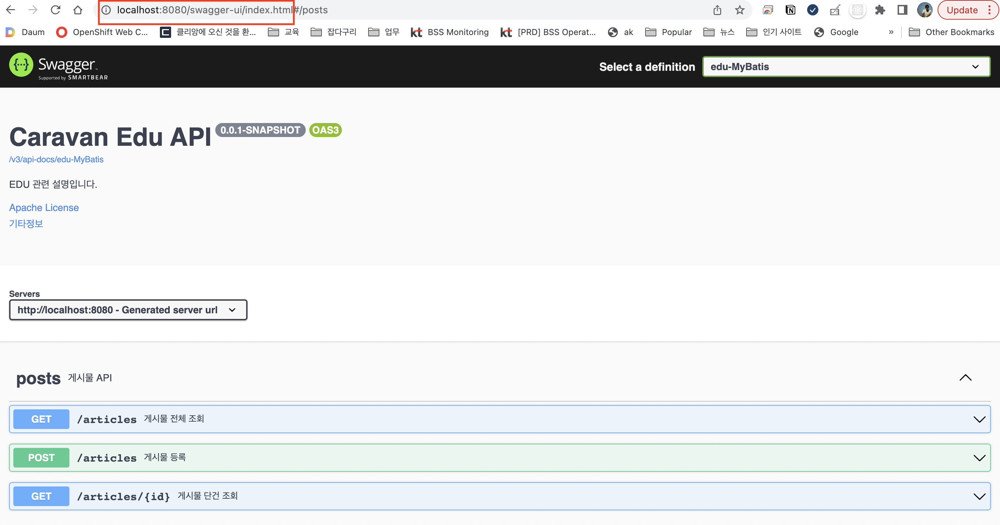  

<br/>

웹브라우저에서 http://localhost:8080/articles 를 입력을 하고 실행을 한다.  

IntelliJ로 이동하면 console 창에 아래와 같이 로그를 확인 할 수 있다.  

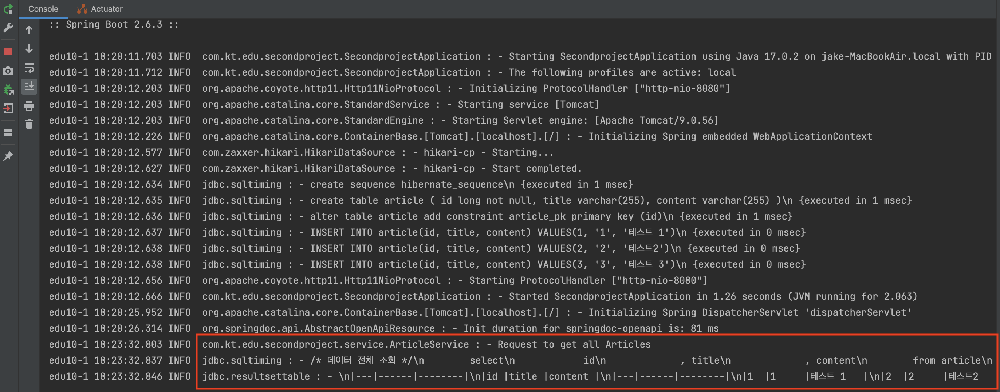  

<br/>
 
또한 logs 폴더에 가면 edu.log 화일이 생성 된 것을 볼 수 있다.  

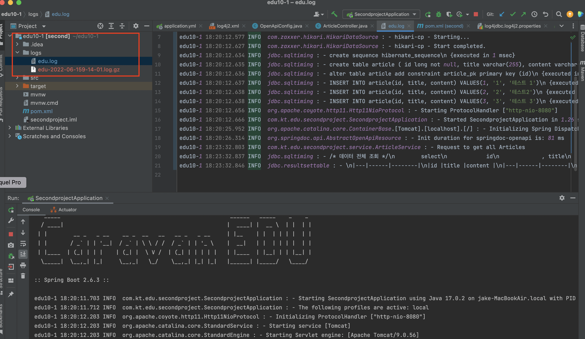  

<br/>

소스는 아래를 참고 한다.  
- https://github.com/shclub/edu10-1


<br/>

### Springbean을 등록하는 2가지 방식   

<br/>

참고 : https://dev-coco.tistory.com/69