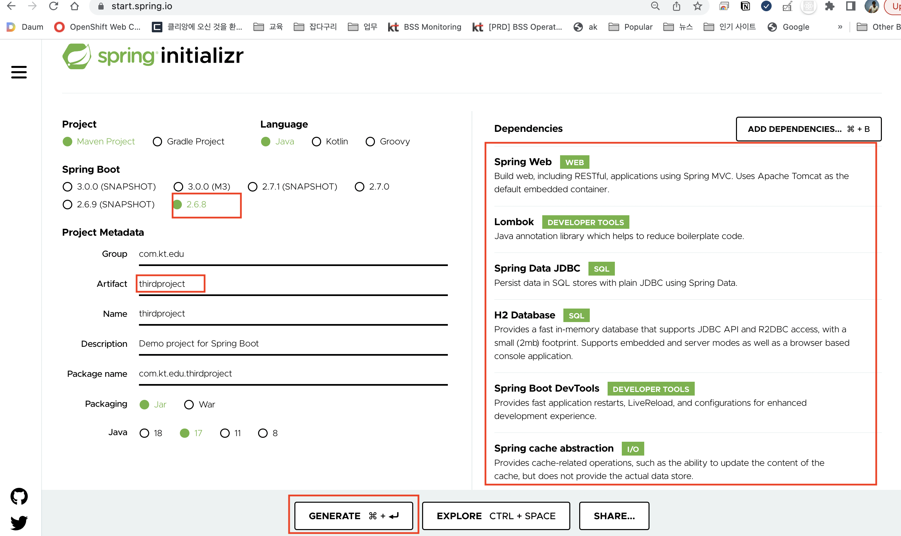
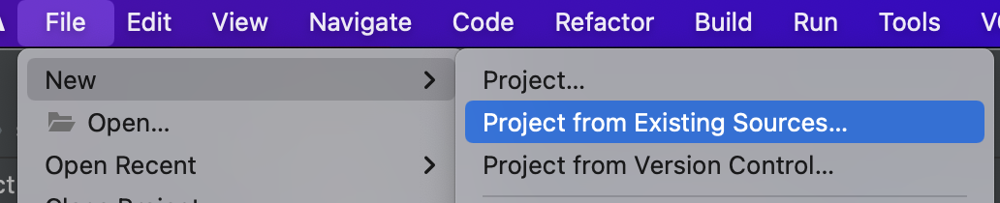
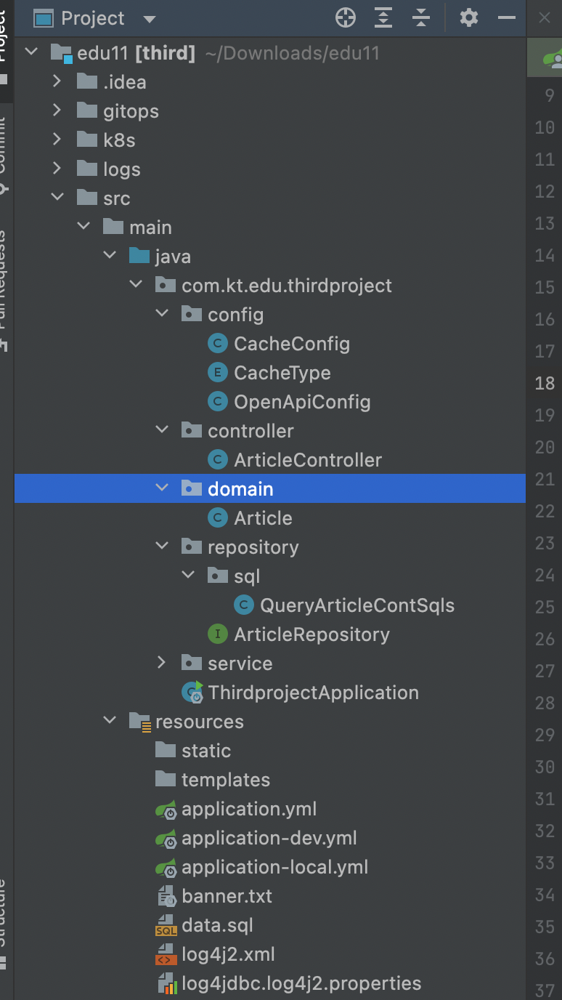
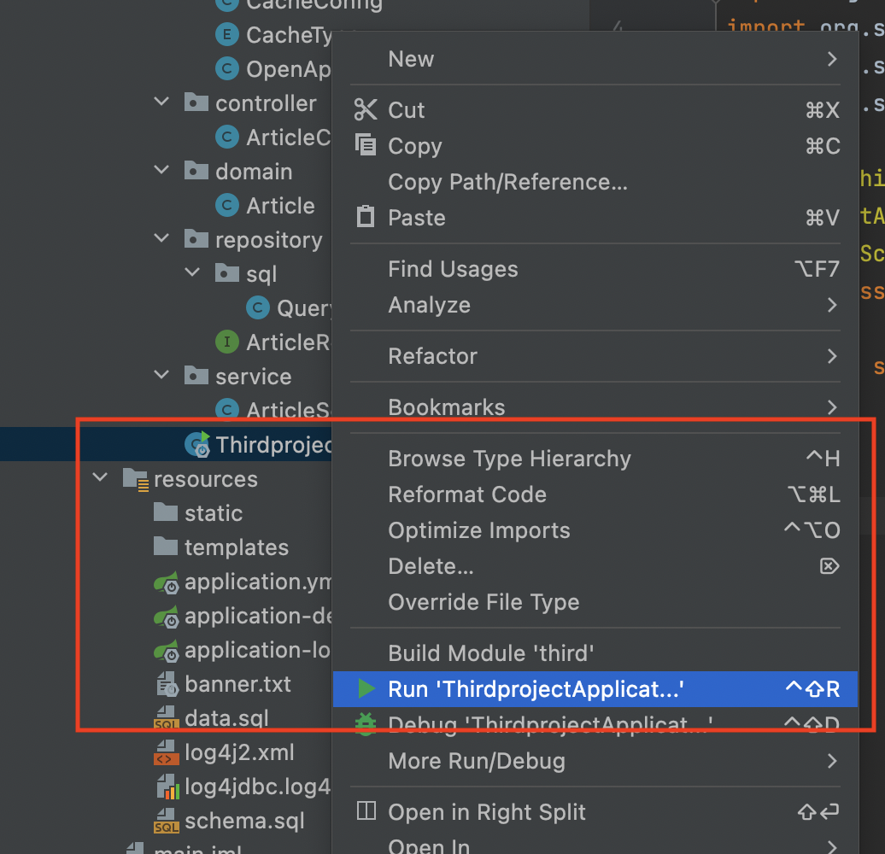
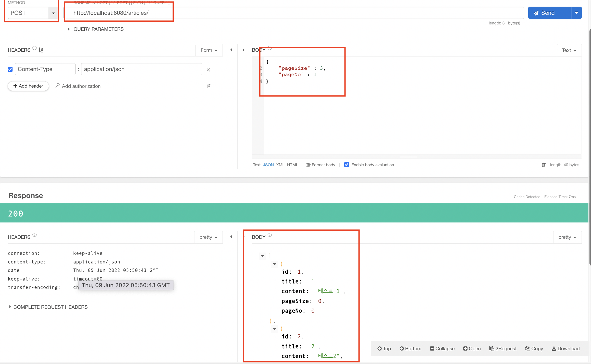
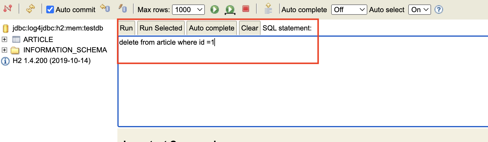
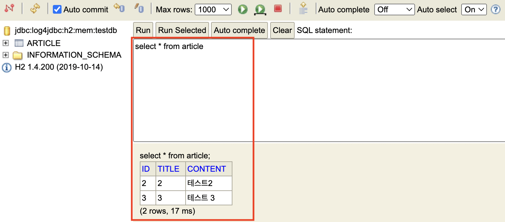
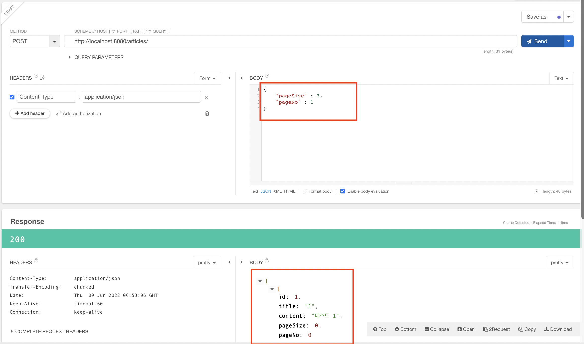

#  Spring Data JDBC Hands-on 
 
Spring Data JDBC 활용 방법에 대해서 실습한다.  


1. 프로젝트 생성 및 환경 설정

2. 프로젝트 구성하기 

3. 실행해보기

4. SQL문 로그 보기

5. 소스위치 : https://github.com/shclub/edu11


<br/>

## Spring Data JDBC 실습

<br/>

### Spring Data JDBC란?

Spring Data JDBC는 데이터와 java object를 연계하기 위해 제공되는 Spring Data의 라이브러리 중 하나이다.  

(DB를 연결하여 사용하기 위해 제공되는 Spring JDBC와 다른 라이브러리이다.)

Spring Data JPA가 가진 복잡한 부분을 많이 덜어내어 가볍게 DB를 조회하는 것에 초점을 둔 라이브러리라고 볼 수 있다.  

기본적으로 JdbcTemplate을 제공하여 db를 조회할 수 있게 하고 transactionManager를 기존과 동일하게 지원한다.  

하지만 Spring Data JPA가 제공하는 hibernate 기반 영속성이나 1,2차 캐시, ddl auto create 같은 schema 관리를 지원하지 않는다.  


있으면 좋지만 깊게 사용하지 않는다면 불필요한 것들을 모두 걷어내고 경량화하여 query를 만들고 domain에 mapping 하는 것만 중점을 두었다.  

JdbcTemplate을 직접 사용하여 queryForObject 같은 method를 사용할 수도 있지만 repository를 통한 query method 같은 Spring Data의 편리한 기능을 사용할 수 있다.  

<br/>

pom 파일에 아래 의존성이 추가 된다.  

pom.xml
```xml
<!-- spring data jdbc -->
		<dependency>
			<groupId>org.springframework.boot</groupId>
			<artifactId>spring-boot-starter-data-jdbc</artifactId>
		</dependency>
```  

spring-boot-starter-data-jdbc 의존성과 사용할 db client를 추가하면 된다.  

이렇게 추가되는 각 db별 client를 spring data에서 사용할 수 있도록 해주는 dialect를 제공해준다.  

현재 Spring Data JDBC는 다음과 같은 db에 대한 dialect를 제공한다.  

- DB2
- H2
- HSQLDB
- MariaDB
- Microsoft SQL Server
- MySQL
- Oracle
- Postgres  

<br/>

만약 위에 해당하지 않는 db를 Spring Data JDBC에서 사용하려면 해당 db client에 대한 dialect를 별도로 만들어 사용하면 된다.

<br/>

### Spring Data JPA vs Spring Data JDBC

- Spring Data JPA
    - entity의 변화를 추적하여 lazy loading을 제공함
        - lazy loading: 필요 시점까지 리소스 로딩을 연기하다가 필요할 때 로딩하는 것
- Spring Data JDBC
    - entity가 로드되는 시점에 SQL문이 실행되고 entity 로딩이 완료됨
    - dirty tracking(상태 변경을 추적)이나 session이 없음 → JPA와 다르게 수정을 하고 저장하지 않으면 변경이 반영되지 않음

참고
- https://luvstudy.tistory.com/174
- https://blog.neonkid.xyz/275
- https://blog.neonkid.xyz/276?category=814055
- https://velog.io/@janeljs/Spring-Data-JDBC-1
- https://youtu.be/AnIouYdwxo0 ( springOne 2018 )
- https://wave1994.tistory.com/182 ( caffeine cache )
<br/>


### 프로젝트 생성 및 환경 설정   

<br/>

웹브라우저에서 https://start.spring.io/ 접속하여 아래와 같이 라이브러리를 추가하여 신규 프로젝트를 생성한다.  

 

<br/>

thirdproject.zip으로 다운 받은 화일의 압축을 풀고   
IntelliJ 메뉴 File > New > Project from Existing Sources 으로 이동하여 프로젝트를 선택하여 오픈 한다.    

 

<br/>

사내 환경에 맞추기 위하여 pom.xml 을 오픈 한 후 springboot 버전을  2.6.3 으로 변경 한다.  

pom 파일에 의존성을 아래와 같이 추가한다.  

pom.xml
```xml
	<dependencies>
		<dependency>
			<groupId>org.springframework.boot</groupId>
			<artifactId>spring-boot-starter-web</artifactId>
			<exclusions>
				<exclusion>
					<groupId>org.springframework.boot</groupId>
					<artifactId>spring-boot-starter-logging</artifactId>
				</exclusion>
			</exclusions>
		</dependency>
		<!-- mybatis
		<dependency>
			<groupId>org.mybatis.spring.boot</groupId>
			<artifactId>mybatis-spring-boot-starter</artifactId>
			<version>2.2.2</version>
		</dependency> -->
		<!-- cache -->
		<dependency>
			<groupId>org.springframework.boot</groupId>
			<artifactId>spring-boot-starter-cache</artifactId>
		</dependency>
		<!-- caffeine cache -->
		<dependency>
			<groupId>com.github.ben-manes.caffeine</groupId>
			<artifactId>caffeine</artifactId>
			<version>2.6.2</version>
		</dependency>

		<!-- spring data jdbc -->
		<dependency>
			<groupId>org.springframework.boot</groupId>
			<artifactId>spring-boot-starter-data-jdbc</artifactId>
		</dependency>

		<!-- devtools -->
		<dependency>
			<groupId>org.springframework.boot</groupId>
			<artifactId>spring-boot-devtools</artifactId>
			<scope>runtime</scope>
			<optional>true</optional>
		</dependency>

		<dependency>
			<groupId>com.h2database</groupId>
			<artifactId>h2</artifactId>
			<scope>runtime</scope>
		</dependency>
		<dependency>
			<groupId>org.projectlombok</groupId>
			<artifactId>lombok</artifactId>
			<optional>true</optional>
		</dependency>

		<!-- Open API 3 -->
		<dependency>
			<groupId>org.springdoc</groupId>
			<artifactId>springdoc-openapi-ui</artifactId>
			<version>1.6.6</version>
		</dependency>

		<dependency>
			<groupId>org.springframework.boot</groupId>
			<artifactId>spring-boot-starter-test</artifactId>
			<scope>test</scope>
		</dependency>

		<!-- spring log4j2 -->
		<dependency>
			<groupId>org.springframework.boot</groupId>
			<artifactId>spring-boot-starter-log4j2</artifactId>
		</dependency>

		<!-- log4jdbc -->
		<dependency>
			<groupId>org.bgee.log4jdbc-log4j2</groupId>
			<artifactId>log4jdbc-log4j2-jdbc4.1</artifactId>
			<version>1.16</version>
		</dependency>
	</dependencies>
```  


<br/>

JPA와 유사 하지만 db table 를 직접 만들어 주지 않는다.  

초기 서버 기동시 DB 데이트를 생성하기 위해서 resources 폴더 밑에 schema.sql 과 data.sql 화일을 생성한다.  

테이블 생성 schema.sql  

```sql  
create sequence hibernate_sequence;

create table article
(
    id              long    not null,
    title         	varchar(255),
    content         varchar(255)
);

alter table article add constraint article_pk primary key (id);  
```  


데이터 생성 data.sql  

```sql  
INSERT INTO article(id, title, content) VALUES(1, '1', '테스트 1');
INSERT INTO article(id, title, content) VALUES(2, '2', '테스트2');
INSERT INTO article(id, title, content) VALUES(3, '3', '테스트 3');
```  

<br/>

application.yml 화일에 기본  설정을 한다.  

../resources/application.yml  
```bash 
server:
  tomcat:
    url-encoding: UTF-8
  servlet:
    context-path: /
spring:
  application:
    name: edu-spring-data-jdbc
  profiles:
    active: local
  banner:
    location: "classpath:banner.txt"
# cache 적용을 위한 설정
  cache:
    cache-names: articles
# logging
logging:
  config: classpath:log4j2.xml
# actuator
management:
  endpoints:
    web:
      exposure:
        include: "*"
  endpoint:
    shutdown:
      enabled: true
    health:
      show-details: always


# app
app-info:
  app-name: "edu-spring-data-jdbc"
  title: "Caravan Edu API"
  build:
    version: '@project.version@'
    timestamp: '@app.build.timestamp@'
  user-id: "jakelee"
  org-id: "my-home"
  desc: "EDU 관련 설명입니다."
  doc-url: "https://github.com/shclub/edu/"
  license: "Apache License"
  license_url: "https://github.com/shclub/edu/"
  version: "@app.build.timestamp@"
  doc-desc: "기타정보"
```

<br/>

환경별 설정을 추가한다.  ( dev )

../resources/application-dev.yml  
```bash
##############
### dev
##############
server:
  port: 8080
  servlet:
    context-path: /
  tomcat:
    connection-timeout: 5s
    max-connections: 1000
    accept-count: 20
    threads:
      max: 200
spring:
  h2:
    # h2 DB
    console:
      enabled: true
      path: /h2-console
  # Database Platform
  sql:
    init:
      platform: h2
      mode: embedded
  datasource:
    driverClassName: net.sf.log4jdbc.sql.jdbcapi.DriverSpy
    url: jdbc:log4jdbc:h2:mem:testdb #jdbc:log4jdbc:tibero:thin:@localhost:8640:POCICISORDDB
    username: sa
    password:
    # h2 DB
    generate-unique-name: false
    hikari:
      pool-name: hikari-cp
      maximum-pool-size: 30
      minimum-idle: 2
      data-source-properties:
        cachePrepStmts: true
        prepStmtCacheSize: 250
        prepStmtCacheSqlLimit: 2048
        useServerPrepStmts: true

springdoc:
  swagger-ui:
    operations-sorter: alpha
    tags-sorter: alpha
    disable-swagger-default-url: true
    doc-expansion: none

logging:
  level:
    com.kt.edu: trace
```

<br/>

환경별 설정을 추가한다.  ( local )

../resources/application-local.yml  
```bash
##############
### local
##############
server:
  port: 8080
spring:
  h2:
    # h2 DB
    console:
      enabled: true
      path: /h2-console
  # Database Platform
  sql:
    init:
      platform: h2
      mode: embedded
  datasource:
    driverClassName: net.sf.log4jdbc.sql.jdbcapi.DriverSpy
    url: jdbc:log4jdbc:h2:mem:testdb #jdbc:log4jdbc:tibero:thin:@localhost:8640:POCICISORDDB
    username: sa
    password:
    # h2 DB
    generate-unique-name: false
    hikari:
      pool-name: hikari-cp
      maximum-pool-size: 30
      minimum-idle: 2
      data-source-properties:
        cachePrepStmts: true
        prepStmtCacheSize: 250
        prepStmtCacheSqlLimit: 2048
        useServerPrepStmts: true


# app
app-info:
  node-ip: "192.168.0.1"
  pod-ip: "192.168.0.1"
  pod-name: "test"
  app-name: "edu11"

springdoc:
  swagger-ui:
    operations-sorter: alpha
    tags-sorter: alpha
    disable-swagger-default-url: true
    doc-expansion: none

logging:
  level:
    com.kt.edu: trace
```  

<br/>

### 프로젝트 구성하기     

<br/>

프로젝트 이름에서 마우스 오른쪽을 클릭하고  New -> Package를 선택하여 6개의 package를 만든다.  

- config
- controller
- domain
- repository
- repository/sql
- service


 

<br/>

이번 실습에서는 Cache 실습을 진행을 합니다.  
Cache 로는 local cache인 caffeine 캐쉬를 사용을 합니다.  

<br/>

config 패키지에 CacheConfig 와 CacheType 클래스를 생성합니다.  

../config/CacheConfig.java 
```java
package com.kt.edu.thirdproject.config;

import java.util.Arrays;
import java.util.List;
import java.util.concurrent.TimeUnit;
import java.util.stream.Collectors;

import org.springframework.cache.CacheManager;
import org.springframework.cache.caffeine.CaffeineCache;
import org.springframework.cache.support.SimpleCacheManager;
import org.springframework.context.annotation.Bean;
import org.springframework.context.annotation.Configuration;

import com.github.benmanes.caffeine.cache.Caffeine;

@Configuration
public class CacheConfig {

    @Bean
    public CacheManager cacheManager() {
        List<CaffeineCache> caches = Arrays.stream(CacheType.values())
                .map(cache -> new CaffeineCache(cache.getCacheName(), Caffeine.newBuilder().recordStats()
                                .expireAfterWrite(cache.getExpireAfterWrite(), TimeUnit.SECONDS)
                                .maximumSize(cache.getMaximumSize())
                                .build()
                        )
                )
                .collect(Collectors.toList());

        SimpleCacheManager cacheManager = new SimpleCacheManager();
        cacheManager.setCaches(caches);

        return cacheManager;
    }

}
```  

<br/>

../config/CacheType.java 
```java
package com.kt.edu.thirdproject.config;

import lombok.Builder;
import lombok.Getter;

@Getter
public enum CacheType {
    // cache를 적용할 method 이름을 기록합니다.
    // 캐쉬 갱신 시간은 30분
    ARTISTS("articles", 5 * 60, 10000);

    private String cacheName;
    private int expireAfterWrite;
    private int maximumSize;

    CacheType(String cacheName, int expireAfterWrite, int maximumSize) {
        this.cacheName = cacheName;
        this.expireAfterWrite = expireAfterWrite;
        this.maximumSize = maximumSize;
    }

}
```  

<br/>
swagger config 클래스를 생성합니다.

<br/>

../config/OpenApiConfig.java 
```java
package com.kt.edu.thirdproject.config;

import org.springdoc.core.GroupedOpenApi;
import org.springframework.beans.factory.annotation.Value;
import org.springframework.context.annotation.Bean;
import org.springframework.context.annotation.Configuration;
import org.springframework.context.annotation.Profile;
import io.swagger.v3.oas.models.ExternalDocumentation;
import io.swagger.v3.oas.models.OpenAPI;
import io.swagger.v3.oas.models.info.Info;
import io.swagger.v3.oas.models.info.License;

@Configuration
public class OpenApiConfig {

    @Value("${spring.application.name}")
    private String group;

    @Value("${app-info.title}")
    private String title;

    @Value("${app-info.desc}")
    private String desc;

    @Value("${app-info.build.version}")
    private String version;

    @Value("${app-info.license}")
    private String license;

    @Value("${app-info.license-url}")
    private String licenseUrl;

    @Value("${app-info.doc-desc}")
    private String docDesc;

    @Value("${app-info.doc-url}")
    private String docUurl;

    @Profile({"local", "dev"})
    @Bean
    public GroupedOpenApi openApi() {
        String[] paths = {"/**"};
        return GroupedOpenApi.builder().group(group).pathsToMatch(paths).build();
    }

    @Bean
    public OpenAPI springShopOpenAPI() {
        return new OpenAPI()
                .info(new Info().title(title)
                        .description(desc)
                        .version(version)
                        .license(new License().name(license).url(licenseUrl)))
                .externalDocs(new ExternalDocumentation()
                        .description(docDesc)
                        .url(docUurl));
    }

}
```


<br/>

controller 패키지에 ArticleController 를 RestController 로 생성합니다.  

../controller/ArticleController.java  
```java
package com.kt.edu.thirdproject.controller;

import com.kt.edu.thirdproject.domain.Article;
import com.kt.edu.thirdproject.service.ArticleService;
import io.swagger.v3.oas.annotations.Operation;
import io.swagger.v3.oas.annotations.tags.Tag;
import lombok.RequiredArgsConstructor;
import org.springframework.cache.annotation.Cacheable;
import org.springframework.web.bind.annotation.*;

import java.util.List;

@Tag(name = "posts", description = "게시물 API")
@RestController
@RequiredArgsConstructor
@RequestMapping("/articles")
public class ArticleController {

    private final ArticleService articleService;
    
    // cache 사용
    @Cacheable(cacheNames = "articles")
    @PostMapping  // page 단위로 조회하기 위해 post 사용
    @Operation(summary ="게시물 전체 조회",description="제목과 내용 전체를 조회 합니다.")
    public List<Article> findAll(@RequestBody Article article) {
        return this.articleService.retvByPage(article.getPageSize(),article.getPageNo());
    }
}
```

<br/>

domain 패키지에 Article DTO 를 생성한다.  

../domain/Article.java
```java
package com.kt.edu.thirdproject.domain;

import io.swagger.v3.oas.annotations.media.Schema;
import lombok.*;

@Data
@Builder
@AllArgsConstructor
@NoArgsConstructor
@Schema(description = "게시물 DTO")
public class Article {
    @Schema(description = "순서")
    private Long id;
    @Schema(description = "게시물 제목")
    private String title;
    @Schema(description = "게시물 내용")
    private String content;
    // page 조회를 위해 2개 필드 추가
    @Schema(description = "페이지크기")
    private int pageSize;
    @Schema(description = "페이지번호")
    private int pageNo;
}
```
 
<br/>

repository 패키지에 ArticleRepository Interface 를 생성한다.    

페이지별 조회를 위해 PagingAndSortingRepository 를 상속 받아서 사용합니다.  

<br/>

../repository/ArticleRepository.java
```java
package com.kt.edu.thirdproject.repository;

import com.kt.edu.thirdproject.domain.Article;
import org.springframework.data.jdbc.repository.query.Query;
import org.springframework.data.repository.PagingAndSortingRepository;
import org.springframework.stereotype.Repository;
import com.kt.edu.thirdproject.repository.sql.QueryArticleContSqls;

import java.util.List;

@Repository
public interface ArticleRepository extends PagingAndSortingRepository<Article, Integer> {

    @Query(QueryArticleContSqls.RETV_ARTICLES_PAGE)
    List<Article> retvByPage(int pageSize, long offset);
}
```  

repository/sql 패키지에 sql 문을 생성하기 위한 class를 생성합니다.  


../repository/sql/QueryArticleContSqls.java
```java
package com.kt.edu.thirdproject.repository.sql;

public class QueryArticleContSqls {

    public static final String RETV_ARTICLES_PAGE="""
           SELECT  id, title,  content 
           FROM 
             article 
           WHERE id between :offset and (:offset + :pageSize -1 )
                  """;

    public static final String RETV_ARTICLE_PAGE="""
     SELECT * FROM article 
           """;
}
```  

<br/>

service 패키지에 ArticleService class 를 생성한다.  

<br/>

../service/ArticleService.java  
```java
package com.kt.edu.thirdproject.service;

import com.kt.edu.thirdproject.domain.Article;
import com.kt.edu.thirdproject.repository.ArticleRepository;
import lombok.extern.slf4j.Slf4j;
import org.springframework.beans.factory.annotation.Autowired;
import org.springframework.data.domain.PageRequest;
import org.springframework.stereotype.Service;
import org.springframework.transaction.annotation.Transactional;

import java.util.List;

@Service
@Transactional
@Slf4j
public class ArticleService {

    @Autowired
    private ArticleRepository articleRepository;

    /*public Article create(Article article) {
        log.info("Request to create Article : " +  article);
        //articleRepository.insert(article);
        return article;
    }*/

    public List<Article> retvByPage(int pageSize , int pageNo) {
        PageRequest pageRequest = PageRequest.of((pageNo -1),pageSize);
        log.info("Request to get all Articles");
        return articleRepository.retvByPage(pageRequest.getPageSize(),pageRequest.getOffset()+1 );
    }
}
```

<br/>

cache 사용을 위해서 main 함수에 아래와 같이 annotation을 추가 합니다.  


../ThirdprojectApplication.java    
```java
package com.kt.edu.thirdproject;

import org.springframework.boot.SpringApplication;
import org.springframework.boot.autoconfigure.SpringBootApplication;
import org.springframework.cache.annotation.EnableCaching;
import org.springframework.context.annotation.ComponentScan;

//cache 사용
@EnableCaching
@SpringBootApplication
@ComponentScan("com.kt")
public class ThirdprojectApplication {

	public static void main(String[] args) {
		SpringApplication.run(ThirdprojectApplication.class, args);
	}

}
```  

<br/>

resources 폴더에 추가적으로 3개 화일을 생성합니다.  

<br/>

배너를 추가합니다.  

../resources/banner.txt    
```bash
   _____                                                    ______   _____    _    _
  / ____|                                                  |  ____| |  __ \  | |  | |
 | |        __ _   _ __    __ _  __   __   __ _   _ __     | |__    | |  | | | |  | |
 | |       / _` | | '__|  / _` | \ \ / /  / _` | | '_ \    |  __|   | |  | | | |  | |
 | |____  | (_| | | |    | (_| |  \ V /  | (_| | | | | |   | |____  | |__| | | |__| |
  \_____|  \__,_| |_|     \__,_|   \_/    \__,_| |_| |_|   |______| |_____/   \____/

:: Spring Boot ${spring-boot.version} ::
```  

<br/> 

log4j2 설정을  추가합니다.  

../resources/log4j2.xml  
```xml
<?xml version="1.0" encoding="UTF-8"?>
<Configuration status="INFO">

    <Properties>
        <Property name="logFileName">edu10-1</Property>
        <!-- 디폴트 로깅시-->
        <Property name="consoleLayout">${logFileName} %d{HH:mm:ss.SSS} %-5level %c : - %enc{%msg}{CRLF} %n%throwable</Property>
        <!-- <Property name="consoleLayout">${logFileName} %style{%d{ISO8601}}{black} %highlight{%-5level }[%style{%t}{bright,blue}] %style{%C{1.}}{bright,yellow}: - %msg%n%throwable</Property> -->
        <!-- 로깅 마스킹 -->
        <Property name="fileLayout">${logFileName} %d{HH:mm:ss.SSS} %-5level %c : - %enc{%msg}{CRLF} %n</Property>
        <!-- <Property name="fileLayout">%d [%t] %-5level %c(%M:%L) - %spi%n</Property> -->
        <Property name="baseDir">logs</Property>

    </Properties>

    <Appenders>
        <Console name="console" target="SYSTEM_OUT">
            <PatternLayout pattern="${consoleLayout}" />
        </Console>
        <Async name="file" bufferSize="200">
            <AppenderRef ref="RollingAppender" />
        </Async>
        <RollingFile name="RollingAppender"
                     fileName="${baseDir}/edu.log"
                     filePattern="${baseDir}/edu-%d{yyyy-MM-DD-HH}-%02i.log.gz" append="true"
                     ignoreExceptions="false">
            <PatternLayout>
                <Pattern>${fileLayout}</Pattern>
            </PatternLayout>
            <Policies>
                <OnStartupTriggeringPolicy />
                <SizeBasedTriggeringPolicy size="40MB" />
                <TimeBasedTriggeringPolicy />
            </Policies>
            <DefaultRolloverStrategy>
                <Delete basePath="${baseDir}" maxDepth="2">
                    <IfFileName glob="*/edu-*.log.gz" />
                    <IfLastModified age="1d" />
                </Delete>
            </DefaultRolloverStrategy>
        </RollingFile>
    </Appenders>

    <Loggers>
        <!-- 스프링 프레임워크에서 찍는건 level을 info로 설정 -->
        <logger name="org.springframework" level="info" additivity="false" >
            <AppenderRef ref="console" />
            <AppenderRef ref="file" />
        </logger>
        <!-- rolling file에는 debug, console에는 info 분리하여 처리 가능하다. -->
        <logger name="com.kt.edu" additivity="false" >
            <AppenderRef ref="console" level="info" />
            <AppenderRef ref="file" level="debug"/>
        </logger>

        <logger name="org.springframework" level="warn" additivity="false" >
            <AppenderRef ref="console" level="info" />
        </logger>
        <logger name="jdbc.audit" level="warn" additivity="false" >
            <AppenderRef ref="console" level="info" />
        </logger>

        <!-- connection pool -->
        <logger name="com.zaxxer" level="INFO" additivity="false">
            <appender-ref ref="console"/>
            <appender-ref ref="file"/>
        </logger>
        <logger name="jdbc.connection" level="warn" additivity="false" >
            <AppenderRef ref="console" level="info" />
            <AppenderRef ref="file" level="info" />
        </logger>
        <logger name="org.apache.kafka" level="warn" additivity="false" >
            <AppenderRef ref="console" level="info" />
        </logger>

        <logger name="com.kt.edu" additivity="false" >
            <AppenderRef ref="console" level="info" />
            <AppenderRef ref="file" level="trace" />
        </logger>

        <!--logger name="Slf4jSpyLogDelegator" additivity="false" >
            <AppenderRef ref="console" level="info" />
            <AppenderRef ref="file" level="info" />
        </logger-->

        <logger name="net.sf.log4jdbc.log.slf4j" level="info" additivity="false">
            <appender-ref ref="console" />
            <appender-ref ref="file" />
        </logger>

        <logger name="jdbc.sqlonly" additivity="false" >
            <AppenderRef ref="console" level="error" />
        </logger>

        <logger name="jdbc.sqltiming" additivity="false" >
            <AppenderRef ref="console" level="info" />
            <AppenderRef ref="file" level="info" />
        </logger>

        <logger name="jdbc.resultset" additivity="false" >
            <AppenderRef ref="console" level="error" />
        </logger>

        <logger name="jdbc.resultsettable" level="info" additivity="false" >
            <AppenderRef ref="console" level="info" />
            <AppenderRef ref="file" level="info" />
        </logger>

        <root level="info">
            <AppenderRef ref="console" />
            <AppenderRef ref="file" />
        </root>

    </Loggers>
</Configuration>
```  


log4jdbc.log4j2.properties  설정을  추가합니다.  

<br/>

.../resources/log4jdbc.log4j2.properties    
```bash
log4jdbc.spylogdelegator.name=net.sf.log4jdbc.log.slf4j.Slf4jSpyLogDelegator

log4jdbc.dump.sql.maxlinelength=0
log4j.logger.jdbc.sqltiming=info
```

<br/>

### 실행하기     

<br/>

Main 함수가 있는 class를 마우스 오른쪽 버튼을 클릭하고 Run 메뉴를 선택하여 실행한다.  

  

<br/>

에러가 발생하지 않으면 웹브라우저에서 Talend API 를 통해 아래와 같이 설정하고 send 를 클릭합니다.  

Talend API Tester로 설정값을 입력해 봅니다.    

- Method : post
- URL : http://localhost:8080/articles/
- header : JSON
- BODY : 
    ```json
    {
        "pageSize" : 3,
        "pageNo": "1"
    }
    ```  


  

데이터 3건이 나오는 것을 확인 할 수 있습니다.

<br/>

웹브라우저에서 http://localhost:8080/h2-console 를 통해 DB 접속을 하여 데이터 1건을 삭제 합니다.    

 

<br/> 

데이터를 조회하면 2건만 있는 것을 확인 할 수 있습니다.  

 

<br/> 

우리는 지금 cache를 적용을 했고 DB와 Cache간의 동기화 시간은 30분 이기 때문에 다시 조회하면
전체 데이터가 나와야 합니다.  

 

<br/>
