# vscode  server  설치

web으로 vscode 를 사용하기 위해 서버에 `code-server` 를 설치한다.  
  

1. 설치 및 실행  

2. config.yaml 수정 ( 암호와 포트 변경 )

3. python 설치

4. 폰트 추가 

5. python extension 설치 및 configuration 수정

6. python 실행 결과를 terminal이 아닌 debug console에 출력하기

7. 로그인 페이지의 설정 파일 노출 숨기기

8. font 설정 하기

9. 참고 사이트 
    - 설치 : https://ddochea.tistory.com/172
    - 설정 : https://010000.github.io/post/20210307_install_code-server_linux/ 

<br/>

##  설치 및 실행

<br/>

환경 구성  
- OS: Ubuntu 18.04.6 LTS
- Code-server: 4.3.0
- Python: 3.6.9
- Python Extension : ms-python.python-2020.10.332292344

아래 명령으로 code server를 설치한다.  
- docker 로 설치해도 가능 하지만 docker image 안에 필요한 각종 언어를 설치해야 하고 향후 버전업 하기가 까다로워 직접 서버에 설치한다.    

```bash
curl -fsSL https://code-server.dev/install.sh | sh
```  

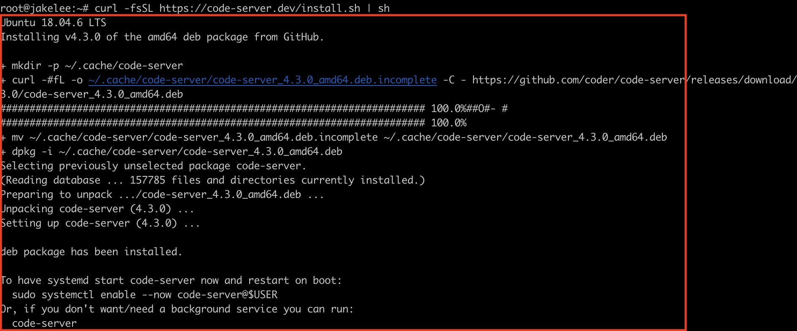  


<br/>

서비스로 실행하기위해 systemctl 명령어로 enable 시켜준다.

해당명령어는 설치시에 `code-server@$USER` 라고 표시하는데 우리는 root 계정을 사용하기 때문에 아래와 같이 실행합니다.  

```bash
root@jakelee:~#systemctl enable --now code-server@root
Created symlink /etc/systemd/system/default.target.wants/code-server@root.service → /usr/lib/systemd/system/code-server@.service.
```  

code-server의 status를 확인한다.  
active (running) 이면 성공적으로 기동이 되어 있는 것을 확인 할 수 있고
기본 포트는 8080 이다.  

```bash
root@jakelee:~#systemctl status code-server@root
```  

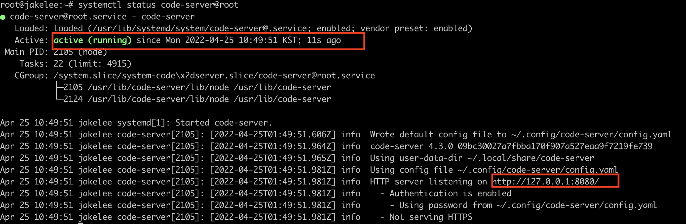


<br/>

##  config.yaml 수정 ( 암호와 포트 변경 )

<br/>

아래 화일을 vi에디터로 오픈하여 포트와 암호를 변경해보자.  

```bash
vi ~/.config/code-server/config.yaml
```  


```bash
# 변경전
bind-addr: 127.0.0.1:8080
auth: password
password: a702fc9ee83e1bfa165ff04e
cert: false
```  

https 연결은 하지 않고 http로만 연결한다.  

```bash
# 변경후
bind-addr: 0.0.0.0:40008  <-- 0.0.0.0은 모든곳에서 접근가능, 포트 변경
auth: password
password: 9302390  <-- 본인이 원하는 암호로 변경
cert: false
```  

<br/>

##  Python 설치

<br/>

code-server를 통하여 Python을 개발 하기 위해서는 서버에 Python 이 설치되어야 한다.  

```bash
apt-get install -y python3 python3-pip pylint3
root@jakelee:~# apt-get install -y python3 python3-pip pylint3
Reading package lists... Done
Building dependency tree
Reading state information... Done
python3 is already the newest version (3.6.7-1~18.04).
The following additional packages will be installed:
  blt dh-python libexpat1-dev libpython3-dev libpython3.6-dev libtcl8.6 libtk8.6 libxss1 python-pip-whl python3-astroid python3-crypto python3-dev python3-distutils
  python3-isort python3-keyring python3-keyrings.alt python3-lazy-object-proxy python3-lib2to3 python3-logilab-common python3-mccabe python3-secretstorage
  python3-setuptools python3-tk python3-wheel python3-wrapt python3-xdg python3.6-dev tk8.6-blt2.5
Suggested packages:
  blt-demo tcl8.6 tk8.6 pylint-doc python-crypto-doc gnome-keyring libkf5wallet-bin gir1.2-gnomekeyring-1.0 python-secretstorage-doc python-setuptools-doc tix
  python3-tk-dbg
The following NEW packages will be installed:
  blt dh-python libexpat1-dev libpython3-dev libpython3.6-dev libtcl8.6 libtk8.6 libxss1 pylint3 python-pip-whl python3-astroid python3-crypto python3-dev
  python3-distutils python3-isort python3-keyring python3-keyrings.alt python3-lazy-object-proxy python3-lib2to3 python3-logilab-common python3-mccabe python3-pip
  python3-secretstorage python3-setuptools python3-tk python3-wheel python3-wrapt python3-xdg python3.6-dev tk8.6-blt2.5
0 upgraded, 30 newly installed, 0 to remove and 8 not upgraded.
Need to get 51.1 MB of archives.
After this operation, 101 MB of additional disk space will be used.
```

Python 설치를 확인해본다.  

```bash
root@jakelee:~# python3 --version
Python 3.6.9
root@jakelee:~# pip3 --version
pip 9.0.1 from /usr/lib/python3/dist-packages (python 3.6)
```

<br/>

##  폰트 추가

<br/>

bitstream-vera-sans 폰트 추가 설치 한다.  
폰트 추가를 원하지 않으면 SKIP 한다.  단 code-server 재기동은 해야 한다.  

code-server 로그인 후 settings - font 설정에서 ‘Bitstream Vera Sans Mono’를 제일 앞으로 추가해서 변경  


```bash
root@jakelee:~# apt install ttf-mscorefonts-installer ttf-bitstream-vera
```  

아래와 같이 선택하는 화면이 나오면 TAB키로 이동을하여 ok를 선택하고 Enter키를 누릅니다.  

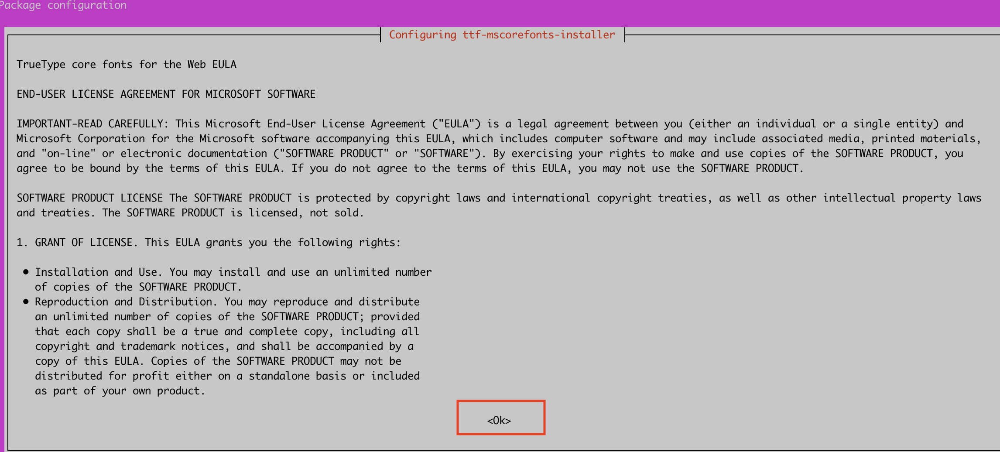  

TAB키를 이동하여 ok를 선택하고 Enter키 입력.  

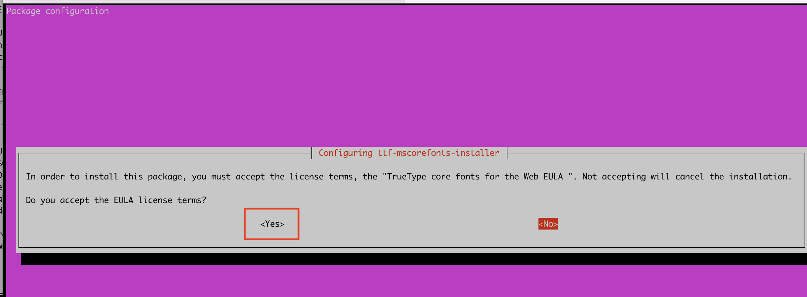  

폰트 설치가 완료가 되면 fontconfig를 설치한다.   

```bash
root@jakelee:~# apt install fontconfig
Reading package lists... Done
Building dependency tree
Reading state information... Done
fontconfig is already the newest version (2.12.6-0ubuntu2).
fontconfig set to manually installed.
The following packages were automatically installed and are no longer required:
  distro-info eatmydata gdisk golang-docker-credential-helpers libeatmydata1 libnetplan0 libsecret-1-0 libsecret-common python-asn1crypto
  python-backports.ssl-match-hostname python-cached-property python-certifi python-cffi-backend python-chardet python-cryptography python-docker python-dockerpty
  python-dockerpycreds python-docopt python-enum34 python-funcsigs python-functools32 python-idna python-ipaddress python-mock python-openssl python-pbr
  python-pkg-resources python-requests python-six python-texttable python-urllib3 python-websocket python-yaml
Use 'apt autoremove' to remove them.
0 upgraded, 0 newly installed, 0 to remove and 8 not upgraded.
```  

폰트를 적용한다.  

```bash
root@jakelee:~# mkfontscale && mkfontdir && fc-cache -fv
/usr/share/fonts: caching, new cache contents: 0 fonts, 2 dirs
/usr/share/fonts/X11: caching, new cache contents: 0 fonts, 2 dirs
/usr/share/fonts/X11/encodings: caching, new cache contents: 0 fonts, 1 dirs
/usr/share/fonts/X11/encodings/large: caching, new cache contents: 0 fonts, 0 dirs
/usr/share/fonts/X11/util: caching, new cache contents: 0 fonts, 0 dirs
/usr/share/fonts/truetype: caching, new cache contents: 0 fonts, 4 dirs
/usr/share/fonts/truetype/dejavu: caching, new cache contents: 22 fonts, 0 dirs
/usr/share/fonts/truetype/liberation: caching, new cache contents: 16 fonts, 0 dirs
/usr/share/fonts/truetype/msttcorefonts: caching, new cache contents: 60 fonts, 0 dirs
/usr/share/fonts/truetype/ttf-bitstream-vera: caching, new cache contents: 10 fonts, 0 dirs
/usr/local/share/fonts: caching, new cache contents: 0 fonts, 0 dirs
/root/.local/share/fonts: skipping, no such directory
/root/.fonts: skipping, no such directory
/var/cache/fontconfig: cleaning cache directory
/root/.cache/fontconfig: not cleaning non-existent cache directory
/root/.fontconfig: not cleaning non-existent cache directory
fc-cache: succeeded
```

모든 설정이 왼료되면 서비스를 재기동하고 status 를 확인한다.  
status 와 포트가 원하는 값으로 변경 되었으면 성공.  

```bash
root@jakelee:~# systemctl restart code-server@root
root@jakelee:~# systemctl status code-server@root
```  


<br/>

## python extension 설치 및 configuration 수정 

<br/>

개발을 위한 폴더를 하나 생성을 합니다.  

```bash
root@jakelee:~# mkdir edu
```  

웹브라우저를 통해서 http://(본인 VM Public IP):40008 로 접속한다.  
비밀번호는 설정한 값을 입력을 하고 submit 버튼을 클릭한다.  

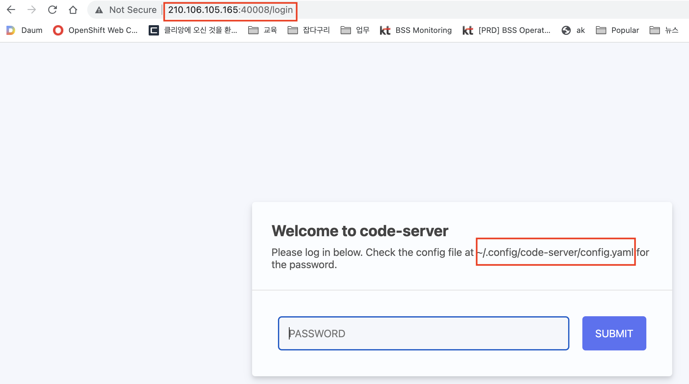  

open folder를 선택하고 위에서 생성한 edu 폴더를 선택한 후 ok를 클릭한다.  

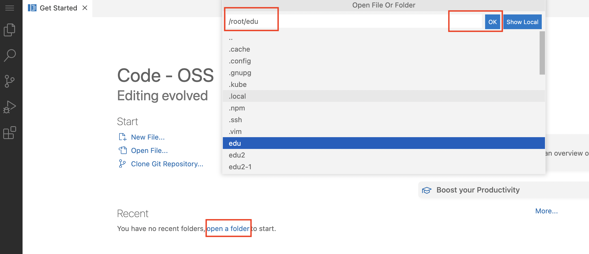   

new file 버튼을 클릭하고 test.py를 생성한다.  

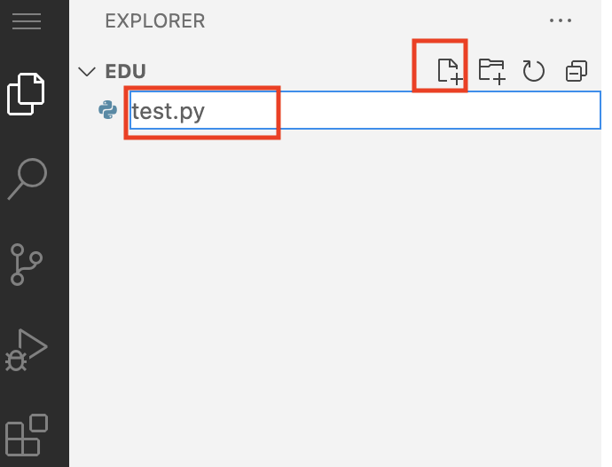  

코드를 생성한다.  

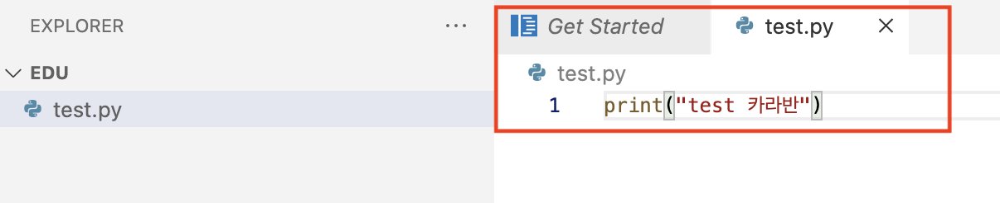  

왼쪽 메뉴중 Run 아이콘을 선택하고 Run and Debug 버튼을 누르면 extension이 없다는 에러가 발생한다.  

Find Python extension을 클릭하면 extension을 설치할 수 있는 화면으로 이동한다.  

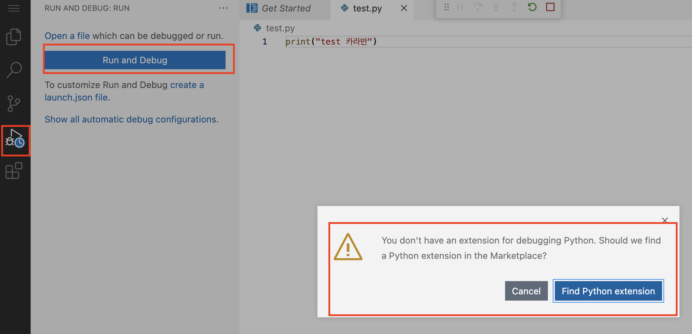  

Python을 선택하고  Install 버튼을 클릭한다.  

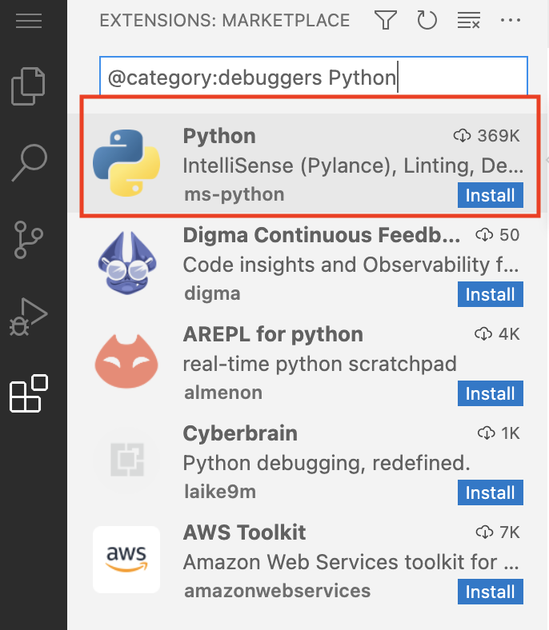  

최신버전으로 설치가 되고 있다.  

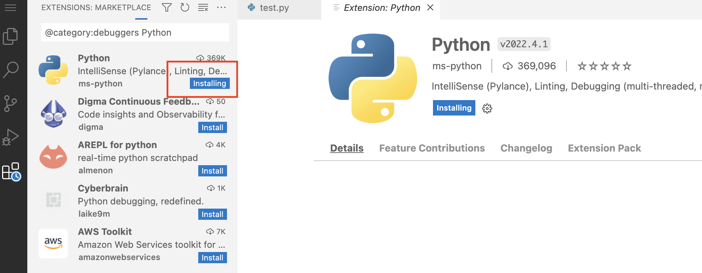  

최신버전으로 Run을 하면 에러가 발생한다.  

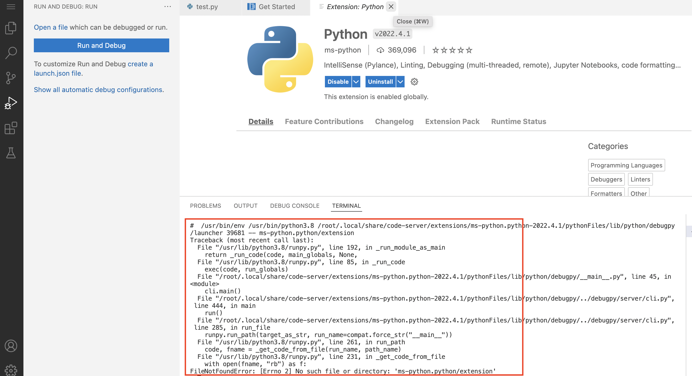  

extension에서  python을 선택한후 오른쪽 버튼을 클릭하여 install Another version을 선택한다.  

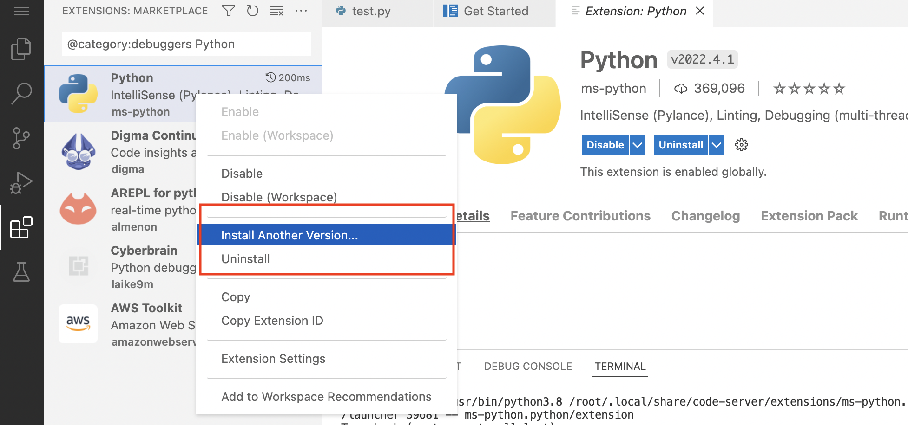  

2020.10.332292344 버전을 선택한다. 2021 버전을 선택하면 안됨.  

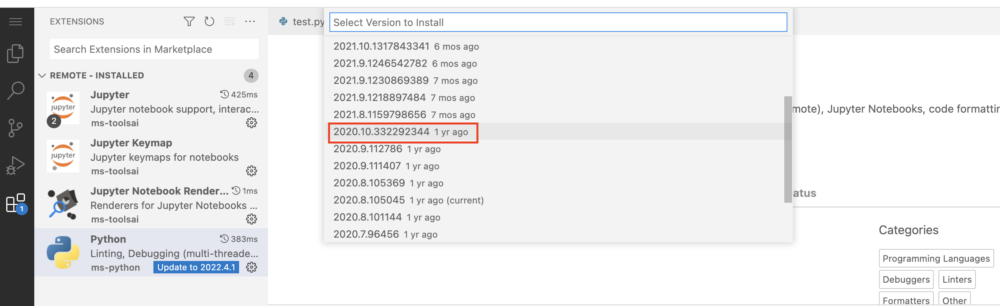  

설치가 완료가 되면 Reload Required를 클릭하여 Reload 한다.  
Reload시간은 20초 이상 소요되기 때문에 기다린다.   

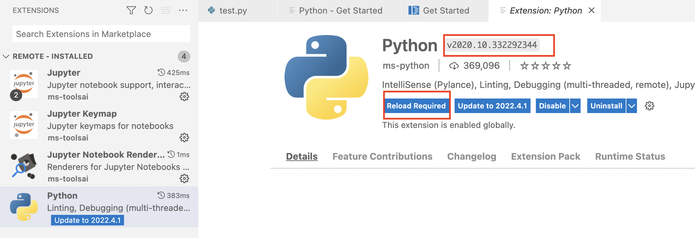  

Run 버튼을 클릭하면 Python files 라는 메뉴가 나오고 해당 메뉴를 선택한다.  

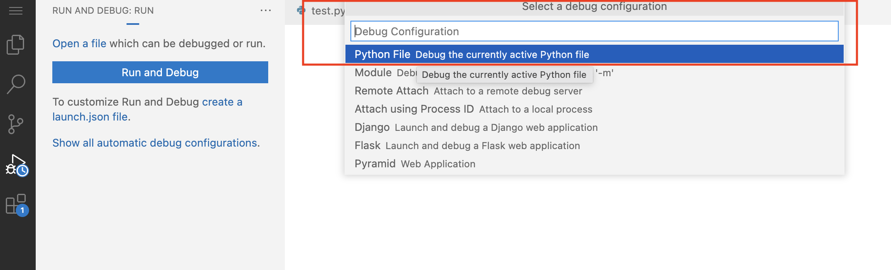  

정상적으로 실행이되면 terminal 창에 Output이 출력된다.  

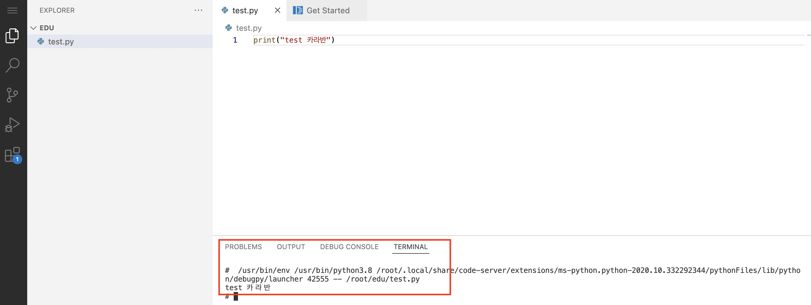  

<br/>

## python 실행 결과를 terminal이 아닌 debug console에 출력하기


<br/>

Run and Debug 밑에 `create a launch.json` 을 클릭한다.  

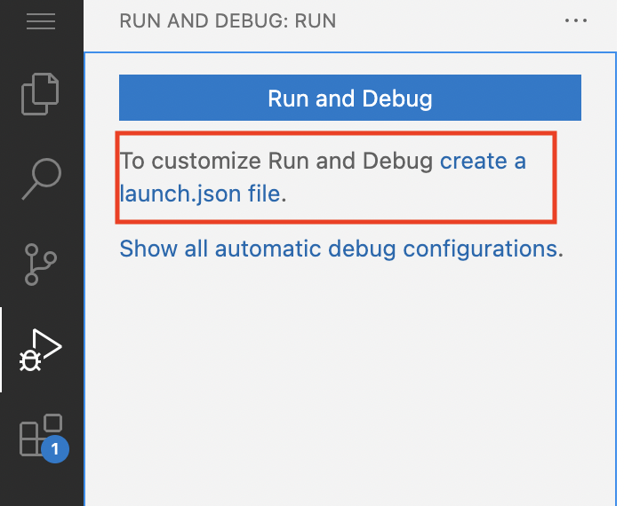  

생성 후에 아래와 같이 수정한다.  

```bash
#[변경 전]  
"console": "integratedTerminal"

#[변경 후]  
"console": "internalConsole"
```  

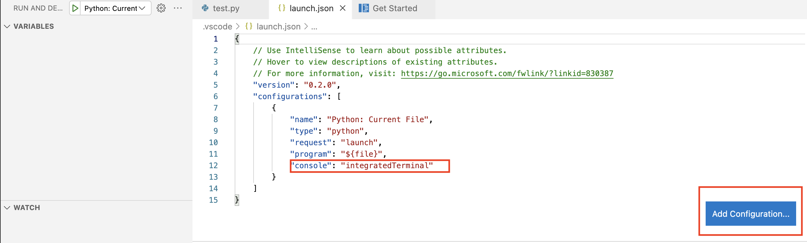   

Debug console로 출력이 되는지 확인한다.  

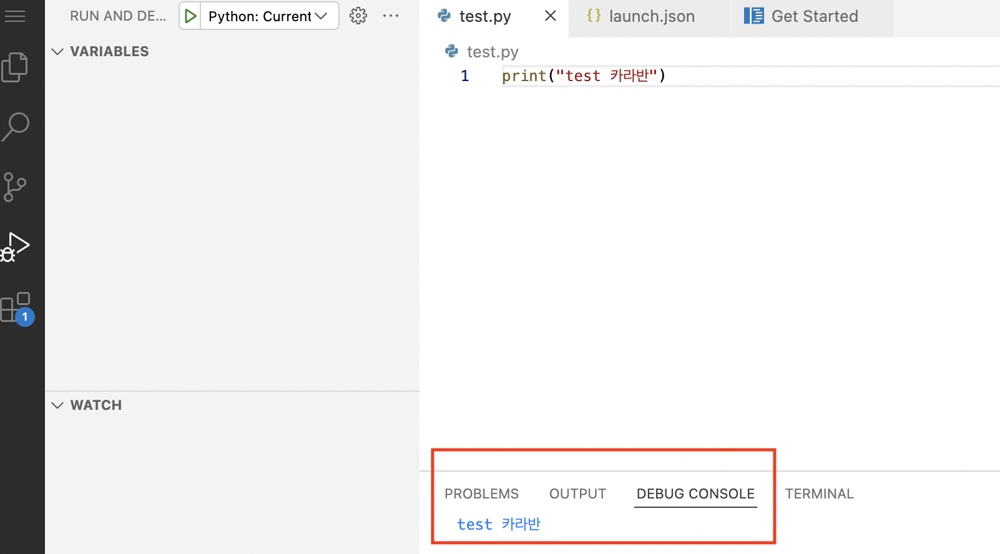  


<br/>

## 로그인 페이지의 설정 파일 노출 숨기기

<br/>

로그인 화면에 아래 처럼 서버의 file 이름이 나오면 보안에 취약할 수 있다.  해당 메시지를 삭제한다.  

```
Welcome to code-server


Please log in below. Check the config file at ~/.config/code-server/config.yaml for the password.
```

vi로 아래 구문을 실행한 후에 PASSWORD_MSG를 삭제한다. 

```bash
root@jakelee:~#vi /usr/lib/code-server/src/browser/pages/login.html
```  

28번 라인에서 삭제  

```bash
# 이전
          <div class="header">
            <h1 class="main">Welcome to code-server</h1>
            <div class="sub">Please log in below. {{PASSWORD_MSG}}</div>
          </div>
# 이후
          <div class="header">
            <h1 class="main">Welcome to code-server</h1>
            <div class="sub">Please log in below. </div>
          </div>
```
<br/>

<br/>

## font 설정하기

<br/>

폰트 설정은 브라우저 왼쪽 하단의 톱니 아이콘을 선택 하고 setting 을 클릭한다.  

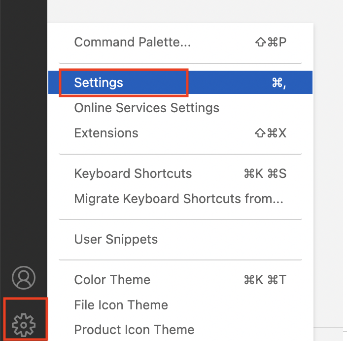  

font로 검색을 하고 우선 순위로 font 이름을 추가한다.  

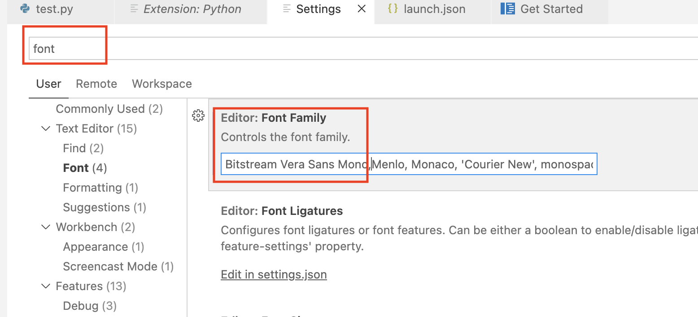    

